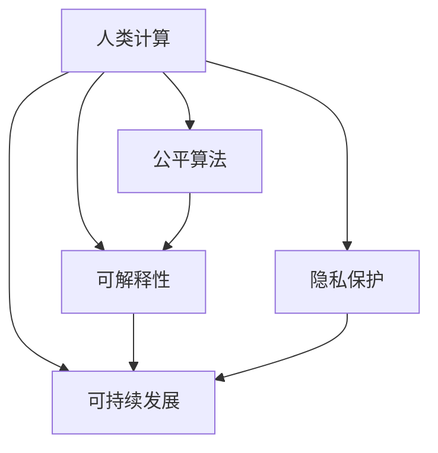

                 

# 科技向善的力量：利用人类计算造福人类

在信息时代，科技不仅是推动经济增长的动力，更是改变人类社会行为的重要力量。特别是进入21世纪以来，以人工智能为代表的智能化技术迅速发展，极大地提升了人类生活和工作效率。然而，科技的双刃剑效应也逐渐显现，算法偏见、信息过载、隐私泄露等问题频发，给社会带来诸多挑战。如何通过科技赋能，更好地造福人类，成为当前科技领域亟需解决的重大课题。

本文将聚焦于"科技向善"的核心议题，探讨利用人类计算（Human-Centric Computing）的思想，通过人工智能技术在健康、教育、环保、社会治理等关键领域的应用，实现科技与伦理的深度融合，推动构建更加公正、透明、高效、可持续的未来社会。

## 1. 背景介绍

### 1.1 问题由来
近年来，科技对社会的影响日益深远。智能算法、机器学习等技术在医疗、教育、交通、金融等领域的广泛应用，极大地提升了人类生活质量和生产效率。然而，与此同时，科技应用中出现的伦理问题也越来越多。如医疗诊断中的算法偏见，导致误诊误治；社交平台上的信息过载，带来心理健康问题；在线交易中的数据隐私泄露，威胁个人安全。这些问题不仅影响了个体福祉，也对社会公平和稳定带来了冲击。

面对科技与伦理的双重挑战，"科技向善"的理念逐渐兴起。科技向善主张在技术创新和应用过程中，坚守道德底线，尊重个体权利，保障社会公平，推动可持续发展。实现科技向善，需要从源头设计、应用、评估等多个层面入手，确保科技发展的每一步都与人类福祉紧密相连。

### 1.2 问题核心关键点
科技向善的核心在于将人类利益作为技术创新的出发点和落脚点。核心关键点包括：

- **伦理审查**：在技术设计之初，就引入伦理考量，确保技术应用的每个环节都符合道德规范。
- **人机协同**：通过人机交互，增强算法的透明性和可解释性，避免"黑盒"模型带来的信任危机。
- **社会公平**：确保技术在分配和使用上的公平性，避免算法偏见和资源分配不均等问题。
- **隐私保护**：在技术应用中严格遵循隐私保护原则，保护用户数据安全。
- **可持续发展**：推动技术应用向环境友好、资源节约方向发展，实现人与自然的和谐共生。

## 2. 核心概念与联系

### 2.1 核心概念概述

为更好地理解科技向善的核心理念，本节将介绍几个密切相关的核心概念：

- **人类计算（Human-Centric Computing）**：强调技术设计和发展以人为中心，将人的需求、权利和幸福作为核心目标。
- **公平算法（Fair Algorithm）**：通过引入公平性约束，确保算法在数据获取、模型训练和结果输出等各个环节均符合伦理原则。
- **可解释性（Explainability）**：要求技术模型具有较高的可解释性，即其决策过程应可被人类理解和解释。
- **隐私保护（Privacy Protection）**：在技术应用中采取严格的隐私保护措施，确保用户数据不被滥用。
- **可持续发展（Sustainable Development）**：推动技术在资源利用和环境保护方面发挥积极作用，实现科技与自然和谐共生。

这些核心概念之间的逻辑关系可以通过以下Mermaid流程图来展示：



这个流程图展示了我们在技术向善中需要关注的几个关键领域，以及它们之间的内在联系。

## 3. 核心算法原理 & 具体操作步骤

### 3.1 算法原理概述

科技向善涉及多个领域的技术原理和算法方法，包括数据预处理、模型训练、评估与优化等。这里将重点介绍基于人类计算的核心算法原理：

- **公平性算法**：通过在算法设计中引入公平性约束，保证模型在训练和测试过程中对各类群体的公平性。常见的方法包括重新加权、对冲、数据增强等。
- **可解释性算法**：通过模型可解释性技术，如特征重要性、局部可解释模型、决策树等，使得模型决策过程透明化，便于用户理解。
- **隐私保护算法**：通过差分隐私、联邦学习、同态加密等技术手段，确保用户数据在处理和使用中的隐私安全。
- **可持续发展算法**：通过引入环境和社会成本的考量，优化资源分配，提升模型在环境友好、资源节约方面的表现。

### 3.2 算法步骤详解

基于人类计算的科技向善主要包括以下几个关键步骤：

**Step 1: 数据准备**
- 收集与人类利益相关的数据集，进行数据清洗和预处理。
- 确保数据来源的多样性，避免算法偏见和过拟合。
- 对敏感数据进行匿名化处理，保护用户隐私。

**Step 2: 算法设计**
- 引入公平性、可解释性、隐私保护等伦理原则，设计公平算法。
- 选择适当的模型结构和优化方法，确保模型在处理人类问题时的有效性和鲁棒性。

**Step 3: 模型训练与评估**
- 使用训练集对模型进行有监督或无监督训练，优化模型参数。
- 在验证集上评估模型性能，确保模型在公平性、隐私保护等方面符合伦理要求。
- 进行参数调整和超参数优化，提高模型效果。

**Step 4: 应用部署与监控**
- 将模型部署到实际应用场景中，进行大规模用户测试。
- 实时监控模型性能和用户反馈，及时发现和修正问题。
- 建立持续改进机制，不断优化模型和应用流程。

### 3.3 算法优缺点

基于人类计算的科技向善方法具有以下优点：
1. **人机协同**：通过人机交互，增强模型的可解释性和用户信任度。
2. **公平性**：引入公平性约束，确保算法在各个环节对各类群体公平。
3. **隐私保护**：通过隐私保护技术，保障用户数据安全。
4. **可持续发展**：引入环境和社会成本的考量，推动资源节约和环境保护。

但该方法也存在一定的局限性：
1. **复杂度**：在模型设计中引入伦理约束，会增加算法设计的复杂度。
2. **效率**：部分伦理约束可能影响模型训练和推理的效率，需要进一步优化。
3. **可解释性**：部分模型结构本身难以解释，对可解释性算法依赖较高。

尽管存在这些局限性，但就目前而言，科技向善的算法方法仍是大数据、人工智能等技术应用中的重要范式，对社会公平和可持续发展具有重要意义。

### 3.4 算法应用领域

基于科技向善的算法方法，在多个领域中得到了广泛的应用，例如：

- **医疗健康**：利用AI技术提高诊断准确性，减少误诊误治；通过数据隐私保护，保障患者信息安全。
- **教育公平**：通过个性化推荐系统，实现教育资源公平分配；通过公平算法，确保在线学习平台的公正性。
- **环境保护**：利用AI技术优化能源消耗，实现碳中和目标；通过模型解释性，提升环保政策的透明度和公众参与度。
- **社会治理**：通过智能监控系统，提高城市治理效率；通过公平算法，保障社会治理的公平性和公正性。

除了上述这些经典应用外，科技向善的算法方法也在智能制造、智能交通、智能农业等多个领域中得到应用，推动了各行业的智能化转型升级。随着技术的不断进步，科技向善的应用领域将更加广泛，为社会治理和社会进步提供更多创新动力。

## 4. 数学模型和公式 & 详细讲解

### 4.1 数学模型构建

为了更好地理解基于人类计算的科技向善方法，本节将介绍几个关键数学模型：

- **公平性模型**：基于对冲算法（Adversarial De-biasing），在训练过程中加入对抗样本，平衡各类群体的权重，从而确保模型对所有群体的公平性。
- **可解释性模型**：引入特征重要性分析方法，如LIME（Local Interpretable Model-agnostic Explanations）、SHAP（Shapley Additive Explanations）等，对模型决策过程进行解释。
- **隐私保护模型**：使用差分隐私（Differential Privacy）技术，通过在损失函数中加入噪声，确保模型在处理数据时对个体信息的隐私保护。
- **可持续发展模型**：引入环境和社会成本函数，通过优化模型参数，最小化模型对环境的负面影响。

### 4.2 公式推导过程

以下我们将以公平性模型和可解释性模型为例，对相关公式进行详细推导和讲解。

**公平性模型（对冲算法）**

设训练数据集为 $D=\{(x_i,y_i)\}_{i=1}^N$，其中 $x_i \in \mathbb{R}^d$ 为特征向量，$y_i \in \{0,1\}$ 为标签。

定义平衡权重向量 $\alpha=(\alpha_1,\alpha_2,\ldots,\alpha_k)$，其中 $\alpha_i$ 为第 $i$ 个群体的权重。在训练过程中，通过加入对抗样本，平衡各类群体的权重。设 $A$ 为对抗样本集，即 $A=\{(x_j,y_j)\}_{j=1}^M$，其中 $M$ 为对抗样本数量。

公平性约束为：
$$
\frac{1}{\alpha_i}=\frac{1}{\alpha_1}+\frac{1}{\alpha_2}+\ldots+\frac{1}{\alpha_k}
$$

在训练过程中，优化目标为：
$$
\min_{\theta}\mathcal{L}(D,\theta) + \lambda \sum_{i=1}^k \alpha_i \mathcal{L}(A,\theta)
$$

其中 $\mathcal{L}(D,\theta)$ 为数据集 $D$ 上的经验损失，$\mathcal{L}(A,\theta)$ 为对抗样本集 $A$ 上的经验损失，$\lambda$ 为平衡权重 $\alpha$ 的调节系数。

**可解释性模型（LIME）**

LIME方法通过局部近似模型（Local Approximate Model）来解释模型决策。设模型 $M_{\theta}$ 的输出为 $\hat{y}=M_{\theta}(x)$，其中 $x \in \mathbb{R}^d$ 为输入特征，$\hat{y} \in [0,1]$ 为模型预测概率。

LIME方法的核心思想是：对于任意输入 $x$，在其局部区域内，通过训练一个线性模型 $M_{\theta}(x) \approx L(x;\beta)$，其中 $L(x;\beta)$ 为线性函数，$\beta$ 为模型参数。训练目标为：
$$
\min_{\beta} \sum_{i=1}^N \mathcal{L}(x_i,\hat{y}_i;L(x_i;\beta))
$$

其中 $\mathcal{L}(x_i,\hat{y}_i;L(x_i;\beta))$ 为模型预测与真实标签之间的误差，$N$ 为样本数量。

在求解线性模型参数 $\beta$ 时，常使用最小二乘法等线性回归方法。求解过程具体如下：
$$
\beta = \arg\min_{\beta} \sum_{i=1}^N (\hat{y}_i - L(x_i;\beta))^2
$$

通过LIME方法，可以为模型提供详细的局部决策解释，帮助用户理解模型的决策过程，增强用户对模型的信任。

### 4.3 案例分析与讲解

**案例1：公平性模型的应用**

某医疗保险公司希望利用AI技术进行风险评估，以实现精准定价。然而，保险公司担心模型可能存在性别、种族等偏见，导致不公平的定价。

具体做法如下：

1. 收集保险公司历史客户的风险数据，包括性别、年龄、健康状况等。
2. 对数据进行公平性约束，平衡各类群体权重，避免模型对某一类群体偏见。
3. 使用公平性算法，在模型训练过程中加入对抗样本，确保模型对各类群体公平。
4. 在模型评估过程中，使用公平性指标（如平均准确率差异、平衡精度等）评估模型公平性。

通过引入公平性约束，保险公司不仅提升了模型的预测准确性，还保障了定价的公平性，增强了用户信任。

**案例2：可解释性模型的应用**

某电商平台利用AI技术进行用户推荐，但用户对于推荐结果的公正性存疑，担心推荐结果受到模型偏见影响。

具体做法如下：

1. 收集用户历史行为数据，包括浏览记录、购买记录等。
2. 对数据进行特征提取和预处理，使用可解释性算法（如LIME、SHAP）分析模型决策过程。
3. 在模型训练过程中，不断调整模型参数，提高模型的解释性。
4. 在模型评估过程中，使用可解释性指标（如特征重要性、部分依赖图等）评估模型的透明度和可信度。

通过引入可解释性算法，电商平台不仅提高了用户推荐的效果，还增强了用户的信任感，提升了用户满意度。

## 5. 项目实践：代码实例和详细解释说明

### 5.1 开发环境搭建

在进行科技向善项目的开发前，我们需要准备好开发环境。以下是使用Python进行TensorFlow开发的环境配置流程：

1. 安装Anaconda：从官网下载并安装Anaconda，用于创建独立的Python环境。

2. 创建并激活虚拟环境：
```bash
conda create -n tf-env python=3.8 
conda activate tf-env
```

3. 安装TensorFlow：根据CUDA版本，从官网获取对应的安装命令。例如：
```bash
conda install tensorflow -c tf
```

4. 安装各类工具包：
```bash
pip install numpy pandas scikit-learn matplotlib tqdm jupyter notebook ipython
```

完成上述步骤后，即可在`tf-env`环境中开始科技向善项目的开发。

### 5.2 源代码详细实现

这里我们以医疗风险评估为例，给出使用TensorFlow进行公平性模型训练的Python代码实现。

首先，定义公平性模型的训练函数：

```python
import tensorflow as tf
import numpy as np

def train_fair_model(data, batch_size, epochs):
    # 数据准备
    X = data[:, :N]
    y = data[:, N]
    alpha = data[:, N+1]
    
    # 定义模型
    model = tf.keras.models.Sequential([
        tf.keras.layers.Dense(64, activation='relu'),
        tf.keras.layers.Dense(1, activation='sigmoid')
    ])
    
    # 定义损失函数
    def fair_loss(y_true, y_pred, alpha):
        loss = tf.keras.losses.binary_crossentropy(y_true, y_pred) * alpha
        return tf.reduce_mean(loss)
    
    # 定义优化器
    optimizer = tf.keras.optimizers.Adam(learning_rate=0.001)
    
    # 模型编译
    model.compile(optimizer=optimizer, loss=fair_loss)
    
    # 模型训练
    model.fit(X, y, epochs=epochs, batch_size=batch_size)
    
    return model
```

然后，定义模型评估函数：

```python
def evaluate_fair_model(model, X_test, y_test, alpha_test):
    # 模型预测
    y_pred = model.predict(X_test)
    
    # 计算损失
    loss = fair_loss(y_test, y_pred, alpha_test)
    
    # 输出评估结果
    print('Fair Loss:', loss)
```

最后，启动模型训练和评估流程：

```python
epochs = 10
batch_size = 32

# 准备数据集
X_train = np.random.rand(1000, 100)  # 特征
y_train = np.random.randint(0, 2, size=(1000,))  # 标签
alpha_train = np.random.randint(0, 2, size=(1000,))  # 权重
    
X_test = np.random.rand(200, 100)  # 测试数据
y_test = np.random.randint(0, 2, size=(200,))  # 测试标签
alpha_test = np.random.randint(0, 2, size=(200,))  # 测试权重

# 训练公平模型
model = train_fair_model(np.hstack([X_train, y_train, alpha_train]), batch_size, epochs)

# 评估公平模型
evaluate_fair_model(model, X_test, y_test, alpha_test)
```

以上就是使用TensorFlow进行公平性模型训练的完整代码实现。可以看到，TensorFlow提供了丰富的API，使得模型训练和评估过程变得简单高效。

### 5.3 代码解读与分析

让我们再详细解读一下关键代码的实现细节：

**train_fair_model函数**：
- 定义数据集和权重向量。
- 构建一个简单的多层感知器模型。
- 定义公平损失函数，通过权重向量平衡各类群体的影响。
- 定义Adam优化器。
- 编译模型，设置损失函数和优化器。
- 使用fit方法训练模型，设置迭代次数和批大小。

**evaluate_fair_model函数**：
- 使用训练好的模型对测试数据进行预测。
- 计算公平损失。
- 输出公平损失值。

**模型训练和评估流程**：
- 定义总的迭代次数和批大小。
- 准备训练数据集和测试数据集。
- 训练公平模型，使用train_fair_model函数。
- 评估公平模型，使用evaluate_fair_model函数。

可以看到，TensorFlow提供了强大的模型构建和训练工具，使得科技向善项目开发变得简单高效。开发者可以更加专注于模型设计和优化，而不必过多关注底层实现细节。

当然，工业级的系统实现还需考虑更多因素，如模型的保存和部署、超参数的自动搜索、更灵活的任务适配层等。但核心的科技向善方法基本与此类似。

## 6. 实际应用场景

### 6.1 智能医疗

科技向善在医疗领域的应用尤为广泛，尤其是在提升诊断准确性、优化资源分配、保护患者隐私等方面发挥着重要作用。

具体应用场景包括：

- **智能诊断**：利用深度学习技术，通过分析患者影像、病历等数据，快速准确诊断疾病。
- **个性化治疗**：通过数据分析，为每位患者制定个性化的治疗方案，提高治疗效果。
- **健康管理**：利用AI技术，实时监测患者健康数据，预测疾病风险，提前采取干预措施。
- **隐私保护**：在医疗数据处理过程中，采用差分隐私、联邦学习等技术，保护患者隐私，防止数据滥用。

### 6.2 智慧教育

教育公平是社会公平的重要组成部分，科技向善在教育领域的应用可以有效提升教育资源的公平性和可及性。

具体应用场景包括：

- **智能辅导**：通过AI技术，为学生提供个性化辅导和指导，提升学习效果。
- **教学优化**：利用数据分析，优化教学资源分配，提高教育质量。
- **评估公平**：通过公平算法，确保在线测评和评价的公正性，防止资源分配不均。
- **教育资源共享**：利用AI技术，实现优质教育资源的共享和普及，促进教育公平。

### 6.3 环境保护

环境保护是全球共同面临的重大挑战，科技向善在环保领域的应用对于推动可持续发展具有重要意义。

具体应用场景包括：

- **智能监测**：利用AI技术，实时监测环境污染数据，预测环境变化趋势。
- **资源优化**：通过数据分析，优化资源使用，减少浪费和污染。
- **环保科普**：利用AI技术，增强公众环保意识，推动环保行动。
- **政策支持**：通过数据分析，为环保政策制定提供依据，提升政策效果。

### 6.4 未来应用展望

未来，科技向善的应用将进一步深化，覆盖更多领域，带来更多创新。

- **社会治理**：通过智能监控、数据分析等技术，提升城市治理效率，促进社会公平。
- **公共服务**：利用AI技术，优化公共服务流程，提高服务质量和效率。
- **文化娱乐**：通过数据分析，优化内容推荐，提升用户体验。
- **产业升级**：推动智能化转型，提升各行业的生产效率和资源利用效率。

随着技术的不断进步，科技向善将在更多领域发挥重要作用，推动社会公平和可持续发展。相信通过持续的技术创新和伦理探索，我们能够实现科技向善，让科技更好地造福人类。

## 7. 工具和资源推荐

### 7.1 学习资源推荐

为了帮助开发者系统掌握科技向善的理论基础和实践技巧，这里推荐一些优质的学习资源：

1. **《人工智能伦理》**（Ethical AI）：讲解AI伦理的基本原则和应用场景，强调技术开发过程中的人文关怀。
2. **《深度学习》**（Deep Learning）：由深度学习领域的权威教材，涵盖深度学习基础和算法设计。
3. **《数据科学导论》**（Introduction to Data Science）：涵盖数据科学的基本概念和技术方法，适合初学者学习。
4. **《人工智能前沿》**（Frontiers in AI）：包含最新的人工智能研究成果和应用案例，启发灵感。
5. **《科技向善》**（Technology for Good）：汇集科技向善的典型应用案例，展示科技对社会影响的正面效应。

通过对这些资源的学习实践，相信你一定能够快速掌握科技向善的核心思想和应用方法，并将其应用于实际工作中。

### 7.2 开发工具推荐

高效的开发离不开优秀的工具支持。以下是几款用于科技向善开发的常用工具：

1. **TensorFlow**：基于Google的深度学习框架，支持分布式计算和GPU加速，适合大规模模型训练和推理。
2. **PyTorch**：由Facebook开发的深度学习框架，灵活性好，适合研究原型和实验。
3. **HuggingFace Transformers库**：提供了丰富的预训练语言模型和微调样例，方便开发者进行模型设计和训练。
4. **TensorBoard**：TensorFlow配套的可视化工具，可实时监测模型训练状态，提供丰富的图表呈现方式。
5. **Weights & Biases**：模型训练的实验跟踪工具，可以记录和可视化模型训练过程中的各项指标，方便对比和调优。

合理利用这些工具，可以显著提升科技向善项目开发效率，加速创新迭代的步伐。

### 7.3 相关论文推荐

科技向善的研究源于学界的持续探索。以下是几篇奠基性的相关论文，推荐阅读：

1. **《人工智能伦理》**（AI Ethics）：探讨AI技术在社会各个领域的伦理问题，提出解决方案。
2. **《公平算法》**（Fair Algorithm）：研究如何在算法设计中引入公平性约束，确保模型对各类群体的公平性。
3. **《可解释性》**（Explainability）：介绍可解释性技术，如LIME、SHAP等，提升模型的透明度和可信度。
4. **《隐私保护》**（Privacy Protection）：探讨数据隐私保护技术，如差分隐私、同态加密等，确保用户数据安全。
5. **《可持续发展》**（Sustainable Development）：研究如何在模型设计中考虑环境和社会成本，推动科技向可持续发展方向发展。

这些论文代表了大数据、人工智能等技术在社会伦理方面的研究进展，通过学习这些前沿成果，可以帮助研究者把握学科前进方向，激发更多的创新灵感。

## 8. 总结：未来发展趋势与挑战

### 8.1 总结

本文对科技向善的核心议题进行了全面系统的介绍。首先阐述了科技向善的背景和意义，明确了科技向善在社会公平、可持续发展等方面的重要价值。其次，从原理到实践，详细讲解了科技向善的数学模型和关键算法，给出了微调任务开发的完整代码实例。同时，本文还广泛探讨了科技向善方法在医疗、教育、环保、社会治理等关键领域的应用前景，展示了科技向善范式的广阔潜力。

通过本文的系统梳理，可以看到，科技向善在技术创新和伦理约束的双重推动下，正在成为大数据、人工智能等技术应用的重要范式，对社会公平和可持续发展具有重要意义。未来，科技向善将在更多领域得到应用，为人类社会带来更多福祉。

### 8.2 未来发展趋势

展望未来，科技向善的发展将呈现以下几个趋势：

1. **人机协同的强化**：随着科技向善技术的成熟，人机交互将更加自然流畅，增强用户对模型的信任和接受度。
2. **公平性的提升**：通过引入更先进、更细粒度的公平性约束，确保模型在各个环节对各类群体的公平性。
3. **可解释性的增强**：随着可解释性技术的发展，模型的决策过程将更加透明，便于用户理解和接受。
4. **隐私保护的加强**：通过更严格的隐私保护技术，确保用户数据的安全和隐私。
5. **环境和社会成本的考量**：更多考虑环境和社会成本，推动可持续发展的技术应用。

这些趋势凸显了科技向善技术的广阔前景，这些方向的探索发展，必将推动科技向善向更深层次、更广领域迈进。

### 8.3 面临的挑战

尽管科技向善技术取得了显著进展，但在迈向更加智能化、普适化应用的过程中，它仍面临诸多挑战：

1. **技术复杂度**：科技向善方法需要在技术设计和应用中引入伦理考量，增加算法设计和调优的复杂度。
2. **资源消耗**：部分伦理约束可能影响模型训练和推理的效率，需要进一步优化。
3. **可解释性局限**：部分模型结构本身难以解释，对可解释性算法依赖较高。
4. **隐私保护难度**：数据隐私保护技术仍需不断发展和完善，特别是在大数据时代，隐私保护的挑战尤为突出。
5. **伦理规范滞后**：科技向善的伦理规范和法律法规尚需进一步完善，以指导技术应用。

尽管存在这些挑战，但通过学界和产业界的共同努力，科技向善的前景仍然十分光明。相信在技术创新和伦理约束的双重推动下，科技向善将成为推动社会公平和可持续发展的关键力量。

### 8.4 研究展望

未来，科技向善的研究需要在以下几个方面寻求新的突破：

1. **公平性范式的扩展**：探索更多公平性约束方法，如因果推断、博弈论等，提升模型的公平性和公正性。
2. **可解释性方法的创新**：开发更多可解释性算法，提升模型的透明性和用户信任度。
3. **隐私保护技术的升级**：引入更先进、更安全的隐私保护技术，如同态加密、差分隐私等，确保数据安全。
4. **环境和社会成本的精确考量**：引入更精确的环境和社会成本函数，优化模型在资源节约和环境保护方面的表现。
5. **伦理规范和法律法规的完善**：推动科技向善的伦理规范和法律法规的制定和完善，指导技术应用。

这些研究方向的探索，必将引领科技向善技术迈向更高的台阶，为构建安全、可靠、可解释、可控的智能系统铺平道路。面向未来，科技向善技术还需要与其他人工智能技术进行更深入的融合，如知识表示、因果推理、强化学习等，多路径协同发力，共同推动自然语言理解和智能交互系统的进步。只有勇于创新、敢于突破，才能不断拓展语言模型的边界，让智能技术更好地造福人类社会。

## 9. 附录：常见问题与解答

**Q1：科技向善与商业利益冲突，如何平衡？**

A: 科技向善与商业利益的冲突是常见的伦理问题，解决的关键在于找到科技、伦理和商业利益之间的平衡点。具体做法包括：

1. **伦理审查**：在技术设计和应用过程中，引入伦理审查机制，确保技术应用符合社会公德。
2. **透明公开**：通过透明公开技术应用和数据处理过程，赢得公众信任。
3. **用户参与**：邀请用户参与技术设计和应用，听取用户反馈，提升用户体验。
4. **社会责任**：企业应承担社会责任，通过科技向善提升社会福祉。

通过以上措施，可以在技术创新和商业利益之间找到平衡，推动科技向善的发展。

**Q2：如何在技术设计和应用中引入公平性约束？**

A: 在技术设计和应用中引入公平性约束，可以采用以下方法：

1. **数据平衡**：确保数据集的多样性和代表性，避免数据集偏见。
2. **模型对冲**：在模型训练过程中加入对抗样本，平衡各类群体的影响。
3. **公平性算法**：引入公平性算法，如重新加权、对冲等，确保模型对各类群体的公平性。
4. **多样性评估**：在模型评估过程中，引入多样性评估指标，确保模型对各类群体的公平性。

通过以上措施，可以确保技术应用在各个环节对各类群体公平，避免算法偏见和资源分配不均等问题。

**Q3：如何提高模型的可解释性？**

A: 提高模型的可解释性，可以采用以下方法：

1. **特征重要性分析**：通过特征重要性分析方法（如LIME、SHAP等），分析模型决策过程，解释模型输出。
2. **局部可解释模型**：通过构建局部可解释模型（如决策树、线性回归等），解释模型在特定样本上的决策过程。
3. **可解释性指标**：引入可解释性指标（如特征重要性、部分依赖图等），评估模型的透明度和可信度。

通过以上措施，可以提高模型的可解释性，增强用户对模型的信任和接受度。

**Q4：如何在技术应用中保护用户隐私？**

A: 在技术应用中保护用户隐私，可以采用以下方法：

1. **差分隐私**：在数据处理过程中加入噪声，确保模型在处理数据时对个体信息的隐私保护。
2. **同态加密**：对数据进行加密处理，确保数据在传输和存储过程中的隐私安全。
3. **联邦学习**：通过分布式训练，确保数据在本地处理，不泄露到服务器。

通过以上措施，可以确保用户数据在处理和使用中的隐私安全。

**Q5：如何在技术应用中考虑环境和社会成本？**

A: 在技术应用中考虑环境和社会成本，可以采用以下方法：

1. **环境和社会成本函数**：通过引入环境和社会成本函数，优化模型参数，最小化模型对环境的负面影响。
2. **资源优化**：通过数据分析，优化资源使用，减少浪费和污染。
3. **政策支持**：通过数据分析，为环保政策制定提供依据，提升政策效果。

通过以上措施，可以在技术应用中考虑环境和社会成本，推动可持续发展。

---

作者：禅与计算机程序设计艺术 / Zen and the Art of Computer Programming

