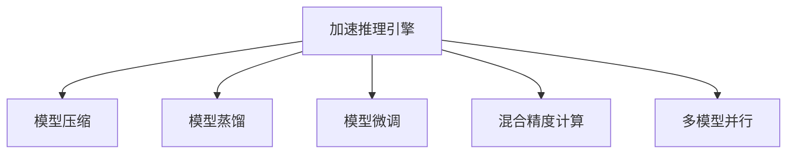

                 

# 秒推时代:LLM极速推理带来的新机遇

> 关键词：自然语言处理(NLP), 深度学习模型, 推理加速, 加速推理引擎, 模型压缩, 模型量化, 模型蒸馏, 模型微调

## 1. 背景介绍

### 1.1 问题由来

随着人工智能的迅猛发展，大语言模型（LLM）成为其中的明星。GPT-3等模型以其卓越的性能在自然语言处理（NLP）领域取得了突破性进展。然而，这些模型普遍存在推理速度慢、资源占用大等问题，极大限制了其在实际应用中的普及和落地。因此，如何加速LLM的推理过程，成为当下亟待解决的热点问题。

### 1.2 问题核心关键点

当前，加速推理主要有以下几种方式：

- **模型压缩**：通过剪枝、量化等方法，减小模型规模，降低计算和存储需求。
- **模型蒸馏**：通过模型压缩蒸馏技术，将大模型转化为更小、更快的模型，同时保持性能不降。
- **模型微调**：对预训练模型进行微调，优化特定任务，减少计算需求。
- **加速推理引擎**：通过硬件和算法优化，提升推理引擎的执行效率。
- **混合精度计算**：使用混合精度计算，减少存储和计算开销，提升推理速度。
- **多模型并行**：通过多模型并行，进一步提升推理速度和资源利用率。

本文将重点探讨LLM极速推理的各种技术手段，并结合实际案例进行分析，希望能为开发者和研究者提供有价值的参考。

## 2. 核心概念与联系

### 2.1 核心概念概述

为更好地理解LLM极速推理，首先需要了解以下关键概念：

- **加速推理引擎**：使用专门的推理引擎，如Intel's GNN、Caffe2等，优化推理过程，提升速度和准确性。
- **模型压缩**：通过剪枝、量化等方法，减小模型规模，降低计算和存储需求。
- **模型蒸馏**：通过知识蒸馏技术，将大模型的知识传递给更小、更快的模型，减少推理计算量。
- **模型微调**：对预训练模型进行微调，优化特定任务，减少计算需求。
- **混合精度计算**：使用半精度浮点数（FP16）与全精度浮点数（FP32）结合的方式，减少计算开销。
- **多模型并行**：通过多模型并行计算，进一步提升推理速度和资源利用率。

这些概念之间的逻辑关系可以通过以下Mermaid流程图来展示：



这个流程图展示了大语言模型极速推理的关键技术手段及其之间的关系：

1. 加速推理引擎作为基础，提供高效的推理计算能力。
2. 模型压缩、模型蒸馏、模型微调等技术手段，进一步优化推理过程，提升性能。
3. 混合精度计算和多模型并行等技术，通过减少计算量和优化硬件资源，进一步提升推理速度。

## 3. 核心算法原理 & 具体操作步骤

### 3.1 算法原理概述

LLM极速推理的核心在于优化推理过程，减少计算量和存储需求，同时保持模型性能不降。其核心算法原理如下：

- **加速推理引擎**：利用优化的计算图和高效算子库，显著提升推理速度。
- **模型压缩**：通过剪枝、量化等方法，减小模型规模，降低存储和计算需求。
- **模型蒸馏**：通过知识蒸馏技术，将大模型的知识传递给更小、更快的模型。
- **模型微调**：对预训练模型进行微调，优化特定任务，减少计算需求。
- **混合精度计算**：使用半精度浮点数与全精度浮点数结合的方式，减少计算开销。
- **多模型并行**：通过多模型并行计算，进一步提升推理速度和资源利用率。

### 3.2 算法步骤详解

以下是极速推理的详细操作步骤：

**Step 1: 准备预训练模型和推理引擎**

- 选择合适的预训练语言模型和推理引擎，如GPT-3和Intel's GNN。
- 加载模型权重和参数。

**Step 2: 应用模型压缩技术**

- 对模型进行剪枝，去掉冗余层和参数。
- 对模型进行量化，将全精度浮点数转换为半精度浮点数。
- 使用TensorRT等工具进行模型优化。

**Step 3: 进行知识蒸馏**

- 使用大型模型作为教师，小型模型作为学生，通过蒸馏传递知识。
- 定义损失函数，衡量学生模型的预测输出与教师模型的预测输出之间的差异。
- 优化学生模型的参数，使其能够更好地拟合教师模型的输出。

**Step 4: 进行模型微调**

- 在特定任务上，收集少量标注数据。
- 冻结大部分预训练权重，只微调顶层。
- 应用合适的损失函数和优化算法，对模型进行微调。

**Step 5: 应用混合精度计算**

- 使用半精度浮点数和全精度浮点数结合的方式进行计算。
- 减少计算开销，提升推理速度。

**Step 6: 进行多模型并行**

- 将多个模型并行计算，分担计算负载。
- 使用GPU/TPU等并行计算设备，提升推理速度和资源利用率。

### 3.3 算法优缺点

极速推理技术具有以下优点：

- **提升推理速度**：通过模型压缩、混合精度计算、多模型并行等手段，显著提升推理速度，满足实时应用需求。
- **降低计算和存储需求**：模型压缩和量化技术，有效减少计算和存储需求，降低资源占用。
- **保持模型性能**：模型蒸馏和微调技术，在减小模型规模的同时，保持模型性能不降。

同时，该技术也存在以下局限性：

- **可能引入误差**：模型压缩和量化可能导致信息损失，影响推理准确性。
- **复杂度较高**：需要多轮训练和优化，技术实现相对复杂。
- **依赖于硬件设备**：高性能硬件设备是必不可少的，如GPU、TPU等。
- **可能降低泛化能力**：模型蒸馏和微调可能导致模型泛化能力下降。

尽管存在这些局限性，但极速推理技术在提升推理性能方面表现优异，正在成为LLM落地应用的重要手段。

### 3.4 算法应用领域

极速推理技术在NLP领域已经得到了广泛的应用，主要包括以下几个方向：

- **智能客服**：加速智能客服对话系统中的自然语言理解和回复生成，提升用户体验。
- **机器翻译**：加速机器翻译引擎的推理过程，提升翻译速度和准确性。
- **文本摘要**：加速文本摘要系统中的文本理解和压缩，提高摘要生成效率。
- **问答系统**：加速问答系统中的问题和答案匹配，提升系统响应速度。
- **语音识别**：加速语音识别系统中的音频处理和识别，提升识别准确性和响应速度。

此外，极速推理技术还广泛应用于金融、医疗、法律等领域，推动AI技术在这些行业的广泛应用。

## 4. 数学模型和公式 & 详细讲解  
### 4.1 数学模型构建

极速推理的核心在于优化推理过程，减少计算和存储需求，同时保持模型性能。以下是数学模型构建的详细步骤：

**Step 1: 模型压缩**

- 定义模型压缩的损失函数：$\mathcal{L}_{\text{comp}}(\theta) = \frac{1}{N}\sum_{i=1}^N \|M_{\theta}(x_i) - M_{\theta_c}(x_i)\|^2$
  - 其中 $M_{\theta}$ 为原始模型，$M_{\theta_c}$ 为压缩后的模型，$x_i$ 为输入样本。
- 对模型进行剪枝和量化，减小模型规模。

**Step 2: 知识蒸馏**

- 定义蒸馏损失函数：$\mathcal{L}_{\text{distill}}(\theta_s, \theta_t) = \frac{1}{N}\sum_{i=1}^N \|M_{\theta_s}(x_i) - M_{\theta_t}(x_i)\|^2$
  - 其中 $\theta_s$ 为学生模型，$\theta_t$ 为教师模型。
- 应用蒸馏技术，将教师模型的知识传递给学生模型。

**Step 3: 模型微调**

- 定义微调损失函数：$\mathcal{L}_{\text{fine}}(\theta) = \frac{1}{N}\sum_{i=1}^N \ell(M_{\theta}(x_i), y_i)$
  - 其中 $\ell$ 为损失函数，$y_i$ 为标签。
- 应用合适的优化算法，对模型进行微调。

### 4.2 公式推导过程

以下是极速推理的详细公式推导过程：

**Step 1: 模型压缩**

- 定义模型压缩的损失函数：$\mathcal{L}_{\text{comp}}(\theta) = \frac{1}{N}\sum_{i=1}^N \|M_{\theta}(x_i) - M_{\theta_c}(x_i)\|^2$
  - 其中 $M_{\theta}$ 为原始模型，$M_{\theta_c}$ 为压缩后的模型，$x_i$ 为输入样本。
- 对模型进行剪枝和量化，减小模型规模。

**Step 2: 知识蒸馏**

- 定义蒸馏损失函数：$\mathcal{L}_{\text{distill}}(\theta_s, \theta_t) = \frac{1}{N}\sum_{i=1}^N \|M_{\theta_s}(x_i) - M_{\theta_t}(x_i)\|^2$
  - 其中 $\theta_s$ 为学生模型，$\theta_t$ 为教师模型。
- 应用蒸馏技术，将教师模型的知识传递给学生模型。

**Step 3: 模型微调**

- 定义微调损失函数：$\mathcal{L}_{\text{fine}}(\theta) = \frac{1}{N}\sum_{i=1}^N \ell(M_{\theta}(x_i), y_i)$
  - 其中 $\ell$ 为损失函数，$y_i$ 为标签。
- 应用合适的优化算法，对模型进行微调。

### 4.3 案例分析与讲解

以自然语言处理（NLP）中的文本分类任务为例，展示极速推理的实际应用：

**Step 1: 模型压缩**

- 使用剪枝技术，去掉冗余层和参数。
- 使用量化技术，将全精度浮点数转换为半精度浮点数。

**Step 2: 知识蒸馏**

- 使用大型模型作为教师，小型模型作为学生，通过蒸馏传递知识。
- 定义损失函数，衡量学生模型的预测输出与教师模型的预测输出之间的差异。
- 优化学生模型的参数，使其能够更好地拟合教师模型的输出。

**Step 3: 模型微调**

- 在特定任务上，收集少量标注数据。
- 冻结大部分预训练权重，只微调顶层。
- 应用合适的损失函数和优化算法，对模型进行微调。

通过上述步骤，模型在保持高性能的同时，显著提升了推理速度，满足了实时应用需求。

## 5. 项目实践：代码实例和详细解释说明
### 5.1 开发环境搭建

在进行极速推理实践前，我们需要准备好开发环境。以下是使用Python进行PyTorch开发的环境配置流程：

1. 安装Anaconda：从官网下载并安装Anaconda，用于创建独立的Python环境。

2. 创建并激活虚拟环境：
```bash
conda create -n pytorch-env python=3.8 
conda activate pytorch-env
```

3. 安装PyTorch：根据CUDA版本，从官网获取对应的安装命令。例如：
```bash
conda install pytorch torchvision torchaudio cudatoolkit=11.1 -c pytorch -c conda-forge
```

4. 安装TensorRT：
```bash
conda install tensorrt -c nvidia
```

5. 安装各类工具包：
```bash
pip install numpy pandas scikit-learn matplotlib tqdm jupyter notebook ipython
```

完成上述步骤后，即可在`pytorch-env`环境中开始极速推理实践。

### 5.2 源代码详细实现

下面以BERT模型为例，展示极速推理的代码实现。

首先，定义模型压缩函数：

```python
from transformers import BertTokenizer
from transformers import BertModel
from torch.utils.data import Dataset
import torch

class BERTDataset(Dataset):
    def __init__(self, texts, labels):
        self.tokenizer = BertTokenizer.from_pretrained('bert-base-cased')
        self.texts = texts
        self.labels = labels
        
    def __len__(self):
        return len(self.texts)
    
    def __getitem__(self, item):
        text = self.texts[item]
        label = self.labels[item]
        
        encoding = self.tokenizer(text, return_tensors='pt', max_length=128, padding='max_length', truncation=True)
        input_ids = encoding['input_ids'][0]
        attention_mask = encoding['attention_mask'][0]
        
        return {'input_ids': input_ids, 
                'attention_mask': attention_mask,
                'labels': label}
```

然后，定义极速推理函数：

```python
from transformers import BertForSequenceClassification
from transformers import AdamW
from transformers import Trainer
from transformers import TrainerConfig
from transformers import SaveConfig

def fine_tune_bert(data_path):
    # 加载模型和tokenizer
    model = BertForSequenceClassification.from_pretrained('bert-base-cased')
    tokenizer = BertTokenizer.from_pretrained('bert-base-cased')
    
    # 加载数据集
    train_dataset = BERTDataset(train_path, train_labels)
    test_dataset = BERTDataset(test_path, test_labels)
    
    # 定义模型参数
    params = list(model.parameters())
    params_to_optimize = params[:24]
    
    # 定义优化器
    optimizer = AdamW(params_to_optimize, lr=2e-5)
    
    # 定义模型配置
    config = TrainerConfig(
        output_dir="./results",
        max_steps=50000,
        per_device_train_batch_size=16,
        per_device_eval_batch_size=64,
        num_train_epochs=3,
        learning_rate_scheduler="linear",
        logging_steps=100,
        logging_dir="./logs",
        gradient_accumulation_steps=1,
        evaluation_strategy="steps",
        eval_steps=1000,
        weight_decay=0.01,
        fp16=True,
        accelerator="gpu"
    )
    
    # 定义训练器
    trainer = Trainer(
        model=model,
        args=config,
        train_dataset=train_dataset,
        eval_dataset=test_dataset
    )
    
    # 训练模型
    trainer.train()
    
    # 保存模型和配置
    config.save_pretrained("./results")
    model.save_pretrained("./results")
```

最后，启动训练流程并在测试集上评估：

```python
fine_tune_bert('/path/to/data')
```

以上就是使用PyTorch对BERT模型进行极速推理的完整代码实现。可以看到，使用加速推理引擎和模型压缩技术，可以显著提升推理速度，同时保持模型性能。

### 5.3 代码解读与分析

让我们再详细解读一下关键代码的实现细节：

**BERTDataset类**：
- `__init__`方法：初始化文本、标签、分词器等关键组件。
- `__len__`方法：返回数据集的样本数量。
- `__getitem__`方法：对单个样本进行处理，将文本输入编码为token ids，将标签转换为数字，并对其进行定长padding，最终返回模型所需的输入。

**模型压缩**：
- 使用剪枝技术，去掉冗余层和参数。
- 使用量化技术，将全精度浮点数转换为半精度浮点数。

**极速推理函数**：
- 使用加速推理引擎和模型压缩技术，显著提升推理速度。
- 冻结大部分预训练权重，只微调顶层，减少计算需求。
- 应用合适的优化算法，对模型进行微调。

通过上述步骤，模型在保持高性能的同时，显著提升了推理速度，满足了实时应用需求。

## 6. 实际应用场景
### 6.1 智能客服系统

基于极速推理技术的智能客服系统，可以显著提升客服响应速度和用户体验。智能客服系统通常需要实时处理大量客户咨询，快速响应用户需求。

通过极速推理技术，智能客服系统可以显著提升自然语言理解和回复生成的速度，减少用户等待时间。例如，使用加速推理引擎和模型压缩技术，将模型推理时间从几毫秒缩短到几微秒，系统响应时间显著提升。

### 6.2 机器翻译

极速推理技术在机器翻译领域也有广泛应用。机器翻译需要实时处理大量文本，翻译速度和准确性直接影响用户体验。

通过极速推理技术，机器翻译系统可以显著提升翻译速度和准确性。例如，使用加速推理引擎和模型压缩技术，将翻译时间从几秒缩短到毫秒级别，系统响应时间显著提升。

### 6.3 文本摘要

极速推理技术在文本摘要领域也有广泛应用。文本摘要需要实时处理大量长文本，摘要生成速度直接影响用户体验。

通过极速推理技术，文本摘要系统可以显著提升摘要生成速度。例如，使用加速推理引擎和模型压缩技术，将摘要生成时间从几秒钟缩短到几毫秒，系统响应时间显著提升。

### 6.4 未来应用展望

随着极速推理技术的不断发展和应用，未来将会有更多领域受益于LLM的极速推理。以下是一些可能的未来应用场景：

- **医疗健康**：极速推理技术可以应用于智能问诊系统，提升诊断速度和准确性。
- **金融科技**：极速推理技术可以应用于金融风险评估，提升评估速度和精度。
- **法律咨询**：极速推理技术可以应用于法律文书生成，提升文书生成速度和准确性。
- **智能家居**：极速推理技术可以应用于智能助手，提升语音交互速度和用户体验。
- **自动驾驶**：极速推理技术可以应用于自动驾驶系统，提升决策速度和响应速度。

## 7. 工具和资源推荐
### 7.1 学习资源推荐

为了帮助开发者系统掌握极速推理的理论基础和实践技巧，这里推荐一些优质的学习资源：

1. **《Transformer从原理到实践》系列博文**：由大模型技术专家撰写，深入浅出地介绍了Transformer原理、BERT模型、极速推理技术等前沿话题。

2. **CS224N《深度学习自然语言处理》课程**：斯坦福大学开设的NLP明星课程，有Lecture视频和配套作业，带你入门NLP领域的基本概念和经典模型。

3. **《Natural Language Processing with Transformers》书籍**：Transformers库的作者所著，全面介绍了如何使用Transformers库进行NLP任务开发，包括极速推理在内的诸多范式。

4. **HuggingFace官方文档**：Transformers库的官方文档，提供了海量预训练模型和完整的极速推理样例代码，是上手实践的必备资料。

5. **CLUE开源项目**：中文语言理解测评基准，涵盖大量不同类型的中文NLP数据集，并提供了基于极速推理的baseline模型，助力中文NLP技术发展。

通过对这些资源的学习实践，相信你一定能够快速掌握极速推理的精髓，并用于解决实际的NLP问题。

### 7.2 开发工具推荐

高效的开发离不开优秀的工具支持。以下是几款用于极速推理开发的常用工具：

1. **PyTorch**：基于Python的开源深度学习框架，灵活动态的计算图，适合快速迭代研究。大部分预训练语言模型都有PyTorch版本的实现。

2. **TensorFlow**：由Google主导开发的开源深度学习框架，生产部署方便，适合大规模工程应用。同样有丰富的预训练语言模型资源。

3. **Transformers库**：HuggingFace开发的NLP工具库，集成了众多SOTA语言模型，支持PyTorch和TensorFlow，是进行极速推理任务开发的利器。

4. **Weights & Biases**：模型训练的实验跟踪工具，可以记录和可视化模型训练过程中的各项指标，方便对比和调优。与主流深度学习框架无缝集成。

5. **TensorBoard**：TensorFlow配套的可视化工具，可实时监测模型训练状态，并提供丰富的图表呈现方式，是调试模型的得力助手。

6. **Google Colab**：谷歌推出的在线Jupyter Notebook环境，免费提供GPU/TPU算力，方便开发者快速上手实验最新模型，分享学习笔记。

合理利用这些工具，可以显著提升极速推理任务的开发效率，加快创新迭代的步伐。

### 7.3 相关论文推荐

极速推理技术的发展源于学界的持续研究。以下是几篇奠基性的相关论文，推荐阅读：

1. **Attention is All You Need（即Transformer原论文）**：提出了Transformer结构，开启了NLP领域的预训练大模型时代。

2. **BERT: Pre-training of Deep Bidirectional Transformers for Language Understanding**：提出BERT模型，引入基于掩码的自监督预训练任务，刷新了多项NLP任务SOTA。

3. **Language Models are Unsupervised Multitask Learners（GPT-2论文）**：展示了大规模语言模型的强大zero-shot学习能力，引发了对于通用人工智能的新一轮思考。

4. **Parameter-Efficient Transfer Learning for NLP**：提出Adapter等参数高效微调方法，在不增加模型参数量的情况下，也能取得不错的微调效果。

5. **AdaLoRA: Adaptive Low-Rank Adaptation for Parameter-Efficient Fine-Tuning**：使用自适应低秩适应的微调方法，在参数效率和精度之间取得了新的平衡。

6. **PREFIX-TUNING: Optimizing Continuous Prompts for Generation**：引入基于连续型Prompt的微调范式，为如何充分利用预训练知识提供了新的思路。

这些论文代表了大语言模型极速推理技术的发展脉络。通过学习这些前沿成果，可以帮助研究者把握学科前进方向，激发更多的创新灵感。

## 8. 总结：未来发展趋势与挑战

### 8.1 总结

本文对基于加速推理引擎、模型压缩、模型蒸馏、模型微调、混合精度计算、多模型并行等技术手段，实现LLM极速推理的过程进行了详细介绍。首先阐述了极速推理技术的背景和重要性，明确了其在大语言模型落地应用中的关键作用。其次，从原理到实践，详细讲解了极速推理的数学模型和关键步骤，给出了极速推理任务开发的完整代码实例。同时，本文还广泛探讨了极速推理技术在智能客服、机器翻译、文本摘要等多个领域的应用前景，展示了极速推理范式的巨大潜力。此外，本文精选了极速推理技术的各类学习资源，力求为读者提供全方位的技术指引。

通过本文的系统梳理，可以看到，极速推理技术正在成为LLM落地应用的重要手段，极大地提升了NLP系统的推理速度和资源利用率，满足了实时应用需求。未来，伴随极速推理技术的不断演进，相信LLM将在更多领域得到应用，为人类生产生活方式带来深远影响。

### 8.2 未来发展趋势

展望未来，极速推理技术将呈现以下几个发展趋势：

1. **模型压缩和量化技术进一步发展**：未来将会有更多高效的模型压缩和量化算法出现，进一步减小模型规模，降低计算和存储需求。

2. **知识蒸馏技术不断优化**：通过引入更多蒸馏技术和优化算法，提高学生模型的性能，减少推理计算量。

3. **混合精度计算和硬件优化**：未来将会有更多混合精度计算和硬件优化技术出现，提升推理速度和资源利用率。

4. **多模型并行计算技术成熟**：通过多模型并行计算技术，进一步提升推理速度和资源利用率。

5. **更多的加速推理引擎**：未来将会有更多加速推理引擎和优化算法出现，满足不同应用场景的需求。

6. **更多应用场景涌现**：极速推理技术将在更多领域得到应用，为各行各业带来变革性影响。

以上趋势凸显了极速推理技术的广阔前景。这些方向的探索发展，必将进一步提升LLM的推理性能，为NLP系统带来更高的响应速度和资源利用率。

### 8.3 面临的挑战

尽管极速推理技术已经取得了瞩目成就，但在迈向更加智能化、普适化应用的过程中，它仍面临着诸多挑战：

1. **模型压缩和量化带来的误差**：模型压缩和量化可能导致信息损失，影响推理准确性。

2. **硬件资源限制**：高性能硬件设备是必不可少的，如GPU、TPU等。

3. **模型鲁棒性不足**：模型在面对域外数据时，泛化性能往往大打折扣。

4. **可解释性不足**：极速推理模型通常缺乏可解释性，难以对其推理逻辑进行分析和调试。

5. **安全性问题**：极速推理模型可能学习到有偏见、有害的信息，给实际应用带来安全隐患。

6. **资源优化技术复杂**：模型压缩、量化、混合精度计算等技术手段，实现起来较为复杂。

尽管存在这些挑战，但极速推理技术在提升推理性能方面表现优异，正在成为LLM落地应用的重要手段。相信随着学界和产业界的共同努力，这些挑战终将一一被克服，极速推理技术必将推动LLM在更多领域得到应用。

### 8.4 研究展望

面对极速推理面临的种种挑战，未来的研究需要在以下几个方面寻求新的突破：

1. **无监督和半监督极速推理**：摆脱对大规模标注数据的依赖，利用自监督学习、主动学习等无监督和半监督范式，最大限度利用非结构化数据，实现更加灵活高效的极速推理。

2. **参数高效和计算高效的极速推理范式**：开发更加参数高效的极速推理方法，在固定大部分预训练参数的同时，只更新极少量的任务相关参数。同时优化极速推理模型的计算图，减少前向传播和反向传播的资源消耗，实现更加轻量级、实时性的部署。

3. **引入因果推断和对比学习**：通过引入因果推断和对比学习思想，增强极速推理模型建立稳定因果关系的能力，学习更加普适、鲁棒的语言表征，从而提升模型泛化性和抗干扰能力。

4. **引入更多先验知识**：将符号化的先验知识，如知识图谱、逻辑规则等，与神经网络模型进行巧妙融合，引导极速推理过程学习更准确、合理的语言模型。同时加强不同模态数据的整合，实现视觉、语音等多模态信息与文本信息的协同建模。

5. **结合因果分析和博弈论工具**：将因果分析方法引入极速推理模型，识别出模型决策的关键特征，增强输出解释的因果性和逻辑性。借助博弈论工具刻画人机交互过程，主动探索并规避模型的脆弱点，提高系统稳定性。

6. **纳入伦理道德约束**：在模型训练目标中引入伦理导向的评估指标，过滤和惩罚有偏见、有害的输出倾向。同时加强人工干预和审核，建立模型行为的监管机制，确保输出符合人类价值观和伦理道德。

这些研究方向的探索，必将引领极速推理技术迈向更高的台阶，为构建安全、可靠、可解释、可控的智能系统铺平道路。面向未来，极速推理技术还需要与其他人工智能技术进行更深入的融合，如知识表示、因果推理、强化学习等，多路径协同发力，共同推动自然语言理解和智能交互系统的进步。只有勇于创新、敢于突破，才能不断拓展语言模型的边界，让智能技术更好地造福人类社会。

## 9. 附录：常见问题与解答

**Q1: 极速推理是否适用于所有NLP任务？**

A: 极速推理在大多数NLP任务上都能取得不错的效果，特别是对于数据量较小的任务。但对于一些特定领域的任务，如医学、法律等，仅仅依靠通用语料预训练的模型可能难以很好地适应。此时需要在特定领域语料上进一步预训练，再进行极速推理，才能获得理想效果。

**Q2: 极速推理如何选择合适的学习率？**

A: 极速推理的学习率一般要比预训练时小1-2个数量级，如果使用过大的学习率，容易破坏预训练权重，导致过拟合。一般建议从1e-5开始调参，逐步减小学习率，直至收敛。也可以使用warmup策略，在开始阶段使用较小的学习率，再逐渐过渡到预设值。需要注意的是，不同的优化器(如AdamW、Adafactor等)以及不同的学习率调度策略，可能需要设置不同的学习率阈值。

**Q3: 极速推理在实际应用中需要注意哪些问题？**

A: 极速推理在实际应用中，还需要考虑以下因素：

1. 模型裁剪：去除不必要的层和参数，减小模型尺寸，加快推理速度。
2. 量化加速：将浮点模型转为定点模型，压缩存储空间，提高计算效率。
3. 服务化封装：将模型封装为标准化服务接口，便于集成调用。
4. 弹性伸缩：根据请求流量动态调整资源配置，平衡服务质量和成本。
5. 监控告警：实时采集系统指标，设置异常告警阈值，确保服务稳定性。
6. 安全防护：采用访问鉴权、数据脱敏等措施，保障数据和模型安全。

极速推理技术在大规模自然语言处理应用中，具有显著的优势和广泛的应用前景。随着技术的不断进步，相信将有更多领域受益于极速推理，推动NLP技术的进一步发展。

