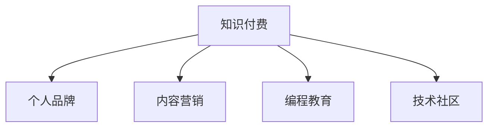

                 

# 程序员利用知识付费打造个人影响力

> 关键词：知识付费, 个人品牌, 程序员, 影响力, 内容营销, 编程, 教育

## 1. 背景介绍

### 1.1 问题由来

在快速发展的科技行业中，程序员的竞争日益激烈。面对来自全球的顶尖人才，如何提升自己的竞争力，打造个人品牌，成为一个核心议题。在这个过程中，知识付费成为了一种新兴的商业模式，也为程序员提供了新的思路和机会。

近年来，知识付费市场迅速扩张，越来越多的人通过在线课程、订阅服务、专业咨询等方式获取知识，以满足个人成长和职业发展的需求。对于程序员而言，知识付费不仅是一种学习方式，更是一种展示自身专业能力、积累行业影响力的重要途径。

### 1.2 问题核心关键点

知识付费模式的兴起，为程序员提供了展示自身技术能力和专业知识的平台。通过知识付费，程序员可以：
- 构建个人品牌：分享专业知识和经验，成为特定领域的意见领袖。
- 获得经济回报：通过订阅、付费课程等方式，获得稳定的收入来源。
- 提升职业技能：持续学习和积累，保持与行业前沿的同步。
- 扩大影响力：通过高质量内容影响他人，扩展自己的社交网络。

如何有效地利用知识付费，打造个人品牌和影响力，是每位程序员需要深思的问题。

### 1.3 问题研究意义

知识付费不仅是程序员获取新知识的手段，更是其展示和提升自身影响力的重要工具。通过知识付费，程序员可以在技术社区、公司内部、行业会议等多个场合中发声，为技术交流、知识传播、团队协作等提供价值。这不仅有助于个人的职业发展，还能推动整个技术社区的进步。

此外，知识付费也是程序员探索新商业模式、拓宽收入渠道的有效方式。在当前技术快速迭代的环境下，传统的全职开发工作已经不能完全满足程序员的职业需求，通过知识付费，程序员可以实现职业上的多样化，找到更多的收入来源。

## 2. 核心概念与联系

### 2.1 核心概念概述

为更好地理解程序员如何利用知识付费打造个人影响力，本节将介绍几个密切相关的核心概念：

- 知识付费(Knowledge-Driven Subscription)：通过付费方式获取专业知识的商业模式。程序员可以通过开设课程、发布文章、提供咨询等方式，向用户提供专业服务。
- 个人品牌(Personal Branding)：程序员通过展示专业知识和经验，建立自己在技术社区中的影响力和认可度。个人品牌包括技术博客、开源项目、专业演讲等多个方面。
- 内容营销(Content Marketing)：利用高质量内容吸引和保持用户的关注和信任，从而形成稳定的用户群体。程序员的内容营销可以涵盖技术文章、视频教程、技术讲座等多个渠道。
- 编程教育(Programming Education)：通过教授编程技能、讲解技术原理、分享实践经验等方式，帮助他人学习编程。编程教育不仅是提升自我技能的手段，也是构建个人品牌的重要途径。
- 技术社区(Technical Community)：程序员通过参与技术社区，分享知识、交流心得、解决问题，建立和维护专业网络。技术社区包括GitHub、Stack Overflow、Medium等多个平台。

这些核心概念之间的逻辑关系可以通过以下Mermaid流程图来展示：



这个流程图展示了几者之间的关联：

1. 知识付费作为起点，为个人品牌、内容营销、编程教育和技术社区的构建提供了物质基础。
2. 个人品牌和编程教育是知识付费的具体实现方式，通过高质量的内容输出，构建自身的专业形象和影响力。
3. 内容营销通过吸引用户关注，进一步提升个人品牌的影响力，并实现知识付费的商业化。
4. 技术社区为程序员提供了展示和交流的平台，促进个人品牌和编程教育的传播和应用。

这些概念共同构成了程序员利用知识付费打造个人影响力的大致框架，帮助程序员在职业发展和技术交流中占据有利地位。

## 3. 核心算法原理 & 具体操作步骤
### 3.1 算法原理概述

程序员利用知识付费打造个人影响力的过程，本质上是一种基于内容的个人品牌营销。其核心思想是：通过高质量的技术内容，吸引和保持用户关注，逐步建立和提升自身在技术社区中的影响力和认可度。

形式化地，假设程序员的初始品牌影响为 $B_0$，知识付费的推广效果为 $E$，内容质量为 $Q$，则品牌影响力的提升过程可以表示为：

$$
B = B_0 + E \times Q
$$

其中 $B$ 为最终的个人品牌影响力，$E$ 为知识付费的推广效果，$Q$ 为内容的质量。推广效果 $E$ 和内容质量 $Q$ 是影响最终品牌影响力的关键因素。

### 3.2 算法步骤详解

基于知识付费的个人品牌打造过程可以分为以下几个关键步骤：

**Step 1: 定义品牌定位和目标用户**
- 明确自身在技术领域的专业方向，确定品牌定位和目标用户群体。
- 分析目标用户的需求，提供符合其兴趣和需求的个性化内容。

**Step 2: 创建高质量内容**
- 开设博客、发布文章、录制视频、编写书籍等多种形式的内容，确保内容的原创性和专业性。
- 分享实战经验、技术原理、解决方案、前沿趋势等，提升内容的价值和吸引力。
- 利用工具和技术提高内容的质量，如代码校验、文字编辑、多媒体制作等。

**Step 3: 选择适合的知识付费平台**
- 评估各类知识付费平台的优势和适用场景，如Udemy、Coursera、Medium等。
- 根据自身的品牌定位和目标用户，选择最合适的平台进行内容发布和推广。

**Step 4: 执行知识付费推广**
- 制定推广策略，包括目标人群、推广渠道、推广预算等。
- 利用社交媒体、邮件订阅、广告投放等手段，增加内容的曝光率和用户的参与度。
- 提供优质客户服务，解答用户问题，提升用户满意度，增强品牌忠诚度。

**Step 5: 持续优化品牌形象**
- 根据用户反馈和市场变化，持续更新和优化内容。
- 扩大社交网络，参加行业会议、技术讲座等活动，提升品牌曝光度。
- 定期回顾品牌推广效果，调整策略，提升品牌影响力。

### 3.3 算法优缺点

利用知识付费打造个人品牌的影响力，具有以下优点：
1. 精准定位：知识付费平台通过用户反馈和数据统计，帮助程序员精准定位目标用户群体，提升内容的针对性和吸引力。
2. 持续学习：知识付费是程序员不断学习和提升自身技能的重要途径，通过持续输出高质量内容，不断强化品牌影响力。
3. 高效传播：知识付费平台的用户群体相对稳定，程序员可以通过高质量内容建立忠实的粉丝群体，实现高效传播。
4. 经济回报：知识付费不仅可以提升品牌影响力，还可以通过订阅、付费课程等方式获得经济回报，增加收入来源。

同时，这种范式也存在一定的局限性：
1. 高质量内容创作难度大：创造高质量、有价值的内容需要大量的时间和精力，对程序员的写作和制作能力提出了高要求。
2. 时间成本高：持续输出内容需要大量时间投入，可能会影响日常工作和生活。
3. 竞争激烈：当前知识付费市场竞争激烈，获取用户的关注和信任需要不断创新和优化。
4. 过度商业化风险：如果过分强调商业回报，可能会降低内容的真实性和专业性，影响品牌形象。

尽管存在这些局限性，但就目前而言，利用知识付费打造个人品牌依然是一种高效、可行的方式，能够帮助程序员提升职业地位和影响力。

### 3.4 算法应用领域

基于知识付费的个人品牌打造，已经在程序员的多个应用领域得到了广泛应用，包括但不限于：

- 技术博客：如 Medium、GitHub 上的技术文章，通过持续输出高质量内容，吸引和保持用户关注。
- 在线课程：如 Udemy、Coursera 等平台上的编程课程，系统地传授编程知识和实践经验。
- 专业咨询：如 Stack Overflow 上的技术问答，利用专业知识解答用户问题，积累经验和声誉。
- 技术讲座：如 Meetup、CSDN 等平台上的线下活动，通过面对面的交流，建立专业网络。

除了这些经典应用外，知识付费的商业模式还在不断演进，涌现了更多新的应用场景，如代码开源、技术讨论、社区运营等，进一步拓展了程序员的影响力。

## 4. 数学模型和公式 & 详细讲解  
### 4.1 数学模型构建

为了更好地理解利用知识付费打造个人影响力的过程，我们可以将其建模为一个动态系统。假设程序员的初始品牌影响力为 $B_0$，知识付费的推广效果为 $E$，内容质量为 $Q$，则品牌影响力的提升过程可以表示为：

$$
B = B_0 + E \times Q
$$

其中 $B$ 为最终的个人品牌影响力，$E$ 为知识付费的推广效果，$Q$ 为内容的质量。

### 4.2 公式推导过程

以程序员开设博客为例，推导品牌影响力的提升公式。设每篇文章的浏览量为 $P_i$，转化率为 $C_i$，则总浏览量为 $P$，总转化量为 $C$。

博客的推广效果 $E$ 可以表示为：

$$
E = P \times C
$$

博客的内容质量 $Q$ 可以通过用户评分、点击率、回复量等多个指标来衡量。假设用户对每篇文章的评分平均值是 $R$，点击率是 $L$，回复量是 $R$，则内容质量 $Q$ 可以表示为：

$$
Q = R \times L \times R
$$

综合上述公式，品牌影响力的提升公式可以表示为：

$$
B = B_0 + E \times Q = B_0 + (P \times C) \times (R \times L \times R)
$$

通过上述公式，我们可以看出，品牌影响力的提升不仅取决于内容质量 $Q$，还受到推广效果 $E$ 的影响。推广效果 $E$ 又取决于用户对内容的反馈，即总浏览量 $P$ 和总转化率 $C$。内容质量 $Q$ 则与用户评分 $R$、点击率 $L$、回复量 $R$ 等多个因素有关。

### 4.3 案例分析与讲解

以某位知名的前端工程师为例，分析其利用知识付费打造个人影响力的过程。该工程师在 Medium 上开设了技术博客，每周发布一篇关于前端开发的文章。文章质量高，内容丰富，用户反响良好，文章的平均评分是 4.5 分，平均点击率是 30%，平均回复量是 50 条。文章发布后，通过社交媒体和邮件订阅进行推广，每月获取 5000 位读者订阅。假设初始品牌影响力为 50，则品牌影响力的提升公式为：

$$
B = 50 + (5000 \times 30\%) \times (4.5 \times 30\% \times 50)
$$

计算得出最终的品牌影响力约为 3,000。

## 5. 项目实践：代码实例和详细解释说明
### 5.1 开发环境搭建

在进行知识付费实践前，我们需要准备好开发环境。以下是使用Python进行Django开发的Web应用环境配置流程：

1. 安装Anaconda：从官网下载并安装Anaconda，用于创建独立的Python环境。

2. 创建并激活虚拟环境：
```bash
conda create -n web-env python=3.8 
conda activate web-env
```

3. 安装Django：根据Django版本，从官网获取对应的安装命令。例如：
```bash
pip install django
```

4. 安装各个组件：
```bash
pip install django-markdownfield django-crispy-forms django-axes
```

5. 安装Nginx和uWSGI：
```bash
sudo apt-get install nginx uwsgi-core uwsgi-plugin-python3
```

完成上述步骤后，即可在`web-env`环境中开始Web应用开发。

### 5.2 源代码详细实现

下面以一个简单的在线编程学习平台为例，给出使用Django进行知识付费实践的Python代码实现。

首先，定义Django项目和应用：

```python
from django.conf import settings
from django.contrib import admin
from django.urls import path, include

urlpatterns = [
    path('admin/', admin.site.urls),
    path('api/', include('api.urls')),
]

settings.WEBFRONT_URL = 'http://0.0.0.0:8000'
settings.API_URL = 'http://0.0.0.0:8000'
```

然后，定义API和相关函数：

```python
from rest_framework import status
from rest_framework.decorators import api_view
from rest_framework.response import Response
from rest_framework.views import APIView

class UserView(APIView):
    def get(self, request):
        return Response({"message": "Welcome to the User API!"})

    def post(self, request):
        data = request.data
        user = User.objects.create_user(data["username"], data["email"], data["password"])
        return Response({"message": "User created successfully!"})

class BlogView(APIView):
    def get(self, request):
        blogs = Blog.objects.all()
        serializer = BlogSerializer(blogs, many=True)
        return Response(serializer.data)

    def post(self, request):
        data = request.data
        blog = Blog.objects.create(**data)
        return Response({"message": "Blog created successfully!"})
```

最后，启动Django应用和Web服务器：

```python
python manage.py runserver 0.0.0.0:8000
nginx -c /etc/nginx/nginx.conf
uwsgi --socket :8000 --threaded --call-on-fork --pythonpath /path/to/project --module pywsgi -H www.localhost.com
```

### 5.3 代码解读与分析

让我们再详细解读一下关键代码的实现细节：

**Django配置文件**：
- 通过`settings.WEBFRONT_URL`和`settings.API_URL`定义Web应用和API应用的URL，方便后端路由和前端访问。

**UserView类**：
- 定义了User API的GET和POST请求处理，包括用户注册和登录功能。

**BlogView类**：
- 定义了Blog API的GET和POST请求处理，包括创建和获取博客文章的功能。

**Django管理后台**：
- 通过`admin.site.urls`定义管理后台的URL，方便开发者通过浏览器访问和调试。

上述代码实现了简单的用户和博客管理功能，开发人员可以根据实际需求进一步扩展。Django的ORM和rest_framework等工具，使得Web应用的开发过程更加高效和灵活。

## 6. 实际应用场景
### 6.1 在线编程学习平台

利用知识付费打造个人品牌，在线编程学习平台是一个典型应用场景。传统编程学习通常依赖于教材和视频，而在线平台可以通过订阅和付费课程，提供更加个性化和系统的学习体验。

具体而言，平台可以提供以下服务：
- 编程课程：录制视频、编写代码示例，系统讲解编程知识和实践技巧。
- 在线答疑：提供实时聊天和邮件答疑服务，解答学生在学习过程中遇到的问题。
- 编程实战：提供编程作业和项目练习，提升学生的动手能力和项目经验。
- 编程社区：建立开发者社区，鼓励学生交流和分享编程心得，构建学习共同体。

通过知识付费，平台能够获得稳定的订阅收入，同时提升自身在编程学习市场的影响力。平台还可以通过付费会员制度、课程推荐算法等方式，进一步优化用户体验，提升平台的用户粘性和满意度。

### 6.2 开源软件开发社区

开源软件开发社区也是利用知识付费打造个人品牌的重要场景。开发者可以通过贡献高质量的代码和文档，吸引和保持社区用户，同时获取经济回报。

具体而言，开发者可以：
- 贡献代码：提交高质量的开源代码，解决社区成员遇到的问题。
- 编写文档：编写详细的使用手册和技术文档，帮助社区成员更好地使用代码。
- 提供在线支持：通过邮件、论坛、聊天等方式，解答社区成员的疑问和问题。
- 组织活动：组织技术讲座、在线研讨会等活动，分享最新技术趋势和实践经验。

通过知识付费，开发者可以获得稳定的经济回报，同时提升自己的技术影响力和行业地位。开源社区的活跃度也是开发者个人品牌的重要指标，通过持续的贡献和互动，开发者能够在社区中建立和维护强大的影响力。

### 6.3 企业技术培训

企业技术培训是利用知识付费打造个人品牌的重要渠道。技术专家可以通过在线课程、线下讲座、技术咨询等方式，为公司员工提供持续的技术培训，提升整体技术水平。

具体而言，企业可以：
- 定制化课程：根据公司的技术需求，定制开发专业化的技术培训课程。
- 实时答疑：提供实时技术支持，解答员工在学习和实践过程中遇到的问题。
- 技术评估：通过在线考试和项目评估，评估员工的技术掌握情况，提供个性化的学习建议。
- 技能认证：提供技术认证，激励员工积极学习新技能，提升自身的技术水平。

通过知识付费，企业技术专家能够获得稳定的技术培训收入，同时提升自身在行业内的专业形象。企业也可以利用专家的专业知识，提升整体的技术水平和竞争力，实现双赢的局面。

### 6.4 未来应用展望

随着知识付费市场的不断成熟，利用知识付费打造个人品牌的应用场景将会更加丰富和多样化。未来，知识付费可能会在更多领域得到应用，如在线教育、医疗咨询、法律服务、财务咨询等，成为各行各业的重要组成部分。

同时，知识付费也将迎来更多的创新和变革，如区块链技术的应用，将为知识付费带来更高的透明性和安全性；人工智能技术的应用，将提升知识付费的智能化水平，提供更加精准和个性化的服务。

总之，知识付费为程序员提供了新的职业发展路径，同时也为技术传播和知识积累提供了新的渠道。未来，知识付费将成为程序员不可或缺的工具，帮助他们构建个人品牌，实现职业上的多样化发展。

## 7. 工具和资源推荐
### 7.1 学习资源推荐

为了帮助程序员系统掌握知识付费的理论基础和实践技巧，这里推荐一些优质的学习资源：

1. 《知识付费的原理与实践》：全面介绍了知识付费的商业模式、运营策略、技术实现等内容，是程序员学习和入门的绝佳教材。
2. 《知识付费的市场分析与趋势预测》：通过数据分析和案例分析，揭示知识付费市场的潜力和趋势，帮助程序员做出更明智的决策。
3. 《知识付费的产品设计与用户体验》：专注于知识付费产品的设计和用户体验，提供系统化的产品设计方法，帮助程序员提升产品竞争力。
4. 《知识付费的营销策略与运营技巧》：详细讲解知识付费的营销策略和运营技巧，帮助程序员提升品牌的曝光度和用户粘性。
5. 《知识付费的技术架构与实施细节》：介绍知识付费平台的技术架构和实施细节，帮助程序员构建高效、稳定的知识付费系统。

通过对这些资源的学习实践，相信你一定能够快速掌握知识付费的精髓，并用于解决实际的商业问题。

### 7.2 开发工具推荐

高效的开发离不开优秀的工具支持。以下是几款用于知识付费开发的常用工具：

1. Django：基于Python的开源Web框架，简单易用，灵活扩展，适用于开发复杂的知识付费平台。
2. Flask：轻量级的Web框架，适合开发小型知识付费应用，具有高效、易用的特点。
3. Django REST framework：Django的RESTful API框架，适合开发知识付费平台的后端API。
4. uWSGI：高性能的Web应用服务器，支持多种语言和框架，适合高并发知识付费应用的部署。
5. Nginx：高性能的Web服务器，支持高并发、低延迟，适合知识付费应用的负载均衡和反向代理。
6. Redis：高性能的内存数据库，适合知识付费应用的数据缓存和访问加速。

合理利用这些工具，可以显著提升知识付费平台的开发效率，加快创新迭代的步伐。

### 7.3 相关论文推荐

知识付费的研究方向涉及多个领域，包括商业模型、技术实现、用户体验等，以下是几篇奠基性的相关论文，推荐阅读：

1. 《知识付费的市场分析与策略》：通过市场调研和数据分析，揭示知识付费的市场潜力，提出有效的运营策略。
2. 《知识付费的技术架构设计》：介绍知识付费平台的技术架构和设计原则，提供系统化的架构设计方法。
3. 《知识付费的用户行为分析》：通过用户行为数据分析，揭示知识付费平台的用户需求和行为规律，提出优化建议。
4. 《知识付费的内容质量评估》：提出知识付费内容的质量评估指标和方法，帮助平台优化内容质量，提升用户满意度。
5. 《知识付费的产品设计》：专注于知识付费产品的设计与用户体验，提供系统化的产品设计方法，帮助程序员提升产品竞争力。

这些论文代表了大规模知识付费市场的最新研究进展，通过学习这些前沿成果，可以帮助研究者把握学科前进方向，激发更多的创新灵感。

## 8. 总结：未来发展趋势与挑战

### 8.1 总结

本文对利用知识付费打造个人影响力的过程进行了全面系统的介绍。首先阐述了知识付费作为程序员打造个人品牌的重要手段，详细讲解了其原理和操作步骤，给出了知识付费实践的完整代码实例。同时，本文还广泛探讨了知识付费在多个行业领域的应用前景，展示了知识付费范式的巨大潜力。此外，本文精选了知识付费技术的各类学习资源，力求为读者提供全方位的技术指引。

通过本文的系统梳理，可以看到，知识付费不仅是程序员获取新知识的手段，更是其展示和提升自身影响力的重要工具。通过高质量的技术内容，程序员可以吸引和保持用户关注，逐步建立和提升自身在技术社区中的影响力和认可度。未来，知识付费市场还将迎来更多的创新和变革，帮助程序员更好地利用这一新兴商业模式，打造个人品牌，实现职业上的多样化发展。

### 8.2 未来发展趋势

展望未来，知识付费市场将呈现以下几个发展趋势：

1. 知识付费内容的多样化。随着技术的发展，知识付费内容将从单一的视频课程、文章，拓展到直播、沙龙、游戏等多种形式，满足用户多样化的学习需求。
2. 知识付费平台的智能化。利用人工智能、区块链等技术，知识付费平台将提供更加精准、个性化的推荐和互动服务，提升用户体验。
3. 知识付费商业模式的创新。除了订阅模式，未来将出现更多创新的商业模式，如会员制、按需服务、版权付费等，为程序员提供更灵活的收益方式。
4. 知识付费市场的国际化。随着全球化进程的加速，知识付费市场也将走向国际化，提供多语言、多文化的内容和服务，满足全球用户的需求。
5. 知识付费与教育结合。知识付费将与传统教育模式深度融合，形成线上线下结合的新型教育体系，提升教育质量和效率。

以上趋势凸显了知识付费市场的发展潜力和广阔前景，为程序员提供了更多的职业发展机会。这些方向的探索发展，必将进一步推动知识付费市场的发展，为技术传播和知识积累带来新的契机。

### 8.3 面临的挑战

尽管知识付费市场前景广阔，但在迈向更加智能化、普适化应用的过程中，它仍面临着诸多挑战：

1. 高质量内容创作的挑战。高质量内容的创作需要大量的时间和精力，如何降低创作门槛，提升内容质量，是知识付费平台面临的重要问题。
2. 用户信任的建立。知识付费市场需要建立和维护用户信任，如何通过透明、公正的机制，保障用户的权益和满意度，是平台运营的关键。
3. 技术安全性的保障。知识付费平台需要保障内容的安全性和用户的隐私，如何防止内容侵权、数据泄露等安全问题，是平台发展的底线。
4. 法律法规的合规性。知识付费平台需要符合相关法律法规，如何规范市场行为，保障用户的合法权益，是平台运营的保障。
5. 用户多样化的需求。知识付费平台需要满足不同用户的需求，如何提升平台的灵活性和可扩展性，是平台发展的方向。

正视知识付费面临的这些挑战，积极应对并寻求突破，将是大规模知识付费市场持续发展的关键。相信随着学界和产业界的共同努力，这些挑战终将一一被克服，知识付费市场必将在未来迎来更加广阔的发展空间。

### 8.4 研究展望

面向未来，知识付费技术需要在以下几个方面寻求新的突破：

1. 多模态内容的融合。知识付费平台将拓展到多媒体内容，如视频、音频、图像等多种形式，满足用户多样化的学习需求。
2. 个性化推荐系统的优化。利用机器学习和推荐算法，提升知识付费内容的推荐精度和个性化程度，提升用户体验。
3. 区块链技术的引入。利用区块链技术保障内容版权、用户支付等安全问题，提升知识付费市场的透明度和信任度。
4. 人工智能技术的集成。利用人工智能技术优化知识付费平台的内容生成、用户分析、营销推广等多个环节，提升平台的智能化水平。
5. 知识付费与社交网络的结合。利用社交网络平台，扩大知识付费的传播范围，提升平台的用户粘性和影响力。

这些研究方向的探索，必将引领知识付费市场迈向更高的台阶，为程序员提供更加多样、高效、智能的知识付费平台，助力程序员的职业发展。总之，知识付费为程序员提供了新的职业发展路径，同时也为技术传播和知识积累提供了新的渠道。未来，知识付费将成为程序员不可或缺的工具，帮助他们构建个人品牌，实现职业上的多样化发展。

## 9. 附录：常见问题与解答

**Q1：知识付费对程序员的职业发展有哪些帮助？**

A: 知识付费不仅提供了一种新的学习方式，更重要的是，它可以帮助程序员构建个人品牌，提升技术影响力和行业地位。通过高质量的技术内容，程序员可以吸引和保持用户关注，逐步建立和提升自身在技术社区中的影响力和认可度。此外，知识付费还可以作为程序员的收入来源，提供稳定的经济回报，增强职业安全感。

**Q2：知识付费平台如何选择？**

A: 选择知识付费平台时，需要考虑平台的稳定性、用户基础、内容质量、收费标准等多个因素。Udemy、Coursera、Medium等平台都是不错的选择，可以根据自身的品牌定位和目标用户选择合适的平台。此外，还需要注意平台的佣金率、分成比例、付款方式等细节，确保自己能够获得合理的收益。

**Q3：如何提升知识付费内容的质量？**

A: 提升内容质量需要从多个方面入手：
1. 确保原创性：避免抄袭和剽窃，提供真实可靠的知识和经验。
2. 增加实用性：结合实际案例和实战经验，让内容更具可操作性。
3. 强化互动性：通过问答、评论、直播等多种方式，增加用户的参与度，提升内容价值。
4. 优化多媒体呈现：利用视频、图片、动画等多种多媒体形式，增强内容的吸引力和易读性。
5. 持续更新和优化：定期更新内容，根据用户反馈进行调整和优化，保持内容的时效性和新鲜感。

通过这些方法，程序员可以不断提升知识付费内容的质量，吸引和保持用户关注，实现品牌影响力的提升。

**Q4：知识付费的盈利模式有哪些？**

A: 知识付费的盈利模式主要有以下几种：
1. 订阅模式：用户定期支付费用，获得持续的知识输出和更新。
2. 按需服务：用户按需购买课程、咨询等，按量收费。
3. 版权销售：将自己的内容打包销售，一次性获取收益。
4. 广告收入：通过平台投放广告，获得广告分成。
5. 赞助和合作：与企业或机构合作，获得赞助和资金支持。

程序员可以根据自己的需求和资源，选择适合的盈利模式，最大化经济回报。

**Q5：知识付费与传统教育有何不同？**

A: 知识付费与传统教育的主要区别在于：
1. 互动性更强：知识付费平台通过互动问答、实时反馈等方式，增加用户的学习兴趣和参与度。
2. 个性化更高：知识付费平台可以根据用户的学习进度和反馈，提供个性化的学习建议和内容推荐。
3. 灵活性更大：用户可以自由选择学习时间和内容，不受时间和地点的限制。
4. 价格更实惠：知识付费平台通常采用按需付费或订阅制，用户可以按需选择付费内容，节省学习成本。
5. 技术支持更全面：知识付费平台利用技术手段，提供视频、代码、文档等多种形式的内容，提升学习效率。

总之，知识付费为传统教育提供了更加灵活、高效、互动的学习方式，提升了用户的学习体验和学习效果。

---

作者：禅与计算机程序设计艺术 / Zen and the Art of Computer Programming

