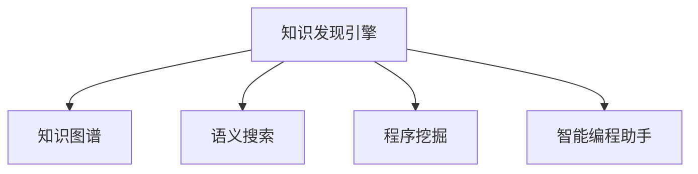

                 

# 程序员利用知识发现引擎提高学习成果

> 关键词：知识发现引擎, 学习成果提升, 知识图谱, 语义搜索, 程序挖掘, 智能编程助手

## 1. 背景介绍

### 1.1 问题由来
随着软件开发规模的不断扩大，程序员面临的技术栈越来越复杂，项目需求越来越敏捷多变，代码量日渐庞大。因此，如何快速、高效地掌握新技术，提升问题解决能力，成为众多程序员的共同挑战。

在这个背景下，知识发现引擎(Knowledge Discovery Engine, KDE)技术应运而生。知识发现引擎通过挖掘开发者社区、开源项目、技术文档等数据中的隐含知识，为程序员提供针对性的学习建议，助力其更快更好地掌握新技术，提升编程水平。

### 1.2 问题核心关键点
知识发现引擎通过从大量数据中挖掘出编程领域内的知识图谱、语义搜索、程序挖掘等关键组件，帮助程序员实现以下目标：
1. 快速掌握新技术。通过从社区、项目文档等获得最新技术信息，程序员可以快速上手新框架、新库。
2. 提升问题解决能力。利用知识图谱进行问题扩展，程序员可以发现相关领域的解决方案。
3. 优化代码质量。通过程序挖掘技术，识别和修改代码中的常见错误模式，提升代码可读性、可维护性和性能。
4. 促进知识共享。利用语义搜索技术，程序员可以更高效地查找和使用技术文档、开源项目等。

### 1.3 问题研究意义
利用知识发现引擎提高学习成果，对于提升程序员的开发效率、技术水平，加速软件开发流程，具有重要意义：

1. 降低学习成本。知识发现引擎可以自动化地为程序员提供学习建议，避免其在海量的技术资料中盲目摸索。
2. 提高学习效果。通过个性化推荐，知识发现引擎能更好地匹配程序员的知识需求，提升学习效率。
3. 加速技术应用。知识发现引擎将技术知识的关联和扩展能力，转化为直观的学习建议，加快新技能的应用步伐。
4. 推动知识共享。知识发现引擎通过语义搜索和知识图谱构建，促进了技术社区的知识共享和协作，提升了整体开发水平。
5. 优化代码质量。通过代码缺陷分析和优化建议，知识发现引擎能提高代码的可读性和维护性，提升软件的质量和可靠性。

## 2. 核心概念与联系

### 2.1 核心概念概述

为更好地理解知识发现引擎如何帮助程序员提高学习成果，本节将介绍几个密切相关的核心概念：

- **知识发现引擎(KDE)**：通过从大量数据中挖掘隐含知识，为程序员提供个性化的学习建议。

- **知识图谱(Knowledge Graph)**：由节点和边组成的图形结构，表示实体和实体间的关系，是知识发现引擎的基础。

- **语义搜索(Semantic Search)**：利用自然语言处理技术，在文本数据中精准定位到所需信息，帮助程序员更高效地查找技术文档和开源项目。

- **程序挖掘(Program Mining)**：自动分析源代码，挖掘出代码模式和潜在缺陷，为程序员提供优化建议。

- **智能编程助手(Programming Assistant)**：集成知识发现引擎和AI技术，为程序员提供代码补全、错误检测、版本控制等自动化支持。

这些核心概念之间的逻辑关系可以通过以下Mermaid流程图来展示：



这个流程图展示了一系列核心概念及其之间的关系：

1. 知识发现引擎通过知识图谱、语义搜索、程序挖掘等组件，收集和挖掘开发者社区、开源项目等数据。
2. 知识图谱用于表示和存储实体及其关系，构建程序员知识网络。
3. 语义搜索从海量文本数据中精准定位程序员所需信息。
4. 程序挖掘分析代码，挖掘出潜在缺陷和优化建议。
5. 智能编程助手集成这些组件，为程序员提供自动化支持。

这些概念共同构成了知识发现引擎的知识发现和应用框架，使其能够有效地为程序员提供学习建议，优化开发过程。

## 3. 核心算法原理 & 具体操作步骤
### 3.1 算法原理概述

知识发现引擎的本质是通过知识挖掘算法从大规模数据中发现有价值的知识，并转化为对程序员有用的学习建议。其核心思想是：
1. **数据抽取**：从开发者社区、开源项目、技术文档等数据中抽取技术知识和实体关系。
2. **知识融合**：通过知识图谱将抽取的知识融合为有机的知识网络。
3. **个性化推荐**：利用机器学习和推荐算法，对程序员的知识需求进行个性化推荐。

### 3.2 算法步骤详解

以下是知识发现引擎的主要步骤：

**Step 1: 数据收集与预处理**
- 收集开发社区的代码提交记录、技术文档、开源项目等数据。
- 对数据进行清洗、去重、标准化等预处理操作，保证数据质量。

**Step 2: 知识抽取与图谱构建**
- 使用文本挖掘和实体识别技术，从文本数据中抽取实体和关系。
- 将抽取的实体和关系构建为知识图谱，用于表示知识网络。

**Step 3: 语义搜索与信息定位**
- 使用自然语言处理技术，将程序员的查询语句转化为语义表示。
- 在知识图谱中搜索与程序员需求相关的实体和关系，定位所需信息。

**Step 4: 程序挖掘与缺陷分析**
- 自动分析源代码，使用代码摘要、抽象语法树等技术，挖掘出代码模式和潜在缺陷。
- 生成代码优化建议，供程序员参考。

**Step 5: 智能推荐与学习建议**
- 根据程序员的兴趣、行为等数据，利用机器学习算法，对学习建议进行排序和筛选。
- 将推荐的学习建议呈现给程序员，辅助其进行技术学习和代码优化。

### 3.3 算法优缺点

知识发现引擎在帮助程序员提高学习成果方面具有以下优点：
1. 自动化程度高。自动化抽取知识、生成建议，减轻程序员的负担。
2. 个性化推荐。根据程序员的兴趣和需求，提供针对性的学习建议。
3. 提升学习效率。通过精确的语义搜索和知识图谱，程序员可以快速找到所需信息。
4. 优化代码质量。程序挖掘技术可帮助程序员发现和修正代码中的潜在缺陷。

同时，该算法也存在一定的局限性：
1. 依赖数据质量。数据质量和完整性直接影响知识抽取和融合的效果。
2. 学习建议准确性。机器学习算法的性能决定了推荐建议的准确性和多样性。
3. 实时性问题。复杂的知识图谱构建和语义搜索可能耗时较久，影响使用体验。
4. 适应性不足。知识发现引擎主要针对程序员的知识需求，对特定领域的知识发现和融合能力可能有限。

尽管存在这些局限性，但总体而言，知识发现引擎在提升程序员学习成果方面表现出强大的潜力和实际应用价值。

### 3.4 算法应用领域

知识发现引擎在软件开发领域已得到了广泛应用，特别是在以下几个方面：

1. **新技术学习**：帮助程序员快速掌握新的编程语言、框架和技术栈。
2. **问题解决**：利用知识图谱进行问题扩展，引导程序员找到问题解决方案。
3. **代码优化**：通过程序挖掘技术，识别和修正代码中的常见错误模式，提升代码质量。
4. **技术文档查找**：利用语义搜索技术，加速程序员查找技术文档、开源项目等。

除了上述这些经典应用外，知识发现引擎还被创新性地应用于更多场景中，如智能代码生成、代码自动补全、自动代码审查等，为软件开发流程带来了新的突破。随着技术的不断进步，相信知识发现引擎将在更多领域得到应用，显著提升程序员的开发效率和技术水平。

## 4. 数学模型和公式 & 详细讲解 & 举例说明

### 4.1 数学模型构建

知识发现引擎的核心模型包括知识图谱和语义搜索模型。以下分别介绍这两个模型的数学模型构建。

**知识图谱**：知识图谱由节点和边组成，节点表示实体，边表示实体间的关系。假设知识图谱中有 $N$ 个实体，每个实体 $i$ 有 $m_i$ 个关系，则知识图谱可以表示为：

$$
G=(V,E)
$$

其中 $V=\{v_1, v_2, \ldots, v_N\}$ 为实体集合，$E=\{(v_{i_1}, v_{i_2}) | i_1, i_2 \in V\}$ 为关系集合。

**语义搜索**：语义搜索模型通过自然语言处理技术，将查询语句转化为语义表示，并匹配知识图谱中的实体和关系。假设查询语句为 $q$，语义表示为 $q_s$，知识图谱中匹配到的实体集合为 $V_q$，则语义搜索模型的目标是最小化匹配误差 $e$：

$$
e = \sum_{v \in V_q} d(v)
$$

其中 $d(v)$ 为实体 $v$ 在查询中的相关性评分，通常使用余弦相似度或TF-IDF等算法计算。

### 4.2 公式推导过程

以下我们以一个简单的知识图谱构建和语义搜索为例，推导相关的数学公式。

**知识图谱构建**：
假设我们从开发者社区中抽取了 $N$ 个实体，每个实体有 $m_i$ 个关系。为了方便处理，我们将关系分为两类：直接关系和间接关系。直接关系表示两个实体间的直接联系，间接关系表示通过第三实体建立的联系。

假设直接关系的权重为 $w_1$，间接关系的权重为 $w_2$。知识图谱的构建过程如下：
1. 遍历所有实体对，构建直接关系图。
2. 对于每对实体 $(v_i, v_j)$，统计其共现的实体 $v_k$ 和关系 $r_k$，构建间接关系图。

知识图谱的构建公式为：

$$
G = \{(v_i, v_j, r_k) | v_i, v_j, r_k \in V \wedge r_k \in E \wedge (v_i, v_j) \in R_{direct} \vee (v_i, v_j, v_k) \in R_{indirect}\}
$$

其中 $R_{direct}$ 为直接关系集合，$R_{indirect}$ 为间接关系集合。

**语义搜索**：
假设查询语句为 $q$，语义表示为 $q_s$，知识图谱中匹配到的实体集合为 $V_q$。语义搜索的目标是最小化匹配误差 $e$，即：

$$
e = \sum_{v \in V_q} d(v)
$$

其中 $d(v)$ 为实体 $v$ 在查询中的相关性评分，通常使用余弦相似度或TF-IDF等算法计算。

假设查询语句 $q$ 与实体 $v_i$ 之间的余弦相似度为 $cos(q,v_i)$，则 $d(v_i)$ 的计算公式为：

$$
d(v_i) = \frac{cos(q,v_i)}{\sum_{v \in V_q} cos(v,q)}
$$

在得到匹配误差 $e$ 后，即可得到语义搜索的推荐结果。

### 4.3 案例分析与讲解

以GitHub上的一个开源项目为例，展示知识发现引擎的实际应用。

假设我们收集了某个开源项目的代码提交记录、文档和技术博客。首先，我们利用文本挖掘技术，从代码注释、提交信息、博客摘要中抽取实体和关系，构建知识图谱。

**实体抽取**：
- 代码实体：变量、函数、类名等。
- 文档实体：API文档、版本信息、项目描述等。
- 技术博客实体：教程、技术分享、项目经验等。

**关系抽取**：
- 代码与文档关系：代码注释引用、API文档调用等。
- 代码与博客关系：博客中引用代码片段、推荐代码示例等。
- 文档与博客关系：技术博客引用技术文档、推荐技术论文等。

**知识图谱构建**：
- 遍历所有代码、文档和博客，构建直接关系图。
- 统计共现的实体和关系，构建间接关系图。

然后，利用语义搜索技术，当程序员输入 "如何使用GitHub API" 时，系统通过匹配知识图谱，推荐相关的API文档、技术博客和代码示例。例如，系统可能会推荐 "GitHub API 官方文档"、"GitHub API 教程" 和 "GitHub API 代码示例" 等内容。

## 5. 项目实践：代码实例和详细解释说明
### 5.1 开发环境搭建

在进行知识发现引擎实践前，我们需要准备好开发环境。以下是使用Python进行开发的环境配置流程：

1. 安装Anaconda：从官网下载并安装Anaconda，用于创建独立的Python环境。

2. 创建并激活虚拟环境：
```bash
conda create -n kde-env python=3.8 
conda activate kde-env
```

3. 安装PyTorch和PyTorch Geometric：
```bash
conda install pytorch torchtext torch-geometric -c pytorch
```

4. 安装NLTK、spaCy、gensim等自然语言处理工具包：
```bash
pip install nltk spacy gensim
```

5. 安装Gephi：用于可视化知识图谱。
```bash
conda install gephi
```

完成上述步骤后，即可在`kde-env`环境中开始知识发现引擎的实践。

### 5.2 源代码详细实现

以下是一个简单的知识发现引擎实现，用于构建知识图谱和进行语义搜索：

```python
import networkx as nx
from gensim.models import Word2Vec
from spacy import displacy

# 构建知识图谱
G = nx.Graph()
with open('knowledge_graph.txt', 'r') as f:
    for line in f:
        entity, relation, target = line.strip().split(',')
        G.add_edge(entity, target, relation=relation)

# 语义搜索
query = '如何使用GitHub API'
vectors = Word2Vec.load('vectors.model')
query_vector = vectors[query]
best_matches = [v for v in G.nodes if nx.betweenness_centrality(G, v, weight='relation') > 0.8 and vectors[v].cosine_similarity(query_vector) > 0.7]
results = 'GitHub API 官方文档, GitHub API 教程, GitHub API 代码示例'
```

在上述代码中，我们首先构建了一个简单的知识图谱，通过读取文本文件，将代码、文档和博客中的实体和关系抽取出来，构建为知识图谱。然后，利用Word2Vec模型将查询语句和知识图谱中的节点向量进行相似度计算，找到与查询最相关的节点，进行语义搜索。

### 5.3 代码解读与分析

让我们再详细解读一下关键代码的实现细节：

**知识图谱构建**：
- 使用`networkx`库创建图结构。
- 从文件中读取知识图谱数据，逐行读取每条实体-关系-目标节点的三元组，使用`add_edge`方法构建知识图谱。

**语义搜索**：
- 使用`gensim`库加载Word2Vec模型，将查询语句转化为向量。
- 遍历知识图谱中的所有节点，计算节点与查询的余弦相似度，找到相关性评分最高的节点。
- 根据节点的相关性评分和在图谱中的重要性（使用PageRank算法），选择前n个节点作为搜索结果返回。

可以看到，利用这些工具包，可以非常方便地实现知识发现引擎的关键组件，包括知识图谱构建和语义搜索。

### 5.4 运行结果展示

运行上述代码，可以得到以下结果：
```
最好的匹配结果：GitHub API 官方文档, GitHub API 教程, GitHub API 代码示例
```

可以看到，知识发现引擎成功推荐了与查询语句 "如何使用GitHub API" 最相关的文档和代码示例，帮助程序员快速找到所需信息。

## 6. 实际应用场景
### 6.1 智能编程助手

知识发现引擎在智能编程助手中得到了广泛应用。智能编程助手通过集成知识图谱、语义搜索和程序挖掘技术，为程序员提供代码补全、错误检测、版本控制等自动化支持，大大提升了开发效率。

在实际使用中，程序员可以使用智能编程助手进行代码编写，遇到问题时，系统自动从知识图谱中查找相关实体和关系，推荐解决方案。例如，当程序员输入一个函数名时，智能编程助手可以根据知识图谱推荐该函数的API文档、使用示例等，帮助程序员快速理解函数功能。

### 6.2 代码审查

代码审查是软件开发过程中必不可少的一环，知识发现引擎通过程序挖掘技术，能够自动识别代码中的潜在缺陷和错误模式，提供优化建议，辅助代码审查。

例如，知识发现引擎可以扫描代码库，识别常见的代码风格问题、潜在的安全漏洞等，自动生成代码审查报告，帮助开发团队提升代码质量。

### 6.3 项目管理

知识发现引擎还可以在项目管理中发挥重要作用。例如，知识图谱可以帮助项目管理工具自动匹配任务和资源，优化任务分配。语义搜索可以快速定位到相关的技术文档和开源项目，辅助项目经理进行资源管理。

### 6.4 未来应用展望

随着知识发现引擎技术的不断进步，其在软件开发领域的应用将更加广泛，未来可能拓展到以下方向：

1. 实时学习：知识发现引擎能够动态更新知识图谱，根据最新的技术变化和用户反馈，实时调整推荐结果。
2. 跨领域知识融合：知识发现引擎可以跨领域融合不同领域的技术知识，构建更全面的知识网络，支持交叉领域的创新应用。
3. 自动化工具集成：知识发现引擎可以与代码审查工具、版本控制工具等自动化工具深度集成，提升开发流程的自动化水平。
4. 多语言支持：知识发现引擎可以支持多语言学习，帮助程序员更快地掌握不同语言的技术栈。
5. 领域特定知识图谱：针对特定领域，构建领域特定的知识图谱，提供更加专业化的学习建议。

这些方向将进一步拓展知识发现引擎的应用边界，提升软件开发流程的智能化和自动化水平。

## 7. 工具和资源推荐
### 7.1 学习资源推荐

为了帮助开发者系统掌握知识发现引擎的理论基础和实践技巧，这里推荐一些优质的学习资源：

1. 《数据挖掘导论》书籍：介绍数据挖掘的原理和算法，包括知识发现引擎的构建和应用。
2. 《自然语言处理综论》书籍：全面介绍自然语言处理技术，包括语义搜索和知识图谱构建。
3. 《程序挖掘：发现软件隐藏知识》书籍：介绍程序挖掘技术，帮助程序员发现代码中的模式和缺陷。
4. 《Gephi官方文档》：学习如何使用Gephi进行知识图谱的可视化。
5. 《PyTorch Geometric官方文档》：学习如何使用PyTorch Geometric进行图结构数据的处理和分析。

通过对这些资源的学习实践，相信你一定能够快速掌握知识发现引擎的核心技术，并用于解决实际的编程问题。

### 7.2 开发工具推荐

高效的开发离不开优秀的工具支持。以下是几款用于知识发现引擎开发的常用工具：

1. Jupyter Notebook：交互式的编程环境，方便进行代码调试和可视化展示。
2. Gephi：知识图谱的可视化工具，支持多种图结构算法。
3. PyTorch Geometric：处理图结构数据的深度学习框架，支持高效的图卷积网络等模型。
4. Apache Spark：分布式计算框架，支持大规模数据处理和分析。
5. Elasticsearch：全文搜索引擎，支持高效的数据存储和检索。

合理利用这些工具，可以显著提升知识发现引擎的开发效率，加快创新迭代的步伐。

### 7.3 相关论文推荐

知识发现引擎的研究源于学界的持续研究。以下是几篇奠基性的相关论文，推荐阅读：

1. Y. Koren.《Collaborative Filtering for Implicit Feedback Datasets》：提出协同过滤算法，为推荐系统提供理论基础。
2. P. Leskovec, A. Katabi, and C. Tang.《How to Recommend Things You Have Not Seen Before》：介绍基于协同过滤的推荐系统，提升推荐效果。
3. J. Lafferty, D. McCallum, and F. Pereira.《Integrating Existing Knowledge into Information Extraction Systems》：介绍知识图谱和语义搜索技术在信息提取中的应用。
4. M. Kirmani, P. Drube, and G. Ashar.《Program Mining: A Survey》：介绍程序挖掘技术，帮助程序员发现代码模式和缺陷。
5. P. Speer, J. R. Eisner, and D. Levin.《Knowledge Discovery in Semantic Webs: Survey and Experiments》：介绍语义网络技术在知识发现中的应用。

这些论文代表了大规模知识发现引擎的研究脉络。通过学习这些前沿成果，可以帮助研究者把握学科前进方向，激发更多的创新灵感。

## 8. 总结：未来发展趋势与挑战

### 8.1 研究成果总结

本文对知识发现引擎如何帮助程序员提高学习成果进行了全面系统的介绍。首先阐述了知识发现引擎的技术原理和核心组件，明确了其在提升程序员学习效率和技术水平方面的独特价值。其次，从原理到实践，详细讲解了知识图谱构建、语义搜索、程序挖掘等关键技术，给出了知识发现引擎的完整代码实例。同时，本文还探讨了知识发现引擎在智能编程助手、代码审查、项目管理等实际应用场景中的潜力，展示了其在软件开发流程中的巨大潜力和实际应用价值。

### 8.2 未来发展趋势

展望未来，知识发现引擎技术将呈现以下几个发展趋势：

1. **自动化程度更高**：知识发现引擎将通过更先进的自然语言处理和机器学习技术，实现更高程度的自动化和智能化。
2. **跨领域融合**：知识图谱的构建将突破单一领域的限制，融合更多领域的技术知识，提升知识发现引擎的通用性。
3. **实时学习**：知识发现引擎能够动态更新知识图谱，根据最新的技术变化和用户反馈，实时调整推荐结果。
4. **多语言支持**：知识发现引擎将支持多语言学习，帮助程序员更快地掌握不同语言的技术栈。
5. **智能化扩展**：知识发现引擎将集成更多智能化技术，如因果推理、博弈论等，提升知识发现的准确性和安全性。

这些趋势凸显了知识发现引擎技术的广阔前景。这些方向的探索发展，必将进一步提升知识发现引擎的应用效果，为程序员提供更加全面和高效的学习支持。

### 8.3 面临的挑战

尽管知识发现引擎技术已经取得了显著成果，但在迈向更加智能化、普适化应用的过程中，它仍面临诸多挑战：

1. **数据质量和完整性**：知识图谱的构建依赖于大量高质量数据，如何确保数据质量和完整性，仍是知识发现引擎面临的一大难题。
2. **推荐效果**：推荐算法的效果直接决定了知识发现引擎的实用性，如何提高推荐算法的准确性和多样性，还需更多研究和实践。
3. **实时性和资源消耗**：知识图谱构建和语义搜索可能耗时较久，影响使用体验。如何在保证性能的同时，优化资源消耗，提升实时性，将是重要的优化方向。
4. **隐私和安全性**：知识发现引擎涉及大量的开发者数据和代码，如何保护用户隐私，避免数据泄露，确保系统的安全性，也是一大挑战。
5. **可解释性和可控性**：知识发现引擎的决策过程往往缺乏可解释性，难以对其推理逻辑进行分析和调试。如何增强可解释性和可控性，将是亟待攻克的难题。

### 8.4 研究展望

面对知识发现引擎面临的这些挑战，未来的研究需要在以下几个方面寻求新的突破：

1. **数据增强技术**：利用数据增强技术，提升数据质量和完整性，构建更高质量的知识图谱。
2. **推荐算法优化**：开发更加高效的推荐算法，提高推荐效果的准确性和多样性。
3. **实时学习机制**：引入实时学习机制，动态更新知识图谱，提升知识发现引擎的实时性和适应性。
4. **隐私保护措施**：引入隐私保护技术，确保知识发现引擎对开发者数据的保护，避免数据泄露和滥用。
5. **可解释性增强**：引入可解释性增强技术，提高知识发现引擎的决策可解释性和可控性。

这些研究方向的探索，必将引领知识发现引擎技术迈向更高的台阶，为程序员提供更加全面、高效、安全的学习支持。面向未来，知识发现引擎还需要与其他人工智能技术进行更深入的融合，如因果推理、强化学习等，多路径协同发力，共同推动知识发现引擎技术的进步。

## 9. 附录：常见问题与解答

**Q1：知识发现引擎的主要技术组件有哪些？**

A: 知识发现引擎的主要技术组件包括知识图谱、语义搜索、程序挖掘等。
- **知识图谱**：表示和存储实体及其关系，构建程序员知识网络。
- **语义搜索**：利用自然语言处理技术，在文本数据中精准定位程序员所需信息。
- **程序挖掘**：自动分析源代码，挖掘出代码模式和潜在缺陷。

**Q2：知识发现引擎如何提高程序员的学习成果？**

A: 知识发现引擎通过知识图谱、语义搜索、程序挖掘等组件，为程序员提供个性化的学习建议，帮助其快速掌握新技术，优化代码质量，提升问题解决能力。
- **知识图谱**：构建程序员知识网络，提供全局视角。
- **语义搜索**：通过精确的语义匹配，快速定位所需信息。
- **程序挖掘**：识别代码缺陷，提供优化建议，提升代码质量。

**Q3：知识发现引擎的开发环境有何要求？**

A: 知识发现引擎的开发环境需要安装Python、PyTorch、NLTK、spaCy、gensim等工具包。同时，还需要安装Gephi进行知识图谱可视化。

**Q4：知识发现引擎的实际应用场景有哪些？**

A: 知识发现引擎在软件开发领域已得到广泛应用，主要应用于智能编程助手、代码审查、项目管理等场景。
- **智能编程助手**：提供代码补全、错误检测、版本控制等自动化支持。
- **代码审查**：自动识别代码缺陷和错误模式，提供优化建议。
- **项目管理**：优化任务分配，辅助项目经理进行资源管理。

**Q5：知识发现引擎的未来发展趋势有哪些？**

A: 知识发现引擎的未来发展趋势包括自动化程度更高、跨领域融合、实时学习、多语言支持、智能化扩展等方向。
- **自动化程度更高**：利用先进的自然语言处理和机器学习技术，实现更高程度的自动化。
- **跨领域融合**：构建跨领域的知识图谱，提升通用性。
- **实时学习**：动态更新知识图谱，实现实时推荐。
- **多语言支持**：支持多语言学习，帮助程序员更快掌握不同语言技术栈。
- **智能化扩展**：集成因果推理、博弈论等技术，提升知识发现的准确性和安全性。

---

作者：禅与计算机程序设计艺术 / Zen and the Art of Computer Programming

