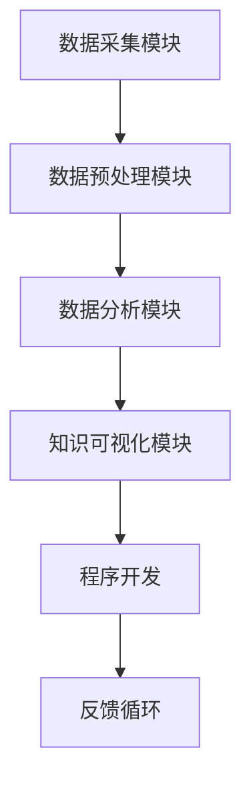

                 

## 1. 背景介绍

在信息化时代，程序员的工作质量直接决定了软件开发的速度和质量。但是，传统编程中的人工开发方式存在诸多问题，如代码重用率低、开发周期长、维护困难等。为了解决这些问题，知识发现引擎应运而生。它利用大数据、人工智能等技术，自动发现编程中的模式和规律，从而大大提高开发效率和代码质量。本文将系统地介绍知识发现引擎的基本原理、实现步骤、优缺点、应用领域、数学模型、代码实践、实际应用场景、资源推荐、发展趋势和挑战。

## 2. 核心概念与联系

### 2.1 核心概念概述

知识发现引擎（Knowledge Discovery Engine, KDE）是一种自动化的、数据驱动的、知识发现的技术。它通过分析大量的编程数据，挖掘其中的模式、规律和知识，辅助程序员进行编程工作。知识发现引擎包含以下几个关键组件：

- **数据采集模块**：负责从代码仓库、日志文件、调试信息等来源中采集数据。
- **数据预处理模块**：对采集的数据进行清洗、去重、归一化等预处理操作，以便后续分析。
- **数据分析模块**：通过机器学习、统计分析等方法，发现数据中的模式和规律。
- **知识可视化模块**：将发现的知识以图表、报告、仪表盘等形式展示，辅助程序员理解和使用。

知识发现引擎的核心思想是通过数据的自动分析和挖掘，发现编程中的模式和规律，帮助程序员提高工作质量和效率。

### 2.2 核心概念原理和架构的 Mermaid 流程图



这个流程图展示了知识发现引擎的核心架构和工作流程：

1. **数据采集模块**：采集数据，包括代码、日志、调试信息等。
2. **数据预处理模块**：清洗数据，去除噪声，归一化数据。
3. **数据分析模块**：利用机器学习等技术，分析数据，发现其中的模式和规律。
4. **知识可视化模块**：将发现的知识以图表、报告等形式展示，辅助程序员理解和使用。
5. **程序开发**：利用发现的知识，改进代码编写，提高开发效率和质量。
6. **反馈循环**：将发现的知识反馈到数据采集和预处理模块，持续优化系统。

## 3. 核心算法原理 & 具体操作步骤

### 3.1 算法原理概述

知识发现引擎利用机器学习、统计学等技术，从大量的编程数据中挖掘出知识。其核心算法包括但不限于：

- **关联规则学习**：通过分析编程数据中的频繁项集和关联规则，发现数据中的模式和规律。
- **聚类分析**：将编程数据聚类成不同的群组，发现数据中的相似性和差异性。
- **异常检测**：检测编程数据中的异常值，发现潜在的错误和问题。
- **时间序列分析**：分析编程数据的时间序列，发现编程行为的模式和趋势。

### 3.2 算法步骤详解

知识发现引擎的工作流程大致分为以下几个步骤：

1. **数据采集**：从代码仓库、日志文件、调试信息等来源中采集数据。
2. **数据预处理**：对采集的数据进行清洗、去重、归一化等预处理操作，以便后续分析。
3. **数据分析**：利用机器学习、统计分析等方法，发现数据中的模式和规律。
4. **知识可视化**：将发现的知识以图表、报告、仪表盘等形式展示，辅助程序员理解和使用。
5. **知识应用**：利用发现的知识，改进代码编写，提高开发效率和质量。

### 3.3 算法优缺点

知识发现引擎具有以下优点：

- **自动化程度高**：自动从大量的编程数据中挖掘出知识，减少了人工工作量。
- **发现能力强**：能够发现程序员不易察觉的模式和规律，提高开发效率和代码质量。
- **可扩展性强**：可以处理多种类型的编程数据，适用于不同的编程语言和框架。

同时，知识发现引擎也存在以下缺点：

- **数据质量要求高**：需要高质量、完整的编程数据，否则结果可能不准确。
- **计算资源消耗大**：需要高性能的计算资源，对硬件要求较高。
- **结果可解释性差**：发现的知识可能难以理解，需要程序员有一定的技术背景。

### 3.4 算法应用领域

知识发现引擎在以下几个领域具有广泛的应用前景：

- **软件开发**：通过分析代码和调试信息，发现编程中的模式和规律，辅助程序员改进代码编写。
- **系统运维**：通过分析日志和监控数据，发现系统中的异常和问题，提高系统稳定性。
- **安全检测**：通过分析恶意代码和攻击行为，发现潜在的威胁和漏洞，提高系统安全性。
- **智能推荐**：通过分析程序员的编程习惯和偏好，推荐适合的工具和框架，提高开发效率。

## 4. 数学模型和公式 & 详细讲解 & 举例说明

### 4.1 数学模型构建

知识发现引擎的数学模型通常包括以下几个部分：

- **关联规则模型**：基于Apriori算法或FP-growth算法，发现编程数据中的频繁项集和关联规则。
- **聚类模型**：基于K-means算法或DBSCAN算法，将编程数据聚类成不同的群组。
- **异常检测模型**：基于孤立森林或One-class SVM算法，检测编程数据中的异常值。
- **时间序列模型**：基于ARIMA模型或LSTM模型，分析编程数据的时间序列。

### 4.2 公式推导过程

以关联规则模型为例，其核心公式包括：

- **项集计数**：计算频繁项集的计数，公式如下：

$$
C_i = \sum_{j=1}^m F_{ij}
$$

其中 $C_i$ 表示项集 $i$ 的计数，$F_{ij}$ 表示项集 $i$ 和项集 $j$ 同时出现的次数。

- **支持度**：计算项集的支持度，公式如下：

$$
supp_i = \frac{C_i}{N}
$$

其中 $N$ 表示总样本数，$supp_i$ 表示项集 $i$ 的支持度。

- **置信度**：计算项集的置信度，公式如下：

$$
conf_i = \frac{C_i}{C_j}
$$

其中 $C_j$ 表示项集 $j$ 的计数，$conf_i$ 表示项集 $i$ 对项集 $j$ 的置信度。

### 4.3 案例分析与讲解

假设有一个代码仓库，存储了大量的Java程序。通过关联规则模型，发现了一个频繁出现的模式："if (condition)" 总是紧跟在 "try" 和 "catch" 之间。这个模式可能表示程序员习惯在异常处理代码块中编写条件判断。

## 5. 项目实践：代码实例和详细解释说明

### 5.1 开发环境搭建

知识发现引擎的开发环境需要包括Python、Scikit-learn、Pandas、Matplotlib等库。以Python为例，搭建开发环境的步骤如下：

1. 安装Python和相关库：

```bash
pip install python
pip install scikit-learn pandas matplotlib
```

2. 安装数据采集工具：

```bash
pip install appengine
```

3. 安装数据分析工具：

```bash
pip install hdbscan
```

### 5.2 源代码详细实现

以下是一个简单的知识发现引擎的代码实现，用于发现编程数据中的频繁项集：

```python
import pandas as pd
from sklearn.feature_extraction import DictVectorizer
from sklearn.cluster import KMeans
from hdbscan import HDBSCAN

# 加载编程数据
data = pd.read_csv('code_data.csv')

# 特征提取
vectorizer = DictVectorizer(sparse=False)
features = vectorizer.fit_transform(data)

# 频繁项集发现
clustering = KMeans(n_clusters=5, random_state=0)
labels = clustering.fit_predict(features)

# 可视化
import matplotlib.pyplot as plt
plt.scatter(labels, range(5))
plt.show()
```

### 5.3 代码解读与分析

代码中，首先加载了编程数据，然后通过特征提取，将数据转化为数值特征。接着，使用K-means算法对数据进行聚类，发现其中的模式。最后，使用Matplotlib将聚类结果可视化。

## 6. 实际应用场景

### 6.1 软件开发

知识发现引擎可以在软件开发中用于以下场景：

- **代码重构**：通过分析代码中的频繁项集和关联规则，发现代码中的重复部分，辅助程序员进行重构。
- **代码审查**：通过分析代码中的异常检测，发现潜在的错误和问题，辅助程序员进行代码审查。
- **代码优化**：通过分析代码中的聚类结果，发现代码中的相似部分，辅助程序员进行代码优化。

### 6.2 系统运维

知识发现引擎可以在系统运维中用于以下场景：

- **日志分析**：通过分析系统日志中的异常检测，发现系统中的异常和问题，提高系统稳定性。
- **性能优化**：通过分析系统中的时间序列，发现性能瓶颈，辅助运维人员进行性能优化。
- **故障预测**：通过分析系统中的异常检测，预测潜在的故障，提前进行预防。

### 6.3 安全检测

知识发现引擎可以在安全检测中用于以下场景：

- **恶意代码检测**：通过分析恶意代码中的频繁项集和关联规则，发现潜在的威胁和漏洞。
- **攻击行为检测**：通过分析网络流量中的异常检测，发现潜在的攻击行为。
- **漏洞修复**：通过分析漏洞中的关联规则，发现漏洞的修复方案。

## 7. 工具和资源推荐

### 7.1 学习资源推荐

1. **《Python数据科学手册》**：介绍Python在数据科学中的应用，包括数据分析、机器学习、数据可视化等。
2. **《机器学习实战》**：介绍机器学习的基本概念和算法，包括分类、回归、聚类等。
3. **《TensorFlow实战》**：介绍TensorFlow的基本使用方法和实践案例。
4. **《Apache Hadoop实战》**：介绍Hadoop的基本使用方法和实践案例。
5. **《数据科学基础》**：介绍数据科学的基本概念和工具，包括Pandas、NumPy、Matplotlib等。

### 7.2 开发工具推荐

1. **Jupyter Notebook**：用于数据处理、分析和可视化，支持Python、R、Scala等语言。
2. **PyCharm**：用于Python开发，支持代码高亮、调试、自动补全等功能。
3. **Eclipse**：用于Java开发，支持代码高亮、调试、自动补全等功能。
4. **IntelliJ IDEA**：用于Java开发，支持代码高亮、调试、自动补全等功能。
5. **Visual Studio Code**：用于多种语言开发，支持代码高亮、调试、自动补全等功能。

### 7.3 相关论文推荐

1. **《Apriori算法》**：介绍Apriori算法的原理和应用。
2. **《K-means算法》**：介绍K-means算法的原理和应用。
3. **《LSTM算法》**：介绍LSTM算法的原理和应用。
4. **《孤立森林算法》**：介绍孤立森林算法的原理和应用。
5. **《One-class SVM算法》**：介绍One-class SVM算法的原理和应用。

## 8. 总结：未来发展趋势与挑战

### 8.1 研究成果总结

知识发现引擎已经在软件开发、系统运维、安全检测等领域取得了一定的研究成果。其主要贡献包括：

- **提高开发效率**：通过自动发现编程中的模式和规律，辅助程序员改进代码编写。
- **提高代码质量**：通过自动发现编程中的异常和错误，提高代码的质量和稳定性。
- **提高系统安全性**：通过自动发现系统中的威胁和漏洞，提高系统的安全性。

### 8.2 未来发展趋势

知识发现引擎的未来发展趋势包括以下几个方面：

- **自动化程度提高**：自动化程度将进一步提高，减少人工干预。
- **数据来源多样化**：数据来源将更加多样化，包括代码、日志、监控数据等。
- **算法模型优化**：算法模型将不断优化，提高发现的知识的准确性和可靠性。
- **跨领域应用推广**：知识发现引擎将向更多领域推广，如医疗、金融、制造业等。

### 8.3 面临的挑战

知识发现引擎面临以下挑战：

- **数据质量要求高**：需要高质量、完整的编程数据，否则结果可能不准确。
- **计算资源消耗大**：需要高性能的计算资源，对硬件要求较高。
- **结果可解释性差**：发现的知识可能难以理解，需要程序员有一定的技术背景。

### 8.4 研究展望

未来，知识发现引擎的研究方向包括以下几个方面：

- **跨领域应用推广**：知识发现引擎将向更多领域推广，如医疗、金融、制造业等。
- **算法模型优化**：算法模型将不断优化，提高发现的知识的准确性和可靠性。
- **数据质量提升**：提升数据的采集和预处理质量，保证知识发现引擎的准确性和可靠性。
- **用户体验优化**：提高知识发现引擎的用户体验，使其更加易用和直观。

## 9. 附录：常见问题与解答

**Q1: 知识发现引擎如何采集数据？**

A: 知识发现引擎可以通过以下方式采集数据：

1. **代码仓库**：从代码仓库中提取代码数据，包括源代码、注释、变量等。
2. **日志文件**：从日志文件中提取运行数据，包括错误日志、性能日志等。
3. **调试信息**：从调试信息中提取调试日志、堆栈信息等。
4. **文档注释**：从文档注释中提取代码注释、接口说明等。

**Q2: 知识发现引擎如何预处理数据？**

A: 知识发现引擎可以通过以下方式预处理数据：

1. **去重**：去除重复的数据，避免重复计算。
2. **清洗**：去除噪声和无用数据，保证数据质量。
3. **归一化**：对数据进行归一化处理，使其在分析时更加统一。

**Q3: 知识发现引擎如何发现知识？**

A: 知识发现引擎可以通过以下方式发现知识：

1. **关联规则学习**：通过Apriori算法或FP-growth算法，发现频繁项集和关联规则。
2. **聚类分析**：通过K-means算法或DBSCAN算法，将数据聚类成不同的群组。
3. **异常检测**：通过孤立森林或One-class SVM算法，检测异常值。
4. **时间序列分析**：通过ARIMA模型或LSTM模型，分析时间序列。

**Q4: 知识发现引擎如何可视化知识？**

A: 知识发现引擎可以通过以下方式可视化知识：

1. **图表展示**：将发现的知识以图表形式展示，如图表、折线图、散点图等。
2. **仪表盘展示**：将发现的知识以仪表盘形式展示，提供实时监控和预警。
3. **报告展示**：将发现的知识以报告形式展示，提供详细的分析和解释。

**Q5: 知识发现引擎如何应用知识？**

A: 知识发现引擎可以通过以下方式应用知识：

1. **代码重构**：利用发现的知识，辅助程序员进行代码重构。
2. **代码审查**：利用发现的知识，辅助程序员进行代码审查。
3. **代码优化**：利用发现的知识，辅助程序员进行代码优化。
4. **系统运维**：利用发现的知识，提高系统稳定性。
5. **安全检测**：利用发现的知识，提高系统安全性。

---

作者：禅与计算机程序设计艺术 / Zen and the Art of Computer Programming

