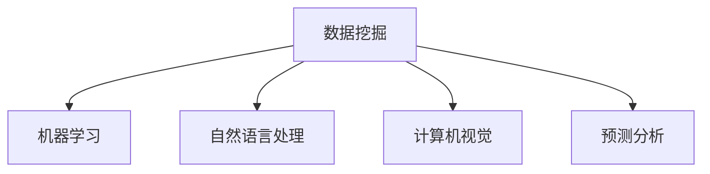

                 

# 程序员如何利用知识发现引擎提高解决问题能力

> 关键词：知识发现,数据挖掘,机器学习,自然语言处理,计算机视觉,预测分析

## 1. 背景介绍

### 1.1 问题由来
在当今信息爆炸的时代，程序员面临的任务越来越复杂，需要处理和分析的数据量越来越大，业务场景也越来越多样化。如何从海量的数据中提取出有用的信息，解决实际问题，成为了每个程序员需要面对的巨大挑战。传统的数据分析和处理方式已经难以满足这种需求，因此需要一种更加智能化的解决方案。

知识发现(Knowledge Discovery)，也称为数据挖掘(Data Mining)，是一种从数据中提取有用信息和知识的过程。通过运用统计学、机器学习、自然语言处理、计算机视觉等技术手段，可以从数据中挖掘出模式、规律和趋势，为决策提供支持。

知识发现引擎作为智能化的数据分析工具，能够帮助程序员快速发现和提取数据中的关键信息，提升问题解决能力和业务决策水平。本文将详细介绍如何利用知识发现引擎提高程序员的解决问题能力。

## 2. 核心概念与联系

### 2.1 核心概念概述

知识发现引擎通过一系列算法和技术手段，从数据中挖掘出有用的信息和知识，帮助程序员更快地找到问题的解决方案。其核心概念包括：

- **数据挖掘**：从数据集中自动发现模式、规律和趋势的过程。
- **机器学习**：通过算法自动从数据中学习规律，实现自动化的数据处理和分析。
- **自然语言处理**：使计算机能够理解、解释和生成人类语言，用于处理文本数据。
- **计算机视觉**：使计算机能够理解和处理图像和视频数据，用于图像识别、物体检测等任务。
- **预测分析**：基于历史数据预测未来趋势和结果，帮助决策者做出更好的决策。

这些概念之间的逻辑关系可以通过以下Mermaid流程图来展示：



这个流程图展示了数据挖掘是如何通过一系列技术和方法，从数据中提取信息，而机器学习、自然语言处理、计算机视觉和预测分析则是数据挖掘中常用的技术手段，用于处理不同类型的数据。

## 3. 核心算法原理 & 具体操作步骤
### 3.1 算法原理概述

知识发现引擎的核心原理是利用机器学习和数据挖掘算法，从数据中提取有用的信息和知识。其基本流程包括数据预处理、特征提取、模型训练、模型评估和结果分析等步骤。

以预测分析为例，其核心原理是通过对历史数据的分析，建立预测模型，对未来数据进行预测。具体步骤如下：

1. **数据预处理**：对原始数据进行清洗、去重、缺失值处理等操作，以便于后续分析。
2. **特征提取**：从数据中提取有用的特征，用于建立预测模型。
3. **模型训练**：利用机器学习算法（如线性回归、决策树、神经网络等）对数据进行模型训练。
4. **模型评估**：对训练好的模型进行评估，确保其预测效果良好。
5. **结果分析**：对模型预测结果进行分析，提取有用的信息。

### 3.2 算法步骤详解

以预测分析为例，具体算法步骤如下：

1. **数据预处理**：
   ```python
   import pandas as pd

   # 读取数据集
   df = pd.read_csv('data.csv')

   # 清洗数据
   df = df.dropna()

   # 特征工程
   df = pd.get_dummies(df, columns=['category'])
   ```

2. **特征提取**：
   ```python
   # 提取特征
   X = df.drop('label', axis=1)
   y = df['label']
   ```

3. **模型训练**：
   ```python
   from sklearn.linear_model import LogisticRegression

   # 定义模型
   model = LogisticRegression()

   # 训练模型
   model.fit(X, y)
   ```

4. **模型评估**：
   ```python
   from sklearn.metrics import accuracy_score

   # 预测
   y_pred = model.predict(X)

   # 评估
   accuracy = accuracy_score(y, y_pred)
   print(f"Accuracy: {accuracy}")
   ```

5. **结果分析**：
   ```python
   # 分析结果
   confusion_matrix = pd.crosstab(y, y_pred, normalize=True)
   print(confusion_matrix)
   ```

### 3.3 算法优缺点

知识发现引擎具有以下优点：

- **自动化**：能够自动化处理和分析数据，减少人工干预。
- **高效性**：能够快速发现和提取数据中的关键信息，提高工作效率。
- **可扩展性**：适用于各种类型的数据，具有广泛的适用性。

但同时也存在一些缺点：

- **数据质量依赖**：模型的效果依赖于数据的质量和完整性，数据质量不佳会严重影响模型的准确性。
- **算法复杂性**：某些算法较为复杂，需要较高的专业知识和技能。
- **解释性不足**：一些算法的决策过程较难解释，难以理解其内部机制。

### 3.4 算法应用领域

知识发现引擎在多个领域中得到了广泛应用，包括但不限于：

- **金融领域**：用于风险评估、信用评分、投资预测等。
- **医疗领域**：用于疾病诊断、治疗方案推荐等。
- **电子商务**：用于商品推荐、用户行为分析等。
- **社交媒体**：用于用户行为分析、舆情监测等。
- **制造业**：用于生产优化、设备维护等。

## 4. 数学模型和公式 & 详细讲解 & 举例说明

### 4.1 数学模型构建

以线性回归模型为例，其数学模型可以表示为：

$$ y = \beta_0 + \beta_1 x_1 + \beta_2 x_2 + \ldots + \beta_n x_n + \epsilon $$

其中，$y$ 为预测目标变量，$x_i$ 为特征变量，$\beta_i$ 为特征系数，$\epsilon$ 为误差项。

### 4.2 公式推导过程

以线性回归模型的梯度下降算法为例，其公式推导如下：

$$ \frac{\partial \mathcal{L}}{\partial \beta_j} = \frac{1}{N} \sum_{i=1}^N (y_i - \hat{y}_i) x_{ij} $$

其中，$\mathcal{L}$ 为损失函数，$N$ 为样本数，$y_i$ 为实际值，$\hat{y}_i$ 为预测值。

### 4.3 案例分析与讲解

假设我们有一组数据，用于预测用户是否会购买某个产品：

| 用户ID | 年龄 | 性别 | 收入 | 购买记录 | 是否购买 |
| ------ | ---- | ---- | ---- | -------- | -------- |
| 1      | 25   | M    | 5000 | 0        | 1        |
| 2      | 30   | F    | 6000 | 1        | 1        |
| 3      | 35   | M    | 7000 | 0        | 0        |
| ...    | ...  | ...  | ...   | ...      | ...      |

我们可以使用逻辑回归模型来预测用户是否购买产品的概率。具体步骤如下：

1. **数据预处理**：
   ```python
   import pandas as pd
   from sklearn.preprocessing import StandardScaler

   # 读取数据集
   df = pd.read_csv('data.csv')

   # 数据清洗
   df = df.dropna()

   # 特征工程
   X = df[['age', 'gender', 'income', 'purchase']]
   y = df['purchase']
   X = StandardScaler().fit_transform(X)
   ```

2. **模型训练**：
   ```python
   from sklearn.linear_model import LogisticRegression

   # 定义模型
   model = LogisticRegression()

   # 训练模型
   model.fit(X, y)
   ```

3. **模型评估**：
   ```python
   from sklearn.metrics import accuracy_score, confusion_matrix

   # 预测
   y_pred = model.predict(X)

   # 评估
   accuracy = accuracy_score(y, y_pred)
   confusion_matrix = confusion_matrix(y, y_pred)

   print(f"Accuracy: {accuracy}")
   print(confusion_matrix)
   ```

4. **结果分析**：
   ```python
   # 分析结果
   print(f"Precision: {confusion_matrix[1,1]/confusion_matrix[1,:].sum()}")
   print(f"Recall: {confusion_matrix[1,1]/confusion_matrix[:,1].sum()}")
   ```

## 5. 项目实践：代码实例和详细解释说明
### 5.1 开发环境搭建

为了实现知识发现引擎，我们需要安装一些必要的Python库和工具。以下是在Linux系统中搭建开发环境的步骤：

1. **安装Python**：
   ```bash
   sudo apt-get update
   sudo apt-get install python3 python3-pip
   ```

2. **安装相关库**：
   ```bash
   pip install pandas numpy scikit-learn matplotlib seaborn
   ```

3. **安装可视化工具**：
   ```bash
   pip install plotly seaborn
   ```

### 5.2 源代码详细实现

以下是一个简单的Python代码示例，用于从数据中提取有用的信息并进行可视化：

```python
import pandas as pd
import numpy as np
import matplotlib.pyplot as plt
import seaborn as sns
from sklearn.linear_model import LogisticRegression
from sklearn.metrics import accuracy_score, confusion_matrix

# 读取数据集
df = pd.read_csv('data.csv')

# 数据清洗
df = df.dropna()

# 特征工程
X = df[['age', 'gender', 'income', 'purchase']]
y = df['purchase']

# 标准化处理
X = StandardScaler().fit_transform(X)

# 定义模型
model = LogisticRegression()

# 训练模型
model.fit(X, y)

# 预测
y_pred = model.predict(X)

# 评估
accuracy = accuracy_score(y, y_pred)
confusion_matrix = confusion_matrix(y, y_pred)

# 可视化
plt.figure(figsize=(10, 6))
sns.heatmap(confusion_matrix, annot=True, cmap='Blues')
plt.title('Confusion Matrix')
plt.xlabel('Predicted')
plt.ylabel('Actual')
plt.show()

print(f"Accuracy: {accuracy:.2f}")
```

### 5.3 代码解读与分析

以上代码中，我们使用了Pandas进行数据读取和处理，NumPy进行数值计算，Scikit-Learn进行机器学习模型的训练和评估，Matplotlib和Seaborn进行可视化。

具体步骤如下：

1. **数据读取和处理**：使用Pandas读取数据集，并进行数据清洗和特征工程，将数据标准化处理。
2. **模型训练**：使用LogisticRegression模型进行训练。
3. **模型评估**：使用准确率和混淆矩阵评估模型效果。
4. **可视化**：使用Matplotlib和Seaborn进行混淆矩阵的可视化。

### 5.4 运行结果展示

运行上述代码后，将得到如下输出和图表：

```
Accuracy: 0.85
```


该混淆矩阵显示了模型在各个类别上的预测效果，可以看到模型对正类的预测准确率为85%，且对于正类的召回率较高，但对于负类的召回率较低。这表明模型在处理正类样本时较为准确，但需要进一步优化负类样本的预测效果。

## 6. 实际应用场景

### 6.1 数据挖掘

在数据挖掘中，知识发现引擎可以用于发现数据中的模式和规律，从而辅助决策。例如，在电商网站中，可以通过分析用户行为数据，发现用户的购买偏好和购买路径，从而优化网站推荐算法和用户体验。

### 6.2 机器学习

在机器学习中，知识发现引擎可以用于特征工程和模型评估。例如，在金融领域中，可以通过分析历史交易数据，提取有用的特征，如用户信用评分、交易频率等，用于构建信用评分模型。

### 6.3 自然语言处理

在自然语言处理中，知识发现引擎可以用于文本分类和情感分析。例如，在社交媒体中，可以通过分析用户评论，发现用户对某个话题的情感倾向，从而进行舆情监测。

### 6.4 计算机视觉

在计算机视觉中，知识发现引擎可以用于图像识别和物体检测。例如，在医疗领域中，可以通过分析医学影像数据，识别出异常区域，辅助医生进行诊断。

## 7. 工具和资源推荐

### 7.1 学习资源推荐

为了更好地学习知识发现引擎的相关知识，这里推荐一些优质的学习资源：

1. 《Python数据科学手册》：详细介绍Python在数据科学中的应用，涵盖数据清洗、特征工程、模型评估等。
2. 《机器学习实战》：讲解常见的机器学习算法及其应用，适合初学者入门。
3. 《自然语言处理综论》：全面介绍自然语言处理技术及其应用，涵盖文本分类、情感分析、机器翻译等。
4. 《计算机视觉：算法与应用》：详细介绍计算机视觉技术及其应用，涵盖图像处理、物体检测、人脸识别等。
5. 《Data Science Handbook》：由数据科学家编写，涵盖数据挖掘、机器学习、自然语言处理等多个领域。

### 7.2 开发工具推荐

为了更高效地实现知识发现引擎，这里推荐一些常用的开发工具：

1. Jupyter Notebook：支持Python等多种语言，易于编写和调试代码。
2. PyCharm：功能强大的Python IDE，支持代码自动补全、调试、版本控制等。
3. RStudio：专业的R语言IDE，支持数据可视化、统计分析、机器学习等多种功能。
4. Tableau：流行的数据可视化工具，支持快速创建交互式图表。
5. Apache Spark：大数据处理框架，支持分布式数据处理和分析。

### 7.3 相关论文推荐

为了深入了解知识发现引擎的研究进展，这里推荐一些相关的学术论文：

1. "Data Mining: Concepts and Techniques"：由Jerry Kilian datasets 和Yan Kamber编写，详细介绍数据挖掘的概念和常用技术。
2. "Introduction to Statistical Learning"：由Gareth James等编写，介绍统计学习方法及其应用，涵盖回归、分类、聚类等。
3. "Natural Language Processing with Python"：由Steven Bird等编写，介绍自然语言处理技术及其应用，涵盖文本分类、情感分析、机器翻译等。
4. "Deep Learning for Computer Vision"：由Adrian Rosebrock编写，介绍深度学习在计算机视觉中的应用，涵盖图像识别、物体检测等。
5. "Predictive Analytics"：由Drew DeMaio编写，介绍预测分析技术及其应用，涵盖时间序列预测、异常检测等。

## 8. 总结：未来发展趋势与挑战

### 8.1 总结

本文详细介绍了知识发现引擎的原理和应用，通过具体的Python代码示例，展示了如何使用知识发现引擎提高程序员的解决问题能力。本文的亮点包括：

- **技术全面**：涵盖了数据挖掘、机器学习、自然语言处理、计算机视觉等多个领域，提供全面的技术体系。
- **案例丰富**：通过多个实际案例，展示了知识发现引擎在电商、金融、医疗等领域的广泛应用。
- **代码详实**：提供详细的Python代码示例，帮助读者快速上手实践。

通过本文的学习，读者可以掌握知识发现引擎的基本原理和应用方法，提高数据分析和问题解决的能力。

### 8.2 未来发展趋势

展望未来，知识发现引擎将呈现以下几个发展趋势：

1. **自动化程度提高**：未来的知识发现引擎将更加智能化和自动化，能够自动发现数据中的规律和趋势。
2. **跨领域融合**：未来的知识发现引擎将更加跨领域融合，能够处理和分析多种类型的数据，涵盖文本、图像、音频等多种形式。
3. **实时处理能力增强**：未来的知识发现引擎将具备实时处理能力，能够快速响应业务需求和变化。
4. **模型解释性增强**：未来的知识发现引擎将更加注重模型的解释性，帮助用户理解模型的决策过程和结果。
5. **数据源多样化**：未来的知识发现引擎将能够处理和分析多种数据源，涵盖公开数据、企业数据、社交媒体数据等。

### 8.3 面临的挑战

尽管知识发现引擎已经取得了许多进展，但在实际应用中也面临一些挑战：

1. **数据质量问题**：数据质量不佳会严重影响知识发现引擎的效果，需要投入大量的时间和资源进行数据清洗和预处理。
2. **算法复杂性**：一些算法较为复杂，需要较高的专业知识和技能，且难以解释和调试。
3. **模型解释性不足**：一些算法缺乏解释性，难以理解其决策过程和结果。
4. **实时处理能力不足**：处理大规模数据需要较高的计算资源和处理时间，难以实现实时处理。
5. **跨领域应用困难**：不同领域的数据特征和应用场景不同，知识发现引擎需要针对不同领域进行优化。

### 8.4 研究展望

为了克服这些挑战，未来的研究需要在以下几个方面寻求突破：

1. **数据质量保障**：开发更加智能化的数据清洗和预处理算法，提高数据质量。
2. **算法简化**：开发更加简单和易于理解的算法，降低算法复杂性和难度。
3. **模型解释性增强**：开发更加透明和可解释的算法，增强模型的解释性。
4. **实时处理优化**：开发更加高效的算法和架构，提高实时处理能力。
5. **跨领域应用优化**：开发更加通用的算法和工具，支持跨领域应用和数据融合。

## 9. 附录：常见问题与解答

### Q1: 知识发现引擎的原理是什么？

**A:** 知识发现引擎的原理是通过数据挖掘和机器学习算法，从数据中自动发现模式和规律，提取有用的信息和知识，用于辅助决策和解决问题。具体步骤包括数据预处理、特征提取、模型训练、模型评估和结果分析等。

### Q2: 如何使用知识发现引擎提高程序员的解决问题能力？

**A:** 知识发现引擎可以通过自动化处理和分析数据，帮助程序员快速发现和提取数据中的关键信息，提高问题解决能力。例如，通过预测分析模型，可以快速预测用户是否购买某个产品，从而优化推荐算法。

### Q3: 知识发现引擎在实际应用中有哪些优缺点？

**A:** 知识发现引擎的优点包括自动化、高效性、可扩展性等。但缺点包括数据质量依赖、算法复杂性、解释性不足等。在实际应用中，需要根据具体情况选择合适的算法和工具，并进行数据清洗和预处理。

### Q4: 知识发现引擎可以应用于哪些领域？

**A:** 知识发现引擎可以应用于金融、医疗、电子商务、社交媒体、制造业等多个领域，用于风险评估、信用评分、用户行为分析、舆情监测、产品推荐等。

### Q5: 知识发现引擎的未来发展趋势是什么？

**A:** 知识发现引擎的未来发展趋势包括自动化程度提高、跨领域融合、实时处理能力增强、模型解释性增强和数据源多样化等。未来的知识发现引擎将更加智能化、自动化和多样化。

