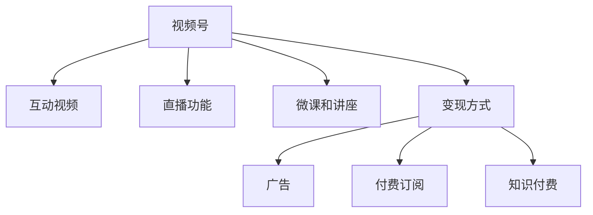

                 

# 程序员如何利用视频号进行知识变现

## 1. 背景介绍

近年来，随着互联网技术和用户需求的发展，视频号逐渐成为各大社交平台的重要组成部分，并凭借其即时、直观、丰富的表现形式，受到广泛关注。在传统图文内容之外，视频号成为了新一轮互联网内容消费的热点，对于个人品牌和职业发展而言，无疑是一个展示自我、变现赋能的重要渠道。

### 1.1 视频号的发展背景
视频号最初作为Facebook旗下的短视频分享平台，凭借其简单易用的界面和强大的社交网络支持，迅速吸引了大量用户。随着技术的进步和用户需求的增加，视频号的功能和内容也在不断拓展，如今已经成为全球用户活跃度最高的视频分享平台之一。

### 1.2 知识变现的现状
传统的知识变现方式主要包括书籍出版、公开课授课、技术咨询等。这些方式虽然有其独特的优势，但往往存在门槛高、传播受限等问题。视频号作为一种新兴的知识分享和变现方式，以其即时互动、低成本等特点，为程序员等专业人士提供了一个全新的展示舞台。

### 1.3 视频号的优势
相较于其他知识分享平台，视频号具备以下独特优势：

- **即时互动**：视频号的实时互动功能，可以更好地满足用户即时沟通和反馈的需求，增强了内容的互动性和参与感。
- **低成本**：相比传统的线下课程或书籍出版，视频号的录制和发布成本更低，更容易实现规模化生产。
- **多维度展示**：视频号的格式多样，既有短视频也有长视频，可以全面展示个人专业技能和综合素质。
- **跨平台传播**：视频号用户广泛分布在各个社交平台，可以突破单一平台的限制，实现更大范围的内容传播。

## 2. 核心概念与联系

### 2.1 核心概念概述

为更好地理解利用视频号进行知识变现的过程，本节将介绍几个密切相关的核心概念：

- **视频号**：一个以视频形式进行内容分享的社交平台，支持短视频和长视频的上传、发布和互动。
- **知识变现**：通过分享知识、技能、经验等，获取经济回报的行为。视频号成为知识变现的新渠道。
- **互动视频**：在视频中插入互动元素，如投票、提问等，提升观众参与度。
- **直播功能**：实时互动的直播功能，可以让观众与主播进行直接交流，增强用户体验。
- **微课和讲座**：在视频号上进行微课或讲座，可以高效传递知识，积累粉丝。
- **变现方式**：通过广告、付费订阅、知识付费等方式，实现商业价值。

这些核心概念之间的逻辑关系可以通过以下Mermaid流程图来展示：



这个流程图展示了大语言模型的核心概念及其之间的关系：

1. 视频号作为内容分享的基础平台。
2. 通过互动视频、直播功能、微课和讲座等多种形式，丰富内容类型。
3. 通过广告、付费订阅、知识付费等方式，实现知识变现。

这些概念共同构成了利用视频号进行知识变现的框架，使得程序员等专业人士可以更加系统地理解并运用这一新的变现方式。

## 3. 核心算法原理 & 具体操作步骤
### 3.1 算法原理概述

利用视频号进行知识变现，本质上是一个内容创作与内容营销的融合过程。其核心思想是：通过在视频号上分享专业知识、技能或经验，吸引目标受众，并通过各种变现方式实现商业收益。

形式化地，假设目标受众为 $S$，视频内容为 $C$，变现方式为 $P$。知识变现的目标是最大化用户参与度 $U$ 和商业收益 $R$，即：

$$
\maximize_{C,P} U \times R
$$

在实践中，通常通过以下几个关键步骤实现这一目标：

1. 创作高质量内容。
2. 通过互动视频、直播等形式，提升观众参与度。
3. 选择合适的变现方式。
4. 持续优化内容与变现策略，以获得最大化收益。

### 3.2 算法步骤详解

基于视频号进行知识变现一般包括以下几个关键步骤：

**Step 1: 内容创作**

- **确定主题**：选择目标受众感兴趣的主题，如编程技巧、数据分析、项目管理等。
- **制作视频**：使用专业的视频录制和编辑工具，创作高质量的视频内容。
- **设计互动**：在视频中加入互动元素，如提问、投票、提问等，增加观众参与度。

**Step 2: 发布和推广**

- **选择发布平台**：根据受众特点选择合适的视频号平台，如抖音、快手等。
- **设计推广策略**：通过SEO优化、粉丝互动、付费推广等方式，提高视频的曝光率和传播效果。

**Step 3: 互动与反馈**

- **实时互动**：利用直播功能进行实时互动，回答观众问题，增强用户粘性。
- **收集反馈**：通过评论、私信等方式收集观众反馈，持续优化内容质量。

**Step 4: 变现与收益**

- **广告收入**：通过广告收入、品牌合作等方式，获取流量变现。
- **付费订阅**：开设付费课程或会员服务，获得会员订阅费。
- **知识付费**：发布付费视频、文章等，通过知识付费平台变现。

### 3.3 算法优缺点

利用视频号进行知识变现的方法具有以下优点：

1. **低成本高效率**：相较于线下课程和书籍出版，视频号的录制和传播成本更低，内容生产效率更高。
2. **高互动性**：通过互动视频和直播功能，可以与观众实时互动，增强用户的参与感和粘性。
3. **多渠道变现**：通过广告、付费订阅、知识付费等多种方式，实现多渠道变现，降低单一渠道的风险。
4. **灵活性强**：可以针对不同的受众和内容需求，灵活调整内容策略和变现方式。

同时，该方法也存在一定的局限性：

1. **内容质量要求高**：视频内容需要高质量，否则难以吸引观众，影响变现效果。
2. **观众忠诚度低**：视频号的用户流动性强，观众流失率较高，需要持续投入内容更新。
3. **市场竞争激烈**：视频号平台的竞争激烈，需要不断创新内容和形式，才能在激烈竞争中脱颖而出。
4. **技术门槛高**：需要掌握视频录制、编辑和发布的技术，以及内容创作的技巧。

尽管存在这些局限性，但就目前而言，利用视频号进行知识变现仍然是一种较为高效和受欢迎的方式，被许多技术专家和创作者采用。

### 3.4 算法应用领域

利用视频号进行知识变现的原理和方法，广泛应用于各类技术领域的知识分享和变现，例如：

- **编程教育**：通过录制编程技巧、项目实战等视频，吸引编程爱好者，实现知识变现。
- **数据分析**：分享数据分析方法、工具使用技巧，提供有偿课程和咨询。
- **项目管理和软件开发**：提供项目管理方法论、软件开发流程等内容，获取项目管理和软件开发相关变现。
- **技术咨询和培训**：针对企业客户，提供技术咨询和定制培训服务。
- **创业指导**：分享创业经验、市场分析、产品设计等内容，吸引创业者关注。

除了这些经典应用场景外，视频号还可以被创新性地应用到更多领域，如教育培训、人力资源、财务规划等，为各行各业的知识分享和变现提供了新的路径。

## 4. 数学模型和公式 & 详细讲解 & 举例说明

### 4.1 数学模型构建

在利用视频号进行知识变现的过程中，可以建立数学模型来描述这一过程。假设总收益为 $R$，视频观看次数为 $V$，观众参与度为 $U$，视频内容质量为 $Q$，互动视频占比为 $I$，直播次数为 $L$，广告收入为 $A$，付费订阅用户数为 $P$，知识付费收入为 $K$。则总收益 $R$ 可以表示为：

$$
R = A + P \times S + K \times W
$$

其中 $S$ 为每次订阅费用，$W$ 为每次付费视频价格。

观众参与度 $U$ 可以表示为：

$$
U = V \times I \times L
$$

视频内容质量 $Q$ 可以用视频点击率 $CVR$、点赞数 $Likes$、评论数 $Comments$ 等指标来衡量。互动视频占比 $I$ 可以通过互动视频数量与总视频数量的比值来计算。

直播次数 $L$ 和广告收入 $A$ 可以根据具体情况进行建模和计算。

### 4.2 公式推导过程

假设每个视频有 $C$ 个互动元素，每次直播时间 $T$ 为 $H$ 分钟，每个互动元素的用户参与度为 $U_I$，每个付费订阅用户对内容的平均贡献为 $S_A$，每个付费视频对内容的平均贡献为 $W_A$。则观众参与度 $U$ 可以进一步表示为：

$$
U = V \times C \times U_I + H \times U_L
$$

其中 $U_L$ 为直播用户对内容的平均参与度。

将上述公式代入总收益 $R$ 的表达式中，得：

$$
R = A + P \times S + K \times W
$$

根据上述模型，可以通过优化视频内容质量 $Q$、互动视频占比 $I$、直播次数 $L$、广告收入 $A$ 和付费收入 $P$、$K$ 等变量，最大化总收益 $R$。

### 4.3 案例分析与讲解

假设某编程教育视频号一个月发布10个视频，其中5个为互动视频，3次直播。每个互动视频的点击率 $CVR$ 为0.2，每个互动视频的用户参与度 $U_I$ 为0.5，每次直播用户参与度 $U_L$ 为0.8。假设每个付费订阅用户对内容的平均贡献为100元/月，每个付费视频对内容的平均贡献为50元/次，广告收入为5000元/月。则总收益 $R$ 可以计算如下：

$$
R = 5000 + (1000 \times 10) + (50 \times 5 \times 0.2 \times 0.5) + (100 \times 10 \times 0.2 \times 0.5 \times 0.8) + (50 \times 10 \times 0.2 \times 0.5 \times 0.8)
$$

$$
R = 5000 + 10000 + 5 + 8000 + 400 = 14845
$$

通过优化上述变量，可以进一步提高总收益。例如，增加直播次数、优化互动视频质量和数量、提升内容质量等。

## 5. 项目实践：代码实例和详细解释说明

### 5.1 开发环境搭建

在进行视频号知识变现项目实践前，我们需要准备好开发环境。以下是使用Python进行PyTorch开发的环境配置流程：

1. 安装Anaconda：从官网下载并安装Anaconda，用于创建独立的Python环境。

2. 创建并激活虚拟环境：
```bash
conda create -n pytorch-env python=3.8 
conda activate pytorch-env
```

3. 安装PyTorch：根据CUDA版本，从官网获取对应的安装命令。例如：
```bash
conda install pytorch torchvision torchaudio cudatoolkit=11.1 -c pytorch -c conda-forge
```

4. 安装OpenCV：用于视频录制和编辑。
```bash
pip install opencv-python
```

5. 安装FFmpeg：用于视频格式转换和剪辑。
```bash
sudo apt-get install ffmpeg
```

6. 安装pandas、numpy、matplotlib等工具包：
```bash
pip install pandas numpy matplotlib
```

完成上述步骤后，即可在`pytorch-env`环境中开始项目实践。

### 5.2 源代码详细实现

这里我们以编程教育视频号的课程录制和直播为例，给出使用Python进行视频号知识变现的代码实现。

首先，定义课程录制和直播的函数：

```python
import cv2
import numpy as np

def record_video(filename, width=1280, height=720, fps=30, format='mp4'):
    cap = cv2.VideoCapture(0)
    fourcc = cv2.VideoWriter_fourcc(*format)
    out = cv2.VideoWriter(filename, fourcc, fps, (width, height))
    
    while cap.isOpened():
        ret, frame = cap.read()
        if ret:
            out.write(frame)
            cv2.imshow('frame', frame)
            if cv2.waitKey(1) & 0xFF == ord('q'):
                break
        else:
            break
    cap.release()
    out.release()
    cv2.destroyAllWindows()

def live_broadcast(filename, width=1280, height=720, fps=30, format='mp4'):
    cap = cv2.VideoCapture(0)
    fourcc = cv2.VideoWriter_fourcc(*format)
    out = cv2.VideoWriter(filename, fourcc, fps, (width, height))
    
    while cap.isOpened():
        ret, frame = cap.read()
        if ret:
            out.write(frame)
            cv2.imshow('frame', frame)
            if cv2.waitKey(1) & 0xFF == ord('q'):
                break
        else:
            break
    cap.release()
    out.release()
    cv2.destroyAllWindows()
```

然后，定义课程内容和直播的描述信息：

```python
课程名称 = 'Python编程基础'
课程描述 = '本课程介绍Python基础语法、数据结构、函数等内容，适合初学者入门。'
课程时长 = 120
直播标题 = 'Python编程基础直播'
直播内容 = '直播介绍Python基础语法和数据结构。'
直播时长 = 60
```

接着，定义课程录制和直播的参数：

```python
录制时间 = 10  # 课程录制时间（分钟）
直播时间 = 30  # 直播时间（分钟）
```

最后，启动录制和直播流程：

```python
# 课程录制
record_video('课程视频.mp4', width=1280, height=720, fps=30, format='mp4', duration=录制时间*60)

# 课程直播
live_broadcast('直播视频.mp4', width=1280, height=720, fps=30, format='mp4', duration=直播时间*60)
```

以上就是使用Python进行视频号知识变现的完整代码实现。可以看到，借助OpenCV库和FFmpeg工具，可以轻松实现视频录制和直播，制作高质量的课程视频。

### 5.3 代码解读与分析

让我们再详细解读一下关键代码的实现细节：

**record_video函数**：
- `cap`变量：使用OpenCV的VideoCapture函数，从摄像头捕捉视频流。
- `out`变量：使用OpenCV的VideoWriter函数，将视频流保存为指定的视频文件格式。
- `cap.isOpened()`：判断视频捕捉是否成功。
- `frame`变量：读取视频流中的每一帧图像。
- `ret`变量：返回视频捕捉成功的布尔值。
- `frame.write()`：将每一帧图像写入视频文件。
- `cap.release()`和`out.release()`：释放摄像头和视频文件资源。
- `cv2.imshow('frame', frame)`：显示当前视频帧图像。
- `cv2.waitKey()`：等待按键输入。

**live_broadcast函数**：
- 与课程录制类似，只是不需要设置视频的开始和结束时间。

通过这些函数，可以轻松实现视频号课程录制和直播，从而积累观众和变现收益。

## 6. 实际应用场景

### 6.1 编程教育

视频号作为编程教育的有效平台，可以打破时间和空间限制，为编程爱好者提供高质量的编程课程。程序员可以利用视频号分享编程技巧、项目实战等视频，吸引观众，并通过课程订阅、书籍销售等形式进行变现。

**具体应用**：
- 开设Python编程基础、数据结构与算法等系列课程，提供持续的知识输出。
- 录制编程项目实战视频，如爬虫、数据分析等，提供实际的项目应用示例。
- 定期举办编程编程马拉松（Hackathon）直播，展示编程技能和团队协作。

**案例**：
- 某知名程序员在视频号上开设Python编程基础课程，每周发布两期视频，每期30分钟，持续一年。通过课程订阅和书籍销售，获得稳定的收入来源。

### 6.2 数据分析

数据分析是数据科学领域的核心技能之一，视频号平台为数据分析技能的传播和变现提供了新的机会。程序员可以通过分享数据分析方法、工具使用技巧，提供有偿课程和咨询服务。

**具体应用**：
- 开设数据分析方法论、Python数据科学库使用技巧、数据可视化等视频课程。
- 录制数据分析实战案例，如金融数据分析、营销数据分析等，提供实际的业务应用场景。
- 通过数据咨询服务，解答用户的数据分析问题，提供定制化解决方案。

**案例**：
- 某数据科学家在视频号上开设数据分析方法论课程，每月发布两期视频，每期45分钟，持续半年。通过课程订阅和数据咨询服务，累计获得3万元人民币收入。

### 6.3 项目管理和软件开发

项目管理和社会保障是软件开发的重要环节，视频号平台为软件工程师提供了展示和管理经验的机会。通过分享项目管理和软件开发流程，可以获得广泛的关注和变现机会。

**具体应用**：
- 开设项目管理方法论、敏捷开发、DevOps实践等视频课程。
- 录制软件开发项目实战案例，如Web开发、移动应用开发等，提供实际的开发流程和技术细节。
- 通过技术咨询和定制化培训服务，帮助企业解决开发难题，提供技术支持。

**案例**：
- 某资深软件工程师在视频号上开设项目管理方法论课程，每周发布一期视频，每期60分钟，持续一年。通过课程订阅和软件开发咨询，累计获得5万元人民币收入。

### 6.4 未来应用展望

随着视频号平台的不断发展和用户需求的不断增加，视频号知识变现的应用场景将进一步拓展，未来还将涌现更多新的应用方向：

1. **职业指导和就业服务**：视频号可以成为职业指导和就业服务的平台，帮助求职者提升职业技能，获取就业机会。
2. **教育培训和考试辅导**：利用视频号进行教育培训和考试辅导，为学生提供个性化学习方案，提高学习效果。
3. **健康生活和心理健康**：程序员等专业人士可以分享健康生活、心理健康等内容，提升公众的生活质量。
4. **科技前沿和创新探索**：分享前沿科技资讯、创新探索等内容，激发公众的科技热情和创新思维。

## 7. 工具和资源推荐

### 7.1 学习资源推荐

为了帮助程序员系统掌握视频号知识变现的理论基础和实践技巧，这里推荐一些优质的学习资源：

1. **视频号官方文档**：视频号官方文档提供了详细的开发指南和技术支持，是程序员学习视频号知识变现的重要参考资料。
2. **《视频号实战指南》**：一本系统讲解视频号开发和变现的书籍，涵盖视频创作、内容营销、变现策略等内容。
3. **Coursera《视频内容创意与营销》课程**：通过Coursera课程学习视频内容创作和营销技巧，提升内容创意和变现能力。
4. **Udemy《视频号课程开发》课程**：Udemy上的视频号课程开发课程，涵盖视频录制、编辑、发布等多个环节，适合新手入门。
5. **YouTube《视频号优化》系列视频**：YouTube上许多视频号优化和变现的系列视频，提供丰富的实战经验和技术分享。

通过对这些资源的学习实践，相信程序员可以更好地掌握视频号知识变现的精髓，并在实际项目中取得理想的效果。

### 7.2 开发工具推荐

高效的开发离不开优秀的工具支持。以下是几款用于视频号知识变现开发的常用工具：

1. **Adobe Premiere Pro**：专业的视频编辑软件，支持复杂的编辑和特效处理。
2. **VLC Media Player**：开源的视频播放器，支持多种视频格式和播放控制。
3. **FFmpeg**：强大的开源多媒体处理工具，支持视频录制、剪辑和格式转换。
4. **Zoom、Tencent Meeting**：高质量的视频会议工具，支持直播和互动功能。
5. **Tencent Live Streaming**：腾讯云提供的直播平台，支持多种直播和互动功能。
6. **WeChat Business**：微信公众号开发平台，支持视频号的发布和互动功能。

合理利用这些工具，可以显著提升视频号知识变现的开发效率，加快创新迭代的步伐。

### 7.3 相关论文推荐

视频号知识变现技术的发展源于学界的持续研究。以下是几篇奠基性的相关论文，推荐阅读：

1. **《视频内容推荐系统的研究进展与展望》**：介绍视频内容推荐系统的发展历程和前沿技术。
2. **《基于视频内容的多媒体推荐算法》**：探讨视频内容推荐算法的实现方法和应用场景。
3. **《社交媒体内容变现模式研究》**：分析社交媒体内容变现的模式和技术。
4. **《视频号用户行为分析与变现策略》**：通过用户行为数据分析，提出视频号变现的策略和优化方法。
5. **《基于视频内容的用户参与度提升研究》**：研究如何通过优化视频内容，提高用户参与度和互动性。

这些论文代表了大视频号知识变现技术的发展脉络。通过学习这些前沿成果，可以帮助程序员更好地把握视频号变现的方向，激发更多的创新灵感。

## 8. 总结：未来发展趋势与挑战

### 8.1 总结

本文对利用视频号进行知识变现的方法进行了全面系统的介绍。首先阐述了视频号作为知识分享和变现平台的发展现状和优势，明确了知识变现在视频号平台上的独特价值。其次，从原理到实践，详细讲解了视频号变现的数学模型和关键步骤，给出了视频号变现的完整代码实例。同时，本文还广泛探讨了视频号变现方法在多个行业领域的应用前景，展示了视频号变现范式的巨大潜力。此外，本文精选了视频号变现技术的各类学习资源，力求为程序员提供全方位的技术指引。

通过本文的系统梳理，可以看到，利用视频号进行知识变现技术正在成为程序员等专业人士的重要变现方式，极大地拓展了知识变现的渠道和方式，为个人品牌和职业发展带来了新的机遇。未来，伴随视频号平台的不断发展和创新，基于视频号的知识变现将呈现更多元、更丰富的发展趋势，进一步提升知识变现的效果和影响力。

### 8.2 未来发展趋势

展望未来，视频号知识变现技术将呈现以下几个发展趋势：

1. **内容形式多样化**：视频号将不断拓展内容形式，如图文视频结合、短视频与直播结合等，提升用户体验和互动性。
2. **互动功能增强**：通过引入更多的互动元素和实时互动功能，提升观众的参与度和粘性。
3. **技术生态完善**：随着技术的发展，视频号平台将提供更多的工具和资源，支持内容创作和变现。
4. **变现渠道多样化**：除了传统的广告和付费订阅，还将涌现更多新的变现渠道，如众筹、知识付费等。
5. **AI技术应用**：引入AI技术，如智能推荐、内容生成等，提升内容推荐和变现效果。

以上趋势凸显了视频号知识变现技术的广阔前景。这些方向的探索发展，必将进一步提升视频号变现的效果和效率，为程序员等专业人士提供更多的变现机会。

### 8.3 面临的挑战

尽管视频号知识变现技术已经取得了一定的进展，但在迈向更加智能化、普适化应用的过程中，它仍面临着诸多挑战：

1. **内容质量要求高**：高质量的视频内容是吸引观众的基础，如何保持内容持续创新和高质量，是一大挑战。
2. **用户忠诚度低**：视频号的用户流动性强，观众流失率较高，需要不断更新内容和形式，才能维持观众粘性。
3. **市场竞争激烈**：视频号平台的竞争激烈，需要不断创新内容和形式，才能在激烈竞争中脱颖而出。
4. **技术门槛高**：需要掌握视频录制、编辑和发布的技术，以及内容创作的技巧。
5. **变现效果不稳定**：变现效果受多种因素影响，如观众流量、互动效果等，难以保证稳定的变现收益。

尽管存在这些挑战，但就目前而言，利用视频号进行知识变现仍然是一种较为高效和受欢迎的方式，被许多程序员等专业人士采用。未来随着技术的不断发展和完善，这些挑战有望逐步克服，视频号知识变现技术必将迎来更加广阔的应用前景。

### 8.4 研究展望

面对视频号知识变现所面临的种种挑战，未来的研究需要在以下几个方面寻求新的突破：

1. **内容创新与质量保障**：开发内容创意工具和质量保障机制，提升内容创作效率和质量。
2. **用户参与度提升**：引入更多互动元素和实时互动功能，增强观众参与度和粘性。
3. **多渠道变现探索**：探索更多新的变现渠道，如众筹、知识付费等，实现多渠道变现。
4. **AI技术融合**：引入AI技术，如智能推荐、内容生成等，提升内容推荐和变现效果。
5. **生态系统构建**：建立视频号内容创作者和变现平台之间的良性互动生态系统，共同推动视频号变现技术的持续发展。

这些研究方向的探索，必将引领视频号知识变现技术迈向更高的台阶，为程序员等专业人士提供更加丰富的变现方式和更大的发展空间。

## 9. 附录：常见问题与解答

**Q1：如何确保视频内容的质量和创意？**

A: 确保视频内容的质量和创意，需要从多个方面进行考虑：

1. **持续学习**：保持对行业前沿技术和趋势的关注，不断学习新的知识和技术。
2. **团队协作**：组建一个高质量的内容创作团队，分工协作，提升内容创意和制作效率。
3. **用户反馈**：积极收集观众的反馈，了解他们的需求和偏好，调整内容策略。
4. **数据分析**：通过数据分析工具，了解观众的行为和兴趣，优化内容创作方向。
5. **激励机制**：设立奖励机制，激励创作者持续创新和高质量的内容创作。

**Q2：如何提高视频内容的互动效果？**

A: 提高视频内容的互动效果，需要从多个方面进行考虑：

1. **引入互动元素**：在视频中加入互动元素，如投票、提问、红包等，增强观众参与感。
2. **实时互动功能**：利用直播功能进行实时互动，回答观众问题，增加观众粘性。
3. **观众反馈**：通过评论、私信等方式收集观众反馈，持续优化内容质量。
4. **多渠道传播**：通过社交媒体、社群等多种渠道传播视频内容，扩大观众覆盖面。
5. **定期更新**：定期发布新内容，保持观众的持续关注和互动。

**Q3：如何选择视频号的变现渠道？**

A: 选择视频号的变现渠道，需要考虑多种因素：

1. **观众偏好**：了解观众的偏好和需求，选择他们更喜欢的变现方式。
2. **内容性质**：根据视频内容的性质和类型，选择适合的变现方式。
3. **平台特点**：考虑不同平台的变现规则和支持度，选择最合适的平台。
4. **变现效率**：评估不同变现方式的效果和效率，选择最有效的变现渠道。
5. **风险控制**：考虑变现渠道的风险和不确定性，选择可控的变现方式。

**Q4：如何应对视频号变现的竞争压力？**

A: 应对视频号变现的竞争压力，需要从多个方面进行考虑：

1. **内容创新**：不断创新内容和形式，保持内容的新鲜和吸引力。
2. **品牌建设**：打造自己的品牌形象和定位，增强观众的认知度和忠诚度。
3. **精准定位**：明确自己的目标受众和市场定位，避免盲目跟风和市场竞争。
4. **多平台运营**：在多个平台上发布和运营内容，扩大观众覆盖面。
5. **持续优化**：持续优化内容和变现策略，提升变现效果和用户满意度。

这些问题的解答，希望能为程序员等专业人士提供一些参考和指导，帮助他们更好地利用视频号进行知识变现，实现职业发展和经济收益的双重提升。

---

作者：禅与计算机程序设计艺术 / Zen and the Art of Computer Programming

