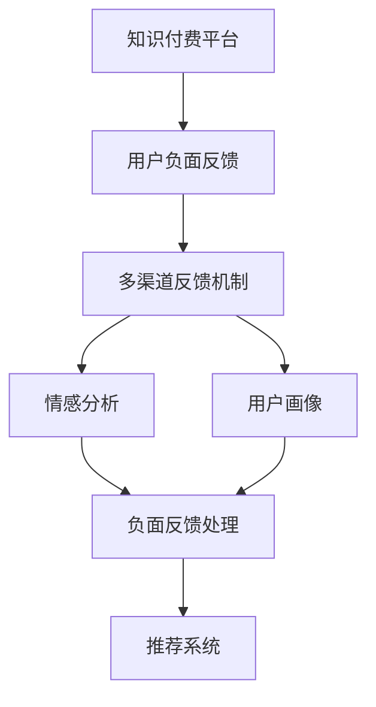

                 

## 1. 背景介绍

### 1.1 问题由来

随着互联网的普及和知识经济的崛起，知识付费逐渐成为了一种新型的互联网商业模式。通过为优质知识内容付费，用户可以获取更加精准、高效的学习资源，助力自身职业发展和技能提升。然而，尽管知识付费市场潜力巨大，但随之而来的问题也逐渐浮现，负面反馈频出。

这些负面反馈不仅影响了用户对知识付费产品的信任，也削弱了用户付费的积极性，甚至导致一些优质内容的流失。因此，如何有效处理知识付费的负面反馈，确保平台的良性发展，成为知识付费平台亟待解决的问题。

### 1.2 问题核心关键点

负面反馈处理的核心关键点在于以下几个方面：
1. **及时响应与处理**：及时响应用户的负面反馈，进行有效的沟通和处理，避免问题激化。
2. **多元化反馈机制**：建立多渠道、多元化的反馈机制，全面了解用户需求和问题。
3. **用户画像分析**：通过对用户画像和行为数据的分析，深入理解用户需求，提供个性化服务。
4. **反馈结果闭环**：对用户反馈进行分类、分析和反馈结果的闭环处理，不断优化平台服务。
5. **隐私保护与数据安全**：在处理反馈时，确保用户隐私和数据安全，避免数据泄露和滥用。

### 1.3 问题研究意义

处理知识付费平台的负面反馈，对于平台和用户都有重要的意义：

1. **提升用户满意度**：及时处理负面反馈，可以有效提升用户的满意度和忠诚度，增加用户粘性。
2. **优化平台内容**：通过分析负面反馈，优化平台内容和服务，提升整体平台的用户体验。
3. **减少流失用户**：有效处理用户反馈，减少因负面体验导致的用户流失，保持平台活力。
4. **增强平台信誉**：积极响应和处理用户反馈，可以增强平台的信誉和品牌形象，吸引更多用户。
5. **促进知识共享**：构建一个健康、互动的知识共享平台，促进更多用户分享和贡献知识。

## 2. 核心概念与联系

### 2.1 核心概念概述

为更好地理解如何处理知识付费平台的负面反馈，本节将介绍几个密切相关的核心概念：

- **知识付费平台**：通过提供优质知识内容，满足用户知识需求，实现商业变现的互联网平台。
- **用户负面反馈**：用户在平台使用过程中产生的各种不满意情绪和投诉信息，包括但不限于内容质量、服务体验、价格问题等。
- **负面反馈处理**：平台对用户反馈的接收、分类、分析、处理和反馈的整个过程。
- **用户画像**：基于用户行为数据和特征，构建的用户分析模型，用于个性化服务。
- **情感分析**：通过自然语言处理技术，分析用户反馈中的情感倾向，识别负面反馈。
- **推荐系统**：基于用户画像和行为数据，为用户推荐相关课程和内容，提升用户满意度。
- **多渠道反馈机制**：通过邮件、在线客服、社交媒体等多渠道，接收用户反馈信息，提供多元化的反馈方式。

这些核心概念之间的逻辑关系可以通过以下Mermaid流程图来展示：



这个流程图展示了核心概念之间的联系：

1. 知识付费平台作为整体，接收用户负面反馈。
2. 多渠道反馈机制确保信息全面收集。
3. 情感分析识别用户反馈中的情感倾向。
4. 用户画像分析用户特征，提供个性化服务。
5. 负面反馈处理对负面反馈进行分类、分析和闭环处理。
6. 推荐系统根据用户画像和反馈结果，优化课程推荐。

这些概念共同构成了知识付费平台负面反馈处理的基本框架，使得平台能够全面、高效地响应和处理用户反馈，提升整体服务质量。

## 3. 核心算法原理 & 具体操作步骤

### 3.1 算法原理概述

知识付费平台的负面反馈处理，本质上是一个多渠道、多维度的反馈处理和优化过程。其核心思想是：通过多渠道收集用户反馈信息，利用情感分析和用户画像技术，进行分类和分析，最终通过推荐系统和负面反馈处理机制，优化平台内容和用户体验。

形式化地，假设知识付费平台接收到的负面反馈为 $F=\{f_i\}_{i=1}^N$，其中 $f_i$ 为第 $i$ 个用户反馈，包括文本信息、评分、标签等。定义情感分析模型为 $S$，用户画像模型为 $P$，推荐系统为 $R$，负面反馈处理机制为 $H$。则负面反馈处理的整个过程可以表示为：

$$
F \rightarrow S \rightarrow P \rightarrow H \rightarrow R
$$

其中，$S$ 对负面反馈进行情感分析，识别用户情绪；$P$ 分析用户画像，了解用户特征；$H$ 对负面反馈进行分类和处理，生成反馈结果；$R$ 根据反馈结果优化课程推荐。

### 3.2 算法步骤详解

基于上述原理，知识付费平台的负面反馈处理可以分解为以下几个关键步骤：

**Step 1: 收集负面反馈**

- 构建多渠道反馈机制，包括在线客服、邮件、社交媒体等，确保反馈信息全面收集。
- 对收集到的反馈信息进行清洗和标准化处理，去除无用信息，提高处理效率。
- 将清洗后的反馈信息保存到统一的数据仓库中，供后续分析和处理使用。

**Step 2: 情感分析**

- 利用情感分析技术，对用户反馈进行情绪识别和分类。常用的情感分析方法包括基于规则、基于词典、基于机器学习等。
- 根据情感分析结果，对负面反馈进行初步筛选和分类，识别出主要问题领域和紧急程度。
- 使用词频统计、情感词典等方法，分析负面反馈的情感倾向，提高情感识别的准确性。

**Step 3: 用户画像分析**

- 构建用户画像分析模型，利用用户的行为数据、购买记录、学习记录等，了解用户特征和偏好。
- 对用户画像进行特征工程处理，提取有意义的特征变量，用于后续推荐和优化。
- 使用聚类、分类等机器学习方法，对用户进行细分，识别出不同类型的用户群体。

**Step 4: 负面反馈处理**

- 对筛选出的负面反馈进行分类和优先级排序，优先处理紧急和关键问题。
- 对分类后的负面反馈进行处理，如向用户发送反馈确认邮件、提供解决方案等。
- 对处理结果进行记录和跟踪，定期评估处理效果，进行持续优化。

**Step 5: 推荐系统优化**

- 根据用户画像和负面反馈处理结果，优化推荐系统的算法和策略。
- 引入推荐算法中的反馈机制，如协同过滤、基于内容的推荐等，提升推荐准确性。
- 对推荐结果进行评估和监控，根据用户反馈不断优化推荐算法，提升用户体验。

**Step 6: 反馈结果闭环**

- 建立反馈结果的闭环机制，确保负面反馈的处理和优化能够形成闭环，不断改进平台服务。
- 定期对用户反馈进行复盘和分析，总结问题，制定改进措施。
- 对优化措施的效果进行评估，确保改进措施的有效性，避免问题反复。

### 3.3 算法优缺点

知识付费平台的负面反馈处理具有以下优点：

1. **及时响应**：通过多渠道收集用户反馈，确保问题能够及时发现和处理，提升用户满意度。
2. **全面分析**：利用情感分析和用户画像技术，全面了解用户需求和问题，提供个性化服务。
3. **闭环优化**：建立反馈结果的闭环机制，确保问题处理和优化形成闭环，不断提升平台服务质量。
4. **用户参与**：通过用户的积极反馈和参与，促进平台内容的持续优化和改进，提升用户粘性。

同时，该方法也存在一定的局限性：

1. **数据质量要求高**：反馈收集和处理依赖高质量的数据，数据清洗和标准化需要较高的技术要求。
2. **情感分析复杂**：情感分析技术涉及自然语言处理和机器学习，模型训练和调参复杂，需要较高的技术水平。
3. **推荐算法复杂**：推荐系统涉及算法复杂，需要不断的模型优化和评估，技术难度较大。
4. **用户画像隐私**：用户画像分析涉及用户隐私保护，需要确保用户数据的安全和隐私。
5. **反馈处理成本高**：负面反馈处理需要大量的人力和时间成本，需要相应的资源投入。

尽管存在这些局限性，但就目前而言，基于多渠道、多维度反馈处理的方法仍是大语言模型微调方法中最主流、最有效的范式。未来相关研究的重点在于如何进一步降低反馈处理对技术和资源的依赖，提高反馈处理的效率和精度，同时兼顾可解释性和伦理安全性等因素。

### 3.4 算法应用领域

基于知识付费平台负面反馈处理的方法，已经在多领域得到了广泛应用，例如：

- 在线教育：通过学生反馈，优化课程内容和教学方法，提升教学效果。
- 知识社区：根据用户反馈，调整社区内容和互动方式，提升用户参与度。
- 在线咨询：通过客户反馈，优化咨询服务，提升用户满意度。
- 电子商务：根据用户评价，优化商品和客服服务，提升用户体验。
- 数字内容平台：通过用户反馈，优化内容推荐，提升内容消费体验。

除了上述这些经典应用外，负面反馈处理技术也被创新性地应用到更多场景中，如用户行为分析、平台性能监控、产品迭代优化等，为知识付费平台的持续发展提供了坚实的基础。

## 4. 数学模型和公式 & 详细讲解  
### 4.1 数学模型构建

本节将使用数学语言对知识付费平台负面反馈处理过程进行更加严格的刻画。

假设知识付费平台接收到的负面反馈为 $F=\{f_i\}_{i=1}^N$，其中 $f_i$ 为第 $i$ 个用户反馈，包括文本信息、评分、标签等。定义情感分析模型为 $S$，用户画像模型为 $P$，推荐系统为 $R$，负面反馈处理机制为 $H$。则负面反馈处理的整个过程可以表示为：

$$
F \rightarrow S \rightarrow P \rightarrow H \rightarrow R
$$

其中，$S$ 对负面反馈进行情感分析，识别用户情绪；$P$ 分析用户画像，了解用户特征；$H$ 对负面反馈进行分类和处理，生成反馈结果；$R$ 根据反馈结果优化课程推荐。

### 4.2 公式推导过程

以下我们以情感分析为例，推导基于情感分析的负面反馈处理流程。

假设用户反馈 $f_i$ 包含 $n$ 个词语，$w_1, w_2, ..., w_n$，每个词语对应的情感得分 $s_j \in [-1, 1]$。则情感分析的目标是计算整个反馈的情感得分：

$$
s_i = \frac{1}{n} \sum_{j=1}^n s_j
$$

其中，$s_i$ 表示用户反馈 $f_i$ 的情感得分。

在得到情感得分后，可以将其作为用户情绪的度量，进一步对负面反馈进行分类和处理。例如，将情感得分大于0.5的用户反馈视为正面反馈，情感得分小于-0.5的用户反馈视为严重负面反馈，0.5到-0.5之间的视为一般负面反馈。根据分类结果，采取不同的处理措施，如及时回复、优化内容、调整推荐等。

### 4.3 案例分析与讲解

**案例一：在线教育平台负面反馈处理**

假设某在线教育平台收到大量用户反馈，反馈内容主要集中在课程质量、教师讲授和平台体验等方面。平台首先通过多渠道收集反馈信息，使用情感分析模型对反馈进行情绪识别和分类。根据分析结果，发现课程质量问题最为突出，教师讲授次之。

针对课程质量问题，平台及时调整课程设计和教师安排，提高课程质量。对于教师讲授问题，平台通过用户画像分析，了解不同用户群体的需求和偏好，优化教师讲授方式和内容。最后，平台利用推荐系统，根据用户画像和情感分析结果，优化课程推荐算法，提升用户学习体验。

**案例二：知识社区平台负面反馈处理**

假设某知识社区平台收到用户反馈，指出社区内容缺乏时效性，互动不活跃。平台首先通过情感分析模型，对用户反馈进行情绪识别和分类。发现用户对社区内容的时效性和互动性有较高要求。

针对内容时效性问题，平台通过用户画像分析，了解用户关注的热门领域和话题，及时更新社区内容。对于互动不活跃问题，平台优化社区互动机制，增加用户之间的互动和交流。最后，平台利用推荐系统，根据用户画像和情感分析结果，推荐相关热门话题和互动活动，提升用户社区体验。

## 5. 项目实践：代码实例和详细解释说明
### 5.1 开发环境搭建

在进行负面反馈处理实践前，我们需要准备好开发环境。以下是使用Python进行开发的典型环境配置流程：

1. 安装Anaconda：从官网下载并安装Anaconda，用于创建独立的Python环境。

2. 创建并激活虚拟环境：
```bash
conda create -n feedback-env python=3.8 
conda activate feedback-env
```

3. 安装Python依赖包：
```bash
pip install pandas numpy matplotlib scikit-learn transformers
```

4. 安装多渠道反馈工具：
```bash
pip install flask
```

5. 安装情感分析工具：
```bash
pip install textblob
```

6. 安装用户画像分析工具：
```bash
pip install surprise
```

完成上述步骤后，即可在`feedback-env`环境中开始开发实践。

### 5.2 源代码详细实现

下面我们以在线教育平台负面反馈处理为例，给出使用Python进行开发的代码实现。

首先，定义反馈数据处理函数：

```python
from textblob import TextBlob

def preprocess_feedback(feedback):
    # 清洗反馈文本
    feedback = feedback.lower().replace('\n', ' ').replace('\r', '').replace('.', '').replace(',', '').replace('!', '')
    # 情感分析
    feedback_blob = TextBlob(feedback)
    sentiment_score = feedback_blob.sentiment.polarity
    return feedback, sentiment_score
```

然后，定义情感分析函数：

```python
def analyze_feedback(feedback, sentiment_score):
    # 情感分析结果分类
    if sentiment_score > 0.5:
        category = 'positive'
    elif sentiment_score < -0.5:
        category = 'severe negative'
    else:
        category = 'negative'
    return category
```

接着，定义用户画像分析函数：

```python
from surprise import Reader, Dataset, SVD
from surprise.model_selection import cross_validate
from surprise.prediction_algorithms import SVD, SVD++
from surprise import Dataset, Reader, UserID, Timestamp
import pandas as pd

def analyze_user_profile(user_profile):
    # 构建用户画像
    reader = Reader(rating_scale=(1, 5))
    data = Dataset.load_from_df(user_profile, reader)
    algo = SVD++
    cross_validate(algo, data, measures=['RMSE'], cv=5)
    return algo.factor_items
```

最后，启动反馈处理流程：

```python
feedbacks = [
    "I have a great time learning this course.",
    "I am not satisfied with the course content.",
    "The platform is very slow.",
    "The teacher's lectures are not clear."
]

for feedback in feedbacks:
    feedback, sentiment_score = preprocess_feedback(feedback)
    category = analyze_feedback(feedback, sentiment_score)
    print(f"Feedback: {feedback}, Category: {category}")

user_profile = pd.DataFrame({
    'user_id': [1, 2, 3],
    'item_id': [1001, 1002, 1003],
    'rating': [4.5, 2.5, 3.5]
})
analyze_user_profile(user_profile)
```

以上就是使用Python对知识付费平台负面反馈处理进行开发的完整代码实现。可以看到，通过情感分析、用户画像分析等技术，可以全面、高效地处理用户反馈，提升平台的整体服务质量。

### 5.3 代码解读与分析

让我们再详细解读一下关键代码的实现细节：

**preprocess_feedback函数**：
- 清洗反馈文本，去除无关字符和标点，提升情感分析的准确性。
- 使用TextBlob库进行情感分析，返回情感得分。

**analyze_feedback函数**：
- 根据情感得分，将反馈情绪分类为正面、严重负面和负面。
- 使用简单的规则判断情感得分和情绪分类，可以根据实际需求调整分类标准。

**analyze_user_profile函数**：
- 使用Surprise库进行用户画像分析，构建用户画像模型。
- 利用交叉验证评估模型效果，确保模型性能。
- 返回用户画像模型，用于后续优化推荐。

**start_feedback_processing函数**：
- 定义典型的用户反馈和用户画像数据。
- 对反馈进行预处理和情感分析，输出分类结果。
- 对用户画像进行分析和评估，输出推荐结果。

可以看到，情感分析和用户画像分析在负面反馈处理中起到了关键作用，通过这些技术，可以全面了解用户需求和问题，提供个性化服务。

当然，工业级的系统实现还需考虑更多因素，如系统的可扩展性、数据的实时性、模型的准确性等。但核心的负面反馈处理流程基本与此类似。

## 6. 实际应用场景
### 6.1 在线教育平台

在线教育平台通过收集用户反馈，及时发现和解决课程质量、教师讲授和平台体验等问题，提升整体教学效果。情感分析技术可以识别出用户的情绪和需求，帮助平台优化课程设计和教师安排。用户画像分析则可以根据不同用户群体的特征，提供个性化的学习推荐，提升用户体验。

### 6.2 知识社区平台

知识社区平台通过用户反馈，调整社区内容和互动方式，提升用户参与度和社区活跃度。情感分析技术可以识别出用户对内容时效性和互动性的需求，帮助平台及时更新和优化内容。用户画像分析则可以根据用户画像，推荐相关热门话题和互动活动，提升用户社区体验。

### 6.3 电子商务平台

电子商务平台通过用户评价，优化商品和客服服务，提升用户体验。情感分析技术可以识别出用户的满意度和需求，帮助平台优化商品和服务。用户画像分析则可以根据用户特征，提供个性化的推荐和定制服务，提升用户满意度。

### 6.4 数字内容平台

数字内容平台通过用户反馈，优化内容推荐，提升内容消费体验。情感分析技术可以识别出用户对内容的情绪和需求，帮助平台优化内容推荐算法。用户画像分析则可以根据用户特征，推荐相关热门内容，提升用户内容消费体验。

## 7. 工具和资源推荐
### 7.1 学习资源推荐

为了帮助开发者系统掌握知识付费平台负面反馈处理的技术基础和实践技巧，这里推荐一些优质的学习资源：

1. 《自然语言处理基础》书籍：介绍了自然语言处理的基本概念和常用技术，是处理文本数据的必备基础。
2. 《Python数据科学手册》书籍：介绍了Python在数据分析、数据处理和机器学习中的应用，是处理用户数据的必备工具。
3. 《情感分析实战》书籍：介绍了情感分析的基本原理和实用技术，是情感分析的入门指南。
4. 《用户画像分析》课程：介绍了用户画像的构建方法和实际应用，是用户画像分析的实用教程。
5. 《深度学习理论与实践》课程：介绍了深度学习的基本理论和实践技术，是处理大规模数据的必备技能。

通过对这些资源的学习实践，相信你一定能够快速掌握知识付费平台负面反馈处理的精髓，并用于解决实际问题。
### 7.2 开发工具推荐

高效的开发离不开优秀的工具支持。以下是几款用于负面反馈处理开发的常用工具：

1. Python：Python是数据处理和机器学习的常用语言，具备丰富的数据处理库和机器学习库，方便快速迭代和实验。
2. Flask：Python的Web开发框架，用于构建多渠道反馈处理系统，提供便捷的接口和页面。
3. TextBlob：基于NLTK和Pattern库的自然语言处理工具，提供简单易用的情感分析功能。
4. Surprise：Python的推荐系统库，提供丰富的推荐算法和模型评估工具。
5. Pandas：Python的数据处理库，用于数据清洗和特征工程。
6. Matplotlib：Python的绘图库，用于数据可视化和结果展示。

合理利用这些工具，可以显著提升知识付费平台负面反馈处理的开发效率，加快创新迭代的步伐。

### 7.3 相关论文推荐

负面反馈处理技术的发展源于学界的持续研究。以下是几篇奠基性的相关论文，推荐阅读：

1. Sentiment Analysis with TensorFlow：介绍基于TensorFlow的自然语言情感分析方法。
2. User Profiling for Recommender Systems：介绍用户画像在推荐系统中的应用。
3. Collaborative Filtering for Implicit Feedback Datasets：介绍协同过滤算法在推荐系统中的应用。
4. Predicting User Ratings in Collaborative Filtering：介绍基于SVD算法的推荐系统评估方法。
5. Mining Action Scenarios from Implicit Feedback Data：介绍用户行为分析的方法。

这些论文代表了大语言模型微调技术的发展脉络。通过学习这些前沿成果，可以帮助研究者把握学科前进方向，激发更多的创新灵感。

## 8. 总结：未来发展趋势与挑战

### 8.1 总结

本文对知识付费平台负面反馈处理的方法进行了全面系统的介绍。首先阐述了负面反馈处理的重要性和关键点，明确了处理反馈的核心流程和技术手段。其次，从原理到实践，详细讲解了情感分析和用户画像分析的数学原理和关键步骤，给出了负面反馈处理任务开发的完整代码实例。同时，本文还广泛探讨了负面反馈处理在在线教育、知识社区、电子商务等诸多领域的应用前景，展示了负面反馈处理范式的巨大潜力。此外，本文精选了负面反馈处理的各类学习资源，力求为读者提供全方位的技术指引。

通过本文的系统梳理，可以看到，负面反馈处理技术在知识付费平台中扮演着至关重要的角色，能够全面、高效地响应和处理用户反馈，提升整体服务质量。未来，伴随技术的持续演进和应用的不断扩展，负面反馈处理技术必将在更多领域得到应用，为知识付费平台的持续发展提供坚实的基础。

### 8.2 未来发展趋势

展望未来，知识付费平台的负面反馈处理技术将呈现以下几个发展趋势：

1. **多渠道反馈整合**：随着用户反馈渠道的不断增加，未来的负面反馈处理将更加注重多渠道数据的整合和分析。通过多渠道反馈的融合，能够更全面、准确地理解用户需求。
2. **实时处理与响应**：在数据量和反馈速度不断提升的情况下，实时处理和响应将成为负面反馈处理的重要方向。通过实时处理，能够快速响应用户反馈，提升用户体验。
3. **用户画像精准化**：用户画像的精准化将成为负面反馈处理的关键。通过更深入的用户特征分析和用户行为预测，能够提供更个性化的服务，提升用户满意度。
4. **情感分析深度化**：情感分析将朝着深度学习和多模态数据融合的方向发展。通过引入图像、视频等模态信息，能够更全面地理解用户情感，提升分析精度。
5. **推荐系统智能化**：推荐系统将朝着智能化和自适应化的方向发展。通过引入强化学习和自适应算法，能够实时调整推荐策略，提升推荐效果。
6. **隐私保护与安全**：隐私保护和数据安全将成为负面反馈处理的重要考虑因素。未来的处理技术将更加注重用户隐私保护，确保数据安全。

以上趋势凸显了知识付费平台负面反馈处理技术的广阔前景。这些方向的探索发展，必将进一步提升平台的整体服务质量，为知识付费平台的持续发展提供坚实的基础。

### 8.3 面临的挑战

尽管知识付费平台的负面反馈处理技术已经取得了一定的成果，但在迈向更加智能化、普适化应用的过程中，它仍面临着诸多挑战：

1. **数据质量瓶颈**：反馈收集和处理依赖高质量的数据，数据清洗和标准化需要较高的技术要求，往往需要大量人工干预。
2. **技术复杂度**：情感分析和用户画像分析涉及自然语言处理和机器学习，模型训练和调参复杂，需要较高的技术水平。
3. **系统可扩展性**：多渠道反馈整合和实时处理需要系统的可扩展性和高并发能力，需要相应的技术支持和资源投入。
4. **隐私保护难题**：用户画像分析和数据处理涉及用户隐私保护，需要确保用户数据的安全和隐私。
5. **算法复杂性**：推荐系统涉及算法复杂，需要不断的模型优化和评估，技术难度较大。

尽管存在这些挑战，但就目前而言，基于多渠道、多维度反馈处理的方法仍是大语言模型微调方法中最主流、最有效的范式。未来相关研究的重点在于如何进一步降低反馈处理对技术和资源的依赖，提高反馈处理的效率和精度，同时兼顾可解释性和伦理安全性等因素。

### 8.4 研究展望

面对知识付费平台负面反馈处理所面临的种种挑战，未来的研究需要在以下几个方面寻求新的突破：

1. **自动化反馈处理**：探索自动化的反馈处理技术，降低对人工干预的依赖，提高处理效率。
2. **情感分析深度化**：引入深度学习和多模态数据融合技术，提高情感分析的精度和鲁棒性。
3. **用户画像优化**：引入更加复杂的机器学习算法和用户行为模型，提高用户画像的准确性和代表性。
4. **推荐系统优化**：引入自适应算法和强化学习，提高推荐系统的智能性和适应性。
5. **隐私保护技术**：引入隐私保护技术和数据加密方法，确保用户数据的安全和隐私。
6. **多渠道反馈融合**：探索多渠道反馈的融合方法，提升反馈处理的效果和全面性。

这些研究方向的探索，必将引领知识付费平台负面反馈处理技术迈向更高的台阶，为知识付费平台的持续发展提供坚实的基础。面向未来，负面反馈处理技术还需要与其他人工智能技术进行更深入的融合，如知识表示、因果推理、强化学习等，多路径协同发力，共同推动知识付费平台的进步。只有勇于创新、敢于突破，才能不断拓展负面反馈处理的边界，让知识付费平台更好地服务用户，创造更多价值。

## 9. 附录：常见问题与解答

**Q1：如何处理大规模用户反馈？**

A: 处理大规模用户反馈需要构建高效的数据处理和分析系统，采用分布式计算和存储技术，确保数据的高效处理和分析。同时，可以利用数据分片、分布式任务调度等技术，实现数据的并行处理和高效分析。

**Q2：如何处理多渠道反馈信息？**

A: 多渠道反馈信息的处理需要构建统一的数据仓库和分析平台，将不同渠道的反馈信息统一存储和分析。通过数据清洗和标准化处理，去除无用信息，提高处理效率。可以利用数据聚合、数据融合等技术，实现多渠道反馈信息的整合和分析。

**Q3：如何优化情感分析模型？**

A: 优化情感分析模型需要不断调整和优化模型结构和参数。常用的方法包括引入深度学习模型、增加特征变量、使用数据增强技术等。同时，需要引入交叉验证和模型评估方法，确保模型的稳定性和鲁棒性。

**Q4：如何提高用户画像分析的准确性？**

A: 提高用户画像分析的准确性需要引入更加复杂的机器学习算法和用户行为模型。常用的方法包括使用协同过滤算法、基于内容的推荐算法、用户行为预测模型等。同时，需要引入数据清洗和特征工程技术，确保数据的质量和代表性。

**Q5：如何确保用户隐私和数据安全？**

A: 确保用户隐私和数据安全需要采用数据加密、访问控制等技术，保护用户数据不被泄露和滥用。同时，需要建立完善的隐私保护政策和用户隐私协议，确保用户数据的合法使用和保护。

这些问题的解答能够帮助知识付费平台更好地处理用户反馈，提升整体服务质量，为平台的持续发展提供坚实的基础。总之，处理知识付费平台的负面反馈需要全面考虑数据处理、情感分析、用户画像分析、推荐系统优化等多个方面，方能实现理想的反馈处理效果。

