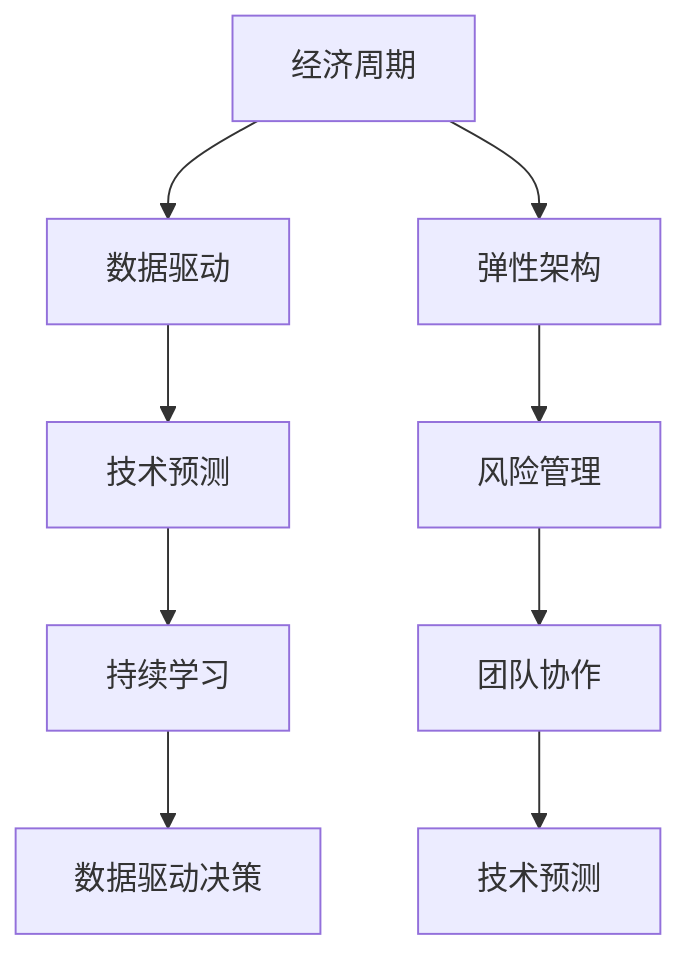

                 

## 1. 背景介绍

### 1.1 问题由来
在当今快速变化的科技行业，经济周期变得越发频繁且复杂。特别是自新冠疫情以来，全球经济环境的不确定性剧增。这种不确定性对企业的运营、收入和员工的生活产生了深远影响。在这种背景下，程序员和软件开发者必须具备应对经济周期的能力，确保项目和团队的可持续发展。

### 1.2 问题核心关键点
本文将探讨程序员和软件开发者如何在经济周期中保持稳定和高效，通过技术手段提升应对经济波动的韧性。重点包括以下几个方面：
- 风险管理：识别和评估经济周期中的风险因素。
- 技术预测：利用大数据和机器学习预测经济周期走势。
- 数据驱动决策：基于数据和算法优化业务决策。
- 弹性架构：构建可扩展和灵活的IT架构。
- 持续学习：保持技术更新和提升技能。
- 团队协作：优化团队管理和合作方式。

### 1.3 问题研究意义
研究程序员如何应对经济周期具有重要意义：
- **企业生存与发展**：经济波动可能威胁企业的生存，通过有效的风险管理和业务优化，企业能够更稳定地度过经济周期。
- **员工福祉**：经济不稳定可能影响员工的工作稳定性和心理健康，通过灵活的工作安排和支持系统，提升员工满意度。
- **技术进步**：经济周期中的挑战常常推动技术创新，通过持续学习和技术升级，企业能保持竞争力。
- **行业影响**：了解经济周期对技术行业的整体影响，有助于制定行业标准和政策。

## 2. 核心概念与联系

### 2.1 核心概念概述
在探讨应对经济周期的技术方法前，我们首先要了解几个关键概念：

- **经济周期（Economic Cycle）**：指经济增长和衰退的周期性波动，通常包括扩张、高峰、衰退和谷底四个阶段。
- **数据驱动（Data-Driven）**：利用大数据和机器学习技术，从历史数据中发现规律和趋势，指导决策和行动。
- **弹性架构（Elastic Architecture）**：一种灵活、可扩展的IT架构，能够快速适应外部环境变化。
- **持续学习（Continuous Learning）**：通过不断的学习和实践，提升技术技能和应对能力。
- **团队协作（Team Collaboration）**：通过优化团队管理和合作方式，提升团队的效率和创造力。

### 2.2 核心概念原理和架构的 Mermaid 流程图



此流程图展示了核心概念之间的关系和相互作用：

1. **数据驱动**：通过分析经济周期数据，预测未来走势。
2. **弹性架构**：构建适应性强的IT架构，以应对经济波动。
3. **风险管理**：识别和评估经济周期中的风险，制定应对策略。
4. **持续学习**：通过技术更新和培训，提升技能，适应经济变化。
5. **团队协作**：优化团队管理和合作，增强团队韧性。
6. **技术预测**：利用预测模型，为经济决策提供科学依据。
7. **数据驱动决策**：基于数据分析，制定决策，优化资源配置。

这些概念共同构成了一个综合的技术框架，帮助程序员和软件开发者有效应对经济周期。

## 3. 核心算法原理 & 具体操作步骤

### 3.1 算法原理概述

在经济周期中，程序员和软件开发者可以利用大数据、机器学习和预测模型等技术手段，分析和预测经济变化，从而制定出更有效的应对策略。

具体而言，流程包括以下几个步骤：
1. **数据收集**：从各种数据源收集经济指标，如GDP增长率、失业率、通货膨胀率等。
2. **数据分析**：使用统计方法和机器学习算法，如时间序列分析、回归分析、神经网络等，对经济数据进行建模和预测。
3. **风险评估**：利用风险评估模型，识别和评估经济周期中的风险因素，制定相应的风险管理策略。
4. **预测未来**：使用机器学习模型，如LSTM、GAN等，预测经济周期的走势，为决策提供依据。
5. **决策优化**：基于预测结果和数据分析，优化业务决策，如项目调整、资源配置等。

### 3.2 算法步骤详解

以下是具体实施步骤的详细描述：

**Step 1: 数据收集**
- 确定经济周期相关的关键指标，如GDP、CPI、就业率、企业利润等。
- 从政府、经济研究机构、金融机构等公开数据源获取数据。
- 使用API或数据爬虫技术，定期收集和更新数据。

**Step 2: 数据分析**
- 清洗和预处理数据，去除噪音和异常值。
- 使用时间序列分析方法，如ARIMA、VAR等，建模和预测经济指标。
- 利用回归分析和机器学习算法，如线性回归、随机森林、神经网络等，进一步优化模型。

**Step 3: 风险评估**
- 构建风险评估模型，评估经济周期中各类风险，如市场风险、信用风险、流动性风险等。
- 根据风险评估结果，制定相应的风险管理策略，如风险规避、风险转移、风险对冲等。
- 使用蒙特卡洛模拟等方法，评估不同决策方案的风险和收益。

**Step 4: 预测未来**
- 设计机器学习模型，如LSTM、GAN、RNN等，对经济指标进行预测。
- 使用历史数据训练模型，并进行交叉验证和测试。
- 根据模型预测结果，评估经济周期的走势，为决策提供科学依据。

**Step 5: 决策优化**
- 根据预测结果和数据分析，优化业务决策，如项目调整、资源配置、团队管理等。
- 使用A/B测试等方法，评估决策效果，不断迭代优化。
- 建立反馈机制，及时调整策略，适应经济环境的变化。

### 3.3 算法优缺点

**优点**：
- 数据驱动决策，减少主观判断，提高决策的科学性和准确性。
- 利用机器学习模型预测经济周期，提前做好准备。
- 通过风险评估和管理，降低不确定性带来的影响。
- 弹性架构确保IT系统的稳定性和可扩展性，提升应对能力。

**缺点**：
- 数据收集和预处理需要大量的时间和资源。
- 机器学习模型需要专业技能和经验，构建和维护成本较高。
- 风险评估模型可能存在偏差，评估结果需人工验证。
- 预测模型依赖历史数据，预测结果可能存在不确定性。

### 3.4 算法应用领域

大数据和机器学习技术在经济周期应对中有着广泛的应用，主要领域包括：

- **金融科技**：利用机器学习模型预测股市、债市、外汇市场的变化，进行风险管理和投资决策。
- **供应链管理**：通过数据分析和预测，优化库存管理、物流和供应链风险控制。
- **人力资源管理**：分析就业数据和经济指标，预测人才需求和员工流失，优化招聘和培训策略。
- **市场营销**：利用消费者行为数据，预测市场变化，制定营销策略，提升销售额。
- **企业运营管理**：通过成本、利润、现金流等经济指标，预测企业经营状况，优化资源配置。

## 4. 数学模型和公式 & 详细讲解

### 4.1 数学模型构建

经济周期预测主要基于时间序列分析和大数据建模，常见模型包括ARIMA、VAR、LSTM等。

### 4.2 公式推导过程

以ARIMA模型为例，其一般形式为：
$$
y_t = \phi(B)y_{t-1} + \theta(B)z_t + \mu_t
$$

其中，$y_t$ 表示当前的经济指标，$\phi(B)$ 和 $\theta(B)$ 为滞后算子，$z_t$ 为误差项，$\mu_t$ 为随机扰动项。

对上述方程进行差分处理，得到一阶差分方程：
$$
(1 - \phi B)y_t = \theta B z_t + \mu_t
$$

通过求解特征方程 $\phi(B) = 0$，确定ARIMA模型的参数 $\phi$ 和 $\theta$，即可进行预测。

### 4.3 案例分析与讲解

假设我们有一个金融公司，需要预测未来的股市走势。

**案例步骤**：
1. 收集历史股市数据，包括每日的收盘价、成交量等。
2. 对数据进行预处理，去除异常值和噪音。
3. 使用ARIMA模型对数据进行建模，确定模型参数。
4. 使用模型预测未来一周的股市走势。
5. 根据预测结果，调整投资组合和风险管理策略。

## 5. 项目实践：代码实例和详细解释说明

### 5.1 开发环境搭建

在进行经济周期应对的编程实践前，需要准备好开发环境。

1. 安装Python：下载和安装最新版本的Python。
2. 安装pandas、numpy、scikit-learn、matplotlib等常用库。
3. 安装时间序列分析库statsmodels。
4. 安装机器学习库scikit-learn和TensorFlow或PyTorch。
5. 配置虚拟环境，避免不同项目之间的依赖冲突。

**示例代码**：
```bash
# 创建虚拟环境
python -m venv env

# 激活虚拟环境
source env/bin/activate

# 安装依赖包
pip install pandas numpy scikit-learn matplotlib statsmodels tensorflow
```

### 5.2 源代码详细实现

以下是一个简单的Python代码示例，用于使用ARIMA模型进行经济数据预测：

**代码示例**：
```python
import pandas as pd
from statsmodels.tsa.arima.model import ARIMA
from statsmodels.tsa.stattools import adfuller

# 读取数据
data = pd.read_csv('economic_data.csv')

# 对数据进行预处理
data = data.dropna()
data['date'] = pd.to_datetime(data['date'])
data = data.set_index('date')

# 使用ADF检验进行单位根检验
result = adfuller(data['value'].values)
print(f'ADF Statistic: {result[0]}')
print(f'p-value: {result[1]}')

# 对数据进行差分处理
diff_data = data.diff().dropna()

# 构建ARIMA模型
model = ARIMA(diff_data['value'], order=(1, 1, 1))
model_fit = model.fit()

# 进行预测
forecast = model_fit.forecast(steps=10)
```

### 5.3 代码解读与分析

**代码解读**：
- 导入必要的库，包括pandas、statsmodels、scikit-learn等。
- 读取经济数据，并进行预处理，包括去除异常值、转换为日期格式、差分处理等。
- 使用ADF检验进行单位根检验，确认数据是否平稳。
- 构建ARIMA模型，进行拟合和预测。
- 输出预测结果。

**代码分析**：
- 数据预处理是关键步骤，确保数据的平稳性和一致性。
- ARIMA模型需要合理设置参数，才能得到准确的预测结果。
- 预测结果需要结合业务场景进行进一步分析和应用。

## 6. 实际应用场景

### 6.1 金融科技

金融科技公司可以利用大数据和机器学习，预测股市、债市、外汇市场的变化，进行风险管理和投资决策。例如，通过分析历史股价、交易量、市场情绪等数据，构建预测模型，帮助投资者做出更明智的决策。

**案例**：某金融科技公司构建了LSTM模型，对美股市场进行预测，并结合情感分析结果，实时调整投资组合，取得了显著的收益。

### 6.2 供应链管理

供应链管理公司可以通过数据分析和预测，优化库存管理、物流和供应链风险控制。例如，通过预测市场需求和生产计划，减少库存积压和缺货风险。

**案例**：某电商公司利用机器学习模型预测订单量，优化库存管理和物流调度，提升了供应链的效率和响应速度。

### 6.3 人力资源管理

人力资源管理公司可以分析就业数据和经济指标，预测人才需求和员工流失，优化招聘和培训策略。例如，通过预测行业增长和公司利润，提前进行人才储备和培训计划。

**案例**：某IT公司使用预测模型，分析技术趋势和市场需求，提前布局招聘计划，成功吸引了大量优秀人才。

### 6.4 市场营销

市场营销公司可以利用消费者行为数据，预测市场变化，制定营销策略，提升销售额。例如，通过分析社交媒体数据和搜索趋势，预测市场热点和消费者需求，优化广告投放和促销策略。

**案例**：某电商平台利用大数据分析，预测消费者行为和市场趋势，制定精准的营销策略，实现了销售额的大幅增长。

### 6.5 企业运营管理

企业可以基于成本、利润、现金流等经济指标，预测企业经营状况，优化资源配置。例如，通过分析财务报表和市场数据，预测未来几年的收入和成本，制定战略规划。

**案例**：某制造公司利用ARIMA模型，预测生产成本和市场需求，优化生产计划和供应链管理，提升了运营效率和利润率。

## 7. 工具和资源推荐

### 7.1 学习资源推荐

1. **《Python数据分析与可视化》**：介绍如何使用Python进行数据处理和可视化，适合入门学习。
2. **《统计学习方法》**：介绍机器学习的基本概念和算法，适合进一步学习。
3. **Coursera《机器学习》课程**：斯坦福大学提供的免费在线课程，由Andrew Ng主讲，深入讲解机器学习理论和方法。
4. **Kaggle**：数据科学竞赛平台，提供大量的真实数据和案例，适合实践练习。

### 7.2 开发工具推荐

1. **Jupyter Notebook**：Python数据科学的首选工具，支持代码编写和实时预览。
2. **Git**：版本控制系统，适合团队协作和代码管理。
3. **Visual Studio Code**：轻量级代码编辑器，支持多种编程语言和扩展。
4. **AWS、Google Cloud、Microsoft Azure**：云服务平台，提供强大的计算和存储资源。

### 7.3 相关论文推荐

1. **《深度学习在金融市场预测中的应用》**：介绍深度学习模型在金融市场预测中的应用，适合技术专家阅读。
2. **《时间序列分析与建模》**：系统介绍时间序列分析和建模的方法和技巧，适合进阶学习。
3. **《大数据时代的风险管理》**：探讨大数据和机器学习在金融风险管理中的应用，适合业界人士阅读。

## 8. 总结：未来发展趋势与挑战

### 8.1 总结

本文详细介绍了程序员和软件开发者如何应对经济周期，通过大数据、机器学习和预测模型等技术手段，提升应对经济波动的韧性。主要结论如下：

1. **数据驱动决策**：利用大数据和机器学习技术，优化决策过程，减少主观判断。
2. **弹性架构**：构建灵活、可扩展的IT架构，提高系统的应对能力。
3. **持续学习**：通过持续学习和技术升级，提升技能和应对能力。
4. **团队协作**：优化团队管理和合作方式，提升团队的效率和韧性。

通过这些技术手段，程序员和软件开发者可以更有效地应对经济周期中的各种挑战，提升企业的竞争力和可持续发展能力。

### 8.2 未来发展趋势

未来，经济周期应对技术将呈现以下几个发展趋势：

1. **智能化预测**：随着AI和大数据技术的发展，预测模型的精度和可靠性将进一步提升，经济周期预测将更加精准。
2. **自动化管理**：利用自动化工具和系统，实现业务决策和资源管理的自动化，提升效率和稳定性。
3. **实时化响应**：通过实时数据监测和分析，实现对经济波动的快速响应，避免突发事件的冲击。
4. **跨领域融合**：将经济周期应对技术与其他领域的技术进行融合，如区块链、物联网等，提升综合应对能力。

### 8.3 面临的挑战

尽管经济周期应对技术在不断进步，但仍面临一些挑战：

1. **数据质量**：经济数据的不完整和噪音可能影响预测模型的准确性。
2. **模型复杂性**：机器学习模型的构建和维护需要专业知识，对技术要求较高。
3. **计算资源**：大数据分析和机器学习模型的计算需求较高，需要强大的计算资源支持。
4. **市场变化**：经济周期的变化可能超出预测模型的范围，导致预测结果失效。

### 8.4 研究展望

未来，需要在以下几个方面进行进一步研究：

1. **多源数据融合**：利用多种数据源和信息源，提升预测模型的准确性和可靠性。
2. **模型自适应**：开发自适应模型，根据市场变化和数据特征动态调整预测模型。
3. **跨学科应用**：将经济周期应对技术与心理学、社会学等领域相结合，提升预测模型的全面性。
4. **伦理和隐私**：在使用数据进行预测时，需考虑数据隐私和伦理问题，确保数据使用的合法性和道德性。

## 9. 附录：常见问题与解答

### Q1: 什么是经济周期？

A: 经济周期是指经济增长和衰退的周期性波动，通常包括扩张、高峰、衰退和谷底四个阶段。

### Q2: 如何构建ARIMA模型？

A: 首先进行数据预处理，去除异常值和噪音，然后使用ADF检验进行单位根检验。对数据进行差分处理后，构建ARIMA模型，进行拟合和预测。

### Q3: 如何利用机器学习预测经济周期？

A: 首先收集经济数据，然后使用机器学习模型，如LSTM、GAN等，进行建模和预测。模型需要经过训练和验证，确保预测结果的准确性和可靠性。

### Q4: 经济周期应对技术的应用有哪些？

A: 应用包括金融科技、供应链管理、人力资源管理、市场营销、企业运营管理等，涵盖多个行业和领域。

### Q5: 如何优化团队协作？

A: 通过优化团队管理和合作方式，提升团队的效率和创造力。可以采用敏捷开发、跨部门协作、定期沟通等方式，增强团队的协作能力。

---

作者：禅与计算机程序设计艺术 / Zen and the Art of Computer Programming

