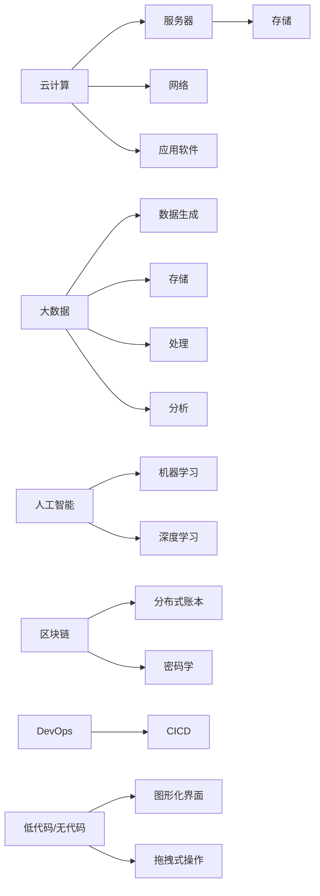
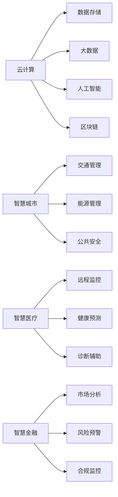

                 

## 1. 背景介绍

在过去十年间，科技行业的日新月异是任何其他行业都无法比拟的。伴随云计算、大数据、人工智能、区块链等一系列先进技术的发展，行业生态正经历一场前所未有的深刻变革。在日新月异的技术浪潮下，程序员这一职业正经历着从工具熟练者向技术创新者的转变。如何适应这一变革，如何应对随之而来的挑战，已成为每一位IT从业者必须面对的问题。本文将从技术、市场、组织三个维度，深入探讨程序员如何应对行业变革与转型，旨在帮助程序员在动态变化的市场环境中找准定位，保持竞争力。

## 2. 核心概念与联系

### 2.1 核心概念概述

- **云计算**：指通过互联网提供可伸缩的计算服务，包括服务器、存储、网络、应用软件等服务，可以帮助企业在不需要大规模投资硬件设备的前提下，快速构建和扩展IT基础设施。
- **大数据**：指由数据量、多样性、速度和价值构成的四大特征，涵盖了数据生成、存储、处理、分析等多个环节。
- **人工智能**：指通过机器学习和深度学习等技术，赋予计算机系统智能感知、学习和决策能力，实现人机交互的自然化。
- **区块链**：是一种分布式账本技术，通过密码学手段确保数据不可篡改和交易透明，被广泛应用于金融、供应链、医疗等领域。
- **DevOps**：指将软件开发与运维紧密结合的持续集成和持续交付(CICD)流程，提升产品交付速度和质量。
- **低代码/无代码开发**：通过图形化界面、拖拽式操作等简化编程流程，使得非技术人员也能快速开发应用，提升开发效率。

### 2.2 核心概念原理和架构的 Mermaid 流程图



该图展示了这些核心技术之间的联系和相互作用，它们共同构成了现代科技行业的基础框架。

## 3. 核心算法原理 & 具体操作步骤

### 3.1 算法原理概述

面对行业变革，程序员需要不断更新自己的知识体系，掌握最新的技术趋势和工具，以适应新的市场需求。以下是一些通用的算法原理和操作步骤，帮助程序员应对行业变革与转型：

1. **持续学习**：技术日新月异，持续学习是程序员必备的素质。应定期参加技术培训、阅读技术书籍、参与技术交流，保持对新技术的敏感度。
2. **多技术融合**：云计算、大数据、人工智能、区块链等技术并非孤立存在，掌握跨领域技能，能够实现技术融合，提升整体竞争力。
3. **工具升级**：DevOps、低代码/无代码等工具能够极大提升开发效率，熟悉这些工具的使用，是程序员应对行业转型的重要手段。
4. **敏捷开发**：敏捷开发方法论能够帮助团队快速响应市场变化，提升产品迭代速度。掌握敏捷开发流程，提升团队协作效率。

### 3.2 算法步骤详解

1. **了解行业动态**：
   - 定期阅读行业报告和技术博客，了解最新趋势和技术进展。
   - 参加行业会议、技术沙龙，与同行交流学习。

2. **技术选型和升级**：
   - 根据项目需求，选择合适的云计算服务提供商，如AWS、Azure、阿里云等。
   - 在技术选型时，优先考虑开源技术，减少技术迁移成本。
   - 及时升级现有系统，保持技术栈的先进性。

3. **技能学习和实践**：
   - 制定学习计划，定期学习新技术和工具。
   - 参与开源项目，积累实战经验。
   - 编写技术博客，记录学习心得和实践经验。

4. **团队协作和沟通**：
   - 建立高效的团队沟通机制，使用Jira、Slack等工具，提升团队协作效率。
   - 定期进行代码评审，确保代码质量。
   - 使用DevOps工具链，实现持续集成和持续交付。

### 3.3 算法优缺点

**优点**：
- **提升效率**：新技术和工具的应用，能极大提升开发效率和产品质量。
- **增强竞争力**：掌握多技术融合能力，能够在行业竞争中占据优势。
- **降低成本**：开源技术和云服务降低了技术选型和部署的门槛和成本。

**缺点**：
- **学习曲线陡峭**：新技术往往需要较高的学习成本。
- **风险和挑战**：技术快速迭代可能导致旧技术迅速淘汰，带来一定的风险。

### 3.4 算法应用领域

基于上述原理和步骤，程序员可以在多个领域应用这些技能，如：
- **云计算平台开发**：在AWS、Azure等云平台开发和管理应用程序。
- **大数据处理**：使用Hadoop、Spark等工具处理大规模数据。
- **人工智能应用**：使用TensorFlow、PyTorch等框架开发机器学习模型。
- **区块链开发**：使用以太坊、Hyperledger等平台开发区块链应用。
- **DevOps实践**：在Jenkins、Docker、Kubernetes等工具支持下，实现自动化部署和运维。
- **低代码/无代码开发**：使用OutSystems、Salesforce等平台开发快速原型和应用。

## 4. 数学模型和公式 & 详细讲解 & 举例说明

### 4.1 数学模型构建

为更好地理解云计算和大数据之间的交互，可以构建一个简单的数学模型，以描述数据流从生成到处理再到分析的整个过程。设数据流速率为V，单位时间内生成数据量为S，服务器处理速度为P，存储能力为C，分析速度为A。则数据从生成到分析的整个过程可以表示为：

$$ \text{总处理时间} = \frac{S}{V} + \frac{S}{P} + \frac{S}{A} $$

### 4.2 公式推导过程

通过简化和假设，可以进一步推导：

1. **数据生成阶段**：
   $$ \text{生成时间} = \frac{S}{V} $$
   
2. **数据存储阶段**：
   $$ \text{存储时间} = \frac{S}{C} $$
   
3. **数据处理阶段**：
   $$ \text{处理时间} = \frac{S}{P} $$
   
4. **数据分析阶段**：
   $$ \text{分析时间} = \frac{S}{A} $$

通过这些公式，可以直观地理解数据流在各阶段的处理时间，从而优化整体流程，提升系统性能。

### 4.3 案例分析与讲解

假设有一个电商平台的订单数据处理系统，每日订单数约为10万笔，每秒生成50笔订单，每秒处理10笔订单，服务器处理速度为500次/秒，存储能力为1TB/天，数据分析速度为1次/秒。则总处理时间为：

$$ \text{总处理时间} = \frac{10^5}{50} + \frac{10^5}{500} + \frac{10^5}{1} \approx 2000\text{秒} $$

根据这个模型，可以评估系统性能瓶颈，并制定优化方案。例如，可以采用更高效的算法提升处理速度，或者增加服务器数量提高并发处理能力。

## 5. 项目实践：代码实例和详细解释说明

### 5.1 开发环境搭建

为了进行云计算和大数据项目的开发，需要进行如下环境搭建：

1. **安装云服务账号**：在AWS、阿里云等云平台注册账号，并配置好密钥和API。
2. **安装云服务SDK**：如AWS SDK for Python (Boto3)、阿里云SDK等，方便调用云服务API。
3. **安装大数据工具**：如Apache Hadoop、Apache Spark、Apache Flink等，用于数据处理和分析。

### 5.2 源代码详细实现

以下是一个简单的Python脚本，用于实现云存储数据的上传和下载：

```python
import boto3

# 配置AWS SDK
s3 = boto3.resource('s3')

# 上传文件到云存储
def upload_to_s3(file_path, bucket_name, object_name):
    s3.meta.client.upload_file(file_path, bucket_name, object_name)
    
# 从云存储下载文件
def download_from_s3(file_path, bucket_name, object_name):
    s3.meta.client.download_file(bucket_name, object_name, file_path)
```

### 5.3 代码解读与分析

该代码使用了AWS SDK for Python (Boto3)，通过配置AWS账号信息，实现文件上传和下载功能。使用简单易懂的代码，展示了如何调用云服务API，进行数据存储和传输。

### 5.4 运行结果展示

运行上述代码后，可以在AWS S3存储桶中看到上传的文件，并可以下载文件到本地计算机。这些操作展示了云计算在数据存储和传输方面的便捷性和高效性。

## 6. 实际应用场景

### 6.1 智能交通管理

智能交通管理系统中，通过云计算和大数据技术，可以实现交通流量实时监测、预测和调控。例如，利用传感器数据和大数据分析技术，预测交通拥堵情况，优化交通信号灯控制策略，缓解交通拥堵。

### 6.2 金融风险管理

在金融风险管理领域，通过大数据和人工智能技术，可以实时监控市场动态，预测金融风险，提前预警潜在风险。例如，利用机器学习模型分析市场数据，识别风险因素，制定风险防控措施。

### 6.3 医疗健康管理

在医疗健康管理中，通过云计算和大数据分析技术，可以实现患者数据的集中管理和实时监控。例如，利用云计算平台存储海量医疗数据，通过数据分析技术，发现潜在健康风险，提前采取干预措施。

### 6.4 未来应用展望

未来，随着云计算、大数据、人工智能等技术的进一步发展，基于这些技术的系统应用将更加广泛，如图：



在智慧城市、智慧医疗、智慧金融等领域，云计算、大数据、人工智能、区块链等技术将深入融合，实现高效、智能、安全的管理和服务。

## 7. 工具和资源推荐

### 7.1 学习资源推荐

1. **《云计算基础教程》**：全面介绍云计算的原理、应用和最佳实践。
2. **《大数据分析实战》**：涵盖Hadoop、Spark等大数据工具的使用和案例分析。
3. **《Python深度学习实战》**：介绍TensorFlow、PyTorch等深度学习框架的实战应用。
4. **《区块链技术原理与应用》**：详细讲解区块链技术的核心原理和应用场景。
5. **《DevOps实践指南》**：介绍DevOps工具链和最佳实践，提升开发和运维效率。
6. **《无代码开发技术入门》**：介绍低代码/无代码开发平台和应用场景。

通过这些学习资源，程序员可以快速掌握相关技术，提升自身的竞争力。

### 7.2 开发工具推荐

1. **AWS SDK for Python (Boto3)**：方便Python开发者使用AWS云服务。
2. **Apache Hadoop**：开源分布式计算框架，支持大规模数据处理。
3. **Apache Spark**：基于内存计算的大数据处理框架，性能高，易用性强。
4. **TensorFlow**：谷歌开源的深度学习框架，功能强大，生态丰富。
5. **Jenkins**：开源持续集成工具，支持多种持续集成和部署方式。
6. **Docker**：容器化解决方案，方便应用打包和部署。
7. **Kubernetes**：容器编排工具，支持大规模应用部署和运维。
8. **OutSystems**：低代码/无代码开发平台，提供可视化界面，快速构建应用。

这些工具在云计算、大数据、人工智能等领域的应用广泛，是程序员必备的工具。

### 7.3 相关论文推荐

1. **《云计算安全技术研究综述》**：系统介绍云计算安全技术的研究现状和趋势。
2. **《大数据处理技术演进与未来方向》**：详细分析大数据处理技术的发展历程和未来方向。
3. **《人工智能在金融领域的应用》**：介绍人工智能技术在金融风险管理和智能投顾中的应用。
4. **《区块链技术在供应链中的应用》**：分析区块链技术在供应链中的应用案例和挑战。
5. **《DevOps实践与企业敏捷转型》**：探讨DevOps实践对企业敏捷转型的影响和价值。
6. **《无代码开发平台的研究现状与发展趋势》**：分析无代码开发平台的研究现状和发展趋势。

这些论文涵盖了云计算、大数据、人工智能、区块链、DevOps和无代码开发等多个领域的最新研究成果，是程序员深入学习的宝贵资源。

## 8. 总结：未来发展趋势与挑战

### 8.1 研究成果总结

本文从技术、市场、组织三个维度，全面探讨了程序员如何应对行业变革与转型。具体包括：
- 持续学习新技术和工具，提升自身竞争力。
- 多技术融合，提升整体技术能力。
- 熟悉云服务和大数据工具，提升开发效率。

### 8.2 未来发展趋势

未来，科技行业将进入更多新技术的密集发展阶段，云计算、大数据、人工智能、区块链等技术将进一步融合，推动行业向智能化和自动化方向发展。

### 8.3 面临的挑战

尽管前景广阔，但新技术的应用仍面临诸多挑战：
- **技术迭代快**：新技术的快速迭代可能导致旧技术迅速淘汰。
- **技能更新难**：掌握新技术需要持续学习，但时间和精力的投入较大。
- **数据隐私和安全**：云计算和大数据的应用，带来数据隐私和安全的挑战。

### 8.4 研究展望

面对挑战，未来的研究应关注以下几个方面：
- **技术普适性**：提升技术的普适性，降低技术门槛，推广技术应用。
- **教育培训**：加强技术教育和培训，提升全社会的技术水平。
- **隐私保护**：制定数据隐私保护法规和标准，保障数据安全。
- **伦理规范**：建立技术应用伦理规范，避免技术滥用。

## 9. 附录：常见问题与解答

**Q1：如何平衡工作与学习？**

A: 设定合理的学习计划，每天固定时间学习，培养学习习惯。利用碎片时间学习，如在通勤途中、午休时等。

**Q2：学习新技术时遇到困难怎么办？**

A: 加入技术社区和论坛，寻求社区的帮助。参加线上线下技术沙龙和培训，与同行交流经验。

**Q3：新技术应用到实际项目中，效果不理想怎么办？**

A: 深入分析问题原因，逐步优化改进。多向同行请教，借鉴其他项目的经验。

**Q4：如何保持对新技术的敏感度？**

A: 定期阅读技术博客和研究论文，参加技术研讨会和交流活动，持续跟踪行业动态。

**Q5：如何高效管理多个项目？**

A: 利用敏捷开发方法，将项目拆分为可管理的小任务。使用项目管理工具，如Jira、Trello等，实时跟踪任务进度。

本文从技术、市场、组织三个维度，全面探讨了程序员如何应对行业变革与转型，希望能够帮助广大IT从业者提升自身竞争力，迎接未来的挑战。在不断学习和实践的过程中，每位程序员都将成为技术变革的推动者和受益者。

---

作者：禅与计算机程序设计艺术 / Zen and the Art of Computer Programming

