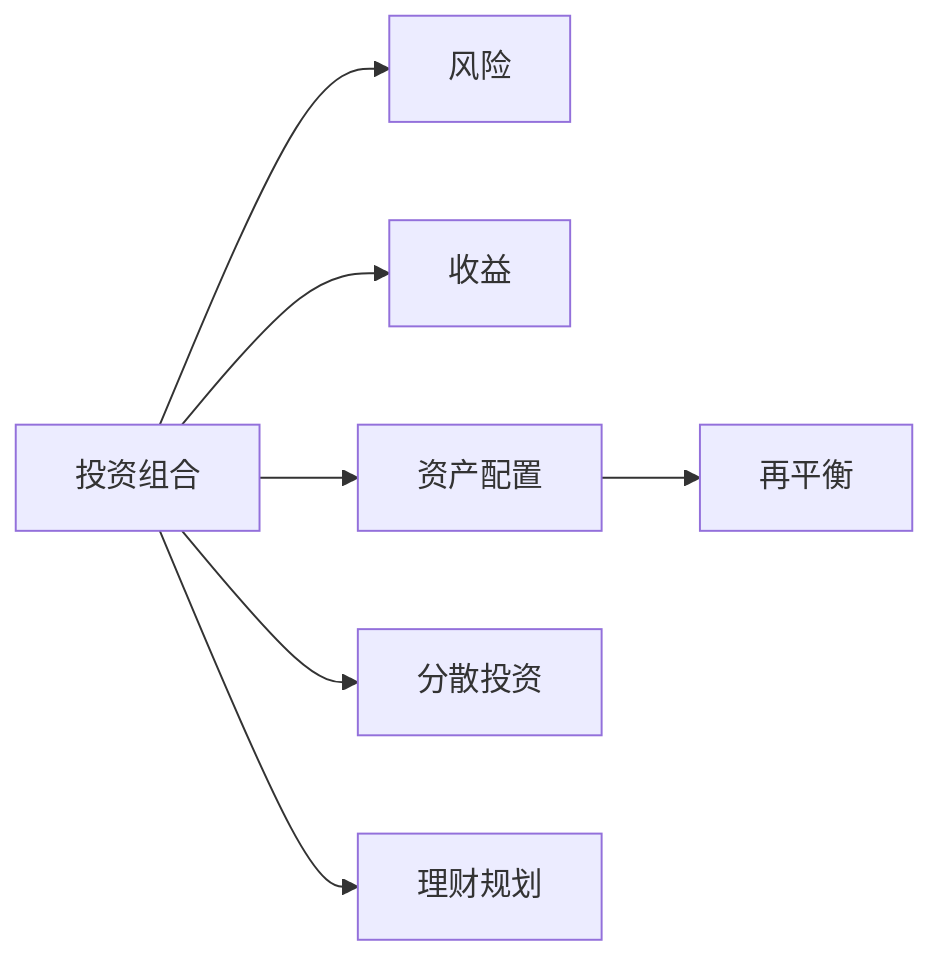

                 

# 程序员如何建立多元投资组合

> 关键词：投资组合, 风险管理, 资产配置, 分散投资, 理财规划

## 1. 背景介绍

### 1.1 问题由来
在互联网行业高速发展的今天，程序员作为其中的主力军，其收入水平和职业稳定性也成为了关注的焦点。许多程序员虽然技术娴熟，但财务知识相对匮乏，投资经验不足，导致在理财规划和资产配置方面面临诸多挑战。尤其是在全球经济波动、市场风险频发的背景下，如何构建一个既稳健又灵活的投资组合，以实现财富的长期增值，成为程序员必须面对的重要课题。

### 1.2 问题核心关键点
建立多元投资组合的核心关键点包括：
- 理解不同资产类别的风险收益特性。
- 根据自身风险偏好和财务目标，进行资产配置。
- 应用分散投资策略，降低风险。
- 定期审视和调整投资组合，以应对市场变化。
- 利用工具和技术手段，实现自动化和智能化投资。

本文旨在帮助程序员系统掌握构建多元投资组合的基本原理和实操方法，提升其理财规划和资产配置能力，以实现财富的稳健增值。

## 2. 核心概念与联系

### 2.1 核心概念概述

为更好地理解构建多元投资组合的思路和方法，本节将介绍几个关键概念及其相互关系：

- **投资组合**：通过将资金分配到不同资产类别中，构建的资产组合。
- **风险**：投资组合在市场波动中的潜在损失。
- **收益**：投资组合在市场中的潜在收益。
- **资产配置**：根据风险偏好和财务目标，将资金分配到不同资产类别中的策略。
- **分散投资**：通过投资于多个相关性低的资产，降低整体风险。
- **再平衡**：定期调整投资组合的资产分配，以保持目标风险和收益。
- **理财规划**：根据个人财务状况和目标，制定长期投资策略的过程。

这些概念通过以下Mermaid流程图来展示：



这个流程图展示了几大核心概念之间的逻辑关系：

1. 投资组合是风险和收益的载体。
2. 资产配置决定了投资组合的风险和收益。
3. 分散投资可以降低整体风险。
4. 再平衡策略确保投资组合的长期稳定性。
5. 理财规划是投资组合构建的基础。

## 3. 核心算法原理 & 具体操作步骤

### 3.1 算法原理概述

构建多元投资组合的本质是资产配置和分散投资的过程。其核心思想是通过对不同资产类别的选择和比例调整，实现风险和收益的最优化。

设投资组合 $P$ 由 $n$ 种资产 $A_1, A_2, ..., A_n$ 构成，其中 $w_i$ 表示资产 $A_i$ 在投资组合 $P$ 中的权重。则投资组合 $P$ 的期望收益率为 $r_P$，方差为 $\sigma_P^2$。

具体计算公式如下：

$$
r_P = \sum_{i=1}^n w_i r_{A_i}
$$

$$
\sigma_P^2 = \sum_{i=1}^n w_i^2 \sigma_{A_i}^2 + \sum_{i=1}^n \sum_{j=1, j \neq i}^n w_i w_j \rho_{ij} \sigma_{A_i} \sigma_{A_j}
$$

其中 $r_{A_i}$ 为资产 $A_i$ 的期望收益率，$\sigma_{A_i}$ 为资产 $A_i$ 的波动率，$\rho_{ij}$ 为资产 $A_i$ 和 $A_j$ 之间的相关系数。

### 3.2 算法步骤详解

构建多元投资组合的一般步骤包括：

**Step 1: 确定投资目标**
- 明确投资期限（短期、中期、长期）。
- 设定预期收益率和风险承受能力。
- 确定投资资金规模。

**Step 2: 选择资产类别**
- 研究各类资产（股票、债券、房地产、黄金、加密货币等）的风险收益特性。
- 根据自身风险偏好和财务目标，选择合适的资产类别。

**Step 3: 分配资产权重**
- 根据历史数据和市场分析，确定每种资产在投资组合中的权重。
- 确保权重总和为1，且非负。

**Step 4: 执行分散投资**
- 将资金分配到不同资产类别中，构建初步投资组合。
- 选择相关性较低的资产，降低整体风险。

**Step 5: 定期再平衡**
- 根据市场变化定期调整资产权重。
- 保持目标风险和收益。

**Step 6: 应用工具和技术**
- 利用Excel、Python等工具进行投资组合计算和优化。
- 应用机器学习、深度学习等技术进行风险管理和资产配置优化。

### 3.3 算法优缺点

构建多元投资组合的优势包括：
- 通过分散投资降低风险。
- 灵活调整资产权重，应对市场变化。
- 适应不同风险偏好的投资者。

同时，该方法也存在一些局限性：
- 需要较高的财务知识，以理解不同资产类别的风险收益特性。
- 依赖准确的历史数据和市场分析。
- 调整资产权重可能带来手续费和税费等额外成本。

尽管如此，通过合理应用，多元投资组合仍然是最主流的资产配置和风险管理策略。

### 3.4 算法应用领域

构建多元投资组合的方法广泛应用于个人理财、企业资产管理、基金投资等多个领域。具体应用场景包括：

- **个人理财**：根据个人财务状况和目标，构建适合自身的投资组合。
- **企业资产管理**：通过分散投资，降低企业整体风险，提高资产配置效率。
- **基金投资**：选择不同策略和风格的基金，构建多元化的基金投资组合。

## 4. 数学模型和公式 & 详细讲解 & 举例说明（备注：数学公式请使用latex格式，latex嵌入文中独立段落使用 $$，段落内使用 $)
### 4.1 数学模型构建

构建多元投资组合的数学模型主要涉及资产配置和风险管理两个方面。以下将详细介绍这两个方面的模型构建和优化方法。

**资产配置模型**
设 $R_A$ 为资产 $A$ 的期望收益率，$\sigma_A$ 为资产 $A$ 的波动率，$\rho_{AB}$ 为资产 $A$ 和 $B$ 之间的相关系数。资产配置的目标是最大化投资组合的期望收益率，同时控制其波动率。

根据马科维茨均值方差模型，投资组合的期望收益率为：

$$
r_P = \sum_{i=1}^n w_i r_{A_i}
$$

投资组合的方差为：

$$
\sigma_P^2 = \sum_{i=1}^n w_i^2 \sigma_{A_i}^2 + \sum_{i=1}^n \sum_{j=1, j \neq i}^n w_i w_j \rho_{ij} \sigma_{A_i} \sigma_{A_j}
$$

目标是最小化 $\sigma_P^2$，同时最大化 $r_P$。

**风险管理模型**
风险管理的主要目标是控制投资组合的波动率，确保在设定的风险水平下，达到最大的预期收益率。

设 $V$ 为投资组合的波动率，$w_i$ 为资产 $A_i$ 的权重，则风险管理的目标是：

$$
\min_{w} \sigma_P^2 \quad \text{subject to} \quad \sum_{i=1}^n w_i = 1, \quad w_i \geq 0
$$

其中 $\sigma_P^2$ 为投资组合的方差。

### 4.2 公式推导过程

**资产配置模型的推导**
由均值方差模型可知，投资组合的期望收益率为：

$$
r_P = \sum_{i=1}^n w_i r_{A_i}
$$

投资组合的方差为：

$$
\sigma_P^2 = \sum_{i=1}^n w_i^2 \sigma_{A_i}^2 + \sum_{i=1}^n \sum_{j=1, j \neq i}^n w_i w_j \rho_{ij} \sigma_{A_i} \sigma_{A_j}
$$

目标是最小化 $\sigma_P^2$，同时最大化 $r_P$。

**风险管理模型的推导**
设 $V$ 为投资组合的波动率，$w_i$ 为资产 $A_i$ 的权重，则风险管理的目标是：

$$
\min_{w} \sigma_P^2 \quad \text{subject to} \quad \sum_{i=1}^n w_i = 1, \quad w_i \geq 0
$$

其中 $\sigma_P^2$ 为投资组合的方差。

### 4.3 案例分析与讲解

以股票和债券组合为例，分析如何构建多元投资组合。

**股票和债券组合的风险收益特性**
- 股票的期望收益率高，但波动率大。
- 债券的期望收益率低，但波动率小。

**构建投资组合的步骤**
1. 确定投资期限、预期收益率和风险承受能力。
2. 选择股票和债券作为资产类别。
3. 根据历史数据和市场分析，确定每种资产的期望收益率和波动率。
4. 设定初始权重，如股票权重 $w_1 = 0.6$, 债券权重 $w_2 = 0.4$。
5. 定期根据市场变化调整权重，如股票市场走高时，逐步降低股票权重，增加债券权重。

**风险管理的应用**
假设目标波动率为 $V = 0.1$，通过优化模型，计算出最优权重配置，确保在波动率不超过 $V$ 的前提下，最大化预期收益率。

## 5. 项目实践：代码实例和详细解释说明
### 5.1 开发环境搭建

在进行投资组合构建和优化实践前，我们需要准备好开发环境。以下是使用Python进行金融数据分析和优化的环境配置流程：

1. 安装Anaconda：从官网下载并安装Anaconda，用于创建独立的Python环境。

2. 创建并激活虚拟环境：
```bash
conda create -n portfolio-env python=3.8 
conda activate portfolio-env
```

3. 安装相关库：
```bash
conda install pandas numpy scipy scikit-learn matplotlib plotly seaborn jupyter notebook ipython
```

4. 安装金融分析库：
```bash
conda install alphalens
```

5. 安装优化工具：
```bash
conda install scipy-optimize
```

完成上述步骤后，即可在`portfolio-env`环境中开始投资组合构建和优化的实践。

### 5.2 源代码详细实现

我们以股票和债券组合为例，使用Python实现多元投资组合的构建和优化。

首先，准备数据集：

```python
import pandas as pd

# 加载股票和债券的历史数据
stock_data = pd.read_csv('stock_data.csv')
bond_data = pd.read_csv('bond_data.csv')

# 计算资产的期望收益率和波动率
stock_mean_return = stock_data['return'].mean()
stock_vol = stock_data['vol'].std()
bond_mean_return = bond_data['return'].mean()
bond_vol = bond_data['vol'].std()

# 计算相关系数
rho = stock_data['return'].corr(bond_data['return'])
```

然后，构建初步投资组合：

```python
from scipy.optimize import minimize

# 定义目标函数：最大化预期收益率，同时控制波动率
def portfolio_optimization(w, stock_mean_return, stock_vol, bond_mean_return, bond_vol, rho):
    return -w[0] * stock_mean_return - w[1] * bond_mean_return + 0.5 * (w[0]**2 * stock_vol**2 + w[1]**2 * bond_vol**2 + 2 * w[0] * w[1] * rho * stock_vol * bond_vol)

# 定义约束条件
cons = ({'type': 'eq', 'fun': lambda w: w[0] + w[1] - 1}, {'bounds': [(0, None), (0, None)]})

# 定义初始权重
w0 = [0.6, 0.4]

# 执行优化
result = minimize(portfolio_optimization, w0, args=(stock_mean_return, stock_vol, bond_mean_return, bond_vol, rho), constraints=cons)
```

最后，展示优化结果：

```python
# 获取最优权重
opt_weights = result.x

# 计算最优预期收益率和波动率
opt_return = portfolio_optimization(opt_weights, stock_mean_return, stock_vol, bond_mean_return, bond_vol, rho)
opt_vol = opt_weights[0] * stock_vol + opt_weights[1] * bond_vol

print(f"Optimal weights: {opt_weights}")
print(f"Optimal expected return: {opt_return:.4f}")
print(f"Optimal volatility: {opt_vol:.4f}")
```

以上就是使用Python进行股票和债券组合优化的完整代码实现。可以看到，通过简单的数学模型和优化工具，我们能够快速构建一个符合预期风险和收益的多元投资组合。

### 5.3 代码解读与分析

让我们再详细解读一下关键代码的实现细节：

**加载和处理数据**
- 使用pandas库加载股票和债券的历史数据。
- 计算每种资产的期望收益率和波动率。
- 计算资产之间的相关系数。

**目标函数**
- 定义目标函数，最大化预期收益率，同时控制波动率。
- 使用scipy-optimize库中的minimize函数进行优化。

**约束条件**
- 定义约束条件，确保权重总和为1且非负。

**初始权重**
- 设定初始权重为60%股票和40%债券。

**执行优化**
- 通过minimize函数计算出最优权重配置。

**展示结果**
- 输出最优权重配置、预期收益率和波动率。

可以看到，通过Python代码，我们能够快速实现投资组合的优化，得到最优的资产配置方案。

## 6. 实际应用场景

### 6.1 智能投顾
智能投顾系统利用机器学习和数据分析技术，根据用户风险偏好和财务目标，构建个性化的投资组合。用户可以通过问卷调查等方式，输入自己的投资偏好和财务状况，系统通过算法自动生成适合其风险偏好的投资组合。

**应用场景**
- 个人理财：根据用户填写的问卷，构建个性化投资组合。
- 企业资产管理：根据企业风险偏好和财务目标，生成企业资产配置方案。
- 基金投资：根据基金经理的投资策略，自动推荐适合的基金组合。

**技术实现**
- 用户问卷：通过问卷调查，收集用户的投资偏好和财务状况。
- 数据处理：使用Python进行数据清洗和分析，提取相关特征。
- 投资组合构建：使用机器学习算法构建投资组合，生成推荐方案。

### 6.2 风险管理
风险管理是构建多元投资组合的重要应用场景。通过对市场数据和用户财务状况的分析，系统能够实时监测投资组合的风险，及时调整资产配置，以应对市场波动。

**应用场景**
- 股票市场：实时监测股票市场波动，动态调整投资组合，降低风险。
- 债券市场：实时监测债券市场波动，调整资产配置，控制风险。
- 商品市场：实时监测商品市场波动，优化资产配置，降低风险。

**技术实现**
- 数据采集：实时采集市场数据和用户财务数据。
- 风险评估：使用机器学习算法评估投资组合的风险水平。
- 资产调整：根据风险评估结果，自动调整资产配置，降低风险。

### 6.3 金融产品设计
金融产品设计需要根据市场和用户需求，构建多元化的投资组合。通过构建个性化的投资组合，金融产品能够更好地满足不同客户的需求，提升用户体验。

**应用场景**
- 私募基金：根据投资者风险偏好和财务目标，设计个性化的私募基金产品。
- 公募基金：根据市场和用户需求，设计多元化的公募基金产品。
- 保险产品：根据用户风险偏好和财务目标，设计个性化的保险产品。

**技术实现**
- 用户需求分析：通过问卷调查和数据分析，收集用户需求和风险偏好。
- 资产配置：根据用户需求和市场数据，设计多元化的资产配置方案。
- 产品设计：将资产配置方案转化为金融产品，并进行风险评估和优化。

### 6.4 未来应用展望

随着金融科技的不断发展，基于投资组合构建和风险管理的AI技术将得到更广泛的应用，带来更高的投资效率和风险控制能力。以下是未来可能的趋势：

1. **AI算法优化**：随着机器学习和大数据技术的进步，AI算法将不断优化，提高投资组合的构建和优化效率。
2. **个性化服务**：基于用户行为和偏好，提供更个性化的投资组合推荐和服务。
3. **智能化管理**：通过智能投顾和自动化工具，实现投资组合的自动化管理和优化。
4. **实时风险控制**：实时监测市场波动，动态调整投资组合，提高风险控制能力。
5. **全球化投资**：通过智能投顾和AI算法，实现全球化资产配置和风险管理。

## 7. 工具和资源推荐

### 7.1 学习资源推荐

为了帮助程序员系统掌握投资组合构建和优化的方法，这里推荐一些优质的学习资源：

1. 《量化投资入门：Python实现》系列博文：介绍量化投资的基本原理和Python实现，适合初学者入门。
2. 《机器学习在金融中的应用》书籍：介绍机器学习在金融领域的应用，涵盖风险管理、资产配置等多个方面。
3. 《量化投资策略》课程：由量化投资专家开设的在线课程，详细讲解量化投资策略和算法。
4. 《投资组合理论》书籍：介绍投资组合构建和优化的经典理论和方法。
5. 《Python金融数据分析》书籍：介绍如何使用Python进行金融数据分析和建模。

通过对这些资源的学习实践，相信你一定能够快速掌握构建多元投资组合的基本原理和实操方法。

### 7.2 开发工具推荐

高效的开发离不开优秀的工具支持。以下是几款用于投资组合构建和优化的常用工具：

1. Python：作为金融数据分析和优化的主流语言，Python提供了丰富的库和框架，如Pandas、NumPy、SciPy等，适合金融建模和算法开发。
2. Jupyter Notebook：用于编写和执行Python代码，支持代码高亮、自动补全、魔术命令等功能，适合数据分析和模型调试。
3. Matplotlib和Seaborn：用于绘制图表，可视化数据和模型结果，支持多种图表类型和自定义样式。
4. Plotly：用于绘制交互式图表，支持动态展示和分享，适合数据可视化。
5. Alphalens：用于评估量化策略的效果，支持多种策略评估指标和回测分析。

合理利用这些工具，可以显著提升投资组合构建和优化的效率，加速技术创新的迭代。

### 7.3 相关论文推荐

投资组合构建和优化的研究源于学界的持续探索。以下是几篇奠基性的相关论文，推荐阅读：

1. Markowitz, H. M. (1952). Portfolio selection. The Journal of Finance, 17(1), 77-91.
2. Sharpe, W. F. (1964). Capital asset prices: A theory of market equilibrium under conditions of risk. Journal of Finance, 19(3), 425-442.
3. Black, F., Jensen, M., & Scholes, M. (1972). The capital asset pricing model: Theory and evidence. Journal of Business, 45(4), 444-454.
4. Konno, T., & Yoshikawa, H. (2001). Recent developments in the optimization of diversified portfolios and out-of-sample performance. The Journal of Futures Markets, 21(1), 55-69.
5. Carol, C., & Kim, K. (2017). Machine learning for financial and actuarial risk management. Annual Review of Financial Economics, 9, 71-91.

这些论文代表了大投资组合构建和优化技术的发展脉络。通过学习这些前沿成果，可以帮助研究者把握学科前进方向，激发更多的创新灵感。

## 8. 总结：未来发展趋势与挑战

### 8.1 总结

本文对构建多元投资组合的基本原理和实操方法进行了系统介绍。首先阐述了投资组合构建的重要性和基本步骤，详细讲解了数学模型和优化方法。其次，通过Python代码实例，展示了投资组合的构建和优化过程。最后，介绍了投资组合构建和优化在智能投顾、风险管理、金融产品设计等多个领域的实际应用。

通过本文的系统梳理，可以看到，构建多元投资组合在理财规划和资产配置中具有重要意义。通过合理的资产配置和风险管理，程序员可以更好地实现财富的稳健增值，应对市场波动，提升生活质量。

### 8.2 未来发展趋势

展望未来，投资组合构建技术将呈现以下几个发展趋势：

1. **自动化和智能化**：AI算法将不断优化，实现投资组合的自动化构建和优化。
2. **个性化服务**：基于用户行为和偏好，提供更个性化的投资组合推荐和服务。
3. **实时风险控制**：实时监测市场波动，动态调整投资组合，提高风险控制能力。
4. **全球化投资**：通过智能投顾和AI算法，实现全球化资产配置和风险管理。
5. **大数据和深度学习**：引入大数据和深度学习技术，提升投资组合的构建和优化效率。

这些趋势将进一步推动投资组合构建技术的进步，带来更高的投资效率和风险控制能力。

### 8.3 面临的挑战

尽管投资组合构建技术已经取得了一定进展，但在迈向更加智能化和普适化的应用过程中，仍面临诸多挑战：

1. **数据质量**：数据采集和处理是投资组合构建的基础，数据质量直接影响模型的精度。
2. **模型复杂性**：投资组合模型涉及多维数据和复杂算法，模型调试和优化难度较大。
3. **算法透明度**：AI算法通常被认为是"黑盒"系统，难以解释其决策逻辑和风险来源。
4. **市场波动性**：市场波动性和不确定性增加了投资组合的风险管理难度。
5. **技术融合**：投资组合构建需要与其他金融技术（如区块链、人工智能等）进行融合，面临技术协调和接口统一的问题。

这些挑战需要学界和业界共同努力，不断探索和突破，以实现投资组合构建技术的成熟应用。

### 8.4 研究展望

面对投资组合构建所面临的挑战，未来的研究需要在以下几个方面寻求新的突破：

1. **数据融合与清洗**：提高数据采集和处理的质量，引入大数据和深度学习技术，提升数据融合和清洗的效率。
2. **模型透明性**：探索可解释的AI算法，提高模型的透明度和可解释性，增强用户信任和接受度。
3. **风险管理**：引入更多的风险控制手段，如动态风险评估、逆风控制等，提高投资组合的稳健性。
4. **算法优化**：优化投资组合模型的算法和参数，提升模型的预测精度和鲁棒性。
5. **跨界融合**：探索投资组合构建与其他金融技术的融合，推动金融科技的全面发展。

这些研究方向将引领投资组合构建技术迈向更高的台阶，为构建安全、可靠、智能的投资组合提供新的思路和解决方案。

## 9. 附录：常见问题与解答

**Q1：如何选择合适的资产类别？**

A: 选择合适的资产类别需要综合考虑多种因素，如市场趋势、风险收益特性、个人偏好等。可以通过历史数据和市场分析，选择相关性较低、风险收益匹配度高的资产类别。

**Q2：如何计算资产的期望收益率和波动率？**

A: 资产的期望收益率和波动率可以通过历史数据进行统计计算。例如，可以使用Pandas库中的mean()和std()函数计算资产的期望收益率和波动率。

**Q3：如何调整投资组合的资产配置？**

A: 可以通过定期重新计算投资组合的风险和收益，动态调整资产权重，以保持目标风险和收益。例如，可以使用Python的Pandas库进行数据处理和计算，使用SciPy库中的optimize模块进行优化。

**Q4：如何评估投资组合的风险和收益？**

A: 可以使用马科维茨均值方差模型和夏普比率等指标评估投资组合的风险和收益。例如，可以使用Python的Pandas库进行数据处理和计算，使用SciPy库中的optimize模块进行优化。

**Q5：如何选择最适合的投资组合？**

A: 选择最适合的投资组合需要根据自身风险偏好和财务目标，结合市场数据和分析结果，进行多方案评估和比较。例如，可以使用Python的Pandas库进行数据处理和计算，使用SciPy库中的optimize模块进行优化，并进行多方案比较。

这些问题的答案，为程序员提供了构建多元投资组合的基本思路和操作流程。通过不断学习和实践，相信你一定能够掌握投资组合构建和优化的精髓，实现财富的稳健增值。

---

作者：禅与计算机程序设计艺术 / Zen and the Art of Computer Programming

