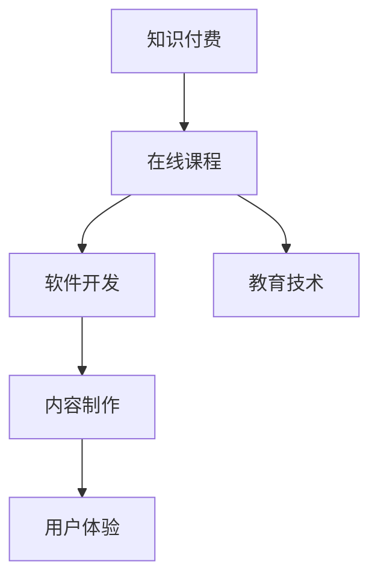

                 

# 程序员如何打造专业的知识付费课程

> 关键词：知识付费、在线课程、软件开发、教育技术、内容制作、用户体验

## 1. 背景介绍

### 1.1 问题由来

随着互联网和信息技术的发展，知识付费已成为一个热门领域。越来越多的程序员开始通过在线课程分享他们的专业知识和技术经验。然而，知识付费领域也面临着内容同质化严重、用户体验不佳、市场竞争激烈等问题。如何打造专业的知识付费课程，让课程内容丰富有深度，同时具备优秀的用户体验，是程序员需要深思的问题。

### 1.2 问题核心关键点

打造专业课程的关键在于：

1. **课程设计**：内容布局合理，知识点连贯，既有深度又有广度。
2. **互动设计**：充分利用技术手段增强课程的互动性，如实时问答、讨论、作业等。
3. **学习体验**：用户界面友好，学习路径清晰，学习过程流畅。
4. **内容更新**：保持课程内容的及时更新，紧跟技术发展的步伐。

本文将围绕这些关键点，详细探讨如何打造专业的知识付费课程。

## 2. 核心概念与联系

### 2.1 核心概念概述

为了更好地理解打造专业课程的方法，我们先介绍几个核心概念：

- **知识付费**：指通过付费方式获取知识，以获得更高的学习体验和更优质的课程内容。
- **在线课程**：利用互联网技术，将课程内容以视频、文本、PPT等形式呈现给学员。
- **软件开发**：指通过编写、调试、维护程序来实现特定功能的活动。
- **教育技术**：利用信息技术支持教育过程和教育管理的技术。
- **内容制作**：包括课程内容策划、录制、剪辑、包装等环节。
- **用户体验**：课程学习过程中用户的体验感受，包括界面友好度、操作便捷性等。

这些概念之间通过技术手段紧密联系，共同构成了知识付费课程的实现体系。

### 2.2 核心概念原理和架构的 Mermaid 流程图



这个流程图展示了知识付费、在线课程、软件开发、教育技术、内容制作和用户体验之间的关系。课程通过软件开发实现，教育技术提供了技术支持，内容制作和用户体验是课程的核心要素。

## 3. 核心算法原理 & 具体操作步骤

### 3.1 算法原理概述

打造专业课程的核心算法原理是通过系统化的课程设计，利用技术手段增强课程互动性，提升学习体验，同时保持内容的时效性。

#### 3.1.1 课程设计

课程设计需要遵循以下原则：

- **目标明确**：课程应该明确指出学习目标和预期成果。
- **内容连贯**：课程内容应连贯，从基础到进阶，逐步深入。
- **实用性强**：课程内容应该与实际工作紧密相关，解决实际问题。

#### 3.1.2 互动设计

增强互动性可以提高学习效果，例如：

- **实时问答**：在课程中嵌入实时问答系统，学员可以即时提问，教师实时回答。
- **讨论区**：设置讨论区，学员可以发表观点，与其他学员交流。
- **作业和测试**：布置作业和测试，帮助学员巩固知识。

#### 3.1.3 学习体验

提升用户体验需要考虑以下因素：

- **界面设计**：课程界面设计应简洁、美观、易用。
- **路径规划**：课程内容应该规划清晰，便于学员学习。
- **学习进度**：提供学习进度条，帮助学员了解学习进度和剩余内容。

#### 3.1.4 内容更新

保持内容的时效性需要：

- **定期更新**：课程内容应定期更新，添加最新的技术和案例。
- **社区反馈**：通过学员反馈，及时调整课程内容。

### 3.2 算法步骤详解

以下是打造专业课程的详细步骤：

**Step 1: 课程策划**

1. **需求调研**：通过问卷调查、访谈等方式，了解目标学员的需求。
2. **目标设定**：明确课程目标，确定知识点和难度。
3. **内容规划**：制定详细的课程大纲，包括章节和子章节。

**Step 2: 内容制作**

1. **录制视频**：录制高质量的课程视频，确保声音和画面清晰。
2. **制作讲义**：编写课程讲义，提供文本和PPT等辅助材料。
3. **设计互动**：嵌入实时问答、讨论区和作业系统。

**Step 3: 课程上线**

1. **平台选择**：选择合适的在线课程平台，如Udemy、Coursera等。
2. **课程上传**：上传课程视频和讲义，设置课程价格和学习权限。
3. **推广宣传**：通过社交媒体、邮件等渠道宣传课程。

**Step 4: 课程优化**

1. **学员反馈**：收集学员反馈，了解学习过程中的问题和建议。
2. **内容调整**：根据反馈，调整课程内容和互动设计。
3. **技术升级**：升级课程平台，提高课程的稳定性和用户体验。

### 3.3 算法优缺点

**优点：**

- **系统化设计**：课程设计通过系统化的步骤，保证了课程的连贯性和实用性。
- **技术支持**：利用教育技术手段，增强课程的互动性和用户体验。
- **内容更新**：通过定期更新，保持课程的时效性。

**缺点：**

- **开发成本高**：课程开发需要大量的时间和资源，包括课程策划、内容制作、平台搭建等。
- **市场需求多变**：课程内容需要频繁调整，以适应市场需求的快速变化。
- **技术更新快**：课程平台和技术需要不断升级，以保持竞争力。

### 3.4 算法应用领域

打造专业课程的方法适用于各种在线教育领域，包括软件开发、人工智能、数据分析、设计等。无论是在线还是线下的教育，都可以借鉴这种系统化、技术化的课程设计思路。

## 4. 数学模型和公式 & 详细讲解 & 举例说明

### 4.1 数学模型构建

为了更好地理解课程设计和优化过程，我们构建了一个数学模型。假设课程包含 $n$ 个知识点，每个知识点的学习时间分别为 $t_1, t_2, ..., t_n$，学习效果分别为 $e_1, e_2, ..., e_n$。课程的总时间为 $T$，总效果为 $E$。

我们的目标是最大化课程效果 $E$，最小化学习时间 $T$。因此，构建如下优化模型：

$$
\begin{align*}
\max E &= e_1 \cdot t_1 + e_2 \cdot t_2 + ... + e_n \cdot t_n \\
\min T &= t_1 + t_2 + ... + t_n
\end{align*}
$$

### 4.2 公式推导过程

为了求解上述优化问题，我们可以使用动态规划算法。设 $E_i$ 和 $T_i$ 分别为前 $i$ 个知识点的总效果和总时间，则有以下递推公式：

$$
\begin{align*}
E_i &= \max(e_i + E_{i-1}, E_{i-1}) \\
T_i &= \min(t_i + T_{i-1}, T_{i-1})
\end{align*}
$$

其中，$e_i$ 为第 $i$ 个知识点的学习效果，$t_i$ 为第 $i$ 个知识点的学习时间。

### 4.3 案例分析与讲解

假设一个课程包含三个知识点，其学习效果和学习时间分别为 $e_1=1, t_1=1$；$e_2=2, t_2=2$；$e_3=1, t_3=3$。使用上述递推公式计算：

1. $E_1 = e_1 = 1$，$T_1 = t_1 = 1$
2. $E_2 = \max(e_2 + E_1, E_1) = \max(2+1, 1) = 3$，$T_2 = \min(t_2 + T_1, T_1) = \min(2+1, 1) = 1$
3. $E_3 = \max(e_3 + E_2, E_2) = \max(1+3, 3) = 4$，$T_3 = \min(t_3 + T_2, T_2) = \min(3+1, 1) = 1$

因此，最优的知识点顺序为 3-2-1，总效果 $E=4$，总时间 $T=1$。

## 5. 项目实践：代码实例和详细解释说明

### 5.1 开发环境搭建

以下是开发知识付费课程的开发环境搭建步骤：

1. **安装开发环境**：
   - 安装Python 3.x
   - 安装虚拟环境
   - 安装必要的依赖库，如Flask、Jinja2等

2. **搭建课程平台**：
   - 使用Flask框架搭建课程平台
   - 设置数据库连接和用户认证
   - 设计课程页面和互动功能

3. **录制课程视频**：
   - 使用Camtasia等工具录制视频
   - 上传视频文件到课程平台

### 5.2 源代码详细实现

以下是Flask框架搭建课程平台的核心代码实现：

```python
from flask import Flask, render_template, request

app = Flask(__name__)

# 设置数据库连接
app.config['SQLALCHEMY_DATABASE_URI'] = 'sqlite:///courses.db'

# 定义课程类
class Course:
    def __init__(self, name, video_url, description):
        self.name = name
        self.video_url = video_url
        self.description = description

# 定义课程数据库
courses_db = []

# 获取课程列表
@app.route('/')
def index():
    return render_template('index.html', courses=courses_db)

# 添加课程
@app.route('/add_course', methods=['GET', 'POST'])
def add_course():
    if request.method == 'POST':
        name = request.form['name']
        video_url = request.form['video_url']
        description = request.form['description']
        course = Course(name, video_url, description)
        courses_db.append(course)
    return render_template('add_course.html')

# 删除课程
@app.route('/delete_course/<int:id>')
def delete_course(id):
    courses_db.remove(id)
    return render_template('index.html', courses=courses_db)
```

### 5.3 代码解读与分析

以下是代码的关键解释和分析：

- **Flask框架**：使用Flask框架搭建Web应用，实现课程管理和展示。
- **数据库连接**：使用SQLite数据库存储课程信息。
- **课程类**：定义了课程的基本属性，包括课程名、视频URL和课程描述。
- **路由函数**：定义了添加、删除课程的路由函数，实现与数据库的交互。
- **模板渲染**：使用Jinja2模板引擎，渲染课程页面，实现友好的用户体验。

### 5.4 运行结果展示

运行上述代码，可以通过访问 `http://localhost:5000` 查看课程列表，并通过表单添加、删除课程。

## 6. 实际应用场景

### 6.1 在线教育平台

在线教育平台如Udemy、Coursera、Coursera等都提供了知识付费课程的开发平台，程序员可以通过这些平台发布课程，获得收益。

### 6.2 企业内训

企业可以利用知识付费课程进行员工内训，提升员工的技术水平和职业素养。

### 6.3 个人品牌打造

通过知识付费课程，程序员可以打造个人品牌，扩大知名度和影响力。

### 6.4 未来应用展望

未来，知识付费课程将更多地利用AR、VR等技术，增强学习体验。同时，课程内容将更加多样化和个性化，满足不同学员的需求。

## 7. 工具和资源推荐

### 7.1 学习资源推荐

为了帮助程序员掌握知识付费课程开发，推荐以下学习资源：

1. **Coursera官方文档**：详细介绍了Coursera平台的使用和课程开发流程。
2. **Udemy开发者文档**：提供了Udemy平台的开发接口和使用指南。
3. **Flask官方文档**：Flask框架的官方文档，提供了全面的开发指南和示例。

### 7.2 开发工具推荐

为了提高课程开发效率，推荐以下开发工具：

1. **Camtasia**：视频录制和编辑工具，支持高质量的视频录制和剪辑。
2. **Jinja2**：模板引擎，用于生成动态的HTML页面。
3. **SQLite**：轻量级数据库，适合小规模课程数据的存储。

### 7.3 相关论文推荐

以下是一些关于知识付费和在线教育的论文，推荐阅读：

1. **《利用社交网络大数据进行在线教育效果评估》**：通过大数据分析，评估在线教育的效果和用户行为。
2. **《知识付费平台用户行为分析》**：研究知识付费平台用户的学习行为和付费行为。
3. **《在线课程内容设计与用户体验提升》**：探讨在线课程内容设计和用户体验提升的方法。

## 8. 总结：未来发展趋势与挑战

### 8.1 研究成果总结

本文从课程设计、互动设计、学习体验和内容更新四个方面，系统介绍了如何打造专业的知识付费课程。通过数学模型的构建和推导，进一步说明了课程优化的方法。通过代码实例和实际应用场景的展示，展示了知识付费课程的开发和部署流程。

### 8.2 未来发展趋势

未来，知识付费课程将更加智能化和个性化，利用AI技术提供个性化推荐和智能互动。同时，课程内容将更加多元化，涵盖更多的技术和应用领域。

### 8.3 面临的挑战

尽管知识付费课程开发取得了一定的进展，但仍面临以下挑战：

1. **内容同质化**：课程内容缺乏创意，难以吸引用户。
2. **用户体验差**：课程界面设计不友好，影响学习效果。
3. **市场竞争激烈**：市场竞争激烈，需要不断创新。
4. **技术更新快**：需要不断更新课程内容和技术，保持竞争力。

### 8.4 研究展望

未来的研究可以从以下几个方面进行：

1. **课程内容创新**：开发更多创意课程，吸引用户。
2. **用户体验优化**：提升课程界面和交互体验。
3. **智能互动增强**：利用AI技术，提供智能互动和个性化推荐。
4. **技术升级**：不断更新课程技术，保持竞争力。

## 9. 附录：常见问题与解答

**Q1: 如何提高课程互动性？**

A: 通过实时问答、讨论区和作业等方式，增强课程互动性。

**Q2: 课程内容如何保持时效性？**

A: 定期更新课程内容，添加最新的技术和案例。

**Q3: 如何提升用户体验？**

A: 优化课程界面设计，提供友好的学习路径和清晰的进度指示。

**Q4: 课程开发需要多少时间？**

A: 课程开发需要大量时间，包括内容策划、录制、剪辑、测试等环节。

**Q5: 课程效果如何评估？**

A: 通过学员反馈、考试成绩等方式评估课程效果。

---

作者：禅与计算机程序设计艺术 / Zen and the Art of Computer Programming

