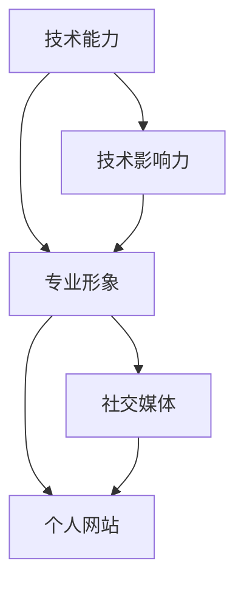

                 

## 1. 背景介绍

在当今信息爆炸、竞争激烈的互联网时代，个人品牌（Personal Branding）对于每个程序员来说都显得愈发重要。个人品牌不仅有助于提升专业形象，建立行业影响力，还能带来更多的职业机会和项目合作。在AI和编程领域，尤其如此。

### 1.1 为什么个人品牌重要？

- **专业形象**：建立专业的个人品牌，可以树立自己作为行业专家的形象，让同行和招聘方对你有深刻印象。
- **职业机会**：一个强大的个人品牌可以为你带来更多的工作机会和合作项目，让你在众多候选人中脱颖而出。
- **知识传播**：通过技术博客、开源项目等方式，分享你的知识和经验，提升自身影响力和知名度。

### 1.2 如何打造个人品牌？

打造个人品牌需要系统化的方法和策略，包括提升技术能力、构建个人网站、积极参与社区和开源项目、通过社交媒体扩大影响力等。

## 2. 核心概念与联系

### 2.1 核心概念概述

- **个人品牌**：程序员个人在技术、经验、价值观等方面的综合体现，通过多种途径传递给外界，形成独特的个人形象。
- **专业形象**：通过展示技术实力、解决实际问题、发表文章等方式，展示自己的专业性。
- **技术影响力**：通过分享技术见解、参与开源项目、教学培训等方式，对技术社区产生影响。
- **社交媒体**：利用各大社交平台，展示个人技术成果、生活点滴，建立个人影响力。
- **个人网站**：个人品牌的核心展示窗口，包含简历、技术博客、开源项目链接等。

### 2.2 核心概念的联系

构建个人品牌的各个环节是相辅相成的。技术能力是基础，专业形象和影响力是结果，社交媒体和网站是传播工具。通过不断提升技术和分享成果，可以在社交媒体和网站等平台上建立个人品牌，最终实现专业形象和影响力的提升。

以下Mermaid流程图展示了这些概念的联系：



## 3. 核心算法原理 & 具体操作步骤

### 3.1 算法原理概述

打造个人品牌，主要涉及以下几个方面的算法和操作：

- **技术提升**：通过不断学习新技术、解决复杂问题、撰写技术博客等手段，提升自身技术能力。
- **内容发布**：在社交媒体、个人博客、GitHub等平台发布技术文章、开源项目等，展示个人技术成果。
- **社区互动**：积极参与技术社区讨论、问答、分享等，提升个人在社区中的影响力。
- **网络推广**：利用SEO、社交媒体广告等手段，提升个人品牌在互联网上的可见度。

### 3.2 算法步骤详解

**Step 1: 提升技术能力**
1. **持续学习**：
   - 阅读最新技术书籍和文章。
   - 参加线上线下技术讲座和培训课程。
   - 参与开源项目，实践新技能。

2. **解决问题**：
   - 通过GitHub、Stack Overflow等平台记录自己解决的技术难题。
   - 定期分享自己的技术见解和解决方案。

**Step 2: 内容发布**
1. **技术博客**：
   - 定期撰写高质量技术文章，分析问题、分享心得。
   - 使用Markdown格式，方便发布和分享。

2. **开源项目**：
   - 在GitHub上发布个人项目，展示编程能力和技术实践。
   - 定期更新项目，保持活跃度。

**Step 3: 社区互动**
1. **参与讨论**：
   - 在Stack Overflow、Reddit等社区积极回答问题。
   - 加入技术讨论组，参与技术讨论。

2. **分享见解**：
   - 在技术会议、黑客松等场合，展示自己的技术成果和项目。

**Step 4: 网络推广**
1. **SEO优化**：
   - 优化个人博客的SEO，提高文章搜索排名。
   - 使用关键词优化技术文章，吸引更多读者。

2. **社交媒体推广**：
   - 在LinkedIn、Twitter等平台上发布技术文章、开源项目链接。
   - 定期更新社交媒体内容，保持活跃度。

### 3.3 算法优缺点

- **优点**：
  - 系统化提升技术能力，建立专业形象。
  - 分享技术和项目，提升技术影响力。
  - 多渠道传播，扩大个人品牌的影响力。

- **缺点**：
  - 需要持续投入时间和精力。
  - 内容质量要求高，否则难以建立有效个人品牌。
  - 网络推广效果受限于社交媒体策略和个人品牌建设方向。

### 3.4 算法应用领域

个人品牌建设主要应用于以下几个领域：

- **技术分享**：通过博客、技术讲座、开源项目等方式，分享技术见解和解决方案。
- **项目展示**：在GitHub、个人网站等平台上，展示自己开发的软件项目和新技术实践。
- **职业发展**：通过个人品牌提升职业机会，吸引潜在雇主或合作项目的关注。
- **教育培训**：通过教学培训，传授知识，建立技术导师形象。

## 4. 数学模型和公式 & 详细讲解 & 举例说明

### 4.1 数学模型构建

我们以GitHub上的技术文章为例，建立一个简单的数学模型来描述个人品牌影响力的提升。

设个人品牌影响力 $I(t)$ 为技术博客文章的阅读量 $R(t)$、开源项目的贡献量 $C(t)$、社交媒体的关注度 $S(t)$ 和SEO优化效果 $E(t)$ 的加权和：

$$
I(t) = \alpha R(t) + \beta C(t) + \gamma S(t) + \delta E(t)
$$

其中，$\alpha, \beta, \gamma, \delta$ 为相应的权重，反映各因素对品牌影响力提升的重要性。

### 4.2 公式推导过程

假设初始品牌影响力为 $I(0)$，每月的提升率为 $\eta$，则品牌影响力的变化可以表示为：

$$
I(t) = I(0) \times (1+\eta)^t
$$

其中 $t$ 为时间（月）。

为了简化计算，我们假设所有影响因素的提升速率相同，均为 $\eta$。实际应用中，各项因素的提升率可能不同，需要根据实际情况进行调整。

### 4.3 案例分析与讲解

假设一个程序员初始品牌影响力为 500，每月提升率 $\eta=0.1$。第一年后的品牌影响力计算如下：

$$
I(12) = 500 \times (1+0.1)^12 = 500 \times 2.592 \approx 1296
$$

这表示在第一年之后，其品牌影响力提升到约1296。通过持续投入时间和精力，品牌影响力可以显著提升。

## 5. 项目实践：代码实例和详细解释说明

### 5.1 开发环境搭建

项目实践之前，需要搭建开发环境。以使用Jekyll搭建个人技术博客为例：

1. **安装Ruby和Bundler**：
   ```bash
   rvm install ruby
   gem install bundler
   ```

2. **安装Jekyll**：
   ```bash
   gem install jekyll bundler
   ```

3. **创建博客**：
   ```bash
   jekyll new myblog
   cd myblog
   ```

4. **部署博客**：
   - 在GitHub上创建仓库，将项目代码推送到仓库中。
   - 安装GitHub Pages，设置域名和CNAME文件。
   - 将博客推送到GitHub Pages，部署个人博客。

### 5.2 源代码详细实现

以下是一个简单的技术博客网站的示例代码：

1. **Gemfile**：
   ```ruby
   source 'https://rubygems.org'

   gem 'jekyll'
   gem 'kramdown'
   gem 'gemo'
   gem 'prism'
   ```

2. **_config.yml**：
   ```yaml
   name: My Blog
   url: https://www.myblog.com
   ```

3. **index.html**：
   ```html
   <h1>Welcome to My Blog</h1>
   <p>Welcome to my personal blog, where I share my technical insights and projects.</p>
   ```

### 5.3 代码解读与分析

**Gemfile**：指定Jekyll和其他依赖库的版本。

**_config.yml**：配置博客基本信息，如名称、URL等。

**index.html**：提供网站的欢迎页面。

部署完成后，可以通过域名访问个人博客。

### 5.4 运行结果展示

访问后可以看到欢迎页面，未来可以定期更新博客内容，展示技术文章和项目。

## 6. 实际应用场景

### 6.1 技术分享

通过技术博客和开源项目分享新技术，建立专业形象。例如，可以写一篇关于最新的机器学习模型的技术文章，并提供一个GitHub仓库，展示模型的实现和应用。

### 6.2 项目展示

通过个人博客和GitHub展示自己的项目，吸引潜在雇主或合作项目的关注。例如，可以发布一个用于数据分析的项目，提供详细的使用说明和代码。

### 6.3 职业发展

通过个人品牌提升职业机会，吸引潜在雇主的关注。例如，可以在LinkedIn上发布最新的技术项目，展示自己的专业技能和成果。

### 6.4 教育培训

通过技术培训，传授知识，建立技术导师形象。例如，可以开设线上课程，教授机器学习或编程技能，分享自己的经验。

## 7. 工具和资源推荐

### 7.1 学习资源推荐

1. **Jekyll官方文档**：详细介绍了Jekyll的安装、配置和部署方法。
   - [Jekyll文档](https://jekyllrb.com/docs/home)

2. **GitHub Pages教程**：详细介绍了GitHub Pages的使用方法，帮助部署个人博客。
   - [GitHub Pages教程](https://help.github.com/en/github/hosting-your-own-git-repository-on-github/pages)

3. **Coursera和Udacity**：提供众多高质量编程和AI课程，提升技术能力。
   - [Coursera](https://www.coursera.org/)
   - [Udacity](https://www.udacity.com/)

4. **Stack Overflow**：提供丰富的技术问答资源，提升编程技能。
   - [Stack Overflow](https://stackoverflow.com/)

### 7.2 开发工具推荐

1. **Visual Studio Code**：轻量级的代码编辑器，支持多种编程语言和GitHub集成。
   - [Visual Studio Code](https://code.visualstudio.com/)

2. **GitHub Desktop**：GitHub的桌面版客户端，方便管理和推送代码。
   - [GitHub Desktop](https://desktop.github.com/)

3. **GitHub Pages**：部署个人博客，简单易用。
   - [GitHub Pages](https://help.github.com/en/github/hosting-your-own-git-repository-on-github/pages)

### 7.3 相关论文推荐

1. **“Personal Branding in the Digital Age”**：分析个人品牌在数字时代的作用和影响。
   - [Personal Branding in the Digital Age](https://www.journalofbrandstudies.org/2019/09/personal-branding-in-the-digital-age/)

2. **“The Rise of the Data-Driven Personal Brand”**：探讨数据驱动个人品牌建设的方法和效果。
   - [The Rise of the Data-Driven Personal Brand](https://towardsdatascience.com/the-rise-of-the-data-driven-personal-brand-6f8ba4f0f6e8)

3. **“The Art of Building a Personal Brand”**：分享构建个人品牌的经验和策略。
   - [The Art of Building a Personal Brand](https://www.idealista.com/blog/2020/06/the-art-of-building-a-personal-brand/)

## 8. 总结：未来发展趋势与挑战

### 8.1 研究成果总结

本文系统介绍了如何通过技术提升、内容发布、社区互动和网络推广等手段，打造个人品牌。通过数学模型和公式推导，展示了个人品牌影响力的提升过程。

### 8.2 未来发展趋势

未来，个人品牌建设将更加系统化和智能化：

1. **人工智能辅助**：利用AI技术自动化内容创作、社交媒体推广等，提升个人品牌建设效率。
2. **多渠道融合**：将博客、视频、播客等多渠道内容结合起来，提升品牌影响力。
3. **数据驱动优化**：通过数据分析和优化，提升品牌推广效果。

### 8.3 面临的挑战

1. **时间管理**：持续投入时间和精力是个人品牌建设的必要条件，如何平衡工作和个人品牌建设是一个挑战。
2. **内容质量**：高质量的内容是个人品牌建设的基础，如何提升内容质量和发布频率是一大难题。
3. **网络安全**：个人品牌建设过程中，数据和隐私保护非常重要，如何避免泄露和侵犯隐私是一个挑战。

### 8.4 研究展望

未来的个人品牌建设将更加注重以下几点：

1. **数据驱动优化**：通过数据分析和优化，提升品牌推广效果。
2. **人工智能辅助**：利用AI技术自动化内容创作、社交媒体推广等，提升个人品牌建设效率。
3. **多渠道融合**：将博客、视频、播客等多渠道内容结合起来，提升品牌影响力。

## 9. 附录：常见问题与解答

**Q1: 如何提升个人博客的SEO效果？**

A: 可以通过优化标题、使用合适的关键词、定期更新内容、增加外部链接等方式提升SEO效果。

**Q2: 如何选择社交媒体平台？**

A: 根据个人技术领域和目标受众选择适合的社交媒体平台。例如，LinkedIn适合职业发展，GitHub适合项目展示，Twitter适合快速分享。

**Q3: 如何选择GitHub仓库和项目？**

A: 选择与个人技术领域和职业目标相关的仓库和项目，定期更新和维护，保持活跃度。

**Q4: 如何平衡工作与个人品牌建设？**

A: 制定明确的目标和计划，利用碎片时间进行个人品牌建设。同时，确保个人品牌建设不干扰日常工作。

**Q5: 如何避免泄露隐私？**

A: 在分享技术文章和项目时，避免泄露个人敏感信息，如家庭地址、电话等。注意社交媒体隐私设置，保护个人隐私。

---

作者：禅与计算机程序设计艺术 / Zen and the Art of Computer Programming

