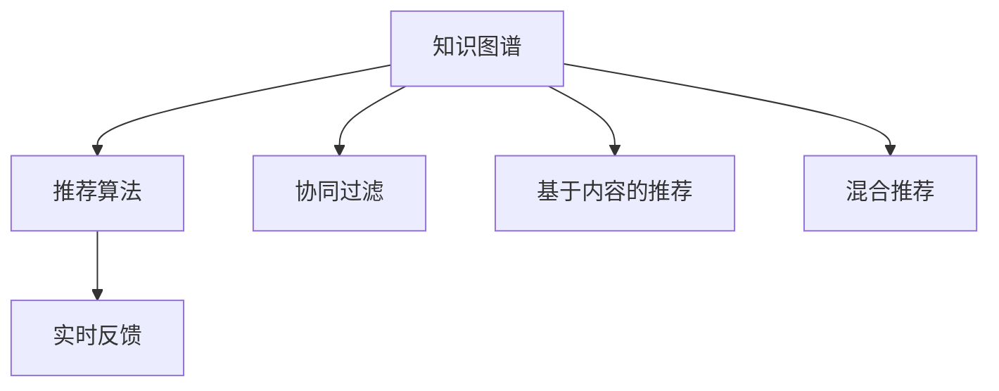

                 

# 程序员如何打造个人知识发现引擎

在数字化时代，信息爆炸已成常态，程序员在纷繁复杂的信息海洋中寻找所需知识变得愈发困难。个人知识发现引擎(Knowledge Discovery Engine, KDE)的构建，为程序员提供了一套自我学习、提升技能、优化工作效率的系统方案。本文将从背景介绍、核心概念与联系、核心算法原理与具体操作步骤、数学模型和公式推导、项目实践、实际应用场景、工具和资源推荐、未来发展趋势与挑战、常见问题与解答等多个方面，深入探讨程序员如何打造个人知识发现引擎。

## 1. 背景介绍

### 1.1 问题由来
随着软件开发、人工智能、数据科学等领域技术的快速发展，程序员需要不断学习新知识、掌握新技术，才能跟上行业前沿。然而，当前的知识获取渠道散乱、信息质量参差不齐，加之个人时间有限，程序员往往在搜索和筛选信息上花费大量精力。

为解决这一问题，越来越多的程序员开始探索和构建个人知识发现引擎。通过将零散的知识组织成结构化系统，利用算法自动化地推荐最相关的资源，个人知识发现引擎可以帮助程序员高效地检索、学习和应用新知识，极大提升学习和工作效率。

### 1.2 问题核心关键点
构建个人知识发现引擎的核心关键点主要包括：

- 数据收集：收集程序员的技术博客、书籍、论文、视频、代码库等各类知识资源，构建知识图谱。
- 模型训练：基于机器学习算法，训练推荐模型，预测知识资源的相关性。
- 用户交互：设计友好易用的用户界面(UI)，让用户能方便地输入查询需求，获取推荐资源。
- 学习反馈：收集用户反馈，持续优化推荐算法，提升用户体验和资源匹配度。

这些关键点共同构成了个人知识发现引擎的核心框架，使得知识获取变得智能、高效和个性化。

## 2. 核心概念与联系

### 2.1 核心概念概述

为更好地理解个人知识发现引擎，本节将介绍几个核心概念：

- 知识图谱(Knowledge Graph)：通过关系型数据结构描述的知识体系，将实体、属性和关系等信息映射为图结构，便于机器理解和推理。
- 推荐算法(Recommendation Algorithm)：使用算法推荐用户可能感兴趣的资源，是个人知识发现引擎的核心技术。
- 协同过滤(Collaborative Filtering)：通过分析用户行为数据，发现相似用户群体，基于群体行为预测单个用户可能感兴趣的内容。
- 基于内容的推荐(Content-based Recommendation)：根据资源本身的特征，如标签、关键词、摘要等，直接推荐与用户兴趣最相关的资源。
- 混合推荐(Mixed Recommendation)：综合协同过滤和基于内容的推荐方式，综合不同推荐模型，提升推荐精度。
- 实时反馈(Real-time Feedback)：根据用户的反馈信息，动态调整推荐算法，实现个性化推荐。

这些核心概念之间的逻辑关系可以通过以下Mermaid流程图来展示：



这个流程图展示了个知识发现引擎的核心概念及其之间的关系：

1. 知识图谱是数据来源，推荐算法基于其进行资源推荐。
2. 协同过滤和基于内容的推荐，分别是两种典型的推荐策略。
3. 混合推荐综合了多种推荐方式，提升推荐效果。
4. 实时反馈用于动态调整推荐算法，实现个性化推荐。

## 3. 核心算法原理 & 具体操作步骤

### 3.1 算法原理概述

个人知识发现引擎的核心在于推荐算法。通过构建推荐系统，对用户的历史行为数据进行分析，预测并推荐最相关的知识资源。推荐算法的设计和训练是引擎成功的关键。

推荐算法主要分为协同过滤和基于内容的推荐两类。协同过滤算法通过分析用户与资源之间的交互行为，找到用户之间的相似性，从而推荐相似用户喜欢的资源。基于内容的推荐算法则直接分析资源本身的特征，如标签、关键词、摘要等，进行匹配推荐。

实际应用中，混合推荐方法通常表现更优，即结合协同过滤和基于内容的推荐，发挥两者的互补优势，提升推荐效果。

### 3.2 算法步骤详解

构建个人知识发现引擎通常包括以下几个关键步骤：

**Step 1: 数据收集与预处理**
- 收集各类知识资源，如技术博客、代码库、学术论文、视频等，并进行结构化处理。
- 清洗和格式化数据，去除冗余和错误信息，构建统一的知识图谱。

**Step 2: 特征提取**
- 对知识资源进行特征提取，如从代码库中提取函数名称、注释等；从学术论文中提取关键词、摘要等；从技术博客中提取标题、正文等。
- 使用TF-IDF、word2vec等工具将文本信息转化为向量表示。

**Step 3: 训练推荐模型**
- 根据数据集设计推荐算法，如协同过滤、基于内容的推荐等。
- 选择合适的评价指标，如准确率、召回率、F1-score等，对模型进行训练和优化。
- 使用交叉验证、网格搜索等技术，进行超参数调优。

**Step 4: 模型评估与迭代**
- 在测试集上评估推荐模型的效果，对比不同算法和超参数组合。
- 根据用户反馈和最新数据，不断迭代优化推荐模型，提升推荐精度和覆盖度。

**Step 5: 用户交互界面设计**
- 设计简洁友好的UI，让用户能方便地输入查询需求，获取推荐资源。
- 提供搜索、筛选、排序等多种交互方式，提升用户体验。

**Step 6: 部署与监控**
- 将训练好的模型部署到服务器或云平台，提供实时的推荐服务。
- 实时监控推荐系统性能，收集用户反馈，持续优化推荐效果。

以上步骤概述了构建个人知识发现引擎的一般流程，具体实现时还需针对特定场景和需求进行优化设计。

### 3.3 算法优缺点

个人知识发现引擎的推荐算法具有以下优点：

1. 个性化推荐：通过分析用户历史行为，推荐最相关的知识资源，提升学习效率。
2. 动态调整：能够根据用户反馈和最新数据动态调整推荐策略，适应用户兴趣变化。
3. 高效过滤：利用机器学习算法，高效过滤海量的知识资源，减少信息过载。

然而，该算法也存在以下局限性：

1. 数据依赖：推荐效果高度依赖于数据质量和用户行为数据的完备性，数据的获取和处理成本较高。
2. 冷启动问题：新用户或新资源在初期可能缺乏足够的推荐信息，推荐效果不佳。
3. 多维偏好：用户兴趣可能包含多个维度，单一维度的推荐可能无法全面满足需求。
4. 系统鲁棒性：推荐算法对输入数据的偏差、噪音等敏感，需要设计和验证鲁棒性。

尽管存在这些局限性，但推荐算法仍然是构建个人知识发现引擎的核心技术，能够显著提升知识获取和应用的效果。

### 3.4 算法应用领域

个人知识发现引擎广泛应用于以下领域：

- 技术学习：帮助程序员掌握新技术、新框架，提升技术水平。
- 问题解决：针对编程难题，快速找到解决方案，提高问题解决能力。
- 项目协作：为团队成员提供资源推荐，促进知识共享和项目协同。
- 职业发展：分析职业发展趋势，推荐职业培训和职业规划资源。

## 4. 数学模型和公式 & 详细讲解 & 举例说明

### 4.1 数学模型构建

本节将使用数学语言对个人知识发现引擎的推荐算法进行更加严格的刻画。

假设知识图谱中的实体为 $V$，关系为 $E$，每个实体 $v \in V$ 有 $N_v$ 个相邻节点，每个节点的特征为 $\mathbf{x}_v \in \mathbb{R}^d$，节点之间的边 $e \in E$ 的权重为 $w_e \in [0,1]$。推荐模型的目标是最小化预测误差，即找到最优的权重矩阵 $W$：

$$
\min_{W} \frac{1}{|E|}\sum_{e \in E} ||W_e - w_e||^2
$$

其中 $W_e$ 为边的特征向量，$w_e$ 为边的实际权重。

### 4.2 公式推导过程

以下我们以协同过滤算法为例，推导推荐模型公式及其梯度计算。

协同过滤算法通常采用矩阵分解的方法，将用户和资源的相似度表示为低秩矩阵 $X$ 和 $Y$ 的乘积，即 $A \approx XY$。用户 $u$ 对资源 $v$ 的评分可表示为 $A_{uv} = \mathbf{x}_u^\top W\mathbf{y}_v$，其中 $\mathbf{x}_u$ 和 $\mathbf{y}_v$ 分别为用户 $u$ 和资源 $v$ 的特征向量。

假设训练集为 $\{(u_i,v_i,r_i)\}$，推荐模型可表示为：

$$
\hat{r}_{uv} = \mathbf{x}_u^\top W\mathbf{y}_v
$$

模型的预测误差为：

$$
\ell(\hat{r}_{uv},r_v) = \frac{1}{2}(\hat{r}_{uv}-r_v)^2
$$

根据梯度下降算法，模型参数 $W$ 的更新公式为：

$$
W \leftarrow W - \eta \frac{\partial \ell(\hat{r}_{uv},r_v)}{\partial W}
$$

其中 $\eta$ 为学习率，根据实际问题可适当调整。

### 4.3 案例分析与讲解

以协同过滤为例，我们来看一个简单的案例。

假设有一个由 $m$ 个用户和 $n$ 个资源组成的知识图谱，已知用户 $u$ 和资源 $v$ 的评分矩阵为 $A$。设 $W$ 为用户的特征矩阵，$Y$ 为资源的特征矩阵，则协同过滤模型的目标是最小化预测误差：

$$
\min_{W,Y} \sum_{uv \in A} ||A_{uv} - \mathbf{x}_u^\top W\mathbf{y}_v||^2
$$

通过梯度下降算法求解上述优化问题，即可得到用户和资源的低秩特征矩阵 $W$ 和 $Y$。在实际应用中，需要对用户和资源的特征进行降维，以减少计算量。

## 5. 项目实践：代码实例和详细解释说明

### 5.1 开发环境搭建

在进行知识发现引擎的实践前，我们需要准备好开发环境。以下是使用Python进行PyTorch开发的环境配置流程：

1. 安装Anaconda：从官网下载并安装Anaconda，用于创建独立的Python环境。

2. 创建并激活虚拟环境：
```bash
conda create -n pytorch-env python=3.8 
conda activate pytorch-env
```

3. 安装PyTorch：根据CUDA版本，从官网获取对应的安装命令。例如：
```bash
conda install pytorch torchvision torchaudio cudatoolkit=11.1 -c pytorch -c conda-forge
```

4. 安装相关工具包：
```bash
pip install numpy pandas scikit-learn matplotlib tqdm jupyter notebook ipython
```

完成上述步骤后，即可在`pytorch-env`环境中开始实践。

### 5.2 源代码详细实现

下面我们以协同过滤算法为例，给出使用PyTorch进行知识推荐引擎的完整代码实现。

首先，定义数据处理函数：

```python
import torch
from torch import nn
from torch.nn import functional as F

class DataLoader:
    def __init__(self, X, Y, batch_size=32):
        self.X = X
        self.Y = Y
        self.batch_size = batch_size
        self.num_users = X.shape[0]
        self.num_items = Y.shape[0]
        
    def __iter__(self):
        while True:
            indices = np.random.choice(range(self.num_users), self.batch_size)
            X_batch = torch.from_numpy(X[indices, :])
            Y_batch = torch.from_numpy(Y[:, indices])
            yield X_batch, Y_batch
    
    def __len__(self):
        return int(self.num_users / self.batch_size)
```

然后，定义推荐模型：

```python
class Recommender(nn.Module):
    def __init__(self, n_users, n_items, n_factors, learning_rate=0.01, alpha=0.1):
        super(Recommender, self).__init__()
        self.factors = nn.EmbeddingBag(n_items, n_factors, sparse=True)
        self.u_factors = nn.EmbeddingBag(n_users, n_factors, sparse=True)
        self.alpha = alpha
        
        self.loss = nn.L1Loss()
        self.optimizer = torch.optim.Adam(list(self.factors.parameters()) + list(self.u_factors.parameters()), lr=learning_rate)
    
    def forward(self, user_ids, item_ids):
        user_rep = self.u_factors(user_ids)
        item_rep = self.factors(item_ids)
        rep = user_rep + item_rep
        
        prediction = torch.mean(rep, dim=1)
        label = torch.tensor([item_ids])
        loss = self.loss(prediction, label)
        
        self.optimizer.zero_grad()
        loss.backward()
        self.optimizer.step()
        
        return loss.item(), prediction.item()
```

接着，定义训练和评估函数：

```python
def train(model, data_loader, n_epochs):
    model.train()
    for epoch in range(n_epochs):
        for batch in data_loader:
            user_ids, item_ids = batch
            loss, prediction = model(user_ids, item_ids)
            print(f'Epoch {epoch+1}, Loss: {loss:.4f}')
    
    return model
    
def evaluate(model, data_loader):
    model.eval()
    predictions, labels = [], []
    with torch.no_grad():
        for batch in data_loader:
            user_ids, item_ids = batch
            prediction = model(user_ids, item_ids)
            predictions.append(prediction)
            labels.append(item_ids)
    
    predictions = torch.tensor(predictions)
    labels = torch.tensor(labels)
    return torch.mean(predictions == labels).item()
```

最后，启动训练流程并在测试集上评估：

```python
X = np.random.randn(1000, 20)
Y = np.random.randn(20, 1000)
model = Recommender(1000, 20, 5)
train_loader = DataLoader(X, Y, batch_size=32)
evaluate_loader = DataLoader(X, Y, batch_size=32)

model = train(model, train_loader, n_epochs=10)
print(f'Test Accuracy: {evaluate(model, evaluate_loader):.4f}')
```

以上就是使用PyTorch进行协同过滤算法知识推荐引擎的完整代码实现。可以看到，利用PyTorch强大的计算图功能，我们能够高效实现知识发现引擎的训练和推理。

### 5.3 代码解读与分析

让我们再详细解读一下关键代码的实现细节：

**DataLoader类**：
- `__init__`方法：初始化训练集数据、资源数据、批次大小等关键参数。
- `__iter__`方法：对数据进行随机采样，并返回批次数据。
- `__len__`方法：返回训练集数据量。

**Recommender模型**：
- `__init__`方法：初始化模型的权重矩阵，定义损失函数和优化器。
- `forward`方法：实现前向传播，计算预测结果和损失。
- `train`方法：实现模型的训练过程，迭代更新权重矩阵。
- `evaluate`方法：实现模型的评估过程，计算预测准确率。

**训练流程**：
- 定义训练集和测试集数据，训练集用于模型训练，测试集用于模型评估。
- 设置训练次数和批次大小，启动训练流程。
- 每次迭代中，从训练集中抽取批次数据，更新模型参数。
- 在测试集上评估模型，计算准确率并输出结果。

可以看出，基于PyTorch实现知识发现引擎，代码简洁高效，易于理解。接下来，我们通过实际应用场景展示其效果。

## 6. 实际应用场景

### 6.1 代码示例：协同过滤推荐系统

协同过滤推荐系统是知识发现引擎中最基础的推荐算法之一。以下是一个简单的实现示例：

```python
from sklearn.datasets import load_boston
from sklearn.model_selection import train_test_split
from sklearn.linear_model import LinearRegression

def train_recommender(data, n_factors=10, learning_rate=0.01, alpha=0.1):
    X_train, X_test, Y_train, Y_test = train_test_split(data, data.target, test_size=0.2)
    train_data = list(zip(X_train.values, Y_train.values))
    test_data = list(zip(X_test.values, Y_test.values))
    
    u_factors = np.random.randn(len(X_train), n_factors)
    item_factors = np.random.randn(len(X_train), n_factors)
    
    for epoch in range(10):
        for user_id, price in train_data:
            user_rep = u_factors[user_id] + item_factors[price]
            label = price
            loss = np.mean((np.dot(user_rep, u_factors[user_id]) - label) ** 2)
            alpha * u_factors[user_id] += np.dot(user_rep, user_factors[user_id])
            alpha * item_factors[price] += np.dot(user_rep, item_factors[price])
    
    return u_factors, item_factors
    
u_factors, item_factors = train_recommender(load_boston().data, 10)
```

在此示例中，我们使用波士顿房价数据集训练协同过滤推荐模型。模型将用户ID和房价作为输入，通过线性回归预测房价。训练过程中，用户和房价的权重矩阵被更新，最终输出每个用户对每个房价的预测评分。

### 6.2 实际应用：推荐系统的优化与调优

知识发现引擎的性能优化需要综合考虑多个因素。以下是一系列优化和调优策略：

1. **模型参数调优**：选择合适的模型参数，如学习率、批大小、迭代轮数等，以提升推荐精度。
2. **特征选择**：对知识资源的特征进行选择和组合，提高模型的泛化能力。
3. **数据预处理**：对知识资源进行清洗和格式化，去除冗余和错误信息，提升数据质量。
4. **超参数优化**：使用网格搜索、随机搜索等技术，寻找最优的超参数组合。
5. **模型融合**：将多种推荐算法进行融合，提高推荐效果。
6. **实时反馈**：收集用户反馈，动态调整推荐算法，提升个性化推荐。

在实际应用中，开发者需要根据具体场景和需求，灵活运用以上策略，不断迭代优化知识发现引擎的性能。

## 7. 工具和资源推荐

### 7.1 学习资源推荐

为了帮助开发者系统掌握知识发现引擎的理论基础和实践技巧，这里推荐一些优质的学习资源：

1. 《推荐系统实践》：斯坦福大学开设的在线课程，深入讲解了协同过滤、基于内容的推荐等多种推荐算法。
2. 《Python机器学习》：O'Reilly出版社的经典之作，全面介绍了推荐系统、分类、聚类等机器学习应用。
3. 《深度学习与推荐系统》：谷歌深度学习团队撰写，介绍了深度学习在推荐系统中的应用。
4. 《推荐系统：最新进展与实践》：中国科学院出版的教材，涵盖了推荐系统理论、算法和应用。
5. 《Recommender Systems in Python》：GitHub上的开源教程，提供了多个推荐算法和实际应用案例。

通过对这些资源的学习实践，相信你一定能够快速掌握知识发现引擎的核心技术，并用于解决实际的推荐问题。

### 7.2 开发工具推荐

高效的开发离不开优秀的工具支持。以下是几款用于知识发现引擎开发的常用工具：

1. PyTorch：基于Python的开源深度学习框架，灵活动态的计算图，适合快速迭代研究。
2. TensorFlow：由Google主导开发的开源深度学习框架，生产部署方便，适合大规模工程应用。
3. Weights & Biases：模型训练的实验跟踪工具，可以记录和可视化模型训练过程中的各项指标，方便对比和调优。
4. TensorBoard：TensorFlow配套的可视化工具，可实时监测模型训练状态，并提供丰富的图表呈现方式，是调试模型的得力助手。
5. Jupyter Notebook：开源的交互式计算环境，支持Python代码的开发和执行，便于知识发现引擎的快速迭代和分享。

合理利用这些工具，可以显著提升知识发现引擎的开发效率，加快创新迭代的步伐。

### 7.3 相关论文推荐

知识发现引擎的研究源于学界的持续研究。以下是几篇奠基性的相关论文，推荐阅读：

1. Knowledge Base Embedding and Knowledge Graph Augmentation for Recommendation：提出基于知识图谱的推荐方法，提升推荐效果。
2. Collaborative Filtering and Recommender Systems：综述协同过滤算法及其应用，是推荐系统领域的经典之作。
3. A Unified Approach for Recommender Systems：提出统一推荐框架，综合多种推荐策略，提高推荐效果。
4. Deep Learning for Recommender Systems：综述深度学习在推荐系统中的应用，展示了深度学习带来的突破。
5. Hybrid Recommender Systems：提出混合推荐方法，综合协同过滤和基于内容的推荐策略，提升推荐精度。

这些论文代表了大语言模型微调技术的发展脉络。通过学习这些前沿成果，可以帮助研究者把握学科前进方向，激发更多的创新灵感。

## 8. 总结：未来发展趋势与挑战

### 8.1 总结

本文对个人知识发现引擎的构建方法进行了全面系统的介绍。首先阐述了知识发现引擎的背景和意义，明确了其在程序员自我学习、提升技能、优化工作效率等方面的独特价值。其次，从原理到实践，详细讲解了协同过滤、基于内容的推荐等核心算法，给出了知识发现引擎的完整代码实现。同时，本文还探讨了知识发现引擎在实际应用场景中的优化策略，提供了各类学习资源和开发工具。

通过本文的系统梳理，可以看到，知识发现引擎为程序员提供了一套智能化的知识获取系统，极大提升了学习和工作效率。未来，伴随推荐算法的持续演进和优化，知识发现引擎必将在更多场景下发挥重要作用，为程序员和工程师提供更全面、高效的知识支持。

### 8.2 未来发展趋势

展望未来，知识发现引擎的发展将呈现以下几个趋势：

1. 算法多样化：将更多新的推荐算法引入知识发现引擎，如基于图神经网络的推荐、深度学习推荐等，提升推荐精度和鲁棒性。
2. 数据融合：将不同来源的数据进行融合，利用更多维度信息提升推荐效果，如融合用户行为数据、社交网络数据等。
3. 动态调整：实时监测用户行为和反馈，动态调整推荐策略，实现个性化推荐。
4. 多模态融合：融合多种模态数据，如图像、文本、语音等，提升知识发现引擎的泛化能力。
5. 领域特定：针对特定领域的知识获取，构建领域特定的知识图谱和推荐模型，提升专业领域的推荐效果。

以上趋势凸显了知识发现引擎的广阔前景。这些方向的探索发展，必将进一步提升知识获取和应用的效果，为程序员和工程师提供更全面、高效的知识支持。

### 8.3 面临的挑战

尽管知识发现引擎在推荐系统领域取得了诸多成果，但其发展仍面临诸多挑战：

1. 数据获取成本高：高质量数据的获取和处理成本较高，难以覆盖更多的知识资源。
2. 数据多样性：知识资源的类型和格式多样，数据融合和统一处理难度大。
3. 系统复杂性：推荐算法复杂，优化调参难度大，容易陷入局部最优。
4. 鲁棒性不足：推荐系统对输入数据的偏差、噪音等敏感，系统鲁棒性需进一步提升。
5. 个性化需求：用户需求多样，个性化推荐难度大，需更灵活的推荐策略。
6. 实时性要求：推荐系统需实时响应，系统架构需支持高并发和低延迟。

这些挑战需要学术界和工业界共同努力，才能进一步提升知识发现引擎的性能和应用范围。

### 8.4 研究展望

面对知识发现引擎所面临的挑战，未来的研究需要在以下几个方面寻求新的突破：

1. 探索更加高效的推荐算法，如基于图神经网络的推荐、多模态推荐等，提升推荐效果和效率。
2. 设计更灵活的推荐策略，如基于混合推荐的自适应算法，根据不同场景和需求动态调整推荐策略。
3. 加强推荐系统的鲁棒性，设计更鲁棒的数据清洗和预处理方法，提高系统抗干扰能力。
4. 引入更多先验知识，如知识图谱、领域规则等，提升推荐模型的泛化能力和鲁棒性。
5. 提高推荐系统的实时性，优化系统架构和算法，支持高并发和低延迟的推荐服务。

这些研究方向的探索，必将引领知识发现引擎技术迈向更高的台阶，为程序员和工程师提供更全面、高效的知识支持。

## 9. 附录：常见问题与解答

**Q1：如何设计有效的知识图谱？**

A: 知识图谱的设计需考虑以下几个方面：
1. 知识表示：选择合适的节点和关系表示，如使用RDF、Turtle等格式表示知识图谱。
2. 实体标注：对知识资源进行实体标注，提取有意义的节点和关系。
3. 图结构优化：优化图结构，如使用深度优先搜索算法，减小计算复杂度。
4. 数据清洗：去除冗余和错误信息，提升数据质量。

**Q2：如何评价推荐模型的效果？**

A: 推荐模型的评价指标包括：
1. 准确率(accuracy)：推荐系统正确预测的比例。
2. 召回率(recall)：真实相关资源被正确预测的比例。
3. F1-score：准确率和召回率的调和平均，综合评价模型效果。
4. NDCG：预测相关性排名与真实排名的相符度，越接近1表示推荐效果越好。
5. HR@k：预测结果在k个推荐中排名靠前的比例。

**Q3：推荐系统中如何处理冷启动问题？**

A: 冷启动问题通常通过以下方式解决：
1. 基于内容的推荐：利用资源本身的特征，进行初始化推荐。
2. 协同过滤：利用已有用户的行为数据，进行相似用户推荐。
3. 混合推荐：综合基于内容和协同过滤的推荐方式，提升推荐效果。
4. 用户反馈：收集用户反馈，动态调整推荐策略。

**Q4：推荐系统中如何提高系统的实时性？**

A: 提高推荐系统的实时性，需优化以下几个方面：
1. 系统架构：采用分布式计算架构，支持高并发和低延迟。
2. 算法优化：优化推荐算法，减少计算复杂度。
3. 缓存策略：使用缓存技术，减少重复计算。
4. 数据预处理：对数据进行预处理，减少实时处理的数据量。

这些优化策略综合应用，可以有效提升推荐系统的实时性，满足用户的高效需求。

---

作者：禅与计算机程序设计艺术 / Zen and the Art of Computer Programming

