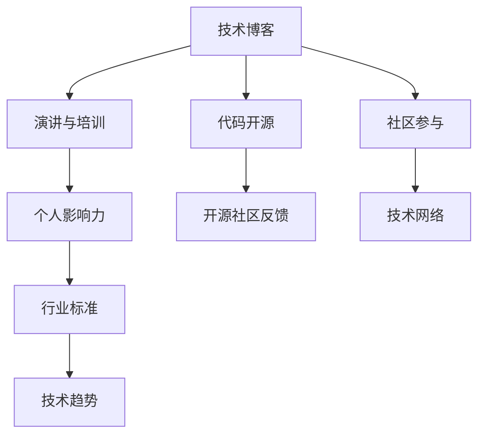

                 

# 程序员如何打造个人知识品牌

> 关键词：个人知识品牌, 程序员, 技术博客, 代码开源, GitHub, 社区参与, 演讲与培训, 个人影响力

## 1. 背景介绍

在当今信息技术高速发展的时代，个人品牌建设对于程序员而言变得尤为重要。无论是职业发展的助力、技术经验的分享，还是行业影响力的提升，一个强大的个人品牌都能让个人在激烈的竞争中脱颖而出。本文旨在为希望打造个人知识品牌的程序员提供一份全面的指南，涵盖技术博客、代码开源、社区参与、演讲与培训、个人影响力提升等多个方面，帮助你建立和维护一个有影响力、有深度、有广度的个人知识品牌。

## 2. 核心概念与联系

### 2.1 核心概念概述

为更好地理解个人知识品牌建设的过程，本节将介绍几个关键概念：

- **个人知识品牌**：指个人通过技术博客、代码开源、社区参与、演讲与培训等渠道，展示其在技术领域的专业知识和实践经验，逐步建立起来的具有一定影响力的人设和声誉。

- **技术博客**：程序员通过撰写技术博客，分享技术经验、解决实际问题、探讨行业趋势等，建立个人在技术领域的权威性和影响力。

- **代码开源**：通过在GitHub等平台公开自己的代码和项目，不仅可以展示技术实力，还可以通过他人的贡献和反馈，不断提升代码质量和项目深度。

- **社区参与**：积极参与开源社区的讨论和项目，不仅能够积累经验，还能够建立广泛的职业网络，获得行业内的认可和支持。

- **演讲与培训**：通过在技术会议、行业沙龙、在线教育平台等场合进行演讲和培训，不仅可以提升个人在技术社区中的曝光度，还能直接接触到行业前沿知识，拓展视野。

- **个人影响力**：通过持续的技术输出和社区互动，逐渐在技术界建立起自己的影响力，获得同行认可，乃至影响技术趋势和行业标准。

这些概念之间的逻辑关系可以通过以下Mermaid流程图来展示：



这个流程图展示出，通过技术博客和代码开源等活动，程序员可以展示自己的技术实力和项目经验；通过社区参与和演讲与培训，个人能够积累经验、扩展人脉，并提升自己在技术界的影响力。这一系列活动共同构建了一个完整的个人知识品牌框架。

## 3. 核心算法原理 & 具体操作步骤
### 3.1 算法原理概述

个人知识品牌建设本质上是通过展示技术能力和专业见解，逐步建立和维护个人在特定技术领域的权威性和影响力的过程。

形式化地，假设个人品牌影响力可以通过函数 $I(\textit{Blog}, \textit{Code}, \textit{Talk}, \textit{Network})$ 计算，其中 $\textit{Blog}, \textit{Code}, \textit{Talk}, \textit{Network}$ 分别表示技术博客的活跃度、代码开源的贡献度、演讲与培训的频次、社区参与的网络规模。则构建个人品牌的算法可以表述为：

$$
\max_{\textit{Blog}, \textit{Code}, \textit{Talk}, \textit{Network}} I(\textit{Blog}, \textit{Code}, \textit{Talk}, \textit{Network})
$$

### 3.2 算法步骤详解

构建个人知识品牌的核心步骤如下：

**Step 1: 确定目标领域和受众**
- 明确自己想要建立的个人知识品牌在哪个技术领域，例如机器学习、软件开发、大数据等。
- 定义目标受众，如学生、同行、行业领导等，确保自己的内容能够吸引并满足受众需求。

**Step 2: 建立技术博客**
- 选择一个博客平台（如Medium、GitHub Pages、个人网站等）进行技术分享。
- 定期更新博客内容，涵盖技术教程、案例分析、行业洞察、最新动态等。
- 利用SEO优化提高博客的可见性，增加访问量和互动。

**Step 3: 开展代码开源**
- 将个人项目或贡献的项目发布到GitHub等代码托管平台。
- 及时更新代码，添加文档和测试用例，保持代码质量和项目活跃。
- 主动参与其他项目，给予代码审查和贡献，与社区成员互动。

**Step 4: 积极参与社区**
- 在GitHub、Stack Overflow、Reddit、Kaggle等技术社区积极发言，回答问题，参与讨论。
- 参与开源项目，贡献代码或改进文档，展示自己的技术能力。
- 关注并参与技术会议、黑客松等活动，建立职业网络。

**Step 5: 组织演讲与培训**
- 在技术会议、行业沙龙、线上教育平台等场合进行演讲和培训，分享自己的技术见解和项目经验。
- 准备充分的PPT和案例，确保演讲内容生动有趣，能够引发共鸣。
- 收集反馈，不断改进演讲和培训的内容和形式。

**Step 6: 持续学习和提升**
- 关注技术前沿，不断学习和提升自身技术水平。
- 参与学术交流，阅读最新论文和书籍，保持技术敏锐度。
- 通过技术博客、代码开源等形式，不断输出新的见解和经验。

### 3.3 算法优缺点

个人知识品牌建设的方法具有以下优点：
1. **展示技术实力**：通过技术博客、代码开源等活动，能够全面展示个人在特定技术领域的专业能力。
2. **积累职业网络**：积极参与社区讨论和开源项目，可以积累广泛的职业网络，获得更多机会和支持。
3. **提升行业影响力**：通过持续的技术输出和社区互动，逐步建立起个人在技术界的影响力。

同时，该方法也存在一些局限性：
1. **时间和精力投入大**：需要持续的输出和互动，对时间和精力要求较高。
2. **受众需求多样性**：需要根据不同受众需求调整内容，找到平衡点。
3. **品牌建设周期长**：个人品牌建设是一个长期过程，见效慢，需要持续努力。
4. **市场竞争激烈**：技术社区竞争激烈，需要不断创新和改进，才能保持竞争力。

尽管存在这些局限性，但就目前而言，通过技术博客、代码开源、社区参与、演讲与培训等活动，建设个人知识品牌是最主流、最有效的方法之一。未来相关研究的重点在于如何优化这些活动，提升个人品牌建设的效率和效果。

### 3.4 算法应用领域

个人知识品牌建设的方法在技术界已经得到了广泛的应用，覆盖了几乎所有常见的技术领域，例如：

- 软件开发：通过撰写技术博客、开源代码，分享软件开发经验和最佳实践。
- 数据分析：通过撰写数据分析案例、开源数据处理脚本，展示数据处理和建模能力。
- 人工智能：通过撰写AI论文、开源算法实现，分享AI理论和实践经验。
- 网络安全：通过撰写安全漏洞分析、开源安全工具，展示安全知识和防护能力。
- 区块链：通过撰写区块链应用开发、开源智能合约，分享区块链技术和应用场景。

除了这些经典技术领域外，个人品牌建设还被创新性地应用到更多场景中，如技术咨询、技术创业、技术讲座、技术培训等，为技术工作者提供了更多的职业发展路径和展示平台。

## 4. 数学模型和公式 & 详细讲解 & 举例说明

### 4.1 数学模型构建

个人知识品牌的影响力可以通过多个维度进行量化，包括博客访问量、代码贡献度、社区互动量、演讲参与度等。我们定义一个综合的指标 $I$ 来衡量个人品牌的总体影响力：

$$
I = \alpha_B \times \textit{Blog} + \alpha_C \times \textit{Code} + \alpha_T \times \textit{Talk} + \alpha_N \times \textit{Network}
$$

其中，$\alpha_B, \alpha_C, \alpha_T, \alpha_N$ 分别为各维度的权重，需要根据实际情况进行调整。

### 4.2 公式推导过程

以博客访问量为例，博客的影响力可以通过以下公式进行计算：

$$
\textit{Blog} = \frac{\textit{访问量}}{\textit{访问量} \times \textit{权重}}
$$

其中，$\textit{权重}$ 代表博客内容的质量和相关性，可以通过内容热度、评论量、分享量等因素计算得出。

### 4.3 案例分析与讲解

以GitHub为例，个人代码贡献度可以通过以下公式计算：

$$
\textit{Code} = \frac{\textit{贡献代码行数}}{\textit{总行数} \times \textit{权重}} + \frac{\textit{参与项目数}}{\textit{总项目数} \times \textit{权重}}
$$

其中，$\textit{权重}$ 可以通过项目重要性、贡献时间、代码质量等因素计算得出。

## 5. 项目实践：代码实例和详细解释说明
### 5.1 开发环境搭建

在进行个人知识品牌建设的项目实践前，我们需要准备好开发环境。以下是使用Python进行开发的环境配置流程：

1. 安装Anaconda：从官网下载并安装Anaconda，用于创建独立的Python环境。

2. 创建并激活虚拟环境：
```bash
conda create -n myenv python=3.8 
conda activate myenv
```

3. 安装所需库：
```bash
pip install jupyter notebook matplotlib pandas numpy
```

4. 配置开发环境：
```bash
jupyter notebook --allow-root
```

完成上述步骤后，即可在`myenv`环境中开始项目实践。

### 5.2 源代码详细实现

下面以技术博客为例，给出使用Jupyter Notebook进行技术博客开发的PyTorch代码实现。

创建一个新的Jupyter Notebook文件，命名为`blog_demo.ipynb`。

首先，导入必要的库：

```python
import matplotlib.pyplot as plt
import pandas as pd
import numpy as np
```

然后，定义数据处理函数：

```python
def preprocess_data(data):
    # 清洗和处理数据
    cleaned_data = data.apply(lambda x: x.strip() if isinstance(x, str) else x)
    return cleaned_data
```

接着，读取和处理数据：

```python
# 读取博客数据
blog_data = pd.read_csv('blog_data.csv')

# 清洗和处理数据
cleaned_data = preprocess_data(blog_data)

# 可视化博客访问量
plt.plot(cleaned_data['访问量'])
plt.title('博客访问量趋势')
plt.xlabel('时间')
plt.ylabel('访问量')
plt.show()
```

最后，展示博客访问量趋势：

```python
# 展示博客访问量趋势
cleaned_data['访问量'] = cleaned_data['访问量'].astype('float')
plt.plot(cleaned_data['访问量'])
plt.title('博客访问量趋势')
plt.xlabel('时间')
plt.ylabel('访问量')
plt.show()
```

以上是一个简单的技术博客访问量趋势分析的代码实现。可以看到，通过Jupyter Notebook，我们可以很方便地进行数据处理、可视化分析等操作，快速地构建和展示技术博客内容。

### 5.3 代码解读与分析

让我们再详细解读一下关键代码的实现细节：

**preprocess_data函数**：
- 定义了一个数据清洗和处理函数，去除数据中的空格和无效值。

**读取和处理数据**：
- 使用Pandas库读取博客数据，并通过预处理函数去除无效数据。
- 可视化博客访问量趋势，展示数据变化情况。

**代码展示与分析**：
- 展示博客访问量趋势，通过Matplotlib库进行数据可视化。
- 代码简单易懂，易于扩展和维护，适合作为技术博客的开发模板。

通过这个简单的代码示例，我们可以看到，利用Python和Jupyter Notebook，我们可以高效地进行数据处理和可视化分析，快速构建和展示技术博客内容。

## 6. 实际应用场景
### 6.1 软件开发

通过技术博客和代码开源，程序员可以展示自己在软件开发领域的深度经验和专业见解，吸引同行和学生关注，并建立职业网络。

在实践应用中，可以定期发布博客文章，分享自己的开发经验、技术栈选择、代码实现细节等。同时，将开源项目和代码库作为技术博客的补充，展示技术实力和项目成果。

### 6.2 数据分析

数据分析师可以通过技术博客和代码开源，分享数据分析方法和案例，展示数据处理和建模能力。

在实际操作中，可以撰写数据分析案例，详细介绍数据处理流程、建模方法和结果解读。同时，将数据处理脚本和分析模型开源，方便他人学习和复现。

### 6.3 人工智能

AI工程师可以通过技术博客和代码开源，分享AI理论和实践经验，展示其在机器学习、深度学习、自然语言处理等方面的能力。

在具体实施时，可以撰写AI论文、开源算法实现，并分享实际应用案例。通过技术博客和开源项目，不断更新和完善自己的技术知识和实践经验。

### 6.4 网络安全

网络安全专家可以通过技术博客和代码开源，分享安全漏洞分析、安全工具实现，展示自己在网络安全领域的深入理解和防护能力。

在应用中，可以撰写安全漏洞分析报告，开源安全工具和脚本，分享防护策略和最佳实践。通过技术博客和开源项目，与社区成员互动，提升个人影响力。

### 6.5 区块链

区块链开发者可以通过技术博客和代码开源，分享区块链应用开发、智能合约实现，展示区块链技术和应用场景。

在实践中，可以撰写区块链应用案例、开源智能合约，并分享区块链开发经验和最佳实践。通过技术博客和开源项目，吸引同行关注，并建立职业网络。

## 7. 工具和资源推荐
### 7.1 学习资源推荐

为了帮助开发者系统掌握个人知识品牌建设的理论基础和实践技巧，这里推荐一些优质的学习资源：

1. **《程序员如何打造个人品牌》**：详细讲解了技术博客、代码开源、社区参与等个人知识品牌建设的方法和技巧，适合技术开发者入门和进阶。

2. **CS50系列课程**：由哈佛大学开设的计算机科学入门课程，涵盖编程基础、数据结构、操作系统等，帮助开发者打下坚实基础。

3. **Coursera数据科学专业课程**：由斯坦福大学开设的数据科学系列课程，涵盖数据分析、机器学习、统计学等，提供系统的学习资源。

4. **Udacity人工智能专业课程**：由Google和机器学习专家共同开发的AI课程，涵盖深度学习、自然语言处理、计算机视觉等前沿技术，适合深度学习开发者。

5. **Google Developers网站**：Google开发者网站提供丰富的技术文档和教程，涵盖Web开发、移动应用、机器学习等多个领域，是开发者不可或缺的学习资源。

通过对这些资源的学习实践，相信你一定能够快速掌握个人知识品牌建设的技巧和方法，打造属于自己的技术品牌。

### 7.2 开发工具推荐

高效的开发离不开优秀的工具支持。以下是几款用于个人知识品牌建设开发的常用工具：

1. **Jupyter Notebook**：基于Python的交互式编程环境，适合进行数据处理、可视化分析、技术博客开发等。

2. **GitHub**：代码托管平台，支持代码开源和项目协作，是技术开发者展示个人项目和获取反馈的重要平台。

3. **GitLab**：类似GitHub的代码托管平台，提供丰富的CI/CD功能，适合持续集成和自动化部署。

4. **Overleaf**：在线LaTeX编辑器，适合撰写学术论文和技术报告，支持实时预览和版本控制。

5. **Trello**：任务管理工具，适合组织和跟进个人项目进度，合理安排时间和资源。

6. **Slack**：团队沟通工具，适合构建技术社区和团队协作，建立广泛的职业网络。

合理利用这些工具，可以显著提升个人知识品牌建设的效率，加快创新迭代的步伐。

### 7.3 相关论文推荐

个人知识品牌建设的技术和实践不断发展，以下是几篇奠基性的相关论文，推荐阅读：

1. **《程序员如何打造个人品牌》**：探讨了技术博客、代码开源、社区参与等个人知识品牌建设的方法和技巧。

2. **《技术博客的力量》**：分析了技术博客在技术开发者职业发展中的重要性，提供了建设高质量技术博客的建议。

3. **《开源社区中的个人品牌建设》**：研究了开源项目在个人品牌建设中的作用，提供了开源项目的最佳实践和案例分析。

4. **《技术讲座的影响力》**：分析了技术讲座对个人品牌的影响，探讨了如何通过技术讲座提升个人影响力。

5. **《技术培训的市场价值》**：研究了技术培训在技术开发者职业发展中的作用，提供了有效培训的方法和技巧。

这些论文代表了大语言模型微调技术的发展脉络。通过学习这些前沿成果，可以帮助研究者把握学科前进方向，激发更多的创新灵感。

## 8. 总结：未来发展趋势与挑战
### 8.1 总结

本文对个人知识品牌建设的方法进行了全面系统的介绍。首先阐述了个人知识品牌建设的背景和意义，明确了通过技术博客、代码开源、社区参与等活动，逐步建立和维护个人在特定技术领域的权威性和影响力的重要性。其次，从原理到实践，详细讲解了个人知识品牌建设的数学模型和具体步骤，给出了个人知识品牌建设项目的完整代码实现。同时，本文还广泛探讨了个人知识品牌在软件开发、数据分析、人工智能、网络安全、区块链等多个行业领域的应用前景，展示了个人知识品牌建设的巨大潜力。此外，本文精选了个人知识品牌建设的学习资源、开发工具和相关论文，力求为读者提供全方位的技术指引。

通过本文的系统梳理，可以看到，个人知识品牌建设是一个长期、系统、多方位的过程，不仅需要技术知识和实践经验的积累，还需要不断拓展人脉、提升影响力。只有持续输出高质量的内容，积极参与社区互动，才能在技术界建立起自己的权威性和影响力。

### 8.2 未来发展趋势

展望未来，个人知识品牌建设将呈现以下几个发展趋势：

1. **内容质量提升**：随着技术开发者对个人品牌建设的重视，内容质量和深度将不断提高，形成更多专业、系统的技术分享。

2. **多渠道扩展**：个人知识品牌建设将不仅仅局限于技术博客和代码开源，还会拓展到视频博客、Podcast、直播等多种形式。

3. **跨领域融合**：个人知识品牌建设将更加注重跨领域的融合，通过技术分享和合作，推动不同技术领域的协同发展。

4. **技术社区建设**：个人知识品牌建设将更加注重社区建设，通过技术博客、开源项目、社区互动等多种形式，建立广泛的技术网络。

5. **全球化趋势**：随着技术全球化的发展，个人知识品牌建设将逐步走向全球，吸引更多的国际关注和合作。

6. **持续学习与创新**：个人知识品牌建设需要不断学习和创新，通过持续的技术输出和社区互动，保持技术敏锐度和竞争力。

以上趋势凸显了个人知识品牌建设的广阔前景。这些方向的探索发展，必将进一步提升技术开发者的职业发展空间，加速技术的产业化和应用。

### 8.3 面临的挑战

尽管个人知识品牌建设在技术界已经取得了显著成效，但在迈向更加智能化、普适化应用的过程中，它仍面临诸多挑战：

1. **时间与精力管理**：个人知识品牌建设需要持续的输出和互动，对时间和精力要求较高。如何在繁忙的工作中有效平衡，是一大挑战。

2. **内容差异化**：如何根据不同受众需求调整内容，找到平衡点，是个人品牌建设的重要课题。

3. **品牌持续性**：个人知识品牌建设是一个长期过程，见效慢，需要持续努力。如何保持品牌的持续性和稳定性，是一大难题。

4. **市场竞争激烈**：技术社区竞争激烈，如何不断创新和改进，才能保持竞争力，是一大挑战。

5. **个人品牌定位**：如何明确自己的品牌定位和风格，避免同质化竞争，是一大挑战。

6. **技术知识更新**：技术快速发展，如何不断学习和更新技术知识，保持品牌的专业性和前瞻性，是一大挑战。

正视个人知识品牌建设面临的这些挑战，积极应对并寻求突破，将是大语言模型微调走向成熟的必由之路。相信随着学界和产业界的共同努力，这些挑战终将一一被克服，个人知识品牌必将在构建人机协同的智能时代中扮演越来越重要的角色。

### 8.4 研究展望

面对个人知识品牌建设所面临的种种挑战，未来的研究需要在以下几个方面寻求新的突破：

1. **技术内容创新**：探索更多技术内容创新形式，如视频博客、Podcast、直播等，提升技术输出的多样性和互动性。

2. **社区互动优化**：通过技术博客、开源项目等形式，优化社区互动机制，提高内容的传播和反馈效率。

3. **品牌定位与个性化**：帮助技术开发者明确自己的品牌定位和风格，提供个性化的品牌建设建议和方案。

4. **学习与创新激励机制**：建立激励机制，鼓励技术开发者持续学习和创新，提升品牌的竞争力和影响力。

5. **全球化技术分享**：推动技术全球化，通过多语言技术分享和合作，提升技术品牌的全球影响力。

6. **技术知识更新机制**：建立技术知识更新机制，帮助技术开发者及时更新和掌握最新的技术趋势和知识。

这些研究方向的探索，必将引领个人知识品牌建设技术迈向更高的台阶，为技术工作者提供更多职业发展的路径和展示平台。只有勇于创新、敢于突破，才能不断拓展个人知识品牌的边界，让技术工作者更好地发挥自己的专业能力，推动技术进步和社会发展。

## 9. 附录：常见问题与解答

**Q1：个人知识品牌建设需要投入大量时间和精力，是否值得？**

A: 个人知识品牌建设是一个长期、系统、多方位的过程，虽然需要持续的输出和互动，但通过展示技术实力和专业见解，可以吸引同行和学生关注，建立职业网络，提升个人在技术界的权威性和影响力。从长远来看，投入时间和精力的回报是显著的，能够显著提升职业发展空间和竞争力。

**Q2：如何选择技术博客平台？**

A: 技术博客平台的选择应根据自身需求和受众特点进行，常见的选择包括Medium、GitHub Pages、个人网站等。建议选择功能强大、用户友好、社区活跃的平台，方便技术分享和互动。

**Q3：如何进行代码开源？**

A: 代码开源可以从简单的项目开始，逐步积累经验和成果。选择GitHub、GitLab等平台进行代码托管，并定期更新和完善代码。主动参与其他项目，给予代码审查和贡献，与社区成员互动，建立广泛的技术网络。

**Q4：如何提升技术博客的内容质量？**

A: 提升技术博客的内容质量需要不断学习和实践。关注技术前沿，阅读最新论文和书籍，保持技术敏锐度。撰写详细、系统、生动的技术分享，展示深度和专业性。利用可视化工具和图表，增加内容的吸引力和可读性。

**Q5：如何进行技术讲座和培训？**

A: 技术讲座和培训可以从简单的线上分享开始，逐步积累经验和受众。选择技术会议、行业沙龙、在线教育平台等场合进行演讲和培训，分享自己的技术见解和项目经验。准备充分的PPT和案例，确保演讲内容生动有趣，能够引发共鸣。收集反馈，不断改进演讲和培训的内容和形式。

---

作者：禅与计算机程序设计艺术 / Zen and the Art of Computer Programming

