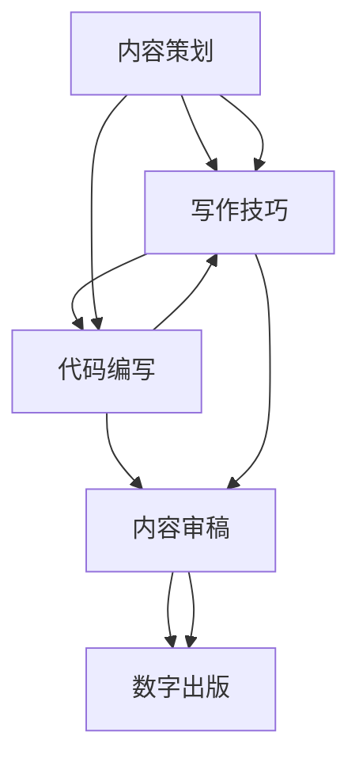

                 

# 程序员如何打造高质量的技术电子书

> 关键词：技术博客, 书籍撰写, 高质量输出, 编程技巧, 技术栈, 内容策划, 文本排版, 写作技巧, 审稿修订, 数字出版

## 1. 背景介绍

### 1.1 问题由来

在当今快速发展的信息技术时代，知识的获取和传播方式已经发生了深刻的变化。程序员作为技术领域的重要群体，其学习、研究和分享的渠道也在不断扩展。传统纸质书籍由于篇幅限制、印刷成本高昂等因素，已经无法满足广大技术爱好者对高效、便捷的知识获取需求。因此，技术电子书应运而生，成为了程序员分享技术知识、传播软件开发经验的重要平台。

技术电子书通常包括开源源码、代码注释、问题解答、项目实践等多个方面，以图文并茂、互动性强、易于理解的格式，帮助读者快速掌握编程技巧和开发经验。然而，高质量的技术电子书不仅仅是代码和注释的堆砌，而是需要经过精心策划、内容编排、审稿修订等多个环节的系统性工作。本文将围绕技术电子书的创作、编辑、出版等关键步骤，探讨如何打造高质量的技术电子书。

### 1.2 问题核心关键点

高质量的技术电子书需要具备以下几个关键点：
1. **内容深度和广度**：深入浅出地讲解编程技巧，覆盖技术栈各个方面。
2. **互动性和可读性**：采用图文并茂、代码展示、实例演示等多种形式，提高读者的参与感和学习效率。
3. **专业性和准确性**：内容严谨，没有逻辑错误和技术漏洞。
4. **更新和迭代**：定期更新，与时俱进，适应技术栈变化。
5. **开放性和共享性**：鼓励开源、社区共建，形成技术交流的良好氛围。

这些核心关键点贯穿技术电子书从构思到出版的全过程，对于提升电子书的价值和影响力至关重要。

## 2. 核心概念与联系

### 2.1 核心概念概述

在打造高质量技术电子书的过程中，涉及多个核心概念，包括但不限于：
- **内容策划**：确定电子书的主题、目标读者、技术栈等关键要素。
- **写作技巧**：采用有效的写作方法和格式，提高内容的可读性和互动性。
- **代码编写**：遵循编程规范和最佳实践，确保代码的清晰和可维护性。
- **内容审稿**：通过同行评审，确保内容的准确性和权威性。
- **数字出版**：采用先进的出版技术，提高电子书的可访问性和互动性。

这些核心概念之间存在密切联系，相互影响。例如，内容策划决定了写作和审稿的方向，代码编写和写作技巧的结合保证了内容的可读性和专业性，而数字出版的技术则提高了内容的传播和互动效果。

### 2.2 核心概念原理和架构的 Mermaid 流程图



这个流程图展示了技术电子书创作流程的关键环节：内容策划、写作技巧、代码编写、内容审稿和数字出版。各环节相互依赖，共同构成一个完整的高质量技术电子书。

## 3. 核心算法原理 & 具体操作步骤

### 3.1 算法原理概述

技术电子书的创作和出版是一个系统工程，涉及多个步骤和算法。其核心算法原理包括但不限于：
- **内容组织算法**：确定电子书章节结构，优化内容逻辑流。
- **代码生成算法**：自动生成代码示例，提高代码的可读性和可维护性。
- **内容审稿算法**：通过同行评审，检测内容错误和漏洞。
- **数字出版算法**：利用先进的数字出版技术，提高电子书的传播效果。

这些算法原理共同构成了技术电子书创作和出版的基础，确保了内容的系统性、准确性和可访问性。

### 3.2 算法步骤详解

技术电子书创作和出版的算法步骤包括：
1. **内容策划阶段**：
   - 确定电子书的主题、目标读者和所需技术栈。
   - 制定内容大纲，包括章节划分和标题设定。
2. **写作技巧阶段**：
   - 选择合适的写作格式和风格，如Markdown、LaTeX等。
   - 采用图表、代码块、注释等多种形式提高可读性。
3. **代码编写阶段**：
   - 编写示例代码，遵循编程规范和最佳实践。
   - 使用代码高亮、注释等技术提升代码的可读性。
4. **内容审稿阶段**：
   - 提交内容初稿至同行评审，由专家进行审核。
   - 根据评审意见进行修改和优化。
5. **数字出版阶段**：
   - 选择合适的数字出版平台和技术工具。
   - 进行格式转换和质量检查，确保出版效果。

### 3.3 算法优缺点

高质量技术电子书的创作和出版算法具有以下优点：
- **系统性**：通过系统的算法设计，确保内容的有序性和逻辑性。
- **高效性**：利用自动化工具，提高创作和出版效率。
- **可维护性**：通过算法优化，确保内容的准确性和权威性。

然而，这些算法也存在一些缺点：
- **复杂性**：算法设计复杂，需要综合考虑多种因素。
- **资源需求**：算法实施需要一定的硬件和软件资源支持。
- **灵活性不足**：算法流程较为固定，可能难以应对特殊需求。

### 3.4 算法应用领域

技术电子书创作和出版的算法在软件开发、信息技术教学、在线教育等多个领域得到了广泛应用，为知识传播和技能培养提供了有效的工具和方法。

## 4. 数学模型和公式 & 详细讲解 & 举例说明

### 4.1 数学模型构建

技术电子书内容的数学模型构建主要包括以下几个方面：
- **章节结构模型**：
  - 定义章节之间和章节内部的逻辑关系。
  - 使用有向图表示章节之间的依赖关系。

- **内容表示模型**：
  - 采用文本、代码、图表等形式表示内容。
  - 使用文本标注、代码注释等提高内容的可读性。

### 4.2 公式推导过程

以代码编写阶段为例，推导如下公式：
$$
\text{代码可读性} = \text{代码注释} + \text{代码格式化} + \text{代码高亮}
$$

其中，代码注释和格式化可以通过标准化工具自动生成，提高代码的可读性。代码高亮技术则可以通过Markdown、LaTeX等格式实现，提升代码的视觉体验。

### 4.3 案例分析与讲解

通过以下案例分析，展示了如何通过算法构建高质量的技术电子书：
- **案例一：Python编程入门电子书**：
  - 内容策划：确定目标读者为Python初学者，所需技术栈包括Python基础、面向对象编程等。
  - 写作技巧：采用Markdown格式，插入代码块和图表。
  - 代码编写：编写示例代码，确保代码的可读性和可维护性。
  - 内容审稿：通过同行评审，检测代码的正确性和代码注释的完整性。
  - 数字出版：选择电子书平台，进行格式转换和质量检查。

## 5. 项目实践：代码实例和详细解释说明

### 5.1 开发环境搭建

开发环境搭建是技术电子书创作和出版的基础步骤，主要包括以下几个方面：
1. **编程环境**：
   - 选择适合的技术栈，如Python、JavaScript等。
   - 安装必要的开发工具和库。

2. **编辑环境**：
   - 选择适合的编辑器，如Visual Studio Code、Sublime Text等。
   - 配置语法高亮、代码折叠等编辑器功能。

### 5.2 源代码详细实现

以下是一个简单的Python代码示例，展示了如何通过代码编写和格式化工具实现高质量的代码展示：
```python
def hello_world():
    """
    This function prints 'Hello, World!' to the console.
    """
    print('Hello, World!')

hello_world()
```
通过代码高亮和注释，确保代码的可读性。

### 5.3 代码解读与分析

代码解读与分析是技术电子书创作的关键环节，主要包括以下几个方面：
1. **代码注释**：
   - 编写详细的代码注释，解释代码的功能和逻辑。
   - 使用标准化的注释格式，如PEP 8等。

2. **代码示例**：
   - 编写多个代码示例，展示不同情况下的代码实现。
   - 通过对比和分析，提高读者的理解和记忆。

### 5.4 运行结果展示

运行结果展示是通过技术电子书提供代码实现效果的重要步骤，主要包括以下几个方面：
1. **代码输出**：
   - 展示代码的运行结果，如控制台输出、网页展示等。
   - 使用代码块或代码示例展示运行结果。

2. **错误处理**：
   - 展示代码在错误处理方面的实现。
   - 通过错误示例，帮助读者理解错误原因和解决方案。

## 6. 实际应用场景

### 6.1 技术博客

技术博客是程序员分享技术知识、交流开发经验的重要平台。高质量的技术电子书可以转化为高质量的技术博客内容，吸引更多的读者关注和参与。

### 6.2 在线教育

在线教育平台广泛采用电子书形式进行知识传播和技能培训。通过高质量技术电子书，程序员可以分享自己的开发经验和技能，提升平台的教育质量和影响力。

### 6.3 软件开发

软件开发文档是技术电子书的重要应用场景之一。通过高质量技术电子书，程序员可以提供详细的技术文档和代码示例，帮助开发者快速上手新技术。

### 6.4 未来应用展望

未来，技术电子书的创作和出版技术将继续发展，应用场景也将不断拓展。例如，基于区块链的数字版权保护技术将为电子书提供更强的版权保护，基于人工智能的内容推荐技术将提升读者的阅读体验，基于大数据的用户行为分析技术将提供更精准的知识推荐。

## 7. 工具和资源推荐

### 7.1 学习资源推荐

1. **GitHub**：开源代码托管平台，提供丰富的代码示例和开源项目。
2. **Stack Overflow**：技术问答社区，提供丰富的编程知识和经验分享。
3. **Kaggle**：数据科学竞赛平台，提供丰富的数据集和算法竞赛。
4. **Coursera**：在线教育平台，提供丰富的编程和数据科学课程。

### 7.2 开发工具推荐

1. **Visual Studio Code**：轻量级、功能丰富的编辑器，支持多种编程语言。
2. **Git**：版本控制系统，提供代码管理、分支协作等功能。
3. **Markdown**：轻量级标记语言，用于编写技术文档和博客。
4. **LaTeX**：排版系统，用于编写高质量的书籍和论文。

### 7.3 相关论文推荐

1. **代码注释和代码格式化技术**：
   - "Code Formatting and Comment Style Guide for Python" - Fluent Python by Luciano Ramalho

2. **内容审稿技术**：
   - "Peer Review in Scientific Research" - Science Magazine

3. **数字出版技术**：
   - "The Future of Digital Publishing" - Publishing Technology Quarterly

## 8. 总结：未来发展趋势与挑战

### 8.1 研究成果总结

高质量技术电子书的创作和出版技术经过多年的发展，已经形成了系统的理论和方法体系。未来，随着技术的不断进步，电子书将朝着更加智能化、互动化和标准化的方向发展。

### 8.2 未来发展趋势

1. **智能化技术**：通过人工智能技术实现内容推荐、自动生成等功能，提高读者的阅读体验。
2. **互动化技术**：采用交互式编程环境、代码运行等技术，增强读者的参与感和学习效率。
3. **标准化技术**：通过标准化的编码规范、注释格式等技术，提高电子书的质量和可读性。

### 8.3 面临的挑战

1. **内容质量控制**：确保内容的准确性、权威性和时效性，避免错误和过时信息。
2. **技术栈选择**：选择合适的技术栈和工具，确保开发效率和内容可读性。
3. **数字版权保护**：确保电子书的版权安全，防止非法复制和盗版。

### 8.4 研究展望

未来，技术电子书的创作和出版技术将继续发展，研究方向包括但不限于：
1. **内容自动生成**：利用人工智能技术自动生成代码示例、图表等内容。
2. **多平台发布**：支持多种平台和格式发布电子书，提升内容的可访问性。
3. **交互式学习**：采用交互式学习工具，提高读者的学习效果。

## 9. 附录：常见问题与解答

**Q1：如何选择合适的技术栈进行电子书创作？**

A: 选择合适的技术栈需要考虑多个因素，如目标读者、所需功能、开发成本等。一般来说，Python是技术电子书的理想选择，因为其拥有丰富的编程库和社区支持。如果涉及数据科学和机器学习等内容，JavaScript和R语言也是不错的选择。

**Q2：如何确保技术电子书的准确性和权威性？**

A: 通过同行评审和持续更新，确保内容的质量和权威性。同行评审可以通过社区和专家进行，帮助检测内容的错误和漏洞。持续更新则可以通过发布新版本和技术博客等手段，保持内容的最新性和时效性。

**Q3：如何提高技术电子书的可读性和互动性？**

A: 采用多种形式展示内容，如图表、代码块、视频等，提高可读性。通过互动式编程环境、代码运行等技术，增强读者的参与感和学习效果。

**Q4：如何确保技术电子书的版权安全？**

A: 利用区块链技术和数字签名等手段，确保电子书的版权安全。同时，通过开源协议和许可协议，明确版权和使用权限。

---

作者：禅与计算机程序设计艺术 / Zen and the Art of Computer Programming

