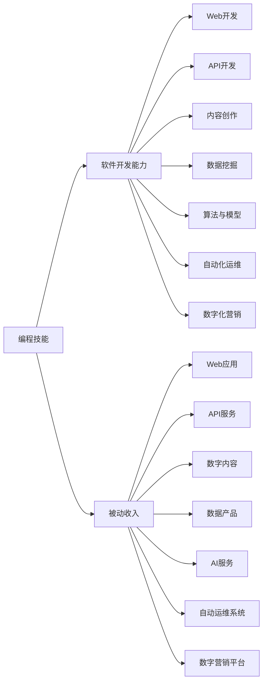

                 

# 程序员如何构建多元化的被动收入系统

## 1. 背景介绍

在数字经济时代，程序员不再只是写代码，通过构建多元化的被动收入系统，他们可以实现更广阔的职业发展路径和更丰富的收入来源。本文将深入探讨如何利用编程技能和软件开发能力，开发出具备高附加值、可自动运行、持续带来收益的被动收入项目。通过实例和原理分析，为程序员提供系统的思路和方法，助其探索多元化的收入渠道。

## 2. 核心概念与联系

### 2.1 核心概念概述

本节将介绍构建被动收入系统的核心概念及其相互关系：

- **被动收入(Passive Income)**：指无需持续投入时间、精力或资源，即可自动产生收益的收入方式。例如网站广告、投资分红、版税等。
- **编程技能(Programming Skills)**：程序员所掌握的计算机语言、算法、软件工程方法等专业知识。
- **软件开发能力(Development Capability)**：开发和维护软件系统的能力，包括代码编写、系统架构设计、用户体验优化等。
- **Web开发(Frontend & Backend Development)**：通过网页、移动端应用等前端开发，以及服务器端、数据库等后端开发，实现数据的存储、处理、展示和交互。
- **API开发(API Development)**：设计并实现网络接口，使得不同系统之间能够进行数据交互和功能集成。
- **内容创作(Content Creation)**：创作有价值的文本、视频、音频等数字内容，并通过平台分发获取收益。
- **数据挖掘(Data Mining)**：利用算法和模型对大量数据进行分析，提取有价值的信息。
- **算法与模型(AI Algorithms & Models)**：构建机器学习模型，实现数据的自动标注、分类、聚类等处理。
- **自动化运维(Automated Operations)**：自动化的运维和管理，保障系统的稳定性和可扩展性。
- **数字化营销(Digital Marketing)**：通过网络营销手段，提高被动收入项目的曝光率和用户转化率。

这些概念间的联系可以通过以下Mermaid流程图来展示：



这个流程图展示出通过编程技能和软件开发能力，可以构建多个方向的被动收入系统。

## 3. 核心算法原理 & 具体操作步骤

### 3.1 算法原理概述

构建被动收入系统的主要算法原理包括：

1. **数据挖掘算法**：通过算法从大数据中提取有价值的信息，形成可变现的产品或服务。
2. **机器学习模型**：构建分类、聚类、预测等模型，提升内容质量，实现智能推荐和个性化服务。
3. **自然语言处理(NLP)**：利用NLP技术分析用户行为和反馈，优化内容生产和服务。
4. **自动化流程设计**：设计自动化的工作流程，减少人工干预，提高运营效率。
5. **分布式计算与存储**：通过分布式计算和存储技术，提高系统的可扩展性和可靠性。
6. **用户行为分析**：通过数据分析技术，理解用户需求，优化产品和服务。

### 3.2 算法步骤详解

构建被动收入系统的一般步骤包括：

**Step 1: 确定业务模式**
- 明确目标市场和用户群体
- 确定提供的产品或服务类型
- 评估商业机会和可行性

**Step 2: 数据收集与预处理**
- 收集相关数据集，包括用户行为、反馈、市场数据等
- 进行数据清洗和预处理，确保数据质量和一致性

**Step 3: 算法模型训练与优化**
- 选择适合的数据挖掘算法和机器学习模型
- 利用训练数据集训练模型
- 通过交叉验证等技术优化模型参数

**Step 4: 系统开发与集成**
- 实现系统核心功能，包括数据采集、处理、存储、展示等
- 设计API接口，实现系统间的交互和集成
- 集成用户反馈和行为分析系统

**Step 5: 市场推广与运营**
- 通过数字化营销手段，提升系统曝光率和用户转化率
- 监测系统运营数据，优化产品和服务
- 持续迭代和改进，提升系统性能和用户满意度

### 3.3 算法优缺点

构建被动收入系统的主要优点包括：

1. **高效自动化**：无需持续的人工干预，系统可以自动运行，产生持续收益。
2. **可扩展性强**：通过分布式计算和存储，系统可轻松扩展，适应业务增长。
3. **用户驱动**：通过数据分析和用户行为分析，系统可不断优化产品和服务，提升用户体验。

主要缺点包括：

1. **初始投入高**：系统开发和部署需要较高的技术投入和资源。
2. **数据隐私问题**：需要处理大量用户数据，需关注数据隐私和安全性。
3. **技术门槛高**：系统设计和开发需要较高的技术能力，一般需团队协作。

### 3.4 算法应用领域

被动收入系统可以应用于多个领域，包括但不限于：

- **电子商务**：构建自动化的在线商店，利用AI推荐系统提升用户购买率。
- **内容聚合与分发**：通过API集成新闻、视频、文章等多源内容，构建内容聚合平台。
- **数据分析与咨询**：利用数据挖掘和机器学习模型，提供市场分析、客户洞察等服务。
- **在线教育**：开发智能教育平台，通过推荐系统和学习路径优化，提升学习效果。
- **健康科技**：构建健康监测和管理平台，提供个性化健康建议和医疗服务。
- **金融科技**：开发自动化金融顾问系统，提供投资建议、风险管理等服务。

## 4. 数学模型和公式 & 详细讲解 & 举例说明

### 4.1 数学模型构建

构建被动收入系统的数学模型主要包括以下几个方面：

1. **数据挖掘模型**：如关联规则挖掘、分类器、聚类器等。
2. **推荐系统算法**：如协同过滤、内容推荐、混合推荐等。
3. **机器学习模型**：如线性回归、决策树、随机森林等。
4. **用户行为分析模型**：如TF-IDF模型、隐马尔可夫模型等。

### 4.2 公式推导过程

以协同过滤推荐系统为例，其核心公式为：

$$
\hat{r}_{ui} = \hat{\theta}_i^T \cdot k_u
$$

其中 $\hat{r}_{ui}$ 为预测用户 $u$ 对物品 $i$ 的评分，$\hat{\theta}_i$ 为物品 $i$ 的潜在因子向量，$k_u$ 为用户 $u$ 的潜在因子向量。此公式表示用户 $u$ 对物品 $i$ 的预测评分，基于该物品的潜在因子向量与用户 $u$ 的潜在因子向量的点积。

### 4.3 案例分析与讲解

考虑一个在线图书推荐系统，使用协同过滤算法实现：

1. **数据准备**：收集用户行为数据，包括阅读、评论、评分等。
2. **特征提取**：提取图书的特征向量，如书名、作者、分类等。
3. **协同过滤**：通过余弦相似度计算用户和物品之间的相似度，预测用户对物品的评分。
4. **推荐排序**：根据预测评分对物品进行排序，推荐给用户。

## 5. 项目实践：代码实例和详细解释说明

### 5.1 开发环境搭建

首先，搭建开发环境，安装相关开发工具和库：

- **Python环境**：使用Anaconda创建虚拟环境。
- **Web开发框架**：安装Django、Flask等。
- **API开发框架**：安装FastAPI、Flask-RESTful等。
- **机器学习库**：安装scikit-learn、TensorFlow等。
- **数据处理库**：安装Pandas、NumPy等。
- **分布式计算框架**：安装Dask、Apache Spark等。
- **数据可视化工具**：安装Matplotlib、Seaborn等。

### 5.2 源代码详细实现

以下以一个简单的在线书籍推荐系统为例，展示主要代码实现：

```python
# 用户行为数据
user_behaviors = [
    {'user_id': 1, 'book_id': 101, 'rating': 4},
    {'user_id': 2, 'book_id': 102, 'rating': 3},
    {'user_id': 3, 'book_id': 103, 'rating': 5},
    # ...
]

# 图书特征数据
book_features = [
    {'book_id': 101, 'title': 'Python编程基础', 'author': '张三', 'category': '计算机'},
    {'book_id': 102, 'title': '深度学习入门', 'author': '李四', 'category': 'AI'},
    # ...
]

# 用户特征数据
user_features = [
    {'user_id': 1, 'name': '用户A', 'age': 28},
    {'user_id': 2, 'name': '用户B', 'age': 30},
    # ...
]

# 协同过滤推荐系统
class RecommendationSystem:
    def __init__(self, user_behaviors, book_features, user_features):
        self.user_behaviors = user_behaviors
        self.book_features = book_features
        self.user_features = user_features
        
    def similarity(self, user1, user2):
        # 计算用户之间的余弦相似度
        pass
    
    def predict_rating(self, user, item):
        # 基于协同过滤算法预测评分
        pass
    
    def recommend_books(self, user):
        # 根据预测评分推荐书籍
        pass

# 用户登录
def login(username, password):
    # 验证用户名和密码
    pass

# 获取推荐书籍
def get_recommendations(username):
    # 登录并获取推荐书籍
    pass
```

### 5.3 代码解读与分析

上述代码主要实现了一个基于协同过滤的推荐系统，包括用户行为数据的处理、特征提取、相似度计算和推荐算法。

1. **用户行为数据**：存储用户对书籍的评分、阅读行为等数据。
2. **图书特征数据**：存储书籍的标题、作者、分类等特征。
3. **用户特征数据**：存储用户的个人信息，如姓名、年龄等。

**RecommendationSystem类**：
- **similarity方法**：计算用户之间的余弦相似度。
- **predict_rating方法**：基于协同过滤算法预测用户对书籍的评分。
- **recommend_books方法**：根据预测评分推荐书籍。

**login方法**：
- 验证用户登录信息，确保系统安全。

**get_recommendations方法**：
- 获取登录用户的推荐书籍，根据用户行为和特征生成推荐列表。

## 6. 实际应用场景

### 6.1 电商平台

电商平台的推荐系统可以帮助用户发现更多喜欢的商品，提高用户购物体验和平台销量。通过收集用户浏览、购买、评价等行为数据，构建协同过滤推荐系统，实时推荐相关商品。系统可以根据用户兴趣和历史行为，生成个性化的商品推荐，增加用户粘性和消费转化率。

### 6.2 内容聚合平台

内容聚合平台可以利用协同过滤、协同聚类等推荐算法，将大量文章、视频、音乐等内容自动推荐给用户。通过分析用户阅读、观看行为，提取用户兴趣，系统自动生成个性化的内容推荐，提高平台活跃度和用户留存率。

### 6.3 社交网络

社交网络平台通过分析用户互动数据，构建社交推荐系统。系统可以推荐用户感兴趣的内容，如文章、视频、图片等，提高平台的用户互动和内容曝光率。同时，系统还可以根据用户关系，推荐朋友或社区中的热门内容，增强社交网络的价值和用户粘性。

### 6.4 健康科技

健康科技平台通过分析用户健康数据，构建个性化健康推荐系统。系统可以推荐适合用户的健康方案，如饮食、锻炼、冥想等，帮助用户保持健康。通过收集用户反馈，不断优化推荐算法，提升系统效果和用户满意度。

## 7. 工具和资源推荐

### 7.1 学习资源推荐

1. **《深度学习与推荐系统》**：深入讲解推荐系统原理和实现方法，提供丰富的代码实例。
2. **Coursera推荐系统课程**：涵盖协同过滤、矩阵分解等推荐算法，适合入门学习。
3. **Kaggle竞赛**：通过参加推荐系统竞赛，实践推荐算法，提升实战能力。

### 7.2 开发工具推荐

1. **PyTorch**：强大的深度学习框架，支持分布式计算和GPU加速。
2. **TensorFlow**：流行的开源机器学习框架，提供丰富的工具和库。
3. **Django**：流行的Web开发框架，支持快速构建后端服务。
4. **Flask**：轻量级的Web开发框架，适合快速原型开发。
5. **FastAPI**：高效、易用的API开发框架，支持异步编程和自动代码生成。
6. **Apache Spark**：分布式计算框架，支持大规模数据处理和机器学习。
7. **Dask**：分布式任务调度框架，支持并行计算和数据处理。
8. **Jupyter Notebook**：交互式编程环境，支持多种编程语言和库。

### 7.3 相关论文推荐

1. **《推荐系统设计》**：系统介绍推荐系统理论和实现方法，提供详细的算法和系统设计。
2. **《深度学习在推荐系统中的应用》**：介绍深度学习在推荐系统中的各种应用，包括序列推荐、物品嵌入等。
3. **《个性化推荐算法》**：详细讲解协同过滤、矩阵分解等推荐算法，提供代码实现和实验结果。

## 8. 总结：未来发展趋势与挑战

### 8.1 总结

本文详细介绍了利用编程技能和软件开发能力构建多元化的被动收入系统的思路和方法。通过分析核心概念、算法原理和具体操作步骤，为程序员提供了系统的构建路径。通过具体项目实践，展示了被动收入系统在电子商务、内容聚合、健康科技等领域的广泛应用。

## 8.2 未来发展趋势

未来，被动收入系统的构建将呈现以下几个发展趋势：

1. **自动化和智能化**：系统将更加自动化，通过机器学习和AI算法，提供更精准、个性化的推荐服务。
2. **跨平台融合**：系统将打破平台界限，实现多平台、多渠道的数据整合和统一管理。
3. **数据驱动**：系统将更加依赖数据，通过大数据分析，优化推荐算法，提升用户体验。
4. **实时处理**：系统将具备实时处理能力，及时响应用户行为，提升互动性和即时性。
5. **个性化定制**：系统将提供更加个性化的定制服务，满足不同用户的需求和偏好。

### 8.3 面临的挑战

构建被动收入系统仍面临诸多挑战：

1. **数据隐私和安全**：处理大量用户数据时，需注意数据隐私和安全性。
2. **模型复杂度**：构建复杂推荐模型，需具备较高的技术能力和时间投入。
3. **资源消耗**：大规模数据处理和分布式计算，需具备较高的计算资源。
4. **用户接受度**：推荐系统需根据用户行为和偏好生成推荐内容，需提高用户接受度和满意度。
5. **算法优化**：推荐算法需不断优化，提升推荐效果和系统性能。

### 8.4 研究展望

未来，被动收入系统的研究将在以下几个方向继续深入：

1. **多模态推荐**：将不同模态的数据融合，提升推荐系统的全面性和准确性。
2. **实时推荐**：利用流式计算和实时处理技术，实现动态推荐。
3. **个性化推荐**：通过深度学习模型，提升推荐系统的个性化程度。
4. **跨领域推荐**：将推荐系统应用于不同领域，如金融、医疗、教育等。
5. **分布式协同**：利用分布式技术，提升推荐系统的可扩展性和鲁棒性。

## 9. 附录：常见问题与解答

**Q1: 如何高效构建推荐系统？**

A: 高效构建推荐系统需注意以下几点：
1. **数据质量**：确保数据的准确性和完整性，减少噪音数据对推荐算法的影响。
2. **特征工程**：提取有意义的特征，增强推荐系统的表现力。
3. **模型优化**：选择合适的推荐算法和模型，优化参数和超参数，提高推荐效果。
4. **A/B测试**：通过A/B测试评估算法效果，不断迭代优化。
5. **系统架构**：合理设计系统架构，支持大规模数据处理和实时推荐。

**Q2: 如何确保推荐系统的公平性和透明性？**

A: 推荐系统需确保公平性和透明性，可采取以下措施：
1. **数据治理**：处理数据时，确保数据的多样性和公平性，避免数据偏见。
2. **模型解释**：使用可解释的模型，提供推荐决策的逻辑和依据。
3. **用户反馈**：收集用户反馈，持续优化推荐算法和系统设计。
4. **隐私保护**：保护用户隐私，确保用户数据的合法使用。

**Q3: 如何优化推荐系统的性能？**

A: 推荐系统的性能优化需从多个方面入手：
1. **算法选择**：选择合适的推荐算法，如协同过滤、深度学习等。
2. **特征设计**：设计有意义的特征，提升推荐效果。
3. **模型调优**：优化模型参数和超参数，提升模型性能。
4. **分布式计算**：利用分布式计算框架，提升系统性能和可扩展性。
5. **实时更新**：实时更新推荐模型和数据，确保推荐内容的及时性和准确性。

**Q4: 如何提高推荐系统的可扩展性？**

A: 推荐系统的可扩展性优化需注意以下几点：
1. **分布式架构**：设计分布式架构，支持大规模数据处理和实时推荐。
2. **缓存技术**：利用缓存技术，减少数据库的查询压力，提升推荐速度。
3. **异步处理**：利用异步处理技术，提升系统并发能力和响应速度。
4. **自动化部署**：使用容器化技术和自动化部署工具，确保系统的稳定性和可维护性。

---

作者：禅与计算机程序设计艺术 / Zen and the Art of Computer Programming

