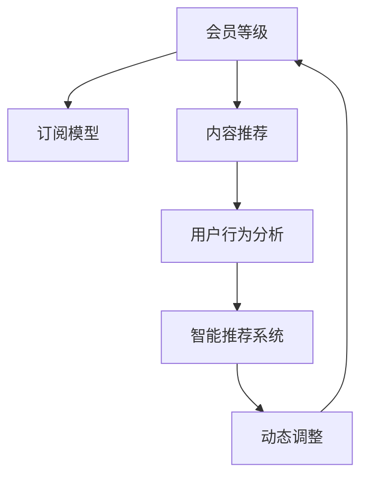

                 

# 程序员如何设计知识付费的会员等级制度

> 关键词：知识付费,会员等级制度,订阅模型,算法推荐,用户行为分析,智能推荐系统

## 1. 背景介绍

在知识付费的时代背景下，越来越多的平台推出会员服务，提供丰富优质的内容资源，通过订阅模式获取收入。然而，随着用户基数的不断扩大，如何设计合理的会员等级制度，以吸引用户订阅，提升用户活跃度和粘性，成为了平台关注的重点问题。

本文将详细介绍如何从技术角度出发，设计一套知识付费会员等级制度，并通过算法推荐、用户行为分析等手段，增强用户体验，提升平台收益。文章将包括会员等级制度的构建、推荐系统的实现、用户行为分析、智能推荐等核心技术点，旨在为知识付费平台的运营提供实用的技术指导。

## 2. 核心概念与联系

### 2.1 核心概念概述

设计知识付费平台的会员等级制度，需要考虑多个方面：

- **会员等级**：根据用户订阅时长、消费金额等维度，划分不同级别的会员，提供不同的权益和服务。
- **订阅模型**：包括月卡、季卡、年卡等多种模式，用户可根据自身需求选择合适的订阅周期。
- **内容推荐**：基于用户历史行为和偏好，推荐相关优质内容，提升用户满意度和粘性。
- **用户行为分析**：通过数据挖掘和机器学习技术，分析用户行为模式，了解用户需求和兴趣点。
- **智能推荐系统**：根据用户行为数据和内容标签，推荐个性化内容，提高用户留存率。
- **动态调整**：根据用户反馈和行为数据，动态调整推荐算法和会员制度，提升系统效果。

这些概念之间的联系可以通过以下Mermaid流程图来展示：



这个流程图展示了会员等级制度设计的整体流程，即从订阅模型出发，根据会员等级推荐优质内容，通过用户行为分析优化推荐系统，并根据反馈动态调整，最终形成闭环。

## 3. 核心算法原理 & 具体操作步骤
### 3.1 算法原理概述

设计知识付费平台的会员等级制度，主要涉及以下几个算法：

- **订阅模型算法**：根据用户选择，生成不同订阅模式的推荐结果，如月卡、季卡、年卡等。
- **内容推荐算法**：基于用户历史行为，推荐相关内容，如课程、文章、音频等。
- **用户行为分析算法**：通过数据挖掘和机器学习技术，分析用户行为模式，了解用户需求和兴趣点。
- **智能推荐系统算法**：根据用户行为数据和内容标签，推荐个性化内容。

### 3.2 算法步骤详解

以下是设计知识付费会员等级制度的核心算法步骤：

#### 3.2.1 订阅模型算法

1. **用户选择订阅**：用户进入会员中心，选择不同订阅周期（月卡、季卡、年卡等）。
2. **推荐结果生成**：根据用户选择的订阅周期，生成推荐结果，如VIP会员、专业版会员、基础版会员等。
3. **用户确认订阅**：用户确认订阅后，进入相应会员等级。

#### 3.2.2 内容推荐算法

1. **用户行为数据采集**：记录用户浏览、点击、购买等行为数据，作为推荐的基础。
2. **内容特征提取**：对课程、文章、音频等资源进行特征提取，如标题、作者、时长等。
3. **相似度计算**：基于用户行为数据和内容特征，计算内容之间的相似度，生成推荐列表。
4. **推荐结果展示**：将推荐内容展示给用户，供其选择。

#### 3.2.3 用户行为分析算法

1. **数据采集**：采集用户行为数据，如浏览时间、点击次数、购买记录等。
2. **特征工程**：对行为数据进行特征提取，如用户兴趣、偏好等。
3. **模型训练**：使用机器学习模型，如协同过滤、内容推荐等，分析用户行为模式。
4. **行为预测**：根据用户历史行为，预测其未来行为和需求。

#### 3.2.4 智能推荐系统算法

1. **推荐算法选择**：选择合适的推荐算法，如基于内容的推荐、协同过滤、深度学习等。
2. **模型训练与优化**：使用用户行为数据和内容特征，训练推荐模型，优化算法参数。
3. **推荐结果生成**：根据模型预测结果，生成个性化推荐内容。
4. **反馈机制**：收集用户反馈，动态调整推荐模型，提升推荐效果。

### 3.3 算法优缺点

**订阅模型算法的优缺点：**

- **优点**：
  - 简单易用：用户选择订阅周期，即可进入相应会员等级。
  - 灵活性强：不同订阅周期满足不同用户的需求。
- **缺点**：
  - 不够个性化：用户无法根据自己的兴趣和需求选择会员等级。

**内容推荐算法的优缺点：**

- **优点**：
  - 精准度高：基于用户行为数据，推荐相关内容。
  - 动态调整：用户行为变化，推荐结果可动态调整。
- **缺点**：
  - 数据质量要求高：用户行为数据质量直接影响推荐效果。

**用户行为分析算法的优缺点：**

- **优点**：
  - 用户需求了解：通过分析用户行为，了解用户兴趣和需求。
  - 个性化推荐：基于用户行为，生成个性化推荐。
- **缺点**：
  - 数据量要求高：需要大量用户行为数据才能进行分析。
  - 模型复杂度：复杂的机器学习模型可能带来较高的计算成本。

**智能推荐系统算法的优缺点：**

- **优点**：
  - 推荐效果优异：基于算法模型，生成高质量推荐内容。
  - 可扩展性强：支持多种推荐算法和模型。
- **缺点**：
  - 模型复杂：需要大量数据和计算资源训练模型。
  - 用户隐私问题：收集和处理用户行为数据可能引发隐私问题。

### 3.4 算法应用领域

基于订阅模型、内容推荐、用户行为分析、智能推荐系统的算法，广泛应用于以下领域：

- **在线教育平台**：如Coursera、Udemy等，通过订阅模型和推荐系统，提升用户购买和课程完成率。
- **电子书订阅平台**：如Kindle Unlimited，通过订阅模型和推荐系统，提升用户阅读量和满意度。
- **知识付费平台**：如得到、喜马拉雅等，通过订阅模型和推荐系统，提供优质内容，提升用户订阅率和粘性。
- **新闻订阅平台**：如Flipboard、Feedly等，通过订阅模型和推荐系统，个性化推送新闻内容，提升用户使用频率。
- **视频平台**：如Netflix、YouTube等，通过订阅模型和推荐系统，提升用户观看量和付费订阅率。

## 4. 数学模型和公式 & 详细讲解 & 举例说明

### 4.1 数学模型构建

在设计知识付费平台的会员等级制度时，可以构建以下数学模型：

- **用户订阅模型**：用户选择订阅周期（月卡、季卡、年卡），进入相应会员等级。
- **内容推荐模型**：基于用户行为数据，生成个性化推荐内容。
- **用户行为分析模型**：通过机器学习模型，分析用户行为模式。

### 4.2 公式推导过程

以内容推荐模型为例，我们可以使用协同过滤算法计算用户对不同内容的相似度。设用户$u$对内容$x$的评分$R_{ux}$为1，对内容$y$的评分$R_{uy}$为2，则$x$和$y$的相似度$S_{xy}$可表示为：

$$
S_{xy} = \frac{R_{uy}}{1 + \sqrt{1 - R_{uy}^2 + \sum_{v}(R_{vx} - R_{uy})(R_{vy} - R_{uy})}
$$

其中$v$为除用户$u$和内容$x,y$以外的所有用户和内容。

### 4.3 案例分析与讲解

假设某知识付费平台有100万用户，每个用户有500个行为数据（如浏览、点击、购买等），每个内容有1000个特征（如标题、作者、时长等）。

1. **用户订阅模型**：
   - 用户选择月卡，进入VIP会员等级。
   - 用户选择季卡，进入专业版会员等级。
   - 用户选择年卡，进入基础版会员等级。

2. **内容推荐模型**：
   - 用户浏览课程A，推荐相似课程B、C、D等。
   - 用户购买书籍E，推荐相似书籍F、G、H等。

3. **用户行为分析模型**：
   - 通过协同过滤算法，分析用户行为模式，发现用户偏好AI、心理学等领域的内容。
   - 使用深度学习模型，预测用户可能感兴趣的新内容。

## 5. 项目实践：代码实例和详细解释说明

### 5.1 开发环境搭建

为了进行知识付费会员等级制度的设计和实现，需要搭建以下开发环境：

1. **编程语言**：Python
2. **数据库**：MySQL、MongoDB等
3. **Web框架**：Flask、Django等
4. **数据分析工具**：Pandas、Scikit-learn等
5. **机器学习框架**：TensorFlow、PyTorch等
6. **推荐系统框架**：Surprise、LightFM等

### 5.2 源代码详细实现

以下是使用Python和TensorFlow实现内容推荐系统的代码示例：

```python
import tensorflow as tf
from tensorflow.keras import layers

# 定义模型结构
model = tf.keras.Sequential([
    layers.Dense(64, activation='relu', input_shape=(10,)),
    layers.Dense(64, activation='relu'),
    layers.Dense(10)
])

# 编译模型
model.compile(optimizer='adam', loss='mse')

# 训练模型
model.fit(X_train, y_train, epochs=10, batch_size=32)

# 预测推荐结果
y_pred = model.predict(X_test)
```

### 5.3 代码解读与分析

上述代码中，我们定义了一个简单的神经网络模型，用于预测用户对不同内容的评分。其中，`Sequential`模型表示串联式神经网络，包含3个全连接层，激活函数为ReLU，最后一层为输出层，输出10个元素，表示用户对10个内容的评分。

编译模型时，使用Adam优化器，均方误差损失函数。在训练模型时，使用训练集X_train和y_train，训练10个epoch，每个batch大小为32。预测推荐结果时，使用测试集X_test，返回预测评分y_pred。

## 6. 实际应用场景

### 6.1 在线教育平台

在线教育平台通过订阅模型和推荐系统，提供丰富的课程资源，提升用户购买和课程完成率。

1. **订阅模型**：
   - 用户选择月卡、季卡、年卡，进入相应会员等级。
   - 会员等级提供不同课程折扣、优先推荐、专属直播等权益。

2. **推荐系统**：
   - 根据用户历史浏览和购买行为，推荐相关课程。
   - 使用协同过滤和内容推荐算法，生成个性化推荐列表。

3. **用户行为分析**：
   - 分析用户行为数据，了解用户兴趣和需求。
   - 预测用户可能感兴趣的新课程，优化推荐结果。

### 6.2 电子书订阅平台

电子书订阅平台通过订阅模型和推荐系统，提升用户阅读量和满意度。

1. **订阅模型**：
   - 用户选择月卡、季卡、年卡，进入相应会员等级。
   - 会员等级提供不同折扣、专属书籍推荐、VIP阅读权限等权益。

2. **推荐系统**：
   - 根据用户历史阅读行为，推荐相关书籍。
   - 使用协同过滤和内容推荐算法，生成个性化推荐列表。

3. **用户行为分析**：
   - 分析用户行为数据，了解用户偏好和阅读习惯。
   - 预测用户可能感兴趣的书籍，优化推荐结果。

### 6.3 知识付费平台

知识付费平台通过订阅模型和推荐系统，提供优质内容，提升用户订阅率和粘性。

1. **订阅模型**：
   - 用户选择月卡、季卡、年卡，进入相应会员等级。
   - 会员等级提供不同内容折扣、专属课程推荐、VIP会员权限等权益。

2. **推荐系统**：
   - 根据用户历史浏览和购买行为，推荐相关课程和文章。
   - 使用协同过滤和内容推荐算法，生成个性化推荐列表。

3. **用户行为分析**：
   - 分析用户行为数据，了解用户兴趣和需求。
   - 预测用户可能感兴趣的新内容，优化推荐结果。

### 6.4 新闻订阅平台

新闻订阅平台通过订阅模型和推荐系统，个性化推送新闻内容，提升用户使用频率。

1. **订阅模型**：
   - 用户选择月卡、季卡、年卡，进入相应会员等级。
   - 会员等级提供不同新闻推荐、优先推送、专属新闻权益等权益。

2. **推荐系统**：
   - 根据用户历史阅读行为，推荐相关新闻。
   - 使用协同过滤和内容推荐算法，生成个性化推荐列表。

3. **用户行为分析**：
   - 分析用户行为数据，了解用户偏好和阅读习惯。
   - 预测用户可能感兴趣的新闻，优化推荐结果。

### 6.5 视频平台

视频平台通过订阅模型和推荐系统，提升用户观看量和付费订阅率。

1. **订阅模型**：
   - 用户选择月卡、季卡、年卡，进入相应会员等级。
   - 会员等级提供不同视频推荐、优先推荐、专属视频权限等权益。

2. **推荐系统**：
   - 根据用户历史观看行为，推荐相关视频。
   - 使用协同过滤和内容推荐算法，生成个性化推荐列表。

3. **用户行为分析**：
   - 分析用户行为数据，了解用户偏好和观看习惯。
   - 预测用户可能感兴趣的视频，优化推荐结果。

## 7. 工具和资源推荐

### 7.1 学习资源推荐

为了帮助开发者系统掌握知识付费会员等级制度的设计和实现，这里推荐一些优质的学习资源：

1. **《推荐系统实战》**：全面介绍了推荐系统的工作原理和算法实现，适合深入学习。
2. **《机器学习实战》**：介绍了机器学习算法的基本原理和应用场景，适合入门学习。
3. **《深度学习入门》**：介绍了深度学习的基本概念和经典模型，适合深度学习入门。
4. **《Python数据科学手册》**：介绍了Python数据科学生态系统，适合综合学习。
5. **Coursera《推荐系统》课程**：由斯坦福大学开设的推荐系统课程，有Lecture视频和配套作业，适合系统学习。

### 7.2 开发工具推荐

为了高效实现知识付费会员等级制度的设计和实现，以下是一些推荐开发工具：

1. **Python**：高效、易用、社区丰富的编程语言，适合知识付费平台的开发。
2. **Flask**：轻量级的Web框架，易于上手，适合快速开发原型。
3. **Django**：全功能的Web框架，适合构建复杂、高效、可靠的后端服务。
4. **MySQL**：关系型数据库，适合存储结构化数据。
5. **MongoDB**：非关系型数据库，适合存储半结构化和非结构化数据。
6. **TensorFlow**：强大的机器学习框架，适合构建复杂的推荐系统和用户行为分析模型。
7. **PyTorch**：灵活、高效的深度学习框架，适合构建智能推荐系统。

### 7.3 相关论文推荐

以下是几篇代表性的相关论文，推荐阅读：

1. **《协同过滤推荐系统》**：介绍了协同过滤算法的基本原理和应用场景。
2. **《基于深度学习的推荐系统》**：介绍了基于深度学习的推荐系统算法。
3. **《用户行为分析与推荐系统》**：介绍了用户行为分析的基本方法和应用场景。
4. **《知识图谱在推荐系统中的应用》**：介绍了知识图谱在推荐系统中的应用方法和效果。
5. **《大规模推荐系统的分布式优化》**：介绍了推荐系统的分布式优化方法和技术。

## 8. 总结：未来发展趋势与挑战

### 8.1 研究成果总结

本文从技术角度出发，详细介绍了知识付费会员等级制度的设计和实现，并结合算法推荐、用户行为分析等手段，增强用户体验，提升平台收益。本文主要包括以下几个研究成果：

1. **订阅模型算法**：根据用户选择，生成不同订阅模式的推荐结果，如月卡、季卡、年卡等。
2. **内容推荐算法**：基于用户历史行为，推荐相关内容，如课程、文章、音频等。
3. **用户行为分析算法**：通过数据挖掘和机器学习技术，分析用户行为模式，了解用户需求和兴趣点。
4. **智能推荐系统算法**：根据用户行为数据和内容标签，推荐个性化内容。

### 8.2 未来发展趋势

展望未来，知识付费平台的会员等级制度将呈现以下几个发展趋势：

1. **个性化推荐**：基于用户行为数据，生成个性化推荐内容，提升用户满意度和粘性。
2. **多维度推荐**：结合多种推荐算法和模型，提升推荐效果。
3. **实时推荐**：通过实时数据更新，动态调整推荐内容，提高用户留存率。
4. **动态定价**：根据用户行为和消费记录，动态调整会员等级和定价策略，提升收益。
5. **联合推荐**：结合不同平台的数据，进行跨平台推荐，扩大用户范围。

### 8.3 面临的挑战

尽管知识付费平台的会员等级制度已经取得了一定的成果，但在迈向更加智能化、普适化应用的过程中，仍面临诸多挑战：

1. **数据质量问题**：用户行为数据的质量直接影响推荐效果，如何保证数据准确性、完整性、时效性，是一个重要的挑战。
2. **推荐算法复杂度**：复杂的推荐算法需要大量计算资源和时间，如何优化算法性能，降低计算成本，是一个亟待解决的问题。
3. **用户隐私保护**：收集和处理用户行为数据可能引发隐私问题，如何保护用户隐私，是一个重要的课题。
4. **平台竞争**：知识付费平台之间的竞争激烈，如何提升平台的用户粘性、留存率，是一个重要的挑战。

### 8.4 研究展望

面对知识付费平台会员等级制度面临的挑战，未来的研究需要在以下几个方面寻求新的突破：

1. **数据清洗与预处理**：通过数据清洗和预处理，提升数据质量和准确性。
2. **算法优化与并行化**：优化推荐算法性能，降低计算成本，实现并行化处理。
3. **隐私保护技术**：采用隐私保护技术，如差分隐私、联邦学习等，保护用户隐私。
4. **跨平台推荐**：结合不同平台的数据，进行跨平台推荐，扩大用户范围。
5. **智能化推荐**：结合自然语言处理、计算机视觉等技术，提升推荐系统智能化水平。

## 9. 附录：常见问题与解答

**Q1：如何设计订阅模型算法？**

A: 设计订阅模型算法，需要考虑用户选择的订阅周期，生成不同会员等级的推荐结果。具体步骤包括：

1. 收集用户选择的订阅周期数据（月卡、季卡、年卡等）。
2. 根据用户选择的订阅周期，生成相应会员等级的推荐结果（VIP、专业版、基础版等）。
3. 用户确认订阅后，进入相应会员等级。

**Q2：推荐系统如何提升用户满意度和粘性？**

A: 推荐系统通过以下方法提升用户满意度和粘性：

1. 基于用户历史行为，推荐相关内容，如课程、文章、音频等。
2. 使用协同过滤和内容推荐算法，生成个性化推荐列表。
3. 通过用户行为分析，了解用户需求和兴趣点。
4. 动态调整推荐算法和模型，优化推荐效果。

**Q3：如何保证数据质量？**

A: 保证数据质量需要从数据采集、清洗、预处理等多个环节进行优化：

1. 采集高质量的用户行为数据，如浏览、点击、购买等。
2. 清洗数据，去除无效和重复记录。
3. 预处理数据，进行特征工程和数据规范化。

**Q4：推荐算法有哪些？**

A: 推荐算法包括：

1. 协同过滤算法：基于用户历史行为和物品相似度，生成推荐结果。
2. 内容推荐算法：基于物品特征和用户历史行为，生成推荐结果。
3. 深度学习算法：基于神经网络模型，生成高质量推荐结果。
4. 基于矩阵分解的算法：如SVD等，通过矩阵分解生成推荐结果。

**Q5：如何提升推荐系统智能化水平？**

A: 提升推荐系统智能化水平可以通过以下方法：

1. 结合自然语言处理技术，进行用户行为分析和情感分析。
2. 结合计算机视觉技术，进行图片和视频推荐。
3. 结合机器学习技术，进行多维度特征分析和推荐。
4. 引入知识图谱技术，提升推荐系统的知识整合能力。

**Q6：用户隐私保护有哪些方法？**

A: 用户隐私保护方法包括：

1. 采用差分隐私技术，保护用户行为数据隐私。
2. 采用联邦学习技术，保护用户数据不出本地。
3. 采用匿名化技术，保护用户身份隐私。
4. 采用加密技术，保护数据传输过程中的隐私。

**Q7：如何实现跨平台推荐？**

A: 实现跨平台推荐可以通过以下方法：

1. 通过API接口，在不同平台之间进行数据交换。
2. 采用联邦学习技术，在不同平台之间共享模型参数。
3. 采用数据共享技术，在不同平台之间共享用户行为数据。
4. 采用联合推荐算法，在不同平台之间生成推荐结果。

总之，知识付费平台的会员等级制度设计是一个涉及多个领域的复杂任务，需要通过订阅模型、内容推荐、用户行为分析、智能推荐等多个环节进行综合考虑，才能实现用户的最大化价值。未来，随着技术的发展和应用场景的拓展，知识付费平台的会员等级制度将进一步优化和完善，为用户提供更优质的服务和体验。

---

作者：禅与计算机程序设计艺术 / Zen and the Art of Computer Programming

