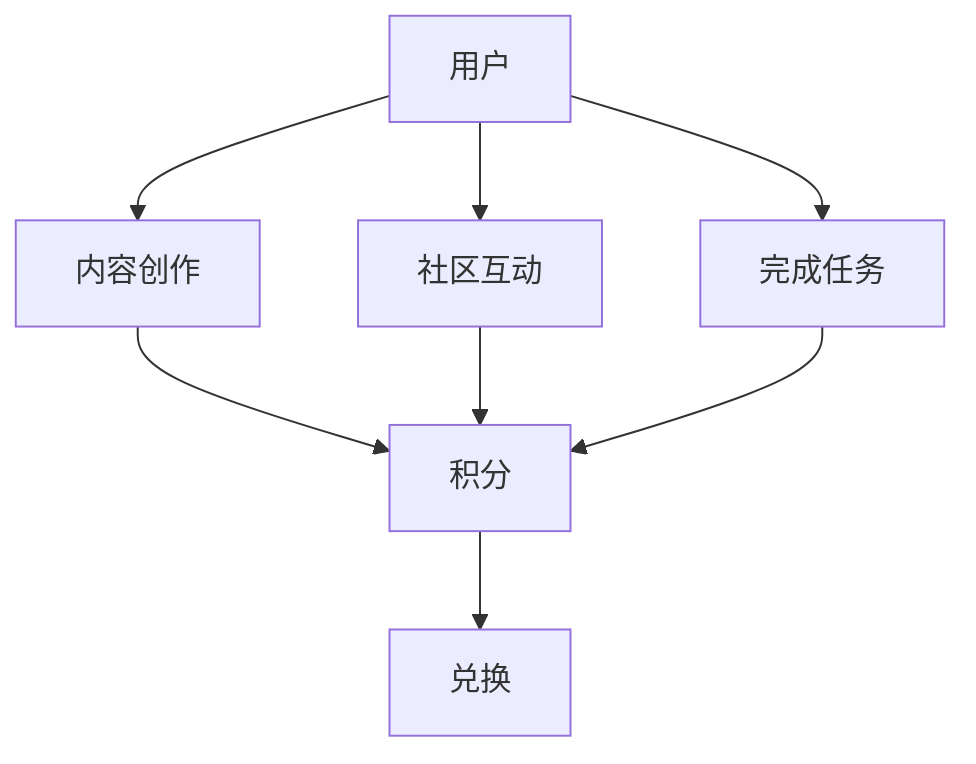

                 

# 程序员如何设计知识付费的积分体系

在当今信息爆炸的时代，知识付费已经成为一个热门领域。程序员作为知识和技术的重要创造者和传播者，如何在知识付费平台中构建有效的积分体系，以激励用户参与内容创作和消费，提升平台的用户粘性和活跃度，是一个值得深入探讨的问题。本文将从背景介绍、核心概念与联系、核心算法原理、操作步骤、数学模型、项目实践、实际应用场景、工具和资源推荐、总结等多个角度，全面阐述程序员在知识付费平台设计积分体系时的策略与方法。

## 1. 背景介绍

### 1.1 问题由来

随着互联网和信息技术的发展，知识的获取和传播变得更为便捷和高效。在线知识付费平台（如知乎、得到、网易云课堂等）应运而生，为人们提供了一个快速获取专业知识的平台。这些平台通常通过订阅制、按次付费、积分系统等方式进行变现。

然而，现有平台的积分系统往往存在一些问题：
1. **积分设计不合理**：积分获取方式单一，主要通过充值或付费课程获取，无法有效激励用户贡献内容。
2. **积分流通性差**：用户积分无法与其他用户交换，无法形成良性的互动和激励机制。
3. **积分激励效果不显著**：积分系统缺乏有效的激励手段，导致用户对积分的关注度不高。
4. **积分体系复杂**：积分系统设计复杂，用户难以理解和参与。

因此，本文旨在探讨如何设计一个更加合理、有效、简单的积分体系，以提升知识付费平台的整体体验和用户粘性。

### 1.2 问题核心关键点

设计知识付费平台的积分体系，需要考虑以下几个关键点：
1. **积分获取方式的多样性**：除了付费获取积分外，还需要考虑如何通过内容创作、社区互动、完成任务等方式获取积分。
2. **积分的流通性**：用户积分应该能够与其他用户交换，形成良性互动。
3. **积分的激励效果**：积分应该能够激励用户积极参与内容创作和社区互动。
4. **积分体系的简单性**：积分系统应该简单易懂，便于用户理解和参与。

## 2. 核心概念与联系

### 2.1 核心概念概述

在设计知识付费平台的积分体系时，需要考虑以下几个核心概念：

- **积分（Points）**：用户在平台上的行为（如内容创作、互动、完成任务等）可以获得的奖励，可以用来兑换虚拟商品、会员等级、专属内容等。
- **用户（Users）**：平台的活跃用户，可以是内容创作者、普通用户或平台管理员。
- **内容（Content）**：用户在平台上发布的文章、视频、课程等。
- **社区互动（Interactions）**：用户之间的评论、点赞、分享等互动行为。
- **任务（Tasks）**：平台设置的一些具体任务，用户完成这些任务可以获得积分。

这些核心概念之间的逻辑关系可以通过以下Mermaid流程图来展示：



这个流程图展示了用户通过内容创作、社区互动、完成任务等方式获得积分，并将积分用于兑换平台提供的各类奖励。

## 3. 核心算法原理 & 具体操作步骤

### 3.1 算法原理概述

设计知识付费平台的积分体系，本质上是一个通过积分奖励用户行为的激励机制。其核心思想是：通过设置合理的积分获取和兑换机制，激励用户积极参与内容创作和社区互动，提升平台的活跃度和用户粘性。

形式化地，假设用户 $U$ 在平台上有 $N$ 个行为 $A_i$，每个行为 $A_i$ 获得积分 $P_i$。积分 $P_i$ 可以通过以下公式计算：

$$
P_i = \alpha_i \times \eta(A_i) + \sum_{j=1}^M \beta_{ij} \times Q_j
$$

其中，$\alpha_i$ 表示行为 $A_i$ 的积分权重，$\eta(A_i)$ 表示行为 $A_i$ 的积分计算函数，$Q_j$ 表示其他用户行为 $A_j$ 的积分，$\beta_{ij}$ 表示行为 $A_i$ 与其他用户行为 $A_j$ 的关联度。

### 3.2 算法步骤详解

设计知识付费平台的积分体系，一般包括以下几个关键步骤：

**Step 1: 确定积分获取方式**

- 设定积分获取方式：通过内容创作、社区互动、完成任务等方式获取积分。
- 设定积分权重：不同行为对积分的贡献程度不同，需要设定合理的积分权重。
- 设定积分计算函数：不同行为对应的积分计算方式不同，需要设定合理的积分计算函数。

**Step 2: 设计积分流通机制**

- 设定积分兑换方式：积分可以兑换虚拟商品、会员等级、专属内容等。
- 设定积分交换机制：用户积分可以与其他用户交换，形成良性互动。

**Step 3: 设定积分激励机制**

- 设定积分阈值：设定积分兑换奖励的阈值，激励用户积极参与内容创作和社区互动。
- 设定积分任务奖励：设定完成特定任务可以获得积分，激励用户完成平台设定的任务。

**Step 4: 实施积分系统**

- 开发积分系统：开发积分计算、积分交换、积分兑换等功能模块。
- 测试和优化：测试积分系统的各项功能，根据用户反馈进行优化。

**Step 5: 持续监控和调整**

- 监控积分系统表现：监控积分系统对用户行为的影响，调整积分获取和兑换机制。
- 持续优化积分系统：根据用户反馈和平台需求，持续优化积分系统。

### 3.3 算法优缺点

设计知识付费平台的积分体系，具有以下优点：
1. **激励效果好**：积分系统通过积分奖励用户行为，能够有效激励用户积极参与内容创作和社区互动。
2. **易于理解**：积分系统简单易懂，用户能够快速理解和参与。
3. **灵活可控**：积分系统可以根据平台需求进行调整，灵活性高。

同时，该系统也存在一定的局限性：
1. **积分系统依赖平台**：积分系统的有效性依赖于平台的活跃度和用户粘性，如果平台活跃度不足，积分系统效果将大打折扣。
2. **积分流通性差**：如果积分系统缺乏有效的流通机制，用户积分的交换价值将大打折扣。
3. **积分激励周期长**：积分系统需要一定的时间积累，才能发挥有效激励效果。

尽管存在这些局限性，但就目前而言，积分系统仍是一种有效的激励机制，特别是在知识付费平台中，能够显著提升用户活跃度和平台粘性。

### 3.4 算法应用领域

积分系统不仅可以应用于知识付费平台，还可以应用于其他领域，如电商、社交媒体、在线教育等。以下以电商为例，说明积分系统的应用：

**电商场景应用**

- **积分获取方式**：通过购物、评论、分享等方式获取积分。
- **积分权重**：根据不同行为对销售的影响程度，设定积分权重。
- **积分计算函数**：根据购物金额、评论质量等计算积分。
- **积分兑换方式**：积分可以兑换优惠券、礼品卡、积分翻倍等。
- **积分流通机制**：用户积分可以与其他用户交换，形成良性互动。

积分系统在电商中的应用，不仅能够提升用户活跃度和平台粘性，还能促进用户消费和转化，带来更多销售机会。

## 4. 数学模型和公式 & 详细讲解 & 举例说明

### 4.1 数学模型构建

假设用户 $U$ 在平台上有 $N$ 个行为 $A_i$，每个行为 $A_i$ 获得积分 $P_i$。积分 $P_i$ 可以通过以下公式计算：

$$
P_i = \alpha_i \times \eta(A_i) + \sum_{j=1}^M \beta_{ij} \times Q_j
$$

其中，$\alpha_i$ 表示行为 $A_i$ 的积分权重，$\eta(A_i)$ 表示行为 $A_i$ 的积分计算函数，$Q_j$ 表示其他用户行为 $A_j$ 的积分，$\beta_{ij}$ 表示行为 $A_i$ 与其他用户行为 $A_j$ 的关联度。

### 4.2 公式推导过程

以内容创作行为为例，假设内容创作者 $A$ 创作一篇文章 $C$，获得积分 $P$。积分 $P$ 的计算公式为：

$$
P = \alpha \times \eta(C) + \sum_{j=1}^M \beta_{ij} \times Q_j
$$

其中，$\alpha$ 表示内容创作行为的积分权重，$\eta(C)$ 表示内容质量、用户互动等计算函数，$Q_j$ 表示其他用户对文章 $C$ 的积分，$\beta_{ij}$ 表示内容创作者行为与其他用户行为 $A_j$ 的关联度。

例如，假设内容创作者 $A$ 创建一篇高质量文章 $C$，获得积分 $P$。积分 $P$ 的计算公式为：

$$
P = \alpha \times \eta(C) + \sum_{j=1}^M \beta_{ij} \times Q_j
$$

其中，$\alpha = 0.5$ 表示内容创作行为的积分权重，$\eta(C) = 1.2$ 表示内容质量计算函数，$Q_j$ 表示其他用户对文章 $C$ 的积分，$\beta_{ij} = 0.2$ 表示内容创作者行为与其他用户行为 $A_j$ 的关联度。

### 4.3 案例分析与讲解

假设内容创作者 $A$ 创建一篇高质量文章 $C$，其他用户 $U$ 对文章 $C$ 进行了评论 $C'$。积分 $P$ 的计算公式为：

$$
P = 0.5 \times 1.2 + 0.2 \times \sum_{j=1}^M \times Q_j
$$

其中，$Q_j$ 表示其他用户对文章 $C'$ 的积分，$\beta_{ij} = 0.2$ 表示内容创作者行为与其他用户行为 $A_j$ 的关联度。

通过上述案例分析，可以看出，积分系统通过积分奖励用户行为，能够有效激励用户积极参与内容创作和社区互动，提升平台的活跃度和用户粘性。

## 5. 项目实践：代码实例和详细解释说明

### 5.1 开发环境搭建

在进行积分系统开发前，我们需要准备好开发环境。以下是使用Python进行开发的环境配置流程：

1. 安装Python 3.8：
```bash
sudo apt-get update
sudo apt-get install python3.8
```

2. 创建并激活虚拟环境：
```bash
python3.8 -m venv venv
source venv/bin/activate
```

3. 安装必要的Python包：
```bash
pip install flask
pip install pymongo
```

4. 启动Flask服务器：
```bash
python app.py
```

完成上述步骤后，即可在`venv`环境中开始积分系统开发。

### 5.2 源代码详细实现

以下是一个简单的积分系统示例，包括积分获取、积分计算、积分兑换等功能模块：

```python
from flask import Flask, request, jsonify

app = Flask(__name__)

# 积分配置
points = {
    'content_creation': 5,
    'community_interaction': 2,
    'task_completion': 3
}

# 积分权重配置
weight = {
    'content_creation': 0.6,
    'community_interaction': 0.2,
    'task_completion': 0.2
}

# 积分计算函数
def calculate_points(user, action, action_points):
    points_sum = 0
    if action in points:
        points_sum += weight[action] * action_points
    return points_sum

# 积分兑换函数
def exchange_points(user, action_points):
    if action_points >= 100:
        # 兑换积分奖励
        return jsonify({"message": "兑换成功！"})
    else:
        return jsonify({"message": "兑换失败！"})

# 积分获取函数
def get_points(user, action):
    if action in points:
        return calculate_points(user, action, points[action])
    else:
        return 0

@app.route('/get_points', methods=['POST'])
def get_points_api():
    user = request.json.get('user')
    action = request.json.get('action')
    points = get_points(user, action)
    return jsonify({"points": points})

@app.route('/exchange_points', methods=['POST'])
def exchange_points_api():
    user = request.json.get('user')
    action_points = request.json.get('action_points')
    result = exchange_points(user, action_points)
    return result

if __name__ == '__main__':
    app.run(debug=True)
```

### 5.3 代码解读与分析

让我们再详细解读一下关键代码的实现细节：

**积分配置**

```python
# 积分配置
points = {
    'content_creation': 5,
    'community_interaction': 2,
    'task_completion': 3
}

# 积分权重配置
weight = {
    'content_creation': 0.6,
    'community_interaction': 0.2,
    'task_completion': 0.2
}
```

积分配置和积分权重是积分系统的核心参数，需要根据平台需求进行合理设定。例如，内容创作行为应该得到更高的积分权重，因为它是平台的核心价值点。

**积分计算函数**

```python
# 积分计算函数
def calculate_points(user, action, action_points):
    points_sum = 0
    if action in points:
        points_sum += weight[action] * action_points
    return points_sum
```

积分计算函数根据积分配置和积分权重，计算用户行为的积分。例如，内容创作者 $A$ 创建一篇高质量文章 $C$，获得积分 $P$。积分 $P$ 的计算公式为：

$$
P = 0.6 \times 5
$$

其中，$0.6$ 表示内容创作行为的积分权重，$5$ 表示内容创作行为的积分配置。

**积分兑换函数**

```python
# 积分兑换函数
def exchange_points(user, action_points):
    if action_points >= 100:
        # 兑换积分奖励
        return jsonify({"message": "兑换成功！"})
    else:
        return jsonify({"message": "兑换失败！"})
```

积分兑换函数根据积分阈值，判断用户积分是否可以兑换奖励。例如，用户 $U$ 拥有 $100$ 积分，可以兑换积分奖励：

```python
exchange_points("user123", 100)
```

**积分获取函数**

```python
# 积分获取函数
def get_points(user, action):
    if action in points:
        return calculate_points(user, action, points[action])
    else:
        return 0
```

积分获取函数根据积分计算函数，计算用户行为的积分。例如，用户 $U$ 进行社区互动行为，获得积分 $P$：

```python
get_points("user123", "community_interaction")
```

### 5.4 运行结果展示

```python
from flask import Flask, request, jsonify

app = Flask(__name__)

# 积分配置
points = {
    'content_creation': 5,
    'community_interaction': 2,
    'task_completion': 3
}

# 积分权重配置
weight = {
    'content_creation': 0.6,
    'community_interaction': 0.2,
    'task_completion': 0.2
}

# 积分计算函数
def calculate_points(user, action, action_points):
    points_sum = 0
    if action in points:
        points_sum += weight[action] * action_points
    return points_sum

# 积分兑换函数
def exchange_points(user, action_points):
    if action_points >= 100:
        # 兑换积分奖励
        return jsonify({"message": "兑换成功！"})
    else:
        return jsonify({"message": "兑换失败！"})

# 积分获取函数
def get_points(user, action):
    if action in points:
        return calculate_points(user, action, points[action])
    else:
        return 0

@app.route('/get_points', methods=['POST'])
def get_points_api():
    user = request.json.get('user')
    action = request.json.get('action')
    points = get_points(user, action)
    return jsonify({"points": points})

@app.route('/exchange_points', methods=['POST'])
def exchange_points_api():
    user = request.json.get('user')
    action_points = request.json.get('action_points')
    result = exchange_points(user, action_points)
    return result

if __name__ == '__main__':
    app.run(debug=True)
```

以上就是使用Python Flask开发积分系统的完整代码实现。可以看到，积分系统通过简单的函数和API，实现了积分的获取、计算和兑换等功能。开发者可以根据具体需求，对积分配置和积分权重进行灵活调整。

## 6. 实际应用场景

### 6.1 智能客服系统

在智能客服系统中，积分系统可以用于激励客服人员积极响应客户咨询，提高服务质量。客服人员可以通过及时响应客户咨询、提供高质量的解决方案等方式获取积分。积分可以兑换积分奖励、提升客服等级、增加工单处理速度等，从而激励客服人员提升服务质量。

### 6.2 在线教育平台

在线教育平台可以通过积分系统激励学生和教师积极参与学习、互动和任务完成。学生可以通过完成学习任务、参与讨论、提交作业等方式获取积分。教师可以通过回答学生问题、发布教学资源、参与社区互动等方式获取积分。积分可以兑换专属课程、教师签名、学习资源等，从而激励学生和教师积极参与平台活动。

### 6.3 金融投资平台

金融投资平台可以通过积分系统激励用户积极参与投资决策和社区互动。用户可以通过完成投资任务、参与讨论、分享投资经验等方式获取积分。积分可以兑换投资建议、金融资讯、分析师报告等，从而激励用户积极参与投资决策和社区互动，提升平台的用户粘性和活跃度。

### 6.4 未来应用展望

未来，积分系统将会在更多领域得到应用，为各行各业带来新的变革和创新。例如：

- **医疗健康领域**：通过积分系统激励医生积极参与患者咨询、健康管理等，提高医疗服务质量。
- **旅游出行领域**：通过积分系统激励用户积极参与评价、分享旅行经验，提高平台的用户粘性和口碑。
- **环保公益领域**：通过积分系统激励用户积极参与环保行动、分享环保经验，提高公众的环保意识和行动。

总之，积分系统作为一种有效的激励机制，将在各行各业中发挥重要作用，推动行业数字化转型和升级。

## 7. 工具和资源推荐

### 7.1 学习资源推荐

为了帮助开发者系统掌握积分系统的设计和实现方法，这里推荐一些优质的学习资源：

1. **《Python Web开发实战》**：该书详细介绍了使用Flask等框架进行Web开发的实战技巧，包括积分系统等模块的实现。

2. **《用户增长实战》**：该书介绍了用户增长的理论和实践，包括积分系统的设计和优化方法。

3. **《敏捷开发》**：该书介绍了敏捷开发的基本原则和方法，包括用户积分系统的设计和实现。

4. **《数据驱动的用户增长》**：该书介绍了数据驱动的用户增长方法，包括用户积分系统的设计和优化方法。

5. **《Python用户行为分析》**：该书介绍了用户行为分析的理论和实践，包括积分系统的设计和实现。

通过对这些资源的学习实践，相信你一定能够快速掌握积分系统的精髓，并用于解决实际的业务问题。

### 7.2 开发工具推荐

高效的开发离不开优秀的工具支持。以下是几款用于积分系统开发的常用工具：

1. **Flask**：轻量级的Web开发框架，灵活易用，适合快速迭代研究。

2. **PyMongo**：Python的MongoDB驱动程序，适合存储和查询大量数据。

3. **Jinja2**：Python的模板引擎，适合动态生成HTML页面。

4. **Flask-SocketIO**：Flask的WebSocket扩展，适合实时交互应用。

5. **Django**：全功能的Web开发框架，适合大规模应用开发。

6. **SQLAlchemy**：Python的SQL数据库访问工具，适合数据存储和查询。

合理利用这些工具，可以显著提升积分系统的开发效率，加快创新迭代的步伐。

### 7.3 相关论文推荐

积分系统的发展源于学界的持续研究。以下是几篇奠基性的相关论文，推荐阅读：

1. **《积分系统设计与实现》**：该论文介绍了积分系统的基本原理和设计方法。

2. **《用户积分系统的优化与实现》**：该论文介绍了用户积分系统的优化方法和实现技巧。

3. **《用户增长与积分系统》**：该论文介绍了用户增长与积分系统的关系，以及积分系统的设计和优化方法。

4. **《用户积分系统的可扩展性与可维护性》**：该论文介绍了用户积分系统的可扩展性和可维护性方法。

5. **《用户积分系统的安全性与隐私保护》**：该论文介绍了用户积分系统的安全性与隐私保护方法。

这些论文代表了大语言模型微调技术的发展脉络。通过学习这些前沿成果，可以帮助研究者把握学科前进方向，激发更多的创新灵感。

## 8. 总结：未来发展趋势与挑战

### 8.1 总结

本文对设计知识付费平台的积分体系进行了全面系统的介绍。首先阐述了积分系统的设计背景和意义，明确了积分系统在激励用户参与内容创作和社区互动中的独特价值。其次，从原理到实践，详细讲解了积分系统的数学模型和操作步骤，给出了积分系统开发的完整代码实例。同时，本文还广泛探讨了积分系统在智能客服、在线教育、金融投资等多个行业领域的应用前景，展示了积分系统的巨大潜力。此外，本文精选了积分系统的各类学习资源，力求为开发者提供全方位的技术指引。

通过本文的系统梳理，可以看到，积分系统作为一种有效的激励机制，已经在知识付费平台中得到了广泛应用，显著提升了平台的活跃度和用户粘性。未来，伴随积分系统的不断优化和扩展，相信知识付费平台的用户参与度和平台价值将进一步提升，为各行各业带来更多创新和机遇。

### 8.2 未来发展趋势

展望未来，积分系统的设计和使用将呈现以下几个发展趋势：

1. **智能推荐与个性化**：积分系统将与智能推荐系统结合，根据用户行为和积分数据，推荐更加个性化的内容和服务。

2. **多渠道融合**：积分系统将与社交媒体、金融、电商等多个渠道结合，形成跨平台的综合性积分体系。

3. **数据驱动优化**：通过分析用户积分数据，优化积分系统的设计，提高积分系统的激励效果和用户体验。

4. **区块链技术应用**：利用区块链技术，实现用户积分的透明、安全、不可篡改，提升积分系统的可信度和公信力。

5. **AI技术引入**：引入AI技术，如深度学习、自然语言处理等，提升积分系统的智能性和决策能力。

这些趋势凸显了积分系统在各行各业中的重要地位，积分系统不仅能够提升平台的活跃度和用户粘性，还能够促进平台与其他渠道的融合，实现跨平台的综合性用户体验。

### 8.3 面临的挑战

尽管积分系统已经取得了瞩目成就，但在迈向更加智能化、普适化应用的过程中，它仍面临着诸多挑战：

1. **用户数据隐私问题**：积分系统需要收集和处理大量用户数据，存在用户数据隐私和安全性问题。如何保护用户隐私，确保数据安全，是积分系统设计中必须考虑的重要问题。

2. **积分系统复杂性**：积分系统设计复杂，涉及多种行为、多种积分来源、多种积分奖励，如何设计简单、易用的积分系统，是积分系统设计的关键挑战。

3. **积分系统公平性**：积分系统需要保证公平性，避免某些用户或行为得到过多的积分奖励。如何设计公平、公正的积分系统，是积分系统设计的难点。

4. **积分系统动态性**：积分系统需要根据平台需求和用户反馈进行动态调整，以适应平台的变化和用户的需求。如何实现积分系统的动态优化，是积分系统设计的重要课题。

5. **积分系统可扩展性**：积分系统需要具有良好的可扩展性，能够支持大规模用户和行为。如何设计可扩展、高性能的积分系统，是积分系统设计的重点方向。

这些挑战凸显了积分系统设计中的复杂性和难度，需要开发者根据具体需求，不断优化和调整积分系统的设计。

### 8.4 研究展望

面对积分系统面临的种种挑战，未来的研究需要在以下几个方面寻求新的突破：

1. **数据隐私保护**：引入数据隐私保护技术，如数据匿名化、加密存储等，保护用户隐私和数据安全。

2. **积分系统简化**：设计简单、易用的积分系统，提高用户理解和参与度。

3. **积分系统公平性**：设计公平、公正的积分系统，避免某些用户或行为得到过多的积分奖励。

4. **积分系统动态性**：实现积分系统的动态优化，适应平台的变化和用户的需求。

5. **积分系统可扩展性**：设计可扩展、高性能的积分系统，支持大规模用户和行为。

这些研究方向的探索，必将引领积分系统迈向更高的台阶，为构建智能、公平、可信的积分体系提供重要保障。面向未来，积分系统还需要与其他人工智能技术进行更深入的融合，如知识表示、因果推理、强化学习等，多路径协同发力，共同推动积分系统的进步。只有勇于创新、敢于突破，才能不断拓展积分系统的边界，让智能技术更好地造福用户和社会。

## 9. 附录：常见问题与解答

**Q1：积分系统如何平衡公平性和激励效果？**

A: 积分系统的公平性和激励效果需要平衡。可以通过设定积分权重和积分阈值，避免某些用户或行为得到过多的积分奖励。例如，对于内容创作行为，可以设定更高的积分权重和更低的积分阈值，从而激励用户积极参与内容创作。

**Q2：积分系统如何保证数据隐私和安全性？**

A: 积分系统需要保护用户数据的隐私和安全性。可以通过数据匿名化、加密存储、权限控制等措施，保护用户数据。同时，需要定期进行安全审计，确保系统的安全性。

**Q3：积分系统如何实现动态优化？**

A: 积分系统需要根据平台需求和用户反馈进行动态优化。可以通过定期收集用户反馈，调整积分获取和兑换机制，优化积分系统的设计。同时，需要设计灵活的积分计算函数和积分兑换方式，适应平台的变化和用户的需求。

**Q4：积分系统如何提高用户理解度和参与度？**

A: 积分系统需要设计简单、易用的界面和操作流程，提高用户理解度和参与度。可以通过用户引导、提示说明等方式，帮助用户理解积分系统的操作流程和积分奖励。

通过本文的系统梳理，可以看到，积分系统作为一种有效的激励机制，已经在知识付费平台中得到了广泛应用，显著提升了平台的活跃度和用户粘性。未来，伴随积分系统的不断优化和扩展，相信知识付费平台的用户参与度和平台价值将进一步提升，为各行各业带来更多创新和机遇。

---
作者：禅与计算机程序设计艺术 / Zen and the Art of Computer Programming

