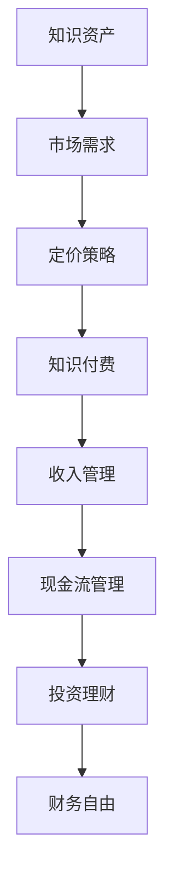

                 

# 程序员如何进行知识付费的财务规划

> 关键词：知识付费, 财务管理, 收入规划, 成本控制, 投资理财

## 1. 背景介绍

### 1.1 问题由来
随着互联网的发展和知识经济的兴起，知识付费成为越来越多人的选择。对于程序员这一群体，除了薪资收入，通过提供编程技能、编写教程、技术咨询等方式进行知识付费也逐渐成为主流。然而，如何进行有效的财务规划，将知识和技能转化为实实在在的收入，并实现财务自由，成为了一个值得探讨的问题。

### 1.2 问题核心关键点
知识付费的财务规划主要关注以下几个关键点：
- 如何评估自身的知识资产和市场需求，确定定价策略。
- 如何有效管理收入和支出，优化现金流。
- 如何进行投资理财，实现财务增长和长期稳定。

## 2. 核心概念与联系

### 2.1 核心概念概述

为更好地理解知识付费的财务规划方法，本节将介绍几个密切相关的核心概念：

- **知识资产（Knowledge Asset）**：程序员所掌握的技术、经验、创意等无形资产，是进行知识付费的基础。
- **市场需求（Market Demand）**：市场对特定知识或技能的需求程度，直接影响知识付费的收益。
- **现金流（Cash Flow）**：知识付费过程中的收入和支出动态，是财务规划的主要对象。
- **投资理财（Investment and Financial Planning）**：通过合理的投资策略，实现财务增值和风险控制。
- **财务自由（Financial Independence）**：通过持续的收入和合理的理财，实现不依赖于固定工作的自由财务状态。

这些核心概念之间的逻辑关系可以通过以下Mermaid流程图来展示：



这个流程图展示了几大核心概念之间的联系：

1. 程序员的知识资产需要通过评估市场需求，确定定价策略，进而实现知识付费。
2. 收入管理涉及如何将知识付费转化为实际的现金收入。
3. 现金流管理关注收入与支出的动态平衡，保障资金的健康运转。
4. 投资理财有助于优化资产配置，实现财务增长和风险控制。
5. 最终目标是通过合理的财务规划实现财务自由，达到持续的收入和稳定的财务状态。

## 3. 核心算法原理 & 具体操作步骤
### 3.1 算法原理概述

知识付费的财务规划过程本质上是一个多目标优化问题。目标包括最大化收入、最小化成本、平衡现金流、控制风险等。在实际操作中，需要综合考虑市场需求、定价策略、收入管理、现金流控制、投资理财等多个因素。

假设程序员的知识资产为 $A$，市场需求为 $D$，定价策略为 $P$，收入为 $I$，支出为 $C$，现金流为 $F$，财务自由为 $FID$。知识付费的财务规划目标可以表示为：

$$
\max \{I - C, FID\}
$$

其中，收入 $I$ 的计算依赖于定价策略 $P$ 和市场需求 $D$，支出 $C$ 包括运营成本、投资成本等，现金流 $F$ 的优化涉及收入与支出的动态管理，财务自由 $FID$ 的实现依赖于长期的投资理财。

### 3.2 算法步骤详解

知识付费的财务规划一般包括以下几个关键步骤：

**Step 1: 评估知识资产**
- 列出自身掌握的技术、项目经验、编程技能等知识资产，进行详细评估。
- 通过编程能力测试、实际项目成果等方式，量化知识资产的价值。

**Step 2: 分析市场需求**
- 调研目标市场，了解潜在用户群体的需求特点、支付意愿等。
- 分析竞争对手，评估自身在市场上的竞争力。

**Step 3: 制定定价策略**
- 根据知识资产的市场价值和潜在用户群体的支付意愿，制定合理的定价策略。
- 考虑定价的灵活性，如基于时长、次数、效果等变量的收费模式。

**Step 4: 管理收入与现金流**
- 设计收入管理方案，确保及时收到款项，如开设订阅服务、接受预付款等。
- 控制支出，合理规划各项成本，如设备购置、营销推广、平台维护等。
- 定期评估现金流，确保财务健康，及时调整策略。

**Step 5: 投资理财**
- 根据自身财务状况和风险偏好，选择合适的投资工具，如股票、基金、债券等。
- 建立理财规划，确保资产增值同时控制风险。

**Step 6: 实现财务自由**
- 持续优化知识付费业务，提高收入水平。
- 逐步优化投资理财组合，实现财务增值。
- 定期评估财务状况，确保财务自由的实现。

以上是知识付费财务规划的一般流程。在实际应用中，还需要针对具体知识付费业务的特点，对各个环节进行优化设计，如改进定价模型、采用自动化财务管理工具、引入金融顾问等，以进一步提升财务规划的效果。

### 3.3 算法优缺点

知识付费财务规划方法的优点包括：
- 能够将自身知识资产转化为实际的财务收益。
- 灵活性高，可以根据市场需求和自身能力调整定价策略和运营模式。
- 可以逐步实现财务自由，减少对固定工作的依赖。

同时，该方法也存在一定的局限性：
- 知识资产的定价较难精确评估，可能高估或低估市场价值。
- 知识付费的收入不稳定，存在较大波动。
- 投资理财需要较高的专业知识和市场敏感度，风险控制难度较大。
- 实现财务自由的时间较长，需要持续的努力和优化。

尽管存在这些局限性，但就目前而言，知识付费财务规划方法仍是对程序员最有效的财务规划策略之一。未来相关研究的重点在于如何进一步降低定价风险，提高收入稳定性，同时兼顾财务自由的快速实现。

### 3.4 算法应用领域

知识付费的财务规划方法在软件开发、技术咨询、编程教育等领域得到了广泛应用，成为程序员进行财务规划的重要手段。

在软件开发领域，通过编写开源软件或提供技术咨询服务，程序员可以将自己的编程技能转化为知识付费，实现持续收入。

在技术咨询领域，程序员可以参与项目顾问、技术评估等工作，提供专业意见，获得相应的报酬。

在编程教育领域，通过开设在线课程、编写技术书籍等方式，程序员可以系统传授知识，获取持续收入。

除了上述这些经典领域外，知识付费财务规划方法还可以应用于数据科学、人工智能、云计算等新兴技术领域，为程序员带来更多机遇。

## 4. 数学模型和公式 & 详细讲解  
### 4.1 数学模型构建

本节将使用数学语言对知识付费的财务规划过程进行更加严格的刻画。

假设程序员的知识资产为 $A$，市场需求为 $D$，定价策略为 $P$，收入为 $I$，支出为 $C$，现金流为 $F$，财务自由为 $FID$。知识付费的财务规划目标可以表示为：

$$
\max \{I - C, FID\}
$$

其中，收入 $I$ 的计算依赖于定价策略 $P$ 和市场需求 $D$，支出 $C$ 包括运营成本、投资成本等，现金流 $F$ 的优化涉及收入与支出的动态管理，财务自由 $FID$ 的实现依赖于长期的投资理财。

### 4.2 公式推导过程

以下我们以知识付费的收入最大化为例，推导收入 $I$ 的计算公式。

假设定价策略 $P$ 为每次支付 $p$ 元，市场需求 $D$ 为 $n$ 次，则知识付费的总收入为：

$$
I = p \times n
$$

为了最大化收入 $I$，需要最大化 $n$。考虑到知识付费的复杂性和不确定性，我们引入需求不确定性 $U$，则 $n$ 的期望值为：

$$
E[n] = D \times (1 - U)
$$

其中，$U$ 服从概率分布 $P(U)$，可以通过市场调研等方式估计。

因此，知识付费的总收入期望值为：

$$
I = p \times D \times (1 - U)
$$

将 $I - C$ 和 $FID$ 代入多目标优化问题中，可得：

$$
\max \{p \times D \times (1 - U) - C, FID\}
$$

### 4.3 案例分析与讲解

以编程教育的知识付费为例，分析其收入最大化问题。

假设某编程教育平台提供一个月度订阅服务，价格为 $p=100$ 元。根据市场调研，潜在用户的订阅率 $D=10\%$，但存在 $20\%$ 的不确定性 $U$。平台的月运营成本为 $C=5000$ 元，市场需求稳定且付费意愿较高。

根据公式计算，每月收入期望值 $E[I]$ 为：

$$
E[I] = 100 \times 10\% \times (1 - 20\%) = 80 \text{元}
$$

该平台的月运营成本 $C$ 为 $5000$ 元，因此每月净收入为 $E[I] - C = 80 - 5000 = -4920$ 元。显然，该平台的定价策略和市场需求不足以支撑长期运营。

为了提高收入，可以尝试调整定价策略和市场需求。例如，增加定价灵活性，根据用户订阅时间和次数进行动态定价；或者通过营销推广增加市场需求，提高订阅率。同时，需要控制运营成本，确保财务健康。

## 5. 项目实践：代码实例和详细解释说明
### 5.1 开发环境搭建

在进行知识付费的财务规划实践前，我们需要准备好开发环境。以下是使用Python进行开发的简单环境配置流程：

1. 安装Anaconda：从官网下载并安装Anaconda，用于创建独立的Python环境。

2. 创建并激活虚拟环境：
```bash
conda create -n knowledge-payment python=3.8 
conda activate knowledge-payment
```

3. 安装必要的Python包：
```bash
pip install pandas sympy scipy
```

4. 准备数据集：
- 收集程序员的知识资产评估数据，如项目经验、编程技能等。
- 调研市场需求，获取潜在用户群体的需求特点、支付意愿等。
- 准备支出数据，如运营成本、营销成本等。

5. 搭建财务规划模型：
- 使用Sympy库定义符号变量，表示知识资产、市场需求、定价策略、收入、支出、现金流等。
- 建立数学模型，进行求解和优化。

完成上述步骤后，即可在`knowledge-payment`环境中开始知识付费的财务规划实践。

### 5.2 源代码详细实现

下面我们以编程教育知识付费为例，给出使用Sympy库进行财务规划的Python代码实现。

```python
from sympy import symbols, solve, Eq
import sympy as sp

# 定义符号变量
A, D, P, I, C, F, FID = symbols('A D P I C F FID')

# 设定知识资产和市场需求
A_value = 1000  # 知识资产价值
D_value = 0.1   # 市场需求
U_value = 0.2   # 市场需求不确定性

# 设定定价策略和收入公式
P_value = 100   # 每次付费金额
I_expr = P_value * D_value * (1 - U_value)

# 设定支出和现金流公式
C_value = 5000  # 月运营成本
F_expr = I_expr - C_value

# 设定财务自由条件
FID_expr = Eq(F_expr, 0)

# 求解财务自由条件下的收入
FID_solution = solve(FID_expr, I_expr)

# 输出结果
print(f"收入期望值: {I_expr.subs({D: D_value, U: U_value, P: P_value})}")
print(f"财务自由条件下的收入: {FID_solution[0]}")
```

### 5.3 代码解读与分析

让我们再详细解读一下关键代码的实现细节：

**符号定义**：
- 使用Sympy库定义符号变量，表示知识资产 $A$、市场需求 $D$、定价策略 $P$、收入 $I$、支出 $C$、现金流 $F$、财务自由 $FID$。

**知识资产和市场需求设定**：
- 通过变量 `A_value`、`D_value`、`U_value` 设定知识资产价值、市场需求和市场需求不确定性。

**定价策略和收入公式**：
- 使用变量 `P_value` 设定每次付费金额，根据市场需求和不确定性，计算收入期望值 $I_{expr}$。

**支出和现金流公式**：
- 使用变量 `C_value` 设定月运营成本，计算现金流 $F_{expr}$。

**财务自由条件**：
- 设置财务自由条件，即现金流 $F_{expr}$ 等于零，求解得到收入 $I_{expr}$ 的阈值。

**求解与输出**：
- 计算收入期望值和财务自由条件下的收入，输出结果。

**代码实现**：
- 代码实现简洁明了，使用了Sympy库的高阶数学函数，能够方便地进行符号计算和求解。
- 代码结构清晰，易于理解和维护。

当然，工业级的系统实现还需考虑更多因素，如更复杂的市场模型、更精确的成本估计、更动态的需求预测等。但核心的财务规划逻辑基本与此类似。

## 6. 实际应用场景
### 6.1 编程教育平台

编程教育平台的知识付费业务，可以通过微调定价策略、增加市场需求、优化运营成本等方式，实现收入最大化和财务自由。

例如，某编程教育平台可以提供月度订阅服务、单次付费课程、会员专属内容等多种收费模式，根据市场需求和用户反馈进行调整。同时，可以通过社交媒体营销、合作伙伴推广等方式增加市场需求，降低用户流失率。

此外，平台还可以引入自动化教学工具、降低教学成本，优化运营流程，提高效率，进一步降低运营成本。

### 6.2 软件开发咨询公司

软件开发咨询公司可以通过提供项目评估、技术方案设计、系统架构优化等服务，进行知识付费。

公司可以建立技术专家团队，提供定制化的咨询服务，根据项目需求和客户反馈调整定价策略。同时，可以通过参加行业会议、发表技术文章等方式增加市场曝光，提升品牌知名度，吸引更多客户。

此外，公司还可以引入项目管理工具、自动化测试工具等，优化项目管理流程，提高项目成功率和客户满意度，降低运营成本。

### 6.3 开源软件开发者

开源软件开发者可以通过编写开源项目、提供技术支持和维护、接受社区赞助等方式进行知识付费。

开发者可以定期发布项目更新，提升项目使用率和用户粘性，同时通过社交媒体、开源社区等方式进行推广，吸引更多用户和赞助者。

此外，开发者还可以引入开源平台和托管服务，提升开发效率，降低维护成本，更好地服务社区。

### 6.4 未来应用展望

随着知识付费市场的发展和技术的进步，基于知识付费的财务规划方法将进一步成熟和多样化。

未来，知识付费可能结合AI和大数据技术，进行精准的市场预测和用户行为分析，优化定价策略和营销方案。同时，知识付费平台可能引入更多的智能工具，如自动生成文档、智能问答、虚拟助手等，提升用户体验和服务效率。

此外，知识付费可能进一步扩展到更多领域，如法律咨询、金融分析、健康管理等，为各行各业提供知识服务，推动知识经济的发展。

## 7. 工具和资源推荐
### 7.1 学习资源推荐

为了帮助开发者系统掌握知识付费的财务规划理论基础和实践技巧，这里推荐一些优质的学习资源：

1. **《财务管理原理与实践》**：经典财务管理教材，详细讲解了财务管理的基本原理和实际应用。
2. **Coursera《财务规划与分析》课程**：Coursera开设的财务规划课程，涵盖了从基础财务知识到高级财务规划的技术。
3. **Khan Academy《经济学与金融》课程**：Khan Academy提供的经济学与金融课程，系统介绍了经济学与金融的基本原理和应用。
4. **《投资学原理》**：投资学教材，详细讲解了投资的基本原理和策略。
5. **《Python数据分析与统计》**：Python数据分析与统计课程，教授如何使用Python进行数据分析和统计建模。

通过对这些资源的学习实践，相信你一定能够快速掌握知识付费财务规划的精髓，并用于解决实际的财务问题。

### 7.2 开发工具推荐

高效的开发离不开优秀的工具支持。以下是几款用于知识付费财务规划开发的常用工具：

1. **Python**：Python是数据分析和建模的首选语言，广泛用于财务规划和投资分析。
2. **R**：R语言在统计建模和数据分析方面具有强大的能力，广泛应用于财务规划和风险评估。
3. **Excel**：Excel是财务分析和预算管理的经典工具，提供了丰富的财务函数和图表功能。
4. **Tableau**：Tableau是数据可视化和商业智能工具，可以直观展示财务数据和市场变化。
5. **QuickBooks**：QuickBooks是财务管理软件，帮助企业进行财务管理和财务报表生成。

合理利用这些工具，可以显著提升知识付费财务规划的开发效率，加快创新迭代的步伐。

### 7.3 相关论文推荐

知识付费财务规划技术的发展源于学界的持续研究。以下是几篇奠基性的相关论文，推荐阅读：

1. **《财务管理的数学方法》**：介绍了财务管理中的数学模型和优化方法，为财务规划提供了理论基础。
2. **《基于随机需求的财务规划模型》**：讨论了市场需求不确定性对财务规划的影响，提出了基于随机需求的优化方法。
3. **《知识付费平台的收入最大化策略》**：分析了知识付费平台的收入最大化问题，提出了多种定价策略和市场推广方法。
4. **《AI在财务规划中的应用》**：介绍了AI技术在财务规划中的应用，包括市场预测、用户行为分析等方面。
5. **《金融市场的定价模型》**：详细讨论了金融市场的定价模型，为投资理财提供了理论基础。

这些论文代表了大语言模型微调技术的发展脉络。通过学习这些前沿成果，可以帮助研究者把握学科前进方向，激发更多的创新灵感。

## 8. 总结：未来发展趋势与挑战
### 8.1 总结

本文对知识付费的财务规划方法进行了全面系统的介绍。首先阐述了知识付费的财务规划背景和意义，明确了财务规划在拓展知识服务应用、提高财务收益方面的独特价值。其次，从原理到实践，详细讲解了知识付费的财务规划数学模型和操作步骤，给出了知识付费财务规划的完整代码实例。同时，本文还广泛探讨了知识付费在编程教育、软件开发咨询、开源软件等领域的应用前景，展示了知识付费的巨大潜力。此外，本文精选了知识付费财务规划的相关学习资源和工具，力求为读者提供全方位的技术指引。

通过本文的系统梳理，可以看到，知识付费财务规划方法正在成为程序员进行财务规划的重要手段，极大地拓展了知识服务的市场应用，提升了程序员的经济收益。未来，伴随知识付费市场的不断成熟和技术的持续演进，知识付费财务规划必将进一步优化和多样化，为程序员带来更多机遇和挑战。

### 8.2 未来发展趋势

展望未来，知识付费财务规划技术将呈现以下几个发展趋势：

1. **智能化和自动化**：结合AI和大数据技术，进行市场预测和用户行为分析，优化定价策略和营销方案。
2. **个性化和精准化**：根据用户需求和行为特征，提供个性化的知识服务，实现精准定价和精准营销。
3. **数据驱动和动态调整**：利用大数据和实时数据，进行动态调整和优化，提升市场响应速度和财务效率。
4. **跨界融合和多领域应用**：知识付费将进一步扩展到更多领域，如法律咨询、金融分析、健康管理等，推动知识经济的发展。

以上趋势凸显了知识付费财务规划技术的广阔前景。这些方向的探索发展，必将进一步提升知识付费的效率和效果，为程序员带来更多机遇和收益。

### 8.3 面临的挑战

尽管知识付费财务规划技术已经取得了一定的进展，但在迈向更加智能化、普适化应用的过程中，仍面临诸多挑战：

1. **市场不确定性**：市场需求和用户行为的变化难以预测，可能会影响财务规划的准确性和效果。
2. **定价策略复杂**：定价策略的制定需要考虑多方面因素，如市场需求、成本、竞争等，复杂度较高。
3. **数据隐私和安全**：知识付费过程中涉及用户隐私和数据安全，需要严格遵守法律法规，确保数据安全。
4. **技术和工具成本**：智能化和自动化技术的应用需要高成本的技术和工具支持，对技术实力和资金投入要求较高。
5. **持续学习和发展**：知识付费市场变化快，需要持续学习新技术和新方法，保持竞争力。

正视知识付费财务规划面临的这些挑战，积极应对并寻求突破，将是大语言模型微调走向成熟的必由之路。相信随着学界和产业界的共同努力，这些挑战终将一一被克服，知识付费财务规划必将在构建人机协同的智能时代中扮演越来越重要的角色。

### 8.4 研究展望

面对知识付费财务规划所面临的种种挑战，未来的研究需要在以下几个方面寻求新的突破：

1. **市场预测与用户行为分析**：结合AI和大数据技术，进行精准的市场预测和用户行为分析，优化定价策略和营销方案。
2. **定价策略优化**：开发更加智能和自动化的定价工具，通过市场模拟和用户反馈，不断优化定价策略。
3. **数据隐私与安全保障**：引入数据隐私保护技术，确保用户数据安全，同时遵守法律法规。
4. **技术整合与工具优化**：引入更多智能工具和自动化技术，降低技术成本，提升财务规划效率。
5. **持续学习和技能提升**：建立知识付费社区和培训平台，帮助程序员不断学习和提升，跟上市场变化。

这些研究方向的探索，必将引领知识付费财务规划技术迈向更高的台阶，为程序员带来更多机遇和收益。面向未来，知识付费财务规划技术还需要与其他人工智能技术进行更深入的融合，如知识表示、因果推理、强化学习等，多路径协同发力，共同推动知识付费的进步。只有勇于创新、敢于突破，才能不断拓展知识付费的边界，让知识服务更好地造福程序员和社会。

## 9. 附录：常见问题与解答

**Q1：知识付费的定价策略有哪些？**

A: 知识付费的定价策略包括但不限于以下几种：
- **按次付费**：每次付费固定金额，适用于单次咨询或小规模项目。
- **按时长付费**：根据使用时间或课程时长收费，适用于长期订阅或项目阶段性支付。
- **按效果付费**：根据项目结果或咨询效果收费，适用于高附加值的服务。
- **按价值付费**：根据服务价值和客户需求定价，适用于定制化或复杂的项目。

**Q2：如何评估知识资产的市场价值？**

A: 评估知识资产的市场价值可以通过以下步骤：
1. 列出自身掌握的知识和技能，包括编程语言、项目经验、技术能力等。
2. 调研市场需求，了解潜在用户的支付意愿和需求特点。
3. 通过项目评估、技术测试等方式，量化知识资产的价值。
4. 结合市场需求和自身能力，制定合理的定价策略。

**Q3：如何控制知识付费的运营成本？**

A: 控制知识付费的运营成本可以从以下几个方面入手：
1. 优化业务流程，提高运营效率。
2. 引入自动化工具，如项目管理、自动化测试、自动化客服等。
3. 合理控制营销成本，确保营销效果最大化。
4. 采用灵活的商业模式，如会员制、广告分成等。

**Q4：如何进行知识付费的财务规划？**

A: 知识付费的财务规划一般包括以下几个步骤：
1. 评估知识资产和市场需求，确定定价策略。
2. 管理收入与现金流，确保财务健康。
3. 进行投资理财，优化资产配置。
4. 实现财务自由，逐步降低对固定工作的依赖。

**Q5：知识付费的财务规划需要考虑哪些因素？**

A: 知识付费的财务规划需要考虑以下因素：
1. 知识资产价值和市场需求。
2. 定价策略和灵活性。
3. 运营成本和支出控制。
4. 现金流和财务健康。
5. 投资理财和风险控制。

通过本文的系统梳理，可以看到，知识付费财务规划方法正在成为程序员进行财务规划的重要手段，极大地拓展了知识服务的市场应用，提升了程序员的经济收益。未来，伴随知识付费市场的不断成熟和技术的持续演进，知识付费财务规划必将进一步优化和多样化，为程序员带来更多机遇和收益。

总之，知识付费财务规划需要程序员不断学习新知识，掌握新技术，结合自身能力和市场需求，制定合理的定价策略和运营方案，实现持续的收入和稳定的财务状况。只有勇于创新、敢于突破，才能不断拓展知识付费的边界，让知识服务更好地造福程序员和社会。

---

作者：禅与计算机程序设计艺术 / Zen and the Art of Computer Programming

