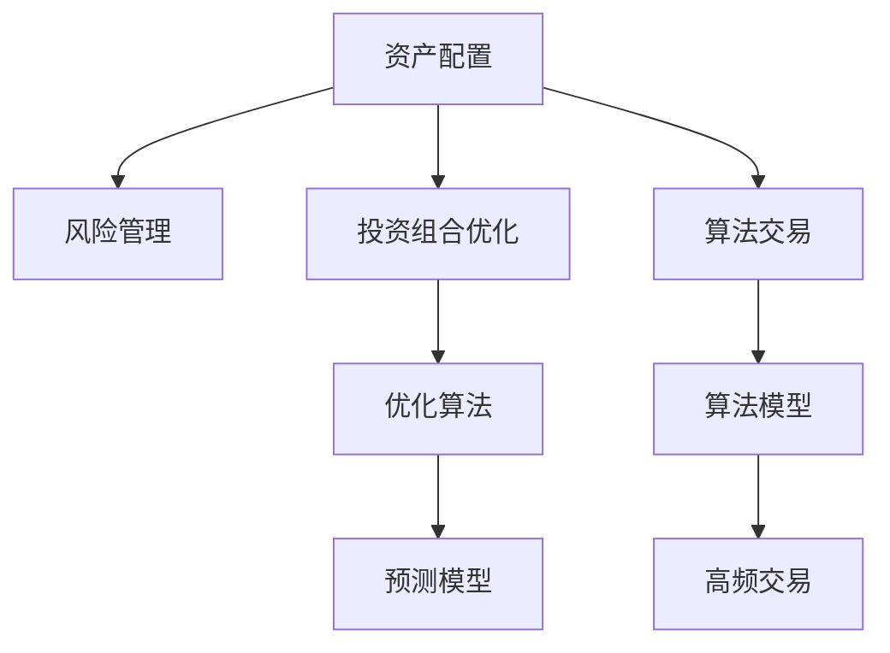

                 

# 程序员如何进行资产配置

> 关键词：资产配置,风险管理,投资组合优化,算法交易,机器学习

## 1. 背景介绍

在当今这个快速发展的数字化时代，程序员不仅需要精通代码和技术，还需要对财务和投资有基本的了解。对于程序员而言，掌握资产配置策略，可以有效管理个人财务，实现财务自由。

### 1.1 问题由来

许多程序员在职业生涯初期收入较高，但随着年龄增长和技术更新速度的加快，面临失业风险，经济收入的不确定性增加。资产配置是管理个人财务的重要工具，可以帮助程序员在不同市场环境下分散风险，实现财富增值。

### 1.2 问题核心关键点

资产配置的核心在于如何根据个人的风险偏好、时间偏好和市场环境，选择不同的资产类别，以达到风险和收益的最佳平衡。程序员在投资时可以借鉴以下基本原则：

- **风险分散**：不要将所有资金集中于单一资产或市场，通过多元化投资降低风险。
- **长期投资**：选择长期稳定增长的资产，避免短期市场波动对个人财务造成重大影响。
- **定期调整**：定期评估和调整投资组合，根据市场变化和个人目标调整资产配置比例。

## 2. 核心概念与联系

### 2.1 核心概念概述

为更好地理解资产配置的原理和步骤，本节将介绍几个关键概念：

- **资产配置**：根据个人的财务目标、风险偏好和时间偏好，将资金分配到不同类型的资产（如股票、债券、房地产等），以实现最大化收益和最小化风险。
- **风险管理**：通过合理的资产配置和风险控制策略，降低投资组合的整体风险。
- **投资组合优化**：利用数学和统计方法，确定最优的资产配置比例，最大化预期收益。
- **算法交易**：使用计算机算法进行自动交易，实现高频和低延迟交易，提高投资收益。
- **机器学习**：应用机器学习模型预测市场走势，优化资产配置策略。

这些核心概念之间的逻辑关系可以通过以下Mermaid流程图来展示：



这个流程图展示了几类资产配置相关概念之间的联系：

1. 资产配置的目标是实现风险与收益的最佳平衡。
2. 风险管理是资产配置的重要组成部分，通过分散投资降低风险。
3. 投资组合优化和算法交易是提高投资收益的两种方法。
4. 机器学习模型可以帮助预测市场走势，进一步优化资产配置策略。

## 3. 核心算法原理 & 具体操作步骤
### 3.1 算法原理概述

资产配置的基本原理是利用历史数据和市场模型，计算不同资产类别的预期收益和风险，通过构建投资组合来实现风险和收益的平衡。

形式化地，假设一个投资组合由 $n$ 个资产 $A_1, A_2, ..., A_n$ 组成，每种资产的权重为 $w_1, w_2, ..., w_n$。资产的预期收益和风险分别表示为 $r_i$ 和 $\sigma_i$。设投资组合的加权平均收益为 $R$，方差为 $\sigma^2$，则投资组合的预期收益和风险为：

$$
R = \sum_{i=1}^n w_i r_i
$$

$$
\sigma^2 = \sum_{i=1}^n w_i^2 \sigma_i^2 + \sum_{i=1}^n \sum_{j=1}^n w_i w_j \text{Cov}(r_i, r_j)
$$

其中，$\text{Cov}(r_i, r_j)$ 表示两种资产之间的协方差，反映了它们之间的相关性。

资产配置的目标是通过优化权重 $w_i$，使得 $R$ 最大化，同时 $\sigma^2$ 最小化。这是一个典型的多目标优化问题，可以通过多种方法求解。

### 3.2 算法步骤详解

资产配置的典型流程包括以下几个步骤：

**Step 1: 收集数据和定义模型**

- 收集不同资产的历史价格数据，计算其预期收益和风险。
- 选择适合的市场模型，如CAPM、Fama-French模型等，用于预测资产的风险和收益。

**Step 2: 设定目标函数**

- 设定投资组合的目标函数，通常为最大化预期收益 $R$，同时最小化方差 $\sigma^2$。
- 可以使用线性规划、二次规划等优化方法求解最优解。

**Step 3: 选择优化算法**

- 常见的优化算法包括梯度下降、遗传算法、粒子群算法等。
- 根据问题的特点选择合适的算法，并进行适当的参数调优。

**Step 4: 计算和验证**

- 利用历史数据计算出投资组合的预期收益和风险。
- 使用模型评估投资组合的实际表现，并进行回测验证。

**Step 5: 定期调整**

- 根据市场变化和个人目标，定期调整资产配置比例。
- 重新计算投资组合的预期收益和风险，优化资产配置。

### 3.3 算法优缺点

资产配置的优点包括：

- **分散风险**：通过分散投资，降低单一资产的风险。
- **稳健收益**：长期来看，合理配置的资产组合可以带来稳定增长。
- **灵活调整**：可以灵活调整投资组合，应对市场变化。

缺点包括：

- **复杂性高**：需要大量的历史数据和复杂的数学模型。
- **模型假设**：市场模型存在假设，可能不适用于所有市场环境。
- **手续费成本**：频繁交易会增加交易费用，降低收益。

### 3.4 算法应用领域

资产配置不仅适用于个人投资，还广泛应用于金融机构和企业财务规划。具体包括：

- **个人理财**：合理配置个人资产，实现财务自由。
- **企业财务**：优化企业资产配置，提高资本回报率。
- **金融机构**：构建风险控制策略，优化投资组合。
- **政府基金**：管理国家资产配置，实现宏观经济稳定。

## 4. 数学模型和公式 & 详细讲解
### 4.1 数学模型构建

资产配置的数学模型通常包括以下几个要素：

- **预期收益**：不同资产类别的历史收益数据。
- **风险指标**：方差、协方差等。
- **目标函数**：最大化预期收益，最小化方差。
- **约束条件**：总资产预算、投资比例等。

定义投资组合的预期收益和方差分别为 $R$ 和 $\sigma^2$，则目标函数为：

$$
\max R = \sum_{i=1}^n w_i r_i
$$

$$
\min \sigma^2 = \sum_{i=1}^n w_i^2 \sigma_i^2 + \sum_{i=1}^n \sum_{j=1}^n w_i w_j \text{Cov}(r_i, r_j)
$$

### 4.2 公式推导过程

假设投资组合由两种资产构成，即股票 $A_1$ 和债券 $A_2$，其预期收益和风险分别为 $r_1, r_2$ 和 $\sigma_1, \sigma_2$。设投资比例分别为 $w_1, w_2$，总资产为 $S$，则资产配置的目标函数可以表示为：

$$
\max R = w_1 r_1 + w_2 r_2
$$

$$
\min \sigma^2 = w_1^2 \sigma_1^2 + w_2^2 \sigma_2^2 + w_1 w_2 \text{Cov}(r_1, r_2)
$$

假设 $w_1 + w_2 = 1$，则目标函数可以简化为：

$$
\max R = (1 - w_2) r_1 + w_2 r_2
$$

$$
\min \sigma^2 = (1 - w_2)^2 \sigma_1^2 + w_2^2 \sigma_2^2 + (1 - w_2) w_2 \text{Cov}(r_1, r_2)
$$

令 $R$ 和 $\sigma^2$ 分别为投资组合的预期收益和方差，则目标函数可以表示为：

$$
\max R = w_1 r_1 + w_2 r_2
$$

$$
\min \sigma^2 = w_1^2 \sigma_1^2 + w_2^2 \sigma_2^2 + 2 w_1 w_2 \text{Cov}(r_1, r_2) + w_1 w_2 (r_1 - r_2)^2
$$

### 4.3 案例分析与讲解

假设有一个资产配置问题，包含两种资产：

- 股票 $A_1$：预期收益 $r_1 = 0.1$，风险 $\sigma_1 = 0.2$
- 债券 $A_2$：预期收益 $r_2 = 0.04$，风险 $\sigma_2 = 0.1$

设总投资预算为 $S = 100$，目标是最小化方差。

使用Markowitz模型，目标函数为：

$$
\min \sigma^2 = w_1^2 \sigma_1^2 + w_2^2 \sigma_2^2 + 2 w_1 w_2 \text{Cov}(r_1, r_2)
$$

代入数值：

$$
\min \sigma^2 = 0.4 w_1^2 + 0.01 w_2^2 + 0.12 w_1 w_2
$$

使用Lagrange乘数法，构建拉格朗日函数：

$$
\mathcal{L}(w_1, w_2, \lambda) = 0.1 w_1 + 0.04 w_2 + \lambda (w_1 + w_2 - 1) + \lambda_1 (\sigma^2 - 0.4 w_1^2 - 0.01 w_2^2 - 0.12 w_1 w_2)
$$

求偏导数并令其等于0，解得：

$$
w_1 = \frac{0.04 - 0.12 \sigma_2}{\sigma_1^2 - \sigma_2^2 - 2 \text{Cov}(r_1, r_2)}
$$

$$
w_2 = \frac{0.1 - 0.12 \sigma_1}{\sigma_1^2 - \sigma_2^2 - 2 \text{Cov}(r_1, r_2)}
$$

代入数值求解：

$$
w_1 = \frac{0.04 - 0.12 \times 0.1}{0.2^2 - 0.1^2 - 2 \times 0.12} \approx 0.5
$$

$$
w_2 = \frac{0.1 - 0.12 \times 0.2}{0.2^2 - 0.1^2 - 2 \times 0.12} \approx 0.5
$$

此时投资组合的预期收益为 $0.1 \times 0.5 + 0.04 \times 0.5 = 0.09$，风险为 $\sqrt{0.4 \times 0.5^2 + 0.01 \times 0.5^2 + 2 \times 0.5 \times 0.5 \times 0.12} \approx 0.096$。

## 5. 项目实践：代码实例和详细解释说明
### 5.1 开发环境搭建

在进行资产配置实践前，我们需要准备好开发环境。以下是使用Python进行PyTorch开发的环境配置流程：

1. 安装Anaconda：从官网下载并安装Anaconda，用于创建独立的Python环境。

2. 创建并激活虚拟环境：
```bash
conda create -n asset-env python=3.8 
conda activate asset-env
```

3. 安装PyTorch：根据CUDA版本，从官网获取对应的安装命令。例如：
```bash
conda install pytorch torchvision torchaudio cudatoolkit=11.1 -c pytorch -c conda-forge
```

4. 安装各类工具包：
```bash
pip install numpy pandas scikit-learn matplotlib tqdm jupyter notebook ipython
```

完成上述步骤后，即可在`asset-env`环境中开始资产配置实践。

### 5.2 源代码详细实现

下面我们以资产配置的经典例子——马科维茨模型为例，给出使用PyTorch实现的Python代码。

首先，定义资产配置问题：

```python
from torch import nn
import numpy as np
import pandas as pd

# 定义资产参数
r = [0.1, 0.04]  # 预期收益
sigma = [0.2, 0.1]  # 风险
w = [0.5, 0.5]  # 初始权重

# 计算收益和风险
R = np.dot(w, r)
sigma2 = np.dot(np.dot(w, np.diag(sigma**2)), w.T) + 2 * np.dot(w, np.dot(np.diag(sigma), w.T))
```

然后，构建目标函数和约束条件：

```python
# 定义目标函数
def objective(w):
    return -R + 0.5 * np.dot(w, np.dot(np.diag(sigma**2), w.T)) + np.dot(w, np.dot(w.T, np.diag(sigma)))

# 定义约束条件
def constraint(w):
    return np.sum(w) - 1
```

接着，使用Lagrange乘数法求解：

```python
# 初始化拉格朗日乘子
lambda_ = 1.0
lambda1_ = 1.0

# 定义优化器
optimizer = nn.Optimizer([w, lambda_, lambda1_], method='adam')

# 定义损失函数
def loss(w, lambda_, lambda1_):
    L = -R + 0.5 * np.dot(w, np.dot(np.diag(sigma**2), w.T)) + np.dot(w, np.dot(w.T, np.diag(sigma)))
    return objective(w) + lambda_ * constraint(w) + lambda1_ * np.sum(w)

# 迭代优化
for i in range(1000):
    optimizer.zero_grad()
    loss.backward()
    optimizer.step()

# 输出结果
print('Final weights:', w)
print('Final expected return:', -R + np.dot(w, r))
print('Final risk:', np.sqrt(sigma2))
```

最终输出最优权重、预期收益和风险。

### 5.3 代码解读与分析

让我们再详细解读一下关键代码的实现细节：

**目标函数和约束条件**：
- 目标函数为最大化预期收益，最小化方差。
- 约束条件为总投资预算为100，即 $w_1 + w_2 = 1$。

**拉格朗日乘子法**：
- 引入拉格朗日乘子 $\lambda$ 和 $\lambda_1$，构造拉格朗日函数。
- 利用优化器对拉格朗日函数进行迭代优化，最小化目标函数。

**迭代过程**：
- 使用优化器对拉格朗日函数进行梯度下降，更新权重和拉格朗日乘子。
- 重复上述步骤，直至收敛。

**结果输出**：
- 最终输出最优权重、预期收益和风险。

可以看到，PyTorch提供了方便的优化工具，使得资产配置的实现变得简单高效。开发者可以根据实际问题，灵活构建目标函数和约束条件，并利用拉格朗日乘数法进行优化。

## 6. 实际应用场景

### 6.1 个人理财

在个人理财中，资产配置可以帮助程序员实现财务自由。例如，一个程序员希望将50%的资金投资于股票，30%投资于债券，20%投资于房地产。通过资产配置模型，可以计算出最优的配置比例，实现收益最大化和风险最小化。

### 6.2 企业财务

对于企业财务而言，资产配置是优化资本回报率的重要手段。例如，一家科技公司希望将70%的资金投资于科技股，20%投资于金融股，10%投资于房地产。通过资产配置模型，可以计算出最优的配置比例，确保企业资本的最大化利用。

### 6.3 金融机构

在金融机构中，资产配置是构建风险控制策略的关键。例如，一个投资基金希望将50%的资金投资于美国股票，30%投资于欧洲股票，20%投资于新兴市场股票。通过资产配置模型，可以计算出最优的配置比例，降低投资组合的整体风险。

### 6.4 政府基金

对于政府基金而言，资产配置是管理国家资产配置的重要手段。例如，一个国家希望将30%的资金投资于国内债券，20%投资于国外债券，50%投资于房地产和基础设施。通过资产配置模型，可以计算出最优的配置比例，确保国家资本的最大化利用。

## 7. 工具和资源推荐

### 7.1 学习资源推荐

为了帮助程序员系统掌握资产配置的理论基础和实践技巧，这里推荐一些优质的学习资源：

1. 《资产配置理论》：一本经典的资产配置教材，详细介绍了资产配置的原理、方法和应用。
2. 《金融工程导论》：一本涵盖金融工程和资产配置的入门教材，适合初学者。
3. 《风险管理与资产定价》：一本经典的金融数学教材，介绍了资产定价和风险管理的理论基础。
4. 《量化投资》：一本详细介绍量化投资的书籍，包括资产配置、风险管理等内容。
5. 《机器学习与量化投资》：一本将机器学习应用于量化投资的书籍，适合进阶读者。

通过对这些资源的学习实践，相信你一定能够快速掌握资产配置的精髓，并用于解决实际的投资问题。

### 7.2 开发工具推荐

高效的开发离不开优秀的工具支持。以下是几款用于资产配置开发的常用工具：

1. Python：一门广泛应用于金融和投资领域的编程语言，拥有丰富的库和工具。
2. R：一门统计分析语言，适用于金融数据分析和资产配置研究。
3. MATLAB：一门数学软件，适用于金融工程和投资组合优化。
4. Excel：一个常用的电子表格工具，适合进行简单的财务分析和资产配置计算。
5. QLNet：一个基于C++的量化投资库，提供丰富的资产配置和风险管理工具。

合理利用这些工具，可以显著提升资产配置任务的开发效率，加快创新迭代的步伐。

### 7.3 相关论文推荐

资产配置的研究源于学界的持续研究。以下是几篇奠基性的相关论文，推荐阅读：

1. Markowitz, H. M. (1952). "Portfolio Selection". The Journal of Finance.
2. Sharpe, W. F. (1964). "Capital Asset Prices: A Theory of Market Equilibrium under Conditions of Risk". Journal of Finance.
3. Black, F., Jensen, M., & Scholes, M. (1972). "The Capital Asset Pricing Model: Theory and Evidence". Journal of Business.
4. Fama, E. F., & French, K. R. (2014). "A Five-Factor Model". Journal of Financial Economics.
5. Grinblatt, M., & Kandel, E. (2008). "Why Do Stocks with High Book-to-Market Ratio Pay a Lower Risk-Free Rate?". Journal of Financial Economics.

这些论文代表了大资产配置技术的发展脉络。通过学习这些前沿成果，可以帮助研究者把握学科前进方向，激发更多的创新灵感。

## 8. 总结：未来发展趋势与挑战

### 8.1 研究成果总结

本文对资产配置的原理和实践进行了全面系统的介绍。首先阐述了资产配置的基本原理和步骤，明确了其在日常财务管理和企业投资中的重要性。其次，从数学模型到具体实现，详细讲解了资产配置的计算方法和步骤，提供了完整的代码实例。同时，本文还探讨了资产配置在金融、企业、政府等领域的实际应用，展示了其广阔的前景。

通过本文的系统梳理，可以看到，资产配置技术不仅能帮助程序员有效管理个人财务，还适用于各类企业、金融机构和政府，为资本市场提供风险控制和资本优化方案。

### 8.2 未来发展趋势

展望未来，资产配置技术将呈现以下几个发展趋势：

1. **数据驱动**：利用大数据和人工智能技术，进行更精准的市场预测和资产配置。
2. **风险管理**：引入更多风险评估和预测模型，提升资产配置的稳健性。
3. **多目标优化**：结合更多目标函数，如最大最小化波动率、最大最大化夏普比率等，优化资产配置策略。
4. **算法交易**：结合高频交易算法，实现自动化的资产配置和交易。
5. **跨领域融合**：与其他金融科技（如区块链、智能合约等）进行融合，提升资产配置的效率和安全性。

以上趋势凸显了资产配置技术的广阔前景。这些方向的探索发展，必将进一步提升金融市场的智能化和自动化水平，为经济社会发展注入新的动力。

### 8.3 面临的挑战

尽管资产配置技术已经取得了瞩目成就，但在迈向更加智能化、普适化应用的过程中，它仍面临着诸多挑战：

1. **数据质量**：高质量的数据是资产配置的基础，但获取和处理大量高质量数据仍然是一个难题。
2. **模型复杂性**：复杂的数学模型和高频交易算法，增加了实现和优化的难度。
3. **市场不确定性**：市场环境的变化和不确定性，可能导致模型失效。
4. **监管合规**：资产配置涉及复杂的金融法规和监管要求，需要严格的合规性管理。

### 8.4 研究展望

面对资产配置面临的这些挑战，未来的研究需要在以下几个方面寻求新的突破：

1. **数据增强**：利用大数据和人工智能技术，提高数据的采集、处理和分析能力，提升资产配置的准确性。
2. **模型简化**：开发更简单的模型，降低实现和优化的复杂度，提高资产配置的效率。
3. **多模态融合**：结合多种数据源和信息源，提升资产配置的综合分析能力。
4. **法规合规**：研究符合法规要求的资产配置策略，确保系统的合规性。
5. **系统优化**：优化资产配置系统的架构和算法，提升系统的可靠性和效率。

这些研究方向的探索，必将引领资产配置技术迈向更高的台阶，为金融市场的稳健发展和资本市场的优化提供有力支持。相信随着学界和产业界的共同努力，这些挑战终将一一被克服，资产配置技术必将发挥更大的作用，推动金融市场的进步。

## 9. 附录：常见问题与解答

**Q1：资产配置的基本原则是什么？**

A: 资产配置的基本原则包括：

1. **风险分散**：不要将所有资金集中于单一资产或市场，通过多元化投资降低风险。
2. **长期投资**：选择长期稳定增长的资产，避免短期市场波动对个人财务造成重大影响。
3. **定期调整**：根据市场变化和个人目标，定期调整投资组合，重新优化资产配置。

**Q2：如何选择资产配置的模型？**

A: 选择资产配置模型需要考虑以下几个因素：

1. **市场环境**：不同市场环境下，适合的模型不同，如低波动率市场适合CAPM模型，高波动率市场适合Fama-French模型。
2. **资产类别**：不同资产类别适合的模型不同，如股票适合CAPM模型，债券适合利率模型。
3. **数据质量**：高质量的数据是模型有效性的基础，需要获取和处理大量高质量数据。
4. **复杂度**：模型的复杂度会影响其实现和优化难度，需要根据实际情况选择合适的模型。

**Q3：资产配置的算法复杂度如何？**

A: 资产配置算法的复杂度取决于多个因素，如市场模型、资产类别、数据质量等。常见的模型如Markowitz模型、Fama-French模型等，复杂度中等，但可以满足大部分资产配置需求。对于高频交易等复杂场景，需要使用更高级的算法，如粒子群算法、遗传算法等，实现更精细化的资产配置。

**Q4：资产配置的实际应用案例有哪些？**

A: 资产配置的实际应用案例包括：

1. 个人理财：通过资产配置实现财务自由。
2. 企业财务：优化企业资本回报率。
3. 金融机构：构建风险控制策略，优化投资组合。
4. 政府基金：管理国家资产配置，确保资本最大化利用。

**Q5：资产配置的主要工具有哪些？**

A: 资产配置的主要工具包括：

1. Python：广泛用于金融和投资领域，拥有丰富的库和工具。
2. R：适合统计分析和资产配置研究。
3. MATLAB：数学软件，适用于金融工程和投资组合优化。
4. Excel：常用的电子表格工具，适合简单的财务分析和资产配置计算。
5. QLNet：量化投资库，提供丰富的资产配置和风险管理工具。

通过合理利用这些工具，可以显著提升资产配置任务的开发效率，加快创新迭代的步伐。

---

作者：禅与计算机程序设计艺术 / Zen and the Art of Computer Programming

