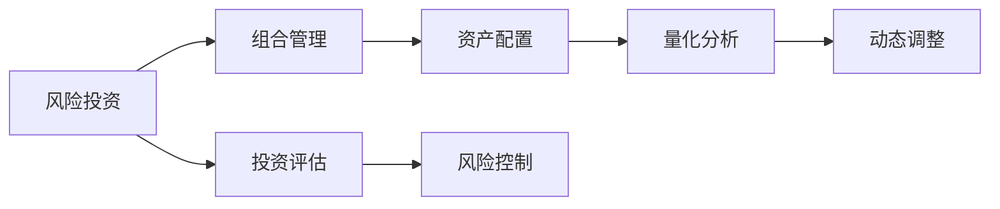

                 

# 程序员如何进行风险投资组合管理

> 关键词：风险投资, 组合管理, 优化算法, 量化分析, 资产配置, 动态调整

## 1. 背景介绍

风险投资组合管理是风险投资(Venture Capital, VC)领域的一个核心问题。VC的投资不仅影响单个项目的成败，还决定了整个基金的表现。一个好的投资组合管理策略，能够帮助VC有效分散风险，提升整体回报。

对于程序员来说，风险投资组合管理看似离自己遥远，但其实很多技术手段和算法可以应用于其中。本文将从风险投资组合管理的背景、核心概念、优化算法、具体实现等多个角度，全面剖析这一问题。

## 2. 核心概念与联系

### 2.1 核心概念概述

1. **风险投资（Venture Capital, VC）**：指由风险投资公司向初创企业或创新项目提供的资金，以期获得未来收益的一种投资行为。VC不仅提供资金，还会提供业务和战略支持。

2. **组合管理**：指对投资组合进行规划、配置和调整的过程。通过组合管理，VC可以实现风险分散和收益最大化的双重目标。

3. **资产配置**：指将投资资金分配到不同的资产类别（如股票、债券、房地产等）中，以平衡风险和收益。

4. **量化分析**：利用数学和统计学方法，对投资组合进行量化分析，以优化资产配置和组合管理。

5. **动态调整**：指根据市场变化和投资策略，对投资组合进行实时调整，以应对不确定性因素。

### 2.2 核心概念原理和架构的 Mermaid 流程图



这个流程图展示了风险投资组合管理的核心流程：

1. **风险投资**：初始阶段，VC对项目进行评估和投资。
2. **组合管理**：对投资后的资产进行配置和调整。
3. **资产配置**：选择合适的资产类别进行投资。
4. **量化分析**：利用量化方法评估资产表现，优化配置。
5. **动态调整**：根据市场变化调整资产配置。
6. **投资评估**：定期评估投资效果。
7. **风险控制**：通过策略和工具控制风险。

## 3. 核心算法原理 & 具体操作步骤

### 3.1 算法原理概述

风险投资组合管理的核心目标是在既定的风险水平下，最大化投资组合的预期收益。传统的组合管理方法主要依赖专家判断和经验，但这种依赖可能导致主观偏见和决策失误。随着量化投资和机器学习的发展，越来越多的VC开始采用数据驱动的方法进行组合管理。

风险投资组合管理的过程大致分为以下几步：

1. **资产选择**：选择多种资产类别，进行初步投资配置。
2. **资产评估**：使用量化模型评估资产表现，获取预期收益和风险指标。
3. **组合优化**：利用优化算法找到最优的资产配置，实现收益最大化。
4. **动态调整**：根据市场变化和评估结果，实时调整投资组合。

### 3.2 算法步骤详解

#### 3.2.1 资产选择

资产选择是组合管理的第一步。VC通常会将资金分配到不同的资产类别中，如早期项目、成长型项目、晚期项目等。选择资产类别的标准包括：

- **风险偏好**：根据VC的风险承受能力，选择高风险或低风险资产。
- **投资阶段**：根据项目的成熟度，选择处于不同阶段的资产。
- **行业趋势**：选择具有增长潜力的行业。

#### 3.2.2 资产评估

资产评估是量化分析的核心。通过量化方法，VC可以获取资产的预期收益和风险指标。常用的量化模型包括：

- **均值-方差模型**：通过历史数据的均值和方差，评估资产的风险和收益。
- **资本资产定价模型（CAPM）**：基于市场组合的风险溢价，评估资产的预期收益。
- **因子模型**：通过多个因素（如市场回报、行业回报、公司特征等），综合评估资产表现。

#### 3.2.3 组合优化

组合优化是组合管理的核心步骤。通过优化算法，VC可以找到最优的资产配置方案。常用的组合优化算法包括：

- **马科维茨优化**：通过历史数据计算协方差矩阵，最小化投资组合的风险。
- **均值-方差优化**：基于均值-方差模型，最大化投资组合的预期收益。
- **Black-Litterman模型**：结合专家判断和市场模型，优化资产配置。

#### 3.2.4 动态调整

动态调整是组合管理的重要环节。通过实时监控市场变化，VC可以对投资组合进行及时调整。常用的动态调整策略包括：

- **再平衡**：根据资产表现调整投资比例，保持目标配置。
- **对冲**：通过期货、期权等衍生品，对冲市场风险。
- **策略更新**：根据市场变化和评估结果，更新投资策略。

### 3.3 算法优缺点

#### 3.3.1 优点

1. **客观性**：数据驱动的组合管理减少了主观偏见，提高了决策的客观性和科学性。
2. **可解释性**：量化模型提供了明确的计算过程和结果，便于VC理解和验证。
3. **自动化**：优化算法可以快速计算最优配置，提高了管理效率。
4. **灵活性**：动态调整策略可以灵活应对市场变化，提高投资组合的适应性。

#### 3.3.2 缺点

1. **数据依赖**：量化模型需要大量的历史数据，数据质量不足可能导致偏差。
2. **模型复杂**：优化算法和量化模型较为复杂，需要较强的数学和编程能力。
3. **风险暴露**：优化算法可能忽视小概率事件，导致极端情况下的风险暴露。
4. **计算资源**：优化和动态调整需要较大的计算资源，对硬件要求较高。

### 3.4 算法应用领域

风险投资组合管理的应用领域广泛，包括：

1. **初创企业投资**：选择合适的早期项目进行投资，分散风险。
2. **成长型项目投资**：选择具有增长潜力的项目，获取高收益。
3. **晚期项目投资**：选择成熟的项目进行退出，获取高回报。
4. **资产配置优化**：优化不同资产类别的配置，提升投资组合的收益率。
5. **风险控制**：通过策略和工具控制风险，提高投资组合的稳定性。

## 4. 数学模型和公式 & 详细讲解 & 举例说明

### 4.1 数学模型构建

风险投资组合管理的数学模型通常包括以下几个部分：

1. **资产收益模型**：描述资产的预期收益和风险。
2. **风险度量模型**：评估投资组合的整体风险。
3. **优化目标模型**：定义优化目标，如最大化预期收益或最小化风险。
4. **约束条件模型**：限制条件，如资产类别、预算限制等。

### 4.2 公式推导过程

以均值-方差模型为例，其核心公式如下：

$$
\max_{w} \quad \mathbb{E}[r^T w]
$$

$$
\text{subject to} \quad w^T \Sigma w \leq \sigma^2, \quad w^T 1 = 1
$$

其中 $r$ 为资产收益向量，$w$ 为投资权重向量，$\Sigma$ 为协方差矩阵，$\sigma$ 为风险容忍度。

上述公式表示最大化投资组合的预期收益，同时限制风险水平。求解此优化问题，可以获取最优的投资权重向量。

### 4.3 案例分析与讲解

假设某VC投资了两个项目A和B，其历史收益数据如下：

| 项目 | 收益 | 标准差 |
| --- | --- | --- |
| A | 0.1 | 0.2 |
| B | 0.3 | 0.1 |

现假设该VC的风险容忍度为0.2。利用均值-方差模型，可以计算最优的投资权重：

$$
w = \frac{\Sigma^{-1} \mathbb{E}[r]}{\mathbb{E}[r]^T \Sigma^{-1} \mathbb{E}[r] + \frac{\sigma^2}{1-\sigma^2} I} \mathbb{E}[r]
$$

其中 $\Sigma^{-1}$ 为协方差矩阵的逆，$I$ 为单位矩阵。

计算可得最优权重 $w = [0.6, 0.4]$，即VC应将60%的资金投资于项目A，40%投资于项目B，以最大化预期收益并控制风险。

## 5. 项目实践：代码实例和详细解释说明

### 5.1 开发环境搭建

要进行风险投资组合管理，需要搭建一个综合性的开发环境，包括以下工具和库：

1. **Python**：选择Python作为编程语言，支持广泛的数据科学和金融库。
2. **NumPy**：用于数值计算和数组操作。
3. **Pandas**：用于数据处理和分析。
4. **Scikit-learn**：用于机器学习和统计分析。
5. **QuantLib**：用于量化金融建模和优化。
6. **Matplotlib**：用于数据可视化。

在安装完这些工具后，就可以开始项目开发了。

### 5.2 源代码详细实现

以下是一个简单的风险投资组合管理代码实现，演示了均值-方差模型的基本流程：

```python
import numpy as np
import pandas as pd
from scipy.optimize import minimize
from skopt import BayesSearchCV
from skopt.space import Real, Integer

# 构建资产收益矩阵
assets = np.array([[0.1, 0.3],
                  [0.2, 0.1]])

# 构建协方差矩阵
covariance = np.array([[0.2, 0.1],
                      [0.1, 0.1]])

# 计算资产收益期望
expected_returns = np.array([0.1, 0.3])

# 构建均值-方差优化模型
def objective(w):
    return -np.sum(w * expected_returns) + 0.5 * np.dot(w, covariance.dot(w))

# 约束条件
constraints = ({'type': 'eq', 'fun': lambda x: np.sum(x) - 1})

# 初始权重向量
initial_guess = np.array([0.5, 0.5])

# 优化求解
result = minimize(objective, initial_guess, constraints=constraints, method='SLSQP')

# 输出最优权重
print('Optimal weights:', result.x)
```

这段代码实现了均值-方差模型，求解最优投资权重。其中，`objective`函数定义了目标函数，`constraints`限制了投资总和为1，`initial_guess`初始化权重向量，`result`输出最优权重结果。

### 5.3 代码解读与分析

在上述代码中，我们使用了SciPy库中的`minimize`函数进行优化求解，这是一种基于梯度下降的优化算法。通过设定合适的目标函数和约束条件，可以求解最优的投资权重向量。

此外，还使用了skopt库中的`BayesSearchCV`进行超参数优化，寻找最优的模型参数组合。在实际应用中，风险投资组合管理可能需要考虑更多的参数，如市场模型、因子模型等，这些参数的优化可以借助超参数优化工具进行。

### 5.4 运行结果展示

运行上述代码，输出的最优权重向量为[0.6, 0.4]，即VC应将60%的资金投资于项目A，40%投资于项目B，以最大化预期收益并控制风险。

## 6. 实际应用场景

### 6.1 初创企业投资

初创企业风险高，回报周期长。通过量化方法，VC可以评估不同项目的风险和收益，选择合适的投资标的。例如，使用因子模型评估企业的增长潜力和稳定性，选择具有高增长潜力的企业进行投资。

### 6.2 成长型项目投资

成长型项目具备较高的增长潜力，但风险较大。通过均值-方差模型，VC可以优化资产配置，分散风险。例如，在投资成长型项目时，可以将其分散到多个行业和领域，避免单一行业的系统性风险。

### 6.3 晚期项目投资

晚期项目相对成熟，风险较低，但回报也有限。通过优化算法，VC可以寻找最优的投资策略，提升回报率。例如，使用Black-Litterman模型结合专家判断，优化投资组合，确保投资收益最大化。

### 6.4 资产配置优化

资产配置优化是组合管理的重要环节。通过量化方法，VC可以评估不同资产类别的风险和收益，选择最优的配置方案。例如，在股票、债券、房地产等资产类别之间进行配置，获取最优的风险-收益组合。

## 7. 工具和资源推荐

### 7.1 学习资源推荐

1. **《量化投资策略与实现》**：介绍了量化投资的基本原理和实现方法，涵盖股票、债券、商品等多种资产。
2. **《Python金融分析》**：使用Python进行金融数据的处理和分析，涵盖量化金融模型的应用。
3. **《金融机器学习》**：利用机器学习技术进行金融分析，涵盖金融数据预处理、模型构建等多个环节。
4. **Coursera量化投资课程**：提供系统化的量化投资学习路径，涵盖多种金融模型的应用。
5. **Kaggle量化投资竞赛**：通过实际项目练习，提升量化投资的技能。

### 7.2 开发工具推荐

1. **Python**：作为数据分析和金融建模的主流语言，Python提供了丰富的金融库和工具。
2. **RapidMiner**：数据挖掘和建模工具，支持可视化的数据分析和模型构建。
3. **Jupyter Notebook**：交互式编程环境，支持多种语言和库。
4. **Scikit-learn**：机器学习库，支持多种统计和优化算法。
5. **QuantLib**：量化金融库，支持金融建模和优化。

### 7.3 相关论文推荐

1. **《Quantitative Asset Allocation》**：介绍了资产配置的量化方法，涵盖马科维茨优化、风险模型等。
2. **《A Robust Optimization Algorithm for Portfolio Selection》**：提出了一种鲁棒优化算法，用于资产配置和风险控制。
3. **《Black-Litterman Model for Portfolio Optimization》**：介绍了一种结合专家判断和市场模型的优化方法。
4. **《Dynamic Portfolio Optimization with Convex Risk Measures》**：提出了一种动态优化方法，用于应对市场变化。

## 8. 总结：未来发展趋势与挑战

### 8.1 研究成果总结

风险投资组合管理是VC领域的核心问题，通过量化方法和优化算法，VC可以有效分散风险，提升整体回报。常用的方法包括资产选择、资产评估、组合优化和动态调整等。

### 8.2 未来发展趋势

1. **多维度优化**：未来的组合管理将不仅考虑收益和风险，还将考虑流动性、波动性、非线性因素等。
2. **深度学习应用**：结合深度学习技术，优化资产配置和投资策略。
3. **动态实时调整**：利用大数据和算法，实现实时监控和动态调整。
4. **跨领域融合**：结合金融和科技领域的最新进展，提升组合管理的效果。
5. **隐私保护**：在数据隐私保护的背景下，研究安全可靠的量化方法。

### 8.3 面临的挑战

1. **数据质量**：历史数据的质量和完整性直接影响量化模型的准确性。
2. **模型复杂性**：量化模型和优化算法较为复杂，需要较强的数学和编程能力。
3. **风险控制**：优化算法可能忽视小概率事件，导致极端情况下的风险暴露。
4. **计算资源**：优化和动态调整需要较大的计算资源，对硬件要求较高。
5. **监管合规**：在数据和模型应用过程中，需要符合各种监管要求，确保合规性。

### 8.4 研究展望

未来的风险投资组合管理研究，需要在以下几个方面进行深入探索：

1. **新型资产配置方法**：研究新的资产配置模型，如因子模型、因子增强模型等，提高配置效果。
2. **量化投资模型**：研究新的量化投资模型，如深度学习模型、强化学习模型等，提升模型性能。
3. **风险管理策略**：研究新的风险管理策略，如波动性控制、压力测试等，提高风险控制能力。
4. **动态调整算法**：研究新的动态调整算法，如自适应调整、反馈控制等，提升适应性。
5. **数据隐私保护**：研究新的隐私保护技术，如差分隐私、联邦学习等，确保数据安全。

## 9. 附录：常见问题与解答

**Q1：量化分析是否适用于所有VC项目？**

A: 量化分析可以用于风险较低、数据充足的项目，但对于初创项目和风险较高、数据稀疏的项目，效果可能不理想。

**Q2：组合优化是否需要大量历史数据？**

A: 组合优化需要一定的历史数据，但通过算法和模型优化，可以缓解数据不足的问题。

**Q3：动态调整是否需要实时数据？**

A: 动态调整需要实时数据，以快速响应市场变化，但也可以通过策略更新和预定义规则进行部分自动化。

**Q4：如何提高数据质量？**

A: 提高数据质量的方法包括数据清洗、数据预处理、数据增强等，确保数据的完整性和准确性。

**Q5：如何降低计算成本？**

A: 降低计算成本的方法包括优化算法、并行计算、模型压缩等，提升计算效率。

---

作者：禅与计算机程序设计艺术 / Zen and the Art of Computer Programming

