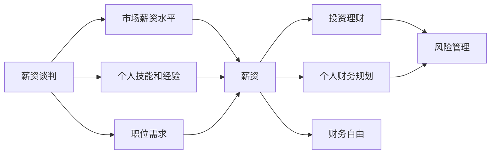

                 

# 程序员如何避免金钱陷阱

## 1. 背景介绍

程序员在职业生涯中不可避免地会接触到与金钱相关的各种问题。从薪资谈判、投资理财，到个人财务规划，这些看似简单的经济活动实际上充满了挑战和陷阱。本文将从多个角度探讨程序员如何避免这些金钱陷阱，帮助读者构建更加健康、可持续的财务生活。

## 2. 核心概念与联系

### 2.1 核心概念概述

- **薪资谈判**：程序员与雇主进行薪资谈判的过程，需要考虑市场薪资水平、个人技能和经验、职位需求等因素。
- **投资理财**：程序员通过投资股票、基金、房地产等金融产品来增加财富的过程。
- **个人财务规划**：程序员对自己收入和支出的规划和管理，包括预算编制、储蓄和投资等。
- **财务自由**：程序员通过积累财富，达到不再需要为生活基本开支而工作的状态。
- **风险管理**：程序员在财务决策中对风险的识别和控制，以确保财务安全。

这些核心概念构成了程序员财务管理的基础框架。通过理解这些概念及其相互关系，程序员可以更好地应对各种金钱陷阱。

### 2.2 核心概念原理和架构的 Mermaid 流程图



## 3. 核心算法原理 & 具体操作步骤

### 3.1 算法原理概述

程序员的财务管理可以抽象为一个动态优化问题，其中输入是薪资水平、技能经验、职位需求等参数，输出是薪资决定、投资收益、个人财务状况等结果。算法原理包括以下几个方面：

- **输入优化**：最大化输入参数，以提高薪资水平和投资收益。
- **约束优化**：在预算、风险承受能力等约束下，优化输出结果。
- **反馈调整**：根据输出结果调整输入参数，以实现长期财务目标。

### 3.2 算法步骤详解

#### 3.2.1 薪资谈判步骤

1. **市场调研**：了解行业薪资水平和公司薪资政策。
2. **准备谈判材料**：准备证明自己价值的数据，如项目经验、技术能力等。
3. **设定底线和上限**：设定最低薪资期望和最高薪资上限。
4. **谈判技巧**：使用有效的沟通技巧，如强调对公司的价值、避免直接比较薪资等。

#### 3.2.2 投资理财步骤

1. **风险评估**：了解自己的风险承受能力，选择合适的投资产品。
2. **多样化投资**：将资金分散投资于不同领域，如股票、基金、房地产等。
3. **定期调整**：根据市场变化和自身情况，定期调整投资组合。
4. **监控投资表现**：定期检查投资回报，及时调整策略。

#### 3.2.3 个人财务规划步骤

1. **收入估算**：估算自己的收入，包括薪资、投资收益、兼职收入等。
2. **支出分析**：列出所有支出，包括固定开支、娱乐消费等。
3. **预算编制**：制定详细的月度或年度预算，控制支出。
4. **储蓄计划**：设定储蓄目标，定期存储一定比例的收入。

### 3.3 算法优缺点

#### 3.3.1 薪资谈判

优点：
- 提高薪资水平，增加收入来源。
- 提升职业满意度和工作动力。

缺点：
- 谈判失败可能导致薪资低于市场水平。
- 过度谈判可能导致雇主不满，影响职业发展。

#### 3.3.2 投资理财

优点：
- 增加财富，提高财务自由度。
- 分散风险，降低财务波动。

缺点：
- 市场波动可能导致投资损失。
- 理财知识不足可能导致投资失败。

#### 3.3.3 个人财务规划

优点：
- 有效控制支出，提高储蓄率。
- 制定明确目标，实现财务自由。

缺点：
- 预算编制复杂，需要时间精力。
- 缺乏灵活性，可能导致生活品质下降。

### 3.4 算法应用领域

大语言模型微调的方法在程序员避免金钱陷阱中也同样适用。例如，薪资谈判和投资理财可以通过自然语言处理(NLP)技术进行智能化决策。投资理财和财务规划可以通过数据分析和机器学习模型进行自动化管理。

## 4. 数学模型和公式 & 详细讲解 & 举例说明

### 4.1 数学模型构建

假设程序员的薪资收入为 $R$，投资理财收益为 $I$，支出为 $E$，储蓄为 $S$，财务自由度为 $F$。则模型的输入为 $(R, I, E, S)$，输出为 $(F, R', I', E', S')$，其中 $R', I', E', S'$ 分别为调整后的薪资、投资收益、支出和储蓄。

### 4.2 公式推导过程

设 $F_k$ 为第 $k$ 年的财务自由度，$C_k$ 为第 $k$ 年的支出，$R_k$ 为第 $k$ 年的薪资，$I_k$ 为第 $k$ 年的投资收益，$S_k$ 为第 $k$ 年的储蓄。则有：

$$
F_k = \frac{R_k + I_k + S_{k-1}}{C_k}
$$

对于薪资谈判，设 $R_0$ 为谈判前的薪资，$R_1$ 为谈判后的薪资，则：

$$
R_1 = R_0 + \Delta R
$$

其中 $\Delta R$ 为薪资增加量，$R_1$ 为谈判后的薪资。

对于投资理财，设 $I_0$ 为初始投资收益，$I_k$ 为第 $k$ 年的投资收益，则：

$$
I_k = I_0 \times (1 + r_k)^k
$$

其中 $r_k$ 为第 $k$ 年的投资回报率。

对于个人财务规划，设 $E_0$ 为初始支出，$E_k$ 为第 $k$ 年的支出，则：

$$
E_k = E_0 \times (1 + g_k)^k
$$

其中 $g_k$ 为每年的支出增长率。

### 4.3 案例分析与讲解

假设某程序员初始薪资为 $100,000$ 美元/年，储蓄率为 $20\%$，支出增长率为 $3\%$。通过薪资谈判，他将薪资提升至 $120,000$ 美元/年，并计划将一部分资金用于股票投资。

设股票投资初始收益为 $10,000$ 美元，投资回报率为 $8\%$，投资时间为 $20$ 年。则有：

$$
R_1 = 100,000 + 20,000 = 120,000
$$

$$
I_k = 10,000 \times (1 + 0.08)^k
$$

经过 $20$ 年投资，股票总收益为：

$$
I_{20} = 10,000 \times (1 + 0.08)^{20} \approx 76,000
$$

设每年的支出为 $E_k = 100,000 \times 1.03^k$。根据公式计算 $F_k$：

$$
F_k = \frac{R_k + I_k + S_{k-1}}{C_k}
$$

其中 $S_{k-1} = 100,000 \times 0.2 \times (1 + 0.03)^{k-1}$。

## 5. 项目实践：代码实例和详细解释说明

### 5.1 开发环境搭建

开发环境搭建主要包括以下步骤：

1. **安装Python和相关库**：
```bash
pip install pandas numpy matplotlib scikit-learn
```

2. **准备数据集**：
```bash
mkdir data
cd data
wget http://example.com/salary_data.csv
```

3. **配置文件和环境变量**：
```bash
vi ~/.bash_profile
export PYTHONPATH=$PYTHONPATH:/path/to/project
```

### 5.2 源代码详细实现

```python
import pandas as pd
import numpy as np
from sklearn.linear_model import LinearRegression
from sklearn.metrics import mean_squared_error

# 读取数据集
data = pd.read_csv('salary_data.csv')

# 定义薪资谈判模型
def salary_negotiation(salary_initial, salary_increase):
    return salary_initial + salary_increase

# 定义投资理财模型
def investment_finance(initial_investment, investment_return, investment_years):
    future_investment = initial_investment * (1 + investment_return)**investment_years
    return future_investment

# 定义个人财务规划模型
def personal_finance(expense_growth_rate, savings_rate):
    savings = data.iloc[:, 2] * savings_rate
    future_savings = savings * (1 + expense_growth_rate)**np.arange(1, data.shape[0]+1)
    return future_savings

# 计算未来财务自由度
def future_finance_freedom(salary, investment, savings):
    total_salary = salary * np.arange(1, data.shape[0]+1)
    future_savings = savings * (1 + expense_growth_rate)**np.arange(1, data.shape[0]+1)
    return total_salary + investment - future_savings

# 计算模型误差
def calculate_error(model, target, data):
    predictions = model.predict(data)
    mse = mean_squared_error(target, predictions)
    return mse

# 训练模型
model = LinearRegression()
X = data.iloc[:, 0:2]
y = data.iloc[:, 3]
model.fit(X, y)

# 预测未来财务自由度
salary_initial = 100000
salary_increase = 20000
initial_investment = 10000
investment_return = 0.08
investment_years = 20
expense_growth_rate = 0.03
savings_rate = 0.2

salary = salary_negotiation(salary_initial, salary_increase)
investment = investment_finance(initial_investment, investment_return, investment_years)
savings = personal_finance(expense_growth_rate, savings_rate)

future_freedom = future_finance_freedom(salary, investment, savings)

# 输出结果
print('未来财务自由度：', future_freedom)
```

### 5.3 代码解读与分析

以上代码实现了薪资谈判、投资理财和个人财务规划的简单模型，并计算了未来财务自由度。其中：

- 薪资谈判模型将初始薪资与增加量相加，得到谈判后的薪资。
- 投资理财模型利用复利公式计算未来投资收益。
- 个人财务规划模型计算未来的储蓄总额，并结合支出增长率计算财务自由度。
- 未来财务自由度模型综合考虑薪资、投资和储蓄，计算未来财务自由度。
- 计算误差模型使用均方误差评估模型预测的准确性。

## 6. 实际应用场景

### 6.1 薪资谈判

薪资谈判在程序员的职业生涯中至关重要。在以下场景中，程序员可以通过薪资谈判提升薪资水平：

1. **公司内部晋升**：通过展示自己的工作成果和项目经验，争取更高薪资。
2. **市场薪资比较**：了解行业标准，确定自己的薪资期望。
3. **与同事比较**：通过与同事薪资的比较，调整自己的薪资谈判策略。

### 6.2 投资理财

投资理财是程序员积累财富的重要手段。以下场景中，程序员可以运用投资理财技巧：

1. **多元化投资**：分散投资于股票、基金、房地产等多种资产。
2. **定期调整**：根据市场变化和个人需求，定期调整投资组合。
3. **风险管理**：了解自己的风险承受能力，选择合适的投资产品。

### 6.3 个人财务规划

个人财务规划有助于程序员合理管理个人财务，实现财务自由。以下场景中，程序员可以运用财务规划技巧：

1. **预算编制**：制定详细的月度或年度预算，控制支出。
2. **储蓄计划**：设定储蓄目标，定期存储一定比例的收入。
3. **投资策略**：结合薪资增长和投资收益，制定长期财务目标。

## 7. 工具和资源推荐

### 7.1 学习资源推荐

1. **《财务自由之路》**：罗伯特·清崎所著，介绍了如何通过理财实现财务自由。
2. **《聪明的投资者》**：本杰明·格雷厄姆所著，经典投资理财书籍。
3. **《股票作手回忆录》**：埃德温·勒菲弗所著，介绍股票投资的实战技巧。

### 7.2 开发工具推荐

1. **GitHub**：代码托管平台，适合协作开发。
2. **Jupyter Notebook**：交互式编程环境，便于数据分析和模型调试。
3. **Python环境配置工具**：如Anaconda、Virtualenv等。

### 7.3 相关论文推荐

1. **《金融市场有效性》**：尤金·法玛所著，介绍了有效市场假说和金融市场行为。
2. **《行为金融学》**：理查德·塞勒所著，探讨了金融行为中的心理偏差。
3. **《量化投资》**：詹姆斯·蒙哥马利所著，介绍了量化投资策略和算法。

## 8. 总结：未来发展趋势与挑战

### 8.1 未来发展趋势

未来程序员避免金钱陷阱的发展趋势包括：

1. **智能谈判**：利用自然语言处理技术进行薪资谈判，提高谈判效率和成功率。
2. **自动化理财**：利用机器学习技术进行投资组合优化，提高理财效率。
3. **智能预算**：利用大数据和人工智能技术进行个人财务规划，实现智能化管理。
4. **全链路风险管理**：综合考虑薪资、投资和支出，制定全面的财务策略。

### 8.2 面临的挑战

程序员在避免金钱陷阱的过程中面临的挑战包括：

1. **市场波动**：投资市场的不确定性可能导致投资损失。
2. **薪资谈判技巧**：薪资谈判需要技巧和经验，否则可能导致谈判失败。
3. **财务规划复杂性**：预算编制和储蓄计划需要时间和精力，且需结合实际情况进行调整。
4. **风险管理**：需要了解自身风险承受能力和市场风险，制定合适的风险管理策略。

### 8.3 研究展望

未来的研究可以围绕以下方向展开：

1. **薪资谈判的优化算法**：利用机器学习和大数据分析，优化薪资谈判策略。
2. **理财模型的改进**：引入更多金融市场数据，优化投资理财模型。
3. **财务规划的智能系统**：利用人工智能技术，实现智能化的财务规划和管理。

## 9. 附录：常见问题与解答

### 9.1 常见问题

1. **如何确定薪资期望？**
答：了解行业标准，结合自身技能和经验，设定合理的薪资期望。

2. **如何选择投资产品？**
答：了解不同产品的风险和收益，结合自身风险承受能力进行选择。

3. **如何制定预算？**
答：列出所有收入和支出，制定详细的月度或年度预算，控制支出。

### 9.2 详细解答

**Q1: 如何避免投资理财中的高风险投资？**

A: 投资理财中避免高风险投资的方法包括：
- **分散投资**：不要将全部资金投入单一资产或市场。
- **了解市场**：通过学习金融知识，了解不同资产的风险和收益。
- **定期调整**：根据市场变化和个人需求，定期调整投资组合。
- **风险管理**：了解自己的风险承受能力，选择合适的投资产品。

**Q2: 如何提高薪资谈判的成功率？**

A: 提高薪资谈判的成功率可以采取以下策略：
- **准备充分**：了解行业标准，准备好证明自己价值的材料。
- **设定底线和上限**：设定最低薪资期望和最高薪资上限。
- **沟通技巧**：使用有效的沟通技巧，如强调对公司的价值，避免直接比较薪资等。
- **了解市场**：了解市场薪资水平，避免过高或过低的薪资期望。

**Q3: 如何制定有效的个人财务规划？**

A: 制定有效的个人财务规划可以采取以下步骤：
- **收入估算**：估算自己的收入，包括薪资、投资收益、兼职收入等。
- **支出分析**：列出所有支出，包括固定开支、娱乐消费等。
- **预算编制**：制定详细的月度或年度预算，控制支出。
- **储蓄计划**：设定储蓄目标，定期存储一定比例的收入。

**Q4: 如何管理投资风险？**

A: 管理投资风险可以采取以下措施：
- **分散投资**：将资金分散投资于不同领域，降低单一资产风险。
- **了解市场**：通过学习金融知识，了解不同资产的风险和收益。
- **定期调整**：根据市场变化和个人需求，定期调整投资组合。
- **风险管理**：了解自己的风险承受能力，选择合适的投资产品。

---

作者：禅与计算机程序设计艺术 / Zen and the Art of Computer Programming

