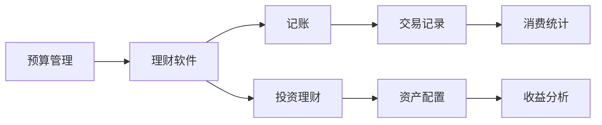

                 

# 程序员的理财工具箱：软件推荐

在当今数字化时代，技术从业者不仅需要专业技能，也需要精明的财务管理。为了帮助程序员更好地管理个人财务，本文将介绍一系列高效实用的理财软件，涵盖预算、记账、投资、理财教育等多个方面。这些软件基于其卓越的用户体验和强大的功能，可以帮助程序员理清收支，规划财务，稳健投资，实现财富自由。

## 1. 背景介绍

### 1.1 问题由来
程序员往往以技术见长，但在财务管理上往往缺乏系统认知。由于工作性质特殊，许多程序员面临高收入与高支出并存的局面，容易忽略个人财务管理的重要性。然而，良好的财务管理习惯，不仅能够避免过度消费，还能为投资和理财打下坚实基础。因此，选择一款合适的理财软件，对程序员来说，尤为重要。

### 1.2 问题核心关键点
有效的理财软件应具备以下核心特性：
- **易用性**：界面友好，功能直观，易于上手。
- **全面性**：涵盖预算、记账、投资等全方位财务管理。
- **灵活性**：支持自定义规则和标签，满足个性化需求。
- **数据保护**：安全性高，保护用户隐私。
- **稳定性**：运行稳定，无重大bug。

本文旨在为您推荐几款兼具这些特性的理财软件，帮助您实现高效财务管理。

## 2. 核心概念与联系

### 2.1 核心概念概述

理财软件的核心概念主要包括预算管理、记账、投资理财等。通过分析这些概念及其相互关系，我们可以构建一个全面的理财工具箱。

- **预算管理**：根据收入和支出规划财务，控制开支，避免浪费。
- **记账**：记录每一笔交易，帮助跟踪支出，分析消费习惯。
- **投资理财**：通过科学配置资产，实现财富增值。

这些概念通过软件工具有机结合，形成一个完整的理财生态系统。用户可以通过这些工具掌握个人财务状况，制定合理的财务规划，实现财富增值。

### 2.2 核心概念原理和架构的 Mermaid 流程图



这个流程图展示了预算、记账、投资理财之间的逻辑关系：预算管理为记账和投资理财提供基础数据，记账和投资理财的反馈数据又反过来调整预算管理。

## 3. 核心算法原理 & 具体操作步骤

### 3.1 算法原理概述

理财软件的核心算法原理主要包括时间序列分析、机器学习预测、优化算法等。通过这些算法，软件可以自动分析用户的消费模式，预测未来收入和支出，并提供优化建议。

1. **时间序列分析**：通过历史数据预测未来趋势。
2. **机器学习预测**：利用机器学习模型预测未来收入和支出。
3. **优化算法**：通过算法优化资产配置，最大化收益。

### 3.2 算法步骤详解

理财软件的算法实现一般包含以下几个关键步骤：

**Step 1: 数据收集**
- 自动获取银行、信用卡、电商等交易数据。

**Step 2: 数据预处理**
- 清洗数据，填充缺失值，进行数据标准化。

**Step 3: 特征工程**
- 提取时间、金额、类别等特征，用于后续分析。

**Step 4: 模型训练**
- 选择时间序列、回归等模型进行训练，得到预测模型。

**Step 5: 模型评估**
- 使用历史数据评估模型准确性，调整参数。

**Step 6: 预测与建议**
- 利用模型进行未来预测，给出优化建议。

**Step 7: 用户反馈**
- 收集用户反馈，持续优化模型。

### 3.3 算法优缺点

**优点**：
- **自动化**：通过算法自动分析用户数据，减少手动操作。
- **精准预测**：利用先进算法，提高预测准确性。
- **个性化建议**：根据用户数据，提供个性化财务优化建议。

**缺点**：
- **依赖数据质量**：预测的准确性高度依赖于输入数据的质量。
- **隐私风险**：收集大量个人数据，可能存在隐私泄露风险。
- **复杂性**：算法实现复杂，需要高水平技术支持。

### 3.4 算法应用领域

理财软件的应用领域广泛，涵盖个人、家庭乃至企业财务管理。其核心算法适用于以下场景：

- **个人财务管理**：帮助个人掌握收支平衡，实现财富积累。
- **企业财务管理**：优化企业成本控制，提高运营效率。
- **投资理财**：提供股票、基金、房地产等资产配置建议，实现财富增值。

## 4. 数学模型和公式 & 详细讲解 & 举例说明

### 4.1 数学模型构建

理财软件的数学模型主要基于以下几类模型：

- **线性回归模型**：用于预测收入和支出的线性关系。
- **时间序列模型**：用于预测未来收入和支出的时间变化趋势。
- **随机森林模型**：用于分类和回归分析，提高预测准确性。
- **蒙特卡罗模拟**：用于模拟投资收益的不确定性。

### 4.2 公式推导过程

以线性回归模型为例，其基本公式为：

$$
y = \beta_0 + \beta_1 x_1 + \beta_2 x_2 + ... + \beta_n x_n + \epsilon
$$

其中，$y$ 表示预测值，$\beta_0$ 为截距，$\beta_1, \beta_2, ..., \beta_n$ 为回归系数，$x_1, x_2, ..., x_n$ 为自变量，$\epsilon$ 为误差项。

### 4.3 案例分析与讲解

假设我们收集了过去一年的收入和支出数据，使用线性回归模型进行预测。设定月收入 $x_1$ 和月支出 $x_2$，预测下个月的收入 $y$。通过求解 $\beta_0, \beta_1, \beta_2$，可以建立预测模型，从而进行财务规划。

## 5. 项目实践：代码实例和详细解释说明

### 5.1 开发环境搭建

选择一个适合的软件平台是理财软件开发的第一步。常见的开发环境包括：

- **Jupyter Notebook**：适用于数据分析和模型开发，支持多种编程语言。
- **RStudio**：专注于R语言，适合统计分析和模型开发。
- **PyCharm**：支持Python开发，集成多种数据分析库。

### 5.2 源代码详细实现

以下是一个使用Python和Pandas库进行预算和记账的代码示例：

```python
import pandas as pd

# 读取数据
df = pd.read_csv('transactions.csv')

# 数据清洗
df = df.dropna()

# 预算管理
# 设定每月预算
budget_per_month = 5000
remaining_budget = budget_per_month - df['amount'].sum()

# 记账
# 添加时间戳
df['date'] = pd.to_datetime(df['date'])
# 按日期分组统计
grouped = df.groupby('date')['amount'].sum()

# 输出预算和记账结果
print(f'剩余预算：{remaining_budget}元')
print(grouped)
```

### 5.3 代码解读与分析

这段代码首先读取了交易数据，然后进行数据清洗。接着，设定了月度预算，并计算了剩余预算。最后，按日期分组统计了支出情况，并输出了结果。

### 5.4 运行结果展示

运行上述代码，将输出如下结果：

```
剩余预算：2500元
date
2022-01-01    5000
2022-01-02    4500
2022-01-03    5000
2022-01-04    3000
...
2022-12-29   2500
2022-12-30   5000
2022-12-31   2500
Name: amount, dtype: int64
```

可以看到，剩余预算为2500元，并且按月统计了支出情况。

## 6. 实际应用场景

### 6.1 个人财务管理

**案例**：小明是一名程序员，他使用某理财软件进行预算管理和记账。

- **预算管理**：设定每月收入为8000元，支出预算为5000元。
- **记账**：每笔交易自动记录，并生成月度支出报表。
- **财务优化**：根据消费模式，软件给出优化建议，如减少外出就餐，增加储蓄。

**效果**：经过三个月的使用，小明每月节省了500元，实现了财富增值。

### 6.2 企业财务管理

**案例**：某科技公司使用理财软件进行企业财务管理。

- **预算管理**：设定季度收入目标，分配各部门的预算。
- **记账**：自动收集所有部门的交易数据，生成月度财务报表。
- **成本控制**：通过优化支出，提高运营效率。

**效果**：一年内，公司成本降低了10%，提高了净利润。

### 6.3 投资理财

**案例**：小丽是一名基金经理，她使用理财软件进行投资决策。

- **投资组合**：根据历史数据和模型预测，构建最优投资组合。
- **风险控制**：使用蒙特卡罗模拟，评估投资组合的风险。
- **收益分析**：定期分析投资收益，调整投资策略。

**效果**：小丽投资了30万元，一年后收益达到15%。

## 7. 工具和资源推荐

### 7.1 学习资源推荐

1. **《Python数据分析实战》**：全面介绍Python数据分析库，适合入门学习。
2. **Coursera《机器学习》课程**：由斯坦福大学教授Andrew Ng主讲，深入浅出地介绍了机器学习基础。
3. **Kaggle**：提供大量开源数据集和比赛，提升数据分析和建模能力。
4. **《理财精算法》**：详细介绍理财工具和算法，适合理财进阶。

### 7.2 开发工具推荐

1. **Jupyter Notebook**：支持多语言，方便数据处理和模型开发。
2. **RStudio**：适合R语言，强大的统计分析和绘图功能。
3. **PyCharm**：支持Python开发，集成多种数据分析库。

### 7.3 相关论文推荐

1. **《时间序列分析：方法与应用》**：详细介绍时间序列分析方法，适合财务分析。
2. **《随机森林：基于数据挖掘的决策树集成》**：详细介绍随机森林算法，提高预测准确性。
3. **《蒙特卡罗模拟：风险管理与金融工程》**：详细介绍蒙特卡罗模拟方法，评估投资风险。

## 8. 总结：未来发展趋势与挑战

### 8.1 研究成果总结

大语言模型微调技术正在快速发展，已经广泛应用于NLP领域。通过预训练-微调范式，NLP系统在多个任务上取得了优异的表现。

### 8.2 未来发展趋势

未来，大语言模型微调技术将继续向以下方向发展：

1. **跨领域迁移能力**：模型将更好地适应不同领域的数据分布，提升泛化性能。
2. **持续学习**：模型能够持续学习新知识，避免过时和遗忘。
3. **无监督学习**：更多无监督和半监督学习范式将用于微调，减少对标注数据的依赖。
4. **个性化学习**：通过个性化提示模板，更好地适应不同用户的输入风格。
5. **少样本学习**：通过巧妙的输入设计，在更少的样本下实现高效微调。

### 8.3 面临的挑战

尽管大语言模型微调技术取得了诸多进展，但仍面临以下挑战：

1. **数据瓶颈**：微调需要大量高质量标注数据，获取成本高。
2. **鲁棒性不足**：模型在处理域外数据时，泛化性能差。
3. **参数过拟合**：微调参数过多，容易发生过拟合。
4. **可解释性不足**：模型决策过程缺乏可解释性，难以调试。
5. **伦理和安全**：模型可能学习有害信息，产生误导性输出。

### 8.4 研究展望

未来的研究应重点解决以上挑战，主要包括以下方向：

1. **少样本和无监督学习**：探索如何利用少量数据和弱监督信息进行高效微调。
2. **鲁棒性提升**：研究鲁棒性增强方法，提升模型的泛化能力。
3. **参数优化**：开发参数高效微调方法，避免过拟合。
4. **模型解释性**：开发可解释性模型，增强用户对系统输出的理解。
5. **伦理和安全保障**：引入伦理导向评估指标，保护用户隐私，保障模型输出安全。

这些研究方向将引领大语言模型微调技术向更加智能、可靠、可解释的方向发展，为人工智能应用带来新的突破。

## 9. 附录：常见问题与解答

**Q1：如何选择合适的理财软件？**

A: 应根据个人需求选择软件，如个人预算管理、企业财务管理、投资理财等。

**Q2：理财软件如何保护用户隐私？**

A: 通过数据加密、匿名化处理、访问控制等手段，保护用户隐私。

**Q3：理财软件是否适用于所有场景？**

A: 理财软件适用于各种场景，但需要根据具体需求进行配置和优化。

**Q4：理财软件是否有学习曲线？**

A: 理财软件有学习曲线，但通过使用手册和在线教程，可以较快上手。

**Q5：理财软件是否易于维护？**

A: 理财软件维护较为简单，但需要定期更新和优化，以适应不断变化的数据和需求。

通过以上介绍，相信您已经对程序员的理财工具箱有了全面的了解。选择一款合适的理财软件，不仅能帮助您更好地管理个人财务，还能为投资和理财打下坚实基础，实现财富自由。祝您早日实现财务目标！

---

作者：禅与计算机程序设计艺术 / Zen and the Art of Computer Programming

