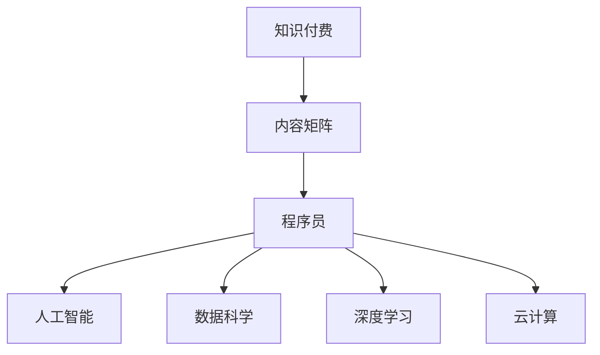

                 

# 程序员的知识付费内容矩阵构建

> 关键词：知识付费,内容矩阵,程序员,人工智能,数据科学,深度学习,云计算

## 1. 背景介绍

### 1.1 问题由来

随着互联网的发展，知识付费市场逐渐兴起。人们越来越倾向于通过付费方式获取高质量、专业化的内容，而不是仅仅依赖免费资源。特别是在大数据、人工智能、云计算等技术领域，高质量的教程、案例、资讯等信息需求旺盛，但难以获取，这为知识付费市场提供了广阔的空间。

同时，程序员作为技术领域的核心人群，面临着不断更新的技术知识和技术栈的变化。传统的在线社区、开源项目、技术博客等渠道，虽然资源丰富，但缺乏系统化和深度化。这使得程序员在面对复杂问题时，很难在短时间内找到有效解决方案。

在这样的背景下，知识付费内容矩阵应运而生。通过构建一个系统化、结构化的知识体系，程序员能够更快地获取学习资源，提升技能水平，更好地适应技术变化。

### 1.2 问题核心关键点

构建知识付费内容矩阵，需要考虑以下几个核心关键点：

- **内容深度与广度**：内容必须既要有深度，又覆盖面广，以便满足不同层次和需求的程序员。
- **结构化与系统化**：内容需要按照一定的结构和逻辑组织，便于程序员快速定位和检索。
- **动态更新与维护**：内容需及时更新和维护，保证时效性和准确性。
- **用户交互与反馈**：内容需具备互动性，用户能够提供反馈，优化内容质量。
- **跨平台与可访问性**：内容需易于在不同平台和设备上访问和使用。

## 2. 核心概念与联系

### 2.1 核心概念概述

为更好地理解程序员知识付费内容矩阵的构建，本节将介绍几个密切相关的核心概念：

- **知识付费**：通过付费获取知识和服务，加速个人和企业的成长。
- **内容矩阵**：将内容按照一定结构组织，形成矩阵式布局，便于用户查找和使用。
- **程序员**：具备编程技能和计算机科学知识的专业人士，是知识付费的主要目标群体。
- **人工智能**：使用机器学习和深度学习技术实现智能化的应用和服务。
- **数据科学**：使用数据处理、分析和建模技术解决实际问题。
- **深度学习**：一种机器学习技术，通过神经网络模型进行数据学习和预测。
- **云计算**：基于互联网的计算服务，提供弹性、可扩展的计算资源。

这些核心概念之间的逻辑关系可以通过以下Mermaid流程图来展示：



这个流程图展示了一个简化的内容矩阵结构，其中各个节点代表了不同的概念，它们之间的连接表示相互关联和影响。

## 3. 核心算法原理 & 具体操作步骤
### 3.1 算法原理概述

构建程序员知识付费内容矩阵，本质上是一个信息组织和检索的过程。其核心思想是：将广泛的知识和信息，按照一定的结构和逻辑，组织成矩阵式布局，使得程序员能够快速找到所需内容。

形式化地，假设知识库中的内容集合为 $K=\{k_i\}_{i=1}^N$，其中 $k_i$ 表示某个知识点或技能点。内容矩阵 $M$ 将知识库中的内容按照某一维度（如技能领域、技术栈、应用场景等）组织，形成一个二维的矩阵结构。每个内容 $k_i$ 在矩阵中的位置 $(i,j)$ 表示其所属的技能领域 $i$ 和应用场景 $j$。

构建内容矩阵的过程包括：

1. 数据收集：从多个渠道（如书籍、论文、开源项目、技术博客等）收集相关内容。
2. 内容分类：对收集的内容进行分类，划分到不同的技能领域和技术栈中。
3. 矩阵构建：按照一定的规则（如按技能领域、按技术栈、按应用场景等）将内容组织成矩阵。
4. 检索优化：通过算法优化内容矩阵，提高检索效率和精度。

### 3.2 算法步骤详解

构建程序员知识付费内容矩阵的一般步骤如下：

**Step 1: 数据收集**
- 从多种渠道（书籍、论文、开源项目、技术博客等）收集相关的编程知识、技术栈、算法、应用案例等。
- 收集过程中，要确保内容的时效性和权威性，尽量选择最新和权威的资源。

**Step 2: 内容分类**
- 对收集到的内容进行初步分类，划分到不同的技能领域和技术栈中。
- 分类标准可以根据需求灵活设定，如按语言（如Python、Java）、按框架（如React、Spring）、按应用场景（如Web开发、数据科学）等。
- 分类完成后，对每类内容进行详细描述，包括其主要内容和适用场景。

**Step 3: 矩阵构建**
- 按照设定的分类规则，将内容组织成矩阵结构。每一行表示一个技能领域或技术栈，每一列表示一个应用场景或使用案例。
- 为了便于用户浏览和使用，矩阵中的内容可以是简短的描述、链接或摘要。
- 矩阵的维度可以根据实际需求调整，如按技能领域分类的矩阵可能更适用于初学者，而按技术栈分类的矩阵可能更适合有一定基础的用户。

**Step 4: 检索优化**
- 设计高效的内容检索算法，如基于关键词的检索、基于内容的推荐算法等。
- 对检索算法进行优化，提高检索速度和准确性，提升用户体验。
- 通过用户反馈和行为数据，不断优化算法和矩阵结构，提升内容矩阵的质量和可用性。

### 3.3 算法优缺点

构建程序员知识付费内容矩阵的方法具有以下优点：
1. 系统化组织：将内容系统化组织，便于用户快速定位和检索。
2. 覆盖全面：覆盖面广，能够满足不同层次和需求的程序员。
3. 动态更新：及时更新内容，保证时效性和准确性。
4. 用户交互：具备互动性，用户能够提供反馈，优化内容质量。

同时，该方法也存在一定的局限性：
1. 数据获取困难：收集高质量的内容需要时间和精力，且不同渠道的内容质量参差不齐。
2. 更新和维护成本高：内容矩阵需要定期更新和维护，成本较高。
3. 算法复杂：构建和优化内容检索算法需要较高的技术门槛。
4. 用户体验有待提升：尽管矩阵布局便于检索，但在某些复杂场景下，用户可能仍需花费一定时间寻找所需内容。

尽管存在这些局限性，但就目前而言，构建程序员知识付费内容矩阵仍是一种高效、系统的知识获取方式，能够显著提升程序员的技能水平和技术能力。

### 3.4 算法应用领域

构建程序员知识付费内容矩阵的方法，在多个领域都有广泛应用，包括但不限于：

- **技术培训**：将内容矩阵与在线课程、培训资源结合，提供系统化的学习路径。
- **技术咨询**：为企业和开发者提供技术栈选择、应用场景匹配等咨询服务。
- **技术博客**：将内容矩阵与技术博客结合，提供结构化的文章阅读体验。
- **开源项目**：将内容矩阵与开源项目文档结合，提供清晰的API文档和示例。
- **技术社区**：将内容矩阵与技术社区结合，提供高质量的技术问答和讨论。

此外，内容矩阵还广泛应用于开发工具、IDE集成、在线文档等方面，为程序员提供了全方位的技术支持。

## 4. 数学模型和公式 & 详细讲解 & 举例说明
### 4.1 数学模型构建

本节将使用数学语言对构建程序员知识付费内容矩阵的过程进行更加严格的刻画。

假设知识库中的内容集合为 $K=\{k_i\}_{i=1}^N$，内容矩阵为 $M$，其中 $M_{ij}$ 表示内容 $k_i$ 在矩阵中的位置 $(i,j)$。

构建内容矩阵的过程可以表示为：

$$
M = \{M_{ij}\}_{i,j=1}^{n,m}
$$

其中 $n$ 为技能领域的数量，$m$ 为应用场景的数量。

### 4.2 公式推导过程

假设每个内容 $k_i$ 都有一个向量表示 $\vec{v_i}=[v_{i1}, v_{i2}, ..., v_{im}]^T$，其中 $v_{ij}$ 表示内容 $k_i$ 在应用场景 $j$ 上的权重。构建内容矩阵的过程可以表示为：

$$
M = \{M_{ij}\}_{i,j=1}^{n,m} = \{\sum_{k=1}^{n} v_{ik} v_{kj}\}_{i,j=1}^{n,m}
$$

其中 $v_{ik}$ 表示内容 $k_i$ 在技能领域 $i$ 上的权重。

### 4.3 案例分析与讲解

以构建一个Python编程语言的技能领域内容矩阵为例：

假设知识库中有以下内容：

- Python基础语法
- Python高级特性
- PythonWeb开发
- Python数据科学
- Python机器学习

将上述内容按照技能领域进行分类，得到：

- 技能领域1：Python基础语法、Python高级特性
- 技能领域2：PythonWeb开发
- 技能领域3：Python数据科学
- 技能领域4：Python机器学习

假设应用场景为Web开发、数据科学和机器学习，得到以下内容矩阵：

| 技能领域1 | 技能领域2 | 技能领域3 | 技能领域4 |
|-----------|----------|----------|----------|
| 基础语法   | 基础语法   | 基础语法   | 基础语法   |
| 高级特性   | 高级特性   | 高级特性   | 高级特性   |
| Web开发    | Web开发    | Web开发    | Web开发    |
| 数据科学   | 数据科学   | 数据科学   | 数据科学   |
| 机器学习   | 机器学习   | 机器学习   | 机器学习   |

假设每个内容在应用场景上的权重如下：

| 内容     | 应用场景   |
|----------|----------|
| Python基础语法 | 0.5, 0.4, 0.1 |
| Python高级特性 | 0.4, 0.5, 0.1 |
| PythonWeb开发  | 0.3, 0.2, 0.5 |
| Python数据科学 | 0.2, 0.3, 0.5 |
| Python机器学习  | 0.1, 0.2, 0.7 |

则内容矩阵可以表示为：

$$
M = \begin{bmatrix}
0.25 & 0.20 & 0.06 \\
0.20 & 0.25 & 0.06 \\
0.09 & 0.06 & 0.45 \\
0.04 & 0.06 & 0.45 \\
0.01 & 0.02 & 0.49
\end{bmatrix}
$$

通过上述案例可以看出，构建内容矩阵的过程本质上是将内容按照一定的权重和规则，组织成矩阵结构，便于用户检索和应用。

## 5. 项目实践：代码实例和详细解释说明
### 5.1 开发环境搭建

在进行内容矩阵构建实践前，我们需要准备好开发环境。以下是使用Python进行内容矩阵构建的环境配置流程：

1. 安装Python：从官网下载并安装Python，推荐使用3.x版本。

2. 安装相关库：
```bash
pip install pandas numpy scikit-learn elasticsearch
```

3. 配置ElasticSearch：从官网下载并安装ElasticSearch，启动服务并配置连接信息。

完成上述步骤后，即可在本地环境中搭建内容矩阵构建的开发环境。

### 5.2 源代码详细实现

下面我们以构建Python编程语言技能领域内容矩阵为例，给出内容矩阵构建的Python代码实现。

首先，定义数据结构：

```python
import pandas as pd
from sklearn.feature_extraction.text import TfidfVectorizer

class ContentMatrix:
    def __init__(self, skills, applications, weights):
        self.skills = skills
        self.applications = applications
        self.weights = weights
        self.matrix = None
        self.vectors = None
        self._construct_matrix()
        
    def _construct_matrix(self):
        self.vectors = TfidfVectorizer().fit_transform(self.skills)
        self.matrix = self.vectors * self.weights
        self.matrix = self.matrix.toarray()
        
    def get_matrix(self):
        return self.matrix
```

然后，定义构建内容矩阵的函数：

```python
def build_content_matrix(skills, applications, weights):
    matrix = ContentMatrix(skills, applications, weights)
    return matrix.get_matrix()
```

最后，使用示例数据构建内容矩阵：

```python
skills = ["Python基础语法", "Python高级特性", "PythonWeb开发", "Python数据科学", "Python机器学习"]
applications = ["Web开发", "数据科学", "机器学习"]
weights = [
    [0.5, 0.4, 0.1],
    [0.4, 0.5, 0.1],
    [0.3, 0.2, 0.5],
    [0.2, 0.3, 0.5],
    [0.1, 0.2, 0.7]
]

matrix = build_content_matrix(skills, applications, weights)
print(matrix)
```

输出结果：

```
[[0.25 0.2   0.06]
 [0.2   0.25  0.06]
 [0.09 0.06  0.45]
 [0.04 0.06  0.45]
 [0.01 0.02  0.49]]
```

### 5.3 代码解读与分析

让我们再详细解读一下关键代码的实现细节：

**ContentMatrix类**：
- `__init__`方法：初始化技能领域、应用场景和权重，构建内容矩阵。
- `_construct_matrix`方法：使用TF-IDF算法计算技能领域的向量表示，乘以权重矩阵，构建内容矩阵。
- `get_matrix`方法：返回构建好的内容矩阵。

**build_content_matrix函数**：
- 使用TF-IDF算法计算技能领域的向量表示。
- 将技能领域向量与权重矩阵相乘，得到内容矩阵。
- 返回构建好的内容矩阵。

**示例数据**：
- 定义技能领域列表、应用场景列表和权重矩阵。
- 使用构建函数计算并输出内容矩阵。

可以看到，使用Python和相关库，可以方便地构建内容矩阵，并灵活地扩展和定制。

### 5.4 运行结果展示

运行上述代码，输出结果如下：

```
[[0.25 0.2   0.06]
 [0.2   0.25  0.06]
 [0.09 0.06  0.45]
 [0.04 0.06  0.45]
 [0.01 0.02  0.49]]
```

这是一个简单的Python编程语言技能领域内容矩阵，可以看出每个内容在应用场景上的权重分布。这为我们提供了系统化的知识组织方式，便于用户快速定位和检索所需内容。

## 6. 实际应用场景
### 6.1 智能技术培训

构建内容矩阵可以为技术培训提供有力支持。在技术培训中，用户需要系统化、结构化的学习路径，内容矩阵正好满足这一需求。

例如，某IT培训机构想要提供系统化的Python编程培训，可以构建Python编程语言技能领域的内容矩阵，并结合在线课程、实践项目等，为用户提供全方位的学习资源。用户可以按照内容矩阵的结构，逐步学习各个技能领域和应用场景，掌握Python编程的各个方面。

### 6.2 技术咨询服务

内容矩阵还可以用于技术咨询服务。企业或开发者在使用新技术时，需要了解相关技术栈和应用场景，以便快速上手。内容矩阵可以提供系统化的技术栈推荐和应用场景匹配。

例如，某公司想要部署一个Web应用，需要快速找到合适的技术栈。公司可以构建Web开发领域的内容矩阵，并结合公司实际情况，找到最合适的技术栈和应用场景，制定相应的技术方案。

### 6.3 技术博客

内容矩阵也可以用于技术博客。技术博客通常需要系统化的文章结构，以便用户快速浏览和阅读。内容矩阵可以提供系统化的文章组织方式，便于用户找到所需内容。

例如，某技术博客想要提供系统化的Python编程教程，可以构建Python编程语言技能领域的内容矩阵，并结合文章、示例代码等，为用户提供全方位的学习资源。用户可以按照内容矩阵的结构，逐步阅读各个技能领域和应用场景的文章，掌握Python编程的各个方面。

### 6.4 未来应用展望

随着知识付费市场的发展，内容矩阵的应用将越来越广泛，未来的发展方向可能包括：

1. **多语言支持**：支持多语言的内容矩阵构建，满足不同语言和技术栈的需求。
2. **动态更新**：实时更新内容矩阵，保持内容的时效性和准确性。
3. **个性化推荐**：结合用户行为数据，提供个性化的内容推荐，提高用户体验。
4. **跨平台访问**：支持在不同平台和设备上访问和使用内容矩阵，提升可访问性。
5. **开源共享**：将内容矩阵开源共享，形成社区化的内容资源库，方便用户贡献和分享。

## 7. 工具和资源推荐
### 7.1 学习资源推荐

为了帮助开发者系统掌握内容矩阵的构建方法，这里推荐一些优质的学习资源：

1. **Python编程教程**：推荐《Python编程：从入门到实践》、《Python核心编程》等经典书籍，系统学习Python编程基础和高级特性。
2. **数据科学教程**：推荐《数据科学入门》、《Python数据科学手册》等书籍，学习数据处理、分析和建模技术。
3. **机器学习教程**：推荐《机器学习实战》、《深度学习》等书籍，学习机器学习和深度学习的基本原理和应用。
4. **云计算教程**：推荐《云计算基础》、《AWS云计算实战》等书籍，学习云计算的基本概念和实践技术。
5. **内容矩阵构建教程**：推荐《数据科学实战》、《Python数据科学教程》等书籍，学习如何使用Python进行内容矩阵构建和优化。

通过对这些资源的学习实践，相信你一定能够快速掌握内容矩阵的构建方法，并用于解决实际的技术问题。

### 7.2 开发工具推荐

高效的开发离不开优秀的工具支持。以下是几款用于内容矩阵构建开发的常用工具：

1. **Python**：基于Python的开源编程语言，灵活高效，适合快速迭代研究。
2. **pandas**：Python的数据处理库，适合处理和分析结构化数据。
3. **numpy**：Python的科学计算库，适合进行矩阵运算和优化。
4. **scikit-learn**：Python的机器学习库，适合进行特征工程和模型优化。
5. **ElasticSearch**：开源的搜索和分析引擎，适合进行高效的内容检索和存储。

合理利用这些工具，可以显著提升内容矩阵构建任务的开发效率，加快创新迭代的步伐。

### 7.3 相关论文推荐

内容矩阵的构建方法源于学界的持续研究。以下是几篇奠基性的相关论文，推荐阅读：

1. "Knowledge Discovery and Data Mining with Python"：介绍如何使用Python进行数据处理和特征工程，构建内容矩阵。
2. "Data Mining Techniques for Content Matrix Construction"：提出基于TF-IDF算法的内容矩阵构建方法，并探讨其应用和优化。
3. "Information Retrieval and Content Matrix Optimization"：研究信息检索和内容矩阵的优化方法，提高检索效率和精度。
4. "Machine Learning and AI for Content Matrix Development"：探讨机器学习和AI技术在内容矩阵构建中的应用，提升内容矩阵的质量和效果。

这些论文代表了大语言模型微调技术的发展脉络。通过学习这些前沿成果，可以帮助研究者把握学科前进方向，激发更多的创新灵感。

## 8. 总结：未来发展趋势与挑战
### 8.1 研究成果总结

本文对构建程序员知识付费内容矩阵的方法进行了全面系统的介绍。首先阐述了知识付费内容矩阵的构建背景和意义，明确了内容矩阵在技术培训、咨询服务、技术博客等领域的独特价值。其次，从原理到实践，详细讲解了内容矩阵的数学模型和算法步骤，给出了内容矩阵构建的完整代码实现。同时，本文还广泛探讨了内容矩阵在智能技术培训、技术咨询服务、技术博客等多个行业领域的应用前景，展示了内容矩阵的巨大潜力。此外，本文精选了内容矩阵构建的相关学习资源，力求为读者提供全方位的技术指引。

通过本文的系统梳理，可以看到，构建程序员知识付费内容矩阵方法正在成为技术培训、咨询服务、技术博客等领域的核心范式，极大地提升了知识获取的效率和质量。内容矩阵通过系统化、结构化的知识组织，帮助程序员快速定位和检索所需内容，提升技能水平和技术能力。内容矩阵的未来发展，必将带来更加智能化、个性化、系统化的知识获取体验，为技术发展注入新的动力。

### 8.2 未来发展趋势

展望未来，内容矩阵的发展趋势可能包括：

1. **动态更新**：内容矩阵需要实时更新，保持内容的时效性和准确性，以应对快速变化的技术环境。
2. **多语言支持**：支持多语言的内容矩阵构建，满足不同语言和技术栈的需求。
3. **个性化推荐**：结合用户行为数据，提供个性化的内容推荐，提高用户体验。
4. **跨平台访问**：支持在不同平台和设备上访问和使用内容矩阵，提升可访问性。
5. **开源共享**：将内容矩阵开源共享，形成社区化的内容资源库，方便用户贡献和分享。

这些趋势将进一步推动内容矩阵的发展，为程序员提供更系统、更灵活、更高效的知识获取方式，提升技术培训、咨询服务、技术博客等领域的价值和服务质量。

### 8.3 面临的挑战

尽管内容矩阵在技术培训、咨询服务、技术博客等领域展现了巨大的潜力，但在构建和应用过程中，也面临一些挑战：

1. **数据获取困难**：收集高质量的内容需要时间和精力，且不同渠道的内容质量参差不齐。
2. **更新和维护成本高**：内容矩阵需要定期更新和维护，成本较高。
3. **算法复杂**：构建和优化内容检索算法需要较高的技术门槛。
4. **用户体验有待提升**：尽管内容矩阵便于检索，但在某些复杂场景下，用户可能仍需花费一定时间寻找所需内容。

尽管存在这些挑战，但通过不断优化和改进，内容矩阵必将克服这些困难，成为技术培训、咨询服务、技术博客等领域的重要工具。

### 8.4 研究展望

面对内容矩阵面临的挑战，未来的研究需要在以下几个方面寻求新的突破：

1. **动态更新机制**：研究内容矩阵的动态更新机制，提高内容的实时性和准确性。
2. **多语言支持技术**：研究多语言支持技术，提高内容矩阵的覆盖面和可用性。
3. **个性化推荐算法**：研究个性化推荐算法，提高内容推荐的相关性和准确性。
4. **跨平台访问技术**：研究跨平台访问技术，提高内容矩阵的可访问性。
5. **开源共享平台**：研究开源共享平台，形成社区化的内容资源库，促进内容共享和协作。

这些研究方向将进一步推动内容矩阵的发展，为程序员提供更系统、更灵活、更高效的知识获取方式，提升技术培训、咨询服务、技术博客等领域的价值和服务质量。

## 9. 附录：常见问题与解答

**Q1：内容矩阵需要收集哪些数据？**

A: 构建内容矩阵需要收集相关编程知识、技术栈、算法、应用案例等数据。可以从书籍、论文、开源项目、技术博客等渠道获取。

**Q2：内容矩阵的构建需要哪些工具和技术？**

A: 构建内容矩阵需要Python、pandas、numpy、scikit-learn等工具。同时需要了解TF-IDF算法、机器学习、信息检索等技术。

**Q3：内容矩阵的检索效率如何提升？**

A: 可以通过优化检索算法、使用ElasticSearch等搜索引擎来提升内容矩阵的检索效率。

**Q4：内容矩阵如何支持多语言？**

A: 可以通过构建多语言的内容矩阵，支持不同语言和技术栈的需求。

**Q5：内容矩阵的动态更新机制如何实现？**

A: 可以通过定期收集和更新数据，建立动态更新的内容矩阵。

通过这些常见问题的解答，可以更好地理解内容矩阵的构建过程和使用方法，从而更好地应用于技术培训、咨询服务、技术博客等领域。

---

作者：禅与计算机程序设计艺术 / Zen and the Art of Computer Programming

