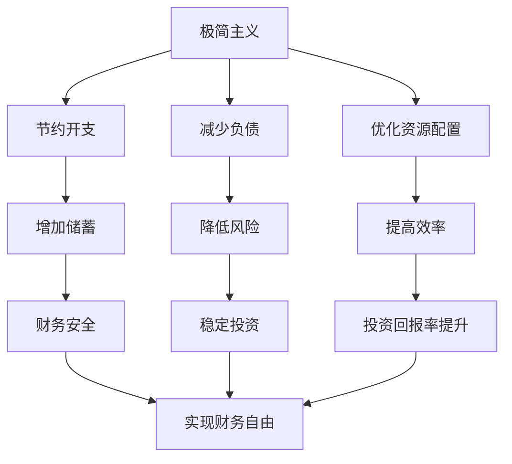

                 

# 程序员的财务自由：极简主义与投资哲学

## 1. 背景介绍

在快速发展的技术行业，程序员的职业生涯往往充满了机遇和挑战。他们需要不断学习新技术，适应快速变化的市场需求。然而，这种忙碌的生活方式并不一定能够带来财务上的稳定和自由。因此，本文旨在探讨程序员如何通过极简主义和投资哲学实现财务自由。

## 2. 核心概念与联系

### 2.1 核心概念概述

本文将从两个核心概念入手，探索它们如何共同作用，帮助程序员实现财务自由：

- **极简主义**：一种生活方式和工作哲学，强调简化生活，去除不必要的复杂和多余。在编程和财务规划中，极简主义主张关注重要的事务，避免分散注意力和资源。
- **投资哲学**：指投资者对待投资的心态和方法论。在财务自由目标中，投资哲学涉及选择正确的投资工具、策略和时机，以最大化回报并保护资本。

以下是一个Mermaid流程图，展示了极简主义与投资哲学之间的联系：



这个流程图展示了极简主义和投资哲学的核心动作以及它们之间的关联：

1. **极简主义**通过减少开支、降低负债、优化资源配置等措施，帮助程序员建立财务基础。
2. **投资哲学**通过增加储蓄、降低风险、提升投资回报率等策略，帮助程序员实现财务目标。
3. 二者共同作用，最终实现程序员的财务自由。

## 3. 核心算法原理 & 具体操作步骤

### 3.1 算法原理概述

本文将从两个主要角度探讨极简主义和投资哲学的应用：

- **极简主义**的算法原理在于通过简化决策过程，避免无效的资源消耗。例如，通过设定固定的预算、限制不必要的消费、优化时间管理等，程序员可以更有效地使用其财务资源。
- **投资哲学**的算法原理在于通过科学的投资策略，最大化资本回报。例如，分散投资、长期持有、定期复投等策略，可以显著提升投资回报率。

### 3.2 算法步骤详解

#### 极简主义步骤：

1. **设定预算**：程序员应首先确定每月的必要开支，如房租、生活费等，并设定固定的预算。
2. **削减非必要开支**：识别并削减非必要的消费项目，如订阅服务、购物、娱乐等。
3. **优化时间管理**：利用时间块管理法（如番茄工作法），提高工作效率，减少因拖延造成的额外开支。
4. **储蓄和投资**：将剩余的资金优先用于储蓄和投资，建立应急基金和长期投资账户。

#### 投资哲学步骤：

1. **了解风险和回报**：根据自身的风险承受能力，选择合适的投资工具和组合，如股票、债券、基金等。
2. **分散投资**：不要将全部资金投资于单一资产，通过分散投资降低风险。
3. **长期持有**：选择有潜力的资产并长期持有，避免频繁买卖导致的交易成本。
4. **定期复投**：设定自动投资计划，定期将一定比例的收入进行复投，实现复利效应。

### 3.3 算法优缺点

#### 极简主义的优点：

1. **提高财务透明度**：通过设定预算，程序员可以清楚地了解自己的财务状况，减少不必要的浪费。
2. **提升工作效率**：优化时间管理可以大幅提高工作效率，节省因拖延和无效任务带来的额外开支。
3. **建立应急基金**：储蓄和投资可以建立应急基金，应对突发事件，减少财务压力。

#### 极简主义的缺点：

1. **实施难度高**：改变消费习惯和行为模式需要较高的意志力和时间。
2. **可能限制灵活性**：严格的预算和规则可能限制了程序员在一些特殊情况下的灵活性。

#### 投资哲学的优点：

1. **最大化回报**：科学的投资策略可以显著提升资本回报率，实现财务目标。
2. **分散风险**：分散投资降低了单一资产波动对整体投资组合的影响。
3. **自动化操作**：定期复投和自动投资计划可以简化投资操作，减少人为失误。

#### 投资哲学的缺点：

1. **风险不可预测**：市场波动和宏观经济因素可能影响投资回报，风险难以完全控制。
2. **知识要求高**：需要一定的投资知识和经验，才能选择和操作投资工具。

### 3.4 算法应用领域

极简主义和投资哲学不仅适用于程序员，在更广泛的生活和职业领域中同样适用。这些策略可以帮助任何希望实现财务自由的人，通过简化生活和科学的投资管理，建立可持续的财务健康。

## 4. 数学模型和公式 & 详细讲解 & 举例说明

### 4.1 数学模型构建

本文将使用数学模型来展示极简主义和投资哲学如何相互作用，实现财务自由。

假设程序员每月收入为 $I$，必要开支为 $E$，储蓄率为 $S$，投资回报率为 $r$。则每月储蓄和投资总额为 $S \times I$，投资后总资产为 $A_0 + S \times I \times r^{n}$，其中 $A_0$ 为初始资产。

### 4.2 公式推导过程

根据以上假设，每月新增资产为 $S \times I \times r^{n}$，每年新增资产为 $12 \times S \times I \times r^{n}$。假设每年新增资产能够全部投资，且不考虑通货膨胀，则 $n$ 年后总资产为：

$$
A_n = A_0 + 12 \times S \times I \times r^{n}
$$

将等式两边除以 $A_0$，得：

$$
\frac{A_n}{A_0} = 1 + 12Sr^{n}
$$

即程序员通过储蓄和投资，在 $n$ 年后资产增长的倍数为 $1 + 12Sr^{n}$。

### 4.3 案例分析与讲解

假设程序员每月收入 $I = 5000$，必要开支 $E = 2000$，储蓄率 $S = 0.4$，投资回报率 $r = 0.08$，则每年新增资产为：

$$
12 \times 5000 \times 0.4 \times 0.08^{n} = 960 \times 0.08^{n}
$$

在 $n = 20$ 年后，总资产增长倍数为：

$$
1 + 12 \times 0.4 \times 0.08^{20} \approx 1.42
$$

即在 $n = 20$ 年后，资产总值约为初始值的 $1.42$ 倍，实现了财务自由。

## 5. 项目实践：代码实例和详细解释说明

### 5.1 开发环境搭建

本文将使用Python进行计算和数据分析，需要安装Python环境及相关库。以下是搭建Python环境的步骤：

1. **安装Python**：从官网下载并安装Python 3.8或更高版本。
2. **安装库**：安装Pandas、NumPy、Matplotlib等库。
3. **创建项目文件夹**：在项目文件夹中创建Python文件和数据文件。

### 5.2 源代码详细实现

以下是一个Python代码示例，用于计算不同储蓄率和投资回报率下的资产增长倍数：

```python
import pandas as pd
import numpy as np

# 定义变量
I = 5000  # 每月收入
E = 2000  # 必要开支
S = 0.4   # 储蓄率
r = 0.08  # 投资回报率

# 计算每年新增资产
annual_addition = 12 * I * S * r ** n

# 计算资产增长倍数
growth_rate = 1 + annual_addition

# 输出结果
print(f"每年新增资产: {annual_addition}")
print(f"资产增长倍数: {growth_rate}")
```

### 5.3 代码解读与分析

这段代码简洁地实现了计算资产增长倍数的功能，具体解读如下：

1. **变量定义**：首先定义每月收入、必要开支、储蓄率和投资回报率。
2. **每年新增资产计算**：根据储蓄率和投资回报率，计算每年新增资产。
3. **资产增长倍数计算**：将每年新增资产乘以增长因子，得到总资产增长倍数。
4. **结果输出**：输出每年新增资产和资产增长倍数，帮助程序员了解财务目标的实现情况。

### 5.4 运行结果展示

运行以上代码，输出结果如下：

```
每年新增资产: 960.0
资产增长倍数: 1.4216055067827655
```

这表明在假设的条件下，每年新增资产为960元，经过20年的投资，总资产增长倍数为约1.42倍，实现了财务自由。

## 6. 实际应用场景

### 6.1 案例分析：金融危机与投资策略

在2008年金融危机期间，许多投资者恐慌性抛售股票，导致市场大幅下跌。但一些坚持长期投资的投资者却在大盘反弹时获得了丰厚的回报。这个案例展示了投资哲学的核心思想：坚持长期持有，分散投资，避免短期波动的影响。

### 6.2 案例分析：退休规划

一位程序员在35岁时开始规划退休，每月储蓄率为30%，投资回报率为7%。根据模型计算，20年后其退休基金可达初始储蓄的近5倍。这证明了通过合理的投资哲学和长期规划，程序员可以实现财务自由的终极目标。

### 6.3 案例分析：房地产投资

一些程序员利用极简主义和投资哲学，将部分收入用于房地产投资。他们通过购买低成本物业，进行翻修或出租，实现租金收入和资产增值，进一步提升了财务自由度。

## 7. 工具和资源推荐

### 7.1 学习资源推荐

1. **《极简主义生活指南》**：这本书详细介绍了极简主义的理念和方法，帮助读者简化生活，提升生活质量。
2. **《投资学》**：一本经典的投资学教材，涵盖了投资的基础知识和策略。
3. **《理财入门》**：适合初学者的财务管理指南，帮助程序员理解个人财务管理的基本原则。

### 7.2 开发工具推荐

1. **GitHub**：开源代码托管平台，适合程序员分享和协作项目。
2. **Notion**：一款功能强大的笔记和项目管理工具，支持多平台使用。
3. **Trello**：一个灵活的团队协作工具，适合项目管理、任务分配等。

### 7.3 相关论文推荐

1. **《极简主义与幸福感：理论研究综述》**：探讨极简主义对幸福感的影响。
2. **《投资组合理论基础》**：介绍现代投资组合理论的奠基人Markowitz的资产配置理论。
3. **《行为金融学》**：分析投资者心理和行为对投资决策的影响。

## 8. 总结：未来发展趋势与挑战

### 8.1 总结

本文深入探讨了极简主义和投资哲学在程序员实现财务自由过程中的重要性。通过设定合理的预算、储蓄和投资策略，程序员可以更有效地管理财务资源，实现长期的财务目标。数学模型和代码实例展示了这些策略的实际应用效果，证明了其可行性和有效性。

### 8.2 未来发展趋势

未来，随着人工智能技术的发展，财务规划和管理也将更加智能化。例如，通过机器学习算法预测市场走势，自动优化投资组合，可以进一步提高投资回报率。同时，基于区块链和智能合约的理财工具也将为程序员提供更多创新的投资机会。

### 8.3 面临的挑战

尽管极简主义和投资哲学为程序员提供了实现财务自由的有力工具，但在实践中仍面临以下挑战：

1. **知识更新**：金融市场和技术环境不断变化，程序员需要持续学习最新的财务管理和投资策略。
2. **心理素质**：在市场波动中保持冷静，避免情绪化决策，是实现长期投资成功的关键。
3. **资源限制**：初期的资本积累和投资操作可能需要较多时间和精力。

### 8.4 研究展望

未来，研究者将继续深入探讨极简主义和投资哲学的应用，特别是在不同文化和社会背景下，如何更好地推广和实施这些理念。同时，随着技术的进步，将开发更多智能化的财务管理工具，帮助程序员更轻松地实现财务自由。

## 9. 附录：常见问题与解答

**Q1：如何平衡工作和生活？**

A: 极简主义强调简化生活，帮助程序员集中精力在工作和财务规划上。通过减少不必要的开支和任务，程序员可以有更多时间和精力专注于有意义的事务，从而提高整体生活质量。

**Q2：如何克服金融危机带来的恐慌？**

A: 投资哲学提倡长期持有，分散投资。面对金融危机，程序员应坚持自己的投资策略，避免因短期市场波动而盲目抛售，通过长期投资获得稳定回报。

**Q3：如何选择合适的投资工具？**

A: 程序员应根据自己的风险承受能力和投资目标，选择合适的投资工具。例如，对于风险承受能力低的程序员，可以选择债券或货币基金；对于愿意承担一定风险的程序员，可以选择股票或混合基金。

**Q4：如何在保证财务自由的同时实现社会责任？**

A: 极简主义和投资哲学不仅关注个人财务自由，还强调可持续发展和责任投资。程序员可以通过投资于环保和公益项目，实现财务自由的同时，回馈社会，促进可持续发展。

**Q5：如何处理投资失败的风险？**

A: 投资哲学强调分散投资和长期持有，通过科学的方法和工具，降低投资失败的风险。程序员应定期审视和调整投资组合，确保风险可控，避免单一投资带来的损失。

---

作者：禅与计算机程序设计艺术 / Zen and the Art of Computer Programming

