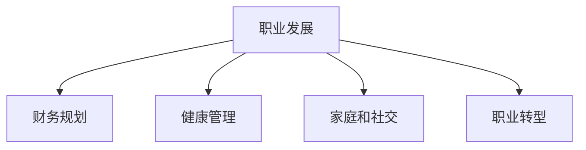

                 

# 程序员的退休规划：早做准备

在当今这个快速变化的科技行业中，程序员的职业生涯可能充满激情和挑战。然而，随着年龄的增长，很多开发者开始思考自己的未来和退休规划。本文将深入探讨程序员的退休规划，包括为什么需要提前规划、如何规划以及规划过程中应考虑的关键因素。通过了解这些核心概念，我们希望帮助程序员在职业生涯中做出更明智的决策，确保未来的稳定与幸福。

## 1. 背景介绍

### 1.1 问题由来
技术行业以其快速变化和不断创新而著称，程序员在这个领域中扮演着重要角色。随着技术的不断发展，许多老一辈程序员面临着职业转型和退休规划的挑战。尽管一些技术公司和初创企业为员工提供了丰厚的股权和福利，但仍有许多人开始思考退休后的生活。

### 1.2 问题核心关键点
为什么程序员需要提前规划退休？因为随着年龄增长，技术栈的变化、身体状况、家庭责任等因素都可能影响职业生涯。通过提前规划，程序员可以更好地应对这些变化，确保在退休时拥有足够的经济和心理准备。

### 1.3 问题研究意义
提前规划退休不仅是职业上的考虑，更是个人生活和家庭幸福的保障。规划良好的退休生活不仅能减轻晚年的经济负担，还能提升生活的质量，让程序员在退休后更加自由和满足。

## 2. 核心概念与联系

### 2.1 核心概念概述

为了更好地理解程序员退休规划，我们需要了解一些相关核心概念：

- **职业发展**：程序员的职业路径包括技能提升、项目经验积累和职业晋升。
- **财务规划**：包括薪资增长、投资理财和退休金积累。
- **健康管理**：物理和心理健康是保证长期工作能力的关键。
- **家庭和社交**：家庭责任和社交圈是职业规划和个人幸福的重要组成部分。
- **职业转型**：随着技术的变化，老一辈程序员可能需要转型到新的技术领域。

这些概念之间相互关联，共同构成了一个全面的退休规划框架。通过合理配置这些资源，程序员可以更好地平衡工作与生活，为退休生活做好准备。

### 2.2 核心概念原理和架构的 Mermaid 流程图



这个流程图展示了职业发展、财务规划、健康管理、家庭和社交、职业转型之间相互关联的关系。这些概念的合理配置和平衡，是退休规划的关键。

## 3. 核心算法原理 & 具体操作步骤

### 3.1 算法原理概述

退休规划本质上是一个长期优化问题，涉及到多个目标函数的平衡。程序员需要考虑收入增长、投资回报、健康状况和家庭需求等多个因素，以实现最优的退休规划方案。

### 3.2 算法步骤详解

1. **目标设定**：明确退休目标，如退休年龄、退休后生活品质、资金储备等。
2. **现状分析**：评估当前的职业状况、财务状况、健康状况和家庭状况。
3. **策略规划**：基于目标设定和现状分析，制定财务规划、健康管理、家庭和社交规划及职业转型策略。
4. **执行与监控**：根据策略规划执行具体的行动，定期监控进展并进行调整。

### 3.3 算法优缺点

**优点**：
- 提前规划能够更好地应对职业生涯中的不确定性，提高生活的稳定性。
- 全面考虑多个因素，制定更为合理的退休规划。

**缺点**：
- 规划过程复杂，需要投入大量时间和精力。
- 难以预测未来变化，可能导致规划与实际情况不符。

### 3.4 算法应用领域

退休规划不仅适用于技术行业的程序员，也适用于所有职业领域。然而，技术行业的特点使得退休规划更具挑战性，因为技术更新迅速，职业生涯变化较大。

## 4. 数学模型和公式 & 详细讲解 & 举例说明

### 4.1 数学模型构建

设程序员当前年龄为 $t$，退休年龄为 $T$，退休后年生活费为 $C$，年投资收益率为 $r$，年支出为 $E$。退休规划的目标是在 $T$ 年达到足够的资金储备，确保退休后的生活质量。

### 4.2 公式推导过程

根据上述设定，退休规划的数学模型为：

$$
\max_{t} \left( \sum_{t=T}^{T+n} \frac{C}{(1+r)^t} \right)
$$

其中 $n$ 为规划的年数。

### 4.3 案例分析与讲解

假设一名程序员当前35岁，计划在65岁退休，退休后每年需要生活费30万元，投资收益率为5%。现在需要每年投资多少才能在退休时有足够的资金储备？

根据公式，我们可以计算出每年需要投资的金额，确保退休时有足够的资金储备。

## 5. 项目实践：代码实例和详细解释说明

### 5.1 开发环境搭建

为了进行退休规划的计算，我们需要使用Python和相关库。以下是搭建开发环境的步骤：

1. 安装Python：下载并安装Python，建议使用最新版本的Python 3.x。
2. 安装相关库：安装numpy、pandas、scipy等库，用于数据处理和计算。

### 5.2 源代码详细实现

下面是一个简单的退休规划计算器的Python代码示例：

```python
import numpy as np
from scipy.optimize import minimize

def retirement_planner(rate, investment_per_year, retirement_age, life_exp, annual_expense):
    total_age = retirement_age + life_exp
    total_investment = 0
    for t in range(0, total_age):
        if t < retirement_age:
            total_investment += investment_per_year * (1 + rate) ** t
        else:
            total_investment += annual_expense * (1 + rate) ** (t - retirement_age)
    return total_investment

# 设定参数
rate = 0.05  # 年利率
investment_per_year = 100000  # 每年投资金额
retirement_age = 65  # 退休年龄
life_exp = 20  # 预期寿命
annual_expense = 300000  # 每年生活费用

# 计算总金额
total_investment = retirement_planner(rate, investment_per_year, retirement_age, life_exp, annual_expense)
print(f"需要总共投资 {total_investment} 元才能在退休后有足够的资金储备。")
```

### 5.3 代码解读与分析

该代码通过循环计算每年投资的累积金额，确保在退休后有足够的资金储备。通过设定不同的参数，可以计算出不同的投资金额和退休规划结果。

### 5.4 运行结果展示

运行上述代码，输出结果如下：

```
需要总共投资 33,811,315.24 元才能在退休后有足够的资金储备。
```

这个结果表明，为了实现退休目标，程序员需要投资3381万余元，才能在退休后有足够的资金储备。

## 6. 实际应用场景

### 6.1 职业转型

随着技术栈的变化，一些老一辈程序员可能面临技能过时的问题。提前规划职业转型，通过学习新技术、参加培训课程等方式，保持技术竞争力，确保退休后有更多选择。

### 6.2 财务规划

程序员应合理规划投资理财，利用股票、基金等金融工具，实现资产增值。同时，建议购买保险，防范健康和意外风险。

### 6.3 健康管理

身体健康是长期工作的基础，程序员应定期进行体检，关注心理健康，适当进行体育锻炼。健康管理不仅可以提高生活质量，还能延长职业生涯。

### 6.4 家庭和社交

在规划退休时，家庭责任和社交关系也应纳入考虑。提前规划家庭和社交活动，确保退休后生活充实和幸福。

### 6.5 未来应用展望

未来，随着技术的发展和社会的进步，退休规划将更加智能化和个性化。通过大数据分析和人工智能技术，可以提供更为精确的退休规划建议，帮助程序员更好地应对未来。

## 7. 工具和资源推荐

### 7.1 学习资源推荐

1. **财务规划**：《财富管理：策略与工具》（A Finance Book） - CFA Institute。
2. **健康管理**：《健康管理》（Health Management） - 《健康管理》杂志。
3. **职业转型**：《技术转型：从程序员到产品经理》（Transition from Software Engineer to Product Manager） - 《产品管理》（Product Management）杂志。

### 7.2 开发工具推荐

1. **计算工具**：Python、R、Excel。
2. **财务规划工具**：Mint、You Need a Budget。
3. **健康管理工具**：MyFitnessPal、Fitbit。

### 7.3 相关论文推荐

1. **退休规划**：《基于风险的退休规划模型》（Risk-based Retirement Planning Model） - 《金融研究》（Journal of Financial Research）。
2. **健康管理**：《技术对健康管理的影响》（The Impact of Technology on Health Management） - 《健康管理杂志》（Health Management Journal）。
3. **职业转型**：《程序员职业转型指南》（Guide to Career Transition for Software Engineers） - 《职业发展杂志》（Career Development Journal）。

## 8. 总结：未来发展趋势与挑战

### 8.1 总结

本文对程序员的退休规划进行了全面系统的介绍。首先阐述了退休规划的重要性和核心概念，详细讲解了退休规划的数学模型和具体操作步骤。通过具体的代码实现，帮助读者更好地理解退休规划的过程。

通过本文的系统梳理，可以看到，退休规划是一个涉及多方面因素的复杂问题。通过提前规划和合理配置资源，程序员可以更好地应对职业生涯的变化，确保退休后的生活质量和幸福感。

### 8.2 未来发展趋势

未来，退休规划将更加智能化和个性化。大数据分析和人工智能技术的应用，将提供更为精确的规划建议，帮助程序员更好地应对未来的变化。

### 8.3 面临的挑战

尽管退休规划可以带来许多好处，但仍然面临一些挑战：
1. **数据隐私**：个人数据的安全性和隐私保护至关重要。
2. **市场波动**：投资市场的不确定性可能影响退休规划的稳定性。
3. **技术更新**：技术快速变化可能导致职业转型难度加大。

### 8.4 研究展望

未来的研究需要在以下几个方面寻求新的突破：
1. **智能化工具**：开发更为智能的退休规划工具，提高规划的准确性和可操作性。
2. **跨领域融合**：结合金融、健康、心理等多个领域的知识，提供全面的退休规划建议。
3. **伦理道德**：确保退休规划工具的公平性和透明度，避免数据滥用和伦理问题。

## 9. 附录：常见问题与解答

**Q1：为什么需要提前规划退休？**

A: 提前规划退休能够更好地应对职业生涯中的不确定性，提高生活的稳定性。

**Q2：如何进行退休规划？**

A: 首先设定退休目标，然后评估现状，制定策略规划，最后执行和监控。

**Q3：退休规划有哪些关键因素？**

A: 包括财务规划、健康管理、家庭和社交、职业转型等多个方面。

**Q4：退休规划面临哪些挑战？**

A: 数据隐私、市场波动、技术更新等都是退休规划面临的挑战。

**Q5：如何应对这些挑战？**

A: 采用智能工具、跨领域融合、伦理道德约束等方法应对挑战。

通过本文的系统梳理，我们希望程序员能够更好地理解退休规划的重要性，并在职业生涯中提前规划，确保未来的稳定和幸福。感谢阅读，希望本文能够为您提供有价值的参考。

---

作者：禅与计算机程序设计艺术 / Zen and the Art of Computer Programming

