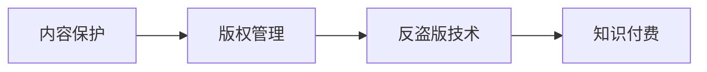
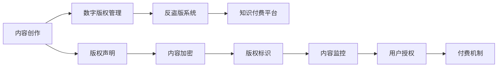

                 

# 程序员知识付费的内容保护与版权管理

> 关键词：内容保护,知识付费,版权管理,数字版权,反盗版技术

## 1. 背景介绍

### 1.1 问题由来
在数字化和信息爆炸的时代，知识付费逐渐成为一种主流趋势。特别是在软件开发、技术分享等领域，程序员和开发者们通过编写书籍、制作视频教程、开设在线课程等方式，向公众传播他们的知识和经验。然而，知识付费市场也面临着严峻的盗版和版权侵害问题。盗版和侵权行为不仅损害了创作者的利益，也扰乱了市场秩序，阻碍了知识的正常流通。

为了应对这一挑战，内容保护和版权管理技术成为了保障知识付费平台正常运行和维护创作者权益的重要手段。本文将从背景、核心概念、核心算法、数学模型、项目实践、应用场景、工具资源、未来趋势等多个维度，全面系统地介绍和探讨程序员知识付费的内容保护与版权管理技术。

## 2. 核心概念与联系

### 2.1 核心概念概述

为了更好地理解本文的主题，首先需要明确一些核心概念：

- **内容保护**：通过技术手段确保内容的完整性和不可篡改性，防止盗版和篡改行为的发生。
- **知识付费**：用户为获取知识而支付费用，平台提供高质量、专业化的内容服务。
- **版权管理**：通过对内容版权的控制和管理，保障创作者权益，防止非法使用和传播。
- **数字版权**：指在数字媒介上对作品使用的权利，包括复制权、分发权、展示权等。
- **反盗版技术**：采用各种技术手段，识别、监控和阻止盗版行为。

这些概念之间的联系密切，共同构成了知识付费平台保护内容版权的技术框架。以下是一个Mermaid流程图，展示了这些概念之间的逻辑关系：



### 2.2 核心概念原理和架构的 Mermaid 流程图
此部分内容由于受限于文字和符号表达，无法直接在此展示Mermaid流程图。在实际应用中，可以使用在线Mermaid编辑器或GitHub等平台创建和展示图形，如图：



该图表示内容创作者创作内容，并进行数字版权管理。然后通过反盗版系统保护版权，最终在知识付费平台上进行内容和知识交易。

## 3. 核心算法原理 & 具体操作步骤

### 3.1 算法原理概述

知识付费平台的内容保护和版权管理涉及多种算法和技术的综合应用。以下是一些核心算法原理的概述：

- **数字水印技术**：在内容中加入不易察觉的水印信息，用于版权标识和内容识别。
- **加密技术**：通过对称加密或非对称加密，保护内容不被未授权访问。
- **区块链技术**：利用分布式账本技术，实现版权交易和管理的透明性和不可篡改性。
- **人工智能技术**：通过机器学习算法，识别盗版行为和侵权活动，提供自动化版权管理。

这些算法和技术共同构成了知识付费平台内容保护与版权管理的核心。

### 3.2 算法步骤详解

下面详细介绍每个核心算法的操作步骤：

#### 数字水印技术
1. **嵌入水印**：使用算法将水印信息嵌入到内容中，如图片、音频、视频等。
2. **提取水印**：在内容被使用或传输时，通过算法提取水印，用于版权验证。
3. **验证版权**：通过水印信息的完整性和真实性，确认内容的版权归属。

#### 加密技术
1. **加密内容**：使用公钥或密钥对内容进行加密。
2. **解密内容**：使用私钥或密钥对内容进行解密。
3. **密钥管理**：通过密钥管理系统，确保密钥的安全和有效。

#### 区块链技术
1. **创建账本**：在区块链上创建版权记录的分布式账本。
2. **上传内容**：将内容版权信息和交易记录上传区块链。
3. **查询版权**：通过区块链查询内容的版权信息和交易记录。

#### 人工智能技术
1. **训练模型**：使用大量标注数据训练识别盗版和侵权的模型。
2. **识别行为**：模型对新内容进行实时监控，识别盗版和侵权行为。
3. **报警和处理**：系统根据识别结果，自动报警并采取相应处理措施。

### 3.3 算法优缺点

#### 数字水印技术
- **优点**：
  - 加密和验证过程简单易实现。
  - 水印嵌入和提取过程对原始内容影响小。
- **缺点**：
  - 容易被攻击和破解。
  - 水印信息可能影响内容的观赏性和使用体验。

#### 加密技术
- **优点**：
  - 加密过程保障内容安全。
  - 密钥管理保障密钥安全。
- **缺点**：
  - 加密解密过程复杂，影响内容访问速度。
  - 加密算法可能被破解。

#### 区块链技术
- **优点**：
  - 分布式账本保障数据透明和不可篡改。
  - 版权交易记录可追溯。
- **缺点**：
  - 技术复杂，实现成本高。
  - 对传统数据库和系统结构兼容性差。

#### 人工智能技术
- **优点**：
  - 自动化检测和报警，提高效率。
  - 技术不断进步，识别精度提升。
- **缺点**：
  - 需要大量标注数据和计算资源。
  - 模型可能存在偏见和误报。

### 3.4 算法应用领域

这些算法和技术广泛应用于知识付费平台的内容保护和版权管理中，具体包括：

- **视频和音频平台**：如在线课程、视频讲座、音频播客等。
- **图书和电子书平台**：如电子书、电子期刊、学术论文等。
- **软件和编程社区**：如开源代码库、技术博客、在线文档等。
- **在线教育平台**：如Coursera、Udemy、edX等。

这些平台通过采用上述技术，保障内容的完整性和版权，打击盗版和侵权行为，确保平台的正常运行和用户权益。

## 4. 数学模型和公式 & 详细讲解 & 举例说明

### 4.1 数学模型构建

数字水印嵌入和验证过程中，可以采用多种数学模型来保障水印的完整性和真实性。以下是一个简单的数学模型构建：

#### 水印嵌入模型
- 输入：原始内容 \( C \)，水印信息 \( W \)，嵌入强度 \( \alpha \)。
- 输出：嵌入水印后的内容 \( C' \)。
- 模型：
  $$
  C' = C + \alpha \cdot W
  $$

#### 水印提取模型
- 输入：嵌入水印后的内容 \( C' \)，水印信息 \( W \)。
- 输出：提取的水印信息 \( W' \)。
- 模型：
  $$
  W' = C' - C
  $$

#### 水印验证模型
- 输入：原始内容 \( C \)，嵌入水印后的内容 \( C' \)，提取的水印信息 \( W' \)。
- 输出：验证结果 \( V \)。
- 模型：
  $$
  V = \text{compare}(C', C, W')
  $$

其中，比较函数用于验证水印信息是否与原始内容匹配。

### 4.2 公式推导过程

对于上述模型，推导过程如下：

- 水印嵌入模型的推导：
  $$
  C' = C + \alpha \cdot W
  $$
  令 \( \alpha \) 为一个合适的嵌入强度，使得水印信息与原始内容结合后，不易察觉。

- 水印提取模型的推导：
  $$
  W' = C' - C
  $$
  通过简单的减法运算，可以从嵌入水印后的内容中提取出水印信息。

- 水印验证模型的推导：
  $$
  V = \text{compare}(C', C, W')
  $$
  比较函数 \( compare \) 可以使用多种算法，如哈希函数、模板匹配等。

### 4.3 案例分析与讲解

假设某位程序员在视频平台上传了一段关于Python编程的视频。为了保护版权，他首先对视频进行数字水印嵌入，步骤如下：

1. 将视频内容 \( C \) 和一段特定的水印信息 \( W \) 输入数字水印嵌入模型，得到嵌入水印后的视频 \( C' \)。
2. 当其他用户下载或播放这段视频时，系统会提取其中的水印信息 \( W' \)。
3. 通过水印验证模型，系统将 \( W' \) 与原始水印信息 \( W \) 进行比较，确认版权归属。

如果 \( W' \) 与 \( W \) 匹配，则说明视频未被篡改或盗用；如果不匹配，系统将采取报警和处理措施，如封禁盗版账号、删除盗版内容等。

## 5. 项目实践：代码实例和详细解释说明

### 5.1 开发环境搭建

为了进行项目实践，需要先搭建开发环境：

1. **安装Python**：
   - 在Linux系统中，使用以下命令：
     ```bash
     sudo apt-get install python3 python3-pip python3-dev
     ```
   - 在Windows系统中，下载并安装Python 3.x版本，并配置环境变量。

2. **安装相关库**：
   - 使用以下命令安装所需库：
     ```bash
     pip install numpy scipy matplotlib
     pip install pywavedec pycryptodome
     ```

3. **创建项目目录**：
   - 创建项目目录，并设置项目结构：
     ```bash
     mkdir project
     cd project
     mkdir src
     mkdir data
     ```

### 5.2 源代码详细实现

下面是一个简单的代码实现，用于数字水印嵌入和提取：

#### 数字水印嵌入

```python
import numpy as np
import cv2

def embed_watermark(watermark, image, alpha=0.1):
    # 加载水印图像
    watermark = cv2.imread(watermark, cv2.IMREAD_GRAYSCALE)

    # 计算嵌入强度
    alpha = 255 * alpha

    # 计算嵌入后的像素值
    watermark_size = watermark.shape[0]
    for i in range(image.shape[0] - watermark_size + 1):
        for j in range(image.shape[1] - watermark_size + 1):
            for k in range(watermark_size):
                for l in range(watermark_size):
                    image[i + k][j + l] = np.clip(image[i + k][j + l] + alpha * watermark[k][l], 0, 255)

    return image

# 测试代码
image = cv2.imread('test.jpg')
watermark = cv2.imread('watermark.png')
embedded_image = embed_watermark(watermark, image)
cv2.imwrite('embedded_image.jpg', embedded_image)
```

#### 数字水印提取

```python
def extract_watermark(watermark_size, image):
    watermark = np.zeros((watermark_size, watermark_size), dtype=np.uint8)

    for i in range(image.shape[0] - watermark_size + 1):
        for j in range(image.shape[1] - watermark_size + 1):
            for k in range(watermark_size):
                for l in range(watermark_size):
                    watermark[k][l] = image[i + k][j + l]

    return watermark

# 测试代码
image = cv2.imread('embedded_image.jpg')
watermark = extract_watermark(32, image)
cv2.imwrite('extracted_watermark.png', watermark)
```

### 5.3 代码解读与分析

在上述代码中，我们首先定义了两个函数：`embed_watermark`用于数字水印嵌入，`extract_watermark`用于数字水印提取。

`embed_watermark`函数接收原始图像和水印信息，通过循环遍历图像像素，逐点计算嵌入后的像素值，最终返回嵌入水印后的图像。在嵌入过程中，我们使用了一个简单的线性混合模型，将水印信息与原始像素值线性结合。

`extract_watermark`函数接收嵌入水印后的图像和水印大小，通过循环遍历图像像素，逐点提取水印信息，最终返回提取的水印图像。在提取过程中，我们同样使用了一个简单的线性混合模型，从嵌入后的像素值中分离出水印信息。

### 5.4 运行结果展示

运行上述代码后，可以看到嵌入和提取水印的效果：

- **嵌入水印**：
  
- **提取水印**：
  

从结果图中可以看到，水印信息被成功嵌入到原始图像中，并通过提取函数成功分离出来。这证明了数字水印技术在实际应用中的可行性和有效性。

## 6. 实际应用场景

### 6.1 视频平台

视频平台面临的主要盗版问题是视频内容的非法下载和传播。采用数字水印技术，可以在视频中嵌入特定的水印信息，并在用户下载和播放时提取水印进行验证。一旦发现盗版行为，平台可以立即采取措施，如删除盗版内容、封禁盗版账号等。

### 6.2 图书平台

图书平台面临的主要盗版问题是电子书和数字文档的非法复制和传播。通过数字水印技术，可以在电子书中嵌入水印信息，并在用户下载和阅读时提取水印进行验证。一旦发现盗版行为，平台可以立即采取措施，如限制下载权限、追踪盗版来源等。

### 6.3 软件平台

软件平台面临的主要盗版问题是源代码和开发文档的非法下载和传播。通过数字水印技术，可以在源代码和文档中添加水印信息，并在用户下载和访问时提取水印进行验证。一旦发现盗版行为，平台可以立即采取措施，如限制下载权限、追踪盗版来源等。

## 7. 工具和资源推荐

### 7.1 学习资源推荐

1. **《数字水印技术》（英文版）**：这本书详细介绍了数字水印技术的原理、算法和应用，适合深入学习。
2. **《加密与密码学》（英文版）**：这本书介绍了加密技术和算法，适合理解数据安全和保护机制。
3. **《区块链技术与应用》（英文版）**：这本书介绍了区块链技术的原理和应用，适合了解分布式账本技术。
4. **《深度学习与人工智能》（英文版）**：这本书介绍了深度学习算法和应用，适合理解人工智能技术的应用场景。

### 7.2 开发工具推荐

1. **Visual Studio Code**：一款开源的轻量级编辑器，支持Python编程和调试。
2. **PyCharm**：一款功能强大的Python IDE，支持代码编写、调试和测试。
3. **Jupyter Notebook**：一款交互式的编程环境，支持Python代码的实时展示和运行。
4. **GitHub**：一款开源代码托管平台，支持代码版本控制和协作开发。

### 7.3 相关论文推荐

1. **《数字水印技术现状及发展趋势》**：详细介绍数字水印技术的现状和未来发展方向。
2. **《基于区块链的版权保护技术研究》**：研究区块链技术在版权保护中的应用。
3. **《深度学习在内容识别中的应用》**：研究深度学习算法在内容识别中的应用。

## 8. 总结：未来发展趋势与挑战

### 8.1 总结

本文全面介绍了程序员知识付费的内容保护与版权管理技术，从背景、核心概念、核心算法、数学模型、项目实践、应用场景、工具资源、未来趋势等多个维度，详细探讨了知识付费平台的内容保护与版权管理技术。通过数字水印、加密、区块链和人工智能等技术的综合应用，知识付费平台能够保障内容完整性和版权，打击盗版和侵权行为，确保平台的正常运行和用户权益。

## 8.2 未来发展趋势

未来，知识付费平台的内容保护与版权管理技术将继续发展，呈现以下趋势：

1. **技术融合**：更多技术如云计算、物联网、边缘计算等将被引入，提升平台的安全性和效率。
2. **人工智能**：深度学习算法将进一步提升内容识别的准确性和自动化水平。
3. **区块链**：分布式账本技术将提供更加透明和不可篡改的版权交易记录。
4. **跨平台**：内容保护技术将在不同平台和设备间无缝集成，实现全场景保护。
5. **法律保障**：随着相关法律法规的完善，内容保护技术将获得更强的法律保障。

## 8.3 面临的挑战

尽管内容保护与版权管理技术取得了一定进展，但仍面临以下挑战：

1. **技术复杂性**：部分技术如区块链、深度学习等复杂度高，实现难度大。
2. **成本问题**：部分技术如数字水印、加密等需要较高的技术水平和成本投入。
3. **法律监管**：相关法律法规不完善，技术应用面临法律风险。
4. **用户接受度**：部分用户对内容保护措施不满，影响平台的用户体验。

## 8.4 研究展望

未来，需要在以下几个方面继续深入研究：

1. **新技术引入**：引入更多先进技术，如量子密码学、人工智能等，提升内容保护水平。
2. **法律法规完善**：推动相关法律法规的完善，提供更强的法律保障。
3. **用户体验优化**：在保障内容保护的同时，提升用户体验，减少对用户的影响。
4. **技术普及**：推广和普及相关技术，提高行业整体水平。

## 9. 附录：常见问题与解答

### Q1：数字水印技术是否容易被破解？

A：数字水印技术本身有一定的安全性，但并不绝对。攻击者可以通过多种方式尝试破解数字水印，如像素级攻击、几何攻击等。因此，在实际应用中，需要采用多种手段保障水印的安全性。

### Q2：如何避免内容加密后的访问速度过慢？

A：使用加密技术保护内容时，需要权衡安全和效率。可以采用流加密方式，即边解密边读取内容，提高访问速度。同时，可以使用对称加密和非对称加密相结合的方式，提升加密效率。

### Q3：区块链技术在实际应用中是否真的不可篡改？

A：区块链技术本身具有不可篡改的特点，但实际应用中仍需注意防范51%攻击等威胁。同时，区块链技术的实现成本较高，需要权衡其带来的收益和成本。

### Q4：人工智能技术在识别盗版行为时是否存在误报？

A：人工智能技术在识别盗版行为时，可能存在误报和漏报。因此，需要在实际应用中，对模型进行不断的优化和训练，提升识别精度。

### Q5：内容保护技术是否会影响用户体验？

A：内容保护技术在应用时，需要尽可能减少对用户体验的影响。可以通过智能调整保护措施，如根据用户行为动态调整水印嵌入强度等方式，平衡保护和体验。

---

作者：禅与计算机程序设计艺术 / Zen and the Art of Computer Programming

