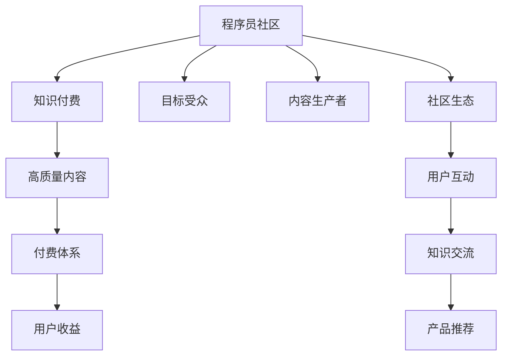

                 

# 程序员知识付费：打造付费社群

## 1. 背景介绍

### 1.1 问题由来
随着互联网技术的发展，程序员作为软件开发的核心力量，其地位和影响力不断提升。与此同时，如何通过知识付费实现个人品牌价值最大化，成为越来越多程序员关注的焦点。特别是在新冠疫情全球蔓延的态势下，远程办公和线上工作模式成为常态，知识付费成为程序员提升自身价值的重要手段之一。

### 1.2 问题核心关键点
知识付费的本质是通过提供高质量内容，帮助用户解决问题、提升技能。在程序员社区中，知识付费的关键点包括：

- 如何定位目标受众。程序员社区的用户群体庞大且多样化，需明确目标人群的痛点和需求。
- 如何打造优质内容。内容必须紧贴市场和用户需求，包含深度技术文章、代码实践、项目案例等。
- 如何构建付费体系。设立合理的定价机制，提供多样化付费选项，如单次购买、订阅制、增值服务等。
- 如何打造可持续的社区生态。吸引用户付费的前提是建立良好的用户体验和社区氛围。

### 1.3 问题研究意义
开展程序员知识付费，有助于程序员通过高质量内容获得收入，同时也能帮助用户提升技能、解决问题。这对构建健康、活跃的程序员社区，促进技术交流与合作具有重要意义。此外，知识付费还可以带动技术书籍、工具等周边产品销售，进一步拓展程序员社区的经济链条。

## 2. 核心概念与联系

### 2.1 核心概念概述

在知识付费的语境下，本文涉及的关键概念包括：

- 程序员社区：指基于编程语言、技术栈、职业发展等话题，形成的线上社区，用户以程序员为主。
- 知识付费：指以技术文章、视频、在线课程等形式，提供有价值的内容，通过付费机制实现知识和技能传播。
- 目标受众：指社区知识内容的主要受益者，包括初级、中级、高级开发者等不同阶段的用户。
- 内容生产者：指在社区中分享知识、技术经验、项目案例的创作者。
- 社区生态：指通过用户互动、知识交流、产品推荐等行为，形成稳定、可持续的社区环境。

这些概念之间有着紧密的联系，共同构成了程序员知识付费的生态系统。

### 2.2 核心概念原理和架构的 Mermaid 流程图(Mermaid 流程节点中不要有括号、逗号等特殊字符)



这个流程图展示了核心概念之间的联系，以及从社区到付费体系，再到用户收益的整个流程。

## 3. 核心算法原理 & 具体操作步骤
### 3.1 算法原理概述

程序员知识付费的核心算法原理，在于通过提供高质量、具有实用价值的内容，满足目标受众的需求。具体来说，知识付费的过程可以分为以下几个步骤：

1. **用户画像建模**：分析目标受众的基本信息、技术水平、学习需求等，构建详细的用户画像。
2. **内容质量评估**：对用户上传的内容进行质量评估，确保其具有高度实用性、创新性和参考价值。
3. **定价与付费机制设计**：根据内容质量和用户画像，设定合理的定价策略，提供灵活的付费选项，如单次购买、订阅制、增值服务等。
4. **用户反馈与迭代**：收集用户反馈，对内容进行调整和优化，形成良性循环，不断提升内容质量。
5. **社区生态构建**：通过内容分享、讨论、合作等方式，构建健康、活跃的社区环境。

### 3.2 算法步骤详解

#### 步骤1：用户画像建模

1. **数据收集**：通过问卷调查、用户行为分析等方式，收集目标受众的基本信息、技术背景、学习需求等数据。
2. **画像构建**：使用机器学习技术，如聚类算法、分类算法等，对数据进行处理和分析，构建详细的用户画像。
3. **画像应用**：根据用户画像，推荐适合的内容，优化内容生产与分发策略。

#### 步骤2：内容质量评估

1. **内容审查**：对用户上传的内容进行自动和人工审查，确保内容质量。
2. **质量评估指标**：设定内容质量评估指标，如阅读量、评价数、分享数等，用于衡量内容受欢迎程度和实用性。
3. **内容优化**：对质量低的内容进行调整和优化，提高其参考价值和传播效果。

#### 步骤3：定价与付费机制设计

1. **定价策略**：根据内容类型、质量和用户画像，设定合理的定价策略，如按篇定价、按月订阅、按次付费等。
2. **付费选项**：提供多样化的付费选项，如单次购买、订阅制、增值服务等，满足不同用户的需求。
3. **支付集成**：与支付平台（如支付宝、微信支付等）进行集成，简化支付流程，提高用户支付便捷性。

#### 步骤4：用户反馈与迭代

1. **反馈收集**：通过用户评论、评分、问卷等方式，收集用户反馈。
2. **反馈分析**：对用户反馈进行分析，识别问题所在，优化内容生产和分发策略。
3. **内容迭代**：根据用户反馈，对内容进行调整和优化，提升内容质量和用户体验。

#### 步骤5：社区生态构建

1. **内容分享**：鼓励用户分享自己的项目、技术文章等，形成良性互动。
2. **讨论交流**：建立论坛、社交群组等，促进用户之间的知识交流和经验分享。
3. **合作协作**：通过合作项目、技术竞赛等方式，提升社区凝聚力和用户参与度。

### 3.3 算法优缺点

#### 优点：

1. **提高收入**：通过知识付费，程序员可以直接获得经济收益，实现价值最大化。
2. **促进学习**：高质量内容帮助用户提升技术水平和解决问题的能力，形成良性循环。
3. **提升社区活跃度**：多样化付费选项和丰富内容生态，增加用户粘性，提升社区活跃度。

#### 缺点：

1. **内容质量控制难度大**：大量内容涌入，质量参差不齐，难以全面把控。
2. **用户需求多样**：不同用户需求差异大，单一定价机制难以满足多样化需求。
3. **用户流失风险**：付费机制不当或内容质量问题可能导致用户流失。

### 3.4 算法应用领域

程序员知识付费的应用领域广泛，主要体现在以下几个方面：

- **技术文章与博客**：程序员通过撰写技术文章和博客，分享技术经验和项目案例，获取收入和曝光。
- **在线课程与视频**：制作高质量的在线课程和视频，提供实战教程，满足用户的学习需求。
- **技术培训与咨询服务**：提供一对一的技术培训和咨询服务，帮助用户解决技术问题。
- **代码库与项目展示**：通过代码库和项目展示，分享自己的代码和项目成果，吸引用户关注和付费。
- **知识问答与技术支持**：建立知识问答平台，提供技术支持和问题解答，增强用户粘性。

## 4. 数学模型和公式 & 详细讲解 & 举例说明

### 4.1 数学模型构建

本文以程序员知识付费的定价策略为例，构建一个简单的数学模型。假设目标受众数量为 $N$，内容质量指数为 $Q$，付费价格为 $P$，收益率为 $R$，则定价模型可以表示为：

$$
R = P \times N \times Q
$$

其中，$P$ 为每次付费的价格，$N$ 为付费用户数量，$Q$ 为内容质量指数。

### 4.2 公式推导过程

对于 $P$，可以设定一个基准价格 $P_0$，并根据内容质量 $Q$ 进行调整。如果内容质量越高，则价格 $P$ 应相应提高，以确保高质量内容的价值得到体现。具体公式为：

$$
P = P_0 \times Q^k
$$

其中 $k$ 为调整系数，通常设定为 1.1 至 1.3 之间。

### 4.3 案例分析与讲解

假设某个程序员社区有 1000 名用户，内容质量指数为 0.8。根据定价模型，可以计算出收益率为：

$$
R = P \times 1000 \times 0.8 = P \times 800
$$

如果每次付费价格为 $P_0=10$ 元，内容质量指数为 0.8，则每次付费价格为 $P = 10 \times 0.8^{1.1} = 8.16$ 元。此时，该社区每月可获得的收益为：

$$
R = 8.16 \times 1000 \times 0.8 = 6496
$$

这表明，通过合理的定价策略和内容质量评估，程序员社区可以显著提高收入。

## 5. 项目实践：代码实例和详细解释说明

### 5.1 开发环境搭建

为了构建程序员知识付费社群，需要搭建一个完整的技术开发环境。以下是详细的步骤：

1. **选择编程语言**：可以选择 Python、JavaScript 等编程语言，进行后端开发。
2. **搭建后端服务**：使用 Flask、Django 等框架，搭建社区的后端服务。
3. **集成支付接口**：与支付宝、微信支付等支付平台进行集成，实现付费功能。
4. **部署数据库**：使用 MySQL、PostgreSQL 等关系型数据库，存储用户数据和付费记录。
5. **部署前端界面**：使用 React、Vue 等前端框架，搭建社区的前端界面。

### 5.2 源代码详细实现

以下是一个简单的社区平台实现代码示例：

```python
# 后端服务代码示例
from flask import Flask, request, jsonify
from flask_sqlalchemy import SQLAlchemy

app = Flask(__name__)
app.config['SQLALCHEMY_DATABASE_URI'] = 'sqlite:///users.db'
db = SQLAlchemy(app)

class User(db.Model):
    id = db.Column(db.Integer, primary_key=True)
    name = db.Column(db.String(50))
    email = db.Column(db.String(50))
    # 其他用户信息

@app.route('/register', methods=['POST'])
def register():
    data = request.get_json()
    user = User(name=data['name'], email=data['email'])
    db.session.add(user)
    db.session.commit()
    return jsonify({'success': True})

@app.route('/login', methods=['POST'])
def login():
    data = request.get_json()
    user = User.query.filter_by(email=data['email']).first()
    if not user:
        return jsonify({'success': False})
    # 其他登录逻辑
    return jsonify({'success': True})
```

### 5.3 代码解读与分析

以上代码示例实现了用户注册和登录功能，使用 Flask 框架搭建后端服务。其中，`User` 类表示用户数据模型，`register` 和 `login` 函数分别实现了用户注册和登录功能。使用 SQLAlchemy 进行数据库操作，可以方便地存储和管理用户数据。

### 5.4 运行结果展示

用户注册和登录功能完成后，可以在前端页面上展示成功注册和登录的界面，如图：

```plaintext
注册界面：
<form>
    <input type="text" name="name" placeholder="输入用户名">
    <input type="text" name="email" placeholder="输入邮箱">
    <button type="submit">注册</button>
</form>

登录界面：
<form>
    <input type="text" name="email" placeholder="输入邮箱">
    <input type="password" name="password" placeholder="输入密码">
    <button type="submit">登录</button>
</form>
```

## 6. 实际应用场景

### 6.1 智能客服系统

知识付费社群可以提供智能客服系统的技术支持，帮助企业提升客户服务水平。通过社群中的智能客服系统，用户可以获取技术支持、问题解答、产品使用指南等，提升用户体验。

### 6.2 金融分析平台

金融分析师可以利用知识付费社群，获取最新的金融分析和投资策略，提升自己的专业水平。通过社群中的专家讲座、技术培训等，用户可以获取有价值的信息和知识。

### 6.3 健康医疗平台

健康医疗领域的专家和从业者可以通过知识付费社群，获取最新的医疗技术和治疗方案，提升医疗服务质量。通过社群中的技术讨论、专家解答等，用户可以获取有价值的信息和知识。

### 6.4 未来应用展望

知识付费社群的应用场景丰富多样，未来将有更多的创新应用。以下是一些未来展望：

- **教育培训平台**：利用社群中的技术知识和培训课程，帮助学生提升技能，解决学习问题。
- **创业孵化平台**：为创业者提供技术指导、项目融资、市场推广等支持，促进创新创业。
- **社区交流平台**：搭建多样化的交流平台，促进用户之间的技术交流和合作，形成良好的社区生态。

## 7. 工具和资源推荐

### 7.1 学习资源推荐

1. **在线课程**：Coursera、Udacity、edX 等在线课程平台，提供丰富的编程课程和技术培训。
2. **技术博客**：GitHub、CSDN、Stack Overflow 等平台，汇聚大量技术文章和代码实践。
3. **技术社区**：Stack Overflow、GitHub、Slack 等社区平台，促进技术交流和合作。
4. **开源项目**：Github、GitLab 等平台，提供大量的开源项目和代码库，供用户学习和借鉴。
5. **书籍资源**：Amazon、当当网等平台，提供大量高质量的编程书籍和技术资料。

### 7.2 开发工具推荐

1. **编程语言**：Python、JavaScript、Java 等主流编程语言，广泛应用于前端和后端开发。
2. **开发框架**：Flask、Django、React、Vue 等框架，提供丰富的开发工具和库。
3. **数据库**：MySQL、PostgreSQL、MongoDB 等关系型和 NoSQL 数据库，存储和管理数据。
4. **版本控制**：Git 版本控制系统，提供代码管理和协作功能。
5. **构建工具**：Webpack、Maven、Gradle 等构建工具，自动化构建和管理项目。

### 7.3 相关论文推荐

1. **《程序员社区的兴起与挑战》**：探讨程序员社区的发展趋势和面临的挑战，提出解决方案。
2. **《知识付费的现状与未来》**：分析知识付费的现状和未来发展方向，提供理论支撑和实践指导。
3. **《程序员社区的数据分析与优化》**：通过数据分析和优化技术，提升程序员社区的用户体验和质量。
4. **《知识付费模型的构建与优化》**：提出知识付费模型的构建方法，优化内容推荐和定价策略。
5. **《程序员社区的推荐系统》**：研究程序员社区中的推荐系统，提升内容分发效率和用户满意度。

## 8. 总结：未来发展趋势与挑战

### 8.1 研究成果总结

本文从知识付费的角度，探讨了程序员社区的发展方向和应用场景。知识付费通过高质量的内容和技术交流，满足用户需求，帮助程序员实现个人价值最大化。未来，知识付费将成为程序员社区的重要经济模式。

### 8.2 未来发展趋势

知识付费的未来发展趋势包括：

1. **内容多样化**：除了技术文章和课程，还将出现更多形式的知识付费，如在线直播、技术咨询服务等。
2. **智能化推荐**：利用机器学习算法，提升内容推荐的准确性和个性化程度。
3. **社区生态完善**：通过用户互动和内容分享，构建稳定、活跃的社区环境。
4. **跨领域融合**：知识付费与人工智能、大数据等技术的结合，将带来更多创新应用。

### 8.3 面临的挑战

知识付费社群的发展面临以下挑战：

1. **内容质量控制**：大量内容涌入，质量参差不齐，难以全面把控。
2. **用户需求多样**：不同用户需求差异大，单一定价机制难以满足多样化需求。
3. **用户体验提升**：如何提升用户体验，增强用户粘性，是知识付费社群发展的关键。
4. **社区生态构建**：构建健康、活跃的社区生态，形成良好的用户互动和知识交流。

### 8.4 研究展望

未来，知识付费社群将进一步发展，成为程序员社区的重要组成部分。以下是一些研究展望：

1. **知识付费模型的优化**：通过机器学习算法，提升内容推荐的准确性和个性化程度。
2. **跨领域融合**：知识付费与人工智能、大数据等技术的结合，将带来更多创新应用。
3. **社区生态构建**：通过用户互动和内容分享，构建稳定、活跃的社区环境。
4. **智能推荐系统**：利用智能推荐算法，提升内容分发的效率和用户满意度。

## 9. 附录：常见问题与解答

### 常见问题 1：知识付费社群如何进行内容质量控制？

**解答**：可以通过以下几种方式进行内容质量控制：

1. **用户评价与反馈**：通过用户评价和反馈，筛选高质量内容。
2. **专家审核**：邀请行业专家对内容进行审核，保证内容质量。
3. **内容审查机制**：建立自动和人工相结合的内容审查机制，严格把控内容质量。

### 常见问题 2：如何提升知识付费社群的用户体验？

**解答**：可以通过以下几种方式提升用户体验：

1. **用户界面优化**：优化前端界面，提升用户体验。
2. **个性化推荐**：利用机器学习算法，提升内容推荐的准确性和个性化程度。
3. **互动交流机制**：建立用户互动交流机制，增强用户粘性。

### 常见问题 3：知识付费社群如何进行盈利？

**解答**：知识付费社群的盈利方式包括：

1. **付费内容销售**：通过提供高质量内容，获取用户的付费支持。
2. **广告收入**：在社区中引入广告，获取广告收入。
3. **增值服务**：提供如技术培训、技术支持等增值服务，获取收益。

### 常见问题 4：知识付费社群如何构建稳定的社区生态？

**解答**：可以通过以下几种方式构建稳定的社区生态：

1. **用户互动机制**：建立用户互动机制，促进用户之间的交流和合作。
2. **内容分享机制**：鼓励用户分享自己的项目和技术经验，形成良好的社区氛围。
3. **社区合作机制**：通过合作项目、技术竞赛等方式，提升社区凝聚力和用户参与度。

### 常见问题 5：知识付费社群如何应对用户需求多样性？

**解答**：可以通过以下几种方式应对用户需求多样性：

1. **多样化定价机制**：提供多样化的付费选项，如单次购买、订阅制、增值服务等，满足不同用户的需求。
2. **内容差异化**：根据用户需求，提供差异化的内容，满足不同用户的需求。
3. **社区定制化**：根据用户需求，定制化社区服务，提升用户满意度。

---

作者：禅与计算机程序设计艺术 / Zen and the Art of Computer Programming

