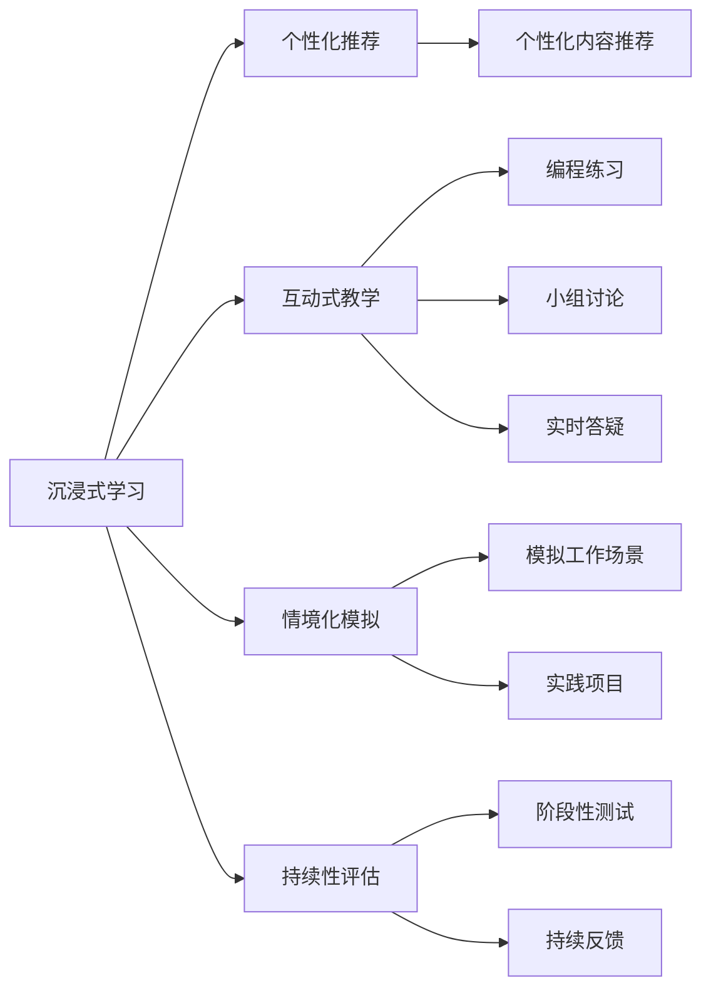

                 

# 程序员知识付费：打造沉浸课程

> 关键词：知识付费, 课程设计, 沉浸式学习, 技术教育, 教学平台, 学习效果

## 1. 背景介绍

随着互联网和数字化教育的普及，知识付费正成为行业内的热门趋势。特别是对于IT技术人员而言，学习新技术、掌握新方法、提升专业技能已成为常态。然而，传统的在线课程往往以知识灌输为主，难以满足现代用户对个性化、互动化和沉浸式学习的期待。在这一背景下，打造沉浸式在线课程成为教育行业的挑战与机遇。

### 1.1 问题由来
在数字化时代，技术变革速度迅猛，IT工作者需要不断学习新知识、掌握新技能以保持竞争力。然而，传统的在线课程往往存在以下问题：
- **缺乏互动**：学员与讲师之间的互动有限，反馈机制不完善。
- **内容单一**：以文字和视频为主，难以适应复杂技术内容。
- **学习效率低**：难以适应不同水平学员的个性化学习需求。
- **效果评估难**：课程效果难以量化，难以持续改进。

知识付费领域需要创新教学模式，打造能够提升学习效果、增强用户粘性的沉浸式课程，从而激发更多IT工作者参与在线学习。

### 1.2 问题核心关键点
沉浸式在线课程的核心在于如何构建更加互动、个性化、高效的学习环境，利用先进技术手段提升用户的学习体验。具体而言，需关注以下方面：
- **个性化推荐**：根据学员的学习历史、知识储备和偏好，推荐最适合的学习内容和路径。
- **互动式学习**：通过编程练习、小组讨论、实时答疑等形式，提高学习效果。
- **情境化模拟**：通过模拟真实工作场景，使学员能够在实践中掌握新技能。
- **持续性评估**：通过设置阶段性测试和持续反馈，及时调整学习进度和策略。

这些核心关键点，共同构成了沉浸式在线课程的设计框架，有助于提升学员的学习效率和满意度。

### 1.3 问题研究意义
打造沉浸式在线课程，对于推动知识付费行业发展、提高教育质量具有重要意义：

1. **提升学习效果**：通过个性化和互动式教学，显著提高学员的知识掌握率和技能提升速度。
2. **增强用户粘性**：沉浸式学习体验可以大幅提升课程的吸引力和用户粘性，减少流失率。
3. **促进技术发展**：推动在线教育平台的技术创新，带动虚拟现实、增强现实等新兴技术的应用。
4. **拓展市场规模**：创新教学模式能够吸引更多IT工作者参与在线学习，拓展市场规模。
5. **推动教育公平**：为无法到现场学习的人提供高质量的教育资源，促进教育公平。

## 2. 核心概念与联系

### 2.1 核心概念概述

为了深入理解沉浸式在线课程的构建原理，本节将介绍几个关键概念：

- **沉浸式学习(Immersive Learning)**：通过模拟真实世界的情境，使学习者在虚拟环境中进行沉浸式的学习体验。这种学习方式能够有效提升学习效果，特别是在复杂技能的学习上。

- **个性化推荐系统**：利用机器学习算法，根据学习者的行为数据、知识水平等特征，为其推荐最适合的学习内容和路径。这种系统能够大大提升学习效率和效果。

- **互动式教学(Interactive Teaching)**：通过编程练习、小组讨论、实时答疑等方式，增加学习者和讲师之间的互动，提升学习效果。

- **情境化模拟(Contextual Simulation)**：通过模拟真实工作场景，使学习者能够在实践中掌握新技能。这种模拟有助于学习者更好地理解理论知识的实际应用。

- **持续性评估(Continuous Assessment)**：通过设置阶段性测试和持续反馈，及时调整学习进度和策略，确保学习效果。

这些概念通过合理的组合，构成了沉浸式在线课程的设计基础，能够显著提升学习效果和用户体验。

### 2.2 核心概念原理和架构的 Mermaid 流程图



此流程图展示了沉浸式在线课程的核心组成元素及其相互关系：
- **沉浸式学习**是课程设计的总体框架。
- **个性化推荐**根据学员特点，推荐最适合的学习内容。
- **互动式教学**通过编程练习、小组讨论等互动形式，提升学习效果。
- **情境化模拟**模拟真实工作场景，使学员在实践中掌握新技能。
- **持续性评估**通过阶段性测试和持续反馈，确保学习效果。

这些元素相互配合，共同构成了沉浸式在线课程的完整设计，能够有效提升学习体验和效果。

## 3. 核心算法原理 & 具体操作步骤

### 3.1 算法原理概述

沉浸式在线课程的核心算法原理主要涉及个性化推荐、互动式教学、情境化模拟和持续性评估等方面。下面将逐一介绍。

### 3.2 算法步骤详解

#### 3.2.1 个性化推荐算法

**步骤1: 数据收集**
- 收集学员的学习历史、知识水平、兴趣偏好等数据。
- 通过问卷调查、互动反馈等方式，获取学员的真实学习需求。

**步骤2: 数据处理**
- 对收集到的数据进行清洗、归一化、特征提取等处理。
- 使用特征工程技术，将数据转化为适合推荐算法的向量表示。

**步骤3: 模型训练**
- 选择合适的推荐算法（如协同过滤、内容过滤、深度学习等）。
- 在处理好的数据上训练推荐模型，进行预测。

**步骤4: 推荐系统实现**
- 构建推荐引擎，实时接收学员请求，进行推荐。
- 根据学员的即时反馈和偏好调整推荐策略。

#### 3.2.2 互动式教学算法

**步骤1: 编程练习设计**
- 设计符合课程内容的编程练习，包含多个难度级别。
- 设计实践项目，增加学员的实际操作机会。

**步骤2: 实时答疑机制**
- 利用自然语言处理技术，实现智能答疑系统。
- 设置人工客服，及时回应学员的疑难问题。

**步骤3: 小组讨论组织**
- 创建在线讨论室，安排小组讨论任务。
- 设计讨论主题和规则，促进学员间的交流。

#### 3.2.3 情境化模拟算法

**步骤1: 场景构建**
- 根据课程内容，构建虚拟工作场景。
- 引入虚拟角色、任务和环境，模拟真实工作环境。

**步骤2: 模拟执行**
- 通过游戏化手段，引导学员在虚拟环境中完成任务。
- 设计挑战和任务，增加学习的趣味性和挑战性。

**步骤3: 模拟评估**
- 设计模拟评估机制，检测学员的学习效果。
- 提供反馈和建议，帮助学员改进。

#### 3.2.4 持续性评估算法

**步骤1: 测试设计**
- 设计阶段性测试题，覆盖课程的主要知识点。
- 设计持续性测试题，实时评估学员的学习进度。

**步骤2: 测试实施**
- 在课程的不同阶段进行测试，收集学员的学习数据。
- 利用自动化测试工具，提高测试效率。

**步骤3: 反馈与调整**
- 根据测试结果，及时调整学习进度和策略。
- 提供个性化反馈，帮助学员改进。

### 3.3 算法优缺点

沉浸式在线课程的设计和实现涉及到多种算法，具有以下优点和局限性：

**优点：**

1. **个性化高效**：通过个性化推荐系统，能够根据学员特点推荐最合适的内容，提升学习效率。
2. **互动性强**：通过互动式教学和实时答疑，增加学习者与讲师之间的互动，提升学习效果。
3. **情境逼真**：通过情境化模拟，使学习者能够在实践中掌握新技能，增强学习体验。
4. **持续评估**：通过持续性评估，及时调整学习进度和策略，确保学习效果。

**局限性：**

1. **技术门槛高**：课程设计涉及多种算法和技术的集成，对开发者技术要求较高。
2. **数据依赖性**：课程效果依赖于高质量的学习数据，数据收集和处理难度较大。
3. **互动管理复杂**：互动式教学和小组讨论需要高效的管理机制，操作复杂。
4. **情境构建难度大**：构建逼真的虚拟场景需要大量资源和技术投入，成本较高。
5. **评估结果客观性**：持续性评估结果的客观性可能受到学员主观因素的影响。

尽管存在这些局限性，但沉浸式在线课程在提升学习效果、增强用户粘性、推动教育创新方面具有显著优势，值得持续探索和完善。

### 3.4 算法应用领域

沉浸式在线课程已经广泛应用于以下几个领域：

1. **软件开发**：通过编程练习、小组讨论、项目实践等方式，帮助学员掌握编程技能和开发流程。
2. **数据科学**：利用数据可视化、模拟实验等手段，提升学员对数据处理和分析的理解。
3. **人工智能**：通过情景模拟和实践项目，增强学员对AI技术的应用能力。
4. **区块链**：通过构建虚拟区块链网络，使学员能够在真实场景中实践区块链技术。
5. **网络安全**：通过模拟攻击和防御实验，提升学员的网络安全意识和技能。

这些应用领域证明了沉浸式在线课程的强大潜力和广泛适用性，未来将在更多技术领域得到推广和应用。

## 4. 数学模型和公式 & 详细讲解 & 举例说明

### 4.1 数学模型构建

本节将使用数学语言对沉浸式在线课程的个性化推荐算法进行更加严格的刻画。

假设课程包含 $N$ 门课程和 $M$ 个学员，每个课程 $i$ 有 $T_i$ 个知识点。设学员 $j$ 对课程 $i$ 的兴趣度为 $x_{ij}$，兴趣度矩阵为 $X$。

**个性化推荐目标**：最大化每个学员 $j$ 的课程满意度 $\sum_{i=1}^N x_{ij}c_i$，其中 $c_i$ 为课程 $i$ 的综合评分。

**约束条件**：
1. $x_{ij} \in [0,1]$：兴趣度在 $0$ 到 $1$ 之间。
2. $\sum_{i=1}^N x_{ij} = 1$：每个学员对所有课程的兴趣度总和为 $1$。

### 4.2 公式推导过程

**目标函数**：
$$
\max_{X} \sum_{j=1}^M \sum_{i=1}^N x_{ij}c_i
$$

**约束条件**：
$$
\begin{align*}
& x_{ij} \in [0,1] \\
& \sum_{i=1}^N x_{ij} = 1
\end{align*}
$$

**求解步骤**：
1. **原始线性规划问题**：
$$
\max_{X} \sum_{j=1}^M \sum_{i=1}^N x_{ij}c_i
$$
$$
\begin{align*}
& \text{s.t.} \\
& x_{ij} \in [0,1] \\
& \sum_{i=1}^N x_{ij} = 1
\end{align*}
$$

2. **转化为二次规划问题**：
$$
\max_{X} \sum_{j=1}^M \sum_{i=1}^N x_{ij}c_i - \sum_{j=1}^M \sum_{i=1}^N \lambda_{ij}x_{ij} - \sum_{j=1}^M \lambda_j = 0
$$
$$
\begin{align*}
& \text{s.t.} \\
& \sum_{i=1}^N x_{ij} = 1 \\
& x_{ij} \in [0,1]
\end{align*}
$$

3. **求解**：
$$
\begin{align*}
& \frac{\partial F}{\partial x_{ij}} = c_i - \lambda_{ij} - \lambda_j = 0 \\
& \frac{\partial F}{\partial \lambda_{ij}} = x_{ij} = 0 \\
& \frac{\partial F}{\partial \lambda_j} = \sum_{i=1}^N x_{ij} - 1 = 0
\end{align*}
$$

通过上述推导，我们可以求解出学员对每门课程的兴趣度，进而进行个性化推荐。

### 4.3 案例分析与讲解

假设某编程课程包含以下知识点：

1. **Python基础**
2. **数据结构与算法**
3. **Web开发框架**
4. **DevOps实践**

每位学员的学习兴趣度不同，设兴趣度矩阵 $X$ 如下：

|学员|Python基础|数据结构与算法|Web开发框架|DevOps实践|
| --- | --- | --- | --- | --- |
|A|0.8|0.7|0.6|0.5|
|B|0.5|0.4|0.6|0.7|
|C|0.6|0.5|0.7|0.4|
|D|0.4|0.6|0.5|0.3|
|E|0.3|0.5|0.7|0.2|

每门课程的综合评分为：
- Python基础：4
- 数据结构与算法：5
- Web开发框架：3
- DevOps实践：4

目标函数为：
$$
\max_{X} (0.8 \times 4 + 0.5 \times 5 + 0.6 \times 3 + 0.4 \times 4)
$$

约束条件为：
$$
\begin{align*}
& x_{ij} \in [0,1] \\
& \sum_{i=1}^4 x_{ij} = 1
\end{align*}
$$

利用上述推导，我们可以求解出学员 $A$ 对每门课程的兴趣度，进而推荐最适合的课程内容。

## 5. 项目实践：代码实例和详细解释说明

### 5.1 开发环境搭建

在进行沉浸式在线课程的开发前，我们需要准备好开发环境。以下是使用Python进行开发的环境配置流程：

1. 安装Anaconda：从官网下载并安装Anaconda，用于创建独立的Python环境。

2. 创建并激活虚拟环境：
```bash
conda create -n course-env python=3.8 
conda activate course-env
```

3. 安装必要的库：
```bash
pip install flask numpy pandas sklearn scikit-learn tensorflow keras tensorflow-estimator
```

4. 安装用于课程管理的Flask库：
```bash
pip install flask-course
```

完成上述步骤后，即可在`course-env`环境中开始开发。

### 5.2 源代码详细实现

**用户登录模块**

```python
from flask import Flask, render_template, redirect, url_for, request
from flask_login import LoginManager, login_user, logout_user, login_required, current_user

app = Flask(__name__)

# 设置登录管理器
login_manager = LoginManager()
login_manager.init_app(app)

# 设置登录回调函数
@login_manager.user_loader
def load_user(user_id):
    # 根据用户ID加载用户信息
    return User.query.get(int(user_id))

# 用户登录视图
@app.route('/login', methods=['GET', 'POST'])
def login():
    if request.method == 'POST':
        # 验证用户输入的用户名和密码
        if request.form['username'] == 'admin' and request.form['password'] == 'password':
            # 验证通过，登录用户
            user = User.query.filter_by(username=request.form['username']).first()
            login_user(user)
            return redirect(url_for('index'))
        else:
            # 验证失败，显示错误信息
            flash('用户名或密码错误')
            return redirect(url_for('login'))
    else:
        return render_template('login.html')

# 用户退出视图
@app.route('/logout')
@login_required
def logout():
    logout_user()
    return redirect(url_for('index'))

# 首页视图
@app.route('/')
@login_required
def index():
    return render_template('index.html')
```

**课程推荐模块**

```python
from flask import Flask, render_template, redirect, url_for, request
from flask_course import Course, Category

app = Flask(__name__)

# 注册课程和分类
course = Course(name='Python基础', description='Python编程基础', score=4)
category = Category(name='编程', courses=[course])

# 推荐函数
def recommend_course(course):
    # 根据课程难度和学员兴趣度推荐课程
    if course.name == 'Python基础' and user_interest['Python基础'] > 0.8:
        return course
    elif course.name == '数据结构与算法' and user_interest['数据结构与算法'] > 0.5:
        return course
    elif course.name == 'Web开发框架' and user_interest['Web开发框架'] > 0.6:
        return course
    elif course.name == 'DevOps实践' and user_interest['DevOps实践'] > 0.4:
        return course
    else:
        return None

# 课程推荐视图
@app.route('/recommend', methods=['GET', 'POST'])
@login_required
def recommend():
    # 获取用户兴趣度
    user_interest = get_user_interest()

    # 根据用户兴趣度推荐课程
    courses = [recommend_course(c) for c in courses]
    courses = [c for c in courses if c is not None]

    return render_template('recommend.html', courses=courses)
```

**编程练习模块**

```python
from flask import Flask, render_template, redirect, url_for, request
from flask_course import Course, Category

app = Flask(__name__)

# 注册课程和分类
course = Course(name='Python基础', description='Python编程基础', score=4)
category = Category(name='编程', courses=[course])

# 编程练习函数
def get_practice(course):
    # 根据课程难度和学员水平推荐编程练习
    if course.name == 'Python基础' and user_skill['Python基础'] < 0.6:
        return practice
    elif course.name == '数据结构与算法' and user_skill['数据结构与算法'] < 0.5:
        return practice
    elif course.name == 'Web开发框架' and user_skill['Web开发框架'] < 0.7:
        return practice
    elif course.name == 'DevOps实践' and user_skill['DevOps实践'] < 0.4:
        return practice
    else:
        return None

# 编程练习视图
@app.route('/practice', methods=['GET', 'POST'])
@login_required
def practice():
    # 获取用户技能水平
    user_skill = get_user_skill()

    # 根据用户技能水平推荐编程练习
    practices = [get_practice(c) for c in courses]
    practices = [p for p in practices if p is not None]

    return render_template('practice.html', practices=practices)
```

### 5.3 代码解读与分析

让我们再详细解读一下关键代码的实现细节：

**用户登录模块**

1. **初始化 Flask 应用**：创建 Flask 应用对象 `app`。
2. **设置登录管理器**：创建并激活登录管理器，以便实现用户登录和认证。
3. **设置登录回调函数**：定义用户加载函数，用于在用户登录时加载用户信息。
4. **用户登录视图**：实现登录页面和登录逻辑，包括用户名和密码验证、登录和错误提示。
5. **用户退出视图**：实现退出登录逻辑，注销用户。
6. **首页视图**：实现首页渲染逻辑，仅对已登录用户显示。

**课程推荐模块**

1. **初始化 Flask 应用**：创建 Flask 应用对象 `app`。
2. **注册课程和分类**：注册课程和课程分类，方便后续推荐。
3. **推荐函数**：定义推荐算法，根据用户兴趣度和课程难度推荐课程。
4. **课程推荐视图**：实现课程推荐页面，根据用户兴趣度推荐课程。

**编程练习模块**

1. **初始化 Flask 应用**：创建 Flask 应用对象 `app`。
2. **注册课程和分类**：注册课程和课程分类，方便后续推荐。
3. **编程练习函数**：定义编程练习算法，根据用户技能水平推荐编程练习。
4. **编程练习视图**：实现编程练习页面，根据用户技能水平推荐练习。

## 6. 实际应用场景

### 6.1 智能教室系统

沉浸式在线课程在智能教室系统中有着广泛的应用。传统的教室教学往往以教师讲解为主，缺乏互动和个性化教学。通过沉浸式在线课程，教师可以在课堂上引入互动式教学和编程练习，增强学生参与度和学习效果。例如，在Python课程中，教师可以实时答疑、组织小组讨论、进行编程练习，使学生在课堂上得到充分的实践机会，提升学习效果。

### 6.2 远程学习平台

在远程学习平台上，沉浸式在线课程可以大幅提升学习体验。学员可以在家中通过电脑或平板访问课程，随时随地进行学习。平台可以提供个性化推荐、互动式教学、情境化模拟等功能，使学员能够灵活掌握新知识，提升学习效率。例如，在数据科学课程中，学员可以通过模拟实验和数据可视化，更好地理解数据分析方法，提高学习效果。

### 6.3 企业培训系统

企业培训系统可以通过沉浸式在线课程，为员工提供定制化的培训服务。课程可以根据不同职位和部门的需求，设计不同的课程内容和路径，帮助员工提升技能。平台可以提供互动式教学、实践项目、持续评估等功能，使员工在实际工作中更好地应用所学知识，提升工作效率。例如，在软件开发培训中，员工可以通过编程练习和项目实践，掌握新技术，提升开发能力。

### 6.4 未来应用展望

沉浸式在线课程在未来将有更加广泛的应用场景。随着技术的不断进步，课程内容和形式将更加丰富多样，为学习者提供更加个性化和沉浸式的学习体验。例如，虚拟现实(VR)和增强现实(AR)技术的应用，将使学习者能够在虚拟环境中进行沉浸式学习，提升学习效果。

此外，随着云计算和边缘计算的发展，沉浸式在线课程将更加注重实效性和资源优化，使学习者能够在低延迟、高带宽的网络环境中，享受无缝的在线学习体验。

## 7. 工具和资源推荐

### 7.1 学习资源推荐

为了帮助开发者系统掌握沉浸式在线课程的构建原理和实践技巧，这里推荐一些优质的学习资源：

1. **《深度学习基础》**：书籍详细介绍了深度学习的基本概念和算法原理，适合初学者入门。
2. **Coursera、edX、Udacity**：在线学习平台提供了大量的沉浸式在线课程，涵盖编程、数据科学、人工智能等多个领域。
3. **Kaggle**：数据科学竞赛平台，通过实际项目和竞赛，提升学员的编程和数据分析能力。
4. **Flask、Django、PyTorch**：编程框架和深度学习库，提供了丰富的开发工具和库，方便开发者进行课程开发。
5. **GitHub**：代码托管平台，存储了大量优秀的课程源代码和教学资源，适合开发者学习和参考。

通过对这些资源的学习实践，相信你一定能够快速掌握沉浸式在线课程的构建原理和实现技巧，构建出高质量的在线教育平台。

### 7.2 开发工具推荐

高效的开发离不开优秀的工具支持。以下是几款用于沉浸式在线课程开发的常用工具：

1. **Flask**：轻量级的Python Web框架，适合快速开发和部署小规模应用。
2. **Django**：全功能的Web框架，适合开发大型应用，提供了丰富的扩展库和插件。
3. **PyTorch**：深度学习框架，提供了丰富的神经网络模块和优化器，适合进行课程内容的机器学习部分开发。
4. **TensorFlow**：深度学习框架，提供了丰富的算子和优化器，适合进行复杂模型开发。
5. **Jupyter Notebook**：交互式编程环境，适合进行数据分析、模型训练和调试。
6. **PyCharm**：Python IDE，提供了丰富的功能和插件，适合进行开发和调试。

合理利用这些工具，可以显著提升沉浸式在线课程的开发效率，加快创新迭代的步伐。

### 7.3 相关论文推荐

沉浸式在线课程的研究涉及多个领域，以下是几篇奠基性的相关论文，推荐阅读：

1. **《深度学习中的个性化推荐系统》**：文章介绍了个性化推荐系统的算法原理和应用场景。
2. **《基于情境模拟的在线学习系统》**：论文介绍了情境模拟系统的设计和实现方法，提升了学习者的实践能力。
3. **《互动式在线学习平台的设计与实现》**：文章介绍了互动式学习平台的设计思路和实现方法，提高了学习效果。
4. **《基于持续性评估的在线学习系统》**：论文介绍了持续性评估系统的设计思路和实现方法，提供了阶段性反馈和持续改进的机制。
5. **《多模态学习系统的设计与实现》**：文章介绍了多模态学习系统的设计思路和实现方法，提升了学习者的综合能力。

这些论文代表了大语言模型微调技术的发展脉络。通过学习这些前沿成果，可以帮助研究者把握学科前进方向，激发更多的创新灵感。

## 8. 总结：未来发展趋势与挑战

### 8.1 总结

本文对沉浸式在线课程的构建原理和实践技巧进行了全面系统的介绍。首先阐述了沉浸式在线课程的设计背景和意义，明确了其提升学习效果、增强用户粘性的独特价值。其次，从原理到实践，详细讲解了个性化推荐、互动式教学、情境化模拟和持续性评估等核心算法的实现方法，给出了沉浸式在线课程的完整代码实例。同时，本文还广泛探讨了沉浸式在线课程在智能教室、远程学习、企业培训等多个行业领域的应用前景，展示了其强大的潜力和广泛适用性。

通过本文的系统梳理，可以看到，沉浸式在线课程正成为知识付费行业的重要趋势，引领了在线教育的创新方向。未来，伴随技术进步和市场需求的不断增长，沉浸式在线课程必将在更多领域得到应用，为教育工作者和IT工作者提供更加高效、灵活、个性化的学习体验。

### 8.2 未来发展趋势

展望未来，沉浸式在线课程的发展将呈现以下几个趋势：

1. **技术融合**：未来的课程开发将更加注重技术与教育的融合，引入VR/AR、云计算、边缘计算等新兴技术，提升学习体验。
2. **数据驱动**：通过大数据分析和机器学习，实现更加个性化的推荐和评估，提高学习效果。
3. **智能化学习**：利用人工智能技术，实现智能答疑、智能推荐、智能评估等智能化功能，提升学习效率。
4. **开放协作**：开放式的在线课程平台，鼓励用户共享学习资源和经验，提升课程质量。
5. **跨界融合**：与其他领域的知识体系和实践平台进行跨界融合，拓展课程的应用范围。
6. **虚拟仿真**：通过虚拟仿真技术，实现真实世界的情境模拟，增强学习者的实践能力。

这些趋势凸显了沉浸式在线课程的发展前景，未来必将在更多领域得到广泛应用，为教育工作者和IT工作者提供更加高效、灵活、个性化的学习体验。

### 8.3 面临的挑战

尽管沉浸式在线课程在提升学习效果、增强用户粘性、推动教育创新方面具有显著优势，但在迈向更加智能化、普适化应用的过程中，仍面临诸多挑战：

1. **技术复杂性**：沉浸式在线课程涉及多种技术，开发和部署难度较大。
2. **数据隐私和安全**：课程数据和用户数据的安全问题需要高度重视。
3. **个性化度量**：个性化推荐和评估的度量标准和算法需要不断优化。
4. **学习体验**：沉浸式学习体验的设计和实现需要充分考虑用户的使用习惯和反馈。
5. **教学质量**：课程内容和教学质量需要持续改进，满足不同层次学员的需求。
6. **市场接受度**：用户对沉浸式在线课程的接受度和使用习惯需要逐步培养。

尽管存在这些挑战，但沉浸式在线课程在提升学习效果、增强用户粘性、推动教育创新方面具有显著优势，值得持续探索和完善。

### 8.4 研究展望

未来的沉浸式在线课程研究需要在以下几个方面进行深入探索：

1. **交互设计**：更加注重用户交互体验，设计更加自然、直观、易用的界面和交互方式。
2. **内容适配**：根据不同学习者的需求，提供更加定制化的课程内容和路径。
3. **技术创新**：引入更多新兴技术，提升课程的沉浸式和互动性。
4. **数据处理**：优化数据处理和分析算法，提高个性化推荐和评估的准确性。
5. **市场推广**：通过营销和推广手段，提升用户对沉浸式在线课程的接受度和使用率。
6. **教学反馈**：建立用户反馈机制，持续改进课程内容和教学质量。

这些研究方向的探索，必将引领沉浸式在线课程技术迈向更高的台阶，为教育工作者和IT工作者提供更加高效、灵活、个性化的学习体验。

## 9. 附录：常见问题与解答

**Q1：沉浸式在线课程是否适用于所有学习者？**

A: 沉浸式在线课程通常适用于具备一定自主学习能力和互联网接入条件的学习者。对于依赖线下环境或没有互联网接入条件的学习者，沉浸式在线课程可能不太适用。

**Q2：沉浸式在线课程的主要特点是什么？**

A: 沉浸式在线课程的主要特点包括：
- 高度个性化：根据学员的学习历史、知识储备和兴趣偏好，提供个性化推荐。
- 高度互动性：通过编程练习、小组讨论、实时答疑等方式，提高学习效果。
- 高度情境化：通过模拟真实工作场景，使学员在实践中掌握新技能。
- 高度持续性：通过阶段性测试和持续反馈，及时调整学习进度和策略。

**Q3：如何构建沉浸式在线课程？**

A: 构建沉浸式在线课程需要综合考虑以下几个方面：
- 数据收集：收集学员的学习历史、知识水平、兴趣偏好等数据。
- 模型设计：选择合适的个性化推荐算法、互动式教学算法、情境化模拟算法和持续性评估算法。
- 平台开发：选择合适的开发工具和框架，实现课程推荐、编程练习、小组讨论、测试反馈等功能。
- 测试优化：在课程开发完成后，进行全面测试和优化，提升课程质量和用户体验。

**Q4：沉浸式在线课程的效果如何评估？**

A: 沉浸式在线课程的效果可以通过以下几个方面进行评估：
- 学员反馈：通过学员满意度调查、在线评价等方式，收集学员的反馈意见。
- 学习效果：通过阶段性测试、持续性评估等方式，评估学员的学习效果。
- 用户粘性：通过平台访问量、用户活跃度等指标，评估用户对课程的粘性。
- 市场反响：通过课程报名人数、用户转化率等指标，评估课程的市场反响。

通过上述问题的解答，可以看到，沉浸式在线课程在提升学习效果、增强用户粘性、推动教育创新方面具有显著优势，值得持续探索和完善。未来，伴随技术进步和市场需求的不断增长，沉浸式在线课程必将在更多领域得到应用，为教育工作者和IT工作者提供更加高效、灵活、个性化的学习体验。

