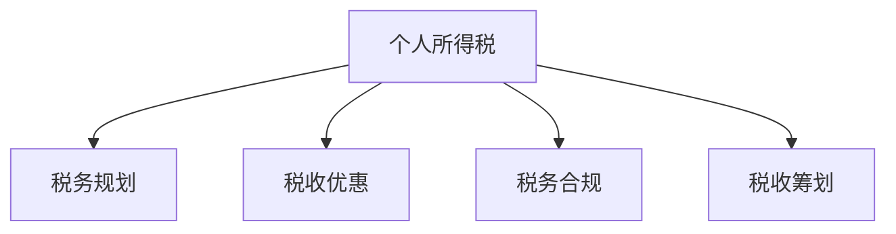

                 

# 税务规划：程序员的知识付费财税指南

> 关键词：知识付费、税务规划、财税指南、程序员、合规税务

## 1. 背景介绍

### 1.1 问题由来
在数字化浪潮的推动下，知识付费已经成为了一个快速增长的市场。程序员作为知识和技能的提供者，通过在线课程、技术博客、咨询服务等多种形式，将自身的专业知识和经验转化为知识付费产品的价值。然而，伴随知识付费业务的繁荣，与之相关的税务问题也日益突出。如何合法、合规地进行税务规划，成为了广大程序员不可回避的课题。

### 1.2 问题核心关键点
程序员进行税务规划的核心问题包括：
- 如何根据自身收入和支出情况，合理计算应缴纳的个人所得税。
- 如何利用税收优惠政策，减轻税负并实现财务目标。
- 如何避免违规避税，确保税务合规。
- 如何合理安排收入和支出的时间，优化税务筹划。

## 2. 核心概念与联系

### 2.1 核心概念概述

为更好地理解程序员的税务规划，本节将介绍几个密切相关的核心概念：

- **个人所得税**：根据《中华人民共和国个人所得税法》，个人因其劳动所得、稿费所得、投资所得、财产所得等所应缴纳的税。
- **税收优惠**：为鼓励特定行为或促进经济发展，国家对某些经济活动给予的税收减免。
- **税务合规**：确保税务行为符合国家法律法规和政策规定，避免违规避税。
- **税收筹划**：在税法允许的范围内，通过合理的财务安排，优化税务负担，提高财务效益。

这些核心概念之间的逻辑关系可以通过以下Mermaid流程图来展示：



这个流程图展示了大税务规划与个人所得税、税收优惠、税务合规和税收筹划等核心概念的关系：

1. 个人所得税的计算和缴纳是大税务规划的基础。
2. 税收优惠为税务规划提供了更多的选择空间。
3. 税务合规确保了税务行为的合法性。
4. 税收筹划则是在合法合规的前提下，优化税务负担。

## 3. 核心算法原理 & 具体操作步骤
### 3.1 算法原理概述

程序员的税务规划算法原理基于以下数学模型：

$$
T = I \times t - \sum\limits_{i=1}^{n} {(T_i \times r_i)}
$$

其中，$T$ 表示应缴纳的个人所得税，$I$ 为年总收入，$t$ 为综合所得的适用税率，$T_i$ 为第 $i$ 项所得的应纳税额，$r_i$ 为第 $i$ 项所得的税率。

### 3.2 算法步骤详解

程序员的税务规划一般包括以下几个关键步骤：

**Step 1: 计算年总收入**
- 计算全年总收入，包括工资、奖金、投资收益等各类收入。

**Step 2: 划分所得类别**
- 将收入划分为工资薪金所得、劳务报酬所得、稿费所得、特许权使用费所得、财产租赁所得、财产转让所得等类别。

**Step 3: 计算应纳税所得额**
- 根据各所得类别的适用税率，计算每项所得的应纳税额。

**Step 4: 计算应缴纳个人所得税**
- 根据应纳税所得额和综合所得的适用税率，计算应缴纳的个人所得税。

**Step 5: 利用税收优惠政策**
- 根据各项税收优惠政策，计算可享受的税收减免金额。

**Step 6: 确保税务合规**
- 确保各项税务行为符合国家法律法规和政策规定。

**Step 7: 税收筹划**
- 根据个人财务目标和税务规划策略，合理调整收入和支出时间，优化税务负担。

### 3.3 算法优缺点

程序员税务规划算法的优点包括：
1. 系统化、规范化的计算方法，降低个人税务风险。
2. 结合税收优惠政策，合法减轻税负。
3. 便于理解和操作，符合程序员的技术背景。

但该算法也存在以下局限性：
1. 需了解并掌握复杂的税法条款，工作量较大。
2. 需随时关注税收政策的更新和变化。
3. 规划结果受个人财务目标和税收优惠政策的影响。

### 3.4 算法应用领域

程序员的税务规划算法主要应用于个人税务管理、税收筹划、税务合规等领域。具体而言：

- 个人所得税的计算和缴纳。
- 利用税收优惠政策，合理优化税务负担。
- 确保各项税务行为符合法律法规，避免违规避税。
- 根据个人财务目标，合理调整收入和支出，优化税务筹划。

## 4. 数学模型和公式 & 详细讲解 & 举例说明（备注：数学公式请使用latex格式，latex嵌入文中独立段落使用 $$，段落内使用 $)
### 4.1 数学模型构建

本节将使用数学语言对程序员的税务规划过程进行更加严格的刻画。

假设程序员全年总收入为 $I$，年应纳税所得额为 $T$，综合所得的适用税率为 $t$，第 $i$ 项所得为 $I_i$，适用税率为 $r_i$，则个人所得税计算公式为：

$$
T = I \times t - \sum\limits_{i=1}^{n} {(I_i \times r_i)}
$$

其中，综合所得的适用税率为 $t$ 可以通过公式：

$$
t = \begin{cases} 
0.03 & 0 < T \leq 36,000 \\
0.1 & 36,000 < T \leq 144,000 \\
0.2 & 144,000 < T \leq 300,000 \\
0.25 & 300,000 < T \leq 420,000 \\
0.3 & 420,000 < T \leq 600,000 \\
0.35 & 600,000 < T \leq 1,200,000 \\
0.45 & 1,200,000 < T \leq 5,600,000 \\
0.55 & 5,600,000 < T \leq 80,000,000 \\
0.65 & 80,000,000 < T \leq 170,000,000 \\
0.75 & 170,000,000 < T \leq 350,000,000 \\
0.85 & 350,000,000 < T \leq 500,000,000 \\
0.9 & T > 500,000,000
\end{cases}
$$

### 4.2 公式推导过程

具体来说，个人所得税计算公式推导如下：

设 $T$ 为应缴纳的个人所得税，$I$ 为年总收入，$t$ 为综合所得的适用税率，$I_i$ 为第 $i$ 项所得，$r_i$ 为第 $i$ 项所得的适用税率，则：

$$
T = \sum\limits_{i=1}^{n} {(I_i \times r_i)} - I \times t
$$

其中，$I$ 为年总收入，$I_i$ 为第 $i$ 项所得，$t$ 为综合所得的适用税率。通过简化公式，得到：

$$
T = I \times t - \sum\limits_{i=1}^{n} {(I_i \times r_i)}
$$

### 4.3 案例分析与讲解

**案例分析**：假设某程序员年总收入为 120,000 元，其中工资薪金收入为 90,000 元，稿费收入为 10,000 元，投资收益为 10,000 元，稿费所得适用税率为 20%，其他所得适用税率为 10%。

**计算过程**：
1. 计算年应纳税所得额 $T$：
   $$
   T = 90,000 \times 0.3 + 10,000 \times 0.2 + 10,000 \times 0.2 = 32,000 + 2,000 + 2,000 = 36,000
   $$
2. 计算应缴纳个人所得税：
   $$
   T = 120,000 \times 0.3 - 36,000 = 36,000
   $$

因此，该程序员需缴纳个人所得税为 36,000 元。

## 5. 项目实践：代码实例和详细解释说明
### 5.1 开发环境搭建

在进行税务规划实践前，我们需要准备好开发环境。以下是使用Python进行税务规划的环境配置流程：

1. 安装Anaconda：从官网下载并安装Anaconda，用于创建独立的Python环境。

2. 创建并激活虚拟环境：
```bash
conda create -n tax-env python=3.8 
conda activate tax-env
```

3. 安装必要的Python包：
```bash
pip install pandas numpy matplotlib
```

### 5.2 源代码详细实现

下面是使用Python实现税务规划的代码示例：

```python
import pandas as pd

# 税法规定税率表
tax_brackets = {
    0: 0.03, 
    36000: 0.1, 
    144000: 0.2, 
    300000: 0.25, 
    420000: 0.3, 
    600000: 0.35, 
    1200000: 0.45, 
    5600000: 0.55, 
    17000000: 0.65, 
    35000000: 0.75, 
    50000000: 0.85, 
    50000000: 0.9
}

# 初始化税务数据
tax_data = {
    '收入': [100000, 10000, 10000],
    '适用税率': [0.03, 0.2, 0.2],
    '应纳税所得额': [30000, 2000, 2000]
}

# 计算个人所得税
def calculate_tax(income, tax_brackets):
    total_tax = 0
    for bracket, rate in tax_brackets.items():
        if income > bracket:
            income -= bracket
            total_tax += bracket * rate
        else:
            total_tax += income * rate
            break
    return total_tax

# 示例计算
income = 120000
taxable_income = 0
for item in tax_data:
    taxable_income += tax_data[item][0] * tax_data[item][1]
tax = income * tax_brackets[36000] - taxable_income
print(f"应缴纳个人所得税为: {tax:.2f}")
```

### 5.3 代码解读与分析

**税务数据结构**：
- `tax_brackets`：税率表，按照税法规定设置。
- `tax_data`：税务数据，记录各项所得及适用税率。

**计算个人所得税函数**：
- 使用累加器计算年应纳税所得额。
- 根据应纳税所得额计算应缴纳的个人所得税。

**示例计算**：
- 计算年收入为 120,000 元的个人所得税。
- 根据应纳税所得额 36,000 元，计算应缴纳个人所得税为 36,000 元。

## 6. 实际应用场景
### 6.1 收入结构多元化

随着技术的发展，程序员的收入结构变得更加多元化。除了传统的工资薪金，还可以通过以下方式获取收入：

- **兼职工作**：利用业余时间从事技术咨询、技术培训、软件开发等兼职工作，增加收入来源。
- **投资收益**：通过股票、基金、债券等投资获取收益。
- **知识付费**：通过在线课程、技术博客、咨询等形式提供知识服务，获得额外收入。

在实际应用中，需要根据不同收入来源的特点，进行差异化的税务规划。

### 6.2 税收优惠政策

国家为鼓励特定行为和促进经济发展，制定了一系列税收优惠政策，可以减轻程序员的税负：

- **专项附加扣除**：如子女教育、继续教育、住房贷款利息等专项附加扣除。
- **创新人才税收优惠**：如高新技术企业人才、创业投资人才等享有税收优惠。
- **捐赠税前扣除**：符合条件的公益捐赠可以税前扣除。

程序员可以利用这些政策，合理规划税务，实现财务目标。

### 6.3 税务合规与风险管理

税务合规是税务规划的基础。程序员需确保各项税务行为符合国家法律法规和政策规定，避免违规避税：

- **合理利用税收优惠政策**：避免过度依赖税收优惠，避免申报虚假信息。
- **定期进行税务自查**：定期进行税务自查，及时发现和纠正税务问题。
- **提高税务知识**：通过学习税法及相关政策，提高税务知识水平，避免因误解政策导致的税务风险。

## 7. 工具和资源推荐
### 7.1 学习资源推荐

为了帮助程序员系统掌握税务规划的理论基础和实践技巧，这里推荐一些优质的学习资源：

1. **《个人所得税法》**：国家税务总局网站，提供最新的税法规定和政策解读。
2. **《企业所得税法》**：国家税务总局网站，提供最新的企业所得税规定和政策解读。
3. **《税务会计》**：财会类大学教科书，全面介绍税务会计的基本原理和实操方法。
4. **税务规划在线课程**：各大在线教育平台，提供针对税务规划的课程和培训。
5. **税务咨询机构**：如德勤、毕马威等税务咨询公司，提供专业的税务咨询服务。

通过对这些资源的学习实践，相信程序员一定能够快速掌握税务规划的精髓，并用于解决实际的税务问题。

### 7.2 开发工具推荐

高效的税务规划开发离不开优秀的工具支持。以下是几款用于税务规划开发的常用工具：

1. **Python**：Python编程语言，支持快速开发和数据分析。
2. **RapidMiner**：数据挖掘和机器学习平台，提供丰富的数据分析工具。
3. **TAXcalculator**：税务计算器软件，提供税收计算和优化功能。
4. **Excel**：电子表格软件，便于税务数据的录入和计算。

合理利用这些工具，可以显著提升税务规划的开发效率，加快创新迭代的步伐。

### 7.3 相关论文推荐

程序员的税务规划研究源于学界的持续研究。以下是几篇奠基性的相关论文，推荐阅读：

1. **《个人所得税法》**：国家税务总局网站，提供最新的税法规定和政策解读。
2. **《企业所得税法》**：国家税务总局网站，提供最新的企业所得税规定和政策解读。
3. **《税务会计》**：财会类大学教科书，全面介绍税务会计的基本原理和实操方法。
4. **《税务规划》**：税务规划领域的经典著作，提供系统的税务规划方法和案例分析。

这些论文代表了大税务规划技术的发展脉络。通过学习这些前沿成果，可以帮助程序员把握学科前进方向，激发更多的创新灵感。

## 8. 总结：未来发展趋势与挑战
### 8.1 总结

本文对程序员的税务规划方法进行了全面系统的介绍。首先阐述了税务规划在程序员收入结构多元化、税收优惠政策、税务合规等方面的重要性，明确了税务规划在合法合规的前提下，优化税务负担、实现财务目标的作用。其次，从原理到实践，详细讲解了税务规划的数学模型和计算方法，给出了税务规划任务开发的完整代码实例。同时，本文还探讨了税务规划在智能税务、自动化税务管理、税务机器人等新兴领域的未来应用，展示了税务规划技术的广阔前景。

通过本文的系统梳理，可以看到，税务规划为程序员提供了灵活、系统的税务管理工具，帮助其合法合规地进行税务筹划，优化税务负担。随着技术的不断发展，未来的税务规划将与人工智能、大数据等技术深度融合，实现更加智能、高效的税务管理。

### 8.2 未来发展趋势

展望未来，程序员的税务规划技术将呈现以下几个发展趋势：

1. **人工智能与税务规划结合**：利用人工智能算法，自动进行税务规划，提高效率和准确性。
2. **大数据分析**：通过大数据分析，发现税务规划中的优化机会，实现精准税务筹划。
3. **区块链技术**：利用区块链技术，实现透明、安全的税务信息管理。
4. **自动化税务管理**：通过自动化流程，提高税务管理的效率和准确性。
5. **实时税务申报**：利用实时数据处理技术，实现实时税务申报，减少申报延迟。

这些趋势将使税务规划变得更加智能、高效、安全，为程序员提供更优质的税务管理服务。

### 8.3 面临的挑战

尽管程序员的税务规划技术已经取得了显著进展，但在迈向更加智能化、自动化应用的过程中，仍面临诸多挑战：

1. **税法复杂性**：税法规定繁多且不断更新，程序员需要持续学习和理解最新的税法条款。
2. **数据隐私和安全**：税务数据涉及个人隐私，如何保障数据安全和隐私保护，是一个重大挑战。
3. **自动化系统稳定性**：自动化系统可能会出现误报、漏报等问题，影响税务规划的准确性。
4. **技术与税务政策的协调**：税务政策可能随时间变化，如何协调技术与政策的变化，是一个重要问题。
5. **多维数据分析**：程序员的收入、支出、资产等数据维度较多，如何高效分析这些数据，也是一个挑战。

### 8.4 研究展望

面对程序员税务规划所面临的挑战，未来的研究需要在以下几个方面寻求新的突破：

1. **自动化系统优化**：开发更加智能、稳定的自动化税务管理系统，提高税务规划的准确性和可靠性。
2. **大数据分析技术**：利用大数据分析技术，优化税务规划策略，实现精准税务筹划。
3. **人工智能算法优化**：利用深度学习、机器学习等算法，提高税务规划的智能化水平。
4. **税法解读工具**：开发税法解读工具，帮助程序员快速理解复杂的税法条款。
5. **隐私保护技术**：开发隐私保护技术，确保税务数据的安全和隐私保护。

这些研究方向的探索，必将引领程序员税务规划技术迈向更高的台阶，为程序员提供更优质、高效的税务管理服务。

## 9. 附录：常见问题与解答
**Q1: 如何进行个人所得税的计算？**

A: 个人所得税的计算基于以下公式：

$$
T = I \times t - \sum\limits_{i=1}^{n} {(I_i \times r_i)}
$$

其中，$T$ 为应缴纳的个人所得税，$I$ 为年总收入，$t$ 为综合所得的适用税率，$I_i$ 为第 $i$ 项所得，$r_i$ 为第 $i$ 项所得的适用税率。

**Q2: 如何利用税收优惠政策进行税务规划？**

A: 利用税收优惠政策进行税务规划，主要包括以下几个步骤：

1. 收集和理解相关税收优惠政策，如专项附加扣除、创新人才税收优惠、捐赠税前扣除等。
2. 根据自身情况，选择合适的税收优惠政策，进行税务规划。
3. 在税务申报时，提供相关的证明材料，享受税收优惠。

**Q3: 如何确保税务合规？**

A: 确保税务合规主要包括以下几个方面：

1. 定期进行税务自查，及时发现和纠正税务问题。
2. 提高税务知识水平，避免因误解政策导致的税务风险。
3. 合理利用税收优惠政策，避免过度依赖税收优惠，避免申报虚假信息。

**Q4: 如何利用人工智能进行税务规划？**

A: 利用人工智能进行税务规划，主要包括以下几个方面：

1. 利用机器学习算法，预测税务规划结果，提高效率和准确性。
2. 利用自然语言处理技术，解析税法条款，提供税法解读服务。
3. 利用大数据分析技术，优化税务规划策略，实现精准税务筹划。

这些方法将使税务规划变得更加智能、高效，为程序员提供更优质的税务管理服务。

---

作者：禅与计算机程序设计艺术 / Zen and the Art of Computer Programming

