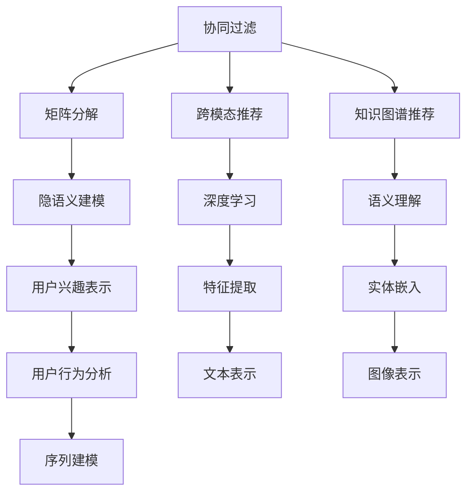

                 

# 突破推荐系统的局限：大模型的创新

> 关键词：推荐系统,大模型,深度学习,知识图谱,跨模态,协同过滤,矩阵分解

## 1. 背景介绍

### 1.1 问题由来
在互联网高度发达的今天，个性化推荐系统已成为各大平台吸引用户、提高用户粘性的重要手段。传统的推荐系统主要依赖用户行为数据，如点击、浏览、评分等，通过协同过滤、矩阵分解等方法对用户兴趣进行建模。然而，这些方法在用户行为稀疏、数据噪音大的情况下，往往无法充分发挥潜力，且难以捕捉用户深层次的兴趣和偏好。

近年来，随着深度学习技术的蓬勃发展，基于大模型的推荐系统逐渐成为研究热点。使用预训练大模型，如BERT、GPT等，在大规模数据上进行预训练，学习到通用的语义表示，再通过微调适应具体推荐任务，可以大幅提升推荐系统的性能。大模型推荐系统因具有强大的泛化能力和高效的推理能力，在电商、内容推荐、广告投放等领域展现出巨大潜力。

### 1.2 问题核心关键点
本节将详细介绍大模型推荐系统在协同过滤、矩阵分解、跨模态推荐、知识图谱推荐等任务上的实现方法和创新思路。

## 2. 核心概念与联系

### 2.1 核心概念概述

为了更好地理解大模型在推荐系统中的应用，本节将介绍几个关键概念：

- 推荐系统(Recommender System)：根据用户历史行为和兴趣，推荐符合其需求的产品或内容，帮助用户高效发现有用信息的技术系统。推荐系统广泛应用于电商、新闻、音乐、视频等平台，提高用户体验和平台收益。

- 协同过滤(Collaborative Filtering)：通过分析用户行为和物品间的相似性，推荐用户可能感兴趣的其他物品。协同过滤包括基于用户的协同过滤和基于物品的协同过滤。

- 矩阵分解(Matrix Factorization)：通过将用户-物品评分矩阵分解为用户特征矩阵和物品特征矩阵，拟合评分矩阵中的未知项，预测用户对未评分物品的评分。矩阵分解方法常用于隐语义建模和推荐系统。

- 跨模态推荐(Cross-Modal Recommendation)：将来自不同模态的数据，如文本、图像、音频等，进行特征融合和协同建模，提升推荐系统的精度和覆盖度。

- 知识图谱(Knowledge Graph)：使用图结构表示实体和关系的数据库，可以有效地整合各类知识，提供语义化的推荐服务。知识图谱在医药、旅游、法律等领域应用广泛。

这些概念之间的逻辑关系可以通过以下Mermaid流程图来展示：



这个流程图展示了大模型推荐系统的核心概念及其之间的关系：

1. 协同过滤是推荐系统的基本方法，通过分析用户行为和物品间的相似性进行推荐。
2. 矩阵分解是协同过滤的一种重要技术，通过低秩矩阵分解对用户-物品评分矩阵进行分解和拟合。
3. 跨模态推荐将不同模态的信息进行特征融合，提升推荐系统的多样性和覆盖度。
4. 知识图谱推荐利用图结构对实体和关系进行表示，增强推荐系统的语义理解能力。
5. 隐语义建模是矩阵分解的一种形式，通过低维向量空间对用户和物品进行兴趣表示。
6. 深度学习方法可以提升推荐系统的特征提取能力，增强模型的泛化性和稳定性。
7. 用户兴趣表示和行为分析是协同过滤和矩阵分解的基础，用于理解用户的兴趣偏好。
8. 文本表示、图像表示和序列建模是跨模态推荐和知识图谱推荐的重要组成部分，用于不同模态信息的转换和融合。

这些概念共同构成了大模型推荐系统的核心框架，使其能够更好地适配不同的推荐任务和数据类型。

## 3. 核心算法原理 & 具体操作步骤
### 3.1 算法原理概述

基于大模型的推荐系统，本质上是利用大模型学习用户-物品之间的隐含语义关系，构建推荐决策模型。在协同过滤、矩阵分解、跨模态推荐等不同任务上，大模型的具体实现方法各有差异，但总体遵循以下基本思路：

- 使用预训练语言模型，如BERT、GPT等，在大规模无标签数据上进行预训练，学习通用语义表示。
- 在推荐任务的数据集上，微调预训练模型，以适应特定任务的需求。
- 使用微调后的模型，对用户输入进行特征提取，利用相关算法生成推荐结果。

大模型推荐系统的核心思想在于通过自监督学习获取丰富的语义信息，并在微调时引导模型专注于推荐任务相关的特征，从而提升推荐精度。

### 3.2 算法步骤详解

以基于大模型的协同过滤推荐系统为例，介绍具体的微调步骤和算法细节。

**Step 1: 准备数据集**

首先需要准备推荐系统的用户行为数据集，例如电商网站的用户购买记录、电影评论网站的用户评分记录等。数据集应该包含用户ID、物品ID、评分等基本特征，用于后续模型的微调。

**Step 2: 选择预训练语言模型**

选择合适的预训练语言模型，如BERT、GPT等，作为推荐系统的初始化参数。这些大模型通常通过在大规模语料库上进行预训练，学习到通用的语义表示，具备强大的语言理解和生成能力。

**Step 3: 定义推荐目标函数**

定义推荐任务的目标函数。对于协同过滤推荐，可以使用损失函数，如均方误差损失、交叉熵损失等，衡量模型预测评分与实际评分之间的差异。对于矩阵分解推荐，可以将预测评分与实际评分之间的差异作为损失函数。

**Step 4: 微调大模型**

在推荐数据集上，使用梯度下降等优化算法，对预训练模型进行微调。微调时，可以保留部分预训练层，只微调顶层，以减少过拟合风险。同时，可以设置合适的学习率、正则化技术、早停策略等，防止模型过拟合。

**Step 5: 生成推荐结果**

微调完成后，将用户输入（如文本描述、物品图片等）作为输入，通过微调后的模型进行特征提取，得到用户对物品的兴趣表示。利用相关推荐算法，如协同过滤、矩阵分解等，生成推荐结果。

### 3.3 算法优缺点

基于大模型的推荐系统具有以下优点：

1. 强大的语义理解能力。通过预训练模型学习通用语义表示，能够更准确地捕捉用户深层次的兴趣和偏好。
2. 高效的特征提取。大模型可以自动学习高维语义特征，无需手工设计特征工程，减少特征提取的复杂度。
3. 泛化能力强。由于大模型的广泛预训练，模型具有较强的泛化能力，能够在新的数据上快速适应和优化。
4. 可扩展性好。大模型的参数量庞大，可以通过多GPU、分布式训练等技术实现高效并行计算，支持大规模数据和推荐任务。

同时，该方法也存在一些局限性：

1. 高计算资源需求。大模型的训练和微调需要大量的计算资源，如GPU、TPU等高性能设备。
2. 高内存消耗。大模型通常具有庞大的参数量，导致推理阶段内存占用大，需要进行内存优化。
3. 高数据需求。预训练模型的效果很大程度上取决于训练数据的规模和质量，数据获取成本较高。
4. 数据隐私风险。大规模数据训练过程中，可能涉及用户隐私数据的收集和处理，需要严格的数据保护措施。
5. 模型复杂度较高。大模型的结构和参数复杂，需要更复杂的算法和超参数调优，增加了系统的开发和维护成本。

尽管存在这些局限性，但就目前而言，基于大模型的推荐系统仍是最前沿、最有效的推荐方法之一。未来相关研究重点在于如何进一步降低计算资源需求、提高模型效率、增强数据隐私保护，并兼顾可解释性和用户隐私等因素。

### 3.4 算法应用领域

基于大模型的推荐系统，已经在电商、内容推荐、广告投放、金融科技等多个领域得到了广泛应用，取得了显著的效果：

- 电商推荐：电商平台通过大模型推荐系统，根据用户行为和物品属性，推荐符合用户偏好的商品，提升用户购买率和平台收益。
- 内容推荐：视频平台、新闻网站等通过大模型推荐系统，为用户推荐个性化视频、新闻内容，提高用户粘性和平台流量。
- 广告投放：互联网广告平台通过大模型推荐系统，精准匹配用户兴趣和广告内容，提高广告点击率和转化率。
- 金融科技：金融科技公司通过大模型推荐系统，为用户提供个性化的金融产品推荐和风险评估，提升用户满意度和服务质量。

除了上述这些经典应用外，大模型推荐系统还被创新性地应用到更多场景中，如个性化健康咨询、智能教育推荐、智能旅游导引等，为各行各业带来了新的变革。

## 4. 数学模型和公式 & 详细讲解 & 举例说明
### 4.1 数学模型构建

本节将使用数学语言对基于大模型的推荐系统进行更加严格的刻画。

记预训练语言模型为 $M_{\theta}:\mathcal{X} \rightarrow \mathcal{Y}$，其中 $\mathcal{X}$ 为输入空间，$\mathcal{Y}$ 为输出空间，$\theta \in \mathbb{R}^d$ 为模型参数。假设推荐任务的数据集为 $D=\{(x_i,y_i)\}_{i=1}^N$，其中 $x_i$ 为用户行为或物品特征，$y_i$ 为用户对物品的评分。

定义模型 $M_{\theta}$ 在数据样本 $(x,y)$ 上的损失函数为 $\ell(M_{\theta}(x),y)$，则在数据集 $D$ 上的经验风险为：

$$
\mathcal{L}(\theta) = \frac{1}{N} \sum_{i=1}^N \ell(M_{\theta}(x_i),y_i)
$$

在推荐任务中，通常使用均方误差损失或交叉熵损失，如：

$$
\ell(M_{\theta}(x),y) = (y - M_{\theta}(x))^2 \text{ or } -y\log M_{\theta}(x) - (1-y)\log (1-M_{\theta}(x))
$$

通过梯度下降等优化算法，微调过程不断更新模型参数 $\theta$，最小化损失函数 $\mathcal{L}$，使得模型预测逼近真实评分。由于 $\theta$ 已经通过预训练获得了较好的初始化，因此即便在推荐数据集上微调，也能较快收敛到理想的模型参数 $\hat{\theta}$。

### 4.2 公式推导过程

以基于大模型的协同过滤推荐系统为例，推导协同过滤目标函数的梯度计算公式。

假设协同过滤模型的输入为 $x=(u,i)$，其中 $u$ 为用户ID，$i$ 为物品ID。输出为 $y$，表示用户对物品的评分。模型定义为 $M_{\theta}(x) = M_{\theta}(u,i)$。

协同过滤的目标函数为：

$$
\mathcal{L}(\theta) = \frac{1}{N} \sum_{i=1}^N (y_i - M_{\theta}(x_i))^2
$$

对 $\theta$ 求导，得：

$$
\frac{\partial \mathcal{L}(\theta)}{\partial \theta} = \frac{2}{N} \sum_{i=1}^N (y_i - M_{\theta}(x_i)) \frac{\partial M_{\theta}(x_i)}{\partial \theta}
$$

其中 $\frac{\partial M_{\theta}(x_i)}{\partial \theta}$ 为模型对输入的梯度，可通过反向传播算法高效计算。

在得到损失函数的梯度后，即可带入优化算法，完成模型的迭代优化。重复上述过程直至收敛，最终得到适应推荐任务的最优模型参数 $\theta^*$。

### 4.3 案例分析与讲解

以电商平台推荐系统为例，展示基于大模型的推荐过程。

假设用户输入为商品描述文本 $x$，物品ID $i$。首先使用预训练语言模型 $M_{\theta}$ 对 $x$ 进行特征提取，得到用户对物品 $i$ 的兴趣表示 $h_i$。然后将 $h_i$ 和 $i$ 作为输入，送入推荐模型 $M_{\theta}$ 进行评分预测，得到评分预测值 $\hat{y}$。

使用均方误差损失，定义推荐目标函数：

$$
\mathcal{L}(\theta) = \frac{1}{N} \sum_{i=1}^N (y_i - \hat{y}_i)^2
$$

对 $\theta$ 求导，得：

$$
\frac{\partial \mathcal{L}(\theta)}{\partial \theta} = \frac{2}{N} \sum_{i=1}^N (y_i - \hat{y}_i) \frac{\partial \hat{y}_i}{\partial \theta}
$$

其中 $\frac{\partial \hat{y}_i}{\partial \theta}$ 可以通过链式法则递归展开，利用自动微分技术完成计算。

在得到损失函数的梯度后，即可带入优化算法，如AdamW等，更新模型参数 $\theta$。重复上述过程直至收敛，最终得到适应推荐任务的最优模型参数 $\theta^*$。

## 5. 项目实践：代码实例和详细解释说明
### 5.1 开发环境搭建

在进行推荐系统开发前，我们需要准备好开发环境。以下是使用Python进行PyTorch开发的环境配置流程：

1. 安装Anaconda：从官网下载并安装Anaconda，用于创建独立的Python环境。

2. 创建并激活虚拟环境：
```bash
conda create -n pytorch-env python=3.8 
conda activate pytorch-env
```

3. 安装PyTorch：根据CUDA版本，从官网获取对应的安装命令。例如：
```bash
conda install pytorch torchvision torchaudio cudatoolkit=11.1 -c pytorch -c conda-forge
```

4. 安装Transformers库：
```bash
pip install transformers
```

5. 安装各类工具包：
```bash
pip install numpy pandas scikit-learn matplotlib tqdm jupyter notebook ipython
```

完成上述步骤后，即可在`pytorch-env`环境中开始推荐系统开发。

### 5.2 源代码详细实现

下面以基于大模型的协同过滤推荐系统为例，给出使用Transformers库对BERT模型进行推荐开发的PyTorch代码实现。

首先，定义推荐系统的数据处理函数：

```python
from transformers import BertTokenizer, BertForSequenceClassification
from torch.utils.data import Dataset
import torch

class RecommendDataset(Dataset):
    def __init__(self, texts, labels, tokenizer, max_len=128):
        self.texts = texts
        self.labels = labels
        self.tokenizer = tokenizer
        self.max_len = max_len
        
    def __len__(self):
        return len(self.texts)
    
    def __getitem__(self, item):
        text = self.texts[item]
        label = self.labels[item]
        
        encoding = self.tokenizer(text, return_tensors='pt', max_length=self.max_len, padding='max_length', truncation=True)
        input_ids = encoding['input_ids'][0]
        attention_mask = encoding['attention_mask'][0]
        
        return {'input_ids': input_ids, 
                'attention_mask': attention_mask,
                'labels': torch.tensor(label, dtype=torch.long)}
```

然后，定义模型和优化器：

```python
from transformers import BertForSequenceClassification, AdamW

model = BertForSequenceClassification.from_pretrained('bert-base-cased', num_labels=1)

optimizer = AdamW(model.parameters(), lr=2e-5)
```

接着，定义训练和评估函数：

```python
from torch.utils.data import DataLoader
from tqdm import tqdm
from sklearn.metrics import mean_squared_error

device = torch.device('cuda') if torch.cuda.is_available() else torch.device('cpu')
model.to(device)

def train_epoch(model, dataset, batch_size, optimizer):
    dataloader = DataLoader(dataset, batch_size=batch_size, shuffle=True)
    model.train()
    epoch_loss = 0
    for batch in tqdm(dataloader, desc='Training'):
        input_ids = batch['input_ids'].to(device)
        attention_mask = batch['attention_mask'].to(device)
        labels = batch['labels'].to(device)
        model.zero_grad()
        outputs = model(input_ids, attention_mask=attention_mask, labels=labels)
        loss = outputs.loss
        epoch_loss += loss.item()
        loss.backward()
        optimizer.step()
    return epoch_loss / len(dataloader)

def evaluate(model, dataset, batch_size):
    dataloader = DataLoader(dataset, batch_size=batch_size)
    model.eval()
    preds, labels = [], []
    with torch.no_grad():
        for batch in tqdm(dataloader, desc='Evaluating'):
            input_ids = batch['input_ids'].to(device)
            attention_mask = batch['attention_mask'].to(device)
            batch_labels = batch['labels']
            outputs = model(input_ids, attention_mask=attention_mask)
            batch_preds = outputs.logits.argmax(dim=1).to('cpu').tolist()
            batch_labels = batch_labels.to('cpu').tolist()
            for pred, label in zip(batch_preds, batch_labels):
                preds.append(pred)
                labels.append(label)
                
    return mean_squared_error(labels, preds)
```

最后，启动训练流程并在测试集上评估：

```python
epochs = 5
batch_size = 16

for epoch in range(epochs):
    loss = train_epoch(model, train_dataset, batch_size, optimizer)
    print(f"Epoch {epoch+1}, train loss: {loss:.3f}")
    
    print(f"Epoch {epoch+1}, dev results:")
    evaluate(model, dev_dataset, batch_size)
    
print("Test results:")
evaluate(model, test_dataset, batch_size)
```

以上就是使用PyTorch对BERT进行协同过滤推荐系统的完整代码实现。可以看到，得益于Transformers库的强大封装，我们可以用相对简洁的代码完成BERT模型的加载和推荐系统的开发。

### 5.3 代码解读与分析

让我们再详细解读一下关键代码的实现细节：

**RecommendDataset类**：
- `__init__`方法：初始化文本、标签、分词器等关键组件。
- `__len__`方法：返回数据集的样本数量。
- `__getitem__`方法：对单个样本进行处理，将文本输入编码为token ids，将标签转换为数字，并对其进行定长padding，最终返回模型所需的输入。

**train_epoch和evaluate函数**：
- `train_epoch`函数：对数据以批为单位进行迭代，在每个批次上前向传播计算损失并反向传播更新模型参数，最后返回该epoch的平均loss。
- `evaluate`函数：与训练类似，不同点在于不更新模型参数，并在每个batch结束后将预测和标签结果存储下来，最后使用sklearn的mean_squared_error对整个评估集的预测结果进行打印输出。

**训练流程**：
- 定义总的epoch数和batch size，开始循环迭代
- 每个epoch内，先在训练集上训练，输出平均loss
- 在验证集上评估，输出MSE（均方误差）结果
- 所有epoch结束后，在测试集上评估，给出最终测试结果

可以看到，PyTorch配合Transformers库使得BERT推荐系统的代码实现变得简洁高效。开发者可以将更多精力放在数据处理、模型改进等高层逻辑上，而不必过多关注底层的实现细节。

当然，工业级的系统实现还需考虑更多因素，如模型的保存和部署、超参数的自动搜索、更灵活的任务适配层等。但核心的微调范式基本与此类似。

## 6. 实际应用场景
### 6.1 电商推荐

电商推荐系统通过大模型推荐技术，可以大幅提升用户购物体验和平台销售业绩。电商网站根据用户的历史浏览、购买行为，利用大模型推荐系统推荐符合其需求的商品，帮助用户更快地找到心仪的商品，提升购物满意度。

在技术实现上，可以收集用户的历史购物记录、浏览记录、评价记录等数据，提取和商品相关的文本信息。将文本信息作为输入，使用预训练语言模型进行特征提取，得到用户对商品的兴趣表示。通过协同过滤、矩阵分解等算法，推荐用户可能感兴趣的商品。

### 6.2 内容推荐

内容推荐系统广泛用于视频平台、新闻网站等。这些平台通过大模型推荐系统，根据用户的历史行为和兴趣，推荐符合其需求的内容，提高用户粘性和平台流量。

在内容推荐中，大模型可以自动学习用户的兴趣特征，通过协同过滤、矩阵分解等算法，推荐用户可能感兴趣的视频、新闻内容。同时，大模型还可以通过文本描述、图片、视频等多模态信息进行特征融合，增强推荐系统的多样性和覆盖度。

### 6.3 广告投放

互联网广告平台通过大模型推荐系统，精准匹配用户兴趣和广告内容，提高广告点击率和转化率。广告平台收集用户的浏览记录、点击记录、点击广告后的转化记录等数据，利用大模型推荐系统推荐用户可能感兴趣的广告。

在广告投放中，大模型可以自动学习用户的兴趣特征，通过协同过滤、矩阵分解等算法，推荐用户可能感兴趣的广告。同时，大模型还可以通过图像、视频等多模态信息进行特征融合，增强广告的吸引力。

### 6.4 金融科技

金融科技公司通过大模型推荐系统，为用户提供个性化的金融产品推荐和风险评估，提升用户满意度和服务质量。金融公司可以收集用户的历史投资记录、金融行为等数据，利用大模型推荐系统推荐符合其风险偏好的金融产品。

在金融科技中，大模型可以自动学习用户的兴趣特征，通过协同过滤、矩阵分解等算法，推荐用户可能感兴趣的金融产品。同时，大模型还可以通过实体嵌入、关系推理等技术，增强推荐系统的语义理解能力。

## 7. 工具和资源推荐
### 7.1 学习资源推荐

为了帮助开发者系统掌握大模型推荐系统的理论基础和实践技巧，这里推荐一些优质的学习资源：

1. 《深度学习推荐系统》系列博文：深度学习推荐系统的经典著作，全面介绍了协同过滤、矩阵分解、深度学习等推荐算法的原理和实现方法。

2. 斯坦福大学《Recommender Systems》课程：斯坦福大学开设的推荐系统课程，有Lecture视频和配套作业，带你入门推荐系统领域的基本概念和经典算法。

3. 《推荐系统实践》书籍：谷歌工程师所写，详细介绍了推荐系统在实际应用中的实现方法和优化技巧，适合工程开发人员阅读。

4. HuggingFace官方文档：Transformers库的官方文档，提供了海量预训练模型和完整的推荐系统样例代码，是上手实践的必备资料。

5. Kaggle推荐系统竞赛：Kaggle平台上的推荐系统竞赛，汇集了大量推荐系统经典数据集和优化算法，可以帮助开发者深入了解推荐系统的实际应用。

通过对这些资源的学习实践，相信你一定能够快速掌握大模型推荐系统的精髓，并用于解决实际的推荐问题。
###  7.2 开发工具推荐

高效的开发离不开优秀的工具支持。以下是几款用于大模型推荐系统开发的常用工具：

1. PyTorch：基于Python的开源深度学习框架，灵活动态的计算图，适合快速迭代研究。大部分预训练语言模型都有PyTorch版本的实现。

2. TensorFlow：由Google主导开发的开源深度学习框架，生产部署方便，适合大规模工程应用。同样有丰富的预训练语言模型资源。

3. Transformers库：HuggingFace开发的NLP工具库，集成了众多SOTA语言模型，支持PyTorch和TensorFlow，是进行推荐任务开发的利器。

4. Weights & Biases：模型训练的实验跟踪工具，可以记录和可视化模型训练过程中的各项指标，方便对比和调优。与主流深度学习框架无缝集成。

5. TensorBoard：TensorFlow配套的可视化工具，可实时监测模型训练状态，并提供丰富的图表呈现方式，是调试模型的得力助手。

6. Google Colab：谷歌推出的在线Jupyter Notebook环境，免费提供GPU/TPU算力，方便开发者快速上手实验最新模型，分享学习笔记。

合理利用这些工具，可以显著提升大模型推荐系统的开发效率，加快创新迭代的步伐。

### 7.3 相关论文推荐

大模型推荐系统的发展源于学界的持续研究。以下是几篇奠基性的相关论文，推荐阅读：

1. TensorFlow Recommenders：TensorFlow官方推出的推荐系统库，提供了多种推荐算法和优化工具，是推荐系统开发者的必备参考资料。

2. Factorization Machines for Recommender Systems：提出了矩阵分解的改进算法Factorization Machines，在推荐系统上取得了优异效果。

3. Scalable Prototype for Practical Recommender Systems：介绍了推荐系统在大规模数据上的高效实现方法，包括样本划分、分布式训练等技术。

4. Deep Collaborative Filtering：利用深度学习技术改进协同过滤推荐系统，提升推荐精度和稳定性。

5. Progressive Growing of Neural Networks for Recommendation System：提出了一种渐进式的网络结构设计方法，在推荐系统上取得了良好的效果。

这些论文代表了大模型推荐系统的发展脉络。通过学习这些前沿成果，可以帮助研究者把握学科前进方向，激发更多的创新灵感。

## 8. 总结：未来发展趋势与挑战
### 8.1 总结

本文对基于大模型的推荐系统进行了全面系统的介绍。首先阐述了大模型推荐系统的研究背景和意义，明确了推荐系统在大规模数据和复杂应用场景中的重要价值。其次，从原理到实践，详细讲解了大模型在协同过滤、矩阵分解、跨模态推荐等任务上的实现方法和算法细节。同时，本文还广泛探讨了大模型推荐系统在电商、内容推荐、广告投放等领域的实际应用，展示了其在产业界落地应用的巨大潜力。此外，本文精选了推荐系统的各类学习资源，力求为开发者提供全方位的技术指引。

通过本文的系统梳理，可以看到，基于大模型的推荐系统是当前推荐系统的最新趋势，具有强大的语义理解和泛化能力，能够适应多样化的推荐任务和数据类型。未来，伴随大模型技术的不断演进，推荐系统必将迎来新的突破，进一步提升用户体验和平台价值。

### 8.2 未来发展趋势

展望未来，大模型推荐系统的发展趋势将呈现以下几个方向：

1. 超大规模模型的应用。随着计算资源和算法的进步，未来推荐系统将更多地依赖于超大规模预训练模型，提升模型的语义理解和泛化能力。

2. 跨模态推荐技术的成熟。未来推荐系统将更多地融合文本、图像、视频等多模态信息，增强推荐系统的多样性和覆盖度。

3. 知识图谱的深度整合。未来推荐系统将更多地利用知识图谱等语义信息，增强推荐系统的语义理解和推理能力。

4. 实时推荐系统的构建。未来推荐系统将更多地关注实时性，利用分布式计算和大数据技术，实现高效的实时推荐。

5. 模型压缩与优化。未来推荐系统将更多地关注模型压缩和优化，减小模型的计算和存储成本，提高系统的可扩展性和可部署性。

6. 用户隐私保护的强化。未来推荐系统将更多地关注用户隐私保护，采用差分隐私、联邦学习等技术，保护用户数据的安全性和隐私性。

这些趋势凸显了大模型推荐系统的广阔前景。未来的推荐系统将继续在数据、算法、工程等方面进行全面优化，提升推荐精度和用户体验，推动推荐技术的进一步发展。

### 8.3 面临的挑战

尽管大模型推荐系统取得了显著进展，但在实际应用中也面临一些挑战：

1. 计算资源需求高。超大规模模型需要高性能设备进行训练和推理，对计算资源的需求较高。如何降低计算成本，提高模型的可扩展性，仍是未来的重要研究方向。

2. 数据隐私风险。在数据收集和处理过程中，用户隐私保护是一个重要问题。如何在使用用户数据的同时，保护用户隐私，需要更多的技术和制度保障。

3. 模型复杂度高。超大规模模型的结构和参数复杂，导致推理速度慢、内存占用大等问题。如何提高模型的效率，优化模型结构，是未来的重要研究课题。

4. 推荐精度不稳定。由于大模型的复杂性，推荐系统的精度在不同用户和不同数据分布下存在波动。如何提升模型的鲁棒性和泛化能力，仍是未来的重要研究方向。

5. 推荐系统偏见。预训练模型可能学习到社会偏见和数据偏差，影响推荐系统的公平性和公正性。如何消除模型的偏见，增强推荐系统的公平性，仍需更多的研究探索。

6. 推荐系统的可解释性不足。推荐系统通常被视为"黑盒"系统，难以解释其内部的决策过程和逻辑。如何增强推荐系统的可解释性，提高用户信任度，仍是未来的重要研究方向。

7. 跨模态融合的困难。不同模态信息之间的融合是一个复杂的问题，如何高效融合多模态信息，仍是未来的重要研究方向。

这些挑战需要我们在数据、算法、工程、伦理等多个方面进行综合优化，才能充分发挥大模型推荐系统的潜力，实现更高效、更公平、更安全的推荐系统。相信随着学界和产业界的共同努力，这些挑战终将一一克服，大模型推荐系统必将在推荐领域产生更深远的影响。

### 8.4 研究展望

未来，大模型推荐系统需要在以下几个方面进行深入研究：

1. 推荐模型的公平性和可解释性。如何消除推荐模型的偏见，增强推荐系统的公平性和公正性，需要更多的理论研究和实际应用。

2. 推荐系统的隐私保护。如何在推荐系统中保护用户隐私，利用差分隐私、联邦学习等技术，需要更多的算法和技术手段。

3. 推荐系统的实时性。如何在推荐系统中实现实时推荐，利用分布式计算和大数据技术，需要更多的工程实现和优化。

4. 推荐系统的跨模态融合。如何在推荐系统中高效融合多模态信息，需要更多的算法和模型设计。

5. 推荐系统的泛化能力。如何在推荐系统中提升模型的泛化能力，增强模型在不同数据分布下的稳定性，需要更多的理论和实践研究。

6. 推荐系统的可扩展性。如何降低推荐系统的计算成本，提高模型的可扩展性和可部署性，需要更多的工程优化和算法设计。

通过这些方向的研究，大模型推荐系统将不断突破现有技术的边界，实现更高效、更公平、更安全的推荐系统，为各行各业带来新的变革。未来，大模型推荐系统将继续推动推荐技术的进步，为人类的生活和工作带来更多的便利和效益。

## 9. 附录：常见问题与解答

**Q1：大模型推荐系统是否适用于所有推荐任务？**

A: 大模型推荐系统在大多数推荐任务上都能取得不错的效果，特别是对于数据量较小的任务。但对于一些特定领域的任务，如医药、法律等，仅仅依靠通用语料预训练的模型可能难以很好地适应。此时需要在特定领域语料上进一步预训练，再进行微调，才能获得理想效果。此外，对于一些需要时效性、个性化很强的任务，如对话、推荐等，微调方法也需要针对性的改进优化。

**Q2：微调过程中如何选择合适的学习率？**

A: 微调的学习率一般要比预训练时小1-2个数量级，如果使用过大的学习率，容易破坏预训练权重，导致过拟合。一般建议从1e-5开始调参，逐步减小学习率，直至收敛。也可以使用warmup策略，在开始阶段使用较小的学习率，再逐渐过渡到预设值。需要注意的是，不同的优化器(如AdamW、Adafactor等)以及不同的学习率调度策略，可能需要设置不同的学习率阈值。

**Q3：采用大模型推荐时会面临哪些资源瓶颈？**

A: 目前主流的预训练大模型动辄以亿计的参数规模，对算力、内存、存储都提出了很高的要求。GPU/TPU等高性能设备是必不可少的，但即便如此，超大批次的训练和推理也可能遇到显存不足的问题。因此需要采用一些资源优化技术，如梯度积累、混合精度训练、模型并行等，来突破硬件瓶颈。同时，模型的存储和读取也可能占用大量时间和空间，需要采用模型压缩、稀疏化存储等方法进行优化。

**Q4：如何缓解微调过程中的过拟合问题？**

A: 过拟合是微调面临的主要挑战，尤其是在标注数据不足的情况下。常见的缓解策略包括：
1. 数据增强：通过回译、近义替换等方式扩充训练集
2. 正则化：使用L2正则、Dropout、Early Stopping等避免过拟合
3. 对抗训练：引入对抗样本，提高模型鲁棒性
4. 参数高效微调：只调整少量参数(如Adapter、Prefix等)，减小过拟合风险
5. 多模型集成：训练多个微调模型，取平均输出，抑制过拟合

这些策略往往需要根据具体任务和数据特点进行灵活组合。只有在数据、模型、训练、推理等各环节进行全面优化，才能最大限度地发挥大模型推荐系统的潜力。

**Q5：微调模型在落地部署时需要注意哪些问题？**

A: 将微调模型转化为实际应用，还需要考虑以下因素：
1. 模型裁剪：去除不必要的层和参数，减小模型尺寸，加快推理速度
2. 量化加速：将浮点模型转为定点模型，压缩存储空间，提高计算效率
3. 服务化封装：将模型封装为标准化服务接口，便于集成调用
4. 弹性伸缩：根据请求流量动态调整资源配置，平衡服务质量和成本
5. 监控告警：实时采集系统指标，设置异常告警阈值，确保服务稳定性
6. 安全防护：采用访问鉴权、数据脱敏等措施，保障数据和模型安全

大模型推荐系统在落地部署时，还需要关注模型结构、推理效率、服务化、监控告警等多个方面，才能实现高效、稳定、安全的推荐服务。

---

作者：禅与计算机程序设计艺术 / Zen and the Art of Computer Programming

