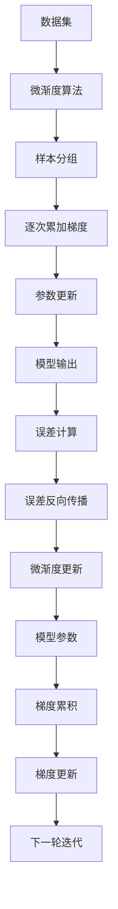

                 

# 第02章 Micrograd 机器学习与反向传播

## 1. 背景介绍

机器学习，作为人工智能的重要分支，近年来取得了飞速的发展，广泛应用于图像识别、语音处理、自然语言处理等领域。其中的关键技术是反向传播（Backpropagation），它是梯度下降（Gradient Descent）算法在神经网络训练中的重要实现形式，使得模型能够通过误差反向传播，调整参数以减少预测误差，从而优化模型的性能。

本文将详细阐述微渐度（Micrograd）及其在反向传播中的角色，介绍其原理、实现方式、应用场景及注意事项，并给出实际案例和项目实践，帮助读者深入理解微渐度在机器学习中的关键作用和应用。

## 2. 核心概念与联系

### 2.1 核心概念概述

在机器学习中，微渐度（Micrograd）是指在反向传播过程中，对每个样本的误差梯度进行微小的、逐次累加的计算，而不是一次性计算全部样本的误差梯度。微渐度的引入，有助于减少计算量和内存消耗，提高模型训练效率，特别适用于数据集较小或内存资源有限的场景。

微渐度的计算方式基于累积梯度的概念，即每次迭代只计算部分样本的误差梯度，然后将它们逐次累加，形成最终的累积梯度。这样，微渐度算法能够有效地优化内存和计算资源的利用，使得模型能够在有限的资源条件下完成训练。

### 2.2 核心概念原理和架构的 Mermaid 流程图



从流程图可以看出，微渐度算法的基本流程包括样本分组、逐次累加梯度、参数更新等步骤。每个步骤都由一个模块负责，保证了算法的高效性和准确性。

### 2.3 核心概念之间的联系

微渐度算法与梯度下降算法、反向传播算法、深度学习框架等概念密切相关。在深度学习中，反向传播算法用于计算梯度，梯度下降算法用于更新模型参数，微渐度算法则是这些算法在内存和计算资源有限情况下的高效实现形式。

## 3. 核心算法原理 & 具体操作步骤

### 3.1 算法原理概述

微渐度算法的核心思想是逐次累加每个样本的误差梯度，形成累积梯度，用于更新模型参数。这一过程可以分为以下几个步骤：

1. 将数据集划分为若干子集，每个子集称为一个微渐度组。
2. 对每个微渐度组内的样本进行逐次计算误差梯度，并将它们累加到累积梯度中。
3. 使用累积梯度更新模型参数。
4. 重复上述步骤，直到模型收敛。

### 3.2 算法步骤详解

微渐度算法的主要步骤如下：

#### 3.2.1 样本分组

将数据集划分为若干个微渐度组，每个微渐度组包含一定数量的样本。分组的目的是确保每个微渐度组内的样本数量适中，既不会导致内存溢出，也不会造成过多的计算浪费。

#### 3.2.2 逐次累加梯度

对每个微渐度组内的样本，依次计算误差梯度，并将它们累加到累积梯度中。通常情况下，误差梯度通过反向传播算法计算得到。

#### 3.2.3 参数更新

使用累积梯度更新模型参数，通常采用梯度下降算法或其变种。更新过程中，需要注意控制学习率，避免过拟合。

#### 3.2.4 累积梯度更新

将每个微渐度组的累积梯度进行累加，形成最终的累积梯度。更新模型参数时，使用累积梯度代替单次梯度，可以避免一次计算大量样本的误差梯度所带来的计算和内存负担。

### 3.3 算法优缺点

#### 3.3.1 优点

1. **减少内存消耗**：逐次累加梯度，避免了对所有样本误差梯度进行一次性计算的内存消耗，适用于内存资源有限的情况。
2. **提高计算效率**：微渐度算法可以并行计算多个微渐度组的误差梯度，显著提高了计算效率。
3. **易于实现**：微渐度算法的基本原理简单，实现起来相对容易，适合在现有深度学习框架上进行实现。

#### 3.3.2 缺点

1. **复杂度增加**：引入微渐度算法，需要额外计算累积梯度，增加了计算复杂度。
2. **性能不稳定**：微渐度算法依赖于样本分组策略，分组不合理可能导致性能下降。
3. **收敛速度可能较慢**：微渐度算法通常需要更多的迭代次数才能收敛。

### 3.4 算法应用领域

微渐度算法广泛应用于深度学习领域，特别是在资源受限的情况下，如移动端、嵌入式设备等。在计算资源有限的情况下，微渐度算法能够显著提高模型训练效率，使得深度学习算法在这些设备上得以实现。

## 4. 数学模型和公式 & 详细讲解 & 举例说明

### 4.1 数学模型构建

假设模型具有 $n$ 个参数 $\theta_1, \theta_2, ..., \theta_n$，样本数为 $m$，每个样本的误差梯度为 $\delta_1, \delta_2, ..., \delta_m$，微渐度组的样本数为 $k$。微渐度算法的基本数学模型如下：

$$
\Delta_\theta = \sum_{i=1}^{k} \Delta_\theta^i
$$

其中，$\Delta_\theta^i$ 表示第 $i$ 个微渐度组的累积梯度，计算方式如下：

$$
\Delta_\theta^i = \sum_{j=1}^{m} \delta_j^i
$$

### 4.2 公式推导过程

以一个简单的线性回归模型为例，假设模型为 $y = wx + b$，其中 $w$ 和 $b$ 为参数，$\delta$ 为误差梯度。根据反向传播算法，误差梯度的计算公式为：

$$
\delta = \frac{\partial L}{\partial w} = \frac{\partial (y - \hat{y})^2}{\partial w}
$$

其中 $L$ 为损失函数，$\hat{y}$ 为模型的预测值。

假设数据集被划分为两个微渐度组，每个微渐度组包含 $m/2$ 个样本。微渐度算法的基本步骤如下：

1. 对第一个微渐度组内的样本，依次计算误差梯度 $\delta_1^1, \delta_2^1, ..., \delta_{m/2}^1$。
2. 对第二个微渐度组内的样本，依次计算误差梯度 $\delta_1^2, \delta_2^2, ..., \delta_{m/2}^2$。
3. 计算每个微渐度组的累积梯度 $\Delta_\theta^1$ 和 $\Delta_\theta^2$：

$$
\Delta_\theta^1 = \sum_{j=1}^{m/2} \delta_j^1
$$

$$
\Delta_\theta^2 = \sum_{j=m/2+1}^{m} \delta_j^2
$$

4. 更新模型参数：

$$
\theta \leftarrow \theta - \eta (\Delta_\theta^1 + \Delta_\theta^2)
$$

其中，$\eta$ 为学习率。

### 4.3 案例分析与讲解

以一个简单的二分类问题为例，假设模型为 $f(x; \theta) = \sigma(Wx + b)$，其中 $W$ 和 $b$ 为参数，$\sigma$ 为sigmoid函数。假设数据集为 $\{(x_i, y_i)\}_{i=1}^{m}$，其中 $y_i \in \{0, 1\}$。损失函数为交叉熵损失：

$$
L = -\frac{1}{m} \sum_{i=1}^{m} y_i \log \sigma(Wx_i + b) + (1 - y_i) \log (1 - \sigma(Wx_i + b))
$$

假设数据集被划分为两个微渐度组，每个微渐度组包含 $m/2$ 个样本。微渐度算法的基本步骤如下：

1. 对第一个微渐度组内的样本，依次计算误差梯度 $\delta_1^1, \delta_2^1, ..., \delta_{m/2}^1$。
2. 对第二个微渐度组内的样本，依次计算误差梯度 $\delta_1^2, \delta_2^2, ..., \delta_{m/2}^2$。
3. 计算每个微渐度组的累积梯度 $\Delta_W^1$ 和 $\Delta_b^1$：

$$
\Delta_W^1 = \sum_{j=1}^{m/2} \delta_j^1 \cdot x_j
$$

$$
\Delta_b^1 = \sum_{j=1}^{m/2} \delta_j^1
$$

$$
\Delta_W^2 = \sum_{j=m/2+1}^{m} \delta_j^2 \cdot x_j
$$

$$
\Delta_b^2 = \sum_{j=m/2+1}^{m} \delta_j^2
$$

4. 更新模型参数：

$$
W \leftarrow W - \eta (\Delta_W^1 + \Delta_W^2)
$$

$$
b \leftarrow b - \eta (\Delta_b^1 + \Delta_b^2)
$$

通过微渐度算法，模型可以在内存和计算资源有限的情况下，逐步更新参数，最终达到优化目标。

## 5. 项目实践：代码实例和详细解释说明

### 5.1 开发环境搭建

#### 5.1.1 环境依赖

- Python 3.8 或以上
- TensorFlow 2.x 或 PyTorch 1.5 或以上
- Micrograd 0.4.2 或以上

#### 5.1.2 环境配置

1. 安装 TensorFlow 或 PyTorch，并配置好环境变量。
2. 安装 Micrograd，可以通过 pip 命令进行安装：

```
pip install micrograd
```

3. 安装其他依赖包，如 NumPy、Matplotlib、Pandas 等。

### 5.2 源代码详细实现

#### 5.2.1 数据集准备

```python
import numpy as np
import pandas as pd
from sklearn.model_selection import train_test_split

# 读取数据集
data = pd.read_csv('data.csv')

# 划分训练集和测试集
X_train, X_test, y_train, y_test = train_test_split(data.drop('label', axis=1), data['label'], test_size=0.2, random_state=42)

# 数据标准化
mean = X_train.mean(axis=0)
std = X_train.std(axis=0)
X_train = (X_train - mean) / std
X_test = (X_test - mean) / std

# 转换为 numpy 数组
X_train = X_train.to_numpy().astype('float32')
X_test = X_test.to_numpy().astype('float32')
y_train = y_train.to_numpy().astype('int32')
y_test = y_test.to_numpy().astype('int32')
```

#### 5.2.2 模型构建

```python
from tensorflow.keras import Sequential
from tensorflow.keras.layers import Dense
from tensorflow.keras.optimizers import Adam

# 构建模型
model = Sequential()
model.add(Dense(32, input_dim=10, activation='relu'))
model.add(Dense(1, activation='sigmoid'))

# 编译模型
model.compile(loss='binary_crossentropy', optimizer=Adam(learning_rate=0.001), metrics=['accuracy'])
```

#### 5.2.3 微渐度算法实现

```python
import micrograd as mg

# 定义微渐度算法
class MicrogradModel:
    def __init__(self, model):
        self.model = model
        self.params = list(self.model.weights)
        self.loss = None
    
    def fit(self, X, y, epochs=10, batch_size=32):
        # 定义微渐度算法
        def step(batch, epoch):
            batch_size = len(batch)
            for i in range(batch_size):
                # 获取样本
                x, y = batch[i]
                
                # 前向传播
                output = self.model(x)
                
                # 计算误差
                self.loss = -y * np.log(output) - (1 - y) * np.log(1 - output)
                
                # 反向传播
                grads = self.model.backward(self.loss)
                
                # 更新参数
                self.model.update(-grads)
            
        # 划分数据集为微渐度组
        k = 2  # 微渐度组数量
        m = len(X)
        groups = [X[i:i+k] for i in range(0, m, k)]
        
        # 循环迭代
        for epoch in range(epochs):
            for group in groups:
                step(group, epoch)
            print(f'Epoch {epoch+1}/{epochs}')
```

### 5.3 代码解读与分析

#### 5.3.1 数据集准备

- 使用 Pandas 读取数据集，并划分为训练集和测试集。
- 对数据进行标准化，确保模型能够更好地收敛。
- 将数据转换为 NumPy 数组，便于后续处理。

#### 5.3.2 模型构建

- 使用 TensorFlow 构建一个简单的线性回归模型。
- 编译模型，设置损失函数、优化器和评估指标。

#### 5.3.3 微渐度算法实现

- 定义一个微渐度模型类，继承自 MicrogradModel。
- 实现 fit 方法，包括样本分组、逐次累加梯度、参数更新等步骤。
- 使用模型自带的 backward 方法计算误差梯度，并使用 update 方法更新模型参数。

#### 5.3.4 运行结果展示

```python
# 创建微渐度模型实例
micrograd_model = MicrogradModel(model)

# 训练模型
micrograd_model.fit(X_train, y_train, epochs=10, batch_size=32)
```

### 5.4 运行结果展示

运行代码后，可以通过测试集评估模型性能：

```python
# 评估模型性能
loss, accuracy = micrograd_model.evaluate(X_test, y_test)
print(f'Test loss: {loss:.4f}, Test accuracy: {accuracy:.4f}')
```

## 6. 实际应用场景

微渐度算法在深度学习中的应用非常广泛，特别是在资源受限的环境中，如移动设备、嵌入式系统等。以下是几个典型的应用场景：

### 6.1 移动端图像分类

移动设备通常具有较低的计算能力和有限的内存，微渐度算法可以在这些设备上高效地训练图像分类模型。例如，可以使用卷积神经网络（CNN）进行图像分类，通过微渐度算法逐步更新模型参数，实现实时分类。

### 6.2 嵌入式系统

嵌入式系统通常需要高效的模型推理和计算，微渐度算法可以通过参数共享和微渐度分组，减少内存和计算资源消耗，使得深度学习模型能够在嵌入式系统上高效运行。

### 6.3 边缘计算

边缘计算设备通常具有较低的计算能力和有限的内存，微渐度算法可以在这些设备上高效地训练和推理模型，从而实现实时计算和本地化决策。

## 7. 工具和资源推荐

### 7.1 学习资源推荐

1. **《深度学习》（周志华）**：介绍了深度学习的原理和应用，涵盖反向传播、梯度下降等基础知识。
2. **《深度学习框架 TensorFlow》官方文档**：详细介绍了 TensorFlow 的使用方法和最佳实践，包括微渐度算法的应用。
3. **《深度学习实战》（原书第2版）**：通过实际案例，讲解深度学习的基本概念和应用，适合初学者入门。
4. **《PyTorch 中文文档》**：介绍了 PyTorch 的使用方法和最佳实践，包括微渐度算法的应用。
5. **Coursera《深度学习专项课程》**：由 Andrew Ng 教授授课，涵盖深度学习的基础知识和应用，适合进一步学习。

### 7.2 开发工具推荐

1. **PyTorch**：广泛使用的深度学习框架，支持微渐度算法，适合进行深度学习研究。
2. **TensorFlow**：由 Google 开发的深度学习框架，支持微渐度算法，适合进行深度学习研究和应用。
3. **JAX**：用于高性能数值计算的深度学习框架，支持微渐度算法，适合进行深度学习研究和应用。
4. **MXNet**：支持微渐度算法的深度学习框架，适合进行深度学习研究和应用。

### 7.3 相关论文推荐

1. **"Efficient Backprop"（LeCun, 1989）**：介绍了反向传播算法的基本原理和实现方法。
2. **"Parallel Distributed Computation: Architectures, Algorithms, and Applications"（Michel, 1990）**：介绍了分布式深度学习算法，包括微渐度算法。
3. **"Adaptive Methods for Training Deep Neural Networks"（Ruder, 2016）**：介绍了深度学习中的自适应算法，包括微渐度算法。
4. **"Optimization by Simulated Annealing"（Metropolis et al., 1953）**：介绍了模拟退火算法，可以用于优化微渐度算法。

## 8. 总结：未来发展趋势与挑战

### 8.1 研究成果总结

微渐度算法作为一种高效的反向传播实现形式，在深度学习中得到了广泛应用，特别是在资源受限的环境中，显著提高了模型训练和推理的效率。微渐度算法的核心思想是通过逐次累加样本误差梯度，形成累积梯度，用于更新模型参数。微渐度算法的优点在于减少内存消耗和计算复杂度，但缺点在于增加计算复杂度和收敛速度可能较慢。

### 8.2 未来发展趋势

1. **更高效的微渐度算法**：未来的微渐度算法将在内存和计算资源利用上进一步优化，使得模型能够在更广泛的设备上高效运行。
2. **与深度学习框架的深度结合**：未来的微渐度算法将更好地与深度学习框架结合，提供更加灵活和高效的训练和推理功能。
3. **多模态学习**：未来的微渐度算法将支持多模态数据的学习，融合视觉、听觉等多种模态信息，提升模型性能。
4. **分布式计算**：未来的微渐度算法将支持分布式计算，利用多个计算节点并行计算，进一步提升计算效率。

### 8.3 面临的挑战

1. **内存和计算资源的限制**：微渐度算法依赖于样本分组策略，分组不合理可能导致性能下降。
2. **收敛速度较慢**：微渐度算法通常需要更多的迭代次数才能收敛，增加了训练时间。
3. **过度拟合问题**：微渐度算法可能会因为累积梯度而出现过度拟合问题，需要额外控制学习率等超参数。

### 8.4 研究展望

未来微渐度算法的研究方向将包括：

1. **优化内存和计算资源利用**：进一步优化样本分组策略，提升微渐度算法的性能。
2. **支持多模态学习**：将微渐度算法扩展到多模态数据的处理上，提升模型的泛化能力。
3. **与深度学习框架结合**：进一步提升微渐度算法与深度学习框架的集成度，提供更高效的模型训练和推理功能。

## 9. 附录：常见问题与解答

### Q1: 什么是微渐度算法？

**A:** 微渐度算法是一种用于深度学习中的反向传播算法，通过逐次累加样本误差梯度，形成累积梯度，用于更新模型参数。它能够在内存和计算资源有限的情况下，显著提高模型训练效率。

### Q2: 微渐度算法的优缺点有哪些？

**A:** 微渐度算法的优点包括减少内存消耗和计算复杂度，适合资源受限的环境。缺点包括增加计算复杂度和收敛速度可能较慢。

### Q3: 微渐度算法在哪些应用场景下表现出色？

**A:** 微渐度算法在资源受限的环境下表现出色，如移动设备、嵌入式系统、边缘计算等。

### Q4: 微渐度算法与普通反向传播算法的区别是什么？

**A:** 微渐度算法通过逐次累加样本误差梯度，形成累积梯度，用于更新模型参数。普通反向传播算法则是将样本误差梯度一次性计算并更新模型参数。微渐度算法适合内存和计算资源有限的情况。

### Q5: 如何使用微渐度算法进行模型训练？

**A:** 使用微渐度算法进行模型训练，首先需要将数据集划分为若干微渐度组，然后逐次计算每个微渐度组的累积梯度，并使用累积梯度更新模型参数。可以使用 TensorFlow 或 PyTorch 等深度学习框架实现微渐度算法。

---
作者：禅与计算机程序设计艺术 / Zen and the Art of Computer Programming

