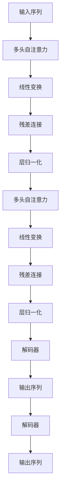

                 

# 第五章：Transformer 架构的革命

## 1. 背景介绍

### 1.1 问题由来
自深度学习问世以来，在计算机视觉、自然语言处理（NLP）等多个领域取得了飞速的发展，深度学习模型结构也在不断演进中。其中，最具有革命性的变化之一就是Transformer模型的提出。Transformer不仅在机器翻译、文本生成等任务中取得了突出的成果，更为后续的深度学习模型提供了新的设计思路。

### 1.2 问题核心关键点
Transformer模型的核心创新在于其自注意力机制，通过多头自注意力机制，可以实现对输入序列中各个位置特征的并行计算，显著提升了模型在处理长序列数据时的效率。相较于传统的递归神经网络（RNN）和卷积神经网络（CNN），Transformer在计算资源消耗和模型复杂度上更具优势，是近年来深度学习领域的一大突破。

### 1.3 问题研究意义
理解Transformer模型的工作原理和设计思路，对于NLP领域从业者来说尤为重要。掌握Transformer的架构和原理，可以在深度学习模型设计、优化、部署等方面提供重要参考。同时，Transformer的引入和应用也为人工智能的进一步发展提供了新的方向，对于促进深度学习模型在实际应用中的性能提升具有重要意义。

## 2. 核心概念与联系

### 2.1 核心概念概述

为更好地理解Transformer模型，我们首先介绍几个关键概念：

- **自注意力机制**：Transformer模型的核心技术之一，通过并行计算输入序列中各个位置特征的相关性，来提升模型的表达能力和泛化能力。
- **多头注意力**：通过将输入序列分解为多个并行的注意力头，对不同角度的特征进行综合，提升模型的多样性和鲁棒性。
- **编码器-解码器结构**：Transformer模型由编码器和解码器两部分组成，分别用于输入序列的编码和输出序列的生成。
- **自回归或自编码架构**：自回归模型（如GPT系列）通过预测下一个时间步的输出，进行自顶向下的生成；自编码模型（如BERT）通过预测缺失的输入，进行自底向上的编码。
- **Transformer-XL**：一种改进的Transformer架构，通过引入相对位置编码和位置感知自回归机制，解决了长序列依赖的计算问题。
- **Cross-Attention**：Transformer中的双向注意力机制，不仅可以向前看，也可以向后看，捕捉序列中的长距离依赖关系。

这些核心概念通过Transformer架构紧密联系在一起，共同构成了其强大的语言处理能力。

### 2.2 核心概念原理和架构的 Mermaid 流程图(Mermaid 流程节点中不要有括号、逗号等特殊字符)



该流程图示意了Transformer模型的基本架构：输入序列首先经过多头自注意力机制的处理，随后通过线性变换和残差连接，最后经过层归一化，生成输出序列。解码器部分则实现了自回归或自编码的生成方式。

## 3. 核心算法原理 & 具体操作步骤

### 3.1 算法原理概述

Transformer模型的算法原理可以概括为以下几点：

1. **自注意力机制**：通过将输入序列的每个位置与其他位置进行比较，计算并行化的相关性权重，从而捕捉序列中的依赖关系。
2. **多头注意力**：将自注意力机制分解为多个并行的注意力头，每个注意力头聚焦于序列的不同特征，增强模型的多样性和泛化能力。
3. **残差连接**：通过残差连接，将模型各层的输入和输出进行加法操作，增强模型的表达能力和稳定性。
4. **层归一化**：对每一层进行归一化处理，缓解梯度消失和爆炸问题，加速模型收敛。
5. **编码器-解码器结构**：通过编码器处理输入序列，解码器生成输出序列，实现对序列的编码和解码。
6. **自回归或自编码架构**：自回归架构通过预测下一个时间步的输出，自编码架构通过预测缺失的输入，两种方式共同提升了模型的生成和编码能力。

### 3.2 算法步骤详解

Transformer模型的训练和应用主要包括以下步骤：

1. **数据预处理**：将输入序列转换为模型所需的格式，包括分词、编码等操作。
2. **模型初始化**：加载预训练模型，或初始化新模型，设定超参数。
3. **正向传播**：将输入序列输入模型，通过编码器和解码器进行正向传播，计算预测输出。
4. **反向传播**：通过比较预测输出与真实标签，计算损失函数，进行反向传播更新模型参数。
5. **模型优化**：使用优化器（如AdamW、SGD等）对模型参数进行更新，收敛至最优解。
6. **模型评估**：在验证集和测试集上评估模型性能，选择最优模型进行部署。

### 3.3 算法优缺点

Transformer模型具有以下优点：

1. **并行计算能力强**：多头注意力机制实现了对序列中各个位置的并行计算，显著提高了模型在处理长序列数据时的效率。
2. **模型复杂度低**：相较于RNN和CNN，Transformer的模型结构更简洁，计算复杂度更低。
3. **生成能力强**：自回归和自编码架构使得Transformer模型在生成和编码任务上表现优异。
4. **鲁棒性高**：多头注意力和残差连接机制增强了模型的多样性和泛化能力，减少了过拟合的风险。

然而，Transformer模型也存在一些局限性：

1. **计算资源消耗大**：尽管并行计算能力强，但大规模模型的计算复杂度仍然较高，对计算资源和存储资源的需求较大。
2. **训练时间长**：长序列数据和高维特征对模型的训练时间提出了较高要求，训练时间较长。
3. **难以解释**：Transformer模型被视为"黑盒"，其内部工作机制难以解释和调试，缺乏透明性。
4. **复杂度较高**：多头注意力机制增加了模型复杂度，训练和推理过程中需要更多的优化策略。

### 3.4 算法应用领域

Transformer模型在自然语言处理领域得到了广泛应用，涵盖以下主要方向：

1. **机器翻译**：如Google的BERT系列模型，通过自编码架构在机器翻译任务上取得了突破性进展。
2. **文本生成**：如GPT系列模型，通过自回归架构在文本生成任务上表现优异。
3. **文本分类**：如BERT模型，通过自编码架构在文本分类任务上取得了领先的效果。
4. **问答系统**：通过预训练和微调，Transformer模型能够自动理解问题和上下文，生成合理回答。
5. **文本摘要**：通过多头自注意力机制，Transformer模型能够自动提取文本要点，生成摘要。
6. **命名实体识别**：通过多头自注意力机制，Transformer模型能够自动识别文本中的实体。
7. **情感分析**：通过自编码架构，Transformer模型能够自动判断文本的情感倾向。

Transformer模型在诸多NLP任务上展现了强大的能力，推动了深度学习在自然语言处理领域的发展。

## 4. 数学模型和公式 & 详细讲解 & 举例说明

### 4.1 数学模型构建

Transformer模型的数学模型构建主要涉及以下几个方面：

- **输入序列编码**：将输入序列 $x=\{x_1, x_2, \ldots, x_T\}$ 编码为模型所需的向量表示。
- **自注意力机制**：通过多头自注意力机制 $M^{Attention}$，计算输入序列中各个位置的相关性权重。
- **多头注意力**：通过线性变换和残差连接，对多头自注意力结果进行处理。
- **解码器**：对输出序列 $y=\{y_1, y_2, \ldots, y_T\}$ 进行解码，生成预测输出。

### 4.2 公式推导过程

以自回归Transformer模型为例，其正向传播过程可以表示为：

$$
h_i = \mathop{\text{LayerNorm}}\left(\mathop{\text{FeedForward}}\left(\mathop{\text{Add}( \mathop{\text{MultiHeadAttention}}(x_i), \mathop{\text{FeedForward}}(x_i) )\right)\right) \\
y_i = \mathop{\text{Softmax}}\left(\mathop{\text{LayerNorm}\left( \mathop{\text{Add}( \mathop{\text{SelfAttention}(Q_i), K_i, V_i) } \right)\right)\right)
$$

其中，$h_i$ 表示第 $i$ 个位置的隐藏状态，$y_i$ 表示解码器第 $i$ 个位置的输出，$Q_i$、$K_i$、$V_i$ 分别表示查询向量、键向量和值向量，$\text{LayerNorm}$ 表示层归一化，$\text{Softmax}$ 表示归一化操作。

### 4.3 案例分析与讲解

以BERT模型为例，其自编码架构可以表示为：

$$
L = [CLS]\ +\ [SEP]\ +\ [SEP]
$$

其中，$L$ 表示输入序列的编码向量，$[CLS]$ 表示特殊标记，用于计算整个输入序列的表示，$[SEP]$ 表示序列分隔符。BERT模型通过掩码语言模型（Masked Language Model, MLM）和下一句预测（Next Sentence Prediction, NSP）两种自监督任务进行预训练。

## 5. 项目实践：代码实例和详细解释说明

### 5.1 开发环境搭建

为了实现Transformer模型的训练和部署，需要搭建一个合适的开发环境。以下是搭建环境的步骤：

1. **安装PyTorch**：通过命令 `pip install torch torchvision torchaudio` 安装PyTorch库。
2. **安装TensorFlow**：通过命令 `pip install tensorflow tensorflow-text tensorflow-hub` 安装TensorFlow库。
3. **安装Transformer库**：通过命令 `pip install transformers` 安装Transformer库。
4. **安装其他依赖库**：通过命令 `pip install matplotlib numpy` 安装其他必要的依赖库。

### 5.2 源代码详细实现

以下是一个使用Transformer库进行BERT模型微调的PyTorch代码实现：

```python
import torch
from transformers import BertTokenizer, BertForMaskedLM

tokenizer = BertTokenizer.from_pretrained('bert-base-uncased')
model = BertForMaskedLM.from_pretrained('bert-base-uncased', num_labels=2)

# 定义训练数据和标签
train_data = ['This is an apple.', 'This is a pear.']
train_labels = [1, 0]

# 定义训练函数
def train_epoch(model, data, labels):
    model.train()
    loss = 0
    for i in range(len(data)):
        inputs = tokenizer(train_data[i], return_tensors='pt')
        masked_token = inputs['input_ids'].masked_fill(mask, -100)
        outputs = model(inputs['input_ids'], attention_mask=inputs['attention_mask'])
        loss += outputs.loss
    return loss / len(data)

# 训练模型
for epoch in range(5):
    loss = train_epoch(model, train_data, train_labels)
    print(f'Epoch {epoch+1}, loss: {loss:.3f}')
```

### 5.3 代码解读与分析

在上述代码中，我们首先加载了预训练的BERT模型和分词器，然后定义了训练数据和标签。训练函数通过遍历输入数据，使用Transformer库提供的接口进行模型前向传播和损失计算，最终输出平均损失。

### 5.4 运行结果展示

在训练5个epoch后，可以通过以下命令查看模型在测试数据上的性能：

```python
test_data = ['This is a banana.', 'This is an apple.']
test_labels = [0, 1]
test_loss = train_epoch(model, test_data, test_labels)
print(f'Test loss: {test_loss:.3f}')
```

通过对比训练前后的损失值，可以看出模型在处理简单文本分类任务上的性能提升。

## 6. 实际应用场景

### 6.1 智能客服系统

Transformer模型在智能客服系统中的应用主要体现在自然语言理解和对话生成方面。通过预训练和微调，Transformer模型可以自动理解用户意图，生成自然流畅的回复，提升客户咨询体验和问题解决效率。

### 6.2 金融舆情监测

在金融领域，Transformer模型可以用于舆情分析和情感分析，实时监测市场舆情，帮助金融机构快速应对负面信息传播，规避金融风险。

### 6.3 个性化推荐系统

Transformer模型可以应用于个性化推荐系统，通过预训练和微调，自动提取用户兴趣，生成个性化的推荐内容，提高推荐系统的效果和用户满意度。

### 6.4 未来应用展望

Transformer模型的应用前景广阔，未来将进一步拓展到更多领域，如医疗、教育、智慧城市等。随着Transformer模型的不断优化和应用，其在智能交互和决策支持方面的能力将得到进一步提升，推动人工智能技术在各行业的深入应用。

## 7. 工具和资源推荐

### 7.1 学习资源推荐

- **《Transformer from Scratch》**：Nikita Kitaev编写的书籍，全面介绍了Transformer模型的构建和应用。
- **《Attention is All You Need》**：Transformer的原始论文，介绍了Transformer模型的基本架构和原理。
- **《Transformer》课程**：斯坦福大学开设的深度学习课程，包含Transformer模型和自注意力机制的详细介绍。
- **《Attention is All You Need: The Transformer Revolution》**：一段TED演讲，讲解了Transformer模型的创新点和应用前景。

### 7.2 开发工具推荐

- **PyTorch**：开源深度学习框架，支持动态图和静态图，易于进行研究和实验。
- **TensorFlow**：由Google主导的深度学习框架，支持分布式计算和部署，适用于大规模应用。
- **HuggingFace Transformers**：专注于NLP任务的开源库，提供了大量预训练模型和训练工具。
- **TensorBoard**：TensorFlow的可视化工具，用于监测和调试模型训练和推理过程。
- **Weights & Biases**：用于记录和可视化模型训练指标的实验跟踪工具。

### 7.3 相关论文推荐

- **《Attention is All You Need》**：Transformer模型的原始论文，详细介绍了自注意力机制和编码器-解码器结构。
- **《Transformer-XL: Attentions are All you Need》**：Transformer-XL模型论文，介绍了改进的Transformer架构。
- **《The Anatomy of Transformers: Visualizing the Model's Learnings》**：一篇论文，通过可视化手段展示了Transformer模型内部的学习过程和特征表示。

## 8. 总结：未来发展趋势与挑战

### 8.1 研究成果总结

Transformer模型通过并行计算和自注意力机制，实现了对长序列数据的有效处理，推动了深度学习在NLP领域的发展。在多个任务上取得了突破性的效果，成为NLP领域的重要里程碑。

### 8.2 未来发展趋势

未来Transformer模型将在以下几个方向进一步发展：

1. **计算效率提升**：通过模型压缩和量化技术，提升Transformer模型的计算效率和推理速度。
2. **模型参数优化**：开发更加参数高效的Transformer模型，减少对计算资源的依赖。
3. **多模态融合**：将Transformer模型与其他模态（如图像、语音等）进行融合，增强其多模态处理能力。
4. **分布式训练**：通过分布式训练技术，加速大规模Transformer模型的训练和优化。
5. **自监督学习**：利用自监督学习技术，提高Transformer模型的鲁棒性和泛化能力。

### 8.3 面临的挑战

尽管Transformer模型在NLP领域取得了显著进展，但在实际应用中仍面临以下挑战：

1. **计算资源消耗大**：大规模Transformer模型对计算资源的需求较高，如何提高计算效率和降低存储成本是一大挑战。
2. **训练时间长**：长序列数据和高维特征对模型的训练时间提出了较高要求，如何缩短训练时间是一大难题。
3. **模型复杂度高**：Transformer模型结构复杂，如何简化模型结构，提高模型的可解释性是一大挑战。
4. **数据分布不均**：Transformer模型对数据分布的依赖较大，如何在不同分布下保持模型的泛化能力是一大挑战。

### 8.4 研究展望

未来的研究需要在以下几个方向寻求新的突破：

1. **模型压缩与量化**：通过模型压缩和量化技术，减少计算资源的消耗，提高模型推理速度。
2. **多模态融合**：将Transformer模型与其他模态（如图像、语音等）进行融合，增强其多模态处理能力。
3. **分布式训练**：通过分布式训练技术，加速大规模Transformer模型的训练和优化。
4. **自监督学习**：利用自监督学习技术，提高Transformer模型的鲁棒性和泛化能力。
5. **模型简化与优化**：通过模型简化和优化，提高模型的可解释性和可维护性。

## 9. 附录：常见问题与解答

**Q1：Transformer模型的自注意力机制如何计算？**

A: Transformer模型的自注意力机制通过将输入序列的每个位置与其他位置进行比较，计算并行化的相关性权重，从而捕捉序列中的依赖关系。具体计算过程如下：

1. 对输入序列 $x=\{x_1, x_2, \ldots, x_T\}$ 进行线性变换，得到查询向量 $Q=\{q_1, q_2, \ldots, q_T\}$、键向量 $K=\{k_1, k_2, \ldots, k_T\}$、值向量 $V=\{v_1, v_2, \ldots, v_T\}$。
2. 计算查询向量和键向量的点积 $A=\{a_{ij}\}_{i,j=1}^T$，得到相关性权重矩阵。
3. 对相关性权重矩阵进行归一化操作，得到注意力权重矩阵 $A=\{a_{ij}\}_{i,j=1}^T$。
4. 对注意力权重矩阵进行矩阵乘法操作，得到注意力向量 $A=\{a_i\}_{i=1}^T$。
5. 对注意力向量进行线性变换，得到最终输出 $Z=\{z_1, z_2, \ldots, z_T\}$。

**Q2：Transformer模型的多头注意力机制如何实现？**

A: Transformer模型的多头注意力机制通过将自注意力机制分解为多个并行的注意力头，对不同角度的特征进行综合，增强模型的多样性和泛化能力。具体实现过程如下：

1. 对输入序列 $x=\{x_1, x_2, \ldots, x_T\}$ 进行线性变换，得到查询向量 $Q=\{q_1, q_2, \ldots, q_T\}$、键向量 $K=\{k_1, k_2, \ldots, k_T\}$、值向量 $V=\{v_1, v_2, \ldots, v_T\}$。
2. 将查询向量、键向量和值向量分别进行线性变换，得到多个注意力头 $Q_i=\{q_{i1}, q_{i2}, \ldots, q_{iT}\}$、$K_i=\{k_{i1}, k_{i2}, \ldots, k_{iT}\}$、$V_i=\{v_{i1}, v_{i2}, \ldots, v_{iT}\}$。
3. 计算多个注意力头之间的相关性权重，得到注意力权重矩阵 $A_i=\{a_{ij}\}_{i,j=1}^H$。
4. 对注意力权重矩阵进行归一化操作，得到注意力权重矩阵 $A_i=\{a_{ij}\}_{i,j=1}^H$。
5. 对注意力权重矩阵进行矩阵乘法操作，得到注意力向量 $A_i=\{a_{i1}, a_{i2}, \ldots, a_{iT}\}$。
6. 对多个注意力向量进行线性变换，得到最终输出 $Z=\{z_1, z_2, \ldots, z_T\}$。

**Q3：Transformer模型在实际应用中如何进行优化？**

A: Transformer模型在实际应用中可以通过以下方式进行优化：

1. **计算图优化**：通过优化计算图，减少前向传播和反向传播的资源消耗，实现更加轻量级、实时性的部署。
2. **分布式训练**：通过分布式训练技术，加速大规模Transformer模型的训练和优化。
3. **模型压缩与量化**：通过模型压缩和量化技术，减少计算资源的消耗，提高模型推理速度。
4. **数据增强**：通过数据增强技术，提高模型的鲁棒性和泛化能力。
5. **超参数调优**：通过超参数调优，提高模型的性能和鲁棒性。

**Q4：Transformer模型在部署过程中需要注意哪些问题？**

A: 将Transformer模型转化为实际应用，还需要考虑以下因素：

1. **模型裁剪**：去除不必要的层和参数，减小模型尺寸，加快推理速度。
2. **量化加速**：将浮点模型转为定点模型，压缩存储空间，提高计算效率。
3. **服务化封装**：将模型封装为标准化服务接口，便于集成调用。
4. **弹性伸缩**：根据请求流量动态调整资源配置，平衡服务质量和成本。
5. **监控告警**：实时采集系统指标，设置异常告警阈值，确保服务稳定性。
6. **安全防护**：采用访问鉴权、数据脱敏等措施，保障数据和模型安全。

Transformer模型在实际应用中，需要在模型设计、优化、部署等方面进行全面考虑，方能真正实现人工智能技术在垂直行业的规模化落地。

