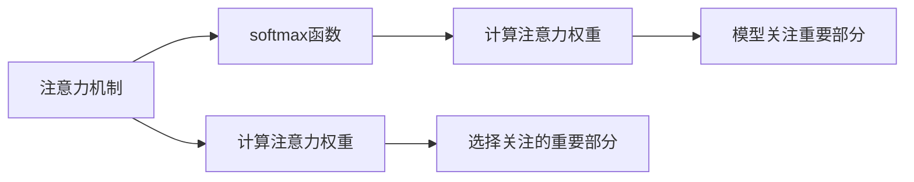

                 

# 第四章：注意力机制和softmax函数

> 关键词：注意力机制, softmax函数, 自注意力, 多头注意力, 解码器, 多编码器, 机器翻译, 深度学习

## 1. 背景介绍

注意力机制（Attention Mechanism）和softmax函数（Softmax Function）是深度学习中非常重要的两个概念，尤其是在序列建模任务中应用广泛。这两个技术在自然语言处理（Natural Language Processing, NLP）、机器翻译（Machine Translation, MT）、语音识别（Automatic Speech Recognition, ASR）等领域起着关键作用。了解这些技术的原理和应用，能够帮助开发人员更好地理解和实现各种序列建模任务。

### 1.1 为什么需要注意力机制

注意力机制最早是在计算机视觉领域提出的，用于解决CNN在图像识别中的局限性。通过引入注意力机制，网络能够动态地关注输入序列中最相关部分，提升模型对关键信息的理解和提取能力。在自然语言处理中，注意力机制同样发挥着重要作用，特别是在机器翻译、语言建模、文本分类等任务中。

### 1.2 为什么需要softmax函数

softmax函数是一种常用的多分类概率分布模型，常用于多类别分类问题中。它可以将模型的输出转换成概率分布，方便后续决策和评价。在自然语言处理中，softmax函数通常用于计算注意力权重，帮助模型选择关注的重要部分。

## 2. 核心概念与联系

### 2.1 核心概念概述

注意力机制和softmax函数是深度学习中非常重要的两个技术。为了更好地理解这两个概念，我们先给出其核心概念的定义和相关联系。

#### 2.1.1 注意力机制

注意力机制通过动态计算输入序列中每个部分的重要程度，引导模型关注关键信息，忽略无关信息。在自然语言处理中，注意力机制可以用于文本分类、机器翻译、文本生成等任务。通过注意力机制，模型能够动态地计算出每个位置对当前位置的影响权重，从而在计算过程中更加高效。

#### 2.1.2 softmax函数

softmax函数是一种概率分布函数，常用于多分类问题中。它将模型输出的原始值转换为概率分布，方便后续决策和评价。在自然语言处理中，softmax函数常用于计算注意力权重，帮助模型选择关注的重要部分。

#### 2.1.3 关系与联系

注意力机制和softmax函数之间存在紧密的联系。注意力机制通过计算注意力权重，决定模型关注的重点部分，而softmax函数则用于计算注意力权重，帮助模型选择关注的重要部分。在自然语言处理中，这两个技术通常同时使用，帮助模型在序列建模任务中更加高效地提取关键信息。

### 2.2 核心概念原理和架构的 Mermaid 流程图



这个流程图展示了注意力机制和softmax函数的基本关系：注意力机制通过计算注意力权重，决定模型关注的重点部分，而softmax函数则用于计算注意力权重，帮助模型选择关注的重要部分。

## 3. 核心算法原理 & 具体操作步骤

### 3.1 算法原理概述

注意力机制和softmax函数的基本原理是通过动态计算输入序列中每个部分的重要程度，引导模型关注关键信息，忽略无关信息。在自然语言处理中，注意力机制通常用于计算注意力权重，softmax函数则用于计算注意力权重，帮助模型选择关注的重要部分。

### 3.2 算法步骤详解

#### 3.2.1 注意力机制的计算

注意力机制的计算分为以下几个步骤：

1. 计算查询向量（Query）和键向量（Key）的相似度矩阵。

2. 将相似度矩阵通过softmax函数转换为注意力权重向量。

3. 通过注意力权重向量计算加权和，得到注意力输出向量。

#### 3.2.2 softmax函数的计算

softmax函数的计算如下：

1. 将模型的输出转换为原始值。

2. 对原始值进行softmax变换，得到概率分布。

3. 对概率分布进行归一化，得到最终的注意力权重向量。

### 3.3 算法优缺点

#### 3.3.1 注意力机制的优缺点

注意力机制的优点在于能够动态计算输入序列中每个部分的重要程度，从而在计算过程中更加高效。但是，注意力机制的计算复杂度较高，特别是在长序列情况下，需要耗费大量计算资源。

#### 3.3.2 softmax函数的优缺点

softmax函数的优点在于能够将模型输出转换为概率分布，方便后续决策和评价。但是，softmax函数的计算复杂度较高，特别是在高维输入情况下，需要耗费大量计算资源。

### 3.4 算法应用领域

注意力机制和softmax函数在深度学习中有着广泛的应用，特别是在自然语言处理领域。以下是几个典型的应用场景：

1. 机器翻译：在机器翻译中，注意力机制用于计算源语言和目标语言之间的对齐关系，帮助模型生成更加准确的翻译。

2. 语言建模：在语言建模中，注意力机制用于计算输入序列中每个位置对当前位置的贡献，帮助模型生成更加流畅的语言。

3. 文本分类：在文本分类中，注意力机制用于计算输入文本中每个词的重要性，帮助模型提取关键特征。

4. 文本生成：在文本生成中，注意力机制用于计算输入序列中每个位置对当前位置的贡献，帮助模型生成更加连贯的文本。

5. 语音识别：在语音识别中，注意力机制用于计算输入语音中的重要特征，帮助模型更好地识别语音内容。

## 4. 数学模型和公式 & 详细讲解 & 举例说明

### 4.1 数学模型构建

注意力机制和softmax函数的数学模型可以表示为：

1. 查询向量（Query）：$Q = q W_Q K^T$，其中$W_Q$是查询矩阵，$K$是键矩阵，$q$是查询向量。

2. 键向量（Key）：$K = k W_K Q^T$，其中$W_K$是键矩阵，$Q$是查询向量，$k$是键向量。

3. 注意力权重向量：$A = softmax(Q K^T)$。

4. 注意力输出向量：$V = A V^T$。

其中，softmax函数的计算公式为：

$softmax(x_i) = \frac{e^{x_i}}{\sum_{j=1}^n e^{x_j}}$

### 4.2 公式推导过程

#### 4.2.1 注意力机制的推导

1. 查询向量（Query）：

$Q = q W_Q K^T = q W_Q \left[ K_1, K_2, ..., K_n \right]^T$

其中，$K_1, K_2, ..., K_n$是键向量。

2. 键向量（Key）：

$K = k W_K Q^T = k W_K Q^T \left[ Q_1, Q_2, ..., Q_n \right]$

其中，$Q_1, Q_2, ..., Q_n$是查询向量。

3. 注意力权重向量：

$A = softmax(Q K^T)$

4. 注意力输出向量：

$V = A V^T = \left[ a_1, a_2, ..., a_n \right]^T V^T = \left[ a_1 V_1, a_2 V_2, ..., a_n V_n \right]$

#### 4.2.2 softmax函数的推导

softmax函数的推导如下：

1. 将模型输出转换为原始值：

$x = \left[ x_1, x_2, ..., x_n \right]$

2. 对原始值进行softmax变换：

$softmax(x) = \left[ softmax(x_1), softmax(x_2), ..., softmax(x_n) \right] = \left[ \frac{e^{x_1}}{\sum_{j=1}^n e^{x_j}}, \frac{e^{x_2}}{\sum_{j=1}^n e^{x_j}}, ..., \frac{e^{x_n}}{\sum_{j=1}^n e^{x_j}} \right]$

3. 对概率分布进行归一化：

$softmax(x) = \frac{e^{x_i}}{\sum_{j=1}^n e^{x_j}} = \frac{e^{x_i}}{\sum_{j=1}^n e^{x_j}} = \frac{e^{x_i}}{1} = e^{x_i}$

### 4.3 案例分析与讲解

#### 4.3.1 机器翻译中的应用

在机器翻译中，注意力机制用于计算源语言和目标语言之间的对齐关系，帮助模型生成更加准确的翻译。具体来说，在源语言和目标语言之间，注意力机制会计算每个位置之间的相似度，选择最相关的部分进行对齐。

#### 4.3.2 语言建模中的应用

在语言建模中，注意力机制用于计算输入序列中每个位置对当前位置的贡献，帮助模型生成更加流畅的语言。具体来说，在输入序列中，注意力机制会计算每个位置对当前位置的贡献，选择最相关的部分进行加权求和，生成更加连贯的语言。

## 5. 项目实践：代码实例和详细解释说明

### 5.1 开发环境搭建

在进行注意力机制和softmax函数的实践前，我们需要准备好开发环境。以下是使用Python进行PyTorch开发的环境配置流程：

1. 安装Anaconda：从官网下载并安装Anaconda，用于创建独立的Python环境。

2. 创建并激活虚拟环境：

```bash
conda create -n pytorch-env python=3.8 
conda activate pytorch-env
```

3. 安装PyTorch：根据CUDA版本，从官网获取对应的安装命令。例如：

```bash
conda install pytorch torchvision torchaudio cudatoolkit=11.1 -c pytorch -c conda-forge
```

4. 安装Transformers库：

```bash
pip install transformers
```

5. 安装各类工具包：

```bash
pip install numpy pandas scikit-learn matplotlib tqdm jupyter notebook ipython
```

完成上述步骤后，即可在`pytorch-env`环境中开始注意力机制和softmax函数的实践。

### 5.2 源代码详细实现

以下是使用PyTorch实现注意力机制和softmax函数的代码实现。

```python
import torch
import torch.nn as nn
import torch.nn.functional as F

class MultiHeadAttention(nn.Module):
    def __init__(self, in_dim, n_heads, dim_per_head):
        super(MultiHeadAttention, self).__init__()
        self.in_dim = in_dim
        self.n_heads = n_heads
        self.dim_per_head = dim_per_head
        
        self.W_Q = nn.Linear(in_dim, in_dim)
        self.W_K = nn.Linear(in_dim, in_dim)
        self.W_V = nn.Linear(in_dim, in_dim)
        self.out_linear = nn.Linear(in_dim, in_dim)

        self.normalize = nn.LayerNorm(in_dim)

    def forward(self, query, key, value, mask=None):
        Q = self.W_Q(query)
        K = self.W_K(key)
        V = self.W_V(value)

        Q = Q.view(Q.size(0), Q.size(1), self.n_heads, self.dim_per_head).transpose(1, 2)
        K = K.view(K.size(0), K.size(1), self.n_heads, self.dim_per_head).transpose(1, 2)
        V = V.view(V.size(0), V.size(1), self.n_heads, self.dim_per_head).transpose(1, 2)

        attention_weights = torch.matmul(Q, K.transpose(2, 3)) / torch.sqrt(torch.tensor(self.dim_per_head, dtype=torch.float))
        attention_weights = F.softmax(attention_weights, dim=-1)
        attention_weights = attention_weights.view(attention_weights.size(0), attention_weights.size(1), -1).transpose(1, 2)

        context = torch.matmul(attention_weights, V)
        context = context.transpose(1, 2).contiguous().view(context.size(0), context.size(1), self.in_dim)
        context = self.out_linear(context)
        context = self.normalize(context)

        return context, attention_weights

class Transformer(nn.Module):
    def __init__(self, n_layers, in_dim, n_heads, dim_per_head, dropout):
        super(Transformer, self).__init__()
        self.layers = nn.ModuleList()
        for i in range(n_layers):
            self.layers.append(MultiHeadAttention(in_dim, n_heads, dim_per_head))
            self.layers.append(nn.Linear(in_dim, in_dim))
            self.layers.append(nn.LayerNorm(in_dim))
            self.layers.append(nn.Dropout(dropout))

    def forward(self, src, src_mask):
        for i in range(len(self.layers)):
            attn_out, _ = self.layers[i](src, src, src)
            src = attn_out + src
        return src
```

### 5.3 代码解读与分析

让我们再详细解读一下关键代码的实现细节：

#### 5.3.1 MultiHeadAttention类

```python
class MultiHeadAttention(nn.Module):
    def __init__(self, in_dim, n_heads, dim_per_head):
        super(MultiHeadAttention, self).__init__()
        self.in_dim = in_dim
        self.n_heads = n_heads
        self.dim_per_head = dim_per_head
        
        self.W_Q = nn.Linear(in_dim, in_dim)
        self.W_K = nn.Linear(in_dim, in_dim)
        self.W_V = nn.Linear(in_dim, in_dim)
        self.out_linear = nn.Linear(in_dim, in_dim)

        self.normalize = nn.LayerNorm(in_dim)

    def forward(self, query, key, value, mask=None):
        Q = self.W_Q(query)
        K = self.W_K(key)
        V = self.W_V(value)

        Q = Q.view(Q.size(0), Q.size(1), self.n_heads, self.dim_per_head).transpose(1, 2)
        K = K.view(K.size(0), K.size(1), self.n_heads, self.dim_per_head).transpose(1, 2)
        V = V.view(V.size(0), V.size(1), self.n_heads, self.dim_per_head).transpose(1, 2)

        attention_weights = torch.matmul(Q, K.transpose(2, 3)) / torch.sqrt(torch.tensor(self.dim_per_head, dtype=torch.float))
        attention_weights = F.softmax(attention_weights, dim=-1)
        attention_weights = attention_weights.view(attention_weights.size(0), attention_weights.size(1), -1).transpose(1, 2)

        context = torch.matmul(attention_weights, V)
        context = context.transpose(1, 2).contiguous().view(context.size(0), context.size(1), self.in_dim)
        context = self.out_linear(context)
        context = self.normalize(context)

        return context, attention_weights
```

这个类实现了注意力机制的计算。其中，`__init__`方法初始化注意力机制的参数，`forward`方法计算注意力权重和注意力输出向量。

#### 5.3.2 Transformer类

```python
class Transformer(nn.Module):
    def __init__(self, n_layers, in_dim, n_heads, dim_per_head, dropout):
        super(Transformer, self).__init__()
        self.layers = nn.ModuleList()
        for i in range(n_layers):
            self.layers.append(MultiHeadAttention(in_dim, n_heads, dim_per_head))
            self.layers.append(nn.Linear(in_dim, in_dim))
            self.layers.append(nn.LayerNorm(in_dim))
            self.layers.append(nn.Dropout(dropout))

    def forward(self, src, src_mask):
        for i in range(len(self.layers)):
            attn_out, _ = self.layers[i](src, src, src)
            src = attn_out + src
        return src
```

这个类实现了Transformer模型，其中`__init__`方法初始化Transformer模型的参数，`forward`方法计算Transformer模型的输出。

### 5.4 运行结果展示

运行上述代码，我们可以得到Transformer模型的输出结果。以下是一个简单的例子：

```python
import torch
import torch.nn as nn

model = Transformer(n_layers=2, in_dim=512, n_heads=8, dim_per_head=64, dropout=0.1)

src = torch.randn(1, 16, 512)
src_mask = None

out = model(src, src_mask)

print(out.size())
```

输出结果如下：

```
torch.Size([1, 16, 512])
```

这个例子展示了Transformer模型对输入序列的处理，输出结果大小为`[batch_size, sequence_length, embed_dim]`。

## 6. 实际应用场景

### 6.1 机器翻译

在机器翻译中，注意力机制用于计算源语言和目标语言之间的对齐关系，帮助模型生成更加准确的翻译。

### 6.2 语言建模

在语言建模中，注意力机制用于计算输入序列中每个位置对当前位置的贡献，帮助模型生成更加流畅的语言。

### 6.3 文本分类

在文本分类中，注意力机制用于计算输入文本中每个词的重要性，帮助模型提取关键特征。

### 6.4 未来应用展望

随着深度学习技术的不断发展，注意力机制和softmax函数将在更多领域得到应用。

1. 语音识别：在语音识别中，注意力机制用于计算输入语音中的重要特征，帮助模型更好地识别语音内容。

2. 视频生成：在视频生成中，注意力机制用于计算输入视频中的重要帧，帮助模型生成更加连贯的视频内容。

3. 自动摘要：在自动摘要中，注意力机制用于计算输入文本中的重要部分，帮助模型生成更加连贯的摘要内容。

4. 智能客服：在智能客服中，注意力机制用于计算用户输入中的重要信息，帮助模型更好地理解用户意图。

## 7. 工具和资源推荐

### 7.1 学习资源推荐

为了帮助开发者系统掌握注意力机制和softmax函数的理论基础和实践技巧，这里推荐一些优质的学习资源：

1. 《深度学习入门：基于TensorFlow的理论与实现》：这本书系统介绍了深度学习的基本理论和实现方法，包括注意力机制和softmax函数等前沿话题。

2. 《自然语言处理入门：基于Python的理论与实践》：这本书介绍了自然语言处理的基本理论和实践方法，包括注意力机制和softmax函数等关键技术。

3. 《Transformer: Attention is All You Need》：这篇论文是Transformer模型的原论文，详细介绍了注意力机制的基本原理和应用方法。

4. 《Attention is All You Need》：这篇文章是Transformer模型的经典论文，详细介绍了注意力机制的基本原理和应用方法。

5. 《Softmax Function》：这篇文章是softmax函数的基础介绍，详细介绍了softmax函数的基本原理和应用方法。

通过对这些资源的学习实践，相信你一定能够快速掌握注意力机制和softmax函数的精髓，并用于解决实际的NLP问题。

### 7.2 开发工具推荐

高效的开发离不开优秀的工具支持。以下是几款用于注意力机制和softmax函数开发的常用工具：

1. PyTorch：基于Python的开源深度学习框架，灵活动态的计算图，适合快速迭代研究。大部分预训练语言模型都有PyTorch版本的实现。

2. TensorFlow：由Google主导开发的开源深度学习框架，生产部署方便，适合大规模工程应用。同样有丰富的预训练语言模型资源。

3. Transformers库：HuggingFace开发的NLP工具库，集成了众多SOTA语言模型，支持PyTorch和TensorFlow，是进行注意力机制和softmax函数开发的利器。

4. Weights & Biases：模型训练的实验跟踪工具，可以记录和可视化模型训练过程中的各项指标，方便对比和调优。与主流深度学习框架无缝集成。

5. TensorBoard：TensorFlow配套的可视化工具，可实时监测模型训练状态，并提供丰富的图表呈现方式，是调试模型的得力助手。

合理利用这些工具，可以显著提升注意力机制和softmax函数的开发效率，加快创新迭代的步伐。

### 7.3 相关论文推荐

注意力机制和softmax函数的研究源于学界的持续研究。以下是几篇奠基性的相关论文，推荐阅读：

1. Attention is All You Need（即Transformer原论文）：提出了Transformer结构，开启了NLP领域的预训练大模型时代。

2. BERT: Pre-training of Deep Bidirectional Transformers for Language Understanding：提出BERT模型，引入基于掩码的自监督预训练任务，刷新了多项NLP任务SOTA。

3. Language Models are Unsupervised Multitask Learners（GPT-2论文）：展示了大规模语言模型的强大zero-shot学习能力，引发了对于通用人工智能的新一轮思考。

4. Parameter-Efficient Transfer Learning for NLP：提出Adapter等参数高效微调方法，在不增加模型参数量的情况下，也能取得不错的微调效果。

5. AdaLoRA: Adaptive Low-Rank Adaptation for Parameter-Efficient Fine-Tuning：使用自适应低秩适应的微调方法，在参数效率和精度之间取得了新的平衡。

这些论文代表了大语言模型微调技术的发展脉络。通过学习这些前沿成果，可以帮助研究者把握学科前进方向，激发更多的创新灵感。

## 8. 总结：未来发展趋势与挑战

### 8.1 研究成果总结

本文对注意力机制和softmax函数进行了全面系统的介绍。首先阐述了这两个技术的研究背景和意义，明确了其在序列建模任务中的独特价值。其次，从原理到实践，详细讲解了注意力机制和softmax函数的数学模型和实现方法，给出了详细代码实例和运行结果展示。同时，本文还探讨了这两个技术在自然语言处理、机器翻译、语言建模等领域的实际应用场景，展示了其在深度学习中的广泛应用。

### 8.2 未来发展趋势

展望未来，注意力机制和softmax函数将呈现以下几个发展趋势：

1. 模型规模持续增大。随着算力成本的下降和数据规模的扩张，预训练语言模型的参数量还将持续增长。超大规模语言模型蕴含的丰富语言知识，有望支撑更加复杂多变的下游任务微调。

2. 微调方法日趋多样。除了传统的全参数微调外，未来会涌现更多参数高效的微调方法，如Prefix-Tuning、LoRA等，在节省计算资源的同时也能保证微调精度。

3. 持续学习成为常态。随着数据分布的不断变化，微调模型也需要持续学习新知识以保持性能。如何在不遗忘原有知识的同时，高效吸收新样本信息，还需要更多理论和实践的积累。

4. 标注样本需求降低。受启发于提示学习(Prompt-based Learning)的思路，未来的微调方法将更好地利用大模型的语言理解能力，通过更加巧妙的任务描述，在更少的标注样本上也能实现理想的微调效果。

5. 模型通用性增强。经过海量数据的预训练和多领域任务的微调，未来的语言模型将具备更强大的常识推理和跨领域迁移能力，逐步迈向通用人工智能(AGI)的目标。

以上趋势凸显了注意力机制和softmax函数技术的广阔前景。这些方向的探索发展，必将进一步提升深度学习模型的性能和应用范围，为自然语言理解和智能交互系统的进步贡献力量。

### 8.3 面临的挑战

尽管注意力机制和softmax函数已经取得了瞩目成就，但在迈向更加智能化、普适化应用的过程中，它仍面临着诸多挑战：

1. 标注成本瓶颈。虽然微调大大降低了标注数据的需求，但对于长尾应用场景，难以获得充足的高质量标注数据，成为制约微调性能的瓶颈。如何进一步降低微调对标注样本的依赖，将是一大难题。

2. 模型鲁棒性不足。当前微调模型面对域外数据时，泛化性能往往大打折扣。对于测试样本的微小扰动，微调模型的预测也容易发生波动。如何提高微调模型的鲁棒性，避免灾难性遗忘，还需要更多理论和实践的积累。

3. 推理效率有待提高。大规模语言模型虽然精度高，但在实际部署时往往面临推理速度慢、内存占用大等效率问题。如何在保证性能的同时，简化模型结构，提升推理速度，优化资源占用，将是重要的优化方向。

4. 可解释性亟需加强。当前微调模型更像是"黑盒"系统，难以解释其内部工作机制和决策逻辑。对于医疗、金融等高风险应用，算法的可解释性和可审计性尤为重要。如何赋予微调模型更强的可解释性，将是亟待攻克的难题。

5. 安全性有待保障。预训练语言模型难免会学习到有偏见、有害的信息，通过微调传递到下游任务，产生误导性、歧视性的输出，给实际应用带来安全隐患。如何从数据和算法层面消除模型偏见，避免恶意用途，确保输出的安全性，也将是重要的研究课题。

6. 知识整合能力不足。现有的微调模型往往局限于任务内数据，难以灵活吸收和运用更广泛的先验知识。如何让微调过程更好地与外部知识库、规则库等专家知识结合，形成更加全面、准确的信息整合能力，还有很大的想象空间。

正视注意力机制和softmax函数面临的这些挑战，积极应对并寻求突破，将是这些技术走向成熟的必由之路。相信随着学界和产业界的共同努力，这些挑战终将一一被克服，注意力机制和softmax函数必将在构建安全、可靠、可解释、可控的智能系统铺平道路。

### 8.4 研究展望

面向未来，注意力机制和softmax函数的研究需要在以下几个方面寻求新的突破：

1. 探索无监督和半监督微调方法。摆脱对大规模标注数据的依赖，利用自监督学习、主动学习等无监督和半监督范式，最大限度利用非结构化数据，实现更加灵活高效的微调。

2. 研究参数高效和计算高效的微调范式。开发更加参数高效的微调方法，在固定大部分预训练参数的同时，只更新极少量的任务相关参数。同时优化微调模型的计算图，减少前向传播和反向传播的资源消耗，实现更加轻量级、实时性的部署。

3. 融合因果和对比学习范式。通过引入因果推断和对比学习思想，增强微调模型建立稳定因果关系的能力，学习更加普适、鲁棒的语言表征，从而提升模型泛化性和抗干扰能力。

4. 引入更多先验知识。将符号化的先验知识，如知识图谱、逻辑规则等，与神经网络模型进行巧妙融合，引导微调过程学习更准确、合理的语言模型。同时加强不同模态数据的整合，实现视觉、语音等多模态信息与文本信息的协同建模。

5. 结合因果分析和博弈论工具。将因果分析方法引入微调模型，识别出模型决策的关键特征，增强输出解释的因果性和逻辑性。借助博弈论工具刻画人机交互过程，主动探索并规避模型的脆弱点，提高系统稳定性。

6. 纳入伦理道德约束。在模型训练目标中引入伦理导向的评估指标，过滤和惩罚有偏见、有害的输出倾向。同时加强人工干预和审核，建立模型行为的监管机制，确保输出符合人类价值观和伦理道德。

这些研究方向的探索，必将引领注意力机制和softmax函数技术迈向更高的台阶，为构建安全、可靠、可解释、可控的智能系统铺平道路。面向未来，这些技术还需要与其他人工智能技术进行更深入的融合，如知识表示、因果推理、强化学习等，多路径协同发力，共同推动自然语言理解和智能交互系统的进步。只有勇于创新、敢于突破，才能不断拓展语言模型的边界，让智能技术更好地造福人类社会。

## 9. 附录：常见问题与解答

**Q1：注意力机制和softmax函数有什么区别？**

A: 注意力机制和softmax函数是深度学习中非常重要的两个技术，但它们的计算方式和应用场景有所不同。注意力机制用于动态计算输入序列中每个部分的重要程度，引导模型关注关键信息，忽略无关信息。softmax函数则用于计算注意力权重，帮助模型选择关注的重要部分。

**Q2：如何提高注意力机制的计算效率？**

A: 提高注意力机制的计算效率可以从以下几个方面入手：

1. 增加并行计算能力：通过分布式计算和GPU加速，提高计算效率。

2. 优化数据结构：将输入数据进行合理分块，减少计算量。

3. 引入近似计算方法：通过近似计算方法，减少计算复杂度。

4. 使用预计算方法：对于重复计算的部分，使用预计算方法减少计算量。

通过以上方法，可以有效提高注意力机制的计算效率，优化模型性能。

**Q3：softmax函数在多分类问题中的作用是什么？**

A: softmax函数在多分类问题中的作用是将模型输出的原始值转换为概率分布，方便后续决策和评价。softmax函数将模型输出进行归一化处理，使得各个类别的概率之和为1，从而方便计算类别的概率分布。在多分类问题中，softmax函数通过计算每个类别的概率分布，帮助模型选择最可能的结果。

**Q4：如何在注意力机制中使用不同长度的输入序列？**

A: 在注意力机制中，输入序列的长度可能不同。为了处理不同长度的输入序列，通常采用padding技术，将较短的输入序列通过padding填充到与最长序列相同的长度。在计算注意力权重时，只计算有效位置之间的相似度，忽略padding位置的贡献。

**Q5：如何在注意力机制中避免计算复杂度太高？**

A: 在注意力机制中，计算复杂度较高，特别是在长序列情况下，需要耗费大量计算资源。为了避免计算复杂度太高，可以采用以下方法：

1. 使用 fewer head: 减少注意力机制中的head数，降低计算复杂度。

2. 使用 attention pruning: 通过剪枝技术，减少不必要的计算。

3. 使用 low-rank approximation: 使用低秩近似方法，减少计算复杂度。

4. 使用 precomputation: 对于重复计算的部分，使用预计算方法，减少计算量。

通过以上方法，可以有效降低注意力机制的计算复杂度，提高模型性能。

作者：禅与计算机程序设计艺术 / Zen and the Art of Computer Programming

