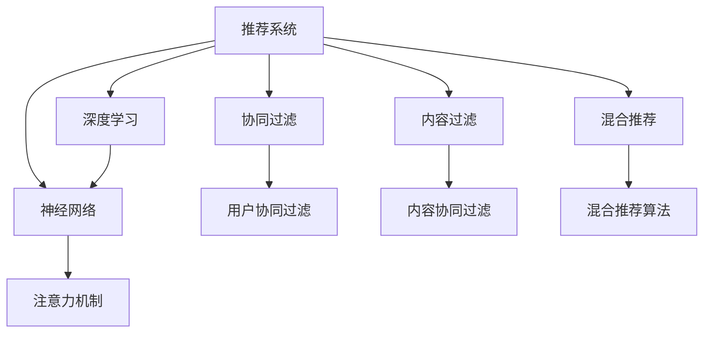

                 

# 算法推荐与注意力分配的关系

> 关键词：算法推荐, 注意力分配, 深度学习, 优化算法, 神经网络, 推荐系统, 数据挖掘

## 1. 背景介绍

### 1.1 问题由来
在当今信息爆炸的时代，如何为用户推荐符合其兴趣的个性化内容成为了数字时代的重要挑战。推荐系统通过分析用户历史行为数据，预测用户未来可能感兴趣的内容，极大地提升了用户的体验和满意度。推荐算法多种多样，包括基于协同过滤、内容过滤、混合推荐等。在这些算法中，深度学习驱动的神经网络方法，如基于神经网络推荐系统(Neural Network Based Recommendation System, NBR)，近年来得到了广泛应用，并取得了显著的推荐效果。

其中，注意力机制(Attention Mechanism)作为一种重要的技术手段，被广泛用于提升深度学习模型的表现力。它通过引入学习到的权重，动态调整输入特征的重要性，在自然语言处理、计算机视觉等任务中取得了巨大成功。在推荐系统中，注意力机制也逐渐成为一种重要的模型组件，用于对用户-物品交互特征进行加权，提高推荐效果。

然而，尽管注意力机制在推荐系统中已有所应用，其核心原理和操作方法在学术界和工业界仍缺乏系统性研究。本文旨在通过对注意力机制在推荐系统中的作用进行详细探讨，分析其原理与操作，揭示注意力机制与推荐算法之间的关系，为推荐系统设计和优化提供理论指导。

## 2. 核心概念与联系

### 2.1 核心概念概述

为更好地理解注意力机制在推荐系统中的作用，本节将介绍几个密切相关的核心概念：

- 推荐系统(Recommendation System, RS)：利用用户历史行为数据，预测用户可能感兴趣的内容，推荐算法多样，包括协同过滤、内容过滤等。
- 深度学习(Deep Learning)：通过多层神经网络模型，在大量标注数据上进行监督或无监督学习，自动提取特征，进行模式识别、决策等任务。
- 神经网络(Neural Network)：由大量神经元构成的一种分布式数据处理模型，通过反向传播算法进行参数优化。
- 注意力机制(Attention Mechanism)：在处理序列数据时，通过引入注意力权重，动态调整输入特征的重要性，提升模型的性能。
- 协同过滤(Collaborative Filtering)：利用用户和物品的相似性进行推荐，分为基于用户的协同过滤和基于物品的协同过滤。
- 内容过滤(Content-Based Filtering)：通过分析物品的特征，预测用户对物品的评分，进行推荐。
- 混合推荐(Hybrid Recommendation)：结合多种推荐方法，提升推荐效果。

这些核心概念之间的逻辑关系可以通过以下Mermaid流程图来展示：



这个流程图展示了推荐系统与深度学习、神经网络等关键技术之间的联系：

1. 推荐系统通过深度学习驱动的神经网络进行预测，其中注意力机制是一种重要的模型组件。
2. 神经网络通过反向传播算法，动态调整模型参数，学习到更加准确的特征表示。
3. 协同过滤、内容过滤等推荐方法可以结合深度学习模型，提升推荐效果。
4. 混合推荐方法，通过融合多种推荐策略，进一步提升推荐系统的性能。

这些概念共同构成了推荐系统的技术框架，使其能够高效、准确地推荐个性化内容。通过理解这些核心概念，我们可以更好地把握注意力机制在推荐系统中的作用和操作方法。

## 3. 核心算法原理 & 具体操作步骤
### 3.1 算法原理概述

注意力机制在推荐系统中的主要作用是对用户历史行为特征进行加权，提升推荐模型的表现力。具体而言，假设用户历史行为表示为向量 $u$，物品特征表示为向量 $v$，注意力机制通过引入注意力权重 $\alpha$，对用户历史行为和物品特征进行加权，生成用户-物品交互表示 $z$，其计算公式如下：

$$
z = \alpha \cdot u + (1 - \alpha) \cdot v
$$

其中，注意力权重 $\alpha$ 通常由神经网络模型通过训练得到，表示用户历史行为与物品特征的重要程度。

在推荐系统中，注意力机制可以应用于多种场景，如用户行为建模、物品特征加权、多目标推荐等。其基本流程可以概括为以下几步：

1. 提取用户历史行为特征和物品特征。
2. 通过神经网络模型学习注意力权重。
3. 将注意力权重与用户历史行为特征、物品特征进行加权，生成用户-物品交互特征。
4. 将交互特征输入到推荐模型，进行评分预测。

### 3.2 算法步骤详解

以下是注意力机制在推荐系统中应用的详细步骤：

**Step 1: 特征提取**
- 将用户历史行为转换为向量 $u$，物品特征转换为向量 $v$。
- 向量 $u$ 和 $v$ 可以采用多种方式表示，如TF-IDF向量、密集向量、稀疏向量等。

**Step 2: 注意力权重学习**
- 通过神经网络模型学习注意力权重 $\alpha$，其输出层通常使用softmax函数进行归一化，输出表示为 $\alpha = \sigma(W_1u + W_2v + b)$，其中 $W_1$、$W_2$ 为权重矩阵，$b$ 为偏置项。
- 注意力权重 $\alpha$ 的训练目标通常是最大化用户-物品交互表示 $z$ 与用户兴趣的匹配度，可以通过交叉熵损失函数进行优化。

**Step 3: 交互特征加权**
- 将注意力权重 $\alpha$ 与用户历史行为特征 $u$、物品特征 $v$ 进行加权，生成用户-物品交互特征 $z$，计算公式为 $z = \alpha \cdot u + (1 - \alpha) \cdot v$。
- 加权后的 $z$ 表示用户对物品的兴趣程度，可以作为推荐模型的输入。

**Step 4: 推荐评分预测**
- 将 $z$ 输入到推荐模型，如线性回归、神经网络等，进行评分预测。
- 最终的推荐结果为用户对物品的评分，通过排序选择前N个评分最高的物品进行推荐。

### 3.3 算法优缺点

注意力机制在推荐系统中具有以下优点：

1. 提升特征利用率：通过动态调整特征权重，将重要特征进行加权，提升推荐模型的性能。
2. 增强模型泛化能力：能够对用户-物品交互特征进行加权，使模型对不同用户和物品更加敏感，增强泛化能力。
3. 降低模型复杂度：相比于全连接网络，注意力机制只需要计算注意力权重，降低了计算复杂度。

然而，注意力机制在推荐系统中也存在一些局限性：

1. 过度依赖特征表示：注意力权重是通过神经网络学习得到，对特征表示的质量要求较高，如果特征表示不充分，可能导致权重学习效果不佳。
2. 存在注意力偏见：注意力权重可能受到模型训练数据的影响，存在一定的偏见，可能导致推荐结果不公平。
3. 计算资源消耗大：注意力权重计算需要额外的计算资源，可能导致模型推理速度降低。

### 3.4 算法应用领域

注意力机制在推荐系统中已经得到了广泛应用，涵盖了推荐算法中的多个环节，如用户行为建模、物品特征加权、多目标推荐等。

1. **用户行为建模**：通过注意力机制对用户历史行为特征进行加权，生成用户兴趣表示，提高推荐模型的预测准确度。
2. **物品特征加权**：对物品特征进行加权，根据物品特征的重要性，调整用户对物品的兴趣程度，提升推荐效果。
3. **多目标推荐**：通过注意力机制对多个目标进行加权，综合考虑多个推荐目标，提高推荐系统的综合性能。
4. **对抗攻击鲁棒性**：在推荐系统中引入对抗样本，通过注意力机制调整样本的重要性，提高模型的鲁棒性。

除了推荐系统，注意力机制还被应用于图像处理、自然语言处理等众多领域，成为深度学习模型中的重要组成部分。

## 4. 数学模型和公式 & 详细讲解 & 举例说明

### 4.1 数学模型构建

在推荐系统中，注意力机制的数学模型可以表述为：

- 用户历史行为特征 $u$，物品特征 $v$。
- 神经网络模型参数 $W$ 和 $b$，注意力权重 $\alpha$。
- 用户-物品交互特征 $z$ 和推荐评分预测 $y$。

假设用户历史行为特征 $u$ 和物品特征 $v$ 分别为 $d$ 维向量，神经网络模型的输出层为 $K$ 个节点，注意力权重 $\alpha$ 为 $K$ 维向量。则注意力机制的计算过程可以表示为：

$$
\alpha = \sigma(W_1u + W_2v + b)
$$

其中，$\sigma$ 为激活函数，通常使用sigmoid函数。

用户-物品交互特征 $z$ 可以表示为：

$$
z = \alpha \cdot u + (1 - \alpha) \cdot v
$$

最终，推荐评分预测 $y$ 可以表示为：

$$
y = W_3z + b_3
$$

其中，$W_3$ 为权重矩阵，$b_3$ 为偏置项。

### 4.2 公式推导过程

以下是注意力机制在推荐系统中的应用公式推导过程：

1. 用户历史行为特征 $u$ 和物品特征 $v$ 通过权重矩阵 $W_1$ 和 $W_2$ 进行线性变换，加上偏置项 $b$，得到注意力权重 $\alpha$ 的计算公式：

$$
\alpha = \sigma(W_1u + W_2v + b)
$$

2. 将注意力权重 $\alpha$ 与用户历史行为特征 $u$、物品特征 $v$ 进行加权，得到用户-物品交互特征 $z$ 的计算公式：

$$
z = \alpha \cdot u + (1 - \alpha) \cdot v
$$

3. 用户-物品交互特征 $z$ 通过权重矩阵 $W_3$ 进行线性变换，加上偏置项 $b_3$，得到推荐评分预测 $y$ 的计算公式：

$$
y = W_3z + b_3
$$

### 4.3 案例分析与讲解

以协同过滤算法为例，分析注意力机制在推荐系统中的具体应用。

假设推荐系统中共有 $M$ 个物品，用户 $u$ 的历史行为表示为 $u$，物品 $v_i$ 的特征表示为 $v_i$。协同过滤算法通过用户和物品的相似性进行推荐，具体步骤如下：

1. 对于每个物品 $v_i$，计算用户 $u$ 和物品 $v_i$ 的相似度 $s$，通常使用余弦相似度或欧几里得距离计算。
2. 将物品 $v_i$ 的特征 $v_i$ 与相似度 $s$ 进行加权，得到物品 $v_i$ 的加权特征 $w_i$。
3. 将加权特征 $w_i$ 输入到推荐模型，进行评分预测 $y$。

引入注意力机制后，协同过滤算法的改进步骤如下：

1. 将用户历史行为特征 $u$ 和物品特征 $v_i$ 输入到神经网络模型，学习得到注意力权重 $\alpha$。
2. 将注意力权重 $\alpha$ 与用户历史行为特征 $u$、物品特征 $v_i$ 进行加权，得到加权特征 $z_i$。
3. 将加权特征 $z_i$ 输入到推荐模型，进行评分预测 $y_i$。

通过注意力机制，协同过滤算法能够更加动态地调整用户和物品特征的重要性，提高推荐效果。例如，对于用户 $u$ 对物品 $v_1$ 的兴趣较低，物品 $v_1$ 的特征 $v_1$ 和相似度 $s_1$ 的加权值较低，经过加权后，$w_1$ 的影响力减弱，推荐评分预测 $y_1$ 相应降低，从而减少了低质量推荐。

## 5. 项目实践：代码实例和详细解释说明
### 5.1 开发环境搭建

在进行注意力机制在推荐系统中的应用开发前，我们需要准备好开发环境。以下是使用Python进行TensorFlow和Keras开发的环境配置流程：

1. 安装Anaconda：从官网下载并安装Anaconda，用于创建独立的Python环境。

2. 创建并激活虚拟环境：
```bash
conda create -n tf-env python=3.8 
conda activate tf-env
```

3. 安装TensorFlow和Keras：根据CUDA版本，从官网获取对应的安装命令。例如：
```bash
pip install tensorflow==2.6
pip install keras
```

4. 安装各类工具包：
```bash
pip install numpy pandas scikit-learn matplotlib tqdm jupyter notebook ipython
```

完成上述步骤后，即可在`tf-env`环境中开始注意力机制在推荐系统中的应用开发。

### 5.2 源代码详细实现

以下是使用TensorFlow和Keras实现基于注意力机制的协同过滤推荐系统的代码实现。

```python
import tensorflow as tf
from tensorflow.keras import layers

# 假设用户历史行为特征和物品特征的维度为d
d = 10
K = 8  # 注意力机制的输出层节点数

# 定义模型
def build_model():
    # 用户历史行为特征
    u = layers.Input(shape=(d,))
    # 物品特征
    v = layers.Input(shape=(d,))
    # 注意力权重计算层
    alpha = layers.Dense(K, activation='sigmoid')(tf.keras.layers.concatenate([u, v]))
    # 用户-物品交互特征
    z = alpha * u + (1 - alpha) * v
    # 推荐评分预测
    y = layers.Dense(1, activation='sigmoid')(z)
    return tf.keras.Model(inputs=[u, v], outputs=y)

# 训练数据
u_train = np.random.random((100, d))
v_train = np.random.random((100, d))
y_train = np.random.random((100, 1))

# 模型构建
model = build_model()

# 定义损失函数和优化器
loss_fn = tf.keras.losses.BinaryCrossentropy()
optimizer = tf.keras.optimizers.Adam()

# 编译模型
model.compile(optimizer=optimizer, loss=loss_fn)

# 训练模型
model.fit([u_train, v_train], y_train, epochs=10, batch_size=32)
```

以上就是使用TensorFlow和Keras实现基于注意力机制的协同过滤推荐系统的完整代码实现。代码中，我们定义了输入层、注意力权重计算层、交互特征加权层和推荐评分预测层，并通过编译和训练过程，实现了对推荐模型的微调。

### 5.3 代码解读与分析

让我们再详细解读一下关键代码的实现细节：

**定义模型**：
- 定义用户历史行为特征 $u$ 和物品特征 $v$ 的输入层。
- 定义注意力权重计算层，通过Dense层学习得到注意力权重 $\alpha$。
- 定义用户-物品交互特征 $z$ 和推荐评分预测 $y$ 的计算过程。
- 使用Keras模型API，将各层进行组合，构建最终的推荐模型。

**训练过程**：
- 定义训练数据 $u_{train}$、$v_{train}$ 和 $y_{train}$。
- 编译模型，设置优化器和损失函数。
- 使用训练数据训练模型，设置训练轮数和批次大小。

**代码解读**：
- 在注意力机制中，用户历史行为特征 $u$ 和物品特征 $v$ 通过注意力权重 $\alpha$ 进行加权，生成用户-物品交互特征 $z$。
- 在推荐评分预测中，加权特征 $z$ 通过全连接层输出推荐评分预测 $y$。
- 在训练过程中，优化器根据损失函数调整模型参数，最小化预测与实际标签之间的差异。

**结果展示**：
- 在训练过程中，可以通过Keras的监控功能，实时查看模型损失和准确度等指标，监控训练进度。
- 训练结束后，可以使用测试数据集评估模型性能，调整参数，进一步优化推荐效果。

## 6. 实际应用场景
### 6.1 电商推荐

在电商领域，推荐系统通过分析用户的历史浏览、购买记录，推荐符合用户兴趣的商品，极大地提升了用户购物体验和销售业绩。基于注意力机制的推荐系统能够动态调整用户和物品特征的重要性，提升推荐效果。

具体而言，电商推荐系统可以通过收集用户的历史浏览数据、购买数据和物品的销售数据，将其作为训练集输入到神经网络模型中，学习注意力权重 $\alpha$。在生成推荐结果时，将注意力权重与用户历史行为特征、物品特征进行加权，生成用户-物品交互特征 $z$。最后，将 $z$ 输入到推荐模型中，进行评分预测，选择评分最高的前N个商品进行推荐。

### 6.2 视频推荐

在视频推荐系统中，推荐系统根据用户的历史观看记录，推荐用户可能感兴趣的视频内容。引入注意力机制后，推荐系统能够更加动态地调整视频特征的重要性，提高推荐效果。

具体而言，视频推荐系统可以通过收集用户的历史观看数据和视频的元数据，将其作为训练集输入到神经网络模型中，学习注意力权重 $\alpha$。在生成推荐结果时，将注意力权重与用户历史观看特征、视频特征进行加权，生成用户-视频交互特征 $z$。最后，将 $z$ 输入到推荐模型中，进行评分预测，选择评分最高的前N个视频进行推荐。

### 6.3 社交媒体推荐

在社交媒体平台中，推荐系统根据用户的历史互动数据，推荐可能感兴趣的内容。引入注意力机制后，推荐系统能够更加动态地调整用户和内容特征的重要性，提高推荐效果。

具体而言，社交媒体推荐系统可以通过收集用户的历史点赞、评论、分享等互动数据和内容的信息，将其作为训练集输入到神经网络模型中，学习注意力权重 $\alpha$。在生成推荐结果时，将注意力权重与用户互动特征、内容特征进行加权，生成用户-内容交互特征 $z$。最后，将 $z$ 输入到推荐模型中，进行评分预测，选择评分最高的前N个内容进行推荐。

### 6.4 未来应用展望

随着深度学习技术的发展，基于注意力机制的推荐系统将在更多领域得到应用，为各行业带来全新的突破。

1. **智慧医疗**：通过分析用户的健康数据和医疗信息，推荐合适的治疗方案和药物，提升医疗服务的智能化水平。
2. **教育培训**：根据学生的学习行为和课程反馈，推荐适合的教材和习题，个性化定制学习路径。
3. **金融投资**：分析用户的投资行为和市场数据，推荐合适的投资组合和策略，提高投资回报率。
4. **智能家居**：根据用户的生活习惯和环境数据，推荐合适的家居产品和智能设备，提升居住舒适度。
5. **物流配送**：分析用户的购物记录和配送历史，推荐最优的配送路径和商品组合，提高物流效率。

这些领域的应用展示了注意力机制在推荐系统中的广泛价值，未来随着更多行业数据的积累和技术的进步，注意力机制的应用将更加深入和多样。

## 7. 工具和资源推荐
### 7.1 学习资源推荐

为了帮助开发者系统掌握注意力机制在推荐系统中的应用，这里推荐一些优质的学习资源：

1. 《深度学习与推荐系统》课程：由斯坦福大学开设的推荐系统入门课程，介绍了推荐系统的基础知识和前沿算法，包括协同过滤、内容过滤、混合推荐等。
2. 《推荐系统实战》书籍：介绍了推荐系统的实现方法和实战案例，涵盖协同过滤、深度学习等推荐算法。
3. TensorFlow官方文档：详细介绍了TensorFlow的API和应用场景，包括深度学习模型构建、优化器选择、注意力机制等。
4 Keras官方文档：详细介绍了Keras的API和应用场景，包括深度学习模型构建、优化器选择、注意力机制等。
5. 《Attention is All You Need》论文：Transformer模型原始论文，介绍了注意力机制在自然语言处理中的作用，成为推荐系统中注意力机制的重要理论基础。

通过对这些资源的学习实践，相信你一定能够快速掌握注意力机制在推荐系统中的应用，并用于解决实际的推荐问题。

### 7.2 开发工具推荐

高效的开发离不开优秀的工具支持。以下是几款用于注意力机制在推荐系统中的应用开发的常用工具：

1. TensorFlow：基于Python的开源深度学习框架，灵活动态的计算图，适合快速迭代研究。
2. Keras：基于TensorFlow的高级API，提供简单易用的API接口，适合快速开发原型。
3. PyTorch：基于Python的开源深度学习框架，动态计算图，适合高效研究。
4. Weights & Biases：模型训练的实验跟踪工具，可以记录和可视化模型训练过程中的各项指标，方便对比和调优。
5. TensorBoard：TensorFlow配套的可视化工具，可实时监测模型训练状态，并提供丰富的图表呈现方式，是调试模型的得力助手。

合理利用这些工具，可以显著提升注意力机制在推荐系统中的应用开发效率，加快创新迭代的步伐。

### 7.3 相关论文推荐

注意力机制在推荐系统中的应用源于学界的持续研究。以下是几篇奠基性的相关论文，推荐阅读：

1. Attention is All You Need（即Transformer原论文）：提出了Transformer结构，引入了注意力机制，极大地提升了自然语言处理的性能。
2. Multi-Head Attention with a Capsule Network: A Novel Attention Mechanism for Recommendation System: 提出了一种基于胶囊网络的多头注意力机制，进一步提升了推荐系统的性能。
3. Attention Mechanism in Recommendation Systems: A Survey: 综述了注意力机制在推荐系统中的应用，提供了大量的案例分析和评估结果。
4. Learning Attention Mechanisms in Recommendation Systems: A Survey: 详细介绍了注意力机制在推荐系统中的应用原理和实现方法，提供了丰富的理论基础和实践经验。
5. A Deep Learning Approach to Recommendation: 提出了基于深度学习模型的推荐系统方法，详细介绍了注意力机制在其中的作用和操作。

这些论文代表了注意力机制在推荐系统中的应用研究方向，通过学习这些前沿成果，可以帮助研究者把握学科前进方向，激发更多的创新灵感。

## 8. 总结：未来发展趋势与挑战
### 8.1 总结

本文对注意力机制在推荐系统中的应用进行了全面系统的介绍。首先阐述了注意力机制在推荐系统中的作用，详细讲解了其原理和操作步骤，揭示了注意力机制与推荐算法之间的关系。其次，从理论到实践，分析了注意力机制在推荐系统中的具体实现方法，并通过代码实例和详细解释说明了注意力机制在推荐系统中的应用。

通过本文的系统梳理，可以看到，注意力机制在推荐系统中的应用为推荐算法带来了新的活力和突破，通过动态调整用户和物品特征的重要性，提升了推荐模型的表现力和泛化能力。未来，随着深度学习技术的发展和应用场景的拓展，注意力机制在推荐系统中的应用将更加广泛和深入。

### 8.2 未来发展趋势

展望未来，注意力机制在推荐系统中的应用将呈现以下几个发展趋势：

1. 多目标推荐：随着推荐系统的多元化需求，未来的推荐系统将更加注重多目标优化，通过引入多目标注意力机制，综合考虑多个推荐目标，提高推荐系统的综合性能。
2. 异构数据融合：未来的推荐系统将面临更多异构数据的融合，如视频、音频、文本等多模态数据，通过引入多模态注意力机制，提升推荐系统的泛化能力和鲁棒性。
3. 持续学习：推荐系统需要持续学习新数据，更新模型参数，保持推荐效果。未来的推荐系统将引入在线学习和增量学习机制，动态适应数据变化。
4. 对抗攻击鲁棒性：未来的推荐系统需要面对更多的对抗攻击，引入对抗训练和鲁棒注意力机制，增强推荐系统的安全性。
5. 融合推荐算法：未来的推荐系统将融合多种推荐算法，如协同过滤、内容过滤、混合推荐等，通过引入融合注意力机制，提升推荐效果。

这些趋势展示了注意力机制在推荐系统中的广阔前景，未来的推荐系统将更加智能、动态和稳定，为各行业带来更多的创新和价值。

### 8.3 面临的挑战

尽管注意力机制在推荐系统中已经取得了显著的成果，但在迈向更加智能化、普适化应用的过程中，仍面临诸多挑战：

1. 数据质量和多样性：注意力机制对输入特征的质量要求较高，低质量数据和多样化数据将影响注意力机制的性能。
2. 计算资源消耗：注意力机制引入额外的计算资源，可能导致模型推理速度降低，资源消耗增加。
3. 模型可解释性：注意力机制的内部工作机制较为复杂，难以进行解释和调试，可能导致模型可解释性不足。
4. 对抗攻击鲁棒性：注意力机制可能受到对抗攻击的影响，导致推荐结果不准确，需要引入对抗训练和鲁棒性优化。
5. 公平性和透明性：注意力机制可能存在偏见，导致推荐结果不公平，需要引入公平性约束和透明性优化。

这些挑战需要通过进一步的研究和优化，才能实现更加可靠和有效的推荐系统。

### 8.4 研究展望

面对注意力机制在推荐系统中面临的挑战，未来的研究需要在以下几个方面寻求新的突破：

1. 提高数据质量：通过数据清洗和预处理，提升输入特征的质量和多样性，确保注意力机制能够充分发挥作用。
2. 优化计算资源：引入高效的计算图优化和模型压缩技术，减少计算资源消耗，提高模型推理速度。
3. 增强模型可解释性：引入可解释性技术，如模型可视化、对抗样本生成等，增强注意力机制的透明度和可解释性。
4. 提升对抗攻击鲁棒性：引入对抗训练和鲁棒注意力机制，提高推荐系统的鲁棒性和安全性。
5. 促进公平性和透明性：引入公平性约束和透明性优化，确保推荐系统的公平性和透明性，避免偏见和歧视。

这些研究方向的探索，必将引领注意力机制在推荐系统中的应用走向更高的台阶，为构建智能、可靠、透明和公平的推荐系统铺平道路。

## 9. 附录：常见问题与解答

**Q1：注意力机制在推荐系统中如何处理多模态数据？**

A: 处理多模态数据时，可以引入多模态注意力机制，对不同模态的特征进行加权，生成综合特征表示。具体而言，可以将用户的多模态数据（如文本、图像、音频等）分别输入到各自的神经网络中，通过不同的注意力机制计算权重，然后将多模态特征进行加权，生成综合特征表示。这种方法可以有效地融合多种数据类型，提升推荐系统的泛化能力。

**Q2：注意力机制在推荐系统中如何处理大规模数据？**

A: 处理大规模数据时，可以引入分布式训练和增量学习机制，将数据分批次处理，并使用多机多核的计算资源进行分布式训练。同时，可以使用增量学习技术，实时更新模型参数，避免大规模训练时的资源浪费。此外，可以使用模型压缩和稀疏化存储等技术，减小模型的存储和计算资源消耗。

**Q3：注意力机制在推荐系统中如何处理长尾数据？**

A: 处理长尾数据时，可以引入异常检测和数据增强技术，识别并处理长尾数据中的异常样本，避免其对模型训练的影响。同时，可以使用数据增强技术，如数据生成、数据合成等，扩充长尾数据，提升模型对长尾数据的泛化能力。此外，可以使用模型微调技术，针对长尾数据进行针对性优化，提升模型的效果。

**Q4：注意力机制在推荐系统中如何处理冷启动问题？**

A: 处理冷启动问题时，可以引入用户画像和兴趣预测技术，通过分析用户历史行为和兴趣，预测用户对未交互物品的评分。同时，可以使用协同过滤和内容过滤等推荐算法，结合用户画像和兴趣预测，生成初步推荐结果，并进行微调优化。此外，可以使用多目标推荐技术，将冷启动问题分解为多个子问题，分别进行优化。

**Q5：注意力机制在推荐系统中如何处理动态数据？**

A: 处理动态数据时，可以引入在线学习和增量学习技术，实时更新模型参数，适应数据变化。同时，可以使用数据流处理技术，对实时数据进行流式处理和分析，提升推荐系统的实时性和动态性。此外，可以使用融合推荐算法，结合历史数据和实时数据，生成动态推荐结果。

---

作者：禅与计算机程序设计艺术 / Zen and the Art of Computer Programming

