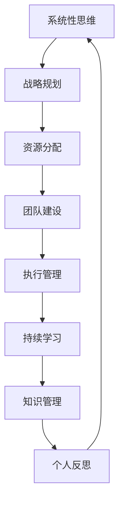

                 

# 管理者修炼手册:思维、行动与学习

管理者，这个看似简单的职位，实际上包含了无尽的学问和挑战。无论是科技行业的顶尖CTO，还是传统企业的资深CEO，他们都有一个共同点——不断修炼自己的管理能力，提升思维水平、加强行动效果、持续学习新知，以适应快速变化的商业环境。

> 关键词：管理者,思维,行动,学习,领导力,决策力,创新力,执行能力,团队管理,绩效管理,员工激励

## 1. 背景介绍

### 1.1 问题由来

在当今瞬息万变的商业环境中，管理者所面临的挑战前所未有。从经济波动、政策变化到技术迭代、市场竞争，管理者需要具备更强的适应性和前瞻性。面对复杂多变的商业环境，管理者需要掌握多种技能，包括但不限于决策力、领导力、创新力、执行能力、团队管理、绩效管理和员工激励等。但如何系统化地提升这些能力，却是一个值得深入探讨的问题。

管理者修炼手册正是为解决这一问题而生的。通过系统化的理论和实践指导，帮助管理者建立起全面的思维、行动与学习框架，为管理实践提供有力支撑。

### 1.2 问题核心关键点

管理者修炼手册的核心在于帮助管理者系统化提升三个核心能力：

- 思维：包括系统性思维、创新思维、批判性思维等，用以应对复杂的商业问题，做出科学决策。
- 行动：包括战略规划、资源分配、团队建设、执行管理等，确保决策落地实施，实现目标达成。
- 学习：包括持续学习、知识管理、个人反思等，保证管理者在快速变化的市场环境中持续成长，紧跟时代潮流。

## 2. 核心概念与联系

### 2.1 核心概念概述

管理者修炼手册涉及的核心概念包括：

- **系统性思维**：强调从整体和全局角度考虑问题，理解各部分之间的相互关系和依赖性。
- **创新思维**：鼓励管理者不断探索新方法、新思路，以应对市场变化和挑战。
- **批判性思维**：培养管理者对信息进行分析和评估的能力，避免盲目决策。
- **战略规划**：制定长远的业务目标和发展路径，确保企业在激烈竞争中保持领先。
- **资源分配**：合理配置企业资源，以支持战略目标的实现。
- **团队建设**：培养高效协作的团队文化，激发员工潜力，提升团队绩效。
- **执行管理**：确保战略和计划得到有效执行，实现目标达成。
- **持续学习**：不断获取新知识、技能，适应行业变化，保持竞争力。
- **知识管理**：系统化整理、分享企业知识，促进经验传承与创新。
- **个人反思**：通过反思和自我评价，识别问题、提升能力，实现持续改进。

这些概念之间通过反馈和互动形成闭环，共同作用于管理者的决策和行动，实现企业战略目标的达成。

### 2.2 核心概念原理和架构的 Mermaid 流程图



这个流程图展示了各概念之间的相互关系和互动。系统性思维指导战略规划，资源分配支持团队建设和执行管理，执行管理促进持续学习和知识管理，知识管理支持个人反思，个人反思又反过来影响系统性思维，形成一个闭环，不断迭代提升。

## 3. 核心算法原理 & 具体操作步骤

### 3.1 算法原理概述

管理者修炼手册的算法原理基于PDCA循环，即计划(Plan)、执行(Do)、检查(Check)、行动(Action)的持续改进过程。这四个阶段相互关联，形成一个不断迭代的闭环，确保管理者的决策和行动始终在正确的轨道上。

### 3.2 算法步骤详解

#### 3.2.1 计划阶段(Plan)

在计划阶段，管理者需要明确企业的战略目标，并制定详细的实施计划。具体步骤如下：

1. **目标设定**：根据企业的愿景和使命，设定明确的短期和长期目标。
2. **环境分析**：分析企业内外部环境，识别机会和威胁。
3. **资源评估**：评估企业现有的资源状况，包括人力、财力、技术等。
4. **策略制定**：制定实现目标的策略，包括市场定位、产品规划、运营策略等。
5. **任务分解**：将战略目标分解为可执行的任务和子任务。

#### 3.2.2 执行阶段(Do)

在执行阶段，管理者需要确保计划的顺利实施，具体步骤如下：

1. **资源配置**：合理配置资源，确保每个任务都有足够的支持。
2. **团队建设**：组建高效协作的团队，明确每个成员的职责和目标。
3. **任务分配**：根据任务复杂度和员工能力，合理分配任务。
4. **进度跟踪**：定期检查任务进展，及时调整计划。
5. **问题解决**：遇到问题时，迅速识别并采取有效措施解决。

#### 3.2.3 检查阶段(Check)

在检查阶段，管理者需要对执行过程和结果进行评估，具体步骤如下：

1. **效果评估**：评估任务的完成情况和目标达成情况。
2. **问题识别**：识别执行过程中存在的问题和瓶颈。
3. **数据收集**：收集关键数据和信息，作为改进的依据。
4. **反馈机制**：建立反馈机制，确保信息及时传递。
5. **绩效评估**：对团队和员工绩效进行评估，提供反馈和奖励。

#### 3.2.4 行动阶段(Action)

在行动阶段，管理者需要根据检查阶段的结果进行改进和调整，具体步骤如下：

1. **改进措施**：根据评估结果和反馈，制定改进措施。
2. **知识总结**：总结经验教训，形成知识库。
3. **持续优化**：持续优化管理过程，提升效率和效果。
4. **学习提升**：鼓励团队和个人持续学习，提升能力和技能。
5. **目标调整**：根据实际情况，适时调整目标和策略。

通过PDCA循环的不断迭代，管理者可以不断提升决策和行动的效果，实现企业的长期目标。

### 3.3 算法优缺点

管理者修炼手册的算法具有以下优点：

- **系统性**：PDCA循环提供了一个系统的管理框架，确保各环节有序推进。
- **可操作性**：每个阶段都有具体的步骤和措施，易于实施。
- **持续改进**：通过不断循环和改进，确保管理过程始终在正确的轨道上。

同时，也存在一些缺点：

- **复杂性**：四个阶段相互关联，需要系统化的理解和实践。
- **时间成本**：每个阶段都需要投入大量时间和精力。
- **灵活性不足**：在复杂和动态环境中，PDCA循环可能难以灵活应对。

尽管如此，管理者修炼手册仍然是一个有效且广泛适用的管理框架，尤其适合于系统性强、需要持续改进的中大型企业。

### 3.4 算法应用领域

管理者修炼手册的应用领域广泛，包括但不限于：

- **科技行业**：适用于高科技企业的技术研发、市场拓展、团队管理等。
- **金融行业**：适用于金融机构的投资决策、风险管理、客户服务。
- **制造行业**：适用于制造业的生产管理、质量控制、供应链优化。
- **医疗行业**：适用于医疗机构的患者管理、服务流程、质量提升。
- **教育行业**：适用于学校的教学管理、学生发展、教师培训。

## 4. 数学模型和公式 & 详细讲解 & 举例说明

### 4.1 数学模型构建

管理者修炼手册的数学模型基于PDCA循环的反馈机制，通过建立反馈矩阵来描述各环节之间的关系和互动。反馈矩阵如下：

$$
\begin{bmatrix}
0 & 1 & 1 & 1 \\
1 & 0 & 1 & 1 \\
1 & 1 & 0 & 1 \\
1 & 1 & 1 & 0 \\
\end{bmatrix}
$$

其中，0表示不反馈，1表示双向反馈。

### 4.2 公式推导过程

基于反馈矩阵，可以推导出PDCA循环的反馈路径：

1. 计划到执行的反馈路径：$(0,1,2,3)$。
2. 执行到检查的反馈路径：$(1,0,3,2)$。
3. 检查到行动的反馈路径：$(2,1,0,3)$。
4. 行动到计划的反馈路径：$(3,2,1,0)$。

这些反馈路径确保了信息在各环节之间的及时传递和反馈，提高了管理效率和决策质量。

### 4.3 案例分析与讲解

以一家科技企业的项目管理为例，分析PDCA循环的应用：

1. **计划阶段**：设定开发新产品的时间表和里程碑，评估现有资源和团队能力，制定详细的实施计划。
2. **执行阶段**：根据计划分配资源和任务，组建项目团队，定期跟踪项目进展，解决出现的问题。
3. **检查阶段**：评估项目进展和效果，识别资源瓶颈和执行问题，收集关键数据和信息，建立反馈机制。
4. **行动阶段**：根据评估结果和反馈，调整资源分配和任务分配，总结经验教训，持续优化项目管理过程。

通过PDCA循环的不断迭代，这家科技企业的项目管理效率显著提升，新产品开发周期缩短，市场竞争力增强。

## 5. 项目实践：代码实例和详细解释说明

### 5.1 开发环境搭建

管理者修炼手册的开发环境搭建主要涉及项目管理工具的选择和配置。常用的项目管理工具包括：

1. **JIRA**：功能强大的项目管理平台，支持任务分配、进度跟踪、问题管理等功能。
2. **Trello**：简单易用的看板工具，适合团队协作和任务管理。
3. **Asana**：灵活的项目管理工具，支持任务分解、优先级管理、进度跟踪等功能。
4. **Smartsheet**：基于电子表格的项目管理工具，支持多项目管理和数据分析。

### 5.2 源代码详细实现

以下是一个基于JIRA的项目管理实践代码实现示例：

1. **任务创建和分配**：
```python
# 创建新任务
task = jira.create_task(title='项目开发', description='开发新产品功能', assignee='项目经理', priority='高')
# 分配任务
task.update(assignee='开发团队成员')
```

2. **进度跟踪和报告**：
```python
# 获取任务进展
task = jira.get_task('项目开发')
progress = task.get_status()
# 生成进度报告
report = generate_report(progress)
# 发送报告给项目经理
email.send(report)
```

3. **问题管理**：
```python
# 创建新问题
issue = jira.create_issue(title='需求变更', description='需要修改产品功能')
# 分配问题
issue.update(assignee='需求分析师')
```

### 5.3 代码解读与分析

上述代码实现了JIRA的API调用，用于创建任务、分配任务、获取任务进展、生成进度报告和创建问题。通过这些API，可以实现高效的项目管理和进度跟踪。

### 5.4 运行结果展示

运行上述代码后，可以在JIRA系统中查看任务分配、进度报告和问题管理情况。通过可视化的方式，管理者可以更好地理解项目的当前状态，及时调整策略和资源，确保项目顺利实施。

## 6. 实际应用场景

### 6.1 科技行业的项目管理

在科技行业中，项目管理是企业成功的关键。通过应用管理者修炼手册的PDCA循环，科技企业可以实现高效的项目管理和资源优化，提升产品开发速度和质量。

### 6.2 金融行业的风险管理

金融行业的风险管理需要精细化、系统化的过程。通过应用管理者修炼手册的PDCA循环，金融机构可以及时识别和评估风险，制定有效的风险控制措施，保障客户资金安全。

### 6.3 制造行业的生产管理

制造行业的生产管理涉及复杂的过程控制和资源优化。通过应用管理者修炼手册的PDCA循环，制造企业可以实现生产效率的提升，降低成本，提高产品质量。

### 6.4 医疗行业的患者管理

医疗行业的患者管理需要高度的精确性和专业性。通过应用管理者修炼手册的PDCA循环，医疗机构可以实现患者数据的精确记录和管理，提高诊疗效率和服务质量。

### 6.5 教育行业的教学管理

教育行业的教学管理涉及多方面的协调和资源配置。通过应用管理者修炼手册的PDCA循环，学校可以优化教学流程，提升教学效果，满足学生和家长的需求。

## 7. 工具和资源推荐

### 7.1 学习资源推荐

以下是管理者修炼手册的学习资源推荐：

1. **《管理者修炼手册》系列书籍**：系统介绍管理者修炼的核心概念和实践方法，是管理者修炼的必读书籍。
2. **Coursera《领导力与变革管理》课程**：斯坦福大学开设的在线课程，涵盖领导力和变革管理的核心知识。
3. **Harvard Business Review（哈佛商业评论）**：提供前沿的管理理论和实践案例，是管理者学习的重要资源。
4. **LinkedIn Learning（领英学习）**：涵盖各类管理技能和工具的使用，提供丰富的在线学习资源。
5. **NASA STS-100领导力培训**：美国国家航空航天局提供的免费在线领导力培训，适合所有层级的管理者。

### 7.2 开发工具推荐

以下是管理者修炼手册的开发工具推荐：

1. **JIRA**：功能强大的项目管理工具，支持任务分配、进度跟踪、问题管理等功能。
2. **Trello**：简单易用的看板工具，适合团队协作和任务管理。
3. **Asana**：灵活的项目管理工具，支持任务分解、优先级管理、进度跟踪等功能。
4. **Smartsheet**：基于电子表格的项目管理工具，支持多项目管理和数据分析。
5. **Microsoft Project**：功能全面的项目管理软件，支持多种项目管理和资源优化。

### 7.3 相关论文推荐

以下是管理者修炼手册的相关论文推荐：

1. **《领导力与管理：理论与实践》**：作者约翰·C·马克斯维尔（John C. Maxwell），系统介绍领导力的核心理论和方法。
2. **《变革管理：有效引导组织转型》**：作者约翰·P·库斯特（John P. Kotter），提供变革管理的系统化方法。
3. **《执行：如何高效实现业务目标》**：作者拉里·博西迪（Larry Bossidy）和拉姆·查兰（Ram Charan），提供高效执行管理的实践指南。
4. **《创新者的窘境》**：作者克莱顿·克里斯坦森（Clayton Christensen），探讨创新在企业管理中的重要性。
5. **《精益创业》**：作者埃里克·莱斯（Eric Ries），提供基于精益思维的创业方法和管理实践。

## 8. 总结：未来发展趋势与挑战

### 8.1 研究成果总结

管理者修炼手册系统地介绍了管理者的思维、行动和学习能力提升的框架和方法。通过PDCA循环的不断迭代，管理者可以实现系统化、科学化的决策和执行，提升企业竞争力和市场地位。

### 8.2 未来发展趋势

未来，管理者修炼手册将呈现以下几个发展趋势：

1. **数字化转型**：随着数字技术的发展，管理者将更多依赖数字化工具和平台进行管理，实现高效协同和数据驱动决策。
2. **全球化管理**：全球化背景下，管理者需要具备跨文化理解和国际化视野，协调多元文化团队，实现全球业务扩展。
3. **持续学习**：知识更新迅速，管理者需要不断学习新知识和技能，保持与时代同步。
4. **创新管理**：创新成为企业发展的关键驱动力，管理者需要培养创新思维，鼓励团队创新。
5. **数据驱动决策**：通过数据分析和人工智能技术，管理者可以实现更科学、更精准的决策。

### 8.3 面临的挑战

尽管管理者修炼手册提供了系统的管理框架，但在实际应用中仍面临以下挑战：

1. **变化迅速**：市场和技术环境快速变化，管理者需要灵活应对，不断调整策略。
2. **资源有限**：企业资源有限，管理者需要高效利用资源，实现最大效益。
3. **团队管理**：如何有效激励和管理团队，发挥团队成员的潜力，是一大挑战。
4. **绩效管理**：如何科学衡量和提升团队绩效，是一个复杂的任务。
5. **风险控制**：如何在不确定性环境下，有效控制风险，保障企业稳健运营。

### 8.4 研究展望

管理者修炼手册的研究展望包括以下几个方面：

1. **新工具和新方法**：探索基于人工智能和大数据的新管理工具和方法，提高管理效率。
2. **系统性理论**：构建系统性的管理理论框架，提供更具普适性的管理方法。
3. **跨文化管理**：研究跨文化管理的新理论和实践方法，帮助管理者在全球化背景下更好地协同多元文化团队。
4. **情绪管理**：研究情绪对管理决策的影响，提供情绪管理的实践指南。
5. **伦理管理**：研究企业社会责任和伦理管理，提升企业的社会价值和公信力。

管理者修炼手册将不断深化和拓展管理理论和方法，为管理者提供更全面的指导，助力企业在快速变化的市场环境中取得成功。

## 9. 附录：常见问题与解答

### 9.1 Q1：管理者修炼手册适合哪些层级的管理者？

A: 管理者修炼手册适合所有层级的管理者，包括高层管理者、中层管理者、基层管理者等。每个层级的管理者都可以从中受益，提升自身的管理能力和水平。

### 9.2 Q2：管理者修炼手册的PDCA循环是否适用于所有行业？

A: PDCA循环是一种通用的管理框架，适用于各行各业。无论是在科技、金融、制造、医疗、教育等行业，都可以应用PDCA循环进行管理和决策。

### 9.3 Q3：管理者修炼手册需要多长时间才能掌握？

A: 掌握管理者修炼手册需要时间和实践。通过系统的学习和持续的实践，一般可以在3-6个月内掌握核心概念和方法，并在实际工作中不断应用和提升。

### 9.4 Q4：管理者修炼手册是否需要专门培训？

A: 管理者修炼手册的学习可以通过在线课程、书籍、实践工具等多种方式进行。但如果是初入管理的职场新人，参加专门的管理培训课程可以更快地掌握相关知识和技能。

### 9.5 Q5：管理者修炼手册的实施是否需要大量投入？

A: 管理者修炼手册的实施需要投入一定的时间和资源，但相对于传统管理的低效和高成本，通过PDCA循环的持续改进，可以实现更高的管理效率和效益。

---

作者：禅与计算机程序设计艺术 / Zen and the Art of Computer Programming

