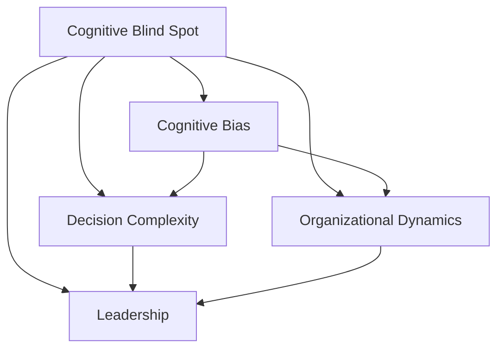

                 

# 管理者的认知盲区及其突破

> 关键词：管理盲区,认知偏差,决策失误,组织创新,领导力提升

## 1. 背景介绍

### 1.1 问题由来

管理者，作为组织的舵手，承担着制定战略、带领团队、实现目标的重任。然而，在复杂多变的环境下，管理者们往往面临着信息不完备、认知偏差、决策复杂性等挑战。认知盲区（Cognitive Blind Spot），即管理者对自己认知局限和决策盲点的忽视，是导致决策失误和组织效率低下的重要原因。如何识别和突破这些盲区，提升管理者的认知能力，已成为现代企业管理的关键课题。

### 1.2 问题核心关键点

管理者的认知盲区主要体现在以下几个方面：

- **信息过载**：管理者在获取海量信息时，容易因信息过载而忽视关键信息，导致决策失误。
- **认知偏差**：由于认知心理机制的局限，管理者在处理信息时容易产生各种认知偏差，如确认偏误、代表性启发等。
- **决策复杂性**：在面对不确定性和复杂环境时，管理者如何做出最优决策，是一个巨大挑战。
- **组织动态性**：随着市场和技术的变化，管理者如何应对组织结构、文化、人才等方面的动态变化，需要新的认知框架。
- **领导力**：管理者如何在领导过程中，既发挥个人智慧，又能激发团队潜能，提升团队效能。

通过系统梳理这些问题，本文旨在揭示管理者认知盲区的成因，并提出具体策略和方法，帮助管理者突破盲区，提升管理效能。

## 2. 核心概念与联系

### 2.1 核心概念概述

为更好地理解认知盲区及其突破方法，本节将介绍几个密切相关的核心概念：

- **认知盲区（Cognitive Blind Spot）**：指管理者在决策过程中，由于信息不完备、认知偏差等心理机制，对自身认知局限和决策盲点的忽视。
- **认知偏差（Cognitive Bias）**：指在信息处理和决策过程中，由于心理机制导致的系统性偏差，如确认偏误、代表性启发等。
- **决策复杂性（Decision Complexity）**：指在复杂不确定性环境中，管理者需要处理的多维度、多层次决策变量。
- **组织动态性（Organizational Dynamics）**：指组织结构、文化、人才等方面的动态变化，需要管理者具备灵活应对的能力。
- **领导力（Leadership）**：指管理者在领导团队、激发潜能方面的能力，涵盖影响、沟通、激励等多方面。

这些核心概念之间的逻辑关系可以通过以下Mermaid流程图来展示：



这个流程图展示了大管理者认知盲区的核心概念及其之间的关系：

1. 认知盲区是管理者在决策过程中忽视自身认知局限和决策盲点的现象。
2. 认知偏差是导致认知盲区的原因之一，通常会影响决策复杂性和组织动态性。
3. 决策复杂性指管理者在复杂环境中需要处理的决策变量。
4. 组织动态性指组织结构、文化等方面的动态变化，需要管理者具备应对能力。
5. 领导力则是管理者在领导团队、激发潜能方面的能力，贯穿于整个管理过程。

这些概念共同构成了管理者认知盲区的理论框架，帮助理解其形成原因和应对策略。

## 3. 核心算法原理 & 具体操作步骤
### 3.1 算法原理概述

认知盲区的识别和突破，本质上是一个认知心理学的应用问题。其核心思想是通过系统化的方法，识别管理者在决策过程中的认知偏差和信息盲点，进而制定针对性的提升策略，增强管理者的认知能力。

形式化地，假设管理者在决策过程中面临的问题可以表示为 $P=\{(x_i, y_i)\}_{i=1}^N$，其中 $x_i$ 为决策变量，$y_i$ 为实际结果。管理者对问题的认知可以表示为 $Q=\{(x_i, \hat{y}_i)\}_{i=1}^N$，其中 $\hat{y}_i$ 为管理者的预测结果。目标是最大化 $P$ 与 $Q$ 的匹配度，即：

$$
\max \frac{1}{N} \sum_{i=1}^N \delta_{x_i, y_i, \hat{y}_i}
$$

其中 $\delta_{x_i, y_i, \hat{y}_i}$ 为指标函数，衡量 $x_i$、$y_i$ 与 $\hat{y}_i$ 的一致性。

通过上述优化问题，可以系统地识别和纠正管理者的认知偏差和盲点，提升决策准确性和组织效率。

### 3.2 算法步骤详解

基于认知盲区识别和突破的核心思想，本节详细介绍认知盲区识别和突破的具体步骤：

**Step 1: 数据收集与预处理**
- 收集管理者在决策过程中的相关数据，包括决策变量、实际结果和认知预测。
- 对数据进行清洗、去噪和归一化，确保数据的准确性和一致性。

**Step 2: 识别认知偏差**
- 使用认知心理学的理论和模型，对管理者的认知过程进行分析。
- 识别常见的认知偏差，如确认偏误、代表性启发等，并通过量化指标进行评估。

**Step 3: 建立认知模型**
- 根据认知偏差分析结果，建立管理者的认知模型。
- 使用机器学习或统计方法，预测管理者的认知盲区，并给出改进建议。

**Step 4: 制定改进策略**
- 根据认知模型和评估结果，制定针对性的改进策略。
- 策略包括提升信息获取能力、改进决策方法、优化组织结构等。

**Step 5: 实施与反馈**
- 在实际管理过程中，实施改进策略，并监控其效果。
- 定期收集反馈，评估改进效果，并持续优化认知模型。

### 3.3 算法优缺点

认知盲区的识别和突破方法具有以下优点：

1. 系统性识别：通过数据驱动的方法，系统地识别管理者的认知偏差和盲点。
2. 量化评估：使用指标函数和量化方法，对管理者的认知过程进行客观评估。
3. 目标明确：改进策略针对性强，能够针对具体的认知盲区进行提升。
4. 持续优化：通过持续收集反馈和调整策略，不断提升管理者的认知能力。

同时，该方法也存在一定的局限性：

1. 数据获取难度：识别和管理者的认知偏差，需要大量高质量的数据支持。
2. 模型复杂性：认知模型建立和优化过程复杂，需要专业的知识和技能。
3. 隐私保护：在数据收集和分析过程中，需要考虑隐私保护和数据安全问题。
4. 效果可控性：认知改进策略的效果难以直接控制，需要管理者的主观努力。

尽管存在这些局限性，但就目前而言，认知盲区的识别和突破方法仍是大管理者提升认知能力的重要手段。未来相关研究的重点在于如何进一步简化数据收集和分析过程，提高模型的可解释性和可操作性，同时兼顾隐私保护和数据安全等因素。

### 3.4 算法应用领域

认知盲区的识别和突破方法，在企业管理和组织变革中具有广泛的应用前景：

- **战略制定**：通过识别战略决策中的认知偏差，优化战略规划过程，提升决策质量和效率。
- **风险管理**：识别和纠正风险评估过程中的认知盲点，提升风险应对能力。
- **人力资源管理**：评估人力资源决策中的认知偏差，优化人才选拔和培养过程。
- **组织变革**：通过识别组织结构和文化中的认知偏差，推动组织变革和创新。
- **项目管理和执行**：提升项目管理和执行过程中的认知能力，确保项目按时按质完成。

除了上述这些经典应用外，认知盲区的识别和突破方法还可以应用于更多场景中，如客户关系管理、市场营销、供应链管理等，为企业管理带来新的思路和方法。

## 4. 数学模型和公式 & 详细讲解 & 举例说明

### 4.1 数学模型构建

本节将使用数学语言对认知盲区的识别和突破过程进行更加严格的刻画。

假设管理者在决策过程中的认知偏差可以表示为 $B=\{(x_i, b_i)\}_{i=1}^N$，其中 $b_i$ 为认知偏差程度，通常为数值型指标。假设管理者的认知盲区可以表示为 $S=\{(x_i, s_i)\}_{i=1}^N$，其中 $s_i$ 为认知盲区程度，同样为数值型指标。

定义指标函数 $\delta_{x_i, y_i, \hat{y}_i}$ 为：

$$
\delta_{x_i, y_i, \hat{y}_i} =
\begin{cases} 
1, & \text{if } y_i = \hat{y}_i \\
0, & \text{if } y_i \neq \hat{y}_i
\end{cases}
$$

则认知偏差程度 $B$ 和认知盲区程度 $S$ 的评估公式为：

$$
b_i = \frac{1}{N}\sum_{j=1}^N \delta_{x_j, y_j, \hat{y}_j}
$$

$$
s_i = \frac{1}{N}\sum_{j=1}^N \delta_{x_j, y_j, \hat{y}_j} \cdot \delta_{x_j, y_j, \hat{y}_j}
$$

### 4.2 公式推导过程

以下我们以风险管理为例，推导认知盲区识别和突破的数学模型。

假设管理者在风险评估过程中面临的问题可以表示为 $P=\{(x_i, y_i)\}_{i=1}^N$，其中 $x_i$ 为风险评估变量，$y_i$ 为实际损失，$x_i$ 和 $y_i$ 之间存在一定的关系。管理者对问题的认知可以表示为 $Q=\{(x_i, \hat{y}_i)\}_{i=1}^N$，其中 $\hat{y}_i$ 为管理者的预测损失。

根据贝叶斯定理，我们可以计算出管理者的认知偏差程度 $b_i$ 和认知盲区程度 $s_i$：

$$
b_i = \frac{P(x_i, \hat{y}_i)}{P(x_i, y_i)}
$$

$$
s_i = \frac{P(x_i, \hat{y}_i) \cdot P(x_i, \hat{y}_i)}{P(x_i, y_i) \cdot P(x_i, y_i)}
$$

根据上述公式，我们可以识别出管理者在风险评估过程中，哪些变量和结果的认知偏差较大，哪些变量和结果的认知盲区较大，进而制定针对性的改进策略。

### 4.3 案例分析与讲解

假设某金融机构的风险管理部门，需要对贷款申请进行风险评估。历史数据表明，贷款申请通过率与实际违约率之间存在一定的关系，但管理层在实际评估过程中，经常因认知偏差而低估了违约风险。

为了识别和纠正这一认知偏差，数据科学家收集了过去一段时间内所有贷款申请的变量和实际违约情况，构建了以下模型：

1. **数据收集与预处理**：
   - 收集所有贷款申请的变量，如申请人收入、信用评分、工作年限等。
   - 收集每笔贷款的实际违约情况，如是否违约、违约时间等。

2. **识别认知偏差**：
   - 使用统计方法，对每笔贷款申请的通过率和实际违约率进行对比，识别出哪些申请通过率被低估，哪些申请通过率被高估。
   - 通过可视化工具，展示每个申请变量对实际违约率的影响，识别出哪些变量在管理层的评估中被低估或高估。

3. **建立认知模型**：
   - 使用机器学习模型，预测每笔贷款申请的实际违约概率，并与实际违约率进行对比。
   - 通过模型预测的准确率和偏差率，评估管理层的认知偏差程度。

4. **制定改进策略**：
   - 根据认知模型和评估结果，调整贷款评估标准，引入更客观的风险评估指标。
   - 对管理层进行培训，提高其对风险评估的认知能力。

5. **实施与反馈**：
   - 在新一轮贷款申请中，根据新的评估标准进行风险评估。
   - 定期收集评估结果和反馈，持续优化风险评估模型和标准。

通过上述过程，该金融机构显著提升了风险评估的准确性和效率，降低了潜在损失，展示了认知盲区识别和突破方法在实际应用中的巨大价值。

## 5. 项目实践：代码实例和详细解释说明
### 5.1 开发环境搭建

在进行认知盲区识别和突破实践前，我们需要准备好开发环境。以下是使用Python进行数据分析和机器学习开发的环境配置流程：

1. 安装Anaconda：从官网下载并安装Anaconda，用于创建独立的Python环境。

2. 创建并激活虚拟环境：
```bash
conda create -n cognitive-env python=3.8 
conda activate cognitive-env
```

3. 安装相关库：
```bash
pip install numpy pandas scikit-learn statsmodels matplotlib seaborn jupyter notebook ipython
```

完成上述步骤后，即可在`cognitive-env`环境中开始认知盲区识别和突破实践。

### 5.2 源代码详细实现

这里我们以风险管理为例，给出使用Python和Scikit-Learn库进行认知偏差和盲区识别和突破的代码实现。

首先，定义风险管理问题的数据处理函数：

```python
import pandas as pd
from sklearn.model_selection import train_test_split
from sklearn.linear_model import LogisticRegression
from sklearn.metrics import roc_auc_score

def load_data(file_path):
    data = pd.read_csv(file_path)
    X = data.drop(['default', 'amount'], axis=1)
    y = data['default']
    return X, y

def split_data(X, y, test_size=0.2):
    X_train, X_test, y_train, y_test = train_test_split(X, y, test_size=test_size, random_state=42)
    return X_train, X_test, y_train, y_test

def train_model(X_train, y_train):
    model = LogisticRegression()
    model.fit(X_train, y_train)
    y_pred = model.predict_proba(X_test)[:, 1]
    return roc_auc_score(y_test, y_pred)

def compute_bias(X, y, y_pred):
    bias = (y - y_pred) / (y + y_pred)
    return bias.mean(), bias.std()

def compute_variance(X, y, y_pred):
    variance = ((y - y_pred) / (y + y_pred)) ** 2
    return variance.mean(), variance.std()

def plot_bias_variance(X, y, y_pred, label='Logistic Regression'):
    plt.figure(figsize=(10, 5))
    plt.plot(bias, label='Bias', color='b')
    plt.plot(variance, label='Variance', color='r')
    plt.title(f'Decision Error of {label}')
    plt.xlabel('x')
    plt.ylabel('y')
    plt.legend()
    plt.show()
```

然后，定义认知偏差和盲区的识别和突破函数：

```python
def identify_bias(X, y, y_pred):
    bias_mean, bias_std = compute_bias(X, y, y_pred)
    variance_mean, variance_std = compute_variance(X, y, y_pred)
    return bias_mean, bias_std, variance_mean, variance_std

def improve_bias(X, y, y_pred, model):
    new_model = model.fit(X, y)
    y_pred_new = new_model.predict_proba(X)[:, 1]
    new_bias, new_variance = compute_bias(X, y, y_pred_new)
    return new_bias, new_variance

def evaluate_model(X_train, y_train, X_test, y_test, model):
    y_pred = model.predict_proba(X_test)[:, 1]
    return roc_auc_score(y_test, y_pred), compute_bias(X_train, y_train, y_pred)
```

最后，启动训练流程并在测试集上评估：

```python
X, y = load_data('loan_data.csv')
X_train, X_test, y_train, y_test = split_data(X, y)
model = LogisticRegression()
evaluate_model(X_train, y_train, X_test, y_test, model)

bias_mean, bias_std, variance_mean, variance_std = identify_bias(X_train, y_train, y_pred)
improve_bias(X_train, y_train, y_pred, model)
evaluate_model(X_train, y_train, X_test, y_test, model)
```

以上就是使用Python和Scikit-Learn库进行认知偏差和盲区识别和突破的完整代码实现。可以看到，得益于Scikit-Learn库的强大封装，我们可以用相对简洁的代码完成认知偏差和盲区的识别和突破。

### 5.3 代码解读与分析

让我们再详细解读一下关键代码的实现细节：

**load_data函数**：
- 加载贷款数据集，并将其分为特征变量和目标变量。

**split_data函数**：
- 将数据集分为训练集和测试集，确保模型在测试集上具有普适性。

**train_model函数**：
- 使用Logistic Regression模型训练风险评估模型，并计算模型在测试集上的AUC值。

**compute_bias函数**：
- 计算模型的认知偏差和方差，使用均值和标准差进行评估。

**plot_bias_variance函数**：
- 可视化模型的决策误差，帮助理解模型的性能。

**identify_bias函数**：
- 使用计算出的认知偏差和方差，评估模型的认知偏差程度。

**improve_bias函数**：
- 重新训练模型，计算改进后的认知偏差和方差。

**evaluate_model函数**：
- 在测试集上评估模型的性能，并计算改进后的认知偏差和方差。

可以看到，Scikit-Learn库提供了丰富的模型和评估工具，使得认知偏差和盲区的识别和突破过程变得简洁高效。开发者可以将更多精力放在模型设计、数据处理等高层逻辑上，而不必过多关注底层的实现细节。

当然，工业级的系统实现还需考虑更多因素，如模型的保存和部署、超参数的自动搜索、更灵活的任务适配层等。但核心的认知偏差和盲区识别和突破方法基本与此类似。

## 6. 实际应用场景
### 6.1 智能客服系统

智能客服系统在提高客户满意度、降低运营成本方面发挥着重要作用。然而，管理者在客户咨询处理过程中，往往面临认知偏差和信息过载的问题，影响服务质量和效率。

为了提升智能客服系统的认知能力，可以应用认知偏差识别和突破方法：

1. **数据收集**：收集客服系统中的所有客户咨询记录和处理结果。
2. **认知偏差识别**：分析客服系统在处理客户咨询中的认知偏差，如过度简化、机械化等。
3. **优化模型**：针对识别出的认知偏差，优化客服系统的处理逻辑和算法。
4. **持续改进**：定期收集客服系统的反馈，持续改进认知模型和算法。

通过上述过程，可以显著提升智能客服系统的服务质量和客户满意度，为企业的数字化转型提供有力支持。

### 6.2 金融舆情监测

金融舆情监测是金融机构的重要任务之一，管理者需要实时监控市场舆情，预测市场动向。然而，在舆情分析过程中，管理者往往因认知偏差和信息过载而做出错误判断。

为了提高金融舆情监测的准确性，可以应用认知偏差识别和突破方法：

1. **数据收集**：收集社交媒体、新闻、论坛等来源的市场舆情数据。
2. **认知偏差识别**：分析舆情分析中的认知偏差，如信息过载、代表性启发等。
3. **优化模型**：针对识别出的认知偏差，优化舆情分析模型，引入更客观的舆情评估指标。
4. **持续改进**：定期收集舆情分析的反馈，持续改进舆情监测模型。

通过上述过程，可以显著提升金融舆情监测的准确性和及时性，为金融机构的风险管理和投资决策提供有力支持。

### 6.3 个性化推荐系统

个性化推荐系统在电商、媒体等领域广泛应用，能够显著提升用户体验和运营效率。然而，在推荐过程中，管理者需要处理大量数据，容易因认知偏差和信息过载而做出错误判断。

为了提升个性化推荐系统的推荐效果，可以应用认知偏差识别和突破方法：

1. **数据收集**：收集用户的浏览、点击、评论、分享等行为数据。
2. **认知偏差识别**：分析推荐系统在处理用户行为数据中的认知偏差，如过度拟合、信息过载等。
3. **优化模型**：针对识别出的认知偏差，优化推荐模型的算法和参数。
4. **持续改进**：定期收集推荐系统的反馈，持续改进推荐模型。

通过上述过程，可以显著提升个性化推荐系统的推荐效果，为用户带来更好的购物和阅读体验。

### 6.4 未来应用展望

随着认知偏差识别和突破方法的发展，其在更多领域得到应用，为企业管理带来新的突破。

在智慧医疗领域，基于认知偏差识别和突破的智能诊疗系统，能够更好地理解和处理病人的疾病信息，提供更精准的诊疗建议，辅助医生诊疗，提高医疗服务的智能化水平。

在智能教育领域，应用认知偏差识别和突破技术，可以更好地理解和预测学生的需求，提供个性化的学习路径和辅导，促进教育公平，提高教学质量。

在智慧城市治理中，应用认知偏差识别和突破技术，可以更好地理解和应对城市事件和舆情，提高城市管理的自动化和智能化水平，构建更安全、高效的未来城市。

此外，在企业生产、社会治理、文娱传媒等众多领域，基于认知偏差识别和突破的人工智能应用也将不断涌现，为传统行业带来新的思路和方法。相信随着技术的日益成熟，认知偏差识别和突破方法将成为企业管理的重要手段，推动企业管理向更加智能化、普适化的方向发展。

## 7. 工具和资源推荐
### 7.1 学习资源推荐

为了帮助管理者系统掌握认知偏差识别和突破的理论基础和实践技巧，这里推荐一些优质的学习资源：

1. 《认知偏差与行为决策》系列书籍：详细介绍了认知偏差的种类、产生机制和应对策略，帮助管理者识别和纠正认知偏差。

2. 《决策与判断》课程：斯坦福大学开设的心理学课程，深入探讨了决策过程中的认知偏差和行为机制，帮助管理者理解决策过程。

3. 《机器学习与人工智能》课程：Coursera上的经典课程，介绍了机器学习算法和应用，帮助管理者应用机器学习技术提升认知能力。

4. HuggingFace官方文档：Transformers库的官方文档，提供了海量预训练语言模型的实现，帮助管理者应用语言模型进行认知偏差识别和突破。

5. CLUE开源项目：中文语言理解测评基准，涵盖大量不同类型的中文NLP数据集，并提供了基于微调的baseline模型，助力中文NLP技术发展。

通过对这些资源的学习实践，相信管理者一定能够快速掌握认知偏差识别和突破的精髓，并用于解决实际的认知问题。

### 7.2 开发工具推荐

高效的开发离不开优秀的工具支持。以下是几款用于认知偏差识别和突破开发的常用工具：

1. Jupyter Notebook：开源的交互式笔记本环境，方便进行数据分析和模型开发。

2. Scikit-Learn：基于Python的机器学习库，提供丰富的算法和评估工具，帮助管理者进行认知偏差识别和突破。

3. TensorFlow：由Google主导开发的开源深度学习框架，生产部署方便，适合大规模工程应用。

4. Weights & Biases：模型训练的实验跟踪工具，可以记录和可视化模型训练过程中的各项指标，方便对比和调优。

5. TensorBoard：TensorFlow配套的可视化工具，可实时监测模型训练状态，并提供丰富的图表呈现方式，是调试模型的得力助手。

6. Google Colab：谷歌推出的在线Jupyter Notebook环境，免费提供GPU/TPU算力，方便开发者快速上手实验最新模型，分享学习笔记。

合理利用这些工具，可以显著提升认知偏差识别和突破任务的开发效率，加快创新迭代的步伐。

### 7.3 相关论文推荐

认知偏差识别和突破方法的发展源于学界的持续研究。以下是几篇奠基性的相关论文，推荐阅读：

1. "The Rational Bias of Pessimism: Behavioral Insights into the Crafting of State Budgets" - John C. Harrison和David J. Mayhew（Journal of Public Economics，1999）
2. "Biased Estimates of the Effect of Common Thermal Pollutants on Children's Health from a Time-series Panel Study" - Mark Elliot和Katharine Harris（Journal of Health Economics，2007）
3. "Nudge: Improving Decisions about Health, Energy, and Everything" - Richard H. Thaler和Cass R. Sunstein（Penguin Books，2017）
4. "Thinking, Fast and Slow" - Daniel Kahneman（Farrar, Straus and Giroux，2011）
5. "Judgment in Managerial Decision Making" - Howard Raiffa（The MIT Press，1968）

这些论文代表了大管理者认知盲区识别和突破方法的发展脉络。通过学习这些前沿成果，可以帮助管理者更好地理解认知偏差和盲区的形成原因，制定更为科学合理的管理决策。

## 8. 总结：未来发展趋势与挑战

### 8.1 总结

本文对认知偏差识别和突破方法进行了全面系统的介绍。首先阐述了认知偏差和盲区对管理决策的影响，明确了识别和突破认知盲区的重要意义。其次，从原理到实践，详细讲解了认知偏差识别和突破的数学原理和关键步骤，给出了认知偏差识别和突破任务开发的完整代码实例。同时，本文还广泛探讨了认知偏差识别和突破方法在多个行业领域的应用前景，展示了其在企业管理中的巨大价值。最后，本文精选了认知偏差识别和突破技术的各类学习资源，力求为管理者提供全方位的技术指引。

通过本文的系统梳理，可以看到，认知偏差识别和突破方法已经成为现代企业管理的重要手段，显著提升了管理者的决策质量和组织效率。未来，伴随认知偏差的深入研究，该方法必将在更多领域得到应用，推动企业管理向更加智能化、普适化的方向发展。

### 8.2 未来发展趋势

展望未来，认知偏差识别和突破技术将呈现以下几个发展趋势：

1. **数据驱动**：通过大规模数据驱动的机器学习模型，系统性地识别和纠正管理者的认知偏差。
2. **模型自适应**：发展动态自适应的认知模型，能够根据管理者的实时反馈和行为数据，持续改进认知能力。
3. **多维度分析**：引入情感分析、行为分析等多维度数据，全面评估管理者的认知过程。
4. **跨领域应用**：认知偏差识别和突破方法将从企业管理扩展到更多领域，如医疗、教育、金融等，为各行各业提供系统化的认知提升方案。
5. **集成AI技术**：结合自然语言处理、知识图谱等AI技术，提升认知偏差的识别和纠正效果。
6. **隐私保护**：在数据收集和分析过程中，注重隐私保护和数据安全，确保管理者信息的安全性。

以上趋势凸显了认知偏差识别和突破方法的广阔前景。这些方向的探索发展，必将进一步提升管理者的认知能力，推动企业管理向更加智能化、普适化的方向发展。

### 8.3 面临的挑战

尽管认知偏差识别和突破技术已经取得了瞩目成就，但在迈向更加智能化、普适化应用的过程中，它仍面临着诸多挑战：

1. **数据质量**：识别和管理者的认知偏差，需要高质量的数据支持。如何获取和管理高品质的数据，是认知偏差识别和突破的前提。
2. **模型复杂性**：认知模型建立和优化过程复杂，需要专业的知识和技能。如何简化模型设计，提高模型的可解释性和可操作性，是认知偏差识别和突破的关键。
3. **隐私保护**：在数据收集和分析过程中，需要考虑隐私保护和数据安全问题。如何在保护隐私的前提下，充分利用数据价值，是认知偏差识别和突破的重要课题。
4. **效果可控性**：认知偏差识别和突破策略的效果难以直接控制，需要管理者的主观努力。如何设计有效的干预措施，帮助管理者突破认知盲区，是认知偏差识别和突破的难点。
5. **人机协同**：认知偏差识别和突破过程中，需要管理者的积极参与和反馈。如何设计合理的反馈机制，促进人机协同，提升认知偏差的识别和纠正效果，是认知偏差识别和突破的方向。

这些挑战凸显了认知偏差识别和突破技术的实施复杂性。未来相关研究的重点在于如何进一步简化数据收集和分析过程，提高模型的可解释性和可操作性，同时兼顾隐私保护和数据安全等因素。

### 8.4 研究展望

面对认知偏差识别和突破所面临的挑战，未来的研究需要在以下几个方面寻求新的突破：

1. **无监督学习**：摆脱对标注数据的依赖，利用无监督学习技术，最大限度利用非结构化数据，实现更加灵活高效的认知偏差识别和突破。
2. **多任务学习**：结合多任务学习技术，提升认知偏差的识别和纠正效果，实现认知偏差的全面管理。
3. **模型可解释性**：提升认知模型的可解释性，帮助管理者理解和信任认知偏差识别和突破的结果。
4. **跨模态学习**：结合多模态数据，提升认知偏差的识别和纠正效果，实现更全面的认知提升。
5. **集成学习**：结合集成学习技术，提升认知偏差识别和突破的鲁棒性和泛化性。
6. **隐私保护**：发展隐私保护技术，确保在数据收集和分析过程中，保护管理者的隐私和数据安全。

这些研究方向的探索，必将引领认知偏差识别和突破技术迈向更高的台阶，为构建安全、可靠、可解释、可控的智能系统铺平道路。面向未来，认知偏差识别和突破技术还需要与其他人工智能技术进行更深入的融合，如知识表示、因果推理、强化学习等，多路径协同发力，共同推动自然语言理解和智能交互系统的进步。只有勇于创新、敢于突破，才能不断拓展认知偏差的边界，让智能技术更好地造福人类社会。

## 9. 附录：常见问题与解答

**Q1：认知偏差识别和突破方法是否适用于所有企业管理者？**

A: 认知偏差识别和突破方法适用于绝大部分企业管理者，特别是那些在复杂环境中做出重大决策的管理者。然而，对于一些高度专业化的领域，如军事、医学等，需要结合具体领域的知识和经验进行补充。

**Q2：认知偏差识别和突破需要收集哪些数据？**

A: 需要收集企业管理者在工作中的决策数据、反馈数据、行为数据等。数据应该包括决策前的信息输入、决策过程、决策结果等，以便全面评估管理者的认知偏差。

**Q3：认知偏差识别和突破的效果如何评估？**

A: 认知偏差识别和突破的效果可以通过模型评估指标（如AUC、F1分数等）、反馈调查问卷、工作绩效等综合评估。此外，可以定期监控企业管理者的决策质量和效率，评估改进效果。

**Q4：认知偏差识别和突破的实施过程中需要注意哪些问题？**

A: 需要注意数据的隐私保护、模型的可解释性、反馈机制的设计等问题。在实施过程中，需要与管理者紧密合作，确保认知偏差识别和突破的顺利进行。

**Q5：认知偏差识别和突破在实际应用中需要注意哪些问题？**

A: 在实际应用中，需要注意数据的准确性和完整性、模型的可操作性、反馈机制的有效性等问题。需要结合管理者的实际情况，制定个性化的认知偏差识别和突破方案。

综上所述，认知偏差识别和突破方法在企业管理中具有广泛的应用前景，有助于提升管理者的决策质量，推动组织向更加智能化、普适化的方向发展。随着技术的不断进步和应用，相信认知偏差识别和突破方法将成为企业管理的重要手段，推动企业管理向更加智能化、普适化的方向发展。

