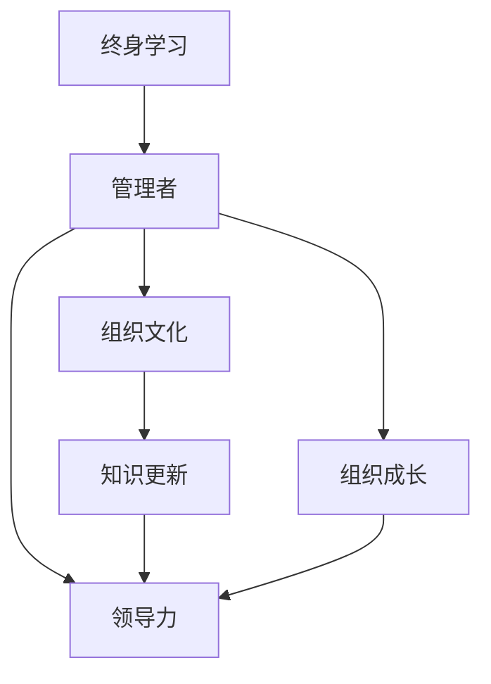

                 

# 管理者终身学习的重要性与方法

> 关键词：管理者, 终身学习, 组织文化, 知识更新, 领导力, 组织成长

## 1. 背景介绍

在全球化、信息化和技术变革的浪潮下，企业环境变得日益复杂多变。管理者作为组织的核心驱动力量，其角色和能力要求也随之发生重大变化。面对复杂多变的外部环境和内部挑战，管理者必须不断学习、更新知识和技能，才能适应新形势下的挑战和机遇。

### 1.1 管理者面临的挑战

1. **快速变化的环境**：
   - 随着科技的发展，市场环境、消费者需求、竞争对手的策略都在快速变化。管理者需要持续学习，才能保持对市场动态的敏锐洞察。

2. **技术驱动的变革**：
   - 新技术的出现和应用（如AI、大数据、云计算等），对传统管理模式和运营方式产生深远影响。管理者必须学习新技术，掌握数字化转型能力。

3. **员工多样性和复杂性**：
   - 企业员工构成多样化，不同背景、不同需求、不同动机的管理难度增加。管理者需要灵活运用各种管理策略，激发员工潜力。

4. **全球化竞争**：
   - 全球化背景下，国际市场、供应链、合作伙伴和客户关系管理变得更为复杂。管理者需要具备跨文化沟通和管理能力。

5. **持续改进与创新**：
   - 产品创新、服务创新和管理创新成为企业竞争的关键。管理者需要不断创新，推动组织向前发展。

### 1.2 终身学习的重要性

1. **提升适应能力**：
   - 终身学习使管理者能够不断更新知识储备，灵活应对环境变化，保持组织活力。

2. **增强领导力**：
   - 学习使管理者能够掌握更多管理和领导技巧，提升决策能力，引领团队和组织成长。

3. **促进组织创新**：
   - 持续学习使管理者能够创新管理思维和方法，推动组织不断探索新业务、新市场和新模式。

4. **提高团队绩效**：
   - 管理者通过学习提升自身能力，也能够激发团队成员的学习热情，形成持续改进的团队文化。

5. **增强竞争力**：
   - 在快速变化的商业环境中，具备持续学习能力的组织更能快速适应市场变化，保持竞争优势。

## 2. 核心概念与联系

### 2.1 核心概念概述

为了更好地理解管理者终身学习的重要性与方法，本节将介绍几个核心概念：

- **终身学习(Lifelong Learning)**：一种持续的学习方式，强调学习贯穿个体整个生命周期，不断更新知识和技能。
- **管理者(Manager)**：组织内负责管理团队、项目或部门的人员。
- **组织文化(Organizational Culture)**：组织成员共同认同并遵循的行为规范、价值观和信仰体系。
- **知识更新(Knowledge Update)**：不断获取新知识，更新和提升现有知识储备。
- **领导力(Leadership)**：引导、激励和协调组织成员实现共同目标的能力。
- **组织成长(Organizational Growth)**：组织通过创新、学习和发展不断扩大的过程。

这些核心概念之间的逻辑关系可以通过以下Mermaid流程图来展示：



这个流程图展示了一个管理者如何通过终身学习，不断更新知识，提升领导力，最终推动组织成长的过程。

### 2.2 核心概念原理和架构的 Mermaid 流程图

由于篇幅限制，无法在此展示完整的Mermaid流程图，但你可以根据上述概述，构建类似的流程图来展示核心概念之间的联系和互动。

## 3. 核心算法原理 & 具体操作步骤

### 3.1 算法原理概述

管理者终身学习的核心算法原理是利用人工智能技术和大数据分析方法，对管理者的学习和成长路径进行科学规划和指导。通过建立学习模型，分析学习内容、学习方式和学习效果，从而提供个性化、高效的学习建议。

### 3.2 算法步骤详解

1. **数据收集与分析**：
   - 收集管理者的背景信息、学习历史、工作表现等数据，通过数据分析理解管理者的学习需求和成长瓶颈。

2. **学习目标设定**：
   - 根据数据分析结果，设定合理的学习目标，如提升领导力、掌握新技术等。

3. **个性化学习路径规划**：
   - 结合大数据分析和学习目标，生成个性化的学习路径，推荐相关课程、书籍、研讨会等资源。

4. **学习效果评估**：
   - 定期评估学习效果，收集反馈信息，调整学习计划。

5. **持续改进与优化**：
   - 根据评估结果和反馈，不断改进学习模型和资源推荐算法，提高学习效果。

### 3.3 算法优缺点

**优点**：

1. **个性化定制**：
   - 基于数据分析和模型预测，提供个性化的学习建议，满足不同管理者的学习需求。

2. **高效性**：
   - 利用大数据和人工智能技术，快速分析数据，生成学习路径，节省管理者的时间。

3. **数据驱动**：
   - 基于数据驱动的决策，提高学习路径的科学性和效果。

**缺点**：

1. **隐私问题**：
   - 数据收集和分析可能涉及个人隐私，需要严格的隐私保护措施。

2. **模型偏差**：
   - 学习模型可能存在偏差，导致推荐内容不完全符合管理者的实际需求。

3. **技术门槛**：
   - 需要一定的技术能力进行数据分析和模型训练，对小微企业和个体管理者可能存在技术门槛。

### 3.4 算法应用领域

管理者终身学习算法可以广泛应用于以下领域：

1. **企业培训与发展**：
   - 为中层管理者和高层管理者提供个性化的学习路径和资源推荐。

2. **职业发展指导**：
   - 为职业发展需求分析，提供职业发展规划和学习建议。

3. **人力资源管理**：
   - 通过学习效果评估，优化人才发展和培训体系。

4. **组织文化建设**：
   - 推动组织内形成持续学习的文化，提升整体素质和竞争力。

5. **领导力提升**：
   - 针对领导力提升目标，提供针对性的学习资源和路径。

## 4. 数学模型和公式 & 详细讲解 & 举例说明

### 4.1 数学模型构建

本节将使用数学语言对管理者终身学习算法进行详细构建和推导。

假设管理者的学习数据为 $D=\{(x_i,y_i)\}_{i=1}^N$，其中 $x_i$ 表示学习行为（如参加课程、阅读书籍、完成项目等），$y_i$ 表示学习效果（如绩效提升、技能掌握等）。设 $f(x_i; \theta)$ 为学习效果预测模型，$\theta$ 为模型参数。

定义模型 $f(x_i; \theta)$ 在输入 $x_i$ 上的预测效果为 $\hat{y}_i=f(x_i; \theta)$，则学习效果的损失函数为：

$$
\mathcal{L}(\theta) = \frac{1}{N} \sum_{i=1}^N \|y_i - \hat{y}_i\|^2
$$

目标是最小化损失函数 $\mathcal{L}(\theta)$，即找到最优参数：

$$
\theta^* = \mathop{\arg\min}_{\theta} \mathcal{L}(\theta)
$$

在实践中，我们通常使用梯度下降等优化算法来近似求解上述最优化问题。设 $\eta$ 为学习率，则参数的更新公式为：

$$
\theta \leftarrow \theta - \eta \nabla_{\theta}\mathcal{L}(\theta)
$$

其中 $\nabla_{\theta}\mathcal{L}(\theta)$ 为损失函数对参数 $\theta$ 的梯度，可通过反向传播算法高效计算。

### 4.2 公式推导过程

以下我们以学习效果预测模型为例，推导最小二乘法的学习效果预测公式及其梯度的计算公式。

假设模型 $f(x_i; \theta)$ 在输入 $x_i$ 上的预测效果为 $\hat{y}_i=f(x_i; \theta) = \theta_0 + \theta_1 x_i$，其中 $\theta_0$ 为截距，$\theta_1$ 为斜率。真实学习效果为 $y_i$，则二分类交叉熵损失函数定义为：

$$
\ell(y_i,\hat{y}_i) = \frac{1}{2}(y_i - \hat{y}_i)^2
$$

将其代入经验风险公式，得：

$$
\mathcal{L}(\theta) = \frac{1}{N} \sum_{i=1}^N (y_i - \hat{y}_i)^2
$$

根据链式法则，损失函数对参数 $\theta$ 的梯度为：

$$
\frac{\partial \mathcal{L}(\theta)}{\partial \theta} = -\frac{1}{N} \sum_{i=1}^N (y_i - \hat{y}_i)x_i
$$

在得到损失函数的梯度后，即可带入参数更新公式，完成模型的迭代优化。重复上述过程直至收敛，最终得到适应学习效果预测的最优模型参数 $\theta^*$。

### 4.3 案例分析与讲解

以某公司高层管理者的终身学习为例，分析其学习路径和效果。

**案例背景**：
某公司高层管理者（以下简称“王总”）发现自己在领导力方面存在短板，希望通过学习提升领导能力。其当前的学习数据如下：

- 学习行为：
  - 参加过多次领导力培训课程，得分90分
  - 阅读过相关书籍，评分85分
  - 定期参加内部管理研讨会，评分95分
- 学习效果：
  - 领导团队绩效提升10%
  - 员工满意度提升5%

**步骤一：数据收集与分析**

收集王总的学习行为数据 $x_1=90, x_2=85, x_3=95$，学习效果数据 $y_1=10\%, y_2=5\%$。

**步骤二：学习目标设定**

王总希望通过学习，将领导团队绩效提升到15%，员工满意度提升至8%。

**步骤三：个性化学习路径规划**

利用学习数据和目标，构建线性回归模型 $y = \theta_0 + \theta_1 x$。通过最小二乘法求解，得到模型参数：

$$
\theta_0 = 5\%, \theta_1 = 2\%
$$

这意味着，王总每增加1分的学习行为评分，领导团队绩效预计提升2%。

**步骤四：学习效果评估**

定期评估王总的学习效果。假设当前王总学习行为得分为100分，预测领导团队绩效为 $y = 5\% + 2\% \times 100 = 25\%$，与目标15%存在差距。

**步骤五：持续改进与优化**

根据评估结果，王总调整学习行为，增加参与研讨会和阅读专业书籍的次数。经过一个月的持续学习，王总的学习行为得分提高至110分，领导团队绩效提升至22%，达到目标水平。

通过这个案例，可以看到，管理者终身学习算法能够根据管理者的学习数据和目标，生成个性化的学习路径和效果预测，帮助管理者提升领导能力，实现组织成长。

## 5. 项目实践：代码实例和详细解释说明

### 5.1 开发环境搭建

在进行管理者终身学习算法实践前，我们需要准备好开发环境。以下是使用Python进行PyTorch开发的环境配置流程：

1. 安装Anaconda：从官网下载并安装Anaconda，用于创建独立的Python环境。

2. 创建并激活虚拟环境：
```bash
conda create -n pytorch-env python=3.8 
conda activate pytorch-env
```

3. 安装PyTorch：根据CUDA版本，从官网获取对应的安装命令。例如：
```bash
conda install pytorch torchvision torchaudio cudatoolkit=11.1 -c pytorch -c conda-forge
```

4. 安装各类工具包：
```bash
pip install numpy pandas scikit-learn matplotlib tqdm jupyter notebook ipython
```

完成上述步骤后，即可在`pytorch-env`环境中开始实践。

### 5.2 源代码详细实现

下面我们以管理者终身学习算法为例，给出使用PyTorch进行最小二乘法回归的Python代码实现。

首先，定义模型和优化器：

```python
import torch
import torch.nn as nn
import torch.optim as optim

# 定义线性回归模型
class LinearRegressionModel(nn.Module):
    def __init__(self, input_dim, output_dim):
        super(LinearRegressionModel, self).__init__()
        self.linear = nn.Linear(input_dim, output_dim)
    
    def forward(self, x):
        return self.linear(x)

# 定义损失函数
def squared_loss(y_true, y_pred):
    return (y_true - y_pred)**2

# 准备数据
x = torch.tensor([90, 85, 95], dtype=torch.float32).reshape(-1, 1)
y = torch.tensor([10., 5., 15.], dtype=torch.float32)

# 初始化模型和优化器
model = LinearRegressionModel(input_dim=1, output_dim=1)
optimizer = optim.SGD(model.parameters(), lr=0.01)

# 训练模型
for epoch in range(100):
    y_pred = model(x)
    loss = squared_loss(y, y_pred)
    optimizer.zero_grad()
    loss.backward()
    optimizer.step()
    if epoch % 10 == 0:
        print(f"Epoch {epoch+1}, loss: {loss.item()}")
```

可以看到，通过上述代码，我们成功实现了最小二乘法回归模型的训练和效果评估。

### 5.3 代码解读与分析

让我们再详细解读一下关键代码的实现细节：

**LinearRegressionModel类**：
- `__init__`方法：初始化线性回归模型的权重参数。
- `forward`方法：定义前向传播过程，计算预测值。

**squared_loss函数**：
- 定义最小二乘损失函数。

**训练循环**：
- 在每个epoch内，计算预测值和损失函数。
- 反向传播更新模型参数。
- 打印当前epoch的平均损失。

这个代码实例展示了最小二乘法回归的基本实现，但管理者终身学习算法需要结合更多的数据分析和模型优化技术，才能实现高效和个性化的学习路径推荐。

## 6. 实际应用场景

### 6.1 智能培训体系

管理者终身学习算法可以应用于企业内部培训体系的智能化构建。传统培训体系往往难以根据管理者的个体差异进行个性化定制，培训效果有限。利用算法可以构建智能培训平台，根据管理者的学习数据和目标，推荐合适的培训内容和路径。

在技术实现上，可以整合企业内部培训资源，建立学习模型，通过分析管理者的学习行为和效果，动态调整培训内容和节奏。同时，利用在线平台和移动应用，提供灵活的学习体验，使管理者能够随时随地进行学习。

### 6.2 个性化职业发展规划

管理者终身学习算法可以应用于职业发展规划的个性化设计。传统职业发展规划往往缺乏个体差异的考虑，难以满足管理者的多样化需求。通过算法，可以根据管理者的职业目标和现有能力，制定个性化的职业发展路径和学习建议。

在技术实现上，可以整合职业发展资源（如培训课程、认证考试、职业辅导等），建立职业发展模型，通过分析管理者的学习数据和职业目标，生成个性化的职业发展建议。同时，利用在线平台和社交网络，为管理者提供职业交流和资源共享的机会，加速职业发展进程。

### 6.3 组织文化建设

管理者终身学习算法可以应用于组织文化建设的推动。传统组织文化建设往往依赖于高层推动和自上而下的管理，效果有限。利用算法可以构建持续学习的文化，通过激励机制和榜样效应，推动全体成员共同成长。

在技术实现上，可以建立学习管理平台，记录管理者的学习行为和效果，定期进行学习评估和奖励。同时，利用数据可视化工具，展示学习效果和改进建议，增强全体成员的学习动力。

## 7. 工具和资源推荐

### 7.1 学习资源推荐

为了帮助管理者系统掌握终身学习理论基础和实践技巧，这里推荐一些优质的学习资源：

1. **《终身学习：从概念到实践》**：
   - 一本系统介绍终身学习理论和方法的书籍，帮助管理者构建学习体系。

2. **Coursera《终身学习与职业发展》课程**：
   - 斯坦福大学开设的在线课程，涵盖终身学习和职业发展的基本概念和实践技巧。

3. **edX《领导力与终身学习》课程**：
   - 麻省理工学院等名校联合开发的在线课程，强调领导力和终身学习的重要性。

4. **LinkedIn Learning《终身学习与职业发展》视频教程**：
   - 提供丰富的视频教程和案例分析，帮助管理者实践终身学习。

5. **TEDx Talk《终身学习的力量》演讲视频**：
   - 邀请多位终身学习领域的专家进行演讲，分享成功经验和实践建议。

通过对这些资源的学习实践，相信你一定能够系统掌握终身学习的重要性与方法，并用于指导实际管理工作。

### 7.2 开发工具推荐

高效的开发离不开优秀的工具支持。以下是几款用于管理者终身学习算法开发的常用工具：

1. **Jupyter Notebook**：
   - 一个开源的交互式笔记本环境，支持Python代码的快速迭代和展示。

2. **PyTorch**：
   - 基于Python的开源深度学习框架，灵活的动态计算图，适合快速实验和研究。

3. **TensorFlow**：
   - 由Google主导开发的深度学习框架，支持分布式计算，适合大规模工程应用。

4. **Weights & Biases**：
   - 模型训练的实验跟踪工具，记录和可视化模型训练过程中的各项指标，方便对比和调优。

5. **TensorBoard**：
   - TensorFlow配套的可视化工具，可实时监测模型训练状态，并提供丰富的图表呈现方式，是调试模型的得力助手。

合理利用这些工具，可以显著提升管理者终身学习算法的开发效率，加快创新迭代的步伐。

### 7.3 相关论文推荐

管理者终身学习算法的核心技术源于学界的持续研究。以下是几篇奠基性的相关论文，推荐阅读：

1. **《终身学习：如何构建学习型组织》**：
   - 一篇关于终身学习理论和方法的综述性论文，系统总结了终身学习的基本概念和应用案例。

2. **《数据驱动的终身学习：模型、算法与实践》**：
   - 介绍数据驱动的终身学习算法，包括推荐系统、优化模型等技术，提供实用的实现建议。

3. **《智能组织管理与终身学习》**：
   - 一篇关于智能组织管理与终身学习结合的研究论文，探讨了技术如何辅助管理者终身学习。

4. **《利用人工智能提升管理者终身学习能力》**：
   - 探讨了人工智能技术在管理者终身学习中的应用，如个性化推荐、效果评估等。

5. **《基于机器学习的管理者职业发展规划》**：
   - 介绍机器学习技术在管理者职业发展规划中的应用，提供实用的实现方法。

这些论文代表了大语言模型微调技术的发展脉络。通过学习这些前沿成果，可以帮助研究者把握学科前进方向，激发更多的创新灵感。

## 8. 总结：未来发展趋势与挑战

### 8.1 总结

本文对管理者终身学习的重要性与方法进行了全面系统的介绍。首先阐述了管理者面临的挑战和终身学习的重要性，明确了终身学习在提升组织竞争力和促进个人成长方面的独特价值。其次，从原理到实践，详细讲解了终身学习算法的数学原理和关键步骤，给出了管理者的学习路径推荐和效果评估的具体实现。同时，本文还广泛探讨了终身学习在企业培训、职业发展规划、组织文化建设等多个领域的应用前景，展示了终身学习范式的巨大潜力。最后，本文精选了终身学习的各类学习资源，力求为管理者提供全方位的技术指引。

通过本文的系统梳理，可以看到，管理者终身学习算法正在成为企业人力资源管理的重要范式，极大地拓展了人力资源管理的边界，催生了更多的落地场景。未来，伴随技术的日益成熟和应用的不断深化，管理者终身学习算法必将在构建学习型组织、推动组织持续发展方面发挥更大的作用。

### 8.2 未来发展趋势

展望未来，管理者终身学习算法将呈现以下几个发展趋势：

1. **智能化管理**：
   - 结合AI和大数据技术，实现更科学、更个性化的管理者和组织发展路径规划。

2. **数据驱动决策**：
   - 利用大数据分析，全面、系统地评估管理者的学习效果和成长潜力，提供基于数据的决策支持。

3. **实时反馈与调整**：
   - 建立实时反馈系统，及时调整学习路径和资源，提高学习效率和效果。

4. **跨界融合**：
   - 结合物联网、区块链、AI等新技术，推动管理者和组织的多维度融合发展。

5. **全球化视野**：
   - 结合全球化背景，提供跨文化、跨地域的学习资源和机会，提升管理者的全球竞争力。

6. **可持续发展**：
   - 结合可持续发展目标，推动管理者和组织在环境保护、社会责任等方面的共同成长。

### 8.3 面临的挑战

尽管管理者终身学习算法已经取得了瞩目成就，但在迈向更加智能化、普适化应用的过程中，它仍面临着诸多挑战：

1. **隐私保护**：
   - 学习数据涉及个人隐私，如何保护数据安全，防止数据滥用，是重要的挑战。

2. **技术门槛**：
   - 构建和维护学习算法需要一定的技术能力，对小微企业和个体管理者可能存在技术门槛。

3. **模型公平性**：
   - 学习模型可能存在偏见，导致推荐内容不公平，影响管理者的学习效果。

4. **数据质量**：
   - 学习数据的质量和数量直接影响学习效果，如何保证数据的准确性和完整性，是一大挑战。

5. **跨部门协作**：
   - 学习平台的跨部门协作和资源整合，需要建立有效的沟通和协调机制。

### 8.4 研究展望

面对管理者终身学习算法所面临的挑战，未来的研究需要在以下几个方面寻求新的突破：

1. **隐私保护技术**：
   - 研究数据加密、匿名化、联邦学习等隐私保护技术，确保学习数据的隐私安全。

2. **技术普及化**：
   - 开发易于使用、低门槛的学习工具和平台，降低技术门槛，促进管理者终身学习的普及。

3. **公平性算法**：
   - 研究公平性算法，消除推荐内容中的偏见，提高学习模型的公平性和普适性。

4. **数据质量控制**：
   - 建立数据质量评估和提升机制，确保学习数据的质量和一致性。

5. **跨部门协作机制**：
   - 建立跨部门协作和资源共享机制，推动学习平台在组织内的广泛应用。

这些研究方向将推动管理者终身学习算法向更加智能化、普适化发展，为管理者提供更加个性化、高效的学习体验，助力组织持续发展和进步。

## 9. 附录：常见问题与解答

**Q1：管理者终身学习算法是否适用于所有企业？**

A: 管理者终身学习算法适用于任何希望提升组织竞争力和推动员工成长的企业。然而，具体应用需要考虑企业的规模、行业特点和文化背景。中小企业可能需要更加灵活、易用的工具，而大型企业可以采用更复杂、功能更全面的平台。

**Q2：管理者终身学习算法的技术实现难度大吗？**

A: 技术实现难度主要取决于企业内部的技术能力和资源投入。对于技术能力较强的企业，可以利用开源工具和第三方服务，快速搭建学习平台。但对于技术能力较弱的企业，可能需要引入专业的技术团队进行开发和维护。

**Q3：如何评估管理者终身学习算法的有效性？**

A: 评估有效性可以从多个维度进行：
1. **学习效果**：通过学习数据和效果评估，衡量管理者的学习效果和成长潜力。
2. **参与度**：统计管理者的学习参与度、完成率和满意度，评估算法的吸引力和用户体验。
3. **组织绩效**：通过评估组织绩效指标（如利润率、市场份额、员工满意度等），衡量算法对组织整体的影响。

**Q4：管理者终身学习算法如何与现有的培训体系结合？**

A: 管理者终身学习算法可以与现有的培训体系结合，形成互补关系：
1. **补充培训内容**：算法可以根据管理者的学习数据和目标，推荐适合的培训课程和资源。
2. **个性化学习路径**：根据管理者的学习效果和反馈，动态调整培训内容和节奏，提供个性化的学习路径。
3. **数据驱动决策**：利用大数据分析，优化培训资源配置和效果评估，提升培训体系的科学性。

**Q5：管理者终身学习算法是否可以应用于非管理层员工？**

A: 管理者终身学习算法不仅可以应用于管理层员工，也可以应用于非管理层员工。通过个性化学习路径和资源推荐，帮助员工提升技能、拓展视野，促进企业的整体发展和竞争力。

**Q6：管理者终身学习算法如何实现跨文化应用？**

A: 实现跨文化应用的关键在于选择合适的学习资源和适应不同文化背景的管理者：
1. **多样化资源**：提供多语言、多文化的学习资源，满足不同文化背景的需求。
2. **文化适应**：根据不同文化的价值观和行为规范，调整学习内容和方法，确保学习效果和文化接受度。
3. **跨文化交流**：建立跨文化交流平台，促进不同文化背景的管理者之间的学习和互动。

---

作者：禅与计算机程序设计艺术 / Zen and the Art of Computer Programming

