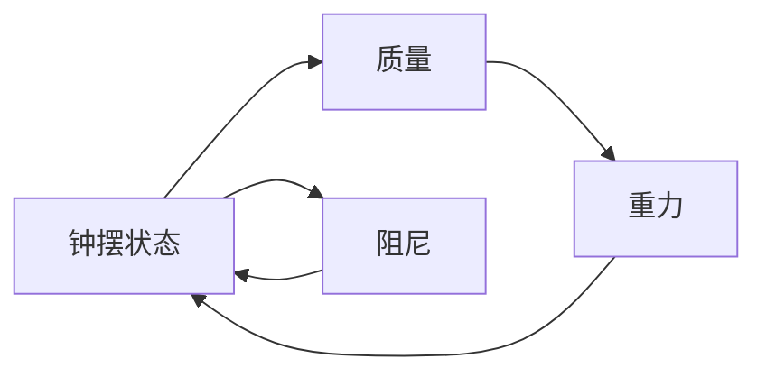

                 

# 系统思维:管理者应对复杂问题的能力

## 1. 背景介绍

在当前复杂多变的环境中，管理者面临的问题日益复杂。无论是在项目管理、企业战略还是产品迭代中，都需要面对多变量、不确定性和资源限制等挑战。系统思维（Systems Thinking），作为一门广泛应用于管理和决策的学科，提供了系统性、全局性的视角来分析和解决复杂问题。本文将系统思维的方法论、工具和应用案例等进行深入探讨，以帮助管理者提升应对复杂问题的能力。

## 2. 核心概念与联系

### 2.1 核心概念概述

系统思维是一种看待世界和解决问题的方法，强调系统性的视角、反馈机制和动态变化。它的核心理念包括：

- **系统观**：将问题看作系统的一部分，而不是孤立的局部。
- **全局观**：关注系统整体而非局部。
- **动态观**：理解系统的变化和发展趋势。
- **反馈环**：系统内部各组成部分间存在相互作用和反馈。
- **层次性**：系统由不同层次的子系统组成，每个层次都有其功能和边界。
- **非线性**：系统行为和结果可能不符合线性规律。

这些概念通过Mermaid流程图进行展示：


### 2.2 核心概念原理和架构

系统思维的原理基于以下假设：

- **整体大于部分之和**：系统整体功能与个体功能有区别，需要考虑整体效应。
- **反馈循环**：系统的行为是由内部反馈机制决定的，需要理解反馈环的作用。
- **层次结构**：系统由不同层次组成，每一层都有其特定功能和相互作用。
- **耦合关系**：系统各部分之间存在紧密的耦合关系，需要考虑相互影响。
- **非线性互动**：系统行为可能非线性，难以通过简单的线性模型预测。

系统思维的架构包括：

- **模型构建**：建立系统的因果关系图，描述系统各组成部分的关系。
- **数据收集**：收集系统的输入和输出数据，用于验证和优化模型。
- **仿真与模拟**：使用仿真工具模拟系统行为，测试模型假设和预测。
- **迭代改进**：根据反馈调整模型和假设，不断优化系统行为。

## 3. 核心算法原理 & 具体操作步骤

### 3.1 算法原理概述

系统思维的算法原理基于系统动力学模型（System Dynamics Model），通过数学和仿真工具来描述和分析复杂系统。它强调系统的动态特性和反馈机制，通过仿真模拟系统行为，找出系统内部的关系和关键变量。

### 3.2 算法步骤详解

系统思维的应用步骤如下：

1. **定义系统边界**：明确系统的组成和范围，确定关键变量和反馈路径。
2. **构建因果关系图**：使用可视化工具描述系统各组成部分及其相互作用。
3. **建立数学模型**：使用微分方程和差分方程描述系统动态行为。
4. **仿真模拟**：通过仿真工具测试模型假设，验证因果关系。
5. **分析反馈环**：识别系统内的正反馈和负反馈，理解系统行为。
6. **提出解决方案**：根据仿真结果和分析结果，提出改善系统性能的策略。
7. **迭代改进**：根据实际结果不断调整模型和策略，优化系统行为。

### 3.3 算法优缺点

系统思维的优势包括：

- **全局视角**：关注系统整体而非局部，提供更全面的决策依据。
- **动态模拟**：通过仿真模拟系统行为，理解系统动态特性。
- **反馈机制**：识别系统内部的反馈环，避免盲目决策。
- **层次性分析**：分析系统不同层次的功能和影响。
- **非线性考量**：考虑系统行为的非线性特征，提高预测准确性。

缺点包括：

- **模型复杂性**：构建和验证系统模型需要较高的数学和仿真技能。
- **数据需求**：需要大量历史数据来验证和调整模型。
- **计算资源**：系统仿真可能占用大量计算资源，尤其是在大规模系统中。

### 3.4 算法应用领域

系统思维广泛应用于项目管理、组织变革、产品迭代、供应链管理等领域。例如：

- **项目管理**：通过系统思维识别项目关键路径和瓶颈，优化资源配置。
- **组织变革**：分析组织内部各个子系统的相互作用，制定变革策略。
- **产品迭代**：通过仿真模拟产品发布和市场反应，优化产品设计和策略。
- **供应链管理**：识别供应链中的瓶颈和风险，优化供应链流程。

## 4. 数学模型和公式 & 详细讲解 & 举例说明

### 4.1 数学模型构建

系统思维的数学模型通常使用微分方程和差分方程来描述系统行为。例如，一个简单的线性系统可以表示为：

$$
\dot{x} = ax + b
$$

其中 $\dot{x}$ 表示状态变量随时间的变化率，$a$ 和 $b$ 是系统参数。

### 4.2 公式推导过程

以一个简单的生态系统为例，描述植物和动物种群的变化。假设植物种群 $P$ 和动物种群 $A$ 之间的关系为：

$$
\dot{P} = kP - cPA
$$

$$
\dot{A} = cPA - dA
$$

其中 $k$ 表示植物的生长率，$c$ 表示植物对动物的贡献，$d$ 表示动物死亡率。这个系统可以被表示为一个二维微分方程组，通过数值仿真方法求解，可以观察到系统随时间变化的动态特性。

### 4.3 案例分析与讲解

一个经典的系统思维案例是经典钟摆系统：



钟摆的摆动可以看作一个非线性系统，系统行为和响应不满足线性规律。通过构建系统动力学模型，可以更好地理解钟摆的摆动规律和影响因素。

## 5. 项目实践：代码实例和详细解释说明

### 5.1 开发环境搭建

系统思维的实践通常需要数学和仿真工具的支持，如MATLAB、Simulink等。

1. 安装MATLAB和Simulink。
2. 配置项目环境，确保所有必要的插件和工具箱已安装。
3. 创建项目目录，组织代码和数据文件。

### 5.2 源代码详细实现

以下是一个简单的生态系统仿真模型，使用MATLAB语言描述：

```matlab
function dy = ecosystemModel(t, y, P, A)
    global k c d
    dy(1) = k * y(1) - c * y(1) * y(2);
    dy(2) = c * y(1) * y(2) - d * y(2);
end
```

### 5.3 代码解读与分析

上述代码定义了一个二维微分方程组，用于描述植物和动物种群的变化。使用MATLAB的ODE solver（如ode45）求解微分方程组，可以得到种群随时间的变化曲线，从而分析系统行为。

### 5.4 运行结果展示

运行上述代码，可以得到植物和动物种群随时间的变化曲线。

```python
import numpy as np
import matplotlib.pyplot as plt

def ecosystemModel(t, y):
    P, A = y
    k = 0.1
    c = 0.1
    d = 0.05
    return np.array([k * P - c * P * A, c * P * A - d * A])

tspan = np.linspace(0, 20, 100)
y0 = [1000, 1000]  # 初始种群数量
sol = solve(ecosystemModel, tspan, y0)

plt.plot(tspan, sol[:, 0], label='Plant')
plt.plot(tspan, sol[:, 1], label='Animal')
plt.legend()
plt.xlabel('Time')
plt.ylabel('Population')
plt.title('Ecosystem Dynamics')
plt.show()
```

## 6. 实际应用场景

### 6.1 项目管理

系统思维在项目管理中用于识别项目的关键路径和瓶颈，优化资源配置。例如，一个软件开发项目可以分解为多个子任务，通过系统思维模型可以识别出哪些任务是关键路径，哪些任务是瓶颈，从而优化资源分配和项目进度。

### 6.2 组织变革

系统思维可以应用于组织变革，分析组织内部各个子系统的相互作用，制定变革策略。例如，一家大型企业的组织变革可以通过系统思维模型识别出各个部门之间的耦合关系和反馈环，从而制定整体变革策略。

### 6.3 产品迭代

系统思维在产品迭代中用于仿真模拟产品发布和市场反应，优化产品设计和策略。例如，一款新产品的市场推广可以通过系统思维模型预测市场反应和用户行为，从而优化产品功能和市场策略。

### 6.4 供应链管理

系统思维可以用于供应链管理，识别供应链中的瓶颈和风险，优化供应链流程。例如，一个全球供应链可以通过系统思维模型分析各个环节的耦合关系和风险，从而优化供应链管理和资源配置。

## 7. 工具和资源推荐

### 7.1 学习资源推荐

1. **《系统思维导论》**：这本书系统介绍了系统思维的基本概念、方法和应用案例，适合初学者入门。
2. **《系统动力学》**：这本书深入探讨了系统动力学的原理和应用，适合进阶学习。
3. **在线课程**：Coursera、edX等平台上有很多关于系统思维和系统动力学的课程，适合自学。
4. **书籍推荐**：《系统思维与组织创新》、《系统思维与复杂系统》等书籍。

### 7.2 开发工具推荐

1. **MATLAB**：MATLAB是一款强大的数学和仿真软件，支持系统动力学模型和仿真。
2. **Simulink**：Simulink是MATLAB的仿真工具箱，用于建模和仿真复杂系统。
3. **Python**：Python可以用于构建和验证系统模型，如使用Sympy和NumPy等工具。

### 7.3 相关论文推荐

1. **《系统动力学模型在复杂系统中的应用》**：这篇论文系统介绍了系统动力学模型在复杂系统中的应用。
2. **《系统思维与组织变革》**：这篇论文探讨了系统思维在组织变革中的应用。
3. **《系统动力学模型在项目管理中的应用》**：这篇论文介绍了系统动力学模型在项目管理中的应用。

## 8. 总结：未来发展趋势与挑战

### 8.1 研究成果总结

系统思维已经成为现代管理的重要工具之一，广泛应用于项目管理、组织变革、产品迭代等领域。其核心思想包括系统观、全局观、动态观、反馈环等，提供了系统性、全局性的视角来分析和解决复杂问题。

### 8.2 未来发展趋势

未来系统思维的发展趋势包括：

1. **大数据分析**：系统思维将结合大数据技术，分析海量数据，提高模型精度和应用范围。
2. **人工智能**：系统思维将结合人工智能技术，自动化模型构建和验证过程。
3. **云平台**：系统思维将结合云平台技术，提高模型运行效率和可扩展性。
4. **多学科融合**：系统思维将与其他学科（如经济学、社会学等）结合，提供更全面的问题解决方案。

### 8.3 面临的挑战

系统思维面临的挑战包括：

1. **模型复杂性**：构建和验证系统模型需要较高的数学和仿真技能。
2. **数据需求**：需要大量历史数据来验证和调整模型。
3. **计算资源**：系统仿真可能占用大量计算资源，尤其是在大规模系统中。
4. **理解和应用**：系统思维需要系统化培训和实践，推广应用难度较大。

### 8.4 研究展望

未来系统思维的研究方向包括：

1. **多变量模型**：构建多变量系统模型，提高预测和决策能力。
2. **动态仿真**：使用动态仿真技术，模拟系统长期行为和趋势。
3. **实时监控**：结合物联网和实时监控技术，实时反馈系统状态和行为。
4. **智能决策**：结合人工智能和智能算法，提高系统决策和优化能力。

## 9. 附录：常见问题与解答

**Q1: 什么是系统思维？**

A: 系统思维是一种看待世界和解决问题的方法，强调系统性的视角、反馈机制和动态变化。

**Q2: 系统思维的应用有哪些？**

A: 系统思维广泛应用于项目管理、组织变革、产品迭代、供应链管理等领域。

**Q3: 系统思维的优缺点有哪些？**

A: 系统思维的优势包括全局视角、动态模拟、反馈机制等，缺点包括模型复杂性、数据需求等。

**Q4: 系统思维的工具有哪些？**

A: 系统思维的工具包括MATLAB、Simulink、Python等。

**Q5: 系统思维的未来发展方向是什么？**

A: 系统思维的未来发展方向包括大数据分析、人工智能、云平台、多学科融合等。

---

作者：禅与计算机程序设计艺术 / Zen and the Art of Computer Programming

