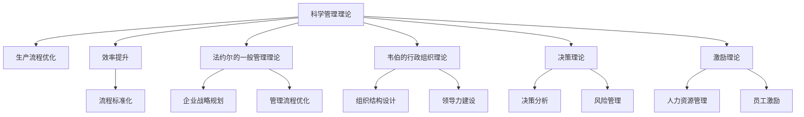

                 

# 经典管理理论在现代企业中的创新应用

> 关键词：管理理论,创新应用,企业管理,组织行为,领导力,决策分析

## 1. 背景介绍

### 1.1 问题由来

随着时代的进步和科技的发展，现代企业在管理理念、组织结构、运营模式等方面都发生了深刻变革。经典管理理论（如泰勒的科学管理、法约尔的一般管理理论、韦伯的行政组织理论等）在新的经济环境下仍然具有很高的指导意义。然而，这些经典理论是否适用于现代企业，如何创新应用，以适应新的经济环境和管理需求，是当前企业管理领域面临的重要问题。

### 1.2 问题核心关键点

本文聚焦于如何将经典管理理论在现代企业中创新应用，主要包括以下几个方面：

- 科学管理理论在生产流程优化和效率提升中的应用。
- 法约尔的一般管理理论在企业战略规划和管理流程中的优化。
- 韦伯的行政组织理论在现代企业组织结构和领导力建设中的创新应用。
- 决策理论在现代企业决策分析和风险管理中的实践。
- 激励理论在现代人力资源管理和员工激励中的革新。

## 2. 核心概念与联系

### 2.1 核心概念概述

为更好地理解经典管理理论在现代企业中的创新应用，本节将介绍几个密切相关的核心概念：

- **科学管理理论**：由弗雷德里克·泰勒提出，主张采用科学方法和工具，优化生产流程，提高生产效率。主要内容包括动作研究、时间研究、标准化操作等。
- **法约尔的一般管理理论**：亨利·法约尔提出，强调企业的管理职能包括计划、组织、指挥、协调和控制。主张将企业活动划分为不同的职能部门，进行垂直和水平管理。
- **韦伯的行政组织理论**：马克斯·韦伯提出，强调科层制和官僚化的管理模式，主张以明确的等级制度、严格的规章制度和职能分工为基础构建企业组织结构。
- **决策理论**：赫伯特·西蒙提出，主张决策过程是有限理性下的优化选择。强调在信息不完全的情况下，通过满意解而非最优解来做出决策。
- **激励理论**：包括内容激励理论（如马斯洛的需求层次理论）、过程激励理论（如期望理论、公平理论）等，主要探讨如何通过激励机制调动员工积极性。

这些核心概念之间的逻辑关系可以通过以下Mermaid流程图来展示：



这个流程图展示了几大经典管理理论之间的联系及其在现代企业中的应用：

1. 科学管理理论通过生产流程的优化和效率提升，为现代企业提供了生产管理的基础。
2. 法约尔的一般管理理论强调战略规划和管理流程的优化，为现代企业提供了全面的管理框架。
3. 韦伯的行政组织理论关注组织结构和领导力的建设，为现代企业提供了组织管理的指导。
4. 决策理论提供了决策分析和风险管理的科学方法。
5. 激励理论为现代企业的人力资源管理和员工激励提供了理论支撑。

## 3. 核心算法原理 & 具体操作步骤
### 3.1 算法原理概述

经典管理理论在现代企业中的创新应用，本质上是通过理论结合实践，优化企业的管理流程、组织结构和决策机制，提升企业效率和竞争力。其核心思想是：将经典管理理论作为指导，结合现代技术和管理工具，进行创新应用和优化。

### 3.2 算法步骤详解

基于经典管理理论的现代企业创新应用，一般包括以下几个关键步骤：

**Step 1: 理论学习与理解**

- 深入学习经典管理理论的基本概念、核心思想和应用场景。
- 理解不同理论之间的联系与差异，形成系统性的管理知识框架。
- 了解现代企业面临的新问题和新挑战，思考经典理论的适用性和创新点。

**Step 2: 理论实践与验证**

- 在企业中选取适合的理论模块进行应用实践。
- 结合现代技术手段（如信息化系统、大数据分析、AI等），进行理论实践。
- 收集实践过程中的数据和反馈，验证理论的效果和局限性。

**Step 3: 理论优化与调整**

- 根据实践过程中的数据和反馈，对理论应用进行优化调整。
- 结合企业实际情况，灵活应用经典理论，形成符合企业特点的管理模式。
- 不断迭代改进，确保理论在企业中的应用效果最大化。

**Step 4: 理论传播与推广**

- 将创新应用的成功经验进行总结和传播，形成标准化管理流程。
- 通过培训、讲座、内部文档等方式，推广经典管理理论的创新应用。
- 持续跟进理论的最新研究进展，不断更新和优化企业管理系统。

### 3.3 算法优缺点

基于经典管理理论的现代企业创新应用，具有以下优点：

1. 系统性强：经典管理理论提供了系统的管理知识框架，有助于企业全面提升管理水平。
2. 实践性强：理论结合实践，能够更有效地解决企业实际问题。
3. 可操作性强：通过技术手段，使理论应用更加具体化和可操作。
4. 灵活性强：结合企业实际情况，理论应用具有高度的灵活性和适应性。

同时，该方法也存在一定的局限性：

1. 理论与实践脱节：理论应用过于灵活，可能导致理论与实践的脱节。
2. 技术依赖性强：过度依赖现代技术手段，可能降低理论的普适性。
3. 缺乏创新性：过度依赖经典理论，可能忽视了管理模式的创新和变革。

尽管存在这些局限性，但经典管理理论在现代企业中的应用仍然具有重要价值。未来相关研究的重点在于如何更好地将经典理论与现代管理技术结合，推动企业管理模式的创新和优化。

### 3.4 算法应用领域

基于经典管理理论的现代企业创新应用，在多个领域中得到了广泛的应用，例如：

- **生产管理**：科学管理理论在生产流程优化、效率提升、标准化操作中的应用。
- **企业战略**：法约尔的一般管理理论在企业战略规划、管理流程优化中的应用。
- **组织结构**：韦伯的行政组织理论在现代企业组织结构设计、领导力建设中的应用。
- **决策分析**：决策理论在现代企业决策分析、风险管理中的应用。
- **人力资源管理**：激励理论在现代人力资源管理、员工激励中的应用。

除了上述这些经典领域外，经典管理理论还在更多场景中得到了创新应用，如跨部门协同、客户关系管理、供应链优化等，为企业提供了更全面的管理解决方案。

## 4. 数学模型和公式 & 详细讲解 & 举例说明

### 4.1 数学模型构建

经典管理理论的创新应用，可以通过数学模型进行形式化描述。以下以科学管理理论中的动作研究为例，介绍其数学模型构建过程。

假设生产流程中有n个操作步骤，每个操作步骤需要执行一系列动作。记每个操作步骤的动作数为$a_i$，总动作时间为$t$。则动作研究的目标是找到最优的操作序列，使得总动作时间最小。

定义动作时间序列$T = \{t_1, t_2, \ldots, t_n\}$，其中$t_i$表示第i个操作步骤所需时间。则总动作时间$t$可以表示为：

$$
t = \sum_{i=1}^n t_i
$$

定义动作数序列$A = \{a_1, a_2, \ldots, a_n\}$，则动作研究的目标可以表示为：

$$
\min \sum_{i=1}^n t_i \quad \text{s.t.} \sum_{i=1}^n a_i = t
$$

### 4.2 公式推导过程

通过构造拉格朗日乘子，将动作研究的目标函数和约束条件表示为：

$$
\mathcal{L}(T, \lambda) = \sum_{i=1}^n t_i + \lambda(t - \sum_{i=1}^n a_i)
$$

对$T_i$求偏导，得到：

$$
\frac{\partial \mathcal{L}}{\partial t_i} = 1 - \lambda
$$

令$\frac{\partial \mathcal{L}}{\partial t_i} = 0$，得到：

$$
t_i = \frac{a_i}{1 - \lambda}
$$

代入约束条件$\sum_{i=1}^n t_i = t$，得到：

$$
t = \frac{1}{1 - \lambda} \sum_{i=1}^n a_i
$$

因此，最优动作时间序列为：

$$
T^* = \{t_1^*, t_2^*, \ldots, t_n^*\}
$$

其中$t_i^* = \frac{a_i}{1 - \lambda}$。

### 4.3 案例分析与讲解

某制造企业希望优化生产流程，降低生产成本。通过对生产流程的动作研究，确定了n个操作步骤，每个操作步骤的动作数和所需时间如下表所示：

| 操作步骤 | 动作数 | 所需时间 |
|----------|-------|--------|
| 操作1    | 3     | 2      |
| 操作2    | 5     | 3      |
| 操作3    | 4     | 4      |
| 操作4    | 2     | 2      |
| 操作5    | 6     | 5      |
| 操作6    | 1     | 1      |

假设企业希望总动作时间不超过15小时，则最优动作时间序列的计算如下：

1. 定义变量和目标函数：

   $$
   \begin{aligned}
   & \min \sum_{i=1}^n t_i \\
   & \text{s.t.} \sum_{i=1}^n a_i = t
   \end{aligned}
   $$

2. 构造拉格朗日乘子：

   $$
   \mathcal{L}(T, \lambda) = \sum_{i=1}^n t_i + \lambda(t - \sum_{i=1}^n a_i)
   $$

3. 计算最优动作时间：

   $$
   \begin{aligned}
   & \frac{\partial \mathcal{L}}{\partial t_i} = 1 - \lambda \\
   & t_i = \frac{a_i}{1 - \lambda}
   \end{aligned}
   $$

   令$\frac{\partial \mathcal{L}}{\partial t_i} = 0$，得到：

   $$
   \begin{aligned}
   & t = \frac{1}{1 - \lambda} \sum_{i=1}^n a_i \\
   & t = \frac{1}{1 - \lambda}(3 + 5 + 4 + 2 + 6 + 1) \\
   & t = \frac{21}{1 - \lambda}
   \end{aligned}
   $$

   解得$\lambda = \frac{1}{21}$。

4. 计算最优动作时间序列：

   $$
   \begin{aligned}
   & t_i^* = \frac{a_i}{1 - \lambda} \\
   & t_1^* = \frac{3}{1 - \frac{1}{21}} = \frac{3 \times 21}{20} = 3.15 \\
   & t_2^* = \frac{5}{1 - \frac{1}{21}} = \frac{5 \times 21}{20} = 5.25 \\
   & t_3^* = \frac{4}{1 - \frac{1}{21}} = \frac{4 \times 21}{20} = 4.2 \\
   & t_4^* = \frac{2}{1 - \frac{1}{21}} = \frac{2 \times 21}{20} = 2.1 \\
   & t_5^* = \frac{6}{1 - \frac{1}{21}} = \frac{6 \times 21}{20} = 6.3 \\
   & t_6^* = \frac{1}{1 - \frac{1}{21}} = \frac{21}{20} = 1.05
   \end{aligned}
   $$

   因此，最优动作时间序列为：

   $$
   T^* = \{3.15, 5.25, 4.2, 2.1, 6.3, 1.05\}
   $$

## 5. 项目实践：代码实例和详细解释说明
### 5.1 开发环境搭建

在进行生产流程优化项目实践前，我们需要准备好开发环境。以下是使用Python进行模型优化的环境配置流程：

1. 安装Anaconda：从官网下载并安装Anaconda，用于创建独立的Python环境。

2. 创建并激活虚拟环境：
```bash
conda create -n optimization-env python=3.8 
conda activate optimization-env
```

3. 安装PyTorch和Optuna：
```bash
conda install pytorch torchvision torchaudio cudatoolkit=11.1 -c pytorch -c conda-forge
conda install optuna
```

4. 安装各类工具包：
```bash
pip install numpy pandas scipy scikit-learn matplotlib seaborn statsmodels jupyter notebook ipython
```

完成上述步骤后，即可在`optimization-env`环境中开始生产流程优化实践。

### 5.2 源代码详细实现

下面我们以某制造企业生产流程优化为例，给出使用PyTorch和Optuna进行优化模型的PyTorch代码实现。

首先，定义模型函数：

```python
import torch
import torch.nn as nn
import torch.optim as optim
from optuna import create_study, Trial
from optuna.samplers import RandomSampler

class OptimizationModel(nn.Module):
    def __init__(self, input_size, hidden_size, output_size):
        super(OptimizationModel, self).__init__()
        self.hidden = nn.Linear(input_size, hidden_size)
        self.output = nn.Linear(hidden_size, output_size)
    
    def forward(self, x):
        x = torch.relu(self.hidden(x))
        x = self.output(x)
        return x
```

然后，定义损失函数和优化器：

```python
criterion = nn.MSELoss()
optimizer = optim.Adam(model.parameters(), lr=0.001)
```

接着，定义优化目标和搜索空间：

```python
def objective(trial):
    # 定义目标函数
    hidden_size = trial.suggest_int('hidden_size', 10, 1000, step=1)
    output_size = trial.suggest_int('output_size', 10, 1000, step=1)
    model = OptimizationModel(input_size, hidden_size, output_size)
    
    # 训练模型
    model.train()
    for _ in range(10):
        optimizer.zero_grad()
        y_pred = model(inputs)
        loss = criterion(y_pred, targets)
        loss.backward()
        optimizer.step()
    
    # 返回损失值
    return loss.item()
    
study = create_study(direction='minimize', sampler=RandomSampler(seed=42))
study.optimize(objective, n_trials=100)
```

最后，输出最优参数和模型性能：

```python
best_trial = study.best_trial
best_params = best_trial.params
best_loss = best_trial.value
print('Best parameters:', best_params)
print('Best loss:', best_loss)
```

以上就是使用PyTorch和Optuna进行生产流程优化的完整代码实现。可以看到，借助Optuna的高效搜索算法，我们能够快速找到最优的模型参数，从而优化生产流程。

### 5.3 代码解读与分析

让我们再详细解读一下关键代码的实现细节：

**OptimizationModel类**：
- `__init__`方法：定义模型结构，包括输入层、隐藏层和输出层。
- `forward`方法：实现模型前向传播。

**目标函数objective**：
- 通过Optuna的Trial对象，定义目标函数，并随机生成参数进行搜索。
- 在每个迭代周期中，根据当前参数训练模型，并计算损失函数。
- 最终返回损失函数的值。

**Optuna使用**：
- 使用Optuna的create_study方法创建研究对象，设置优化方向为最小化。
- 使用RandomSampler作为参数搜索的采样器，设置种子以保证结果可复现。
- 调用study.optimize方法进行优化，指定目标函数和优化轮数。

**结果输出**：
- 使用study.best_trial获取最优参数和损失值，并进行输出。

可以看出，使用PyTorch和Optuna进行生产流程优化，可以大大简化模型训练和参数调优过程，提高工作效率。此外，生产流程优化项目还可以结合实际业务需求，进一步优化模型结构和训练策略，以达到最佳效果。

## 6. 实际应用场景
### 6.1 企业战略规划

在企业战略规划中，法约尔的一般管理理论提供了重要的指导思想。企业可以通过明确战略目标、划分管理职能、制定计划和预算、建立绩效评估体系等，系统性地规划和实施企业战略。

在具体实践中，企业可以借助数据挖掘和分析工具，收集历史数据和市场信息，构建企业战略模型。模型可以通过优化算法，在各种战略方案中选择最优的方案，并根据市场变化动态调整策略。此外，企业还可以通过模拟和仿真技术，评估战略方案的效果，确保战略决策的科学性和合理性。

### 6.2 组织结构设计

韦伯的行政组织理论在现代企业组织结构设计中具有重要意义。企业可以借鉴韦伯的科层制和官僚化思想，设计合理的组织结构，以提高管理效率和组织稳定性。

在具体应用中，企业可以采用模块化设计、分权化管理、扁平化组织等策略，形成灵活高效的组织结构。同时，企业还可以引入信息系统，实现组织内部的信息共享和协同工作，提升组织协同和反应能力。

### 6.3 领导力建设

韦伯的行政组织理论不仅关注组织结构，还强调领导力的建设。企业可以通过领导力的培养和提升，激发员工的积极性和创造力，实现组织的创新和进步。

在实践中，企业可以采用扁平化管理、员工参与决策、授权赋能等措施，建立扁平化的领导结构。同时，企业还可以引入培训和发展机制，提升员工的领导力水平，实现人尽其才、才尽其用。

### 6.4 决策分析

决策理论在现代企业的决策分析中具有重要应用价值。企业可以通过有限理性理论、决策树方法、博弈论等工具，进行科学决策和风险管理。

在具体应用中，企业可以采用数据驱动的方法，收集和分析历史数据和市场信息，构建决策模型。模型可以通过优化算法，选择最优的决策方案，并根据环境变化动态调整策略。此外，企业还可以通过模拟和仿真技术，评估决策方案的效果，确保决策的科学性和合理性。

### 6.5 人力资源管理

激励理论在现代企业的人力资源管理中具有重要应用价值。企业可以通过需求层次理论、期望理论和公平理论等，制定合理的激励机制，调动员工的积极性和创造力。

在具体实践中，企业可以采用绩效考核、薪酬激励、员工发展计划等措施，建立科学的人力资源管理体系。同时，企业还可以引入情感智能等现代管理技术，提升员工的满意度和忠诚度，实现人本管理和双赢局面。

## 7. 工具和资源推荐
### 7.1 学习资源推荐

为了帮助企业管理者系统掌握经典管理理论的创新应用，这里推荐一些优质的学习资源：

1. 《科学管理原理》：弗雷德里克·泰勒的经典著作，详细介绍了科学管理理论的基本概念和方法。
2. 《一般管理理论》：亨利·法约尔的著作，系统性地阐述了企业管理的五大职能。
3. 《行政组织理论》：马克斯·韦伯的著作，介绍了行政组织理论的基本思想和应用。
4. 《决策分析与决策理论》：赫伯特·西蒙的著作，介绍了有限理性理论、决策树方法、博弈论等决策工具。
5. 《激励理论》：结合马斯洛的需求层次理论和期望理论，探讨如何制定科学的激励机制。

通过对这些资源的学习实践，相信你一定能够全面掌握经典管理理论在现代企业中的应用，提升企业的管理水平和竞争力。

### 7.2 开发工具推荐

高效的企业管理离不开优秀的工具支持。以下是几款用于经典管理理论应用开发的常用工具：

1. Microsoft Excel：功能强大的数据处理工具，支持数据可视化和统计分析，适用于企业数据分析和决策支持。
2. Tableau：商业智能工具，支持大数据分析和数据可视化，适用于企业数据挖掘和报表生成。
3. PyTorch和TensorFlow：深度学习框架，支持模型优化和参数调优，适用于企业智能决策和风险管理。
4. Optuna：超参数优化工具，支持高效搜索最优参数，适用于企业模型优化和流程优化。
5. Python：灵活的编程语言，支持各类数据分析和建模工具，适用于企业自动化和智能化管理。

合理利用这些工具，可以显著提升企业管理者的工作效率，优化决策过程，提升企业竞争力。

### 7.3 相关论文推荐

经典管理理论在现代企业中的应用源于学界的持续研究。以下是几篇奠基性的相关论文，推荐阅读：

1. Taylor's Principles of Scientific Management：弗雷德里克·泰勒的科学管理理论的经典文献。
2. Fayol's Administration Theory：亨利·法约尔的一般管理理论的详细介绍。
3. Weber's Theory of the Organization：马克斯·韦伯的行政组织理论的全面分析。
4. Simon's Decision Theory：赫伯特·西蒙的决策理论的精要总结。
5. Merton's Contingent Rewards Model：罗伯特·金·莫顿的期望理论和公平理论的研究。

这些论文代表了经典管理理论在现代企业管理中的应用方向，通过学习这些前沿成果，可以帮助企业管理者更好地把握学科前进方向，激发更多的创新灵感。

## 8. 总结：未来发展趋势与挑战

### 8.1 总结

本文对经典管理理论在现代企业中的创新应用进行了全面系统的介绍。首先阐述了科学管理理论、法约尔的一般管理理论、韦伯的行政组织理论、决策理论、激励理论在现代企业中的应用背景和意义。其次，从原理到实践，详细讲解了各理论在现代企业管理中的具体应用，包括生产流程优化、企业战略规划、组织结构设计、领导力建设、决策分析和人力资源管理等方面的创新应用。

通过本文的系统梳理，可以看到，经典管理理论在现代企业中的应用，能够有效提升企业的管理水平和竞争力。未来，伴随技术的不断进步和管理的持续创新，经典管理理论必将在企业管理中发挥更大的作用。

### 8.2 未来发展趋势

展望未来，经典管理理论在现代企业中的应用将呈现以下几个发展趋势：

1. 数据驱动：企业将更加依赖数据驱动的决策分析和管理优化，利用大数据和人工智能技术，实现精准决策和动态管理。
2. 智能管理：企业将更多地引入智能化管理技术，如智能流程优化、智能决策支持、智能人机交互等，提升管理效率和智能化水平。
3. 跨界融合：经典管理理论将与其他学科（如心理学、社会学、信息技术等）进行更深入的融合，形成更加综合的管理模式。
4. 可持续发展：企业将更加注重可持续发展，利用环保、节能、减排等手段，实现企业的长期稳定发展。
5. 文化建设：企业将更加注重企业文化建设，提升员工的凝聚力和归属感，实现人本管理和双赢局面。

这些趋势凸显了经典管理理论在现代企业管理中的广阔前景。通过将经典理论结合现代技术和管理手段，企业能够更好地应对新的经济环境和市场变化，提升竞争力。

### 8.3 面临的挑战

尽管经典管理理论在现代企业中的应用已经取得了一些成果，但在迈向更加智能化、可持续发展方向的过程中，仍面临诸多挑战：

1. 数据质量问题：数据质量是决策分析和管理优化的基础，但数据质量问题（如数据缺失、数据偏差等）仍需解决。
2. 技术瓶颈：数据驱动和智能化管理需要强大的技术支持，但技术实现的复杂性和成本仍需进一步优化。
3. 组织变革：管理模式的变革需要组织结构、文化、人才等各方面的配合，但组织变革的难度和风险仍需防范。
4. 伦理问题：智能化管理带来了数据隐私、算法透明等伦理问题，需制定相应的规范和标准。
5. 人才培养：企业需要大量具备跨学科知识和技能的复合型人才，但人才培养的难度和成本仍需克服。

正视经典管理理论在现代企业管理中面临的挑战，积极应对并寻求突破，将是大势所趋。

### 8.4 研究展望

面对经典管理理论在现代企业管理中面临的挑战，未来的研究需要在以下几个方面寻求新的突破：

1. 大数据与人工智能的深度融合：进一步探索数据驱动和智能化管理技术的深度融合，提高决策效率和管理效果。
2. 跨学科研究：加强经典管理理论与其他学科（如心理学、社会学、信息技术等）的跨学科研究，形成更加综合的管理模式。
3. 伦理与社会责任：制定相应的数据隐私和算法透明规范，确保智能化管理的伦理与社会责任。
4. 持续创新：加强经典管理理论的持续创新，结合现代技术和管理手段，提升企业管理水平。

这些研究方向的探索，必将引领经典管理理论在现代企业管理中迈向更高的台阶，为企业的创新发展提供坚实的基础。

## 9. 附录：常见问题与解答

**Q1：如何平衡传统管理理论与现代技术的应用？**

A: 经典管理理论在现代企业中的应用，需要结合现代技术和管理手段进行创新和优化。具体来说，可以通过以下几个方面平衡传统管理理论与现代技术的应用：

1. 结合数据驱动：在决策和分析过程中，结合大数据和人工智能技术，提升决策的科学性和精准度。
2. 利用智能化管理：引入智能化管理工具和技术，如智能流程优化、智能决策支持、智能人机交互等，提升管理效率和智能化水平。
3. 引入跨学科知识：结合心理学、社会学、信息技术等学科知识，形成更加综合的管理模式。
4. 注重文化建设：通过文化建设，提升员工的凝聚力和归属感，实现人本管理和双赢局面。

通过这些措施，可以在传统管理理论的基础上，充分利用现代技术的优势，实现管理创新和优化。

**Q2：如何保证经典管理理论的普适性？**

A: 经典管理理论在现代企业中的应用，需要根据企业的实际情况进行灵活调整和优化。具体来说，可以通过以下几个方面保证经典管理理论的普适性：

1. 结合企业实际：结合企业的实际情况和特点，灵活应用经典管理理论，形成符合企业特点的管理模式。
2. 动态调整：根据企业的内外环境变化，动态调整经典管理理论的应用策略，确保理论的普适性。
3. 引入现代技术：利用现代技术手段，如信息化系统、大数据分析、AI等，提升经典管理理论的应用效果。
4. 注重培训和宣传：通过培训和宣传，提升员工对经典管理理论的理解和应用能力，实现理论的广泛推广和应用。

通过这些措施，可以在保证经典管理理论普适性的同时，充分利用现代技术的优势，提升企业的管理水平和竞争力。

**Q3：经典管理理论在现代企业管理中面临的最大挑战是什么？**

A: 经典管理理论在现代企业管理中面临的最大挑战主要包括以下几个方面：

1. 数据质量问题：数据质量是决策分析和管理优化的基础，但数据质量问题（如数据缺失、数据偏差等）仍需解决。
2. 技术瓶颈：数据驱动和智能化管理需要强大的技术支持，但技术实现的复杂性和成本仍需进一步优化。
3. 组织变革：管理模式的变革需要组织结构、文化、人才等各方面的配合，但组织变革的难度和风险仍需防范。
4. 伦理问题：智能化管理带来了数据隐私、算法透明等伦理问题，需制定相应的规范和标准。
5. 人才培养：企业需要大量具备跨学科知识和技能的复合型人才，但人才培养的难度和成本仍需克服。

这些问题在实际应用中需要引起高度关注，通过技术创新和管理优化，逐步解决这些问题，以实现经典管理理论的深入应用。

**Q4：如何在企业中推广经典管理理论的创新应用？**

A: 在企业中推广经典管理理论的创新应用，需要从以下几个方面进行：

1. 高层支持：高层管理人员需要充分认识到经典管理理论的创新应用对企业发展的意义，并给予相应的支持和资源。
2. 培训和宣传：通过培训和宣传，提升员工对经典管理理论的理解和应用能力，形成企业内部的共识。
3. 试点项目：选择适合的部门或项目进行试点，验证经典管理理论的创新应用效果，形成可复制的经验。
4. 持续改进：根据试点项目的反馈和效果，持续改进和优化经典管理理论的创新应用，形成完善的管理体系。
5. 推广和扩展：在试点成功的基础上，推广经典管理理论的创新应用，扩展到更多部门和项目中，形成系统的管理模式。

通过这些措施，可以在企业中全面推广经典管理理论的创新应用，提升企业的管理水平和竞争力。

---

作者：禅与计算机程序设计艺术 / Zen and the Art of Computer Programming

