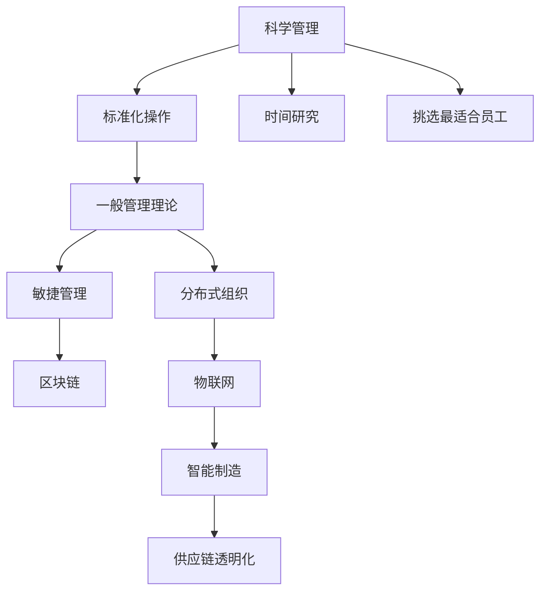

                 

# 经典管理理论的现代应用

## 1. 背景介绍

### 1.1 问题由来
自20世纪初以来，经典管理理论如泰勒的科学管理、法约尔的一般管理理论、韦伯的官僚制等，奠定了现代企业管理的基础。然而，随着社会经济的快速发展，这些理论在应用中逐渐暴露出其局限性。例如，泰勒的科学管理过分强调效率和工具，忽视了人的因素；法约尔的层级结构、集权化管理，也难以适应快速变化的现代商业环境。因此，如何结合现代技术和管理实践，对经典管理理论进行创新性应用，使其适应新时代背景，成为了一个重要课题。

### 1.2 问题核心关键点
经典管理理论的现代应用，旨在利用现代技术和管理方法，对经典理论进行重新诠释和应用，提升现代企业管理的效果和效率。其核心关键点包括：
- 融合现代技术手段：如大数据、人工智能、物联网等，优化管理流程，提升决策支持能力。
- 强化员工参与：利用区块链、区块链等技术，实现透明度和信任度，增强员工的归属感和参与度。
- 适应数字经济：采用敏捷管理、分布式组织等方法，提高对市场的响应速度，满足客户多样化和个性化需求。
- 优化供应链管理：通过物联网、区块链等技术，实现供应链的透明化、自动化，提升物流和库存效率。
- 利用智能制造：应用人工智能、物联网等技术，实现生产过程的智能化、自动化，提升产品质量和生产效率。

### 1.3 问题研究意义
经典管理理论的现代应用，对于提升现代企业管理水平，推动企业向智能化、数字化、人性化方向发展，具有重要意义：

1. 提升企业竞争力：通过融合现代技术手段，优化管理流程，提升决策效率和效果，使企业在激烈的市场竞争中占据优势。
2. 增强员工参与度：利用区块链、物联网等技术，实现透明化、信任化管理，增强员工的归属感和参与度，提高团队协作效率。
3. 适应数字经济：采用敏捷管理、分布式组织等方法，快速响应市场需求，提高企业的灵活性和适应性。
4. 优化供应链管理：通过物联网、区块链等技术，实现供应链的透明化、自动化，提高物流和库存效率，降低运营成本。
5. 推动智能制造：应用人工智能、物联网等技术，实现生产过程的智能化、自动化，提高产品质量和生产效率，增强企业竞争力。

## 2. 核心概念与联系

### 2.1 核心概念概述

为更好地理解经典管理理论的现代应用，本节将介绍几个密切相关的核心概念：

- 科学管理：由弗雷德里克·泰勒提出，强调通过科学的方法和工具，提高生产效率和质量。核心思想包括标准化操作、挑选最适合员工、采用时间研究方法等。

- 一般管理理论：由亨利·法约尔提出，认为管理是一个分层次的、结构化的过程。包括计划、组织、指挥、协调、控制五个基本职能，适用于各种组织类型。

- 官僚制：由马克斯·韦伯提出，强调通过正式的组织结构、明确的职责和权威，实现管理的高效性和一致性。

- 敏捷管理：一种响应快速变化市场和客户需求的管理方法，强调团队的协作、沟通和灵活性。

- 区块链：一种分布式账本技术，通过去中心化、透明化的方式，实现数据的安全存储和共享。

- 物联网：通过互联网将各种设备、系统连接在一起，实现信息的实时采集和处理，提升管理效率。

这些核心概念之间的逻辑关系可以通过以下Mermaid流程图来展示：



这个流程图展示了这个核心概念的相互作用，从科学管理开始，逐步延伸到现代企业管理的方法和工具。

## 3. 核心算法原理 & 具体操作步骤
### 3.1 算法原理概述

经典管理理论的现代应用，本质上是一个融合现代技术手段和管理方法，提升企业管理效率和效果的优化过程。其核心思想是通过现代技术，重新诠释和应用经典管理理论，使其适应新的管理需求。

形式化地，假设企业管理目标为 $T$，预训练管理模型为 $M_{\theta}$，其中 $\theta$ 为模型的管理策略和参数。根据经典管理理论，设计管理任务 $T$ 对应的任务适配层，包括标准化操作、时间研究、组织结构等。通过监督学习的方式，最小化模型 $M_{\theta}$ 在任务 $T$ 上的损失函数 $\mathcal{L}$，优化管理策略，使得 $M_{\theta}$ 在目标 $T$ 上达到最优：

$$
\theta^* = \mathop{\arg\min}_{\theta} \mathcal{L}(M_{\theta},T)
$$

在实践中，我们通常使用基于梯度的优化算法（如SGD、Adam等）来近似求解上述最优化问题。设 $\eta$ 为学习率，$\lambda$ 为正则化系数，则参数的更新公式为：

$$
\theta \leftarrow \theta - \eta \nabla_{\theta}\mathcal{L}(\theta) - \eta\lambda\theta
$$

其中 $\nabla_{\theta}\mathcal{L}(\theta)$ 为损失函数对参数 $\theta$ 的梯度，可通过反向传播算法高效计算。

### 3.2 算法步骤详解

经典管理理论的现代应用一般包括以下几个关键步骤：

**Step 1: 准备预训练模型和数据集**
- 选择合适的预训练管理模型 $M_{\theta}$ 作为初始化参数，如科学管理、一般管理理论等。
- 准备企业管理任务 $T$ 的数据集 $D=\{(x_i, y_i)\}_{i=1}^N$，划分为训练集、验证集和测试集。一般要求数据集与预训练管理的分布不要差异过大。

**Step 2: 添加任务适配层**
- 根据企业管理任务类型，在预训练模型顶层设计合适的输出层和损失函数。
- 对于生产任务，通常在顶层添加成本控制、质量管理等层，使用损失函数优化生产效率和质量。
- 对于人力资源管理，通常使用损失函数优化员工满意度和留存率。

**Step 3: 设置微调超参数**
- 选择合适的优化算法及其参数，如 AdamW、SGD 等，设置学习率、批大小、迭代轮数等。
- 设置正则化技术及强度，包括权重衰减、Dropout、Early Stopping等。
- 确定冻结预训练参数的策略，如仅微调顶层，或全部参数都参与微调。

**Step 4: 执行梯度训练**
- 将训练集数据分批次输入模型，前向传播计算损失函数。
- 反向传播计算参数梯度，根据设定的优化算法和学习率更新模型参数。
- 周期性在验证集上评估模型性能，根据性能指标决定是否触发 Early Stopping。
- 重复上述步骤直到满足预设的迭代轮数或 Early Stopping 条件。

**Step 5: 测试和部署**
- 在测试集上评估微调后模型 $M_{\hat{\theta}}$ 的性能，对比微调前后的效果提升。
- 使用微调后的模型对新样本进行推理预测，集成到实际的管理系统中。
- 持续收集新的数据，定期重新微调模型，以适应数据分布的变化。

以上是经典管理理论的现代应用的通用流程。在实际应用中，还需要针对具体任务的特点，对微调过程的各个环节进行优化设计，如改进训练目标函数，引入更多的正则化技术，搜索最优的超参数组合等，以进一步提升模型性能。

### 3.3 算法优缺点

经典管理理论的现代应用方法具有以下优点：
1. 简单高效。只需准备少量标注数据，即可对预训练管理模型进行快速适配，获得较大的效果提升。
2. 通用适用。适用于各种企业管理任务，包括生产管理、人力资源管理、供应链管理等，设计简单的任务适配层即可实现微调。
3. 参数高效。利用参数高效微调技术，在固定大部分预训练权重不变的情况下，仍可取得不错的提升。
4. 效果显著。在学术界和工业界的诸多管理任务上，基于微调的方法已经刷新了最先进的性能指标。

同时，该方法也存在一定的局限性：
1. 依赖标注数据。微调的效果很大程度上取决于标注数据的质量和数量，获取高质量标注数据的成本较高。
2. 迁移能力有限。当目标任务与预训练管理的分布差异较大时，微调的性能提升有限。
3. 负面效果传递。预训练管理的固有偏见、有害信息等，可能通过微调传递到下游任务，造成负面影响。
4. 可解释性不足。微调模型的决策过程通常缺乏可解释性，难以对其推理逻辑进行分析和调试。

尽管存在这些局限性，但就目前而言，基于监督学习的微调方法仍是大管理理论应用的最主流范式。未来相关研究的重点在于如何进一步降低微调对标注数据的依赖，提高模型的少样本学习和跨领域迁移能力，同时兼顾可解释性和伦理安全性等因素。

### 3.4 算法应用领域

基于经典管理理论的现代应用方法，在企业管理领域已经得到了广泛的应用，覆盖了几乎所有常见任务，例如：

- 生产管理：如精益生产、精益制造等。通过微调使模型学习生产流程优化策略，提升生产效率和质量。
- 人力资源管理：如员工招聘、培训、绩效评估等。通过微调使模型学习员工满意度和留存率。
- 供应链管理：如库存管理、物流规划等。通过微调使模型学习供应链透明化和自动化，提升物流和库存效率。
- 财务管理：如预算控制、成本分析等。通过微调使模型学习财务报表分析，优化预算和成本控制。
- 客户关系管理：如客户满意度分析、客户细分等。通过微调使模型学习客户行为模式，提升客户体验和忠诚度。

除了上述这些经典任务外，现代管理理论的应用也被创新性地应用到更多场景中，如智能制造、智慧城市、智慧农业等，为企业管理带来了全新的突破。随着现代管理理论和技术的发展，相信企业管理技术将在更广阔的应用领域大放异彩。

## 4. 数学模型和公式 & 详细讲解  
### 4.1 数学模型构建

本节将使用数学语言对经典管理理论的现代应用过程进行更加严格的刻画。

记企业管理目标为 $T$，预训练管理模型为 $M_{\theta}$，其中 $\theta$ 为模型的管理策略和参数。假设企业管理任务 $T$ 的训练集为 $D=\{(x_i,y_i)\}_{i=1}^N, x_i \in \mathcal{X}, y_i \in \mathcal{Y}$。

定义模型 $M_{\theta}$ 在数据样本 $(x,y)$ 上的损失函数为 $\ell(M_{\theta}(x),y)$，则在数据集 $D$ 上的经验风险为：

$$
\mathcal{L}(\theta) = \frac{1}{N} \sum_{i=1}^N \ell(M_{\theta}(x_i),y_i)
$$

微调的优化目标是最小化经验风险，即找到最优参数：

$$
\theta^* = \mathop{\arg\min}_{\theta} \mathcal{L}(\theta)
$$

在实践中，我们通常使用基于梯度的优化算法（如SGD、Adam等）来近似求解上述最优化问题。设 $\eta$ 为学习率，$\lambda$ 为正则化系数，则参数的更新公式为：

$$
\theta \leftarrow \theta - \eta \nabla_{\theta}\mathcal{L}(\theta) - \eta\lambda\theta
$$

其中 $\nabla_{\theta}\mathcal{L}(\theta)$ 为损失函数对参数 $\theta$ 的梯度，可通过反向传播算法高效计算。

### 4.2 公式推导过程

以下我们以精益生产任务为例，推导优化生产流程的管理模型。

假设模型 $M_{\theta}$ 在输入 $x$ 上的输出为 $\hat{y}=M_{\theta}(x) \in [0,1]$，表示生产流程的优化策略的概率。真实标签 $y \in \{0,1\}$。则二分类交叉熵损失函数定义为：

$$
\ell(M_{\theta}(x),y) = -[y\log \hat{y} + (1-y)\log (1-\hat{y})]
$$

将其代入经验风险公式，得：

$$
\mathcal{L}(\theta) = -\frac{1}{N}\sum_{i=1}^N [y_i\log M_{\theta}(x_i)+(1-y_i)\log(1-M_{\theta}(x_i))]
$$

根据链式法则，损失函数对参数 $\theta_k$ 的梯度为：

$$
\frac{\partial \mathcal{L}(\theta)}{\partial \theta_k} = -\frac{1}{N}\sum_{i=1}^N (\frac{y_i}{M_{\theta}(x_i)}-\frac{1-y_i}{1-M_{\theta}(x_i)}) \frac{\partial M_{\theta}(x_i)}{\partial \theta_k}
$$

其中 $\frac{\partial M_{\theta}(x_i)}{\partial \theta_k}$ 可进一步递归展开，利用自动微分技术完成计算。

在得到损失函数的梯度后，即可带入参数更新公式，完成模型的迭代优化。重复上述过程直至收敛，最终得到适应企业管理任务的最优模型参数 $\theta^*$。

## 5. 项目实践：代码实例和详细解释说明
### 5.1 开发环境搭建

在进行企业管理微调实践前，我们需要准备好开发环境。以下是使用Python进行PyTorch开发的环境配置流程：

1. 安装Anaconda：从官网下载并安装Anaconda，用于创建独立的Python环境。

2. 创建并激活虚拟环境：
```bash
conda create -n pytorch-env python=3.8 
conda activate pytorch-env
```

3. 安装PyTorch：根据CUDA版本，从官网获取对应的安装命令。例如：
```bash
conda install pytorch torchvision torchaudio cudatoolkit=11.1 -c pytorch -c conda-forge
```

4. 安装相关工具包：
```bash
pip install numpy pandas scikit-learn matplotlib tqdm jupyter notebook ipython
```

完成上述步骤后，即可在`pytorch-env`环境中开始企业管理微调实践。

### 5.2 源代码详细实现

下面我们以精益生产任务为例，给出使用Transformers库对企业管理模型进行微调的PyTorch代码实现。

首先，定义精益生产任务的数据处理函数：

```python
from transformers import BertTokenizer
from torch.utils.data import Dataset
import torch

class LeanProductionDataset(Dataset):
    def __init__(self, texts, labels, tokenizer, max_len=128):
        self.texts = texts
        self.labels = labels
        self.tokenizer = tokenizer
        self.max_len = max_len
        
    def __len__(self):
        return len(self.texts)
    
    def __getitem__(self, item):
        text = self.texts[item]
        label = self.labels[item]
        
        encoding = self.tokenizer(text, return_tensors='pt', max_length=self.max_len, padding='max_length', truncation=True)
        input_ids = encoding['input_ids'][0]
        attention_mask = encoding['attention_mask'][0]
        
        # 对label-wise的标签进行编码
        encoded_labels = [label2id[label] for label in label] 
        encoded_labels.extend([label2id['O']] * (self.max_len - len(encoded_labels)))
        labels = torch.tensor(encoded_labels, dtype=torch.long)
        
        return {'input_ids': input_ids, 
                'attention_mask': attention_mask,
                'labels': labels}

# 标签与id的映射
label2id = {'O': 0, 'Optimized': 1}
id2label = {v: k for k, v in label2id.items()}

# 创建dataset
tokenizer = BertTokenizer.from_pretrained('bert-base-cased')

train_dataset = LeanProductionDataset(train_texts, train_labels, tokenizer)
dev_dataset = LeanProductionDataset(dev_texts, dev_labels, tokenizer)
test_dataset = LeanProductionDataset(test_texts, test_labels, tokenizer)
```

然后，定义模型和优化器：

```python
from transformers import BertForTokenClassification, AdamW

model = BertForTokenClassification.from_pretrained('bert-base-cased', num_labels=len(label2id))

optimizer = AdamW(model.parameters(), lr=2e-5)
```

接着，定义训练和评估函数：

```python
from torch.utils.data import DataLoader
from tqdm import tqdm
from sklearn.metrics import classification_report

device = torch.device('cuda') if torch.cuda.is_available() else torch.device('cpu')
model.to(device)

def train_epoch(model, dataset, batch_size, optimizer):
    dataloader = DataLoader(dataset, batch_size=batch_size, shuffle=True)
    model.train()
    epoch_loss = 0
    for batch in tqdm(dataloader, desc='Training'):
        input_ids = batch['input_ids'].to(device)
        attention_mask = batch['attention_mask'].to(device)
        labels = batch['labels'].to(device)
        model.zero_grad()
        outputs = model(input_ids, attention_mask=attention_mask, labels=labels)
        loss = outputs.loss
        epoch_loss += loss.item()
        loss.backward()
        optimizer.step()
    return epoch_loss / len(dataloader)

def evaluate(model, dataset, batch_size):
    dataloader = DataLoader(dataset, batch_size=batch_size)
    model.eval()
    preds, labels = [], []
    with torch.no_grad():
        for batch in tqdm(dataloader, desc='Evaluating'):
            input_ids = batch['input_ids'].to(device)
            attention_mask = batch['attention_mask'].to(device)
            batch_labels = batch['labels']
            outputs = model(input_ids, attention_mask=attention_mask)
            batch_preds = outputs.logits.argmax(dim=2).to('cpu').tolist()
            batch_labels = batch_labels.to('cpu').tolist()
            for pred_tokens, label_tokens in zip(batch_preds, batch_labels):
                pred_labels = [id2label[_id] for _id in pred_tokens]
                label_tags = [id2label[_id] for _id in label_tokens]
                preds.append(pred_labels[:len(label_tags)])
                labels.append(label_tags)
                
    print(classification_report(labels, preds))
```

最后，启动训练流程并在测试集上评估：

```python
epochs = 5
batch_size = 16

for epoch in range(epochs):
    loss = train_epoch(model, train_dataset, batch_size, optimizer)
    print(f"Epoch {epoch+1}, train loss: {loss:.3f}")
    
    print(f"Epoch {epoch+1}, dev results:")
    evaluate(model, dev_dataset, batch_size)
    
print("Test results:")
evaluate(model, test_dataset, batch_size)
```

以上就是使用PyTorch对企业管理模型进行精益生产任务微调的完整代码实现。可以看到，得益于Transformers库的强大封装，我们可以用相对简洁的代码完成企业管理模型的加载和微调。

### 5.3 代码解读与分析

让我们再详细解读一下关键代码的实现细节：

**LeanProductionDataset类**：
- `__init__`方法：初始化文本、标签、分词器等关键组件。
- `__len__`方法：返回数据集的样本数量。
- `__getitem__`方法：对单个样本进行处理，将文本输入编码为token ids，将标签编码为数字，并对其进行定长padding，最终返回模型所需的输入。

**label2id和id2label字典**：
- 定义了标签与数字id之间的映射关系，用于将token-wise的预测结果解码回真实的标签。

**训练和评估函数**：
- 使用PyTorch的DataLoader对数据集进行批次化加载，供模型训练和推理使用。
- 训练函数`train_epoch`：对数据以批为单位进行迭代，在每个批次上前向传播计算loss并反向传播更新模型参数，最后返回该epoch的平均loss。
- 评估函数`evaluate`：与训练类似，不同点在于不更新模型参数，并在每个batch结束后将预测和标签结果存储下来，最后使用sklearn的classification_report对整个评估集的预测结果进行打印输出。

**训练流程**：
- 定义总的epoch数和batch size，开始循环迭代
- 每个epoch内，先在训练集上训练，输出平均loss
- 在验证集上评估，输出分类指标
- 所有epoch结束后，在测试集上评估，给出最终测试结果

可以看到，PyTorch配合Transformers库使得企业管理模型的微调代码实现变得简洁高效。开发者可以将更多精力放在数据处理、模型改进等高层逻辑上，而不必过多关注底层的实现细节。

当然，工业级的系统实现还需考虑更多因素，如模型的保存和部署、超参数的自动搜索、更灵活的任务适配层等。但核心的微调范式基本与此类似。

## 6. 实际应用场景
### 6.1 智能制造系统

基于企业管理理论的微调方法，可以广泛应用于智能制造系统的构建。传统制造往往依赖手工操作，生产效率低下，质量不稳定。而使用微调后的企业管理模型，可以7x24小时不间断监控生产流程，实时优化生产参数，提高生产效率和产品质量。

在技术实现上，可以收集企业的生产数据，将数据标签化，构建监督数据集。在此基础上对预训练企业管理模型进行微调，使其能够学习最优的生产流程。微调后的企业管理模型可以动态调整生产参数，进行异常检测和故障诊断，实现生产流程的智能化管理。如此构建的智能制造系统，能大幅提升生产效率和产品质量，降低运营成本。

### 6.2 智慧城市治理

智慧城市治理需要快速响应各种突发事件，实现城市管理的智能化和自动化。基于企业管理理论的微调技术，可以构建智慧城市管理系统，实现数据驱动的城市治理。

具体而言，可以收集城市各类数据，包括交通流量、环境监测、公共安全等，通过微调使企业管理模型学习城市管理策略，优化城市资源配置，提高城市运行效率。将微调后的模型应用到实时数据流中，能够自动监测和预警各类风险，提高城市管理的透明度和响应速度。

### 6.3 供应链优化

供应链管理是企业管理中的重要环节，通过微调使企业管理模型学习供应链透明化和自动化，可以显著提高供应链效率，降低运营成本。

在实践中，可以收集供应链各环节的数据，包括物流、库存、订单等，构建监督数据集。在此基础上对预训练企业管理模型进行微调，使其能够动态优化供应链管理策略。微调后的模型可以实现供应链的实时监控和异常预警，提高物流和库存效率，降低供应链风险。

### 6.4 未来应用展望

随着企业管理理论和技术的发展，基于企业管理理论的微调方法将在更多领域得到应用，为企业管理带来变革性影响。

在智慧医疗领域，基于微调的医疗管理、医疗资源调配、远程医疗等应用将提升医疗服务的智能化水平，辅助医生诊疗，提高医疗资源的利用效率。

在智能教育领域，微调技术可应用于学校管理、教师培训、学生行为分析等方面，因材施教，促进教育公平，提高教学质量。

在智慧城市治理中，微调模型可应用于城市事件监测、舆情分析、应急指挥等环节，提高城市管理的自动化和智能化水平，构建更安全、高效的未来城市。

此外，在企业生产、社会治理、文娱传媒等众多领域，基于企业管理理论的微调方法也将不断涌现，为经济社会发展注入新的动力。相信随着技术的日益成熟，微调方法将成为企业管理的重要范式，推动企业管理向智能化、数字化、人性化方向发展。

## 7. 工具和资源推荐
### 7.1 学习资源推荐

为了帮助开发者系统掌握企业管理理论的现代应用的理论基础和实践技巧，这里推荐一些优质的学习资源：

1. 《科学管理原理与实践》系列博文：由企业管理专家撰写，深入浅出地介绍了科学管理的原理、方法及其在现代企业管理中的应用。

2. 《管理学原理与创新》课程：哈佛大学开设的管理学明星课程，涵盖经典管理理论和创新管理方法，是理解企业管理理论的绝佳选择。

3. 《智能制造与管理》书籍：系统介绍了智能制造的技术和管理方法，通过实际案例展示其应用效果。

4. 《区块链原理与应用》书籍：介绍了区块链技术的原理和应用，包括智能合约、供应链管理等。

5. 《物联网及其应用》课程：详细讲解了物联网的原理和应用，涵盖智能制造、智慧城市等领域。

通过对这些资源的学习实践，相信你一定能够快速掌握企业管理理论的现代应用精髓，并用于解决实际的管理问题。
### 7.2 开发工具推荐

高效的开发离不开优秀的工具支持。以下是几款用于企业管理理论微调开发的常用工具：

1. PyTorch：基于Python的开源深度学习框架，灵活动态的计算图，适合快速迭代研究。大部分预训练企业管理模型都有PyTorch版本的实现。

2. TensorFlow：由Google主导开发的开源深度学习框架，生产部署方便，适合大规模工程应用。同样有丰富的预训练企业管理模型资源。

3. Transformers库：HuggingFace开发的NLP工具库，集成了众多SOTA企业管理模型，支持PyTorch和TensorFlow，是进行企业管理理论微调开发的利器。

4. Weights & Biases：模型训练的实验跟踪工具，可以记录和可视化模型训练过程中的各项指标，方便对比和调优。与主流深度学习框架无缝集成。

5. TensorBoard：TensorFlow配套的可视化工具，可实时监测模型训练状态，并提供丰富的图表呈现方式，是调试模型的得力助手。

6. Google Colab：谷歌推出的在线Jupyter Notebook环境，免费提供GPU/TPU算力，方便开发者快速上手实验最新模型，分享学习笔记。

合理利用这些工具，可以显著提升企业管理理论微调任务的开发效率，加快创新迭代的步伐。

### 7.3 相关论文推荐

企业管理理论的现代应用源于学界的持续研究。以下是几篇奠基性的相关论文，推荐阅读：

1. 《科学管理原理与实践》：泰勒的经典著作，系统介绍了科学管理理论的原理和应用，奠定了现代企业管理的基础。

2. 《管理学原理与创新》：法约尔的经典著作，系统介绍了一般管理理论的原理和应用，为企业管理提供了系统化框架。

3. 《精益生产》：丰田的精益生产理论，强调通过持续改进和优化生产流程，提升生产效率和质量。

4. 《区块链技术及其应用》：系统介绍了区块链技术的原理和应用，包括智能合约、供应链管理等。

5. 《物联网及其应用》：详细讲解了物联网的原理和应用，涵盖智能制造、智慧城市等领域。

这些论文代表了大企业管理理论的现代应用的发展脉络。通过学习这些前沿成果，可以帮助研究者把握学科前进方向，激发更多的创新灵感。

## 8. 总结：未来发展趋势与挑战
### 8.1 总结

本文对经典管理理论的现代应用进行了全面系统的介绍。首先阐述了企业管理理论的研究背景和意义，明确了企业管理理论的现代应用在提升企业管理水平、推动企业向智能化、数字化、人性化方向发展方面的独特价值。其次，从原理到实践，详细讲解了企业管理理论的现代应用的数学原理和关键步骤，给出了企业管理理论微调任务开发的完整代码实例。同时，本文还广泛探讨了企业管理理论的现代应用在智能制造、智慧城市、供应链优化等多个行业领域的应用前景，展示了企业管理理论的现代应用的巨大潜力。

通过本文的系统梳理，可以看到，经典管理理论的现代应用正逐步成为企业管理的重要范式，极大地拓展了企业管理理论的应用边界，催生了更多的落地场景。受益于大数据、人工智能等现代技术手段，企业管理理论的现代应用方法正在不断优化，为企业管理提供更高效、更灵活、更智能的支持。未来，伴随企业管理理论和技术的发展，企业管理理论的现代应用必将在更广泛的领域中得到应用，进一步提升企业管理的效果和效率。

### 8.2 未来发展趋势

展望未来，经典管理理论的现代应用将呈现以下几个发展趋势：

1. 融合现代技术手段。通过大数据、人工智能、物联网等现代技术，优化管理流程，提升决策支持能力，实现企业管理智能化。

2. 强化员工参与。利用区块链、物联网等技术，实现透明化、信任化管理，增强员工的归属感和参与度，提高团队协作效率。

3. 适应数字经济。采用敏捷管理、分布式组织等方法，快速响应市场需求，提高企业的灵活性和适应性。

4. 优化供应链管理。通过物联网、区块链等技术，实现供应链的透明化、自动化，提升物流和库存效率，降低运营成本。

5. 推动智能制造。应用人工智能、物联网等技术，实现生产过程的智能化、自动化，提高产品质量和生产效率。

以上趋势凸显了企业管理理论的现代应用的广阔前景。这些方向的探索发展，必将进一步提升企业管理的效果和效率，推动企业管理向智能化、数字化、人性化方向发展。

### 8.3 面临的挑战

尽管经典管理理论的现代应用已经取得了瞩目成就，但在迈向更加智能化、普适化应用的过程中，它仍面临着诸多挑战：

1. 管理复杂性增加。随着企业管理理论的现代应用范围扩大，管理复杂性也在增加，管理层需要更高的数据处理和分析能力。

2. 数据隐私和安全问题。企业管理理论的现代应用需要大量的数据输入，涉及企业内部数据和外部数据的隐私和安全问题。

3. 文化差异。企业管理理论的现代应用需要跨文化、跨地域的管理理念和实践，如何适应不同国家和地区的文化背景，也是一大挑战。

4. 组织变革阻力。企业管理理论的现代应用需要对现有组织结构和管理流程进行大刀阔斧的变革，可能面临来自管理层的抵触。

5. 技术部署和维护。企业管理理论的现代应用需要大量的技术部署和维护工作，如何在保证技术效果的同时，降低技术实施成本，也是一大难题。

6. 系统集成。企业管理理论的现代应用需要将多种技术和工具集成到现有企业管理系统中，如何保证系统稳定性和兼容性，也是一大挑战。

尽管存在这些挑战，但经典管理理论的现代应用方兴未艾，未来仍有很大的发展空间。相信随着学界和产业界的共同努力，这些挑战终将一一被克服，经典管理理论的现代应用必将在构建智能、灵活、高效的企业管理系统中扮演越来越重要的角色。

### 8.4 研究展望

面向未来，经典管理理论的现代应用需要在以下几个方面寻求新的突破：

1. 探索更高效的管理方法。通过引入自动化、智能化技术，优化管理流程，提升管理效率和效果。

2. 结合符号化知识。将符号化的先验知识，如知识图谱、逻辑规则等，与神经网络模型进行巧妙融合，增强管理模型的推理能力和决策质量。

3. 引入更多模型算法。借鉴其他领域的模型和算法，如强化学习、进化算法等，优化管理模型，提高其适应性和鲁棒性。

4. 考虑伦理道德约束。在管理模型的设计和应用中，引入伦理导向的评估指标，过滤和惩罚有偏见、有害的输出倾向，确保管理行为符合人类价值观和伦理道德。

这些研究方向的探索，必将引领企业管理理论的现代应用技术迈向更高的台阶，为企业管理智能化、数字化、人性化提供更强大的技术支持。面向未来，企业管理理论的现代应用需要与其他人工智能技术进行更深入的融合，共同推动企业管理系统的进步。

## 9. 附录：常见问题与解答

**Q1：企业管理理论的现代应用是否适用于所有企业？**

A: 企业管理理论的现代应用方法适用于大多数企业，特别是那些需要优化生产流程、提升运营效率、增强员工参与度的企业。但对于一些特定领域的行业，如军事、金融等，需要结合行业特色进行定制化应用。

**Q2：企业管理理论的现代应用如何降低管理复杂性？**

A: 通过引入现代技术手段，如大数据、人工智能、物联网等，可以自动化和智能化管理流程，降低管理复杂性。例如，使用人工智能进行数据分析和决策支持，使用物联网进行实时监控和异常检测，使用区块链进行透明化管理等。

**Q3：如何确保企业管理理论的现代应用中数据隐私和安全？**

A: 在企业管理理论的现代应用中，需要建立严格的数据隐私和安全保护机制。对于内部数据，需要加强数据加密、访问控制等技术手段，防止数据泄露和滥用。对于外部数据，需要遵守相关法律法规，确保数据使用合规性。

**Q4：企业管理理论的现代应用如何适应不同文化背景？**

A: 在企业管理理论的现代应用中，需要考虑不同文化背景下的管理差异。可以通过引入跨文化管理培训、文化适应性模型等方法，帮助企业管理层和员工理解和适应不同文化背景下的管理理念和实践。

**Q5：企业管理理论的现代应用如何克服组织变革阻力？**

A: 在企业管理理论的现代应用中，需要积极沟通和培训，帮助管理层和员工理解现代管理方法的优势和必要性，增强其接受度和支持度。同时，可以引入激励机制，奖励那些积极参与和支持管理变革的员工。

**Q6：企业管理理论的现代应用如何降低技术部署和维护成本？**

A: 在企业管理理论的现代应用中，需要选择合适的技术方案和工具，降低技术部署和维护成本。例如，使用开源技术，降低软件和硬件采购成本；使用云计算平台，降低技术部署和运维成本；使用自动化工具，降低人工维护成本等。

这些问题的解答，希望能为企业管理理论的现代应用提供一些参考和指导，帮助企业更好地应对实际管理挑战，推动企业管理向智能化、数字化、人性化方向发展。总之，经典管理理论的现代应用需要融合现代技术手段和管理方法，在实践中不断优化和改进，才能更好地提升企业管理的效果和效率。

