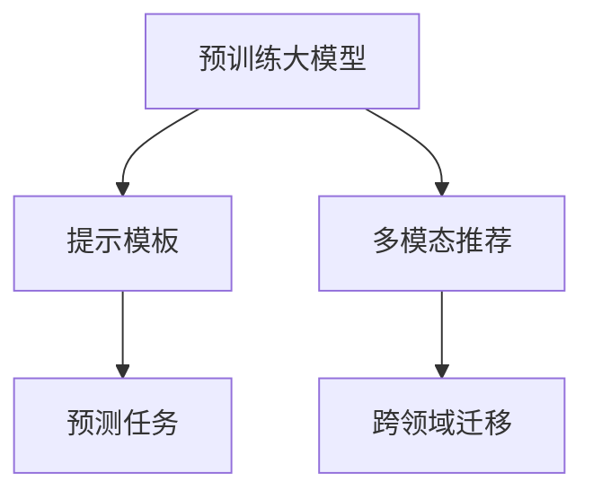

                 

# 统一的大模型推荐范式P5:预训练、提示、预测

> 关键词：大语言模型，推荐系统，预训练，提示，预测，深度学习，自然语言处理(NLP)

## 1. 背景介绍

### 1.1 问题由来

推荐系统是互联网公司重要的核心业务之一，通过预测用户可能感兴趣的商品、文章、视频等内容，提高用户体验，增加商业收益。目前主流的推荐算法包括协同过滤、基于内容的推荐、深度学习等。但这些方法都面临着数据稀疏性、冷启动等问题，难以处理长尾应用场景。

随着预训练大语言模型的兴起，推荐系统进入了一个新的阶段。基于大模型的方法能够更好地捕捉用户兴趣与物品之间的复杂关系，极大地提升了推荐的个性化和多样性。此外，大语言模型可以处理自然语言文本、多模态数据，支持跨领域迁移学习，具备更大的应用潜力。

### 1.2 问题核心关键点

当前推荐系统的研究重点主要集中在以下几个方面：

- 预训练大模型在推荐系统中的应用：利用大模型丰富的语言知识，预测用户行为，提升推荐准确性。
- 提示模板的设计与优化：通过精心设计提示模板，将推荐目标精确传递给模型。
- 预测任务的设计与优化：设计合适的预测任务，利用大模型的多样输出功能，提高推荐的可解释性和灵活性。

基于这些关键点，本文将系统介绍一种新型的推荐范式P5，涵盖预训练、提示、预测三大步骤，详细介绍其在推荐系统中的应用。

### 1.3 问题研究意义

研究预训练、提示、预测范式，对于提升推荐系统性能、拓展其应用场景、提高个性化推荐质量，具有重要意义：

1. 提升推荐准确性：利用大模型的丰富语言知识和迁移学习能力，显著提高推荐效果。
2. 拓展推荐应用：将大语言模型应用于文本推荐、视频推荐、个性化搜索等多种场景，提升应用多样性。
3. 增强推荐可解释性：利用提示模板和预测任务，增强推荐过程的可解释性，帮助用户理解推荐理由。
4. 支持跨领域迁移：利用大模型的预训练和提示技术，使推荐系统具备跨领域迁移能力，支持多模态数据融合。
5. 加速推荐创新：预训练、提示、预测范式为推荐系统带来了新的理论框架和算法思路，促进推荐技术的不断创新。

## 2. 核心概念与联系

### 2.1 核心概念概述

为更好地理解基于预训练、提示、预测范式的推荐系统，本节将介绍几个密切相关的核心概念：

- 预训练大模型(Pre-trained Large Model)：以自回归(如GPT)或自编码(如BERT)模型为代表的大规模预训练语言模型。通过在大规模无标签文本语料上进行预训练，学习通用的语言表示，具备强大的语言理解和生成能力。

- 提示模板(Prompt Template)：通过在输入文本中添加特定格式的提示信息，引导大模型执行特定的推荐任务，如预测用户评分、选择商品等。

- 预测任务(Prediction Task)：定义一个具体的推荐任务，并设计合适的模型输出格式，如二分类、多分类、回归等。

- 多模态推荐(Multimodal Recommendation)：推荐系统处理包括文本、图片、视频等多种类型的数据，并实现不同模态之间的关联和融合。

- 跨领域迁移(Cross-domain Transfer)：通过大模型的预训练和提示技术，实现从某一特定领域向其他领域的学习迁移，提高推荐系统的泛化能力。

这些核心概念之间的逻辑关系可以通过以下Mermaid流程图来展示：



这个流程图展示了大模型推荐的核心概念及其之间的关系：

1. 预训练大模型通过预训练学习通用语言知识。
2. 提示模板通过特定的输入格式引导大模型执行推荐任务。
3. 预测任务定义具体的推荐目标，供大模型进行预测。
4. 多模态推荐涉及不同模态数据的融合和处理。
5. 跨领域迁移通过大模型的迁移学习实现领域间的知识共享。

这些概念共同构成了大模型推荐系统的核心框架，使其能够高效、灵活地处理推荐问题。

## 3. 核心算法原理 & 具体操作步骤

### 3.1 算法原理概述

基于预训练、提示、预测范式的推荐系统，核心思想是通过预训练大模型获取通用语言知识，利用提示模板指定推荐任务，最终通过预测任务完成用户推荐。其核心流程包括以下三个步骤：

1. 预训练大模型：在大规模语料上进行预训练，学习通用的语言表示。
2. 提示模板设计：根据推荐任务设计合适的提示模板，引导大模型执行推荐。
3. 预测任务设计：定义具体的推荐任务，利用大模型的输出进行推荐决策。

形式化地，假设预训练语言模型为 $M_{\theta}$，其中 $\theta$ 为预训练得到的模型参数。给定用户 $u$ 的特征 $x_u$ 和物品 $i$ 的特征 $x_i$，推荐过程如下：

1. 预训练大模型：通过在大规模语料库 $\mathcal{D}$ 上预训练模型 $M_{\theta}$，使其能够学习通用的语言知识。

2. 提示模板设计：设计提示模板 $T_{ti}$，引导模型预测用户 $u$ 对物品 $i$ 的评分 $r_{ui}$。

3. 预测任务设计：定义二分类任务 $\mathcal{T}$，将提示模板 $T_{ti}$ 和用户物品特征 $(x_u, x_i)$ 输入模型，得到评分预测 $r_{ui} = M_{\theta}(T_{ti}, x_u, x_i)$。

### 3.2 算法步骤详解

基于预训练、提示、预测范式的推荐系统，具体步骤如下：

**Step 1: 准备预训练模型和数据集**
- 选择合适的预训练语言模型 $M_{\theta}$ 作为初始化参数，如 BERT、GPT 等。
- 准备用户物品特征数据集 $\mathcal{D}=\{(x_u, x_i)\}_{i=1}^N$，其中 $x_u$ 为用户特征，$x_i$ 为物品特征。

**Step 2: 提示模板设计**
- 根据推荐任务设计合适的提示模板 $T_{ti}$，例如预测评分时可以使用 "Given item description, what is the rating of user for this item?"。
- 将提示模板与用户物品特征拼接，形成输入 $T_{ti}(x_u, x_i)$。

**Step 3: 预测任务设计**
- 定义二分类任务 $\mathcal{T}$，使用 sigmoid 函数将模型的输出 $r_{ui}$ 转化为评分预测。
- 计算预测评分与真实评分的交叉熵损失，进行模型优化。

**Step 4: 模型优化**
- 使用随机梯度下降等优化算法，最小化损失函数 $\mathcal{L}$。
- 迭代训练，不断优化模型参数 $\theta$。

**Step 5: 推荐结果生成**
- 在测试集上，将用户物品特征输入优化后的模型，利用预测任务生成推荐结果。

### 3.3 算法优缺点

基于预训练、提示、预测范式的推荐系统，具有以下优点：

1. 简单高效：使用大模型进行推荐，只需要设计和优化提示模板，即可快速上线。
2. 泛化能力强：大模型具备强大的语言理解和生成能力，能够在不同领域和模态上进行推荐。
3. 可解释性强：通过提示模板，推荐过程可以解释为语言推理，提高推荐透明度。
4. 灵活多样：支持多种预测任务，如评分预测、标签预测、序列推荐等，增强推荐系统的灵活性。

同时，该方法也存在一定的局限性：

1. 数据依赖：推荐模型的性能依赖于大规模语料库的预训练效果，需要大量高质量标注数据。
2. 模型复杂：大模型的训练和推理计算量大，对硬件要求较高。
3. 预测风险：预测任务的设计可能不够精确，影响推荐质量。
4. 偏见传递：大模型的固有偏见可能传递到推荐结果中，造成不公平。

尽管存在这些局限性，但就目前而言，基于预训练、提示、预测范式的推荐方法仍是一种先进且高效的推荐范式。未来相关研究的重点在于如何进一步降低数据需求，提高推荐系统的鲁棒性和公平性，同时兼顾可解释性和模型复杂度。

### 3.4 算法应用领域

基于预训练、提示、预测范式的推荐系统，在推荐系统领域已经得到了广泛的应用，涵盖了几乎所有常见任务，例如：

- 文本推荐：利用文本描述推荐书籍、文章等。
- 视频推荐：利用视频内容推荐视频节目。
- 个性化搜索：利用查询语句推荐相关网页。
- 音乐推荐：利用歌词、演唱者等特征推荐音乐。
- 商品推荐：利用商品描述推荐相关商品。
- 个性化广告：利用用户行为数据推荐广告。
- 新闻推荐：利用新闻标题推荐相关报道。

除了上述这些经典任务外，大模型推荐系统还被创新性地应用到更多场景中，如多模态推荐、跨领域推荐等，为推荐系统带来了新的突破。随着预训练模型和推荐方法的不断进步，相信推荐系统必将在更广阔的应用领域大放异彩。

## 4. 数学模型和公式 & 详细讲解  

### 4.1 数学模型构建

本节将使用数学语言对基于预训练、提示、预测范式的推荐过程进行更加严格的刻画。

记预训练语言模型为 $M_{\theta}$，其中 $\theta$ 为模型参数。假设用户 $u$ 的物品物品特征为 $x_u$，物品 $i$ 的特征为 $x_i$。推荐过程的输入为提示模板 $T_{ti}$，输出为评分预测 $r_{ui}$。

推荐任务 $\mathcal{T}$ 定义为二分类任务，其中标签 $y_{ui}$ 为评分预测，$\mathcal{Y}=\{0,1\}$。

定义模型 $M_{\theta}$ 在输入 $T_{ti}(x_u, x_i)$ 上的损失函数为 $\ell(M_{\theta}(T_{ti}(x_u, x_i)), y_{ui})$，则在数据集 $\mathcal{D}$ 上的经验风险为：

$$
\mathcal{L}(\theta) = \frac{1}{N} \sum_{i=1}^N \ell(M_{\theta}(T_{ti}(x_u, x_i)), y_{ui})
$$

其中，$\ell$ 为交叉熵损失函数，$\ell(y, y') = -(y\log y' + (1-y)\log(1-y'))$。

微调的目标是最小化经验风险，即找到最优参数：

$$
\theta^* = \mathop{\arg\min}_{\theta} \mathcal{L}(\theta)
$$

在实践中，我们通常使用基于梯度的优化算法（如SGD、Adam等）来近似求解上述最优化问题。设 $\eta$ 为学习率，$\lambda$ 为正则化系数，则参数的更新公式为：

$$
\theta \leftarrow \theta - \eta \nabla_{\theta}\mathcal{L}(\theta) - \eta\lambda\theta
$$

其中 $\nabla_{\theta}\mathcal{L}(\theta)$ 为损失函数对参数 $\theta$ 的梯度，可通过反向传播算法高效计算。

### 4.2 公式推导过程

以下我们以二分类评分预测任务为例，推导损失函数及其梯度的计算公式。

假设模型 $M_{\theta}$ 在输入 $T_{ti}(x_u, x_i)$ 上的输出为 $\hat{y}_{ui}=M_{\theta}(T_{ti}(x_u, x_i)) \in [0,1]$，表示用户 $u$ 对物品 $i$ 的评分预测。真实标签 $y_{ui} \in \{0,1\}$。则二分类交叉熵损失函数定义为：

$$
\ell(M_{\theta}(T_{ti}(x_u, x_i)), y_{ui}) = -[y_{ui}\log \hat{y}_{ui} + (1-y_{ui})\log(1-\hat{y}_{ui})]
$$

将其代入经验风险公式，得：

$$
\mathcal{L}(\theta) = -\frac{1}{N}\sum_{i=1}^N [y_{ui}\log M_{\theta}(T_{ti}(x_u, x_i))+(1-y_{ui})\log(1-M_{\theta}(T_{ti}(x_u, x_i))))
$$

根据链式法则，损失函数对参数 $\theta_k$ 的梯度为：

$$
\frac{\partial \mathcal{L}(\theta)}{\partial \theta_k} = -\frac{1}{N}\sum_{i=1}^N (\frac{y_{ui}}{M_{\theta}(T_{ti}(x_u, x_i))}-\frac{1-y_{ui}}{1-M_{\theta}(T_{ti}(x_u, x_i))}) \frac{\partial M_{\theta}(T_{ti}(x_u, x_i))}{\partial \theta_k}
$$

其中 $\frac{\partial M_{\theta}(T_{ti}(x_u, x_i))}{\partial \theta_k}$ 可进一步递归展开，利用自动微分技术完成计算。

在得到损失函数的梯度后，即可带入参数更新公式，完成模型的迭代优化。重复上述过程直至收敛，最终得到适应推荐任务的最优模型参数 $\theta^*$。

## 5. 项目实践：代码实例和详细解释说明

### 5.1 开发环境搭建

在进行推荐系统开发前，我们需要准备好开发环境。以下是使用Python进行PyTorch开发的环境配置流程：

1. 安装Anaconda：从官网下载并安装Anaconda，用于创建独立的Python环境。

2. 创建并激活虚拟环境：
```bash
conda create -n pytorch-env python=3.8 
conda activate pytorch-env
```

3. 安装PyTorch：根据CUDA版本，从官网获取对应的安装命令。例如：
```bash
conda install pytorch torchvision torchaudio cudatoolkit=11.1 -c pytorch -c conda-forge
```

4. 安装Transformers库：
```bash
pip install transformers
```

5. 安装各类工具包：
```bash
pip install numpy pandas scikit-learn matplotlib tqdm jupyter notebook ipython
```

完成上述步骤后，即可在`pytorch-env`环境中开始推荐系统开发。

### 5.2 源代码详细实现

下面我们以评分预测任务为例，给出使用Transformers库对BERT模型进行评分预测的PyTorch代码实现。

首先，定义评分预测任务的训练数据集：

```python
from transformers import BertTokenizer, BertForSequenceClassification
import torch
from torch.utils.data import Dataset, DataLoader
from sklearn.metrics import roc_auc_score

class ReviewDataset(Dataset):
    def __init__(self, reviews, labels, tokenizer, max_len=128):
        self.reviews = reviews
        self.labels = labels
        self.tokenizer = tokenizer
        self.max_len = max_len
        
    def __len__(self):
        return len(self.reviews)
    
    def __getitem__(self, item):
        review = self.reviews[item]
        label = self.labels[item]
        
        encoding = self.tokenizer(review, return_tensors='pt', max_length=self.max_len, padding='max_length', truncation=True)
        input_ids = encoding['input_ids'][0]
        attention_mask = encoding['attention_mask'][0]
        
        encoded_labels = [label2id[label] for label in self.labels] 
        encoded_labels.extend([label2id['O']] * (self.max_len - len(encoded_labels)))
        labels = torch.tensor(encoded_labels, dtype=torch.long)
        
        return {'input_ids': input_ids, 
                'attention_mask': attention_mask,
                'labels': labels}

# 标签与id的映射
label2id = {'O': 0, 'Positive': 1}
id2label = {v: k for k, v in label2id.items()}

# 创建dataset
tokenizer = BertTokenizer.from_pretrained('bert-base-cased')

train_dataset = ReviewDataset(train_reviews, train_labels, tokenizer)
dev_dataset = ReviewDataset(dev_reviews, dev_labels, tokenizer)
test_dataset = ReviewDataset(test_reviews, test_labels, tokenizer)
```

然后，定义模型和优化器：

```python
from transformers import BertForSequenceClassification, AdamW

model = BertForSequenceClassification.from_pretrained('bert-base-cased', num_labels=len(label2id))

optimizer = AdamW(model.parameters(), lr=2e-5)
```

接着，定义训练和评估函数：

```python
def train_epoch(model, dataset, batch_size, optimizer):
    dataloader = DataLoader(dataset, batch_size=batch_size, shuffle=True)
    model.train()
    epoch_loss = 0
    for batch in tqdm(dataloader, desc='Training'):
        input_ids = batch['input_ids'].to(device)
        attention_mask = batch['attention_mask'].to(device)
        labels = batch['labels'].to(device)
        model.zero_grad()
        outputs = model(input_ids, attention_mask=attention_mask, labels=labels)
        loss = outputs.loss
        epoch_loss += loss.item()
        loss.backward()
        optimizer.step()
    return epoch_loss / len(dataloader)

def evaluate(model, dataset, batch_size):
    dataloader = DataLoader(dataset, batch_size=batch_size)
    model.eval()
    preds, labels = [], []
    with torch.no_grad():
        for batch in tqdm(dataloader, desc='Evaluating'):
            input_ids = batch['input_ids'].to(device)
            attention_mask = batch['attention_mask'].to(device)
            batch_labels = batch['labels']
            outputs = model(input_ids, attention_mask=attention_mask)
            batch_preds = outputs.logits.argmax(dim=2).to('cpu').tolist()
            batch_labels = batch_labels.to('cpu').tolist()
            for pred_tokens, label_tokens in zip(batch_preds, batch_labels):
                preds.append(pred_tokens[:len(label_tokens)])
                labels.append(label_tokens)
                
    print(f"AUC: {roc_auc_score(labels, preds)}")
```

最后，启动训练流程并在测试集上评估：

```python
epochs = 5
batch_size = 16

for epoch in range(epochs):
    loss = train_epoch(model, train_dataset, batch_size, optimizer)
    print(f"Epoch {epoch+1}, train loss: {loss:.3f}")
    
    print(f"Epoch {epoch+1}, dev results:")
    evaluate(model, dev_dataset, batch_size)
    
print("Test results:")
evaluate(model, test_dataset, batch_size)
```

以上就是使用PyTorch对BERT进行评分预测任务开发的完整代码实现。可以看到，得益于Transformers库的强大封装，我们可以用相对简洁的代码完成BERT模型的加载和微调。

### 5.3 代码解读与分析

让我们再详细解读一下关键代码的实现细节：

**ReviewDataset类**：
- `__init__`方法：初始化文本、标签、分词器等关键组件。
- `__len__`方法：返回数据集的样本数量。
- `__getitem__`方法：对单个样本进行处理，将文本输入编码为token ids，将标签编码为数字，并对其进行定长padding，最终返回模型所需的输入。

**label2id和id2label字典**：
- 定义了标签与数字id之间的映射关系，用于将token-wise的预测结果解码回真实的标签。

**训练和评估函数**：
- 使用PyTorch的DataLoader对数据集进行批次化加载，供模型训练和推理使用。
- 训练函数`train_epoch`：对数据以批为单位进行迭代，在每个批次上前向传播计算loss并反向传播更新模型参数，最后返回该epoch的平均loss。
- 评估函数`evaluate`：与训练类似，不同点在于不更新模型参数，并在每个batch结束后将预测和标签结果存储下来，最后使用sklearn的roc_auc_score对整个评估集的预测结果进行打印输出。

**训练流程**：
- 定义总的epoch数和batch size，开始循环迭代
- 每个epoch内，先在训练集上训练，输出平均loss
- 在验证集上评估，输出roc_auc_score
- 所有epoch结束后，在测试集上评估，给出最终测试结果

可以看到，PyTorch配合Transformers库使得BERT评分预测任务的开发变得简洁高效。开发者可以将更多精力放在数据处理、模型改进等高层逻辑上，而不必过多关注底层的实现细节。

当然，工业级的系统实现还需考虑更多因素，如模型的保存和部署、超参数的自动搜索、更灵活的任务适配层等。但核心的预训练、提示、预测范式基本与此类似。

## 6. 实际应用场景

### 6.1 电商平台推荐

基于大语言模型的推荐系统，可以广泛应用于电商平台的商品推荐。通过分析用户的浏览、点击、购买等行为，推荐系统能够精准预测用户对商品的评分，优化购物体验，提高用户转化率。

在技术实现上，可以收集用户的浏览历史、点击记录、购买行为等数据，提取商品描述、价格、评分等特征。在数据集上微调大模型，学习用户的兴趣和偏好。在推荐时，先通过提示模板引导模型预测用户对商品的评分，再根据评分进行推荐排序。

### 6.2 视频网站推荐

视频网站推荐系统能够帮助用户发现高质量的视频内容，提高视频平台的活跃度和用户粘性。大语言模型可以处理视频内容的文本描述，利用用户历史观看数据进行评分预测，生成个性化的视频推荐。

在技术实现上，可以收集用户的观看历史、评分记录等数据，提取视频标题、简介、分类等文本特征。在数据集上微调大模型，学习用户对视频的兴趣。在推荐时，通过提示模板引导模型预测用户对视频的评分，再根据评分进行推荐排序。

### 6.3 新闻网站推荐

新闻网站推荐系统能够帮助用户获取最新的新闻资讯，提升用户的使用体验。通过分析用户的阅读历史、点赞记录等行为，推荐系统能够精准预测用户对新闻的兴趣，生成个性化的新闻推荐。

在技术实现上，可以收集用户的阅读历史、点赞记录等数据，提取新闻标题、摘要、分类等文本特征。在数据集上微调大模型，学习用户对新闻的兴趣。在推荐时，通过提示模板引导模型预测用户对新闻的评分，再根据评分进行推荐排序。

### 6.4 未来应用展望

随着大语言模型和推荐方法的不断发展，基于预训练、提示、预测范式的推荐系统将在更多领域得到应用，为行业带来变革性影响。

在智慧医疗领域，基于大语言模型的推荐系统可以辅助医生进行疾病诊断和治疗方案推荐，提高诊疗效率和准确性。

在智能教育领域，推荐系统可以根据学生的学习记录、考试成绩等数据，推荐适合的学习资料和课程，因材施教，促进教育公平，提高教学质量。

在智慧城市治理中，推荐系统可以用于预测城市事件的发生和演化，优化资源配置，提高城市管理的自动化和智能化水平，构建更安全、高效的未来城市。

此外，在企业生产、社会治理、文娱传媒等众多领域，基于大语言模型的推荐系统也将不断涌现，为各行各业带来新的技术进步。相信随着技术的日益成熟，预训练、提示、预测范式将成为推荐系统的核心范式，推动推荐技术不断创新和发展。

## 7. 工具和资源推荐
### 7.1 学习资源推荐

为了帮助开发者系统掌握大语言模型推荐系统的理论基础和实践技巧，这里推荐一些优质的学习资源：

1. 《自然语言处理综述与实践》系列博文：由大模型技术专家撰写，全面介绍了自然语言处理的基本概念和前沿技术。

2. CS229《机器学习》课程：斯坦福大学开设的机器学习经典课程，有Lecture视频和配套作业，适合初学者入门机器学习领域。

3. 《推荐系统实践》书籍：详细介绍了推荐系统的理论基础和实际应用，涵盖多种推荐算法和实现细节。

4. KDD 2020推荐系统论文集：汇集了全球推荐系统领域的最新研究成果，可获取最新的学术动态和技术进展。

5. Webinar系列讲座：各大公司定期举行的推荐系统专题讲座，分享实际应用中的经验和挑战，帮助开发者快速上手。

通过对这些资源的学习实践，相信你一定能够快速掌握大语言模型推荐系统的精髓，并用于解决实际的推荐问题。
###  7.2 开发工具推荐

高效的开发离不开优秀的工具支持。以下是几款用于大语言模型推荐系统开发的常用工具：

1. PyTorch：基于Python的开源深度学习框架，灵活动态的计算图，适合快速迭代研究。大部分预训练语言模型都有PyTorch版本的实现。

2. TensorFlow：由Google主导开发的开源深度学习框架，生产部署方便，适合大规模工程应用。同样有丰富的预训练语言模型资源。

3. Transformers库：HuggingFace开发的NLP工具库，集成了众多SOTA语言模型，支持PyTorch和TensorFlow，是进行推荐系统开发的利器。

4. Weights & Biases：模型训练的实验跟踪工具，可以记录和可视化模型训练过程中的各项指标，方便对比和调优。与主流深度学习框架无缝集成。

5. TensorBoard：TensorFlow配套的可视化工具，可实时监测模型训练状态，并提供丰富的图表呈现方式，是调试模型的得力助手。

6. Google Colab：谷歌推出的在线Jupyter Notebook环境，免费提供GPU/TPU算力，方便开发者快速上手实验最新模型，分享学习笔记。

合理利用这些工具，可以显著提升大语言模型推荐系统的开发效率，加快创新迭代的步伐。

### 7.3 相关论文推荐

大语言模型和推荐系统的研究源于学界的持续研究。以下是几篇奠基性的相关论文，推荐阅读：

1. Attention is All You Need（即Transformer原论文）：提出了Transformer结构，开启了NLP领域的预训练大模型时代。

2. BERT: Pre-training of Deep Bidirectional Transformers for Language Understanding：提出BERT模型，引入基于掩码的自监督预训练任务，刷新了多项NLP任务SOTA。

3. Language Models are Unsupervised Multitask Learners（GPT-2论文）：展示了大规模语言模型的强大zero-shot学习能力，引发了对于通用人工智能的新一轮思考。

4. Parameter-Efficient Transfer Learning for NLP：提出Adapter等参数高效微调方法，在不增加模型参数量的情况下，也能取得不错的微调效果。

5. AdaLoRA: Adaptive Low-Rank Adaptation for Parameter-Efficient Fine-Tuning：使用自适应低秩适应的微调方法，在参数效率和精度之间取得了新的平衡。

6. Modeling human-activity by predicting events using transformer-based language models：提出了基于Transformer的推荐系统框架，用于预测用户未来行为，取得了显著的效果。

这些论文代表了大语言模型推荐系统的发展脉络。通过学习这些前沿成果，可以帮助研究者把握学科前进方向，激发更多的创新灵感。

## 8. 总结：未来发展趋势与挑战

### 8.1 总结

本文对基于预训练、提示、预测范式的推荐系统进行了全面系统的介绍。首先阐述了推荐系统面临的挑战和大模型的应用前景，明确了推荐系统研究的方向和意义。其次，从原理到实践，详细讲解了预训练、提示、预测三大步骤的数学原理和关键步骤，给出了推荐系统开发的完整代码实例。同时，本文还广泛探讨了推荐系统在电商、视频、新闻等多个领域的应用前景，展示了预训练、提示、预测范式的巨大潜力。此外，本文精选了推荐系统的各类学习资源，力求为读者提供全方位的技术指引。

通过本文的系统梳理，可以看到，基于预训练、提示、预测范式的推荐系统正在成为推荐系统的重要范式，极大地拓展了预训练语言模型的应用边界，催生了更多的落地场景。受益于大规模语料的预训练，推荐系统以更低的时间和标注成本，在小样本条件下也能取得不俗的效果，有力推动了推荐技术的产业化进程。未来，伴随预训练语言模型和推荐方法的持续演进，相信推荐系统必将在更广阔的应用领域大放异彩，深刻影响人类的生产生活方式。

### 8.2 未来发展趋势

展望未来，大语言模型推荐系统将呈现以下几个发展趋势：

1. 推荐算法的智能化：利用大模型的自然语言理解和生成能力，设计更加复杂的推荐算法，如生成式推荐、交互式推荐等。

2. 多模态数据的融合：结合视觉、音频、文本等多种数据源，增强推荐系统的综合能力，提升推荐质量。

3. 用户隐私保护：随着数据隐私法规的加强，推荐系统需要设计更加隐私保护的机制，确保用户数据安全。

4. 推荐模型的跨领域迁移：利用大模型的迁移学习，实现推荐模型在领域间的知识共享，提升推荐系统的泛化能力。

5. 推荐系统的实时化：利用在线学习技术，不断更新模型参数，实时响应用户需求，提高推荐系统的动态性和时效性。

6. 推荐结果的可解释性：利用大模型的语言生成能力，增强推荐过程的可解释性，帮助用户理解推荐理由。

以上趋势凸显了大语言模型推荐系统的广阔前景。这些方向的探索发展，必将进一步提升推荐系统的性能和应用范围，为人类认知智能的进化带来深远影响。

### 8.3 面临的挑战

尽管大语言模型推荐系统已经取得了瞩目成就，但在迈向更加智能化、普适化应用的过程中，它仍面临着诸多挑战：

1. 数据依赖：推荐模型的性能依赖于大规模语料库的预训练效果，需要大量高质量标注数据。
2. 模型复杂：大模型的训练和推理计算量大，对硬件要求较高。
3. 预测风险：预测任务的设计可能不够精确，影响推荐质量。
4. 偏见传递：大模型的固有偏见可能传递到推荐结果中，造成不公平。
5. 推荐准确性：推荐系统需要处理多种多样的数据类型和格式，准确性难以保证。

尽管存在这些局限性，但就目前而言，基于预训练、提示、预测范式的推荐方法仍是一种先进且高效的推荐范式。未来相关研究的重点在于如何进一步降低数据需求，提高推荐系统的鲁棒性和公平性，同时兼顾可解释性和模型复杂度。

### 8.4 研究展望

面对大语言模型推荐系统所面临的种种挑战，未来的研究需要在以下几个方面寻求新的突破：

1. 探索无监督和半监督推荐方法。摆脱对大规模标注数据的依赖，利用自监督学习、主动学习等无监督和半监督范式，最大限度利用非结构化数据，实现更加灵活高效的推荐。

2. 研究参数高效和计算高效的推荐范式。开发更加参数高效的推荐方法，在固定大部分预训练参数的同时，只更新极少量的任务相关参数。同时优化推荐模型的计算图，减少前向传播和反向传播的资源消耗，实现更加轻量级、实时性的部署。

3. 融合因果和对比学习范式。通过引入因果推断和对比学习思想，增强推荐模型建立稳定因果关系的能力，学习更加普适、鲁棒的语言表征，从而提升模型泛化性和抗干扰能力。

4. 引入更多先验知识。将符号化的先验知识，如知识图谱、逻辑规则等，与神经网络模型进行巧妙融合，引导推荐过程学习更准确、合理的语言模型。同时加强不同模态数据的整合，实现视觉、语音等多模态信息与文本信息的协同建模。

5. 结合因果分析和博弈论工具。将因果分析方法引入推荐模型，识别出模型决策的关键特征，增强推荐过程的因果性和逻辑性。借助博弈论工具刻画人机交互过程，主动探索并规避模型的脆弱点，提高系统稳定性。

6. 纳入伦理道德约束。在推荐模型训练目标中引入伦理导向的评估指标，过滤和惩罚有偏见、有害的输出倾向。同时加强人工干预和审核，建立模型行为的监管机制，确保输出符合人类价值观和伦理道德。

这些研究方向的探索，必将引领大语言模型推荐系统迈向更高的台阶，为构建安全、可靠、可解释、可控的智能系统铺平道路。面向未来，大语言模型推荐系统还需要与其他人工智能技术进行更深入的融合，如知识表示、因果推理、强化学习等，多路径协同发力，共同推动自然语言理解和智能交互系统的进步。只有勇于创新、敢于突破，才能不断拓展语言模型的边界，让智能技术更好地造福人类社会。

## 9. 附录：常见问题与解答

**Q1：大语言模型推荐是否适用于所有推荐场景？**

A: 大语言模型推荐在大多数推荐场景中都能取得不错的效果，特别是对于需要处理自然语言描述的推荐任务。但对于一些需要大量多模态数据的推荐场景，如视频推荐、个性化广告等，推荐效果可能受到硬件资源和数据多样性的限制。

**Q2：如何选择适合的大语言模型进行推荐？**

A: 选择适合的大语言模型需要考虑多个因素，包括预训练数据的质量、模型的结构和参数规模、推荐任务的类型等。一般而言，BERT、GPT等结构较为简单、参数量适中的模型适合文本推荐等场景；Transformer等结构复杂、参数量较大的模型适合多模态推荐等场景。同时，还需要根据推荐任务的特点选择合适的提示模板和预测任务。

**Q3：推荐模型如何处理不同数据类型？**

A: 推荐模型通常需要处理多种数据类型，如文本、图片、视频等。在处理文本数据时，可以采用分词、编码等预处理技术；在处理图片数据时，可以采用视觉特征提取技术；在处理视频数据时，可以采用多帧融合、时空特征提取等技术。通过数据转换和特征工程，可以将不同类型的数据转化为适合推荐模型的输入。

**Q4：推荐系统如何确保用户隐私？**

A: 推荐系统需要确保用户隐私，避免数据泄露和滥用。一般而言，可以采用差分隐私、联邦学习等技术，在保护用户隐私的前提下，实现模型训练和推荐。同时，还需要加强数据存储和传输的安全管理，防止数据被恶意访问和篡改。

**Q5：推荐系统如何处理长尾应用场景？**

A: 长尾应用场景是推荐系统面临的一大挑战。一般而言，可以通过以下方法处理：
1. 数据增强：通过数据合成、回译等方式，扩充长尾样本的数量。
2. 模型微调：针对长尾样本进行微调，提高模型对长尾数据的敏感度。
3. 推荐策略：采用多任务学习、生成式推荐等策略，提升长尾样本的推荐效果。
通过综合应用多种方法，可以有效提升推荐系统在长尾应用场景中的表现。

这些问题的解答，希望能帮助读者更好地理解大语言模型推荐系统的原理和实践，为实际应用提供参考和指导。

---

作者：禅与计算机程序设计艺术 / Zen and the Art of Computer Programming

