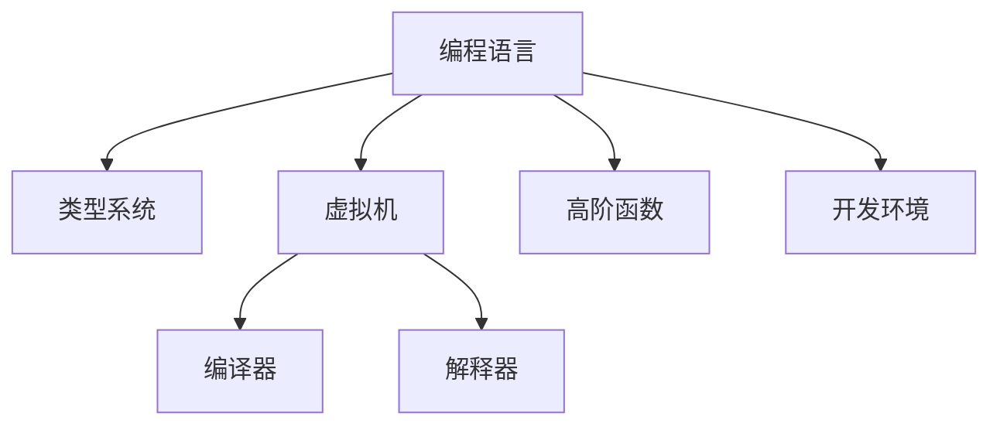

                 

# 编程语言的发展脉络与趋势

> 关键词：编程语言,语言演化,编译器,虚拟机,高阶函数,类型系统,开发环境,趋势

## 1. 背景介绍

### 1.1 问题由来
随着计算机科学的发展，编程语言经历了从最早的机器语言到高级语言的演变。从早期的Fortran、Cobol等，到现代的Python、JavaScript等，编程语言的发展反映了计算机科学领域对于人类表达力和计算效率的追求。编程语言的发展也受到了硬件、应用场景、开发工具等多种因素的影响，逐渐形成了一套完整的体系，覆盖了从数据类型定义、变量作用域、内存管理到并发控制、异常处理等各个方面。本文旨在回顾编程语言的发展历程，分析其演变的规律，展望未来的趋势。

### 1.2 问题核心关键点
编程语言的发展涉及以下几个核心关键点：

1. 从低级到高级：从机器语言到汇编语言，再到高级语言，编程语言的抽象程度不断提高，程序员可以更自然地表达问题。
2. 从静态到动态：早期的编程语言多采用静态类型系统，运行效率高但灵活性不足。后来动态类型语言如Python、JavaScript等逐渐兴起，带来了更高的开发效率。
3. 从编译到解释：编译器将源代码直接翻译为机器码，运行效率高但调试困难。解释器则逐行执行源代码，灵活性高但速度较慢。
4. 从单线程到多线程：随着硬件性能的提升和应用场景的复杂化，现代编程语言普遍支持多线程、并发处理。
5. 从过程到函数式：面向过程的编程语言逐渐被面向对象的、函数式的语言所取代，增强了代码的复用性和可读性。
6. 从集中到分布式：早期的编程语言多以集中式、单一进程为主，现代编程语言如Node.js、Java等支持分布式计算。
7. 从传统到现代：编程语言从早期的单进程、静态类型、面向过程，发展到现代的多进程、动态类型、面向对象、并发、函数式、分布式等。

## 2. 核心概念与联系

### 2.1 核心概念概述

为更好地理解编程语言的发展脉络，本节将介绍几个密切相关的核心概念：

- 编程语言：以某种形式定义计算机指令的语言。编程语言涵盖了从源代码到目标代码的整个处理过程，通常由编译器、解释器、运行环境等组成。
- 类型系统：定义数据类型及其操作规则的系统，影响着语言的安全性、可读性和效率。常见的类型系统有静态类型、动态类型、强类型、弱类型等。
- 虚拟机：将源代码转换为机器码的中间表示，提供抽象运行环境。虚拟机可以在多种硬件平台上运行，支持动态语言和面向对象的编程风格。
- 高阶函数：可以接受函数作为参数，并返回函数作为结果的函数。高阶函数使得编程语言具有更高的抽象能力，可以表达更复杂的操作。
- 开发环境：用于开发、测试、部署编程语言的工具集，如IDE、构建工具、调试工具等。

这些核心概念之间的逻辑关系可以通过以下Mermaid流程图来展示：



这个流程图展示了一些关键概念的相互关系：

1. 编程语言是由类型系统、虚拟机、编译器、解释器、高阶函数、开发环境等组成。
2. 类型系统规定了数据类型及其操作，虚拟机提供了抽象运行环境，编译器/解释器负责源码到目标码的转换，高阶函数增强了语言表达能力，开发环境提供了便利的工具集。

## 3. 核心算法原理 & 具体操作步骤

### 3.1 算法原理概述

编程语言的核心算法包括编译、解释、虚拟机运行等，主要涉及源码到目标码的转换和执行。本文将从静态编译、动态解释和虚拟机执行三个角度来分析其原理。

### 3.2 算法步骤详解

#### 3.2.1 静态编译

静态编译是将源代码直接翻译成机器码的过程。典型的静态编译语言如C++、Java等。编译步骤包括：

1. 词法分析：将源代码分割成单词和符号。
2. 语法分析：根据语言规范解析语法结构。
3. 语义分析：检查语法是否合法，语义是否正确。
4. 代码优化：进行编译器优化，提高运行效率。
5. 目标码生成：生成机器码或中间代码。

#### 3.2.2 动态解释

动态解释是逐行执行源代码的过程。典型的动态解释语言如Python、JavaScript等。解释步骤包括：

1. 词法分析：将源代码分割成单词和符号。
2. 语法分析：根据语言规范解析语法结构。
3. 语义分析：检查语法是否合法，语义是否正确。
4. 执行器运行：逐行执行源代码，动态生成目标码。

#### 3.2.3 虚拟机执行

虚拟机执行是将源代码翻译成中间代码，在虚拟机上运行。典型的虚拟机语言如Java、Ruby等。虚拟机步骤包括：

1. 编译器编译：将源代码翻译成中间代码。
2. 虚拟机加载：将中间代码加载到虚拟机。
3. 虚拟机执行：虚拟机根据指令执行中间代码。

### 3.3 算法优缺点

#### 3.3.1 静态编译

优点：

1. 运行效率高：直接生成机器码，运行速度快。
2. 类型检查严格：编译时进行类型检查，代码安全性高。
3. 跨平台性好：编译生成可移植的目标码。

缺点：

1. 开发周期长：编译过程复杂，调试困难。
2. 代码复杂：编译生成的代码不易理解。
3. 修改困难：修改源码需要重新编译。

#### 3.3.2 动态解释

优点：

1. 开发效率高：代码可运行后直接调试。
2. 语言灵活：动态类型系统，语言使用灵活。
3. 跨平台性好：解释器可运行在多种平台上。

缺点：

1. 运行效率低：逐行执行，运行速度慢。
2. 安全性差：运行时类型检查，代码安全性低。
3. 依赖解释器：依赖解释器版本，移植性差。

#### 3.3.3 虚拟机执行

优点：

1. 运行效率高：生成中间代码，运行速度快。
2. 跨平台性好：中间代码可在多种平台上运行。
3. 类型检查严格：虚拟机执行时进行类型检查，代码安全性高。

缺点：

1. 开发周期长：编译生成中间代码，开发复杂。
2. 语言复杂：中间代码复杂，理解困难。
3. 依赖虚拟机：依赖虚拟机版本，移植性差。

### 3.4 算法应用领域

编程语言的应用领域非常广泛，包括但不限于以下几个方面：

- 系统编程：编写操作系统、网络协议、驱动程序等底层代码。
- 应用开发：开发Web应用、桌面应用、移动应用等。
- 科学计算：进行数值计算、模拟仿真、数据处理等。
- 游戏开发：编写游戏引擎、渲染引擎、游戏逻辑等。
- 人工智能：编写机器学习模型、数据处理、算法实现等。
- 嵌入式开发：编写嵌入式系统、单片机程序等。
- 数据库开发：编写数据库管理系统、SQL语言等。

## 4. 数学模型和公式 & 详细讲解 & 举例说明

### 4.1 数学模型构建

编程语言的数学模型主要涉及算法复杂度、时间复杂度、空间复杂度等方面。本文以C++为例，描述其基本数学模型。

C++中的基本数学模型包括：

1. 数据结构：如数组、链表、树、图等。
2. 算法：如排序、查找、递归、分治等。
3. 类型系统：如基本类型、结构体、类、指针等。

### 4.2 公式推导过程

C++中的排序算法是一个典型的例子，使用快速排序算法进行推导。

假设输入数组为 $A=\{a_0, a_1, \dots, a_{n-1}\}$，采用快速排序算法，推导时间复杂度。

1. 分区操作：选取基准元素 $pivot$，将数组分为两部分 $L$ 和 $R$。
2. 递归排序：对 $L$ 和 $R$ 分别递归进行快速排序。
3. 合并操作：将 $L$ 和 $R$ 合并成有序数组。

推导过程如下：

1. 分区操作时间复杂度为 $O(n)$。
2. 递归排序时间复杂度为 $T(n) = 2T(n/2) + O(n)$。
3. 合并操作时间复杂度为 $O(n)$。

根据主定理，可得快速排序的时间复杂度为 $O(n\log n)$。

### 4.3 案例分析与讲解

#### 4.3.1 数据结构

数组和链表是C++中最基本的数据结构，其时间复杂度分析如下：

- 数组：随机访问时间为 $O(1)$，插入和删除时间为 $O(n)$。
- 链表：插入和删除时间为 $O(1)$，随机访问时间为 $O(n)$。

#### 4.3.2 算法

二分查找和快速排序是C++中最常用的算法，其时间复杂度分析如下：

- 二分查找：时间复杂度为 $O(\log n)$。
- 快速排序：时间复杂度为 $O(n\log n)$。

#### 4.3.3 类型系统

C++中的类型系统包括基本类型、结构体、类、指针等。以下以类为例，分析其时间复杂度：

- 类：初始化为 $O(1)$，成员变量访问为 $O(1)$，构造函数为 $O(n)$，析构函数为 $O(n)$。

## 5. 项目实践：代码实例和详细解释说明

### 5.1 开发环境搭建

在进行编程语言开发实践前，需要准备开发环境。以下是使用Python进行C++开发的环境配置流程：

1. 安装Anaconda：从官网下载并安装Anaconda，用于创建独立的Python环境。

2. 创建并激活虚拟环境：
```bash
conda create -n pytorch-env python=3.8 
conda activate pytorch-env
```

3. 安装C++开发工具：
```bash
conda install -c conda-forge ninja ninja-cxx ninja
```

4. 安装C++编译器：
```bash
conda install -c conda-forge clang
```

5. 安装C++开发包：
```bash
conda install -c conda-forge cmake
```

完成上述步骤后，即可在`pytorch-env`环境中开始C++编程实践。

### 5.2 源代码详细实现

以下是C++语言中数组和链表的实现及时间复杂度分析：

```cpp
#include <iostream>
#include <vector>
#include <list>

using namespace std;

int main() {
    vector<int> arr = {1, 2, 3, 4, 5};
    list<int> lst = {1, 2, 3, 4, 5};

    // 数组
    int x = arr[0];  // O(1)
    arr.push_back(6);  // O(n)
    arr.pop_back();  // O(n)

    // 链表
    int y = lst.front();  // O(1)
    lst.push_front(6);  // O(1)
    lst.pop_front();  // O(1)

    cout << "Array: x = " << x << endl;
    cout << "List: y = " << y << endl;

    return 0;
}
```

### 5.3 代码解读与分析

- 数组的随机访问时间为 $O(1)$，但插入和删除时间为 $O(n)$，因为需要移动其他元素。
- 链表的插入和删除时间为 $O(1)$，但随机访问时间为 $O(n)$，因为需要遍历链表。

## 6. 实际应用场景

### 6.1 系统编程

系统编程涉及底层硬件驱动、网络协议等，对性能要求高。例如，Linux内核、驱动程序等，需要高效、稳定的代码。

### 6.2 应用开发

应用开发涉及Web应用、桌面应用、移动应用等，对代码可读性和开发效率要求高。例如，React、Vue、Angular等前端框架，Django、Flask等后端框架。

### 6.3 科学计算

科学计算涉及数值计算、模拟仿真、数据处理等，对精度和可移植性要求高。例如，Python中的NumPy、SciPy，R语言等。

### 6.4 游戏开发

游戏开发涉及游戏引擎、渲染引擎、游戏逻辑等，对性能和可视化效果要求高。例如，Unity、Unreal Engine等。

### 6.5 人工智能

人工智能涉及机器学习模型、数据处理、算法实现等，对灵活性和可扩展性要求高。例如，TensorFlow、PyTorch等深度学习框架。

### 6.6 嵌入式开发

嵌入式开发涉及嵌入式系统、单片机程序等，对资源消耗和低延迟要求高。例如，Arduino、STM32等。

### 6.7 数据库开发

数据库开发涉及数据库管理系统、SQL语言等，对数据一致性和并发处理要求高。例如，MySQL、PostgreSQL等。

## 7. 工具和资源推荐

### 7.1 学习资源推荐

为了帮助开发者系统掌握编程语言的理论基础和实践技巧，这里推荐一些优质的学习资源：

1. 《C++ Primer》：一本经典的C++入门书籍，系统介绍了C++语言的基础知识和高级特性。
2. 《The C++ Programming Language》：C++之父Bjarne Stroustrup所著，介绍了C++语言的设计哲学和实现细节。
3. 《Effective C++》：一本C++编程实践指南，介绍了C++编程中的最佳实践和常见陷阱。
4. 《Clean Code》：一本编程规范指南，介绍了如何写出清晰、可读、可维护的代码。
5. 《Design Patterns》：一本设计模式指南，介绍了常用的设计模式和其应用场景。
6. GitHub：一个开源代码托管平台，可以访问和学习各种编程语言的代码实现。

通过对这些资源的学习实践，相信你一定能够快速掌握C++语言的核心概念和编程技巧，并用于解决实际的开发问题。

### 7.2 开发工具推荐

高效的开发离不开优秀的工具支持。以下是几款用于C++编程开发的常用工具：

1. Visual Studio：Microsoft开发的集成开发环境，支持Windows平台，功能强大。
2. Code::Blocks：一个跨平台的C++ IDE，支持Linux、Mac、Windows等平台。
3. Eclipse：一个跨平台的开发工具，支持多种编程语言，包括C++。
4. Sublime Text：一个文本编辑工具，支持多种编程语言，插件丰富。
5. VIM：一个文本编辑器，支持多种编程语言，功能强大。

合理利用这些工具，可以显著提升C++编程的开发效率，加快创新迭代的步伐。

### 7.3 相关论文推荐

C++语言的发展源于学界的持续研究。以下是几篇奠基性的相关论文，推荐阅读：

1. 《The C++ Programming Language》（Bjarne Stroustrup）：介绍了C++语言的设计哲学和实现细节。
2. 《Effective C++》（Scott Meyers）：介绍了C++编程中的最佳实践和常见陷阱。
3. 《Design Patterns》（Eric Gamma等）：介绍了常用的设计模式和其应用场景。
4. 《Programming: Principles and Practice Using C++》（Bjarne Stroustrup）：介绍了C++语言的教学和编程实践。

这些论文代表了大语言模型微调技术的发展脉络。通过学习这些前沿成果，可以帮助研究者把握学科前进方向，激发更多的创新灵感。

## 8. 总结：未来发展趋势与挑战

### 8.1 研究成果总结

本文对编程语言的发展历程进行了全面系统的介绍，涵盖了从低级到高级、从静态到动态、从编译到解释等多个方面。通过系统的理论分析和实践案例，展示了编程语言的核心算法和应用场景。

### 8.2 未来发展趋势

展望未来，编程语言将呈现以下几个发展趋势：

1. 语言将进一步向通用化和标准化方向发展。随着各种编程语言的普及，未来可能会出现一种统一的编程语言标准，使得不同语言之间的代码可以互通。
2. 编程语言将更加关注安全和可靠性。未来的编程语言将加入更多的安全机制，如内存安全、类型安全等，避免常见的编程错误。
3. 编程语言将更加关注可读性和可维护性。未来的编程语言将更加注重代码的清晰度和可维护性，减少不必要的语法复杂性。
4. 编程语言将更加关注性能和效率。未来的编程语言将更加注重代码的性能和效率，减少不必要的运行时开销。
5. 编程语言将更加关注并发和分布式。未来的编程语言将更加支持多线程、并发处理、分布式计算等，以适应分布式计算和云计算的需求。
6. 编程语言将更加关注人工智能。未来的编程语言将更好地支持机器学习、数据处理等人工智能任务，提升代码的智能化水平。

### 8.3 面临的挑战

尽管编程语言的发展取得了巨大进展，但在迈向更加智能化、普适化应用的过程中，它仍面临诸多挑战：

1. 学习曲线陡峭：编程语言的复杂性和多样性使得初学者难以掌握。
2. 语法冗余：现代编程语言语法复杂，容易产生冗余代码。
3. 内存管理困难：动态语言和面向对象的编程语言增加了内存管理的复杂性。
4. 性能瓶颈：现代编程语言的高性能特性容易带来性能瓶颈。
5. 兼容性问题：不同编程语言之间的兼容性问题，增加了代码移植和维护的难度。
6. 安全性问题：编程语言的安全机制不够完善，容易产生安全漏洞。

### 8.4 研究展望

面向未来，编程语言的研究需要解决以下几个问题：

1. 简化语法：设计更加简洁、易懂的语法，降低学习曲线。
2. 统一标准：制定统一的编程语言标准，促进代码互通。
3. 增强安全性：加入更多的安全机制，避免常见的编程错误。
4. 提升性能：优化编译器和解释器，提升代码的运行效率。
5. 支持并发：支持多线程、并发处理、分布式计算等，以适应分布式计算和云计算的需求。
6. 引入人工智能：更好地支持机器学习、数据处理等人工智能任务，提升代码的智能化水平。

## 9. 附录：常见问题与解答

**Q1：编程语言的标准化有什么优势？**

A: 编程语言的标准化可以带来以下优势：

1. 通用性：不同平台和环境下的代码可以相互兼容，提高代码的通用性。
2. 可移植性：标准化的编程语言可以更容易地移植到不同的操作系统和硬件平台上。
3. 互操作性：标准化的编程语言可以更好地与其他编程语言和工具互操作。
4. 一致性：标准化的编程语言可以确保代码的一致性和规范性，减少出错率。
5. 可维护性：标准化的编程语言可以降低代码的维护成本，提高开发效率。

**Q2：编程语言的多样性对开发有什么影响？**

A: 编程语言的多样性对开发有以下影响：

1. 选择困难：开发者需要根据应用场景选择适合的编程语言，增加了选择的难度。
2. 学习成本高：每种编程语言都有自己的语法、特性和工具，需要学习不同的语言。
3. 工具链复杂：不同编程语言需要使用不同的开发工具和环境，增加了工具链的复杂性。
4. 兼容性差：不同编程语言之间的兼容性问题，增加了代码移植和维护的难度。
5. 生态系统多样：不同编程语言有各自的生态系统，开发者需要选择适合的生态系统进行开发。

**Q3：编程语言的未来发展方向是什么？**

A: 编程语言的未来发展方向包括：

1. 简化语法：设计更加简洁、易懂的语法，降低学习曲线。
2. 统一标准：制定统一的编程语言标准，促进代码互通。
3. 增强安全性：加入更多的安全机制，避免常见的编程错误。
4. 提升性能：优化编译器和解释器，提升代码的运行效率。
5. 支持并发：支持多线程、并发处理、分布式计算等，以适应分布式计算和云计算的需求。
6. 引入人工智能：更好地支持机器学习、数据处理等人工智能任务，提升代码的智能化水平。

**Q4：编程语言的安全性问题如何解决？**

A: 编程语言的安全性问题可以通过以下方式解决：

1. 静态分析：在编译阶段进行静态分析，发现潜在的错误和安全问题。
2. 动态分析：在运行时进行动态分析，实时检测和修复错误和安全问题。
3. 类型系统：设计更加严格的类型系统，减少类型错误和安全漏洞。
4. 安全机制：加入更多的安全机制，如内存安全、类型安全、并发安全等。
5. 工具支持：使用静态分析工具和动态分析工具，辅助开发者发现和修复问题。

**Q5：编程语言的性能瓶颈如何解决？**

A: 编程语言的性能瓶颈可以通过以下方式解决：

1. 优化算法：使用高效的算法和数据结构，减少运行时间。
2. 编译优化：优化编译器和解释器，提升代码的运行效率。
3. 多线程并发：使用多线程和并发处理，提升代码的并发性能。
4. 内存管理：使用内存池和垃圾回收机制，减少内存泄漏和碎片。
5. 分布式计算：使用分布式计算和云计算，提升代码的计算性能。

---

作者：禅与计算机程序设计艺术 / Zen and the Art of Computer Programming

