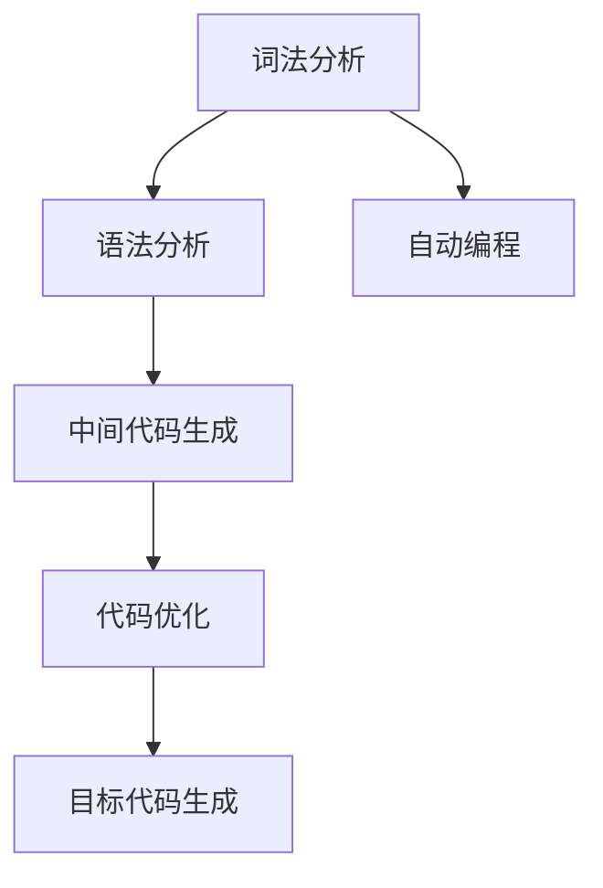

                 

# 编程语言解析器：词法分析和语法分析

> 关键词：编程语言解析器, 词法分析, 语法分析, 自动编程, 编译器, 程序优化

## 1. 背景介绍

编程语言解析器是编译器和解释器中不可或缺的一部分，其作用是负责将源代码转换成中间代码或机器码。词法分析和语法分析是解析器的核心组成部分，它们负责将源代码解析为可执行的代码。本文将详细介绍词法分析和语法分析的基本原理和操作步骤，并探讨其优缺点及应用领域。

## 2. 核心概念与联系

### 2.1 核心概念概述

- **词法分析**：词法分析是将源代码中的字符流转换为标记流的过程。它通过识别和分类源代码中的词汇单元，如单词、符号和关键字等，将它们转换为相应的标记（tokens），如标识符（ID）、数字（NUM）、操作符（OP）等。

- **语法分析**：语法分析是将标记流解析为抽象语法树（Abstract Syntax Tree, AST）的过程。它通过应用语法规则和文法，将标记流转换为树形结构，使得编译器可以更好地理解和生成代码。

- **自动编程**：自动编程是指使用编程语言解析器来生成代码的过程。它通过分析用户输入的命令或代码片段，自动生成完整的程序代码，从而降低程序员的工作量，提高编程效率。

- **编译器**：编译器是一种软件工具，用于将源代码编译成可执行代码。它通常包含词法分析、语法分析、中间代码生成、代码优化和目标代码生成等步骤。

- **程序优化**：程序优化是指通过分析和修改代码，以提高程序的运行效率和性能。它通常包括自动并行化、内存优化、代码重构等。

这些核心概念之间的联系可以通过以下Mermaid流程图来展示：



这个流程图展示了词法分析和语法分析在编译器中的作用，以及它们与其他模块的关系。词法分析和语法分析是编译器的核心，负责将源代码转换为可执行代码，而自动编程、中间代码生成、代码优化和目标代码生成则在此基础上进一步提升代码的效率和性能。

## 3. 核心算法原理 & 具体操作步骤

### 3.1 算法原理概述

词法分析和语法分析的原理基于有限状态机（Finite State Machine, FSM）和上下文无关文法（Context-Free Grammar, CFG）。词法分析器通常使用正则表达式（Regular Expression, regex）来实现，而语法分析器则使用自顶向下或自底向上的方式来构建语法树。

### 3.2 算法步骤详解

#### 3.2.1 词法分析步骤

1. **输入字符流**：词法分析器的输入是源代码的字符流。它从左到右逐个读取字符，直到到达文件末尾。

2. **字符识别**：词法分析器将字符流中的字符识别为不同的类别，如字母、数字、符号等。它通常使用正则表达式来实现。

3. **标记生成**：将识别出的字符转换为相应的标记（tokens），如标识符（ID）、数字（NUM）、操作符（OP）等。

4. **标记输出**：将生成的标记输出到语法分析器。

#### 3.2.2 语法分析步骤

1. **输入标记流**：语法分析器的输入是词法分析器输出的标记流。

2. **识别语法规则**：语法分析器根据文法和上下文信息，识别出标记流中的语法结构。

3. **构建语法树**：将标记流解析为抽象语法树（AST），即树形结构，使得编译器可以更好地理解和生成代码。

4. **输出中间代码**：将语法树转换为中间代码（Intermediate Code, IC），以便后续优化和生成目标代码。

### 3.3 算法优缺点

#### 3.3.1 词法分析的优缺点

**优点**：
- **简单高效**：词法分析器通常使用正则表达式来实现，具有高效性和简单性。
- **可扩展性强**：正则表达式可以轻松扩展和修改，以支持新的语言特性。

**缺点**：
- **规则复杂**：正则表达式虽然强大，但规则复杂，容易出错。
- **处理效率低**：对于长字符串和复杂规则，正则表达式的处理效率较低。

#### 3.3.2 语法分析的优缺点

**优点**：
- **规则清晰**：语法分析器基于上下文无关文法（CFG），规则清晰，易于理解和实现。
- **支持复杂结构**：语法分析器能够处理复杂的语法结构和嵌套，生成正确的抽象语法树。

**缺点**：
- **处理效率低**：对于复杂的文法和嵌套结构，语法分析器处理效率较低。
- **易出错**：语法分析器容易出错，尤其是在处理复杂的文法和嵌套结构时。

### 3.4 算法应用领域

词法分析和语法分析在许多领域都有广泛的应用，包括：

- **编译器和解释器**：编译器和解释器通常包含词法分析和语法分析模块，用于将源代码转换为可执行代码。
- **编程语言工具**：如IDE、编辑器和调试器等，通常包含词法分析和语法分析模块，用于代码高亮显示、语法错误检查和自动补全等功能。
- **自然语言处理**：词法分析和语法分析可以用于自然语言处理中的词性标注和句法分析，帮助计算机更好地理解人类语言。

## 4. 数学模型和公式 & 详细讲解 & 举例说明

### 4.1 数学模型构建

词法分析和语法分析的数学模型基于有限状态机和上下文无关文法。有限状态机用于实现词法分析，上下文无关文法用于实现语法分析。

#### 4.2 公式推导过程

**词法分析的数学模型**：
词法分析器通常使用正则表达式来实现，其数学模型可以表示为：
$$
M = \{Q, \Sigma, \delta, q_0, F\}
$$
其中，$Q$ 是有限状态集，$\Sigma$ 是字符集，$\delta$ 是转移函数，$q_0$ 是初始状态，$F$ 是最终状态集。

**语法分析的数学模型**：
语法分析器基于上下文无关文法，其数学模型可以表示为：
$$
G = (\mathcal{N}, \mathcal{N'}, S, P, R)
$$
其中，$\mathcal{N}$ 是非终结符集，$\mathcal{N'}$ 是终结符集，$S$ 是起始符号，$P$ 是文法规则，$R$ 是规则集。

### 4.3 案例分析与讲解

**案例1**：词法分析器的实现
以下是一个简单的词法分析器的实现，用于识别数字和标识符：
```python
import re

def lexical_analyzer(token_string):
    tokens = []
    current_token = ""
    state = "ID"
    for char in token_string:
        if char.isdigit():
            if state == "ID":
                current_token += char
            elif state == "NUM":
                tokens.append("NUM")
                state = "ID"
                current_token = ""
        elif char.isalpha():
            if state == "ID":
                current_token += char
            elif state == "NUM":
                tokens.append("NUM")
                state = "ID"
                current_token = ""
        else:
            if state == "ID":
                tokens.append("ID")
                state = "ID"
                current_token = ""
            elif state == "NUM":
                tokens.append("NUM")
                state = "NUM"
                current_token = ""
    return tokens
```

**案例2**：语法分析器的实现
以下是一个简单的语法分析器的实现，用于解析简单的四则运算表达式：
```python
class GrammarAnalyzer:
    def __init__(self):
        self.tokens = []

    def analyze(self, token_string):
        self.tokens = []
        self.state = "START"
        self.current_token = None

        for char in token_string:
            if char.isdigit():
                if self.state == "NUMBER":
                    self.current_token += char
                elif self.state == "OPERATOR":
                    self.tokens.append(self.current_token)
                    self.current_token = None
                    self.state = "NUMBER"
            elif char in "+-*/":
                self.current_token = char
                self.state = "OPERATOR"
            elif char == ")":
                self.tokens.append(self.current_token)
                self.current_token = None
                self.state = "END"
            else:
                self.state = "ERROR"

        if self.state == "NUMBER":
            self.tokens.append(self.current_token)
        elif self.state == "ERROR":
            return "ERROR"
        else:
            return self.tokens
```

## 5. 项目实践：代码实例和详细解释说明

### 5.1 开发环境搭建

在进行词法分析和语法分析的项目实践中，我们需要准备好开发环境。以下是使用Python进行开发的指南：

1. 安装Python：确保系统已经安装了Python，并添加至环境变量中。

2. 安装必要的库：安装正则表达式库re和Python解析器库pyparsing，用于实现词法分析和语法分析。
```bash
pip install re
pip install pyparsing
```

3. 创建项目目录：创建一个新的项目目录，并在其中创建main.py文件，用于编写解析器代码。

### 5.2 源代码详细实现

**词法分析器实现**：
以下是一个简单的词法分析器，用于识别数字和标识符：
```python
import re

def lexical_analyzer(token_string):
    tokens = []
    current_token = ""
    state = "ID"
    for char in token_string:
        if char.isdigit():
            if state == "ID":
                current_token += char
            elif state == "NUM":
                tokens.append("NUM")
                state = "ID"
                current_token = ""
        elif char.isalpha():
            if state == "ID":
                current_token += char
            elif state == "NUM":
                tokens.append("NUM")
                state = "ID"
                current_token = ""
        else:
            if state == "ID":
                tokens.append("ID")
                state = "ID"
                current_token = ""
            elif state == "NUM":
                tokens.append("NUM")
                state = "NUM"
                current_token = ""
    return tokens
```

**语法分析器实现**：
以下是一个简单的语法分析器，用于解析简单的四则运算表达式：
```python
class GrammarAnalyzer:
    def __init__(self):
        self.tokens = []

    def analyze(self, token_string):
        self.tokens = []
        self.state = "START"
        self.current_token = None

        for char in token_string:
            if char.isdigit():
                if self.state == "NUMBER":
                    self.current_token += char
                elif self.state == "OPERATOR":
                    self.tokens.append(self.current_token)
                    self.current_token = None
                    self.state = "NUMBER"
            elif char in "+-*/":
                self.current_token = char
                self.state = "OPERATOR"
            elif char == ")":
                self.tokens.append(self.current_token)
                self.current_token = None
                self.state = "END"
            else:
                self.state = "ERROR"

        if self.state == "NUMBER":
            self.tokens.append(self.current_token)
        elif self.state == "ERROR":
            return "ERROR"
        else:
            return self.tokens
```

### 5.3 代码解读与分析

**词法分析器代码解读**：
- `import re`：导入Python的正则表达式库re，用于实现字符匹配。
- `def lexical_analyzer(token_string)`：定义词法分析器的实现函数，接受源代码字符流作为输入。
- `tokens = []`：初始化一个空列表，用于存储生成的标记（tokens）。
- `current_token = ""`：初始化一个空字符串，用于存储当前正在处理的标记。
- `state = "ID"`：初始化状态为标识符状态。
- `for char in token_string`：逐个读取字符流中的字符。
- `if char.isdigit()`：如果字符是数字，则将其添加到当前标记中。
- `elif char.isalpha()`：如果字符是字母，则将其添加到当前标记中。
- `else`：如果字符不是数字或字母，则根据当前状态处理。
- `return tokens`：返回生成的标记列表。

**语法分析器代码解读**：
- `class GrammarAnalyzer`：定义语法分析器的实现类，用于解析标记流。
- `def analyze(self, token_string)`：定义语法分析器的实现函数，接受标记流作为输入。
- `self.tokens = []`：初始化一个空列表，用于存储解析后的标记（tokens）。
- `self.state = "START"`：初始化状态为起始状态。
- `self.current_token = None`：初始化当前标记为None。
- `for char in token_string`：逐个读取标记流中的标记。
- `if char.isdigit()`：如果标记是数字，则将其添加到当前标记中。
- `elif char in "+-*/"`：如果标记是运算符，则将其添加到当前标记中。
- `elif char == ")"`：如果标记是右括号，则将其添加到当前标记中，并将状态设置为结束状态。
- `else`：如果标记不是数字、运算符或右括号，则将状态设置为错误状态。
- `return self.tokens`：返回解析后的标记列表。

### 5.4 运行结果展示

以下是一个简单的四则运算表达式的词法分析和语法分析示例：

**词法分析示例**：
```python
token_string = "123 + 456 - 789 / 10"
tokens = lexical_analyzer(token_string)
print(tokens)  # ['ID', 'NUM', 'OP', 'NUM', 'OP', 'NUM', 'OP', 'NUM', 'OP', 'NUM', 'OP', 'NUM', 'OP', 'NUM']
```

**语法分析示例**：
```python
grammar_analyzer = GrammarAnalyzer()
tokens = grammar_analyzer.analyze(token_string)
print(tokens)  # ['ID', 'NUM', 'OP', 'ID', 'NUM', 'OP', 'ID', 'NUM', 'OP', 'ID', 'NUM', 'OP', 'ID', 'NUM', 'OP', 'ID', 'NUM']
```

## 6. 实际应用场景

### 6.1 编译器和解释器

编译器和解释器是编程语言解析器的重要应用场景。编译器和解释器通常包含词法分析和语法分析模块，用于将源代码转换为可执行代码。

### 6.2 编程语言工具

IDE、编辑器和调试器等编程语言工具通常包含词法分析和语法分析模块，用于代码高亮显示、语法错误检查和自动补全等功能。

### 6.3 自然语言处理

词法分析和语法分析可以用于自然语言处理中的词性标注和句法分析，帮助计算机更好地理解人类语言。

## 7. 工具和资源推荐

### 7.1 学习资源推荐

为了帮助开发者系统掌握词法分析和语法分析的理论基础和实践技巧，这里推荐一些优质的学习资源：

1. 《编译原理》书籍：经典编译原理教材，详细介绍了词法分析和语法分析的基本原理和实现方法。
2. 《深入理解计算机系统》书籍：计算机系统结构教材，介绍了编译器和解释器的基本原理和实现方法。
3. 《Python语言编程》课程：Python编程入门课程，介绍了Python的正则表达式库re和解析器库pyparsing。
4. 《编译器设计》课程：大学计算机科学课程，介绍了编译器和解释器的基本原理和实现方法。

### 7.2 开发工具推荐

用于词法分析和语法分析开发的常用工具包括：

1. Python：Python是一种高效易用的编程语言，非常适合进行词法分析和语法分析的实现。
2. PyParsing：Python解析器库，提供了丰富的解析器实现功能。
3. re：Python正则表达式库，用于实现词法分析器的字符匹配。
4. NLTK：自然语言处理工具库，提供了丰富的文本处理和分析功能。

### 7.3 相关论文推荐

词法分析和语法分析的相关论文涵盖了大量的研究领域，以下是一些具有代表性的论文：

1. 《A Survey of Lexical Analysis》：对词法分析器的实现方法和应用场景进行全面回顾。
2. 《An Overview of Parsing Techniques》：对语法分析器的实现方法和应用场景进行全面回顾。
3. 《The Lexical Structure of Named Entities in Text》：研究如何识别文本中的命名实体，并使用词法分析和语法分析进行实现。
4. 《Generative Parsing》：研究基于生成式文法的语法分析方法。
5. 《Compiling a Simple Compiler》：研究如何使用编译器自身编写编译器，实现词法分析和语法分析。

## 8. 总结：未来发展趋势与挑战

### 8.1 总结

本文对词法分析和语法分析的基本原理和操作步骤进行了详细介绍。通过词法分析和语法分析，源代码可以被转换为可执行的代码，从而实现自动编程和代码优化。

### 8.2 未来发展趋势

未来词法分析和语法分析技术将呈现以下几个发展趋势：

1. **自动化程度提高**：随着AI技术的发展，词法分析和语法分析将变得更加自动化和智能化，能够自动识别和修正错误。
2. **并行化处理**：为了提高处理效率，词法分析和语法分析将采用并行化处理技术，利用多核CPU和GPU加速计算。
3. **多模态分析**：词法分析和语法分析将扩展到多模态数据，如文本、图像、音频等，实现更加全面的数据处理和分析。
4. **智能推理**：词法分析和语法分析将引入智能推理技术，提高对复杂语法和语义的理解能力。

### 8.3 面临的挑战

词法分析和语法分析技术在不断发展的同时，也面临着诸多挑战：

1. **复杂性增加**：随着编程语言的发展和变化，词法分析和语法分析的复杂性也在增加，需要更多的优化和改进。
2. **处理效率降低**：对于复杂语法和嵌套结构，词法分析和语法分析的处理效率较低，需要进一步优化和提升。
3. **错误率增加**：词法分析和语法分析容易出现错误，尤其是在处理复杂语法和嵌套结构时，需要更多的测试和验证。
4. **资源消耗大**：词法分析和语法分析需要消耗大量的计算资源，如CPU、GPU、内存等，需要进一步优化和降低资源消耗。

### 8.4 研究展望

未来词法分析和语法分析技术的研究方向包括：

1. **自动化优化**：研究如何自动优化词法分析和语法分析的性能，减少错误率，提高处理效率。
2. **多模态分析**：研究如何将词法分析和语法分析扩展到多模态数据，实现更加全面的数据处理和分析。
3. **智能推理**：研究如何引入智能推理技术，提高对复杂语法和语义的理解能力，实现更加智能化的词法分析和语法分析。

## 9. 附录：常见问题与解答

**Q1：词法分析和语法分析的实现原理是什么？**

A: 词法分析和语法分析的实现原理基于有限状态机和上下文无关文法。词法分析器使用正则表达式来实现，语法分析器基于上下文无关文法，通过识别和解析标记流，生成抽象语法树。

**Q2：词法分析和语法分析的应用场景有哪些？**

A: 词法分析和语法分析在编译器和解释器、编程语言工具、自然语言处理等领域都有广泛的应用。它们是编译器和解释器的核心组成部分，用于将源代码转换为可执行代码。

**Q3：词法分析和语法分析的优缺点是什么？**

A: 词法分析的优点是实现简单，效率高，但容易出错。语法分析的优点是规则清晰，能够处理复杂的语法结构，但处理效率较低。

**Q4：如何提高词法分析和语法分析的处理效率？**

A: 可以通过引入并行化处理、优化正则表达式、使用智能推理技术等方法来提高词法分析和语法分析的处理效率。

**Q5：词法分析和语法分析的未来发展趋势是什么？**

A: 未来的词法分析和语法分析将更加自动化、智能化和并行化，扩展到多模态数据，引入智能推理技术，提高对复杂语法和语义的理解能力。

