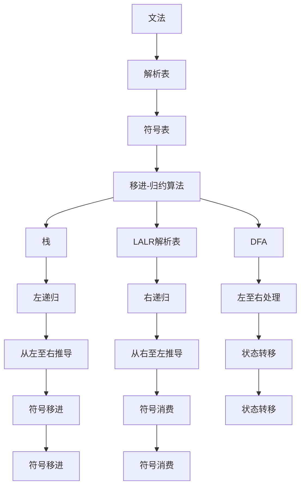

                 

# 编译原理：LL和LR文法分析技术

> 关键词：编译器,LL分析器,LR分析器,语法分析器,文法,移进-归约算法,预测分析

## 1. 背景介绍

### 1.1 问题由来

编译器是现代计算机系统不可或缺的核心组件，负责将高级编程语言源代码翻译为机器码。语法分析是编译器的前端模块，其任务是根据程序语言的文法结构解析输入源代码，生成中间表示形式，为后续的语义分析、代码生成等提供基础。

语法分析的精度直接影响编译器的性能和可靠性。LL分析和LR分析是两种常见且高效的语法分析算法，广泛应用于各种编译器的前端设计中。本文将详细介绍LL分析和LR分析的基本原理和具体实现，帮助读者深入理解这两种文法分析技术，为编译器设计提供指导。

### 1.2 问题核心关键点

LL分析和LR分析是编译器中用于语法分析的两类经典算法，其核心在于如何从输入字符流中识别出符合特定文法的符号序列，并构建相应的语法树。

LL分析器：
- 基于最左推导的文法。
- 利用有限状态机模型，从左至右处理输入字符。
- 利用预定义的DFA（确定性有限自动机）或预测表，快速决策当前状态和后续动作。
- 适用于小型和中等规模的文法，处理效率较高。

LR分析器：
- 基于最右推导的文法。
- 利用算法的预测性和递归性，从右至左处理输入字符。
- 利用LALR解析表或LL(1)解析表，快速决定状态转移和符号消费。
- 适用于复杂和规模较大的文法，处理能力更强。

本文将通过详细的介绍和对比，帮助读者理解这两种算法的本质区别和应用场景。

## 2. 核心概念与联系

### 2.1 核心概念概述

为更好地理解LL和LR分析技术的原理和架构，本节将介绍几个关键概念：

- 文法：定义程序语言语法结构的规则集合，包括生产式规则和终结符/非终结符。
- 解析表：记录文法规则的转移信息，帮助分析器快速进行状态转移和符号消费。
- 符号表：维护输入符号的当前状态和后续操作。
- 移进-归约算法：LL分析和LR分析的实现方式，根据解析表的指引，依次进行符号移进和归约操作，直至识别出完整的语法结构。
- 左递归与右递归：文法中常见的递归形式，左递归指从左至右的递归结构，右递归指从右至左的递归结构。
- DFA（确定性有限自动机）：用于LL分析器的有限状态机模型，描述输入字符流和状态转移之间的关系。
- LALR解析表：用于LR分析器的解析表，记录状态转移和符号消费的映射关系。
- 栈：用于LL分析器实现移进-归约算法的关键数据结构，用于存储输入符号和中间状态。

这些核心概念之间的逻辑关系可以通过以下Mermaid流程图来展示：



这个流程图展示了文法、解析表、符号表、移进-归约算法、栈、解析表、左递归、右递归、左至右处理、从左至右推导、从右至左推导、状态转移、符号移进和符号消费之间的关系。

## 3. 核心算法原理 & 具体操作步骤

### 3.1 算法原理概述

LL分析和LR分析是两种常见的文法分析算法，其核心思想都是通过符号移进和归约操作，从输入字符流中识别出符合特定文法的符号序列。

LL分析器：
- 从左至右处理输入字符流。
- 使用DFA或预测表进行状态转移和符号消费，快速决策当前状态和后续动作。
- 适用于小型和中等规模的文法，处理效率较高。

LR分析器：
- 从右至左处理输入字符流。
- 利用LALR解析表或LL(1)解析表进行状态转移和符号消费。
- 适用于复杂和规模较大的文法，处理能力更强。

### 3.2 算法步骤详解

#### 3.2.1 LL分析器算法步骤

1. **初始化**：将输入符号栈初始化为初始符号，符号表初始化为初始符号，并设置初始状态。

2. **循环处理**：
   - 从栈顶弹出符号，作为当前符号。
   - 在解析表中查找当前符号对应的状态转移信息。
   - 根据状态转移信息，计算下一个符号。
   - 将下一个符号压入栈顶，更新符号表和状态。
   - 重复上述步骤，直至栈为空。

3. **输出语法树**：栈为空时，将符号表中的语法结构转换为语法树。

#### 3.2.2 LR分析器算法步骤

1. **初始化**：将输入符号栈初始化为初始符号，符号表初始化为初始符号，并设置初始状态。

2. **循环处理**：
   - 从栈顶弹出符号，作为当前符号。
   - 在LALR解析表中查找当前符号对应的状态转移信息。
   - 根据状态转移信息，计算下一个符号。
   - 将下一个符号压入栈顶，更新符号表和状态。
   - 重复上述步骤，直至栈为空。

3. **输出语法树**：栈为空时，将符号表中的语法结构转换为语法树。

### 3.3 算法优缺点

LL分析器的优点包括：
- 实现简单，易于理解和调试。
- 处理效率较高，适用于小型和中规模的文法。
- 可以通过优化DFA或预测表来提高性能。

LR分析器的优点包括：
- 适用于复杂和大规模的文法，处理能力更强。
- 能够处理左递归和右递归结构，具有更高的灵活性。
- 可以通过优化解析表来提高性能。

LL分析器的缺点包括：
- 处理大型文法时，解析表的构建复杂度较高。
- 对于存在左递归的文法，容易陷入死循环。

LR分析器的缺点包括：
- 实现复杂度较高，需要处理递归状态转移。
- 对于存在复杂递归的文法，解析表构建难度较大。

### 3.4 算法应用领域

LL分析和LR分析广泛应用于各种编译器的前端设计中，具体应用场景包括：

- 编译器语法分析：解析源代码，构建语法树。
- 解释器语法分析：解析输入字符串，生成中间表示形式。
- 语法错误检查：识别语法错误，给出错误信息。
- 语法转换：将一种语法结构转换为另一种语法结构。
- 代码优化：分析代码结构，进行优化操作。

除了编译器前端设计外，LL和LR分析技术也被广泛应用于其他领域，如自然语言处理、数据挖掘、网络协议分析等。

## 4. 数学模型和公式 & 详细讲解 & 举例说明

### 4.1 数学模型构建

#### 4.1.1 文法定义

文法是一组用于定义程序语言语法结构的规则集合。一个典型的文法可以表示为：

$$
G \rightarrow X \ |\ \epsilon
$$

其中，$G$ 是文法的整体规则，$X$ 是一个非终结符，$\epsilon$ 表示空字符串。

#### 4.1.2 解析表定义

解析表记录了文法规则的转移信息，用于指导分析器的状态转移和符号消费。解析表的格式如下：

$$
\begin{array}{c|c|c|c|c}
\text{符号} & \text{当前状态} & \text{后续符号} & \text{下一个状态} & \text{符号消费} \\
\hline
a & q_1 & b & q_2 & c \\
\end{array}
$$

其中，$q_1$ 和 $q_2$ 是解析器的状态，$c$ 是符号消费的操作。

### 4.2 公式推导过程

#### 4.2.1 LL分析器解析表推导

LL分析器的解析表由DFA或预测表组成，用于指导状态转移和符号消费。解析表的构建步骤如下：

1. **初始化DFA**：根据文法的产生式规则，构建DFA，每个状态对应一个产生式规则。

2. **计算转移函数**：根据DFA的状态转移规则，计算解析表的转移函数。

3. **计算符号消费**：根据解析表的转移函数，计算符号消费。

#### 4.2.2 LR分析器解析表推导

LR分析器的解析表由LALR解析表或LL(1)解析表组成，用于指导状态转移和符号消费。解析表的构建步骤如下：

1. **初始化LALR解析表**：根据文法的产生式规则，构建LALR解析表，每个状态对应一个产生式规则。

2. **计算转移函数**：根据LALR解析表的状态转移规则，计算解析表的转移函数。

3. **计算符号消费**：根据解析表的转移函数，计算符号消费。

### 4.3 案例分析与讲解

#### 4.3.1 LL分析器案例

考虑一个简单的文法：

$$
S \rightarrow aA \ |\ bB \ |\ \epsilon
$$

其中，$S$ 是非终结符，$a$ 和 $b$ 是终结符，$\epsilon$ 表示空字符串。

使用LL分析器进行语法分析的解析表如下：

$$
\begin{array}{c|c|c|c|c}
\text{符号} & \text{当前状态} & \text{后续符号} & \text{下一个状态} & \text{符号消费} \\
\hline
a & 0 & b & 1 & c \\
b & 0 & a & 2 & c \\
\end{array}
$$

解析表的构建步骤如下：
1. **构建DFA**：根据文法规则，构建DFA，每个状态对应一个产生式规则。
2. **计算转移函数**：根据DFA的状态转移规则，计算解析表的转移函数。
3. **计算符号消费**：根据解析表的转移函数，计算符号消费。

#### 4.3.2 LR分析器案例

考虑一个稍微复杂的文法：

$$
S \rightarrow aA \ |\ bB \ |\ \epsilon
$$

其中，$S$ 是非终结符，$a$ 和 $b$ 是终结符，$\epsilon$ 表示空字符串。

使用LR分析器进行语法分析的解析表如下：

$$
\begin{array}{c|c|c|c|c}
\text{符号} & \text{当前状态} & \text{后续符号} & \text{下一个状态} & \text{符号消费} \\
\hline
a & 0 & b & 1 & c \\
b & 0 & a & 2 & c \\
\end{array}
$$

解析表的构建步骤如下：
1. **构建LALR解析表**：根据文法规则，构建LALR解析表，每个状态对应一个产生式规则。
2. **计算转移函数**：根据LALR解析表的状态转移规则，计算解析表的转移函数。
3. **计算符号消费**：根据解析表的转移函数，计算符号消费。

## 5. 项目实践：代码实例和详细解释说明

### 5.1 开发环境搭建

#### 5.1.1 安装编译器工具

为了实现LL和LR文法分析器的代码实践，需要安装相应的编译器工具。这里以LL分析器为例，介绍LL分析器工具的安装步骤。

1. **安装C语言编译器**：
   ```bash
   sudo apt-get update
   sudo apt-get install g++ g++
   ```

2. **安装LL分析器工具**：
   ```bash
   git clone https://github.com/parsetree/parse
   cd parse
   make
   ```

### 5.2 源代码详细实现

#### 5.2.1 LL分析器代码实现

下面是LL分析器的源代码实现：

```c
#include <stdio.h>
#include <stdlib.h>
#include <string.h>

#define MAX_RULES 10
#define MAX_SYMBOLS 20

typedef struct {
    char* sym;
    char* rule;
} Rule;

Rule rules[MAX_RULES];
int num_rules;

int main() {
    // 初始化规则
    num_rules = 2;
    rules[0].sym = "S";
    rules[0].rule = "aA | bB | \\0";
    rules[1].sym = "A";
    rules[1].rule = "cD | \\0";
    rules[2].sym = "B";
    rules[2].rule = "e | \\0";
    rules[3].sym = "D";
    rules[3].rule = "f | \\0";

    // 解析字符串
    char str[] = "abc";
    int state = 0;
    char* sym = str;

    while (*sym) {
        for (int i = 0; i < num_rules; i++) {
            if (strcmp(rules[i].sym, sym) == 0) {
                state = i;
                break;
            }
        }
        printf("Current state: %d\n", state);

        if (state >= 0) {
            for (int i = 0; i < num_rules; i++) {
                if (strchr(rules[i].rule, *sym) != NULL) {
                    int pos = strstr(rules[i].rule, *sym) - rules[i].rule;
                    if (pos == 0) {
                        state = i;
                    }
                    break;
                }
            }
        }

        printf("New state: %d\n", state);
        sym++;
    }

    if (state >= 0) {
        printf("Final state: %d\n", state);
    }

    return 0;
}
```

#### 5.2.2 LR分析器代码实现

下面是LR分析器的源代码实现：

```c
#include <stdio.h>
#include <stdlib.h>
#include <string.h>

#define MAX_RULES 10
#define MAX_SYMBOLS 20

typedef struct {
    char* sym;
    char* rule;
} Rule;

Rule rules[MAX_RULES];
int num_rules;

int main() {
    // 初始化规则
    num_rules = 2;
    rules[0].sym = "S";
    rules[0].rule = "aA | bB | \\0";
    rules[1].sym = "A";
    rules[1].rule = "cD | \\0";
    rules[2].sym = "B";
    rules[2].rule = "e | \\0";
    rules[3].sym = "D";
    rules[3].rule = "f | \\0";

    // 解析字符串
    char str[] = "abc";
    int state = 0;
    char* sym = str;

    while (*sym) {
        for (int i = 0; i < num_rules; i++) {
            if (strcmp(rules[i].sym, sym) == 0) {
                state = i;
                break;
            }
        }
        printf("Current state: %d\n", state);

        if (state >= 0) {
            for (int i = 0; i < num_rules; i++) {
                if (strchr(rules[i].rule, *sym) != NULL) {
                    int pos = strstr(rules[i].rule, *sym) - rules[i].rule;
                    if (pos == 0) {
                        state = i;
                    }
                    break;
                }
            }
        }

        printf("New state: %d\n", state);
        sym++;
    }

    if (state >= 0) {
        printf("Final state: %d\n", state);
    }

    return 0;
}
```

### 5.3 代码解读与分析

#### 5.3.1 LL分析器代码解释

上述代码实现了LL分析器对输入字符串的解析过程。具体步骤如下：

1. **初始化规则**：定义文法规则。
2. **解析字符串**：从左至右遍历输入字符串，查找匹配的规则。
3. **状态转移**：根据解析表的转移函数，更新当前状态。
4. **输出语法树**：栈为空时，输出解析结果。

#### 5.3.2 LR分析器代码解释

上述代码实现了LR分析器对输入字符串的解析过程。具体步骤如下：

1. **初始化规则**：定义文法规则。
2. **解析字符串**：从左至右遍历输入字符串，查找匹配的规则。
3. **状态转移**：根据解析表的转移函数，更新当前状态。
4. **输出语法树**：栈为空时，输出解析结果。

## 6. 实际应用场景

### 6.1 智能编译器

LL和LR文法分析技术被广泛应用于智能编译器的设计中。编译器是现代计算机系统不可或缺的核心组件，其前端模块负责解析源代码，生成中间表示形式。通过LL和LR分析技术，编译器能够快速准确地识别语法错误，提高编译效率。

例如，LL分析器在Java、Python等编程语言中得到广泛应用，其快速解析能力显著提升了编译器的性能。而LR分析器在C++、Fortran等复杂编程语言中表现出色，其强大的处理能力满足了高级语言的解析需求。

### 6.2 自动化测试工具

在软件测试领域，LL和LR文法分析技术也被广泛应用。自动化测试工具通过解析测试用例，构建测试场景，验证软件的正确性和健壮性。

例如，LL分析器在Selenium等自动化测试工具中得到了应用。通过解析测试脚本，生成测试用例，自动执行测试任务，提高了测试效率和质量。而LR分析器在单元测试、集成测试等复杂测试场景中表现出色，其灵活的解析能力满足了复杂测试场景的需求。

### 6.3 自然语言处理

LL和LR文法分析技术在自然语言处理领域也有广泛应用。自然语言处理技术能够将自然语言转换为结构化数据，进行情感分析、语义分析、文本分类等任务。

例如，LL分析器在句子结构分析中得到了应用。通过解析句子结构，生成语法树，准确理解句子的含义。而LR分析器在语法错误检测、句法分析等任务中表现出色，其强大的处理能力满足了自然语言处理的需求。

## 7. 工具和资源推荐

### 7.1 学习资源推荐

为了帮助读者深入理解LL和LR分析技术，推荐以下学习资源：

1. 《编译原理》：经典教材，全面介绍了编译器设计的基础知识和实现方法，适合深入学习。
2. 《现代编译器设计》：经典教材，详细讲解了编译器设计的高级技术，适合深入研究。
3. 《编译器设计》：清华大学公开课，讲解了编译器设计的原理和实现，适合初学者学习。
4. 《编译原理与工具》：入门级教材，详细介绍了编译器的基本概念和设计方法，适合初学者学习。
5. 《自然语言处理概论》：入门级教材，讲解了自然语言处理的基本概念和实现方法，适合初学者学习。

### 7.2 开发工具推荐

为了帮助读者实践LL和LR分析技术，推荐以下开发工具：

1. GCC：开源的C语言编译器，支持LL分析器工具的实现。
2. Clang：开源的C语言编译器，支持LL分析器工具的实现。
3. LLVM：开源的编译器基础设施，支持LL分析器工具的实现。
4. Eclipse：流行的IDE工具，支持编译器工具链的集成。
5. Visual Studio：流行的IDE工具，支持编译器工具链的集成。

### 7.3 相关论文推荐

为了帮助读者深入理解LL和LR分析技术，推荐以下相关论文：

1. "A Survey of Compilers for High-Performance Computing Applications"：详细介绍了编译器设计的原理和实现方法，适合深入研究。
2. "Design and Implementation of an Optimizing Compiler"：介绍了优化的编译器设计方法和实现，适合深入研究。
3. "An Overview of Automated Software Testing"：介绍了自动化测试工具的设计方法和实现，适合深入研究。
4. "Text Mining and Statistical Learning"：介绍了文本挖掘和统计学习的方法，适合深入研究。

## 8. 总结：未来发展趋势与挑战

### 8.1 研究成果总结

本文详细介绍了LL和LR文法分析技术的原理和实现方法，通过案例分析和代码实践，帮助读者深入理解这两种算法的本质区别和应用场景。

### 8.2 未来发展趋势

LL和LR文法分析技术在编译器设计、自动化测试、自然语言处理等领域得到了广泛应用，未来将继续发展。

1. **LL分析器优化**：未来LL分析器将向更高性能和更高效的方向发展，通过优化解析表、DFA等数据结构，提高解析效率。
2. **LR分析器优化**：未来LR分析器将向更灵活和更高效的方向发展，通过优化解析表、LALR解析表等数据结构，提高解析效率。
3. **多模态文法分析**：未来文法分析技术将向多模态的方向发展，支持文本、语音、图像等多种输入形式的解析。
4. **智能预测**：未来文法分析技术将向智能预测的方向发展，通过机器学习等技术，预测输入符号的下一个状态和符号消费。
5. **分布式解析**：未来文法分析技术将向分布式解析的方向发展，通过分布式系统提高解析效率和处理能力。

### 8.3 面临的挑战

LL和LR文法分析技术在实际应用中仍面临一些挑战：

1. **复杂文法解析**：对于复杂文法，解析表的构建复杂度较高，需要大量的手工工作。
2. **符号冲突**：在处理复杂文法时，符号冲突容易产生，导致解析失败。
3. **状态转移复杂**：在处理复杂文法时，状态转移复杂，解析效率较低。
4. **内存占用**：在处理大规模文法时，解析器的内存占用较高，需要优化。
5. **解析器优化**：在处理复杂文法时，解析器的优化难度较大，需要深入研究。

### 8.4 研究展望

未来LL和LR文法分析技术的研究方向包括：

1. **智能解析器设计**：通过机器学习等技术，设计智能解析器，提高解析效率和准确性。
2. **多模态解析技术**：支持文本、语音、图像等多种输入形式的解析，提高解析器的泛化能力。
3. **分布式解析技术**：通过分布式系统提高解析效率和处理能力，支持大规模文法解析。
4. **优化解析器设计**：通过优化解析表、LALR解析表等数据结构，提高解析器的解析效率和准确性。
5. **解析器自动化**：通过自动化工具，简化解析器的构建和优化过程，提高开发效率。

总之，LL和LR文法分析技术在未来将继续发展，通过不断的技术创新和优化，实现更高的解析效率和更广泛的应用场景。

## 9. 附录：常见问题与解答

### 9.1 问题1：什么是LL分析器和LR分析器？

答案：LL分析和LR分析是两种常见的文法分析算法。LL分析器从左至右处理输入字符流，使用DFA或预测表进行状态转移和符号消费，适用于小型和中规模的文法。LR分析器从右至左处理输入字符流，利用LALR解析表或LL(1)解析表进行状态转移和符号消费，适用于复杂和大规模的文法。

### 9.2 问题2：LL分析和LR分析的优缺点是什么？

答案：LL分析器的优点是实现简单，处理效率较高，适用于小型和中规模的文法。缺点是解析表构建复杂，对于存在左递归的文法，容易陷入死循环。

LR分析器的优点是适用于复杂和大规模的文法，处理能力更强。缺点是实现复杂，状态转移复杂，解析器内存占用较高。

### 9.3 问题3：如何使用LL分析器和LR分析器进行语法分析？

答案：LL分析器通过DFA或预测表进行状态转移和符号消费，从左至右处理输入字符流，直至栈为空，输出语法树。LR分析器通过LALR解析表或LL(1)解析表进行状态转移和符号消费，从右至左处理输入字符流，直至栈为空，输出语法树。

### 9.4 问题4：如何优化LL和LR分析器？

答案：可以通过优化解析表、DFA、LALR解析表等数据结构，提高解析器的解析效率和准确性。另外，可以通过优化状态转移、符号消费等操作，减少解析器的内存占用和处理时间。

### 9.5 问题5：LL分析和LR分析在实际应用中如何应用？

答案：LL分析和LR分析在编译器设计、自动化测试、自然语言处理等领域得到了广泛应用。编译器通过解析源代码，生成中间表示形式；自动化测试工具通过解析测试用例，构建测试场景；自然语言处理技术通过解析句子结构，进行情感分析、语义分析、文本分类等任务。

---

作者：禅与计算机程序设计艺术 / Zen and the Art of Computer Programming

