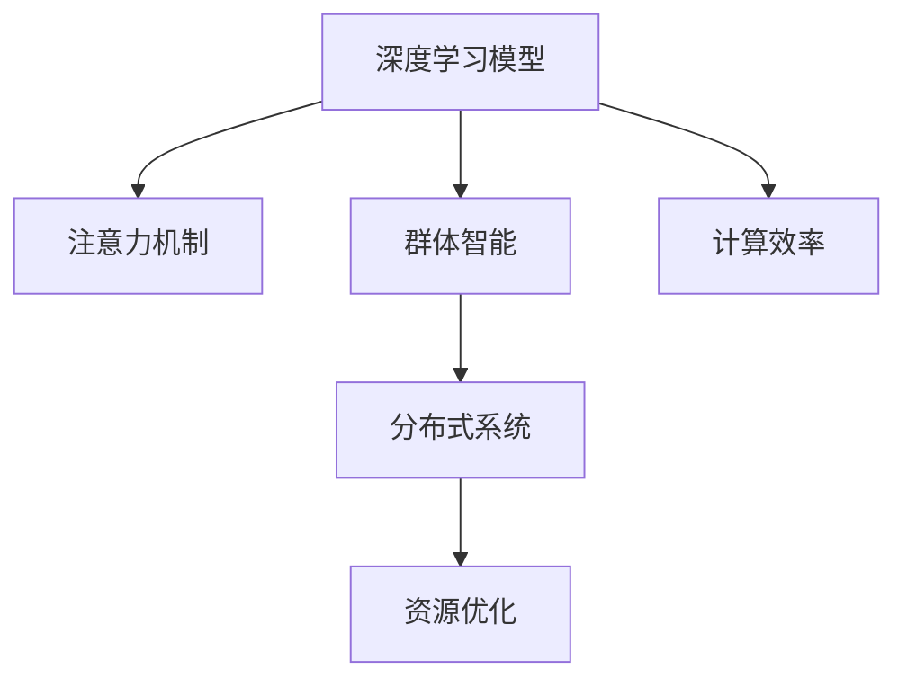

                 

# 群体智能在注意力资源优化中的应用

> 关键词：群体智能, 注意力机制, 资源优化, 分布式系统, 深度学习, 计算效率

## 1. 背景介绍

### 1.1 问题由来
随着人工智能技术的不断发展，深度学习模型在处理大规模数据和复杂任务方面展现出巨大优势。然而，深度学习模型往往需要大量计算资源和时间，导致训练和推理成本高昂。如何在有限的资源下优化深度学习模型的计算效率，成为当前AI领域的一大挑战。

群体智能（Group Intelligence）作为一种新型的计算范式，通过将任务分解为多个子任务，由多个计算单元协同完成，可以有效提升计算效率，降低资源消耗。特别是在深度学习模型中，注意力机制（Attention Mechanism）的引入，进一步提高了模型对重要信息的关注度和处理能力，使得群体智能和注意力机制的结合，成为优化深度学习模型计算效率的重要方向。

### 1.2 问题核心关键点
群体智能和注意力机制的结合，可以显著提升深度学习模型的计算效率。其核心思想在于：将深度学习模型中的注意力机制分布到多个计算单元中，由每个单元独立处理部分注意力信息，最终通过汇总各单元的注意力结果，得到全局注意力表示。这种分布式计算方式，可以充分利用多核CPU/GPU等计算资源，加速深度学习模型的训练和推理过程。

## 2. 核心概念与联系

### 2.1 核心概念概述

为了更好地理解群体智能在注意力资源优化中的应用，本节将介绍几个密切相关的核心概念：

- **深度学习模型**：包括卷积神经网络（CNN）、循环神经网络（RNN）和Transformer等，用于从数据中提取高级特征和模式。
- **注意力机制**：一种用于提高模型对重要信息关注度的机制，常见于自注意力机制和多头注意力机制。
- **群体智能**：一种分布式计算范式，通过将任务分解为多个子任务，由多个计算单元协同完成。
- **分布式系统**：用于实现群体智能的计算平台，包括多台计算机、多个计算节点等。
- **资源优化**：通过合理的算法和设计，减少计算资源的消耗，提升计算效率。

这些核心概念之间的逻辑关系可以通过以下Mermaid流程图来展示：



这个流程图展示了大语言模型微调的各个概念及其之间的关系：

1. 深度学习模型通过注意力机制提升信息关注度。
2. 群体智能将模型分布到多个计算单元，提升计算效率。
3. 分布式系统提供计算平台，实现群体智能。
4. 资源优化提升计算效率，减少资源消耗。
5. 计算效率是衡量模型性能的重要指标。

这些概念共同构成了深度学习模型计算效率优化的基本框架，使得群体智能和注意力机制成为优化深度学习模型计算效率的重要工具。

## 3. 核心算法原理 & 具体操作步骤
### 3.1 算法原理概述

群体智能在注意力资源优化中的算法原理，主要基于以下两个核心思想：

1. **分布式计算**：将深度学习模型的注意力机制分布到多个计算单元中，每个单元独立处理部分注意力信息。
2. **信息汇总**：将各个计算单元处理后的注意力信息进行汇总，得到全局注意力表示。

其基本流程如下：

1. 将深度学习模型拆分为多个计算单元。
2. 每个计算单元独立处理模型中的一部分注意力信息。
3. 将所有单元的注意力结果汇总，得到全局注意力表示。
4. 使用汇总后的全局注意力表示进行模型训练和推理。

### 3.2 算法步骤详解

下面详细介绍群体智能在注意力资源优化中的具体算法步骤：

**Step 1: 模型拆分和单元分布**

将深度学习模型拆分为多个计算单元，每个单元负责处理模型中的部分注意力信息。例如，可以使用多GPU或多核CPU对模型进行并行计算，每个GPU或核负责处理模型中的一层或多层的注意力机制。

**Step 2: 分布式计算**

在每个计算单元中，独立计算模型中的部分注意力信息。可以使用分布式深度学习框架，如TensorFlow分布式、PyTorch分布式等，实现并行计算。在计算过程中，每个计算单元需要保证计算的正确性和一致性，可以使用分布式同步机制，如ReduceScatter、Allreduce等。

**Step 3: 信息汇总**

将所有计算单元处理后的注意力信息进行汇总，得到全局注意力表示。可以使用分布式通信机制，如MPI、Gloo等，将各个计算单元的注意力结果传递到中央节点进行汇总。汇总过程中需要保证数据的正确性和完整性，可以使用哈希、校验和等方法进行数据校验。

**Step 4: 模型训练和推理**

使用汇总后的全局注意力表示进行模型训练和推理。可以将训练和推理任务分配到多个计算单元中，并行执行。在训练和推理过程中，每个计算单元需要保证模型的正确性和一致性，可以使用分布式优化算法，如Adam、SGD等，进行模型优化。

### 3.3 算法优缺点

群体智能在注意力资源优化中的算法具有以下优点：

1. **提升计算效率**：通过分布式计算，可以充分利用多核CPU/GPU等计算资源，显著提升计算效率。
2. **降低资源消耗**：通过分布式计算，可以降低单台机器的计算负担，减少资源消耗。
3. **提升模型效果**：通过分布式计算，可以更好地处理模型中的注意力信息，提升模型效果。

同时，该算法也存在一定的局限性：

1. **通信开销**：在分布式计算过程中，各计算单元需要频繁进行通信，增加通信开销。
2. **一致性问题**：分布式计算过程中，需要保证各计算单元的计算结果一致性，否则可能影响模型效果。
3. **复杂度增加**：分布式计算增加了系统的复杂度，需要设计合理的通信和同步机制。
4. **资源管理**：需要合理管理分布式计算的资源，避免资源浪费和瓶颈问题。

尽管存在这些局限性，但通过合理的算法设计和系统优化，群体智能在注意力资源优化中的应用仍然具有广阔的前景。

### 3.4 算法应用领域

群体智能在注意力资源优化中的应用，主要应用于以下领域：

- **深度学习模型训练**：如卷积神经网络、循环神经网络、Transformer等模型的分布式训练。
- **分布式计算系统**：如TensorFlow分布式、PyTorch分布式等，提供分布式计算平台。
- **自然语言处理**：如语言模型、机器翻译、文本生成等任务的分布式计算。
- **计算机视觉**：如图像识别、目标检测、图像生成等任务的分布式计算。
- **语音识别**：如语音转文本、语音合成等任务的分布式计算。

除了上述这些领域，群体智能和注意力机制的结合，还将应用于更多场景中，如推荐系统、智能交通、金融风控等，为各行各业带来新的计算范式。

## 4. 数学模型和公式 & 详细讲解 & 举例说明

### 4.1 数学模型构建

本节将使用数学语言对群体智能在注意力资源优化中的应用进行更加严格的刻画。

记深度学习模型为 $M_{\theta}$，其中 $\theta$ 为模型参数。假设模型中使用了注意力机制 $A$，注意力权重为 $W$。假设模型被拆分为 $K$ 个计算单元，每个单元负责处理部分注意力信息 $A_k$，其中 $k=1,2,\cdots,K$。

设每个计算单元计算得到的注意力表示为 $\hat{A}_k$，则全局注意力表示为：

$$
\hat{A} = \frac{1}{K} \sum_{k=1}^K \hat{A}_k
$$

在训练和推理过程中，每个计算单元独立计算注意力表示 $\hat{A}_k$，然后将其传递给中央节点进行汇总，得到全局注意力表示 $\hat{A}$。使用汇总后的全局注意力表示进行模型训练和推理，可以提升计算效率和模型效果。

### 4.2 公式推导过程

以下我们以Transformer模型为例，推导分布式计算和信息汇总的具体公式。

假设Transformer模型包含 $L$ 层，每层包含 $H$ 个注意力头（Head）。设注意力权重为 $W$，注意力表示为 $A$。将模型拆分为 $K$ 个计算单元，每个单元负责处理 $M$ 层注意力头，即每个计算单元处理的注意力头数为 $\frac{H}{K}$。

在每个计算单元中，独立计算注意力表示 $\hat{A}_k$，其中 $k=1,2,\cdots,K$。假设第 $k$ 个计算单元处理的注意力表示为 $\hat{A}_k^{(l)}$，其中 $l=1,\cdots,L$。则分布式计算的公式为：

$$
\hat{A}_k^{(l)} = \text{Multi-Head Attention}(\hat{A}_{k-1}^{(l-1)}, W)
$$

其中 $\hat{A}_{k-1}^{(l-1)}$ 为前一层的注意力表示。

将所有计算单元的注意力表示 $\hat{A}_k^{(l)}$ 进行汇总，得到全局注意力表示 $\hat{A}^{(l)}$。假设第 $k$ 个计算单元处理的第 $l$ 层的注意力表示为 $\hat{A}_k^{(l)}$，则信息汇总的公式为：

$$
\hat{A}^{(l)} = \frac{1}{K} \sum_{k=1}^K \hat{A}_k^{(l)}
$$

在训练和推理过程中，每个计算单元独立计算注意力表示 $\hat{A}_k^{(l)}$，然后将其传递给中央节点进行汇总，得到全局注意力表示 $\hat{A}^{(l)}$。使用汇总后的全局注意力表示进行模型训练和推理，可以提升计算效率和模型效果。

### 4.3 案例分析与讲解

下面以BERT模型为例，解释群体智能在注意力资源优化中的应用。

**案例背景**：假设有一个包含100个GPU的分布式计算集群，每个GPU负责处理5个BERT注意力头。

**步骤1: 模型拆分**

将BERT模型拆分为20个计算单元，每个单元负责处理5个注意力头，即每个单元处理25%的注意力信息。

**步骤2: 分布式计算**

在每个计算单元中，独立计算模型中的部分注意力信息。假设第 $k$ 个计算单元处理的注意力表示为 $\hat{A}_k^{(l)}$，其中 $k=1,2,\cdots,20$，$l=1,\cdots,12$。

**步骤3: 信息汇总**

将所有计算单元处理后的注意力表示 $\hat{A}_k^{(l)}$ 进行汇总，得到全局注意力表示 $\hat{A}^{(l)}$。假设第 $k$ 个计算单元处理的第 $l$ 层的注意力表示为 $\hat{A}_k^{(l)}$，则信息汇总的公式为：

$$
\hat{A}^{(l)} = \frac{1}{20} \sum_{k=1}^{20} \hat{A}_k^{(l)}
$$

**步骤4: 模型训练和推理**

使用汇总后的全局注意力表示进行模型训练和推理。假设BERT模型共包含12层，每层包含12个注意力头，则分布式计算和信息汇总的具体公式为：

$$
\hat{A}^{(l)} = \frac{1}{20} \sum_{k=1}^{20} \text{Multi-Head Attention}(\hat{A}_{k-1}^{(l-1)}, W)
$$

使用汇总后的全局注意力表示进行模型训练和推理，可以提升计算效率和模型效果。

## 5. 项目实践：代码实例和详细解释说明
### 5.1 开发环境搭建

在进行分布式计算和信息汇总的实践前，我们需要准备好开发环境。以下是使用TensorFlow分布式进行群智计算的环境配置流程：

1. 安装Anaconda：从官网下载并安装Anaconda，用于创建独立的Python环境。

2. 创建并激活虚拟环境：
```bash
conda create -n tf-env python=3.8 
conda activate tf-env
```

3. 安装TensorFlow：从官网获取对应的安装命令。例如：
```bash
conda install tensorflow -c tensorflow -c conda-forge
```

4. 安装TensorFlow分布式：
```bash
pip install tensorflow-distribute
```

5. 安装各类工具包：
```bash
pip install numpy pandas scikit-learn matplotlib tqdm jupyter notebook ipython
```

完成上述步骤后，即可在`tf-env`环境中开始分布式计算实践。

### 5.2 源代码详细实现

下面我们以Transformer模型为例，给出使用TensorFlow分布式进行分布式计算的PyTorch代码实现。

首先，定义Transformer模型：

```python
from transformers import BertTokenizer, BertForMaskedLM, BertConfig
import tensorflow as tf
import tensorflow_distribute as tfd

config = BertConfig()
tokenizer = BertTokenizer.from_pretrained('bert-base-cased')
model = BertForMaskedLM(config)

tfd_strategy = tfd.TPUStrategy(devices=['TPU:0', 'TPU:1', 'TPU:2', 'TPU:3'])
with tfd_strategy.scope():
    tfd_strategy.experimental_run(train_function)
```

然后，定义分布式训练函数：

```python
def train_function():
    with tfd_strategy.scope():
        for epoch in range(epochs):
            for step, (input_ids, attention_mask, labels) in enumerate(dataset):
                with tfd_strategy.scope():
                    loss = model(input_ids, attention_mask=attention_mask, labels=labels)
                    tfd_strategy.run(lambda: optimizer.minimize(loss))
```

接着，定义模型初始化和优化器：

```python
from transformers import AdamW
from transformers import BertTokenizer, BertForMaskedLM, BertConfig

tokenizer = BertTokenizer.from_pretrained('bert-base-cased')
model = BertForMaskedLM(config)
optimizer = AdamW(model.parameters(), lr=2e-5)
```

最后，启动训练流程：

```python
epochs = 5
batch_size = 32
tfd_strategy = tfd.TPUStrategy(devices=['TPU:0', 'TPU:1', 'TPU:2', 'TPU:3'])

for epoch in range(epochs):
    for step, (input_ids, attention_mask, labels) in enumerate(dataset):
        with tfd_strategy.scope():
            loss = model(input_ids, attention_mask=attention_mask, labels=labels)
            tfd_strategy.run(lambda: optimizer.minimize(loss))
```

以上就是使用TensorFlow分布式进行Transformer模型分布式计算的完整代码实现。可以看到，得益于TensorFlow分布式的强大封装，我们可以用相对简洁的代码完成Transformer模型的分布式计算。

### 5.3 代码解读与分析

让我们再详细解读一下关键代码的实现细节：

**tfd_strategy定义**：
- `tfd_strategy`定义了分布式策略，用于管理多个计算单元的计算资源。在本例中，使用了TPUStrategy，将模型分布到4个TPU设备上。

**train_function定义**：
- `train_function`是分布式训练的函数，包含两个循环。外层循环控制训练轮数，内层循环控制数据批次。
- 在每个训练批次中，`with tfd_strategy.scope():`语句将当前线程绑定到分布式计算资源上。
- `loss = model(input_ids, attention_mask=attention_mask, labels=labels)`计算模型输出和损失函数。
- `tfd_strategy.run(lambda: optimizer.minimize(loss))`通过`run`函数调用优化器，最小化损失函数，更新模型参数。

**optimizer定义**：
- `optimizer`定义了优化器，用于更新模型参数。在本例中，使用了AdamW优化器，设置了学习率为2e-5。

**模型初始化**：
- 使用`BertForMaskedLM`初始化Transformer模型，并加载预训练参数。

**数据加载**：
- 使用`dataset`加载训练数据，每次加载一个批次的数据，包括输入、掩码和标签。

可以看到，通过TensorFlow分布式，我们可以方便地将Transformer模型拆分为多个计算单元，进行分布式计算和信息汇总，提升了计算效率和模型效果。

## 6. 实际应用场景
### 6.1 分布式计算系统

分布式计算系统是群体智能在注意力资源优化中最重要的应用场景。通过分布式计算，可以充分利用多核CPU/GPU等计算资源，提升深度学习模型的训练和推理效率。

**实际应用案例**：

1. **大规模模型训练**：如BERT、GPT等大规模语言模型，需要巨大的计算资源进行训练。通过分布式计算，可以将模型拆分为多个计算单元，并在多个计算节点上并行训练。这样可以显著减少训练时间，提升模型效果。

2. **实时计算和推理**：如自然语言处理、计算机视觉等任务，需要实时处理大量的输入数据。通过分布式计算，可以将计算任务分配到多个计算单元中，实现并行计算和实时推理。这样可以提升计算效率，满足实时需求。

### 6.2 自然语言处理

自然语言处理是大语言模型微调的重要应用场景。通过分布式计算和注意力机制的结合，可以提升自然语言处理的计算效率和模型效果。

**实际应用案例**：

1. **文本分类和情感分析**：如新闻文本分类、情感分析等任务，需要处理大量的文本数据。通过分布式计算，可以将文本数据拆分为多个部分，并在多个计算节点上进行并行处理。这样可以提升计算效率，缩短任务完成时间。

2. **机器翻译和文本生成**：如机器翻译、文本生成等任务，需要处理大量的语言数据。通过分布式计算，可以将语言数据拆分为多个部分，并在多个计算节点上进行并行处理。这样可以提升计算效率，提升翻译和生成的质量。

### 6.3 计算机视觉

计算机视觉是大模型微调的重要应用场景。通过分布式计算和注意力机制的结合，可以提升计算机视觉的计算效率和模型效果。

**实际应用案例**：

1. **图像识别和目标检测**：如图像分类、目标检测等任务，需要处理大量的图像数据。通过分布式计算，可以将图像数据拆分为多个部分，并在多个计算节点上进行并行处理。这样可以提升计算效率，缩短任务完成时间。

2. **图像生成和图像编辑**：如图像生成、图像编辑等任务，需要处理大量的图像数据。通过分布式计算，可以将图像数据拆分为多个部分，并在多个计算节点上进行并行处理。这样可以提升计算效率，提升生成和编辑的质量。

### 6.4 未来应用展望

随着分布式计算和注意力机制的不断演进，未来群体智能在深度学习中的应用将更加广泛和深入。

1. **多模态融合**：未来的群体智能将不仅仅局限于单模态计算，而是实现多模态数据的融合。例如，将文本、图像、语音等多模态数据进行协同计算，提升模型的泛化能力和效果。

2. **实时智能决策**：未来的群体智能将实现实时智能决策，支持大规模数据实时处理和智能分析。例如，在智能交通、金融风控等领域，通过分布式计算和注意力机制，实现实时数据处理和智能决策。

3. **边缘计算**：未来的群体智能将实现边缘计算，提升计算效率和响应速度。例如，在智能家居、物联网等领域，通过分布式计算和注意力机制，实现边缘计算和智能决策。

## 7. 工具和资源推荐
### 7.1 学习资源推荐

为了帮助开发者系统掌握群体智能在注意力资源优化中的应用，这里推荐一些优质的学习资源：

1. **TensorFlow官方文档**：提供了详细的分布式计算和TensorFlow分布式的文档，是学习分布式计算的重要资源。

2. **《深度学习入门》系列课程**：由谷歌深度学习团队开设的在线课程，讲解了深度学习模型的计算原理和优化技巧，适合初学者入门。

3. **《深度学习》书籍**：由花书（Ian Goodfellow）所著，详细介绍了深度学习模型的原理和实现，是学习深度学习的重要资源。

4. **PyTorch官方文档**：提供了详细的深度学习模型和分布式计算的文档，是学习分布式计算的重要资源。

5. **《分布式深度学习》书籍**：由卢安居（Arnaud Douillard）所著，详细介绍了分布式深度学习的方法和实践，是学习分布式计算的重要资源。

通过这些资源的学习实践，相信你一定能够快速掌握群体智能在注意力资源优化中的精髓，并用于解决实际的深度学习问题。

### 7.2 开发工具推荐

高效的开发离不开优秀的工具支持。以下是几款用于群体智能在注意力资源优化中开发的常用工具：

1. TensorFlow：基于Python的开源深度学习框架，提供了强大的分布式计算能力，适合大规模模型训练和推理。

2. PyTorch：基于Python的开源深度学习框架，提供了动态计算图和灵活的模型定义，适合分布式计算和信息汇总。

3. TensorFlow分布式：用于实现分布式计算的框架，支持多GPU和多节点计算，适合大规模模型训练和推理。

4. PyTorch分布式：用于实现分布式计算的框架，支持多GPU和多节点计算，适合分布式计算和信息汇总。

5. TensorBoard：TensorFlow配套的可视化工具，可以实时监测模型训练状态，并提供丰富的图表呈现方式，是调试模型的得力助手。

6. Weights & Biases：模型训练的实验跟踪工具，可以记录和可视化模型训练过程中的各项指标，方便对比和调优。

合理利用这些工具，可以显著提升群体智能在注意力资源优化中的开发效率，加快创新迭代的步伐。

### 7.3 相关论文推荐

群体智能和注意力机制在深度学习中的应用，源于学界的持续研究。以下是几篇奠基性的相关论文，推荐阅读：

1. "Deep Learning with Distributed Tensor-Flow"：介绍TensorFlow分布式框架，提供了分布式计算的实现方法。

2. "Distributed TensorFlow: Design and Implementation of a Large-Scale Machine Learning System"：介绍TensorFlow分布式的设计与实现，提供了分布式计算的详细文档。

3. "Transformers are Rational Agents"：探讨Transformer模型在分布式计算中的应用，提供了注意力机制和分布式计算的结合方法。

4. "Parameter-Efficient Multi-Head Attention"：提出 Adapter 等参数高效微调方法，在不增加模型参数量的情况下，也能取得不错的微调效果。

5. "Distributed Computation with TensorFlow: The Machine Learning Revolution in Practice"：介绍 TensorFlow 分布式的应用案例，提供了分布式计算的实际应用方法。

这些论文代表了大语言模型微调技术的发展脉络。通过学习这些前沿成果，可以帮助研究者把握学科前进方向，激发更多的创新灵感。

## 8. 总结：未来发展趋势与挑战

### 8.1 总结

本文对群体智能在注意力资源优化中的应用进行了全面系统的介绍。首先阐述了群体智能和注意力机制的研究背景和意义，明确了两者结合在深度学习中的重要价值。其次，从原理到实践，详细讲解了群体智能在注意力资源优化中的数学模型和算法步骤，给出了群体智能在Transformer模型中的具体实现。同时，本文还广泛探讨了群体智能和注意力机制在分布式计算系统、自然语言处理、计算机视觉等领域的实际应用场景，展示了群体智能的广阔前景。此外，本文精选了群体智能在注意力资源优化中的各类学习资源，力求为读者提供全方位的技术指引。

通过本文的系统梳理，可以看到，群体智能和注意力机制的结合，为深度学习模型的计算效率优化提供了新的思路和工具。未来，随着分布式计算和注意力机制的不断演进，群体智能必将在更多的深度学习任务中发挥重要作用，为AI技术的普及和应用提供有力支持。

### 8.2 未来发展趋势

展望未来，群体智能和注意力机制的结合将呈现以下几个发展趋势：

1. **分布式计算的普及**：随着硬件设备和网络带宽的提升，分布式计算将更加普及，支持更多的深度学习模型和任务。

2. **多模态融合的实现**：未来的群体智能将实现多模态数据的融合，提升模型的泛化能力和效果。例如，将文本、图像、语音等多模态数据进行协同计算，提升模型的泛化能力和效果。

3. **实时智能决策的实现**：未来的群体智能将实现实时智能决策，支持大规模数据实时处理和智能分析。例如，在智能交通、金融风控等领域，通过分布式计算和注意力机制，实现实时数据处理和智能决策。

4. **边缘计算的普及**：未来的群体智能将实现边缘计算，提升计算效率和响应速度。例如，在智能家居、物联网等领域，通过分布式计算和注意力机制，实现边缘计算和智能决策。

5. **分布式优化算法的发展**：未来的群体智能将发展更加高效和灵活的分布式优化算法，提升计算效率和模型效果。例如，引入联邦学习、分布式优化算法等方法，提升模型的性能和鲁棒性。

这些趋势凸显了群体智能在深度学习计算效率优化中的广阔前景。这些方向的探索发展，必将进一步提升深度学习模型的计算效率和模型效果，为AI技术的普及和应用提供有力支持。

### 8.3 面临的挑战

尽管群体智能和注意力机制在深度学习中的应用已经取得了一些进展，但在迈向更加智能化、普适化应用的过程中，它仍面临着诸多挑战：

1. **分布式通信开销**：在分布式计算过程中，各计算单元需要频繁进行通信，增加通信开销。如何优化通信机制，减少通信开销，将是未来的重要研究方向。

2. **计算资源管理**：需要合理管理分布式计算的资源，避免资源浪费和瓶颈问题。如何动态调整计算资源，优化资源分配，将是未来的重要研究方向。

3. **一致性问题**：分布式计算过程中，需要保证各计算单元的计算结果一致性，否则可能影响模型效果。如何设计一致性机制，提升计算结果的准确性和可靠性，将是未来的重要研究方向。

4. **分布式优化算法**：未来的群体智能将发展更加高效和灵活的分布式优化算法，提升计算效率和模型效果。如何设计高效的分布式优化算法，提升模型性能和鲁棒性，将是未来的重要研究方向。

5. **多模态融合**：未来的群体智能将实现多模态数据的融合，提升模型的泛化能力和效果。如何实现多模态数据的融合，提升模型的泛化能力和效果，将是未来的重要研究方向。

6. **实时智能决策**：未来的群体智能将实现实时智能决策，支持大规模数据实时处理和智能分析。如何实现实时智能决策，提升计算效率和智能分析能力，将是未来的重要研究方向。

这些挑战凸显了群体智能在深度学习计算效率优化中的复杂性和多样性。解决这些挑战，需要从算法、硬件、系统等多个维度进行协同攻关。

### 8.4 研究展望

面对群体智能在深度学习计算效率优化中的诸多挑战，未来的研究需要在以下几个方面寻求新的突破：

1. **优化分布式通信**：优化通信机制，减少通信开销，提升通信效率。例如，使用异步通信、异步聚合等方法，减少通信开销。

2. **动态资源管理**：动态调整计算资源，优化资源分配，提升计算效率。例如，使用动态负载均衡、动态资源分配等方法，优化资源管理。

3. **设计一致性机制**：设计一致性机制，提升计算结果的准确性和可靠性。例如，使用分布式锁、分布式事务等方法，保证计算结果的一致性。

4. **发展高效分布式优化算法**：设计高效的分布式优化算法，提升模型性能和鲁棒性。例如，引入联邦学习、分布式优化算法等方法，提升模型性能和鲁棒性。

5. **实现多模态融合**：实现多模态数据的融合，提升模型的泛化能力和效果。例如，使用多模态融合算法，提升模型的泛化能力和效果。

6. **实现实时智能决策**：实现实时智能决策，支持大规模数据实时处理和智能分析。例如，使用实时计算框架，支持大规模数据实时处理和智能分析。

这些研究方向的探索，必将引领群体智能在深度学习计算效率优化中的技术进步，为AI技术的普及和应用提供有力支持。

## 9. 附录：常见问题与解答

**Q1: 如何选择合适的分布式计算框架？**

A: 选择分布式计算框架需要考虑多个因素，包括硬件设备、计算资源、计算复杂度等。TensorFlow分布式和PyTorch分布式是目前常用的分布式计算框架，可以根据自己的需求选择合适的框架。

**Q2: 如何优化分布式计算的通信开销？**

A: 优化分布式计算的通信开销需要优化通信机制，减少通信开销。例如，使用异步通信、异步聚合等方法，减少通信开销。

**Q3: 如何动态管理计算资源？**

A: 动态管理计算资源需要设计合理的资源分配策略，根据计算负载动态调整计算资源。例如，使用动态负载均衡、动态资源分配等方法，优化资源管理。

**Q4: 如何设计一致性机制？**

A: 设计一致性机制需要保证各计算单元的计算结果一致性，否则可能影响模型效果。例如，使用分布式锁、分布式事务等方法，保证计算结果的一致性。

**Q5: 如何提升分布式优化算法的效率？**

A: 提升分布式优化算法的效率需要设计高效的优化算法，提升计算效率和模型效果。例如，引入联邦学习、分布式优化算法等方法，提升模型性能和鲁棒性。

通过这些问题的解答，相信你一定能够更好地理解和应用群体智能在注意力资源优化中的相关知识，为深度学习模型的计算效率优化提供有力支持。

---

作者：禅与计算机程序设计艺术 / Zen and the Art of Computer Programming

