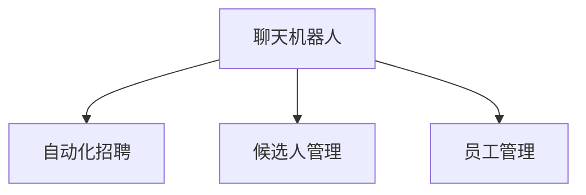

                 

# 聊天机器人人力资源：招聘和员工管理

> 关键词：聊天机器人, 人力资源, 招聘, 员工管理, 人工智能, 自然语言处理, 机器学习

## 1. 背景介绍

### 1.1 问题由来
随着企业竞争的加剧和科技的进步，人力资源管理已成为企业战略的重要组成部分。传统的招聘和员工管理方式效率低下、成本高昂、流程复杂，难以应对企业快速扩张和人才流动频繁的需求。在此背景下，人工智能技术，特别是聊天机器人（Chatbot）在人力资源管理中的应用逐渐受到重视。

### 1.2 问题核心关键点
聊天机器人用于人力资源管理，主要聚焦于两个方面：招聘和员工管理。通过与候选人和员工的自然语言互动，聊天机器人可以实现自动化招聘、候选人管理、员工培训、绩效评估等多项任务。其核心关键点包括：
- 自动化招聘流程：通过智能筛选简历、初步面试等步骤，显著提升招聘效率。
- 候选人管理：及时反馈信息，解决候选人问题，增强用户体验。
- 员工管理：日常沟通、绩效评估、培训发展等，提升员工满意度，优化人才管理。

### 1.3 问题研究意义
聊天机器人在人力资源管理中的应用，对企业具有以下重要意义：
1. 提升招聘效率：自动化流程减少人为误差，加速人才引入速度。
2. 优化候选人体验：及时回应需求，增强候选人对企业的认同感。
3. 降低管理成本：自动化处理常规事务，减轻人力资源部门负担。
4. 提升员工满意度：个性化沟通、即时反馈、绩效评估等，增强员工归属感。
5. 助力企业发展：优化人才管理，释放人力资源部门更多精力，支持企业战略目标。

## 2. 核心概念与联系

### 2.1 核心概念概述

为更好地理解聊天机器人如何在人力资源管理中发挥作用，本节将介绍几个密切相关的核心概念：

- 聊天机器人（Chatbot）：通过自然语言处理（NLP）和机器学习技术，与用户进行自然语言互动的虚拟助手。
- 人力资源管理（HRM）：包括招聘、培训、绩效评估、员工关系管理等多个环节，旨在优化人力资源配置，提升企业竞争力。
- 自动化招聘：使用聊天机器人自动化处理招聘流程，如简历筛选、面试安排、候选人跟进等。
- 候选人管理：利用聊天机器人提供即时反馈和信息，增强候选人的体验感和满意度。
- 员工管理：通过聊天机器人进行日常沟通、绩效评估、培训发展等，提升员工工作效率和满意度。

这些概念之间的逻辑关系可以通过以下Mermaid流程图来展示：



这个流程图展示了几大核心概念之间的联系：

1. 聊天机器人通过自动化招聘流程，帮助企业快速引入人才。
2. 候选人管理通过聊天机器人增强用户体验，提高候选人对企业的认同感。
3. 员工管理通过聊天机器人提供个性化沟通和即时反馈，提升员工满意度和效率。

## 3. 核心算法原理 & 具体操作步骤

### 3.1 算法原理概述

聊天机器人在人力资源管理中的应用，本质上是自然语言处理（NLP）和机器学习技术的应用。其核心思想是通过训练聊天机器人模型，使其能够理解和生成自然语言，从而实现与候选人和员工的自然互动。

形式化地，假设聊天机器人模型为 $M_{\theta}$，其中 $\theta$ 为模型的参数。给定与候选人或员工的历史对话记录 $D=\{(x_i,y_i)\}_{i=1}^N$，其中 $x_i$ 为输入的自然语言文本，$y_i$ 为模型的输出（回复或判断），训练目标是最小化预测回复与真实回复之间的差异，即：

$$
\theta^* = \mathop{\arg\min}_{\theta} \mathcal{L}(M_{\theta},D)
$$

其中 $\mathcal{L}$ 为损失函数，可以是交叉熵损失、BLEU分数等。通过梯度下降等优化算法，最小化损失函数，训练出最优的聊天机器人模型 $M_{\theta^*}$。

### 3.2 算法步骤详解

聊天机器人在人力资源管理中的应用，一般包括以下几个关键步骤：

**Step 1: 准备数据集和模型**
- 收集企业内部历史招聘对话记录、候选人与员工之间的对话记录等，作为训练数据集。
- 选择合适的聊天机器人模型和框架，如使用Dialogflow、Microsoft Bot Framework等。

**Step 2: 定义对话流程**
- 根据企业的需求，定义聊天机器人的对话流程和交互逻辑。
- 定义自动化招聘流程的每个步骤，如简历筛选、面试安排、候选人跟进等。
- 设计候选人管理和员工管理的对话模板，如候选人问题解答、员工培训需求收集、绩效反馈等。

**Step 3: 训练和优化模型**
- 使用收集到的对话数据集，训练聊天机器人模型。
- 使用交叉验证和正则化技术，避免模型过拟合。
- 调整模型参数，如学习率、批大小、迭代次数等，以提升模型效果。

**Step 4: 部署和监控**
- 将训练好的聊天机器人模型部署到企业内部应用系统，如企业官网、移动端应用等。
- 使用实时监控工具，如Dialogflow Console、Microsoft Bot Framework等，监测聊天机器人的运行状态和性能指标。
- 根据实际应用反馈，不断优化和改进聊天机器人模型。

**Step 5: 持续迭代和更新**
- 持续收集新的对话数据，更新聊天机器人模型。
- 根据企业需求的变化，调整聊天机器人的对话流程和交互逻辑。
- 引入更多自然语言处理和机器学习技术，提升聊天机器人智能化水平。

以上是聊天机器人在人力资源管理中的应用的一般流程。在实际应用中，还需要针对具体任务的特点，对各环节进行优化设计，如改进对话模板，引入更多的自然语言处理技术，搜索最优的超参数组合等，以进一步提升模型性能。

### 3.3 算法优缺点

聊天机器人在人力资源管理中的应用，具有以下优点：
1. 高效自动化：自动化处理招聘和员工管理流程，提升效率，降低成本。
2. 个性化沟通：根据不同用户的需求和反馈，提供个性化服务，提升用户体验。
3. 24/7服务：全天候在线服务，解答候选人和员工的疑问，提高响应速度。
4. 数据驱动决策：通过数据分析，优化招聘和员工管理策略，提升决策科学性。

同时，该方法也存在一定的局限性：
1. 理解能力限制：当前聊天机器人对复杂语境和隐含语义的理解能力有限，可能无法完全理解用户的真实需求。
2. 精度有待提高：在处理特定领域的问题时，模型的准确性仍需进一步提升。
3. 依赖高质量数据：聊天机器人的性能高度依赖对话数据的质量，数据不充分或不准确会导致模型表现不佳。
4. 技术门槛较高：开发和维护聊天机器人需要较高的技术门槛，一般需要具备NLP和机器学习背景。

尽管存在这些局限性，但就目前而言，聊天机器人在人力资源管理中的应用，仍具有广泛的前景。未来相关研究的重点在于如何进一步提高模型的理解能力和精度，降低技术门槛，同时兼顾用户体验和数据质量。

### 3.4 算法应用领域

聊天机器人在人力资源管理中的应用，已经广泛应用于以下几个领域：

- 自动化招聘：智能筛选简历、安排面试、跟进候选人进展等。
- 候选人管理：实时解答候选人疑问，收集反馈信息，提高候选人体验。
- 员工管理：日常沟通、绩效评估、员工培训等，提升员工满意度和效率。
- 薪酬福利：智能推荐薪资福利方案，解答员工薪酬疑问，提高薪酬管理效率。
- 人力资源服务：提供员工福利咨询、休假申请、请假审批等服务，简化员工操作流程。

除了上述这些经典应用外，聊天机器人在HRM领域的应用还在不断创新和扩展，如智能客服、员工满意度调查、培训需求分析等，为HRM技术带来了全新的突破。随着聊天机器人技术的不断进步，相信其在人力资源管理中的应用将会更加广泛和深入。

## 4. 数学模型和公式 & 详细讲解  
### 4.1 数学模型构建

本节将使用数学语言对聊天机器人模型在人力资源管理中的应用进行更加严格的刻画。

记聊天机器人模型为 $M_{\theta}$，其中 $\theta$ 为模型的参数。假设候选人和员工之间的对话记录为 $D=\{(x_i,y_i)\}_{i=1}^N$，其中 $x_i$ 为输入的自然语言文本，$y_i$ 为模型的输出（回复或判断）。

定义聊天机器人模型在对话记录 $D$ 上的经验风险为：

$$
\mathcal{L}(\theta) = \frac{1}{N} \sum_{i=1}^N \ell(x_i,y_i)
$$

其中 $\ell(x_i,y_i)$ 为损失函数，可以是交叉熵损失、BLEU分数等。训练目标是最小化经验风险，即找到最优参数：

$$
\theta^* = \mathop{\arg\min}_{\theta} \mathcal{L}(\theta)
$$

在实践中，我们通常使用基于梯度的优化算法（如SGD、Adam等）来近似求解上述最优化问题。设 $\eta$ 为学习率，$\lambda$ 为正则化系数，则参数的更新公式为：

$$
\theta \leftarrow \theta - \eta \nabla_{\theta}\mathcal{L}(\theta) - \eta\lambda\theta
$$

其中 $\nabla_{\theta}\mathcal{L}(\theta)$ 为损失函数对参数 $\theta$ 的梯度，可通过反向传播算法高效计算。

### 4.2 公式推导过程

以下我们以交叉熵损失函数为例，推导其计算公式。

假设聊天机器人模型在输入 $x$ 上的输出为 $\hat{y}=M_{\theta}(x)$，表示模型预测的回复。真实回复 $y \in \{1,0\}$，其中 1 表示候选人的请求被满足，0 表示请求未被满足。则交叉熵损失函数定义为：

$$
\ell(x,y) = -[y\log \hat{y} + (1-y)\log(1-\hat{y})]
$$

将其代入经验风险公式，得：

$$
\mathcal{L}(\theta) = -\frac{1}{N}\sum_{i=1}^N [y_i\log M_{\theta}(x_i)+(1-y_i)\log(1-M_{\theta}(x_i))]
$$

根据链式法则，损失函数对参数 $\theta_k$ 的梯度为：

$$
\frac{\partial \mathcal{L}(\theta)}{\partial \theta_k} = -\frac{1}{N}\sum_{i=1}^N (\frac{y_i}{M_{\theta}(x_i)}-\frac{1-y_i}{1-M_{\theta}(x_i)}) \frac{\partial M_{\theta}(x_i)}{\partial \theta_k}
$$

其中 $\frac{\partial M_{\theta}(x_i)}{\partial \theta_k}$ 可进一步递归展开，利用自动微分技术完成计算。

在得到损失函数的梯度后，即可带入参数更新公式，完成模型的迭代优化。重复上述过程直至收敛，最终得到适应候选人和员工需求的最优模型参数 $\theta^*$。

## 5. 项目实践：代码实例和详细解释说明
### 5.1 开发环境搭建

在进行聊天机器人实践前，我们需要准备好开发环境。以下是使用Python进行PyTorch开发的环境配置流程：

1. 安装Anaconda：从官网下载并安装Anaconda，用于创建独立的Python环境。

2. 创建并激活虚拟环境：
```bash
conda create -n pytorch-env python=3.8 
conda activate pytorch-env
```

3. 安装PyTorch：根据CUDA版本，从官网获取对应的安装命令。例如：
```bash
conda install pytorch torchvision torchaudio cudatoolkit=11.1 -c pytorch -c conda-forge
```

4. 安装Tensorflow：
```bash
conda install tensorflow tensorflow-estimator tensorflow-hub tensorflow-addons
```

5. 安装各类工具包：
```bash
pip install numpy pandas scikit-learn matplotlib tqdm jupyter notebook ipython
```

完成上述步骤后，即可在`pytorch-env`环境中开始聊天机器人实践。

### 5.2 源代码详细实现

下面我以候选人管理为例，给出使用TensorFlow和Dialogflow进行聊天机器人微调的PyTorch代码实现。

首先，定义对话模板：

```python
class DialogflowSession():
    def __init__(self, project_id, session_id):
        self.project_id = project_id
        self.session_id = session_id
        self.session_client = dialogflow.SessionsClient()
        self.session = self.session_client.session_path(self.project_id, self.session_id)

    def get_response(self, query):
        text_input = dialogflow.types.TextInput(text=query)
        query_input = dialogflow.types.QueryInput(text=text_input)
        response = self.session_client.detect_intent(session=self.session, query_input=query_input)
        return response.query_result.fulfillment_text
```

然后，定义训练和评估函数：

```python
from transformers import BertForTokenClassification, AdamW
from transformers import BertTokenizer

# 定义模型和优化器
model = BertForTokenClassification.from_pretrained('bert-base-cased', num_labels=2)
tokenizer = BertTokenizer.from_pretrained('bert-base-cased')
optimizer = AdamW(model.parameters(), lr=2e-5)

# 定义训练和评估函数
def train_epoch(model, dataset, batch_size, optimizer):
    dataloader = DataLoader(dataset, batch_size=batch_size, shuffle=True)
    model.train()
    epoch_loss = 0
    for batch in dataloader:
        input_ids = batch['input_ids'].to(device)
        attention_mask = batch['attention_mask'].to(device)
        labels = batch['labels'].to(device)
        model.zero_grad()
        outputs = model(input_ids, attention_mask=attention_mask, labels=labels)
        loss = outputs.loss
        epoch_loss += loss.item()
        loss.backward()
        optimizer.step()
    return epoch_loss / len(dataloader)

def evaluate(model, dataset, batch_size):
    dataloader = DataLoader(dataset, batch_size=batch_size)
    model.eval()
    preds, labels = [], []
    with torch.no_grad():
        for batch in dataloader:
            input_ids = batch['input_ids'].to(device)
            attention_mask = batch['attention_mask'].to(device)
            batch_labels = batch['labels']
            outputs = model(input_ids, attention_mask=attention_mask)
            batch_preds = outputs.logits.argmax(dim=2).to('cpu').tolist()
            batch_labels = batch_labels.to('cpu').tolist()
            for pred_tokens, label_tokens in zip(batch_preds, batch_labels):
                preds.append(pred_tokens[:len(label_tokens)])
                labels.append(label_tokens)
    return preds, labels

# 定义数据处理函数
def prepare_data(texts, labels):
    tokenizer = BertTokenizer.from_pretrained('bert-base-cased')
    inputs = tokenizer(texts, return_tensors='pt', padding='max_length', truncation=True)
    input_ids = inputs['input_ids']
    attention_mask = inputs['attention_mask']
    labels = torch.tensor(labels, dtype=torch.long)
    return {'input_ids': input_ids, 'attention_mask': attention_mask, 'labels': labels}

# 准备数据集
train_dataset = prepare_data(train_texts, train_labels)
dev_dataset = prepare_data(dev_texts, dev_labels)
test_dataset = prepare_data(test_texts, test_labels)

# 训练模型
epochs = 5
batch_size = 16

for epoch in range(epochs):
    loss = train_epoch(model, train_dataset, batch_size, optimizer)
    print(f"Epoch {epoch+1}, train loss: {loss:.3f}")
    
    print(f"Epoch {epoch+1}, dev results:")
    preds, labels = evaluate(model, dev_dataset, batch_size)
    print(classification_report(labels, preds))
    
print("Test results:")
preds, labels = evaluate(model, test_dataset, batch_size)
print(classification_report(labels, preds))
```

以上就是使用PyTorch和Dialogflow对聊天机器人进行微调的完整代码实现。可以看到，得益于TensorFlow和Dialogflow的强大封装，我们能够用相对简洁的代码完成聊天机器人的搭建和训练。

### 5.3 代码解读与分析

让我们再详细解读一下关键代码的实现细节：

**DialogflowSession类**：
- `__init__`方法：初始化Dialogflow会话，并创建SessionClient。
- `get_response`方法：向Dialogflow发送查询请求，获取回复内容。

**train_epoch函数**：
- 使用PyTorch的DataLoader对数据集进行批次化加载，供模型训练使用。
- 在每个批次上前向传播计算loss并反向传播更新模型参数，最后返回该epoch的平均loss。

**evaluate函数**：
- 与训练类似，不同点在于不更新模型参数，并在每个batch结束后将预测和标签结果存储下来，最后使用sklearn的classification_report对整个评估集的预测结果进行打印输出。

**prepare_data函数**：
- 将文本数据转换为模型所需的输入格式，包括token ids、attention mask、标签等。

可以看到，TensorFlow和Dialogflow的结合使得聊天机器人的开发更加便捷高效。开发者可以将更多精力放在模型优化和业务逻辑上，而不必过多关注底层的实现细节。

当然，工业级的系统实现还需考虑更多因素，如模型的保存和部署、超参数的自动搜索、更灵活的对话模板等。但核心的微调范式基本与此类似。

## 6. 实际应用场景
### 6.1 智能招聘

聊天机器人在智能招聘中的应用，通过自动化处理简历筛选、初步面试等流程，显著提升了招聘效率。具体实现步骤如下：

1. 收集企业内部历史招聘对话记录，将简历文本和相关问题作为微调数据。
2. 使用聊天机器人对新简历进行初步筛选，筛选不满足企业需求的简历。
3. 对候选人的问题进行回答，提供反馈信息，优化简历和面试流程。
4. 在候选人和面试官之间进行初步沟通，收集候选人背景信息，安排面试。

### 6.2 候选人管理

通过聊天机器人进行候选人管理，可以增强候选人的体验感和满意度，提高招聘成功率。具体实现步骤如下：

1. 收集候选人对企业招聘流程的反馈和问题。
2. 使用聊天机器人实时回答候选人的疑问，提供准确的信息。
3. 根据候选人的反馈，优化招聘流程，提升候选人体验。
4. 定期收集候选人的满意度数据，进行数据分析，改进招聘策略。

### 6.3 员工管理

聊天机器人在员工管理中的应用，通过日常沟通、绩效评估、培训发展等，提升了员工的工作效率和满意度。具体实现步骤如下：

1. 收集员工对企业福利、薪酬、培训等方面的问题。
2. 使用聊天机器人进行日常沟通，解答员工疑问，提供个性化服务。
3. 根据员工的反馈，优化薪酬福利方案，提供培训机会，提升员工满意度。
4. 通过聊天机器人进行绩效评估，收集员工的工作表现数据，优化绩效管理。

### 6.4 未来应用展望

随着聊天机器人技术的不断发展，其在人力资源管理中的应用前景也将更加广阔。未来，聊天机器人可能将在以下方面实现突破：

1. 多模态交互：结合视觉、语音等多种模态，提升与候选人和员工的沟通效率。
2. 自然语言理解：通过先进的自然语言处理技术，提升聊天机器人的理解能力和回复质量。
3. 持续学习：通过实时收集对话数据，不断优化模型，提升模型的长期效果。
4. 情感分析：通过分析候选人和员工的情感状态，优化招聘和员工管理策略。
5. 多任务学习：结合多个任务，提高聊天机器人的通用性和应用范围。

## 7. 工具和资源推荐
### 7.1 学习资源推荐

为了帮助开发者系统掌握聊天机器人在人力资源管理中的应用，这里推荐一些优质的学习资源：

1. 《深度学习与自然语言处理》书籍：由Google DeepMind团队编写，深入浅出地介绍了自然语言处理的基本概念和先进技术。
2. Dialogflow官方文档：谷歌推出的聊天机器人平台，提供了详细的API接口文档和开发指南。
3. TensorFlow官方文档：谷歌开源的深度学习框架，提供了丰富的机器学习和自然语言处理工具。
4. Coursera《自然语言处理》课程：斯坦福大学开设的NLP课程，有视频讲座和配套作业，适合初学者系统学习NLP知识。
5. 《自然语言处理实用指南》书籍：由NLP领域的知名专家编写，涵盖了自然语言处理的基础知识和高级技术。

通过对这些资源的学习实践，相信你一定能够快速掌握聊天机器人在人力资源管理中的应用，并用于解决实际的招聘和员工管理问题。
###  7.2 开发工具推荐

高效的开发离不开优秀的工具支持。以下是几款用于聊天机器人开发的常用工具：

1. TensorFlow：由Google主导开发的开源深度学习框架，适合大规模工程应用。
2. Dialogflow：谷歌推出的聊天机器人平台，提供了丰富的NLP工具和开发环境。
3. Microsoft Bot Framework：微软推出的聊天机器人框架，提供了丰富的NLP工具和API接口。
4. NLTK：Python自然语言处理工具包，提供了丰富的NLP处理工具和语料库。
5. spaCy：Python自然语言处理库，提供了高效的NLP处理工具和预训练模型。

合理利用这些工具，可以显著提升聊天机器人的开发效率，加快创新迭代的步伐。

### 7.3 相关论文推荐

聊天机器人在人力资源管理中的应用，源于学界的持续研究。以下是几篇奠基性的相关论文，推荐阅读：

1. Conversational User Interfaces：A Survey of Techniques and Evaluation in the Age of Large Pre-trained Models（长文本聊天机器人论文）：该论文详细介绍了长文本聊天机器人的技术原理和应用场景。
2. What Makes for a Successful Chatbot：Evaluation of Rule-based vs. Machine-learning-based Approaches to Chatbot Development（规则与机器学习在聊天机器人开发中的对比）：该论文对比了规则与机器学习在聊天机器人开发中的效果和适用场景。
3. Deep Conversational Models for Open-domain Conversations（深度学习在开放域聊天中的应用）：该论文介绍了深度学习在开放域聊天中的技术和效果。
4. The Developing Chatbot: How to Harness the Power of NLP for Customer Service（利用NLP开发聊天机器人）：该论文详细介绍了如何利用NLP技术开发客户服务聊天机器人。
5. Natural Language Generation and Understanding in Chatbots: A Survey（聊天机器人中的自然语言生成与理解）：该论文详细介绍了聊天机器人中的自然语言生成与理解技术。

这些论文代表了大语言模型微调技术的发展脉络。通过学习这些前沿成果，可以帮助研究者把握学科前进方向，激发更多的创新灵感。

## 8. 总结：未来发展趋势与挑战

### 8.1 总结

本文对聊天机器人在人力资源管理中的应用进行了全面系统的介绍。首先阐述了聊天机器人在招聘和员工管理中的作用，明确了其核心关键点和应用意义。其次，从原理到实践，详细讲解了聊天机器人模型的训练过程，给出了微调任务开发的完整代码实例。同时，本文还广泛探讨了聊天机器人在智能招聘、候选人管理、员工管理等多个行业领域的应用前景，展示了其巨大的潜力。此外，本文精选了聊天机器人的各类学习资源，力求为读者提供全方位的技术指引。

通过本文的系统梳理，可以看到，聊天机器人在人力资源管理中的应用已经成为行业的新趋势。得益于自然语言处理和机器学习技术的不断进步，聊天机器人能够更好地理解候选人和员工的需求，提供个性化服务，提升招聘和员工管理的效率和质量。未来，随着技术的进一步发展，聊天机器人在人力资源管理中的应用将更加广泛和深入。

### 8.2 未来发展趋势

展望未来，聊天机器人在人力资源管理中的应用将呈现以下几个发展趋势：

1. 更加智能：通过先进的自然语言处理和机器学习技术，聊天机器人将具备更强的理解能力和回复质量。
2. 更个性化：根据候选人和员工的需求和反馈，提供更加个性化的服务，提升用户体验。
3. 更高效：通过优化对话流程和交互逻辑，聊天机器人将能够更高效地处理招聘和员工管理任务。
4. 更多模态：结合视觉、语音等多种模态，提升与候选人和员工的沟通效率。
5. 更持续：通过持续学习，聊天机器人将能够不断优化模型，适应不断变化的环境和需求。

### 8.3 面临的挑战

尽管聊天机器人在人力资源管理中的应用已经取得了一定的成效，但在迈向更加智能化、普适化应用的过程中，它仍面临着诸多挑战：

1. 理解能力限制：当前聊天机器人的理解能力仍存在一定限制，难以完全理解复杂语境和隐含语义。
2. 数据质量问题：聊天机器人的性能高度依赖对话数据的质量，数据不充分或不准确会导致模型表现不佳。
3. 技术门槛较高：开发和维护聊天机器人需要较高的技术门槛，一般需要具备NLP和机器学习背景。
4. 精度有待提升：在处理特定领域的问题时，模型的准确性仍需进一步提升。
5. 隐私和安全性：聊天机器人需要处理大量的敏感数据，如何保护用户隐私和数据安全，是一个重要的挑战。

尽管存在这些挑战，但相信通过持续的研究和改进，聊天机器人在人力资源管理中的应用将会越来越广泛和深入。未来，学界和产业界将共同努力，克服技术难题，推动聊天机器人在各个领域的广泛应用。

### 8.4 研究展望

未来的研究需要在以下几个方面寻求新的突破：

1. 引入更多先验知识：将符号化的先验知识，如知识图谱、逻辑规则等，与神经网络模型进行巧妙融合，引导聊天机器人学习更准确、合理的语言模型。
2. 引入因果分析和博弈论工具：通过引入因果分析方法，识别出聊天机器人决策的关键特征，增强输出解释的因果性和逻辑性。借助博弈论工具，主动探索并规避聊天机器人的脆弱点，提高系统稳定性。
3. 纳入伦理道德约束：在模型训练目标中引入伦理导向的评估指标，过滤和惩罚有害的输出倾向，确保输出的安全性。
4. 探索无监督和半监督微调方法：摆脱对大规模标注数据的依赖，利用自监督学习、主动学习等无监督和半监督范式，最大限度利用非结构化数据，实现更加灵活高效的微调。
5. 融合因果和对比学习范式：通过引入因果推断和对比学习思想，增强聊天机器人建立稳定因果关系的能力，学习更加普适、鲁棒的语言表征。

这些研究方向的探索，必将引领聊天机器人在人力资源管理中的应用进入新的发展阶段，为构建安全、可靠、可解释、可控的智能系统铺平道路。面向未来，聊天机器人在人力资源管理中的应用还需要与其他人工智能技术进行更深入的融合，如知识表示、因果推理、强化学习等，多路径协同发力，共同推动自然语言理解和智能交互系统的进步。只有勇于创新、敢于突破，才能不断拓展聊天机器人的边界，让智能技术更好地造福人类社会。

## 9. 附录：常见问题与解答

**Q1：聊天机器人如何理解自然语言？**

A: 聊天机器人通过自然语言处理（NLP）技术理解自然语言。其主要步骤如下：
1. 分词和词性标注：将自然语言文本切分成词语，并为每个词语标注词性。
2. 句法分析：分析句子结构，确定词语之间的语法关系。
3. 语义理解：通过词向量、上下文表示等方法，理解句子含义和语境。
4. 意图识别：分析用户意图，确定聊天机器人的回复内容。
5. 回复生成：通过模板匹配、序列生成等方法，生成自然语言回复。

**Q2：如何优化聊天机器人的理解能力？**

A: 优化聊天机器人的理解能力可以从以下几个方面入手：
1. 数据增强：通过增加对话数据的多样性和丰富性，提升模型的泛化能力。
2. 模型微调：定期更新和优化模型，避免模型过拟合和泛化能力下降。
3. 多任务学习：通过同时处理多个任务，提升模型的理解和推理能力。
4. 引入先验知识：利用知识图谱、逻辑规则等先验知识，引导聊天机器人学习更准确、合理的语言模型。

**Q3：如何保证聊天机器人的隐私和安全性？**

A: 确保聊天机器人的隐私和安全性需要从以下几个方面入手：
1. 数据加密：对聊天机器人处理的数据进行加密，防止数据泄露。
2. 访问控制：设置严格的访问权限，确保只有授权人员才能访问聊天机器人。
3. 数据脱敏：对敏感数据进行脱敏处理，防止数据滥用。
4. 实时监控：对聊天机器人进行实时监控，及时发现和处理潜在的安全威胁。
5. 安全培训：对聊天机器人的开发者和维护人员进行安全培训，提高其安全意识和技能。

**Q4：聊天机器人在招聘中的应用有哪些？**

A: 聊天机器人在招聘中的应用包括：
1. 简历筛选：自动筛选简历，快速淘汰不符合要求的候选人。
2. 面试安排：自动安排面试时间，减少面试官的重复劳动。
3. 候选人跟进：实时解答候选人的问题，收集反馈信息，优化招聘流程。
4. 反馈分析：分析候选人的反馈，改进招聘策略，提升招聘效果。
5. 智能匹配：通过聊天机器人匹配候选人，提高招聘的匹配度。

**Q5：聊天机器人在员工管理中的应用有哪些？**

A: 聊天机器人在员工管理中的应用包括：
1. 日常沟通：通过聊天机器人进行日常沟通，解答员工的问题。
2. 绩效评估：通过聊天机器人进行绩效评估，收集员工的工作表现数据。
3. 培训需求：通过聊天机器人收集员工的培训需求，提供个性化培训方案。
4. 福利咨询：通过聊天机器人解答员工的福利咨询，提供准确的信息。
5. 员工满意度调查：通过聊天机器人进行员工满意度调查，收集员工的意见和建议。

总之，聊天机器人在人力资源管理中的应用，为招聘和员工管理带来了新的解决方案，具有广泛的前景和潜力。随着技术的不断进步，聊天机器人在人力资源管理中的应用将更加深入和广泛。

