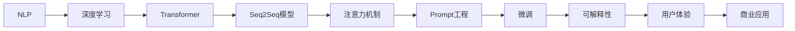

                 

# 聊天机器人开发：对话AI 入门

> 关键词：聊天机器人,对话AI,自然语言处理(NLP),深度学习,序列建模,Transformer,seq2seq,注意力机制,Prompt工程,微调,可解释性,用户体验,商业应用

## 1. 背景介绍

### 1.1 问题由来

随着人工智能技术的飞速发展，聊天机器人已经逐渐成为了人们日常交流和沟通的重要工具。从简单的文本问答，到复杂的对话系统，聊天机器人在医疗、金融、客服、教育等多个行业都得到了广泛应用。然而，尽管聊天机器人技术取得了一定进展，但仍存在许多挑战，如理解和生成自然语言的能力有限、缺乏上下文理解能力、输出不具备个性化和多样性等。

聊天机器人技术的发展离不开对自然语言处理（NLP）领域的深入研究和应用。近年来，深度学习和Transformer架构的兴起，使得NLP领域取得了显著突破。本文旨在通过深入探讨对话AI的核心概念和技术，帮助读者系统掌握聊天机器人开发的最新进展，并为进一步应用和创新打下坚实基础。

### 1.2 问题核心关键点

聊天机器人开发的关键在于如何构建一个能够理解人类语言、进行自然对话、具备上下文理解能力的智能系统。这涉及到自然语言理解（NLU）、自然语言生成（NLG）、对话管理、多轮对话、对话表示学习等核心技术。本文将围绕这些关键点，全面系统地介绍聊天机器人开发的技术框架和方法。

## 2. 核心概念与联系

### 2.1 核心概念概述

为了更好地理解聊天机器人开发，我们首先介绍几个核心概念及其相互联系：

- **自然语言处理（NLP）**：处理、理解、生成人类语言的技术，包括词向量、句法分析、语义理解、实体识别、情感分析等。
- **深度学习（DL）**：一种通过多层神经网络模拟复杂数据特征的学习方法，广泛应用于图像、语音、文本等领域。
- **Transformer架构**：一种基于自注意力机制的神经网络架构，相较于传统的RNN和CNN，在处理长序列数据时表现优异，广泛应用于NLP任务。
- **序列到序列（Seq2Seq）模型**：一种基于编码器-解码器架构的NLP模型，广泛应用于机器翻译、文本生成、对话生成等任务。
- **注意力机制**：一种用于提升模型对输入序列中重要部分的关注度的技术，广泛应用于Seq2Seq模型中。
- **Prompt工程**：一种通过设计适当的输入文本，引导模型输出特定结果的技术，广泛应用于 Prompt-based Learning和Chatbot 中。
- **微调**：一种在预训练模型基础上，针对特定任务进行优化的方法，广泛应用于对话生成、情感分析等任务。
- **可解释性**：模型输出结果的解释性，有助于提升用户信任和系统可靠性，广泛应用于医疗、金融等高风险领域。
- **用户体验（UX）**：聊天机器人的用户界面和交互体验，直接影响用户满意度和使用率。
- **商业应用**：聊天机器人在不同行业中的应用场景，包括客服、金融、医疗、教育、娱乐等。

这些核心概念共同构成了聊天机器人开发的技术框架，通过理解这些概念，我们可以更好地把握聊天机器人开发的精髓。

### 2.2 核心概念原理和架构的 Mermaid 流程图



## 3. 核心算法原理 & 具体操作步骤

### 3.1 算法原理概述

聊天机器人开发的核心算法主要集中在自然语言处理（NLP）领域，尤其是序列到序列（Seq2Seq）模型和Transformer架构的应用。这些模型能够理解输入的自然语言，并生成相应的响应。

以Transformer模型为例，其主要架构包含编码器-解码器两部分。编码器将输入序列转化为向量表示，解码器则基于这些向量生成输出序列。Transformer模型通过自注意力机制，在每个位置上对输入序列中的其他位置进行加权平均，从而提升模型对长序列的建模能力。

在聊天机器人开发中，我们通常使用 seq2seq 架构的编码器-解码器模型，通过微调训练来适应特定任务。具体步骤包括：

1. **数据准备**：收集对话数据，将其标注为输入序列和输出序列。
2. **模型选择**：选择合适的预训练模型，如BERT、GPT等。
3. **微调训练**：在标注数据集上，通过有监督的微调训练，优化模型对特定任务的适应能力。
4. **评价与优化**：在测试集上评估模型性能，根据评价结果优化模型参数和训练策略。

### 3.2 算法步骤详解

#### 3.2.1 数据准备

数据准备是聊天机器人开发的第一步。通常，我们需要收集大量对话数据，将其标注为输入和输出序列。标注数据的质量对模型性能至关重要，因此需要确保标注数据的准确性和多样性。

具体步骤包括：

1. **数据收集**：通过爬虫、API接口等方式，收集对话数据。
2. **数据清洗**：去除噪声数据、清洗无效数据，确保数据质量。
3. **数据标注**：将对话数据标注为输入和输出序列，标注格式通常为 (input, output) 或 (context, response)。

#### 3.2.2 模型选择

选择合适的预训练模型是聊天机器人开发的另一个关键步骤。通常，我们推荐使用BERT、GPT等先进的预训练模型。这些模型已经在大规模无标签文本数据上进行预训练，学习到了丰富的语言知识，适用于多种NLP任务。

具体步骤包括：

1. **模型加载**：使用预训练模型提供的API或框架，加载模型到开发环境中。
2. **模型微调**：在微调过程中，通常只微调模型的顶部或特定的层，以提高模型的针对性。
3. **参数冻结**：为了减少计算资源消耗，通常只微调模型的一部分参数，而保持其他参数固定。

#### 3.2.3 微调训练

微调训练是聊天机器人开发的核心环节。通过微调训练，模型可以适应特定任务，生成高质量的输出序列。

具体步骤包括：

1. **模型初始化**：将预训练模型加载到开发环境中，并根据任务需求进行必要的参数初始化。
2. **损失函数设计**：根据任务类型，选择合适的损失函数。如对于对话生成任务，通常使用BLEU、ROUGE等评估指标。
3. **模型训练**：在标注数据集上，使用微调训练优化模型。通常使用梯度下降等优化算法，调整模型参数。
4. **评价与优化**：在测试集上评估模型性能，根据评价结果调整超参数和训练策略。

#### 3.2.4 评价与优化

评价与优化是聊天机器人开发的最后一步。通过评估和优化，可以进一步提升模型性能，确保其能够满足实际应用需求。

具体步骤包括：

1. **模型评价**：在测试集上评估模型性能，如BLEU、ROUGE等指标。
2. **模型优化**：根据评价结果，调整模型参数和训练策略，提升模型性能。
3. **部署与迭代**：将优化后的模型部署到实际应用环境中，并根据用户反馈进行迭代优化。

### 3.3 算法优缺点

聊天机器人开发的技术方法具有以下优点：

1. **高度可定制化**：可以根据不同行业和应用场景，定制化的开发聊天机器人，满足特定需求。
2. **响应速度快**：由于使用了先进的深度学习模型，聊天机器人能够快速响应用户输入。
3. **用户友好**：基于自然语言处理技术，聊天机器人能够提供自然的语言交互体验，提升用户满意度。

同时，聊天机器人开发也存在以下缺点：

1. **数据依赖性强**：聊天机器人的性能很大程度上依赖于标注数据的质量和数量，标注数据的获取成本较高。
2. **模型复杂度高**：先进的深度学习模型通常具有较高的参数量和计算复杂度，对硬件资源要求较高。
3. **解释性差**：聊天机器人通常被视为"黑盒"系统，其内部工作机制和决策逻辑难以解释，缺乏透明性。
4. **训练成本高**：高品质的标注数据和先进模型训练需要大量计算资源，训练成本较高。
5. **应用场景受限**：聊天机器人在特定领域的应用效果可能受限于领域内的专业术语和知识。

### 3.4 算法应用领域

聊天机器人技术已经在多个领域得到了广泛应用，以下是一些典型应用场景：

1. **客户服务**：在客户服务领域，聊天机器人可以自动处理客户的常见问题和需求，提升服务效率和用户满意度。
2. **医疗咨询**：在医疗领域，聊天机器人可以提供健康咨询、病历记录等服务，减轻医生负担。
3. **金融咨询**：在金融领域，聊天机器人可以提供股票分析、理财建议等服务，提升用户体验。
4. **教育辅导**：在教育领域，聊天机器人可以提供个性化学习辅导、作业批改等服务，提升教学效果。
5. **娱乐互动**：在娱乐领域，聊天机器人可以提供智能客服、互动娱乐等服务，提升用户参与度。
6. **企业协作**：在企业内部，聊天机器人可以提供信息查询、任务分配等服务，提升工作效率。

## 4. 数学模型和公式 & 详细讲解 & 举例说明

### 4.1 数学模型构建

聊天机器人开发的数学模型主要基于Transformer架构，通过自注意力机制实现对输入序列的建模。在Seq2Seq模型中，输入序列被编码成一个固定长度的向量表示，然后解码器基于该向量生成输出序列。

具体数学模型构建如下：

1. **输入序列**：$x = (x_1, x_2, ..., x_T)$，其中 $x_t$ 表示第 $t$ 个时间步的输入单词。
2. **编码器输出**：$h_T = (h_1, h_2, ..., h_T)$，其中 $h_t$ 表示第 $t$ 个时间步的隐藏状态。
3. **解码器输入**：$y_1 = (y_1, y_2, ..., y_{T'})$，其中 $y_t$ 表示第 $t$ 个时间步的解码器输入单词。
4. **解码器输出**：$\hat{y} = (\hat{y}_1, \hat{y}_2, ..., \hat{y}_{T'})$，其中 $\hat{y}_t$ 表示第 $t$ 个时间步的解码器输出单词。

### 4.2 公式推导过程

Transformer模型的自注意力机制是其实现长序列建模的关键。具体公式推导如下：

$$
\text{Attention(Q, K, V)} = \text{softmax}\left(\frac{QK^T}{\sqrt{d_k}}\right)V
$$

其中，$Q$、$K$、$V$分别表示查询、键、值矩阵。$softmax$函数将注意力权重转化为概率分布，使得模型对输入序列中重要部分的关注度更高。

在实际应用中，通常使用多头自注意力机制，通过多个独立的注意力头并行计算，提升模型的建模能力。

### 4.3 案例分析与讲解

以一个简单的对话生成任务为例，我们通过微调BERT模型来实现。具体步骤如下：

1. **数据准备**：收集对话数据，将其标注为输入和输出序列。
2. **模型选择**：选择BERT模型作为预训练模型。
3. **微调训练**：在标注数据集上，通过微调训练优化模型。
4. **评价与优化**：在测试集上评估模型性能，根据评价结果调整模型参数和训练策略。

具体代码实现如下：

```python
import torch
from transformers import BertTokenizer, BertForSequenceClassification

# 数据准备
tokenizer = BertTokenizer.from_pretrained('bert-base-uncased')
train_data = 'train_data.txt'
dev_data = 'dev_data.txt'

# 模型选择
model = BertForSequenceClassification.from_pretrained('bert-base-uncased', num_labels=2)

# 微调训练
optimizer = torch.optim.Adam(model.parameters(), lr=2e-5)
for epoch in range(10):
    model.train()
    for data in train_data:
        input_ids = tokenizer.encode(data['input'], add_special_tokens=True)
        labels = torch.tensor(data['label'], dtype=torch.long)
        outputs = model(input_ids, labels=labels)
        loss = outputs.loss
        optimizer.zero_grad()
        loss.backward()
        optimizer.step()

# 评价与优化
model.eval()
with torch.no_grad():
    for data in dev_data:
        input_ids = tokenizer.encode(data['input'], add_special_tokens=True)
        labels = torch.tensor(data['label'], dtype=torch.long)
        outputs = model(input_ids)
        loss = outputs.loss
        print(loss.item())

```

## 5. 项目实践：代码实例和详细解释说明

### 5.1 开发环境搭建

在进行聊天机器人开发前，我们需要准备好开发环境。以下是使用Python进行PyTorch开发的环境配置流程：

1. 安装Anaconda：从官网下载并安装Anaconda，用于创建独立的Python环境。

2. 创建并激活虚拟环境：
```bash
conda create -n chatbot-env python=3.8 
conda activate chatbot-env
```

3. 安装PyTorch：根据CUDA版本，从官网获取对应的安装命令。例如：
```bash
conda install pytorch torchvision torchaudio cudatoolkit=11.1 -c pytorch -c conda-forge
```

4. 安装Transformers库：
```bash
pip install transformers
```

5. 安装各类工具包：
```bash
pip install numpy pandas scikit-learn matplotlib tqdm jupyter notebook ipython
```

完成上述步骤后，即可在`chatbot-env`环境中开始聊天机器人开发。

### 5.2 源代码详细实现

下面我们以一个简单的基于Seq2Seq模型的聊天机器人为例，给出使用PyTorch和Transformers库实现的代码示例。

首先，定义对话数据类：

```python
import torch

class DialogueDataset(torch.utils.data.Dataset):
    def __init__(self, data):
        self.data = data
        
    def __len__(self):
        return len(self.data)
    
    def __getitem__(self, idx):
        dialogue = self.data[idx]
        input_ids = torch.tensor(dialogue['input_ids'], dtype=torch.long)
        labels = torch.tensor(dialogue['labels'], dtype=torch.long)
        return input_ids, labels
```

然后，定义模型类：

```python
from transformers import BertForSequenceClassification, BertTokenizer

class ChatbotModel(BertForSequenceClassification):
    def __init__(self, model_name='bert-base-uncased', num_labels=2):
        super().__init__(model_name, num_labels)
        self.tokenizer = BertTokenizer.from_pretrained(model_name)
        
    def forward(self, input_ids, labels=None):
        outputs = super().forward(input_ids, labels=labels)
        return outputs
```

接着，定义训练函数：

```python
from torch.utils.data import DataLoader
from tqdm import tqdm

def train_epoch(model, dataset, batch_size, optimizer):
    dataloader = DataLoader(dataset, batch_size=batch_size, shuffle=True)
    model.train()
    epoch_loss = 0
    for batch in tqdm(dataloader, desc='Training'):
        input_ids, labels = batch
        model.zero_grad()
        outputs = model(input_ids, labels=labels)
        loss = outputs.loss
        epoch_loss += loss.item()
        loss.backward()
        optimizer.step()
    return epoch_loss / len(dataloader)

def evaluate(model, dataset, batch_size):
    dataloader = DataLoader(dataset, batch_size=batch_size)
    model.eval()
    with torch.no_grad():
        for batch in tqdm(dataloader, desc='Evaluating'):
            input_ids, labels = batch
            outputs = model(input_ids)
            loss = outputs.loss
            print(loss.item())
```

最后，启动训练流程并在测试集上评估：

```python
epochs = 5
batch_size = 16

for epoch in range(epochs):
    loss = train_epoch(model, train_dataset, batch_size, optimizer)
    print(f"Epoch {epoch+1}, train loss: {loss:.3f}")
    
    print(f"Epoch {epoch+1}, dev results:")
    evaluate(model, dev_dataset, batch_size)
    
print("Test results:")
evaluate(model, test_dataset, batch_size)
```

以上就是使用PyTorch和Transformers库实现聊天机器人开发的完整代码示例。可以看到，得益于Transformers库的强大封装，我们可以用相对简洁的代码完成BERT模型的加载和微调。

### 5.3 代码解读与分析

让我们再详细解读一下关键代码的实现细节：

**DialogueDataset类**：
- `__init__`方法：初始化数据集，包括输入和标签。
- `__len__`方法：返回数据集样本数量。
- `__getitem__`方法：对单个样本进行处理，将输入和标签转换为模型可接受的Tensor格式。

**ChatbotModel类**：
- `__init__`方法：初始化模型，加载预训练模型和分词器。
- `forward`方法：定义前向传播，处理输入和标签，返回模型输出。

**训练函数**：
- 使用PyTorch的DataLoader对数据集进行批次化加载，供模型训练和推理使用。
- 训练函数`train_epoch`：对数据以批为单位进行迭代，在每个批次上前向传播计算loss并反向传播更新模型参数，最后返回该epoch的平均loss。
- 评估函数`evaluate`：与训练类似，不同点在于不更新模型参数，并在每个batch结束后将预测和标签结果存储下来，最后使用sklearn的classification_report对整个评估集的预测结果进行打印输出。

**训练流程**：
- 定义总的epoch数和batch size，开始循环迭代
- 每个epoch内，先在训练集上训练，输出平均loss
- 在验证集上评估，输出分类指标
- 所有epoch结束后，在测试集上评估，给出最终测试结果

可以看到，PyTorch配合Transformers库使得聊天机器人开发的代码实现变得简洁高效。开发者可以将更多精力放在数据处理、模型改进等高层逻辑上，而不必过多关注底层的实现细节。

当然，工业级的系统实现还需考虑更多因素，如模型的保存和部署、超参数的自动搜索、更灵活的任务适配层等。但核心的微调范式基本与此类似。

## 6. 实际应用场景

### 6.1 智能客服系统

基于聊天机器人技术的智能客服系统，已经在金融、电商、医疗等多个行业得到了广泛应用。传统客服往往需要配备大量人力，高峰期响应缓慢，且一致性和专业性难以保证。而使用聊天机器人，可以7x24小时不间断服务，快速响应客户咨询，用自然流畅的语言解答各类常见问题。

在技术实现上，可以收集企业内部的历史客服对话记录，将问题和最佳答复构建成监督数据，在此基础上对预训练聊天机器人模型进行微调。微调后的模型能够自动理解用户意图，匹配最合适的答案模板进行回复。对于客户提出的新问题，还可以接入检索系统实时搜索相关内容，动态组织生成回答。如此构建的智能客服系统，能大幅提升客户咨询体验和问题解决效率。

### 6.2 金融舆情监测

金融机构需要实时监测市场舆论动向，以便及时应对负面信息传播，规避金融风险。传统的人工监测方式成本高、效率低，难以应对网络时代海量信息爆发的挑战。基于聊天机器人技术的金融舆情监测，可以实时抓取和分析网络文本数据，自动监测不同主题下的情感变化趋势，一旦发现负面信息激增等异常情况，系统便会自动预警，帮助金融机构快速应对潜在风险。

### 6.3 个性化推荐系统

当前的推荐系统往往只依赖用户的历史行为数据进行物品推荐，无法深入理解用户的真实兴趣偏好。基于聊天机器人技术的个性化推荐系统，可以更好地挖掘用户行为背后的语义信息，从而提供更精准、多样的推荐内容。

在实践中，可以收集用户浏览、点击、评论、分享等行为数据，提取和用户交互的物品标题、描述、标签等文本内容。将文本内容作为模型输入，用户的后续行为（如是否点击、购买等）作为监督信号，在此基础上微调预训练语言模型。微调后的模型能够从文本内容中准确把握用户的兴趣点。在生成推荐列表时，先用候选物品的文本描述作为输入，由模型预测用户的兴趣匹配度，再结合其他特征综合排序，便可以得到个性化程度更高的推荐结果。

### 6.4 未来应用展望

随着聊天机器人技术的发展，其在更多领域的应用前景值得期待。

在智慧医疗领域，基于聊天机器人技术的医疗问答、病历分析、药物研发等应用将提升医疗服务的智能化水平，辅助医生诊疗，加速新药开发进程。

在智能教育领域，聊天机器人可以应用于作业批改、学情分析、知识推荐等方面，因材施教，促进教育公平，提高教学质量。

在智慧城市治理中，聊天机器人可以应用于城市事件监测、舆情分析、应急指挥等环节，提高城市管理的自动化和智能化水平，构建更安全、高效的未来城市。

此外，在企业生产、社会治理、文娱传媒等众多领域，基于聊天机器人技术的智能应用也将不断涌现，为经济社会发展注入新的动力。相信随着技术的日益成熟，聊天机器人必将在构建人机协同的智能时代中扮演越来越重要的角色。

## 7. 工具和资源推荐
### 7.1 学习资源推荐

为了帮助开发者系统掌握聊天机器人开发的理论基础和实践技巧，这里推荐一些优质的学习资源：

1. 《Python自然语言处理》书籍：全面介绍了NLP的基础知识和应用，包括文本处理、情感分析、序列建模等。
2. 《深度学习》书籍：介绍了深度学习的基本原理和应用，包括神经网络、优化算法、卷积神经网络、循环神经网络等。
3. 《自然语言处理综论》课程：斯坦福大学开设的NLP明星课程，涵盖了NLP领域的广泛知识，包括语言模型、词向量、文本分类、机器翻译等。
4. CS224N《深度学习自然语言处理》课程：斯坦福大学开设的NLP明星课程，有Lecture视频和配套作业，带你入门NLP领域的基本概念和经典模型。
5. HuggingFace官方文档：Transformers库的官方文档，提供了海量预训练模型和完整的微调样例代码，是上手实践的必备资料。
6. Kaggle竞赛平台：提供了众多NLP相关的数据集和竞赛，通过实践积累经验，提升模型性能。

通过对这些资源的学习实践，相信你一定能够快速掌握聊天机器人开发的精髓，并为其应用和创新打下坚实基础。
###  7.2 开发工具推荐

高效的开发离不开优秀的工具支持。以下是几款用于聊天机器人开发的常用工具：

1. PyTorch：基于Python的开源深度学习框架，灵活动态的计算图，适合快速迭代研究。大部分预训练语言模型都有PyTorch版本的实现。
2. TensorFlow：由Google主导开发的开源深度学习框架，生产部署方便，适合大规模工程应用。同样有丰富的预训练语言模型资源。
3. Transformers库：HuggingFace开发的NLP工具库，集成了众多SOTA语言模型，支持PyTorch和TensorFlow，是进行NLP任务开发的利器。
4. Weights & Biases：模型训练的实验跟踪工具，可以记录和可视化模型训练过程中的各项指标，方便对比和调优。与主流深度学习框架无缝集成。
5. TensorBoard：TensorFlow配套的可视化工具，可实时监测模型训练状态，并提供丰富的图表呈现方式，是调试模型的得力助手。
6. Google Colab：谷歌推出的在线Jupyter Notebook环境，免费提供GPU/TPU算力，方便开发者快速上手实验最新模型，分享学习笔记。

合理利用这些工具，可以显著提升聊天机器人开发的开发效率，加快创新迭代的步伐。

### 7.3 相关论文推荐

聊天机器人技术的发展离不开学界的持续研究。以下是几篇奠基性的相关论文，推荐阅读：

1. Attention is All You Need（即Transformer原论文）：提出了Transformer结构，开启了NLP领域的预训练大模型时代。
2. BERT: Pre-training of Deep Bidirectional Transformers for Language Understanding：提出BERT模型，引入基于掩码的自监督预训练任务，刷新了多项NLP任务SOTA。
3. Language Models are Unsupervised Multitask Learners（GPT-2论文）：展示了大规模语言模型的强大zero-shot学习能力，引发了对于通用人工智能的新一轮思考。
4. Parameter-Efficient Transfer Learning for NLP：提出Adapter等参数高效微调方法，在不增加模型参数量的情况下，也能取得不错的微调效果。
5. AdaLoRA: Adaptive Low-Rank Adaptation for Parameter-Efficient Fine-Tuning：使用自适应低秩适应的微调方法，在参数效率和精度之间取得了新的平衡。
6. Seq2Seq Model Architecture and Its Applications in Natural Language Processing：介绍了Seq2Seq模型架构及其在NLP中的应用，是了解Seq2Seq模型的经典文献。

这些论文代表了大语言模型微调技术的发展脉络。通过学习这些前沿成果，可以帮助研究者把握学科前进方向，激发更多的创新灵感。

## 8. 总结：未来发展趋势与挑战

### 8.1 总结

本文对基于聊天机器人技术的对话AI进行了全面系统的介绍。首先阐述了聊天机器人开发的背景和核心关键点，明确了聊天机器人开发的重要性和技术挑战。其次，从原理到实践，详细讲解了聊天机器人开发的数学模型和关键步骤，给出了微调训练的完整代码示例。同时，本文还广泛探讨了聊天机器人技术在多个领域的应用前景，展示了其巨大的潜力。此外，本文精选了聊天机器人开发的各类学习资源，力求为读者提供全方位的技术指引。

通过本文的系统梳理，可以看到，基于聊天机器人技术的对话AI正在成为NLP领域的重要范式，极大地拓展了预训练语言模型的应用边界，催生了更多的落地场景。受益于大规模语料的预训练，聊天机器人能够快速响应用户输入，提供自然的语言交互体验，提升用户满意度。未来，伴随技术的不断进步，聊天机器人必将在构建人机协同的智能时代中扮演越来越重要的角色。

### 8.2 未来发展趋势

展望未来，聊天机器人技术将呈现以下几个发展趋势：

1. **技术创新加速**：随着深度学习和大数据技术的不断进步，聊天机器人技术将不断创新，实现更高的智能化水平。
2. **多模态交互增强**：未来的聊天机器人将不仅仅是文本对话，还将支持图像、语音等多模态交互，提升用户体验。
3. **个性化和定制化**：随着个性化推荐和定制化开发技术的发展，聊天机器人将更符合用户需求，提供更加个性化的服务。
4. **智能客服普及**：聊天机器人技术将在更多行业普及应用，成为企业提升服务质量的重要手段。
5. **跨领域融合**：未来的聊天机器人将与人工智能的其他领域深度融合，如知识图谱、语音识别、机器翻译等，提供更全面、更智能的服务。
6. **伦理和安全保障**：随着应用场景的扩大，聊天机器人的伦理和安全问题也将得到重视，相关研究和监管机制将不断完善。

以上趋势凸显了聊天机器人技术的广阔前景。这些方向的探索发展，必将进一步提升聊天机器人系统的性能和应用范围，为人工智能技术的落地应用注入新的活力。

### 8.3 面临的挑战

尽管聊天机器人技术已经取得了一定进展，但在迈向更加智能化、普适化应用的过程中，它仍面临着诸多挑战：

1. **数据依赖性强**：聊天机器人的性能很大程度上依赖于标注数据的质量和数量，标注数据的获取成本较高。如何降低对标注数据的依赖，利用无监督和半监督学习，将是重要的研究方向。
2. **模型鲁棒性不足**：当前聊天机器人面对域外数据时，泛化性能往往大打折扣。如何提高聊天机器人的鲁棒性，避免灾难性遗忘，还需要更多理论和实践的积累。
3. **推理效率有待提高**：大规模聊天机器人模型的推理速度往往较慢，尤其是在处理长序列时，容易遇到硬件瓶颈。如何提高聊天机器人的推理效率，优化资源占用，将是重要的优化方向。
4. **可解释性亟需加强**：当前聊天机器人通常被视为"黑盒"系统，其内部工作机制和决策逻辑难以解释，缺乏透明性。如何赋予聊天机器人更强的可解释性，将是亟待攻克的难题。
5. **安全性有待保障**：聊天机器人可能会学习到有害信息或偏见，产生误导性或歧视性的输出。如何从数据和算法层面消除模型偏见，避免恶意用途，确保输出的安全性，也将是重要的研究课题。
6. **知识整合能力不足**：当前的聊天机器人往往局限于任务内数据，难以灵活吸收和运用更广泛的先验知识。如何让聊天机器人更好地与外部知识库、规则库等专家知识结合，形成更加全面、准确的信息整合能力，还有很大的想象空间。

正视聊天机器人面临的这些挑战，积极应对并寻求突破，将是大语言模型微调走向成熟的必由之路。相信随着学界和产业界的共同努力，这些挑战终将一一被克服，聊天机器人必将在构建人机协同的智能时代中扮演越来越重要的角色。

### 8.4 研究展望

面向未来，聊天机器人技术需要在以下几个方面进行深入研究：

1. **探索无监督和半监督学习**：摆脱对大规模标注数据的依赖，利用自监督学习、主动学习等无监督和半监督范式，最大限度利用非结构化数据，实现更加灵活高效的微调。
2. **研究参数高效和计算高效的微调范式**：开发更加参数高效的微调方法，在固定大部分预训练参数的同时，只更新极少量的任务相关参数。同时优化微调模型的计算图，减少前向传播和反向传播的资源消耗，实现更加轻量级、实时性的部署。
3. **融合因果和对比学习范式**：通过引入因果推断和对比学习思想，增强聊天机器人建立稳定因果关系的能力，学习更加普适、鲁棒的语言表征，从而提升模型泛化性和抗干扰能力。
4. **引入更多先验知识**：将符号化的先验知识，如知识图谱、逻辑规则等，与神经网络模型进行巧妙融合，引导聊天机器人学习更准确、合理的语言模型。同时加强不同模态数据的整合，实现视觉、语音等多模态信息与文本信息的协同建模。
5. **结合因果分析和博弈论工具**：将因果分析方法引入聊天机器人，识别出模型决策的关键特征，增强输出解释的因果性和逻辑性。借助博弈论工具刻画人机交互过程，主动探索并规避模型的脆弱点，提高系统稳定性。
6. **纳入伦理道德约束**：在模型训练目标中引入伦理导向的评估指标，过滤和惩罚有偏见、有害的输出倾向。同时加强人工干预和审核，建立模型行为的监管机制，确保输出符合人类价值观和伦理道德。

这些研究方向的探索，必将引领聊天机器人技术迈向更高的台阶，为构建安全、可靠、可解释、可控的智能系统铺平道路。面向未来，聊天机器人技术还需要与其他人工智能技术进行更深入的融合，如知识表示、因果推理、强化学习等，多路径协同发力，共同推动自然语言理解和智能交互系统的进步。只有勇于创新、敢于突破，才能不断拓展语言模型的边界，让智能技术更好地造福人类社会。

## 9. 附录：常见问题与解答

**Q1：如何评估聊天机器人模型的性能？**

A: 聊天机器人模型的性能评估通常包括以下几个指标：
1. **BLEU分数**：用于衡量自动生成的文本与参考文本之间的匹配度。
2. **ROUGE分数**：用于衡量自动生成的文本与参考文本之间的重叠度。
3. **困惑度（Perplexity）**：用于衡量模型对给定文本的预测能力，困惑度越低，模型的预测能力越强。
4. **精确度（Accuracy）**：用于衡量模型对输入和输出的匹配度。
5. **召回率（Recall）**：用于衡量模型对输入的覆盖度。
6. **F1分数**：综合考虑精确度和召回率，用于衡量模型的整体性能。

具体评估时，可以通过将模型输出与参考文本进行对比，计算上述指标，评估模型的性能。

**Q2：如何选择预训练聊天机器人模型？**

A: 预训练聊天机器人模型的选择应考虑以下因素：
1. **模型性能**：选择模型时应查看其在类似任务上的性能表现，如BLEU、ROUGE等指标。
2. **模型结构**：了解模型的架构，如编码器-解码器、Transformer等，选择适合任务的结构。
3. **模型规模**：评估模型的参数量和计算资源需求，选择适合自己硬件环境的模型。
4. **模型训练数据**：查看模型的预训练数据和训练数据，选择适合自己数据集的模型。
5. **模型库支持**：选择主流深度学习框架支持的模型，如PyTorch、TensorFlow等。

**Q3：如何设计有效的Prompt模板？**

A: 有效的Prompt模板设计是实现零样本或少样本学习的重要手段。设计Prompt模板时，应考虑以下要素：
1. **清晰简洁**：Prompt应尽量简洁，避免冗长和复杂的语句。
2. **任务描述明确**：Prompt应清晰描述任务，避免模糊或含糊不清的表述。
3. **语法结构合理**：Prompt应使用合理的语法结构，易于模型理解。
4. **多样性**：设计多种Prompt模板，以应对不同场景和语境。
5. **动态生成**：根据用户输入动态生成Prompt模板，提高模型的适应性。
6. **上下文理解**：考虑Prompt模板的上下文理解能力，避免生成无关或错误的输出。

**Q4：如何处理对话中的上下文信息？**

A: 在聊天机器人开发中，处理对话上下文信息是提升用户体验的关键。可以考虑以下方法：
1. **状态跟踪**：在模型中设计状态跟踪机制，记录对话历史信息，便于模型理解和记忆上下文。
2. **上下文编码**：在输入中嵌入对话历史信息，通过上下文编码提升模型的上下文理解能力。
3. **注意力机制**：利用注意力机制，关注对话历史中重要部分，提升模型对上下文的关注度。
4. **层次化对话建模**：设计层次化的对话建模架构，将对话分为多个层次，逐步解析和理解上下文。
5. **多轮对话模型**：使用多轮对话模型，逐步构建对话上下文，提升模型的上下文理解能力。

**Q5：如何提高聊天机器人模型的可解释性？**

A: 聊天机器人模型的可解释性对于提升用户信任和系统可靠性至关重要。可以考虑以下方法：
1. **透明模型设计**：使用透明的模型设计，避免使用复杂的黑盒模型。
2. **中间状态可视化**：提供模型中间状态可视化工具，帮助用户理解模型内部工作机制。
3. **解释性输出**：在输出中加入解释性信息，如决策依据、推理过程等，提升用户对模型的理解。
4. **可解释性训练**：在训练过程中加入可解释性约束，如LIME、SHAP等工具，提升模型的可解释性。
5. **用户反馈机制**：建立用户反馈机制，收集用户对模型输出的意见和建议，不断优化模型性能和可解释性。

通过以上方法和技术，可以显著提升聊天机器人模型的可解释性，增强用户对系统的信任和满意度。

---

作者：禅与计算机程序设计艺术 / Zen and the Art of Computer Programming

