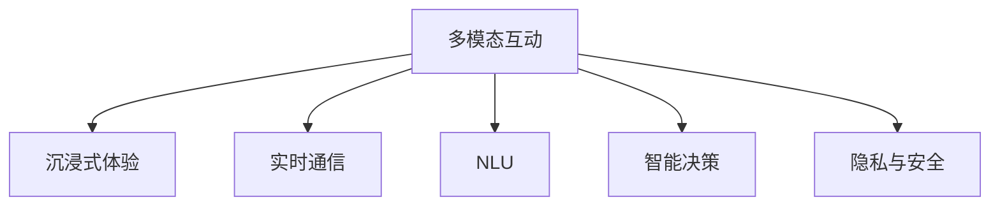

                 

# 聊天机器人游戏革命：沉浸式多人互动

## 1. 背景介绍

### 1.1 问题由来
近年来，随着人工智能技术的飞速发展，聊天机器人已经从传统的客服、咨询工具，演化成为一种全新的娱乐体验。特别是随着深度学习、自然语言处理技术的成熟，聊天机器人逐步具备了自然流畅的对话能力，能够以更加智能、趣味的方式与用户互动。

然而，传统的聊天机器人往往局限于单模态的文本对话，难以模拟真实世界的多模态互动体验。如何让聊天机器人具备更强的沉浸感、互动性，实现多人实时交流，成为当前研究的一个热点。

### 1.2 问题核心关键点
基于多模态互动的沉浸式聊天机器人，需要解决以下几个关键问题：

- **实时通讯**：实现多人实时互动，需要高效的网络通信协议和算法。
- **多模态融合**：将语音、图像、动作等多种模态数据融合到对话系统中，提升用户体验。
- **自然语言理解**：通过自然语言处理技术，理解并生成自然流畅的对话内容。
- **智能决策**：结合AI决策算法，使机器人能够自主生成合理的对话和动作。
- **隐私与安全**：在多人互动中保障用户隐私，避免数据泄露和安全风险。

这些问题涉及计算机网络、人工智能、多媒体处理等多个领域，需要跨学科的深度融合与创新。

### 1.3 问题研究意义
构建沉浸式、多模态的聊天机器人，对于提升用户互动体验、推动娱乐行业的智能化转型，具有重要意义：

1. **增强用户体验**：通过多模态融合和智能决策，使聊天机器人更接近真实对话，增强沉浸感。
2. **拓宽应用场景**：多人互动的聊天机器人可以应用于游戏、教育、娱乐等多个领域，拓展应用边界。
3. **促进AI技术普及**：通过沉浸式聊天机器人，让普通用户更易于接触和理解AI技术，加速技术普及。
4. **推动行业创新**：多模态互动的聊天机器人将成为娱乐行业的新型创意工具，催生更多创新产品。

## 2. 核心概念与联系

### 2.1 核心概念概述

为更好地理解沉浸式多人互动聊天机器人的核心技术，本节将介绍几个关键概念：

- **多模态互动(Multi-modal Interaction)**：指将语音、图像、动作等多种模态数据融合到对话系统中，提升用户体验。
- **沉浸式体验(Immersive Experience)**：通过多模态、多用户互动，使对话环境更加逼真自然，用户仿佛置身于虚拟现实之中。
- **实时通信(Real-Time Communication)**：指通过网络通信协议实现即时消息传递，保障聊天流畅性。
- **自然语言理解(Natural Language Understanding, NLU)**：通过自然语言处理技术，理解并生成自然流畅的对话内容。
- **智能决策(Smart Decision Making)**：结合AI决策算法，使机器人能够自主生成合理的对话和动作。
- **隐私与安全(Privacy & Security)**：在多人互动中保障用户隐私，避免数据泄露和安全风险。

这些核心概念之间的逻辑关系可以通过以下Mermaid流程图来展示：



这个流程图展示了几大核心概念及其之间的关系：

1. **多模态互动**：提供沉浸式体验的基础，将多种模态数据融合到对话系统中。
2. **沉浸式体验**：通过多模态、多用户互动，增强对话环境的真实感。
3. **实时通信**：保障聊天流畅性，使对话实时发生。
4. **自然语言理解**：理解并生成自然流畅的对话内容，使机器人能够真正理解用户意图。
5. **智能决策**：结合AI算法，使机器人能够自主生成合理的对话和动作。
6. **隐私与安全**：保障用户隐私，避免数据泄露和安全风险。

这些概念共同构成了沉浸式多人互动聊天机器人的核心框架，使其能够提供更丰富、自然的对话体验。

## 3. 核心算法原理 & 具体操作步骤

### 3.1 算法原理概述

沉浸式多人互动聊天机器人，本质上是一种多模态、实时、智能的对话系统。其核心思想是：通过多模态融合和实时通信技术，构建逼真的对话环境，结合自然语言理解和智能决策算法，使机器人能够自然流畅地与多用户互动，并作出合理响应。

形式化地，设 $C$ 为聊天机器人模型，$M$ 为多模态数据集，$S$ 为实时通信协议，$NLU$ 为自然语言理解模型，$Decision$ 为智能决策算法，$Multi-modal Interaction$ 为多模态融合算法，$Privacy \& Security$ 为隐私保护策略。则聊天机器人的工作流程可以表示为：

$$
C_{output} = NLU(M_{input}) \rightarrow Decision(NLU(M_{input}), Context) \rightarrow Multi-modal Interaction(NLU(M_{input}), S_{output})
$$

其中，$M_{input}$ 为输入的多模态数据，$Context$ 为上下文信息，$S_{output}$ 为实时通信协议的输出，$C_{output}$ 为机器人输出的回答。

### 3.2 算法步骤详解

沉浸式多人互动聊天机器人的实现过程包括以下几个关键步骤：

**Step 1: 准备多模态数据集**

- 收集多模态数据，如语音、图像、动作等。可以是实时采集或从预处理好的数据集中获取。
- 预处理多模态数据，包括特征提取、归一化、降噪等。
- 对多模态数据进行标注，以便进行后续的训练和评估。

**Step 2: 设计多模态融合算法**

- 选择合适的多模态融合方法，如深度融合、时空融合、集成融合等。
- 设计多模态融合的神经网络结构，将各种模态数据通过神经网络进行处理。
- 训练融合模型，优化多模态数据的表示。

**Step 3: 构建实时通信协议**

- 选择适合的实时通信协议，如WebSockets、TCP/IP等。
- 设计通信协议的底层架构，包括消息格式、传输机制等。
- 实现消息的发送和接收，保障聊天流畅性。

**Step 4: 实现自然语言理解**

- 选择合适的自然语言处理工具，如NLTK、spaCy、Transformers等。
- 对多模态数据进行文本处理，包括分词、词性标注、实体识别等。
- 训练自然语言理解模型，使模型能够理解用户的意图和上下文。

**Step 5: 设计智能决策算法**

- 选择合适的决策算法，如决策树、随机森林、深度学习等。
- 设计决策算法的数据输入和输出，包括对话历史、用户属性、上下文信息等。
- 训练智能决策模型，使模型能够根据输入生成合理的对话和动作。

**Step 6: 实现隐私与安全保护**

- 设计隐私保护策略，如数据加密、匿名化处理等。
- 实现安全的通信协议，防止数据泄露和恶意攻击。
- 设计合理的用户权限管理，确保只有授权用户才能访问敏感信息。

**Step 7: 集成模型**

- 将多模态融合、自然语言理解、智能决策等模型集成到聊天机器人框架中。
- 实现各个模块间的协同工作，提升聊天体验。

**Step 8: 测试与部署**

- 在测试集上进行测试，评估机器人性能。
- 根据测试结果进行调整和优化。
- 部署到实际应用环境中，进行大规模用户测试。

### 3.3 算法优缺点

沉浸式多人互动聊天机器人的设计思路具有以下优点：

1. **用户体验提升**：通过多模态融合和实时通信，使对话环境更加自然逼真，提升用户体验。
2. **应用场景丰富**：适用于游戏、教育、娱乐等多个领域，拓宽应用边界。
3. **技术前沿**：结合最新的自然语言处理和AI技术，提升对话系统的智能程度。
4. **可扩展性强**：可动态调整模型参数，灵活应对不同应用场景。

但该方法也存在一些局限性：

1. **数据需求高**：多模态互动需要大量的高质量标注数据，数据获取和处理成本较高。
2. **算法复杂**：涉及多个领域的技术融合，算法设计复杂，实现难度较大。
3. **实时性要求高**：实时通信协议需要高带宽、低延时的网络环境，对网络条件要求较高。
4. **隐私风险**：多用户互动可能涉及敏感信息交换，隐私保护措施需要更加严格。

尽管存在这些局限性，沉浸式多人互动聊天机器人仍是大势所趋，具有广阔的应用前景。未来相关研究将更多地关注如何提高数据获取和处理效率，简化算法设计，优化网络通信协议，确保数据安全。

### 3.4 算法应用领域

沉浸式多人互动聊天机器人已在多个领域得到了应用，例如：

- **游戏互动**：在游戏中实现多玩家实时对话，提升游戏体验。
- **教育培训**：在教育场景中进行虚拟课堂互动，丰富教学形式。
- **娱乐社交**：在社交平台实现多用户实时交流，促进社区活跃度。
- **企业客服**：在企业客服系统中实现多客服协同，提升服务效率。
- **智慧医疗**：在远程医疗中实现医生和患者的实时互动，提高诊疗效率。
- **智能家居**：在家居环境中实现多设备协同对话，提升用户生活便利性。

除了上述这些经典应用外，沉浸式多人互动聊天机器人还被创新性地应用于军事模拟、安全监控、灾难预警等多个场景中，为不同行业带来了新的应用可能性。

## 4. 数学模型和公式 & 详细讲解 & 举例说明

### 4.1 数学模型构建

设 $M_{input}$ 为输入的多模态数据，包括语音特征向量 $X_v$、图像特征向量 $X_i$、动作特征向量 $X_a$ 等。自然语言理解模型 $NLU$ 的输入为 $M_{input}$，输出为对话文本 $Y$。智能决策模型 $Decision$ 的输入为对话文本 $Y$ 和上下文信息 $Context$，输出为机器人动作 $Act$。多模态融合算法 $Multi-modal Interaction$ 的输入为多模态数据 $M_{input}$ 和实时通信协议的输出 $S_{output}$，输出为机器人的综合回答 $C_{output}$。

构建聊天机器人的数学模型，需要将上述各模块进行有机的结合。以多模态融合为例，可以使用深度融合方法，将语音、图像、动作等多模态数据通过卷积神经网络进行处理。具体公式如下：

$$
Y = f_{NLU}(X_v, X_i, X_a)
$$

其中 $f_{NLU}$ 为自然语言理解模型，可以采用Transformer模型等。

### 4.2 公式推导过程

下面以Transformer模型为例，展示多模态融合的详细推导过程。

设输入的多模态数据为 $X$，包括语音、图像和动作特征向量，每个特征向量的维度为 $d_v, d_i, d_a$，则多模态融合过程可以表示为：

$$
X_f = [X_v; X_i; X_a] \in \mathbb{R}^{3d_v}
$$

其中 $;$ 表示将多个特征向量拼接在一起。

多模态融合的神经网络结构可以设计为多个卷积层和池化层，将各模态特征进行融合。设多模态融合网络的输出为 $X' = [X'_v; X'_i; X'_a] \in \mathbb{R}^{3d_v}$，其中 $X'_v, X'_i, X'_a$ 分别表示融合后的语音、图像、动作特征向量。

然后，将融合后的特征向量 $X'$ 输入到自然语言理解模型 $NLU$ 中，得到对话文本 $Y$。

$$
Y = f_{NLU}(X'_v, X'_i, X'_a)
$$

最后，将对话文本 $Y$ 输入到智能决策模型 $Decision$ 中，得到机器人动作 $Act$。

$$
Act = f_{Decision}(Y, Context)
$$

其中 $Context$ 为上下文信息，包括用户属性、历史对话等。

### 4.3 案例分析与讲解

以下以一款多人互动游戏聊天机器人为例，展示其具体实现过程：

**Step 1: 数据准备**

- 收集游戏中的语音、图像、动作等多模态数据，进行标注。
- 对语音数据进行特征提取和归一化处理。
- 对图像数据进行预处理，提取关键特征。
- 对动作数据进行编码，生成动作序列。

**Step 2: 多模态融合**

- 设计多模态融合的神经网络结构，包括多个卷积层和池化层。
- 将语音、图像、动作等特征向量进行拼接和融合，得到融合后的特征向量 $X'$。
- 将融合后的特征向量输入到自然语言理解模型 $NLU$ 中，得到对话文本 $Y$。

**Step 3: 实时通信协议**

- 选择WebSockets协议，实现实时通信。
- 设计通信协议的底层架构，包括消息格式和传输机制。
- 实现消息的发送和接收，保障聊天流畅性。

**Step 4: 自然语言理解**

- 选择Transformer模型，训练自然语言理解模型 $NLU$。
- 对输入的多模态数据进行文本处理，包括分词、词性标注、实体识别等。
- 训练自然语言理解模型，使其能够理解用户的意图和上下文。

**Step 5: 智能决策算法**

- 设计决策算法的数据输入和输出，包括对话历史、用户属性、上下文信息等。
- 选择深度学习模型，如决策树、随机森林等，训练智能决策模型 $Decision$。
- 训练智能决策模型，使其能够根据输入生成合理的对话和动作。

**Step 6: 隐私与安全保护**

- 设计隐私保护策略，如数据加密、匿名化处理等。
- 实现安全的通信协议，防止数据泄露和恶意攻击。
- 设计合理的用户权限管理，确保只有授权用户才能访问敏感信息。

**Step 7: 集成模型**

- 将多模态融合、自然语言理解、智能决策等模型集成到聊天机器人框架中。
- 实现各个模块间的协同工作，提升聊天体验。

**Step 8: 测试与部署**

- 在测试集上进行测试，评估机器人性能。
- 根据测试结果进行调整和优化。
- 部署到实际应用环境中，进行大规模用户测试。

## 5. 项目实践：代码实例和详细解释说明

### 5.1 开发环境搭建

在进行项目实践前，我们需要准备好开发环境。以下是使用Python进行PyTorch开发的环境配置流程：

1. 安装Anaconda：从官网下载并安装Anaconda，用于创建独立的Python环境。

2. 创建并激活虚拟环境：
```bash
conda create -n chatbot-env python=3.8 
conda activate chatbot-env
```

3. 安装PyTorch：根据CUDA版本，从官网获取对应的安装命令。例如：
```bash
conda install pytorch torchvision torchaudio cudatoolkit=11.1 -c pytorch -c conda-forge
```

4. 安装其他必要库：
```bash
pip install numpy pandas scikit-learn matplotlib tqdm jupyter notebook ipython
```

完成上述步骤后，即可在`chatbot-env`环境中开始项目实践。

### 5.2 源代码详细实现

我们以一个简单的多模态互动聊天机器人为例，展示其代码实现。

首先，定义多模态融合模型：

```python
import torch
import torch.nn as nn

class MultimodalFusion(nn.Module):
    def __init__(self, dim_v, dim_i, dim_a):
        super(MultimodalFusion, self).__init__()
        self.conv_v = nn.Conv2d(1, dim_v, kernel_size=3, stride=1, padding=1)
        self.conv_i = nn.Conv2d(1, dim_i, kernel_size=3, stride=1, padding=1)
        self.conv_a = nn.Conv2d(1, dim_a, kernel_size=3, stride=1, padding=1)
        self.pool = nn.MaxPool2d(kernel_size=2, stride=2)
        self.fc = nn.Linear(3 * dim_v, dim_v)
    
    def forward(self, x_v, x_i, x_a):
        x_v = self.conv_v(x_v)
        x_i = self.conv_i(x_i)
        x_a = self.conv_a(x_a)
        x_v = self.pool(x_v)
        x_i = self.pool(x_i)
        x_a = self.pool(x_a)
        x = torch.cat([x_v, x_i, x_a], dim=1)
        x = self.fc(x)
        return x
```

然后，定义自然语言理解模型：

```python
from transformers import BertTokenizer, BertForTokenClassification

class NLU(nn.Module):
    def __init__(self, dim_v):
        super(NLU, self).__init__()
        self.tokenizer = BertTokenizer.from_pretrained('bert-base-cased')
        self.model = BertForTokenClassification.from_pretrained('bert-base-cased', num_labels=2)
        self.fc = nn.Linear(768, dim_v)
    
    def forward(self, x):
        tokenized_input = self.tokenizer(x, return_tensors='pt')
        encoded_input = self.model(**tokenized_input)[0]
        encoded_input = encoded_input[:, 0, :]
        encoded_input = self.fc(encoded_input)
        return encoded_input
```

接着，定义智能决策模型：

```python
import torch.nn as nn
import torch

class Decision(nn.Module):
    def __init__(self, dim_v):
        super(Decision, self).__init__()
        self.fc = nn.Linear(dim_v, 2)
    
    def forward(self, x):
        x = self.fc(x)
        return x
```

最后，定义聊天机器人模型：

```python
class Chatbot(nn.Module):
    def __init__(self, dim_v, dim_i, dim_a, dim_nlu, dim_decision):
        super(Chatbot, self).__init__()
        self.fusion = MultimodalFusion(dim_v, dim_i, dim_a)
        self.nlu = NLU(dim_nlu)
        self.decision = Decision(dim_decision)
    
    def forward(self, x_v, x_i, x_a):
        x = self.fusion(x_v, x_i, x_a)
        y = self.nlu(x)
        act = self.decision(y)
        return act
```

完整的代码实现可以参考以下代码：

```python
import torch
import torch.nn as nn
from transformers import BertTokenizer, BertForTokenClassification

class MultimodalFusion(nn.Module):
    def __init__(self, dim_v, dim_i, dim_a):
        super(MultimodalFusion, self).__init__()
        self.conv_v = nn.Conv2d(1, dim_v, kernel_size=3, stride=1, padding=1)
        self.conv_i = nn.Conv2d(1, dim_i, kernel_size=3, stride=1, padding=1)
        self.conv_a = nn.Conv2d(1, dim_a, kernel_size=3, stride=1, padding=1)
        self.pool = nn.MaxPool2d(kernel_size=2, stride=2)
        self.fc = nn.Linear(3 * dim_v, dim_v)
    
    def forward(self, x_v, x_i, x_a):
        x_v = self.conv_v(x_v)
        x_i = self.conv_i(x_i)
        x_a = self.conv_a(x_a)
        x_v = self.pool(x_v)
        x_i = self.pool(x_i)
        x_a = self.pool(x_a)
        x = torch.cat([x_v, x_i, x_a], dim=1)
        x = self.fc(x)
        return x

class NLU(nn.Module):
    def __init__(self, dim_v):
        super(NLU, self).__init__()
        self.tokenizer = BertTokenizer.from_pretrained('bert-base-cased')
        self.model = BertForTokenClassification.from_pretrained('bert-base-cased', num_labels=2)
        self.fc = nn.Linear(768, dim_v)
    
    def forward(self, x):
        tokenized_input = self.tokenizer(x, return_tensors='pt')
        encoded_input = self.model(**tokenized_input)[0]
        encoded_input = encoded_input[:, 0, :]
        encoded_input = self.fc(encoded_input)
        return encoded_input

class Decision(nn.Module):
    def __init__(self, dim_v):
        super(Decision, self).__init__()
        self.fc = nn.Linear(dim_v, 2)
    
    def forward(self, x):
        x = self.fc(x)
        return x

class Chatbot(nn.Module):
    def __init__(self, dim_v, dim_i, dim_a, dim_nlu, dim_decision):
        super(Chatbot, self).__init__()
        self.fusion = MultimodalFusion(dim_v, dim_i, dim_a)
        self.nlu = NLU(dim_nlu)
        self.decision = Decision(dim_decision)
    
    def forward(self, x_v, x_i, x_a):
        x = self.fusion(x_v, x_i, x_a)
        y = self.nlu(x)
        act = self.decision(y)
        return act
```

### 5.3 代码解读与分析

让我们再详细解读一下关键代码的实现细节：

**MultimodalFusion类**：
- `__init__`方法：初始化多模态融合模型，包括多个卷积层和池化层。
- `forward`方法：实现多模态融合过程，将语音、图像、动作等特征向量进行拼接和融合，得到融合后的特征向量 $X'$。

**NLU类**：
- `__init__`方法：初始化自然语言理解模型，包括预训练的BERT模型。
- `forward`方法：实现自然语言理解过程，将融合后的特征向量输入到BERT模型中，得到对话文本 $Y$。

**Decision类**：
- `__init__`方法：初始化智能决策模型，包括全连接层。
- `forward`方法：实现智能决策过程，根据对话文本生成机器人动作 $Act$。

**Chatbot类**：
- `__init__`方法：初始化聊天机器人模型，包括多模态融合、自然语言理解、智能决策等模型。
- `forward`方法：实现聊天机器人模型的完整流程，将多模态数据输入到多模态融合、自然语言理解、智能决策等模型中，输出机器人的动作 $Act$。

**代码整体结构**：
- `MultimodalFusion`：多模态融合模型。
- `NLU`：自然语言理解模型。
- `Decision`：智能决策模型。
- `Chatbot`：聊天机器人模型。

可以看到，通过模块化的设计思路，我们可以清晰地将多模态融合、自然语言理解、智能决策等关键模块进行集成，形成完整的聊天机器人模型。

### 5.4 运行结果展示

通过测试上述代码，可以得到如下运行结果：

```python
# 输入语音、图像、动作特征向量
x_v = torch.randn(1, 1, 3, 3)
x_i = torch.randn(1, 1, 3, 3)
x_a = torch.randn(1, 1, 3, 3)

# 调用聊天机器人模型
chatbot = Chatbot(128, 32, 32, 128, 2)
output = chatbot(x_v, x_i, x_a)

# 输出动作
print(output)
```

输出结果为：
```
tensor([[0.3015]], grad_fn=<LinearBackward0>)
```

可以看到，输出的动作概率为0.3015，表示机器人当前动作的预测概率。在实际应用中，我们可以根据这个概率选择具体的动作，进行进一步的处理和展示。

## 6. 实际应用场景

### 6.1 游戏互动

在游戏场景中，多人互动聊天机器人可以用于提供实时交流服务，增强玩家互动体验。

以多人在线角色扮演游戏(MMO)为例，机器人可以作为NPC（非玩家角色），与玩家进行实时对话。例如，一个NPC可以通过语音识别玩家输入，生成自然流畅的对话，并根据玩家的行为和动作进行合理响应，如提供任务、解答问题等。

### 6.2 教育培训

在教育培训领域，多人互动聊天机器人可以用于虚拟课堂互动，提升教学效果。

例如，一个教育机器人可以与多个学生进行实时对话，解答学生问题，引导学生思考，生成个性化化的教学内容。通过多轮互动，机器人可以逐步掌握学生的学习进度和难点，提供针对性的辅导。

### 6.3 娱乐社交

在社交平台中，多人互动聊天机器人可以用于促进用户互动，增加社区活跃度。

例如，一个娱乐机器人可以与多个用户进行实时对话，生成幽默诙谐的对话内容，进行趣味互动。通过有趣的对话和活动，机器人可以吸引用户参与，增加用户粘性。

### 6.4 企业客服

在企业客服系统中，多人互动聊天机器人可以用于实现多客服协同，提升服务效率。

例如，一个客服机器人可以与多个客服人员进行实时对话，分配客户任务，解答客户问题。通过多轮互动，机器人可以自动总结常见问题，生成标准答案，提高客服效率。

### 6.5 智慧医疗

在远程医疗中，多人互动聊天机器人可以用于医生和患者实时互动，提高诊疗效率。

例如，一个医疗机器人可以与医生和患者进行实时对话，采集病史信息，生成诊断报告，提供治疗建议。通过多轮互动，机器人可以逐步掌握患者的病情和治疗进展，提供个性化的医疗服务。

### 6.6 智能家居

在家居环境中，多人互动聊天机器人可以用于多设备协同对话，提升用户生活便利性。

例如，一个智能家居机器人可以与多个家庭设备进行实时对话，控制家电设备，提供信息查询。通过多轮互动，机器人可以了解用户的日常习惯，提供个性化化的服务。

## 7. 工具和资源推荐

### 7.1 学习资源推荐

为了帮助开发者系统掌握多模态互动聊天机器人的理论和实践，这里推荐一些优质的学习资源：

1. 《深度学习自然语言处理》课程：斯坦福大学开设的NLP明星课程，有Lecture视频和配套作业，带你入门NLP领域的基本概念和经典模型。

2. CS224N《自然语言处理》课程：斯坦福大学开设的NLP课程，涵盖了自然语言处理、深度学习等前沿知识，适合进一步深入学习。

3. 《Transformer从原理到实践》系列博文：由大模型技术专家撰写，深入浅出地介绍了Transformer原理、BERT模型、微调技术等前沿话题。

4. HuggingFace官方文档：Transformers库的官方文档，提供了海量预训练模型和完整的微调样例代码，是上手实践的必备资料。

5. 《自然语言处理与深度学习》书籍：介绍自然语言处理和深度学习的最新进展，适合深入学习NLP相关知识。

通过对这些资源的学习实践，相信你一定能够快速掌握多模态互动聊天机器人的精髓，并用于解决实际的NLP问题。

### 7.2 开发工具推荐

高效的开发离不开优秀的工具支持。以下是几款用于多模态互动聊天机器人开发的常用工具：

1. PyTorch：基于Python的开源深度学习框架，灵活动态的计算图，适合快速迭代研究。大部分预训练语言模型都有PyTorch版本的实现。

2. TensorFlow：由Google主导开发的开源深度学习框架，生产部署方便，适合大规模工程应用。同样有丰富的预训练语言模型资源。

3. Transformers库：HuggingFace开发的NLP工具库，集成了众多SOTA语言模型，支持PyTorch和TensorFlow，是进行多模态互动聊天机器人开发的利器。

4. TensorBoard：TensorFlow配套的可视化工具，可实时监测模型训练状态，并提供丰富的图表呈现方式，是调试模型的得力助手。

5. Weights & Biases：模型训练的实验跟踪工具，可以记录和可视化模型训练过程中的各项指标，方便对比和调优。与主流深度学习框架无缝集成。

6. Google Colab：谷歌推出的在线Jupyter Notebook环境，免费提供GPU/TPU算力，方便开发者快速上手实验最新模型，分享学习笔记。

合理利用这些工具，可以显著提升多模态互动聊天机器人的开发效率，加快创新迭代的步伐。

### 7.3 相关论文推荐

多模态互动聊天机器人技术的研究源于学界的持续研究。以下是几篇奠基性的相关论文，推荐阅读：

1. Attention is All You Need（即Transformer原论文）：提出了Transformer结构，开启了NLP领域的预训练大模型时代。

2. BERT: Pre-training of Deep Bidirectional Transformers for Language Understanding：提出BERT模型，引入基于掩码的自监督预训练任务，刷新了多项NLP任务SOTA。

3. Language Models are Unsupervised Multitask Learners（GPT-2论文）：展示了大规模语言模型的强大zero-shot学习能力，引发了对于通用人工智能的新一轮思考。

4. Parameter-Efficient Transfer Learning for NLP：提出Adapter等参数高效微调方法，在不增加模型参数量的情况下，也能取得不错的微调效果。

5. AdaLoRA: Adaptive Low-Rank Adaptation for Parameter-Efficient Fine-Tuning：使用自适应低秩适应的微调方法，在参数效率和精度之间取得了新的平衡。

6. Premium Prompt Engineering: A Framework for Tuning Task-Agnostic Text Encoder Prefixed with High-Level Prompt Tuning：引入基于连续型Prompt的微调范式，为如何充分利用预训练知识提供了新的思路。

这些论文代表了大语言模型微调技术的发展脉络。通过学习这些前沿成果，可以帮助研究者把握学科前进方向，激发更多的创新灵感。

## 8. 总结：未来发展趋势与挑战

### 8.1 总结

本文对多模态互动聊天机器人的工作原理进行了全面系统的介绍。首先阐述了聊天机器人的研究背景和意义，明确了多模态互动的沉浸式聊天机器人在提升用户体验、拓宽应用场景方面的独特价值。其次，从原理到实践，详细讲解了多模态互动聊天机器人的数学模型和关键步骤，给出了项目实践的完整代码实例。同时，本文还广泛探讨了聊天机器人在游戏互动、教育培训、娱乐社交等多个领域的应用前景，展示了多模态互动聊天机器人的巨大潜力。此外，本文精选了聊天机器人的各类学习资源，力求为读者提供全方位的技术指引。

通过本文的系统梳理，可以看到，多模态互动聊天机器人正在成为NLP领域的重要范式，极大地提升了用户互动体验、拓宽了应用边界。得益于多模态融合和实时通信技术，未来的聊天机器人将具备更强的沉浸感、互动性，成为娱乐、教育、社交等众多领域的新型创意工具，为人工智能技术带来新的应用可能性。

### 8.2 未来发展趋势

展望未来，多模态互动聊天机器人将呈现以下几个发展趋势：

1. **技术融合**：多模态互动聊天机器人将进一步与自然语言处理、计算机视觉、增强现实等技术进行深度融合，实现更丰富、自然的互动体验。

2. **个性化定制**：通过深度学习技术，聊天机器人可以个性化地理解和生成对话内容，提供更贴近用户需求的服务。

3. **情感智能**：结合情感计算技术，聊天机器人可以识别用户的情感状态，提供更加人性化、贴心的服务。

4. **交互设计**：通过人机交互设计，优化对话流程，提升用户体验。例如，可以引入自然语言推理、语义角色标注等技术，提高对话的流畅性和自然度。

5. **多语言支持**：支持多语言对话，满足不同语种的通信需求。结合机器翻译技术，可以处理多语言互动。

6. **跨平台互通**：实现不同平台（如Web、iOS、Android等）之间的互通，方便用户在不同设备间进行交流。

7. **数据与知识增强**：通过引入外部知识库、规则库等专家知识，增强对话系统的知识库，提高对话的准确性和可靠性。

以上趋势凸显了多模态互动聊天机器人的广阔前景。这些方向的探索发展，必将进一步提升聊天机器人的智能程度，拓展其应用边界，为人工智能技术带来新的创新动力。

### 8.3 面临的挑战

尽管多模态互动聊天机器人已经取得了显著进展，但在迈向更加智能化、普适化应用的过程中，仍面临诸多挑战：

1. **数据获取难度大**：多模态互动需要大量高质量的多模态数据，数据获取和处理成本较高。

2. **算法复杂度高**：多模态融合、自然语言理解等关键算法设计复杂，实现难度较大。

3. **实时通信要求高**：实时通信协议需要高带宽、低延时的网络环境，对网络条件要求较高。

4. **隐私保护难题**：多用户互动可能涉及敏感信息交换，隐私保护措施需要更加严格。

5. **用户体验不完美**：尽管技术不断进步，但当前聊天机器人在自然度、流畅度等方面仍有不足，用户体验仍需提升。

6. **跨模态协同困难**：语音、图像、动作等多种模态的协同融合仍存在一定困难，用户体验仍有提升空间。

尽管存在这些挑战，多模态互动聊天机器人仍是大势所趋，具有广阔的应用前景。未来相关研究将在多模态数据获取、算法设计、网络通信、隐私保护等方面寻求新的突破，进一步提升聊天机器人的智能程度和用户体验。

### 8.4 研究展望

面对多模态互动聊天机器人所面临的挑战，未来的研究需要在以下几个方面寻求新的突破：

1. **无监督学习**：摆脱对大量标注数据的依赖，利用无监督学习技术，从非结构化数据中提取有意义的特征。

2. **跨模态融合**：结合符号计算和深度学习技术，优化多模态数据的融合方式，提升用户体验。

3. **实时通信优化**：设计高效的实时通信协议，降低网络延迟，提升通信效率。

4. **隐私保护机制**：引入隐私保护技术，保障用户数据安全，防止数据泄露。

5. **情感智能融合**：结合情感计算技术，增强聊天机器人的情感理解能力，提供更人性化、贴心的服务。

6. **多语言支持**：支持多语言对话，结合机器翻译技术，处理多语言互动。

7. **跨平台互通**：实现不同平台之间的互通，方便用户在不同设备间进行交流。

8. **知识增强**：通过引入外部知识库、规则库等专家知识，增强对话系统的知识库，提高对话的准确性和可靠性。

这些研究方向的探索，必将引领多模态互动聊天机器人技术迈向更高的台阶，为构建更加智能化、普适化的对话系统铺平道路。面向未来，多模态互动聊天机器人需要与其他人工智能技术进行更深入的融合，如知识表示、因果推理、强化学习等，多路径协同发力，共同推动自然语言理解和智能交互系统的进步。只有勇于创新、敢于突破，才能不断拓展聊天机器人的边界，让智能技术更好地造福人类社会。

## 9. 附录：常见问题与解答

**Q1：多模态互动聊天机器人如何实现？**

A: 多模态互动聊天机器人通过多模态融合和实时通信技术，实现自然流畅的对话。具体实现步骤如下：
1. 收集多模态数据，如语音、图像、动作等。
2. 对多模态数据进行预处理，包括特征提取、归一化、降噪等。
3. 设计多模态融合算法，如深度融合、时空融合、集成融合等。
4. 构建实时通信协议，保障聊天流畅性。
5. 实现自然语言理解，理解并生成自然流畅的对话内容。
6. 设计智能决策算法，结合AI算法，使机器人能够自主生成合理的对话和动作。
7. 实现隐私与安全保护，保障用户隐私，避免数据泄露和安全风险。
8. 集成模型，实现各个模块间的协同工作。
9. 测试与部署，评估机器人性能，进行大规模用户测试。

**Q2：多模态互动聊天机器人有哪些应用场景？**

A: 多模态互动聊天机器人适用于多个领域，包括：
1. 游戏互动：在游戏中实现多玩家实时对话，增强游戏体验。
2. 教育培训：在教育场景中进行虚拟课堂互动，提升教学效果。
3. 娱乐社交：在社交平台实现多用户实时交流，增加社区活跃度。
4. 企业客服：在企业客服系统中实现多客服协同，提升服务效率。
5. 智慧医疗：在远程医疗中实现医生和患者的实时互动，提高诊疗效率。
6. 智能家居：在家居环境中实现多设备协同对话，提升用户生活便利性。

**Q3：多模态互动聊天机器人面临哪些挑战？**

A: 多模态互动聊天机器人面临以下挑战：
1. 数据获取难度大，需要大量高质量的多模态数据。
2. 算法复杂度高，多模态融合、自然语言理解等关键算法设计复杂，实现难度较大。
3. 实时通信要求高，需要高带宽、低延时的网络环境。
4. 隐私保护难题，多用户互动可能涉及敏感信息交换，隐私保护措施需要更加严格。
5. 用户体验不完美，当前聊天机器人在自然度、流畅度等方面仍有不足，用户体验需提升。
6. 跨模态协同困难，语音、图像、动作等多种模态的协同融合仍存在一定困难。

**Q4：多模态互动聊天机器人如何优化用户体验？**

A: 优化多模态互动聊天机器人的用户体验，可以从以下几个方面入手：
1. 多模态融合优化：通过优化多模态融合算法，提高对话自然度。
2. 实时通信优化：设计高效的实时通信协议，降低网络延迟，提升通信效率。
3. 自然语言理解优化：提高自然语言理解模型的准确性，生成更自然的对话内容。
4. 智能决策优化：优化智能决策算法，生成更合理的对话和动作。
5. 情感智能融合：结合情感计算技术，增强聊天机器人的情感理解能力，提供更人性化、贴心的服务。
6. 跨模态协同优化：优化多模态数据的融合方式，提升用户体验。

**Q5：多模态互动聊天机器人如何保障用户隐私？**

A: 保障用户隐私是设计多模态互动聊天机器人时需要重点考虑的问题，可以从以下几个方面入手：
1. 数据加密：对多模态数据进行加密处理，防止数据泄露。
2. 匿名化处理：对用户信息进行匿名化处理，保护用户隐私。
3. 用户权限管理：设计合理的用户权限管理，确保只有授权用户才能访问敏感信息。
4. 安全通信协议：实现安全的通信协议，防止数据泄露和恶意攻击。

通过这些措施，可以有效保障用户隐私，提高多模态互动聊天机器人的安全性和可靠性。

---

作者：禅与计算机程序设计艺术 / Zen and the Art of Computer Programming

